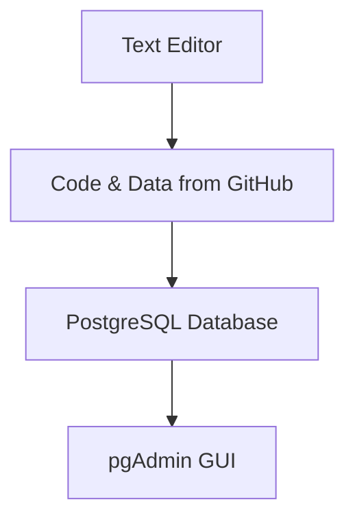
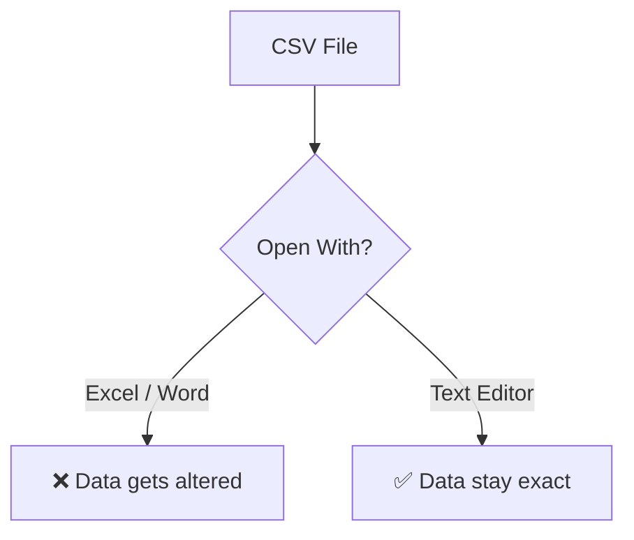
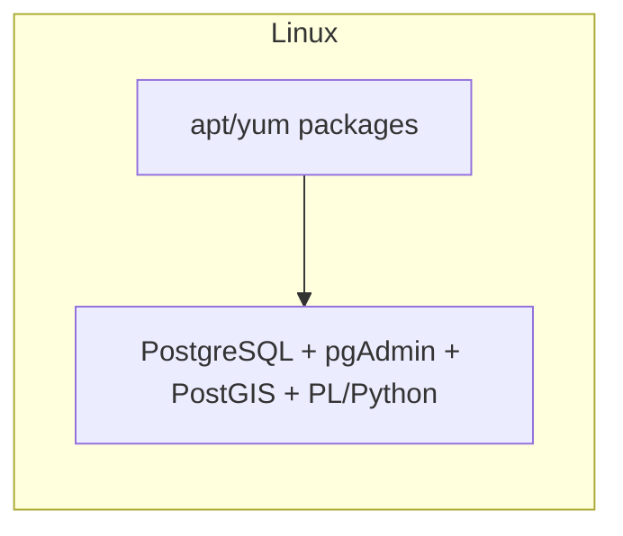

---

## Why  Text Editor?

---

PostgreSQL  **database server**. pgAdmin **graphical control panel**.

---

> "Proper planning prevents poor performance."

Setting up correctly **avoids headache later**.