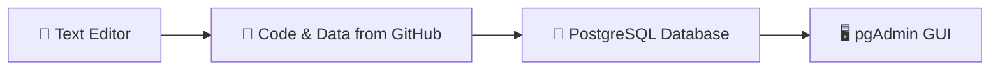
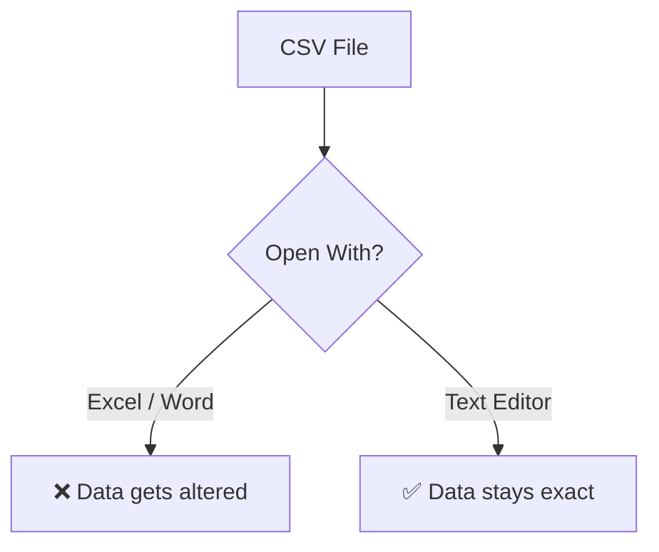
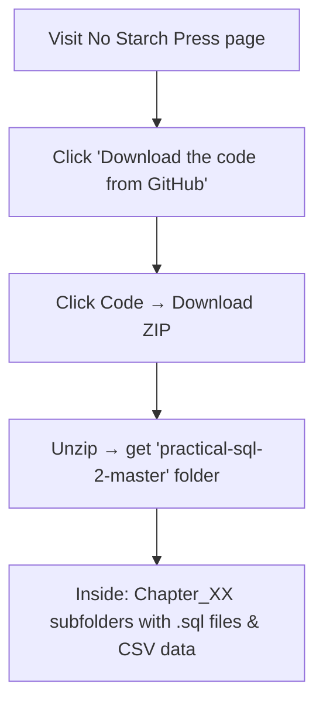
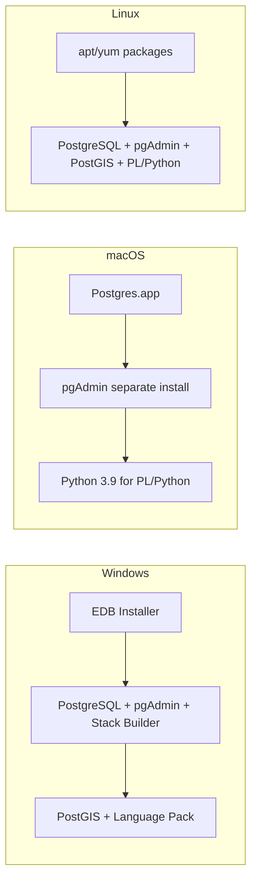
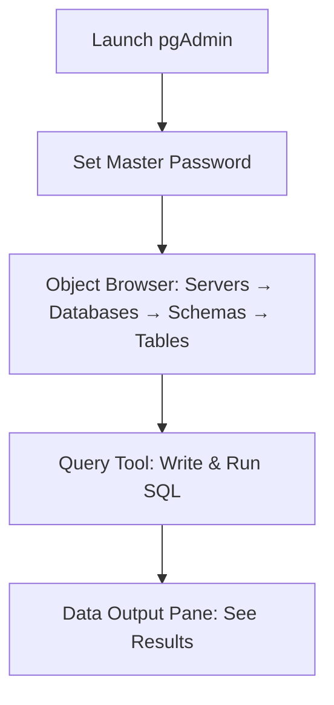
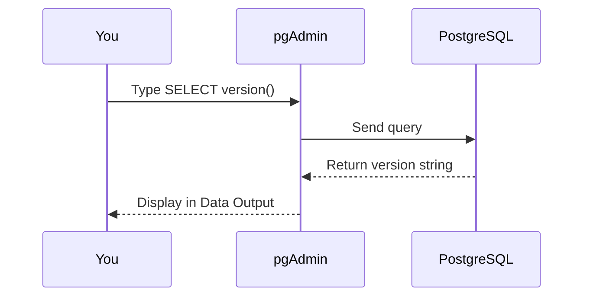
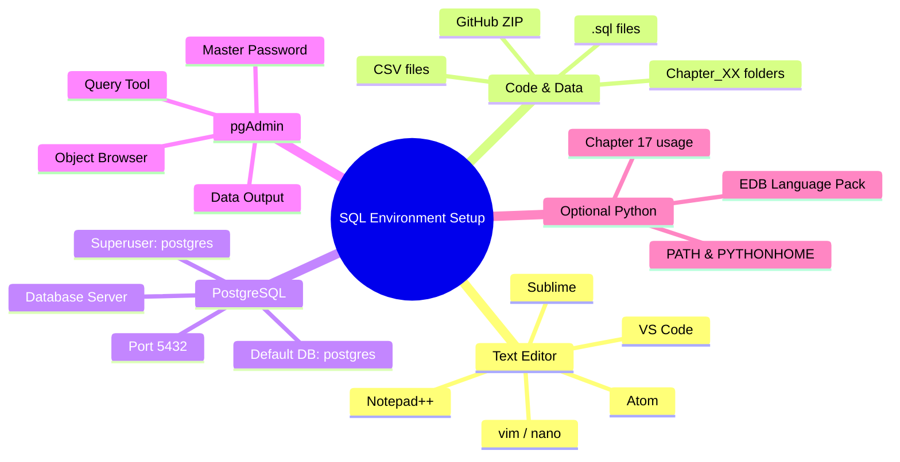

# Setting Up Your SQL Coding Environment — Explained Simply

This chapter is all about **preparing your computer** so you can practice SQL. Think of it like setting up a kitchen before cooking: you need the right tools, ingredients, and workspace before you start.

Below, I'll break down the key concepts using simple language and **Mermaid diagrams** to visualize the flow.

---

## 🧰 The Four Main Tools You Need



1. **Text Editor** — For viewing/editing CSV data files and SQL scripts safely.
2. **Code & Data** — Downloaded from GitHub (the book's example files).
3. **PostgreSQL** — The actual database engine that stores and processes data.
4. **pgAdmin** — A visual tool to manage PostgreSQL and run queries.

---

## 1️⃣ Why a Text Editor? (Not Excel or Word)

Word processors and spreadsheets **automatically change data** (e.g., turning `3-09` into `9-Mar`). That breaks CSV files.

**Text editors** treat everything as plain text — no hidden formatting, no auto-changes.



**Recommended editors:** VS Code, Atom, Sublime Text, Notepad++ (Windows), vim, GNU nano.

---

## 2️⃣ Downloading Code & Data from GitHub



> ⚠️ **Windows users:** Must give PostgreSQL permission to read/write the folder. Right-click folder → Properties → Security → Edit → Add "Everyone" → Allow all.

---

## 3️⃣ Installing PostgreSQL & pgAdmin

PostgreSQL is the **database server**. pgAdmin is the **graphical control panel**.



### Key Installation Steps (All OS)
1. Download installer.
2. Choose components (Server, pgAdmin, Stack Builder, Command Line Tools).
3. Set a **superuser password** (for `postgres` account).
4. Choose port **5432** (default).
5. Finish → Launch Stack Builder → Install PostGIS & Language Pack.

> 💡 **Python support** is optional (for Chapter 17). You set environment variables `PATH` and `PYTHONHOME` pointing to `C:\edb\languagepack\v2\Python-3.9`.

---

## 4️⃣ Working with pgAdmin

pgAdmin is your **visual workspace** for PostgreSQL.



### Connecting to the Default Database
- Expand **Servers** → double-click server → enter DB password.
- Expand **Databases** → **postgres** → **Schemas** → **public**.

### Running Your First Query
```sql
SELECT version();
```
This returns your PostgreSQL version (e.g., `PostgreSQL 13.3`).



---

## 🧠 Key Concept Map (Everything Connected)



---

## ✅ Summary Checklist

| Step | Task | Done? |
|------|------|-------|
| 1 | Install a text editor | ☐ |
| 2 | Download code & data from GitHub | ☐ |
| 3 | Install PostgreSQL + pgAdmin | ☐ |
| 4 | (Optional) Set up Python support | ☐ |
| 5 | Launch pgAdmin & connect to `postgres` | ☐ |
| 6 | Run `SELECT version();` | ☐ |

---

## 🎯 Why This Matters

> "Proper planning prevents poor performance."

Setting up correctly **avoids headaches later**. Once your environment is ready, you can focus entirely on **learning SQL** — creating databases, loading data, and writing queries to analyze data.

In **Chapter 2**, you'll create your own database and table, then load data to explore. 🚀