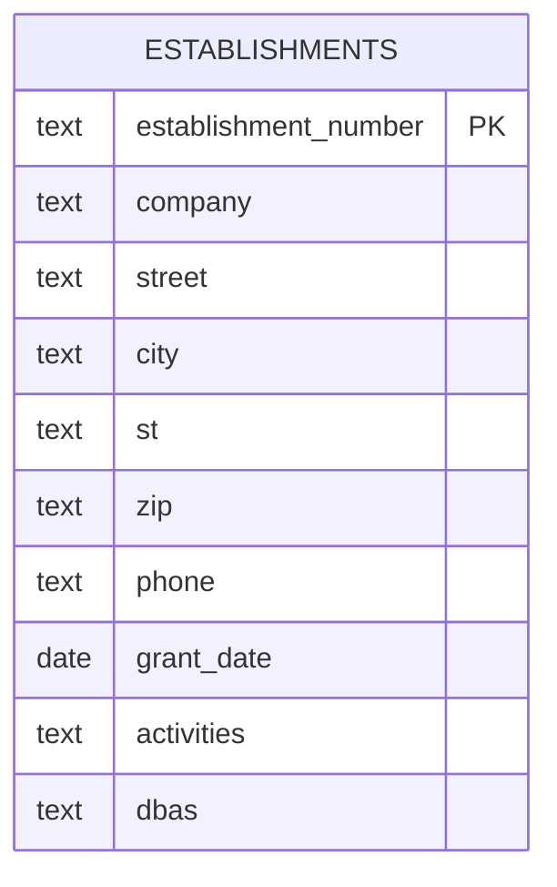
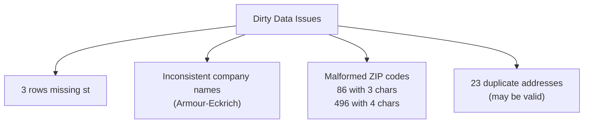
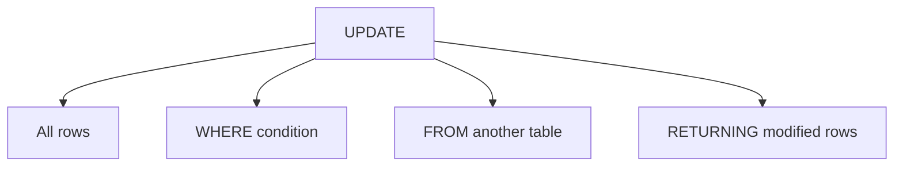
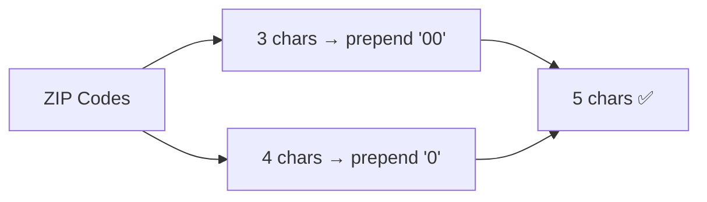
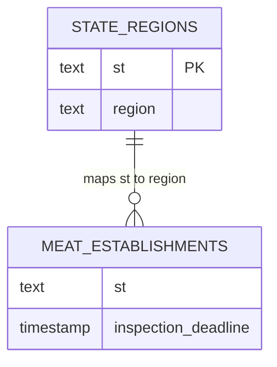
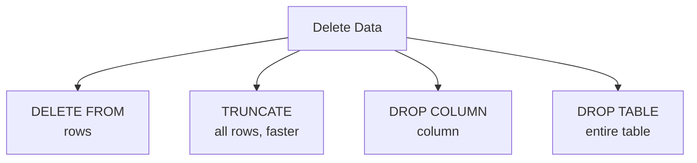
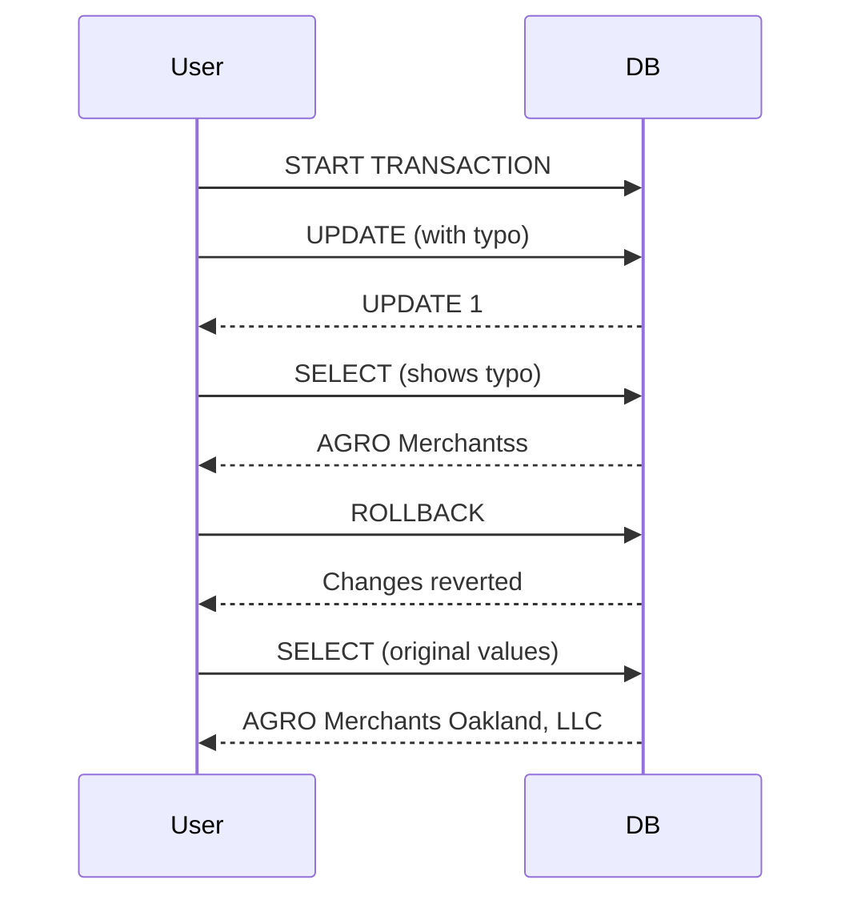
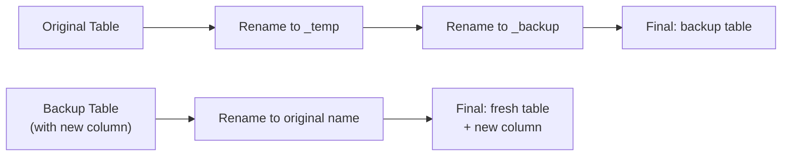
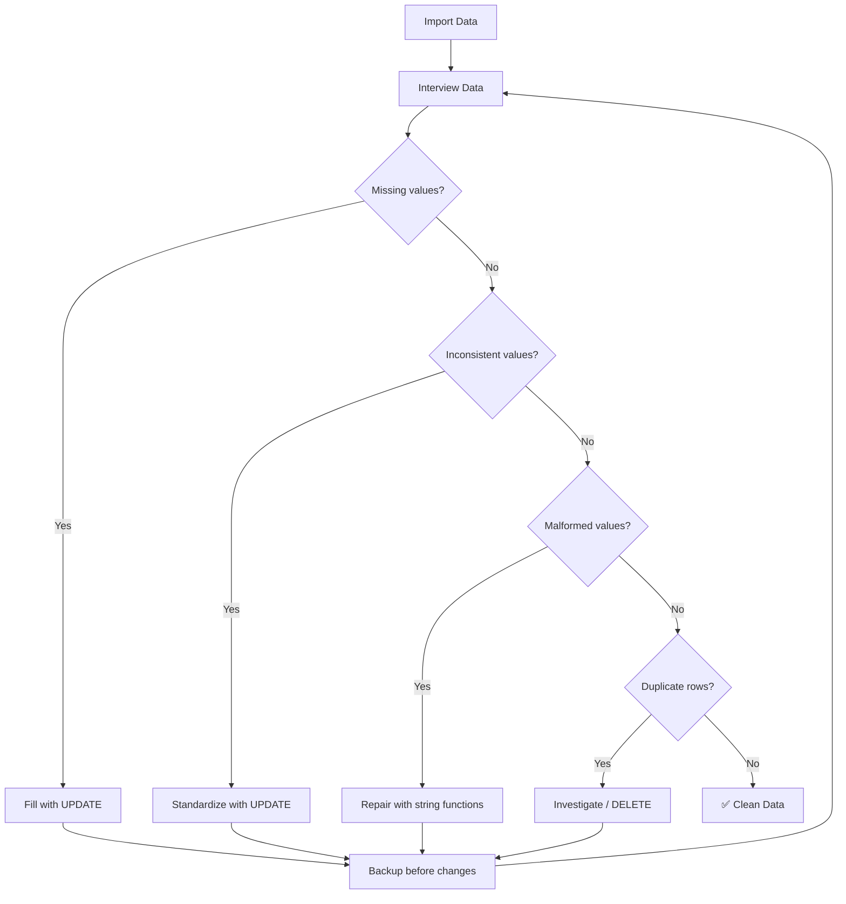

# Inspecting and Modifying Data — Concepts, Tables & Diagrams

Below is a complete breakdown of Chapter 10, covering dirty data, data interviewing, `ALTER TABLE`, `UPDATE`, `DELETE`, transactions, and performance considerations.

---

## 1. Chapter Overview

| Topic | Purpose |
|---|---|
| **Dirty Data** | Data with errors, missing values, or poor organization |
| **Interviewing Data** | Discovering what the dataset holds and its limitations |
| **ALTER TABLE** | Modify table structure (add/drop/alter columns) |
| **UPDATE** | Modify values in columns |
| **DELETE / TRUNCATE / DROP** | Remove rows, columns, or tables |
| **Transactions** | Save or revert changes safely |
| **Performance** | Efficiently update large tables |

---

## 2. The FSIS Meat, Poultry, and Egg Producers Dataset

### Table: `meat_poultry_egg_establishments`

| Column | Type | Notes |
|---|---|---|
| `establishment_number` | text PRIMARY KEY | Natural key; unique establishment ID |
| `company` | text | Company name |
| `street` | text | Street address |
| `city` | text | City |
| `st` | text | State code (some NULLs!) |
| `zip` | text | ZIP code (some malformed!) |
| `phone` | text | Phone number |
| `grant_date` | date | Date granted |
| `activities` | text | Activities at company |
| `dbas` | text | "Doing business as" names (up to 1GB) |

| Metric | Value |
|---|---|
| Row count | 6,287 |
| Index | `company_idx` on `company` |
| Backup table | `meat_poultry_egg_establishments_backup` |



---

## 3. Interviewing the Dataset — Discovering Issues

### Issue 1: Multiple Companies at Same Address

```sql
SELECT company, street, city, st, count(*) AS address_count
FROM meat_poultry_egg_establishments
GROUP BY company, street, city, st
HAVING count(*) > 1
ORDER BY company, street, city, st;
```

| company | street | city | st | address_count |
|---|---|---|---|---|
| Acre Station Meat Farm | 17076 Hwy 32 N | Pinetown | NC | 2 |
| Beltex Corporation | 3801 North Grove Street | Fort Worth | TX | 2 |
| Cloverleaf Cold Storage | 111 Imperial Drive | Sanford | NC | 2 |
| ... | ... | ... | ... | ... |

> Returns 23 rows — may be valid or data entry errors.

### Issue 2: Missing State Values

```sql
SELECT st, count(*) AS st_count
FROM meat_poultry_egg_establishments
GROUP BY st
ORDER BY st;
```

| st | st_count |
|---|---|
| AK | 17 |
| AL | 93 |
| AR | 87 |
| AS | 1 |
| ... | ... |
| WY | 1 |
| NULL | 3 |

> 3 rows have NULL in `st`.

```sql
SELECT establishment_number, company, city, st, zip
FROM meat_poultry_egg_establishments
WHERE st IS NULL;
```

| establishment_number | company | city | st | zip |
|---|---|---|---|---|
| V18677A | Atlas Inspection, Inc. | Blaine | NULL | 55449 |
| M45319+P45319 | Hall-Namie Packing Company, Inc | NULL | NULL | 36671 |
| M263A+P263A+V263A | Jones Dairy Farm | NULL | NULL | 53538 |

### Issue 3: Inconsistent Company Name Spellings

```sql
SELECT company, count(*) AS company_count
FROM meat_poultry_egg_establishments
GROUP BY company
ORDER BY company ASC;
```

| company | company_count |
|---|---|
| Armour - Eckrich Meats, LLC | 1 |
| Armour-Eckrich Meats LLC | 3 |
| Armour-Eckrich Meats, Inc. | 1 |
| Armour-Eckrich Meats, LLC | 2 |

> 4 different spellings for the same company.

### Issue 4: Malformed ZIP Codes (Missing Leading Zeros)

```sql
SELECT length(zip), count(*) AS length_count
FROM meat_poultry_egg_establishments
GROUP BY length(zip)
ORDER BY length(zip) ASC;
```

| length | length_count |
|---|---|
| 3 | 86 |
| 4 | 496 |
| 5 | 5,705 |

```sql
SELECT st, count(*) AS st_count
FROM meat_poultry_egg_establishments
WHERE length(zip) < 5
GROUP BY st
ORDER BY st ASC;
```

| st | st_count |
|---|---|
| CT | 55 |
| MA | 101 |
| ME | 24 |
| NH | 18 |
| NJ | 244 |
| PR | 84 |
| RI | 27 |
| VI | 2 |
| VT | 27 |

### Summary of Data Issues



---

## 4. ALTER TABLE — Modifying Table Structure

| Operation | Syntax |
|---|---|
| Add column | `ALTER TABLE table ADD COLUMN column data_type;` |
| Drop column | `ALTER TABLE table DROP COLUMN column;` |
| Change data type | `ALTER TABLE table ALTER COLUMN column SET DATA TYPE data_type;` |
| Add NOT NULL | `ALTER TABLE table ALTER COLUMN column SET NOT NULL;` |
| Drop NOT NULL | `ALTER TABLE table ALTER COLUMN column DROP NOT NULL;` |
| Rename table | `ALTER TABLE table RENAME TO new_name;` |

> ⚠️ **Warning**: Dropping a column gives no warning — data is gone. Adding a constraint checks all rows (slow on large tables).

---

## 5. UPDATE — Modifying Values

### Basic Syntax

| Scenario | Syntax |
|---|---|
| Update all rows | `UPDATE table SET column = value;` |
| Update multiple columns | `UPDATE table SET col_a = val_a, col_b = val_b;` |
| Update with condition | `UPDATE table SET column = value WHERE criteria;` |
| Update with RETURNING | `UPDATE table SET column = value RETURNING col_a, col_b;` |

### Updating from Another Table (ANSI)

```sql
UPDATE table
SET column = (SELECT column FROM table_b WHERE table.column = table_b.column)
WHERE EXISTS (SELECT column FROM table_b WHERE table.column = table_b.column);
```

### Updating from Another Table (PostgreSQL)

```sql
UPDATE table
SET column = table_b.column
FROM table_b
WHERE table.column = table_b.column;
```



---

## 6. Creating Backup Tables

```sql
CREATE TABLE meat_poultry_egg_establishments_backup AS
SELECT * FROM meat_poultry_egg_establishments;
```

| Check | Result |
|---|---|
| Original count | 6,287 |
| Backup count | 6,287 |
| Match? | ✅ Yes |

> ⚠️ **Note**: Indexes are **not** copied to the backup table.

---

## 7. Fixing Data Issues

### Fix 1: Restoring Missing State Values

#### Step 1 — Create `st_copy` column

```sql
ALTER TABLE meat_poultry_egg_establishments ADD COLUMN st_copy text;
UPDATE meat_poultry_egg_establishments SET st_copy = st;
```

#### Step 2 — Verify copy

```sql
SELECT st, st_copy
FROM meat_poultry_egg_establishments
WHERE st IS DISTINCT FROM st_copy
ORDER BY st;
```

> Returns 0 rows → values match.

#### Step 3 — Update missing states

```sql
UPDATE meat_poultry_egg_establishments SET st = 'MN' WHERE establishment_number = 'V18677A';
UPDATE meat_poultry_egg_establishments SET st = 'AL' WHERE establishment_number = 'M45319+P45319';
UPDATE meat_poultry_egg_establishments SET st = 'WI' WHERE establishment_number = 'M263A+P263A+V263A'
RETURNING establishment_number, company, city, st, zip;
```

| establishment_number | company | city | st | zip |
|---|---|---|---|---|
| M263A+P263A+V263A | Jones Dairy Farm | | WI | 53538 |

### Fix 2: Standardizing Company Names

```sql
ALTER TABLE meat_poultry_egg_establishments ADD COLUMN company_standard text;
UPDATE meat_poultry_egg_establishments SET company_standard = company;

UPDATE meat_poultry_egg_establishments
SET company_standard = 'Armour-Eckrich Meats'
WHERE company LIKE 'Armour%'
RETURNING company, company_standard;
```

| company | company_standard |
|---|---|
| Armour-Eckrich Meats LLC | Armour-Eckrich Meats |
| Armour - Eckrich Meats, LLC | Armour-Eckrich Meats |
| Armour-Eckrich Meats LLC | Armour-Eckrich Meats |
| Armour-Eckrich Meats LLC | Armour-Eckrich Meats |
| Armour-Eckrich Meats, Inc. | Armour-Eckrich Meats |
| Armour-Eckrich Meats, LLC | Armour-Eckrich Meats |
| Armour-Eckrich Meats, LLC | Armour-Eckrich Meats |

### Fix 3: Repairing ZIP Codes with Concatenation

#### Create `zip_copy`

```sql
ALTER TABLE meat_poultry_egg_establishments ADD COLUMN zip_copy text;
UPDATE meat_poultry_egg_establishments SET zip_copy = zip;
```

#### Restore two leading zeros (PR, VI)

```sql
UPDATE meat_poultry_egg_establishments
SET zip = '00' || zip
WHERE st IN('PR','VI') AND length(zip) = 3;
```

> Returns `UPDATE 86`

#### Restore one leading zero (Northeast states)

```sql
UPDATE meat_poultry_egg_establishments
SET zip = '0' || zip
WHERE st IN('CT','MA','ME','NH','NJ','RI','VT') AND length(zip) = 4;
```

> Returns `UPDATE 496`

#### Verify

| length | count |
|---|---|
| 5 | 6,287 |



---

## 8. Restoring Original Values

| Method | Syntax |
|---|---|
| From column copy | `UPDATE table SET st = st_copy;` |
| From backup table | `UPDATE table original SET st = backup.st FROM backup_table backup WHERE original.id = backup.id;` |

---

## 9. Updating Values Across Tables

### Create `state_regions` table

```sql
CREATE TABLE state_regions (
    st text CONSTRAINT st_key PRIMARY KEY,
    region text NOT NULL
);

COPY state_regions
FROM 'C:\YourDirectory\state_regions.csv'
WITH (FORMAT CSV, HEADER);
```

### Add `inspection_deadline` column

```sql
ALTER TABLE meat_poultry_egg_establishments
ADD COLUMN inspection_deadline timestamp with time zone;

UPDATE meat_poultry_egg_establishments establishments
SET inspection_deadline = '2022-12-01 00:00 EST'
WHERE EXISTS (SELECT state_regions.region
              FROM state_regions
              WHERE establishments.st = state_regions.st
              AND state_regions.region = 'New England');
```

> Returns `UPDATE 252` (New England companies)

### Verify

```sql
SELECT st, inspection_deadline
FROM meat_poultry_egg_establishments
GROUP BY st, inspection_deadline
ORDER BY st;
```

| st | inspection_deadline |
|---|---|
| CA | NULL |
| CO | NULL |
| CT | 2022-12-01 00:00:00-05 |
| DC | NULL |
| ... | ... |



---

## 10. Deleting Data

| Operation | Syntax | Notes |
|---|---|---|
| Delete rows (all) | `DELETE FROM table_name;` | Scans entire table |
| Delete rows (conditional) | `DELETE FROM table_name WHERE expression;` | |
| Truncate | `TRUNCATE table_name;` | Faster; skips scan |
| Truncate + reset IDENTITY | `TRUNCATE table_name RESTART IDENTITY;` | |
| Drop column | `ALTER TABLE table_name DROP COLUMN column_name;` | |
| Drop table | `DROP TABLE table_name;` | |

### Example: Delete Territories

```sql
DELETE FROM meat_poultry_egg_establishments
WHERE st IN('AS','GU','MP','PR','VI');
```

> Returns `DELETE 105`

### Example: Drop `zip_copy` column

```sql
ALTER TABLE meat_poultry_egg_establishments DROP COLUMN zip_copy;
```

### Example: Drop backup table

```sql
DROP TABLE meat_poultry_egg_establishments_backup;
```



---

## 11. Transactions — Save or Revert Changes

### Transaction Keywords

| Keyword | Purpose |
|---|---|
| `START TRANSACTION` / `BEGIN` | Start transaction block |
| `COMMIT` | Save all changes |
| `ROLLBACK` | Revert all changes |

### Example: Transaction Block with Mistake

```sql
START TRANSACTION;

UPDATE meat_poultry_egg_establishments
SET company = 'AGRO Merchantss Oakland LLC'  -- intentional typo
WHERE company = 'AGRO Merchants Oakland, LLC';

SELECT company
FROM meat_poultry_egg_establishments
WHERE company LIKE 'AGRO%'
ORDER BY company;

ROLLBACK;
```

#### After UPDATE (before ROLLBACK)

| company |
|---|
| AGRO Merchants Oakland LLC |
| AGRO Merchants Oakland LLC |
| AGRO Merchantss Oakland LLC |

#### After ROLLBACK

| company |
|---|
| AGRO Merchants Oakland LLC |
| AGRO Merchants Oakland LLC |
| AGRO Merchants Oakland, LLC |



> ⚠️ **Note**: Changes aren't visible to other users until `COMMIT`.

---

## 12. Improving Performance When Updating Large Tables

### Problem

| Issue | Detail |
|---|---|
| Adding column + UPDATE | Creates new row versions; old versions not deleted |
| Result | Table size roughly doubles |
| For large tables | Substantial disk usage and time |

### Solution: Copy Table with New Column

```sql
CREATE TABLE meat_poultry_egg_establishments_backup AS
SELECT *,
       '2023-02-14 00:00 EST'::timestamp with time zone AS reviewed_date
FROM meat_poultry_egg_establishments;
```

### Swap Table Names

```sql
ALTER TABLE meat_poultry_egg_establishments
RENAME TO meat_poultry_egg_establishments_temp;

ALTER TABLE meat_poultry_egg_establishments_backup
RENAME TO meat_poultry_egg_establishments;

ALTER TABLE meat_poultry_egg_establishments_temp
RENAME TO meat_poultry_egg_establishments_backup;
```



---

## 13. Complete Data Cleaning Workflow



---

## 14. Key Takeaways

| # | Takeaway |
|---|---|
| 1 | **Dirty data** has errors, missing values, or poor organization. |
| 2 | **Interview** your data first: counts, distinct values, lengths, NULLs. |
| 3 | Use `GROUP BY` + `HAVING` to find duplicates and inconsistencies. |
| 4 | Use `length()` to find malformed values (e.g., ZIP codes). |
| 5 | **Always back up** tables before making changes. |
| 6 | `ALTER TABLE` adds, drops, or modifies columns and constraints. |
| 7 | `UPDATE` modifies values; use `WHERE` to target rows. |
| 8 | `RETURNING` shows modified rows without a second query. |
| 9 | Use `||` (concatenation) to fix string values. |
| 10 | `IS DISTINCT FROM` compares values treating NULL as known. |
| 11 | Update across tables using `FROM` (PostgreSQL) or subqueries (ANSI). |
| 12 | `DELETE FROM` removes rows; `TRUNCATE` is faster for all rows. |
| 13 | `DROP COLUMN` / `DROP TABLE` permanently remove data. |
| 14 | **Transactions** (`START TRANSACTION`, `COMMIT`, `ROLLBACK`) let you test changes safely. |
| 15 | For large tables, **copy + rename** instead of adding column + UPDATE. |
| 16 | Read the data documentation — conventions like `-1`/`-3` matter. |