# Statistical Functions in SQL — Concepts, Tables & Diagrams

Below is a complete breakdown of Chapter 11, covering correlation, regression, ranking, rates, and rolling averages with Markdown tables and Mermaid diagrams.

---

## 1. Chapter Overview

| Topic | Purpose |
|---|---|
| **Correlation** | Measure relationship strength/direction between two variables |
| **Regression** | Predict values using best-fit line |
| **r-Squared** | Measure how much variation is explained |
| **Variance / Standard Deviation** | Measure dispersion of values |
| **Rankings** | `rank()`, `dense_rank()`, `PARTITION BY` |
| **Rates** | Normalize counts for fair comparisons |
| **Rolling Averages** | Smooth uneven time-series data |

---

## 2. The Census Stats Table

### Table: `acs_2014_2018_stats`

| Column | Type | Description |
|---|---|---|
| `geoid` | text PRIMARY KEY | Unique geographic ID |
| `county` | text NOT NULL | County name |
| `st` | text NOT NULL | State name |
| `pct_travel_60_min` | numeric(5,2) | % workers commuting >60 min |
| `pct_bachelors_higher` | numeric(5,2) | % adults 25+ with bachelor's+ |
| `pct_masters_higher` | numeric(5,2) | % adults 25+ with master's+ |
| `median_hh_income` | integer | Median household income (2018 $) |
| **CHECK** | — | `pct_masters_higher <= pct_bachelors_higher` |

| Metric | Value |
|---|---|
| Row count | 3,142 (one per US county) |
| Data source | 2014–2018 American Community Survey 5-Year Estimates |

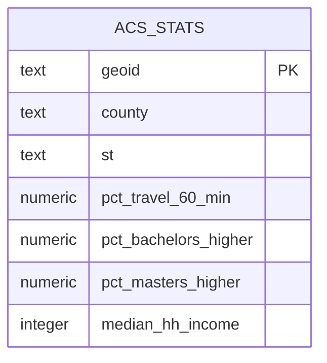

---

## 3. Correlation with `corr(Y, X)`

### Interpretation Guidelines (Table 11-1)

| Correlation coefficient (+/−) | What it could mean |
|---|---|
| 0 | No relationship |
| .01 to .29 | Weak relationship |
| .3 to .59 | Moderate relationship |
| .6 to .99 | Strong to nearly perfect relationship |
| 1 | Perfect relationship |

### Correlation Examples

| Query | Result | Interpretation |
|---|---|---|
| `corr(median_hh_income, pct_bachelors_higher)` | 0.70 | Strong positive relationship |
| `corr(pct_travel_60_min, median_hh_income)` | 0.06 | Practically zero |
| `corr(pct_travel_60_min, pct_bachelors_higher)` | -0.14 | Weak inverse relationship |

```sql
SELECT
    round(corr(median_hh_income, pct_bachelors_higher)::numeric, 2)
        AS bachelors_income_r,
    round(corr(pct_travel_60_min, median_hh_income)::numeric, 2)
        AS income_travel_r,
    round(corr(pct_travel_60_min, pct_bachelors_higher)::numeric, 2)
        AS bachelors_travel_r
FROM acs_2014_2018_stats;
```

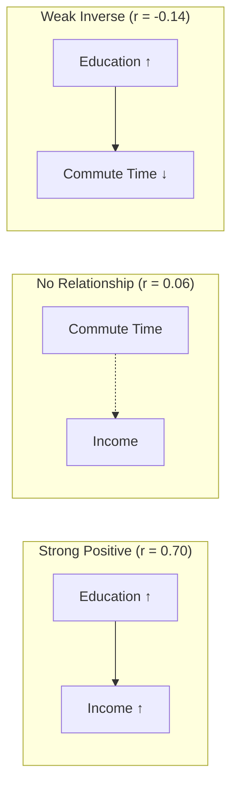

> ⚠️ **Caveats**: Correlation ≠ Causation. Always perform significance testing.

---

## 4. Regression Analysis

### Regression Line Equation

$$Y = bX + a$$

| Symbol | Meaning |
|---|---|
| `Y` | Predicted value (dependent variable) |
| `b` | Slope (change in Y per unit X) |
| `X` | Independent variable |
| `a` | Y-intercept (value when X = 0) |

### SQL Regression Functions

| Function | Purpose |
|---|---|
| `regr_slope(Y, X)` | Returns slope `b` |
| `regr_intercept(Y, X)` | Returns y-intercept `a` |
| `regr_r2(Y, X)` | Returns r-squared (coefficient of determination) |

### Example: Education vs. Income

```sql
SELECT
    round(regr_slope(median_hh_income, pct_bachelors_higher)::numeric, 2) AS slope,
    round(regr_intercept(median_hh_income, pct_bachelors_higher)::numeric, 2) AS y_intercept
FROM acs_2014_2018_stats;
```

| slope | y_intercept |
|---|---|
| 1016.55 | 29651.42 |

### Prediction: 30% with Bachelor's Degree

$$Y = 1016.55(30) + 29651.42 = 60147.92$$

> **Predicted median household income ≈ $60,148**

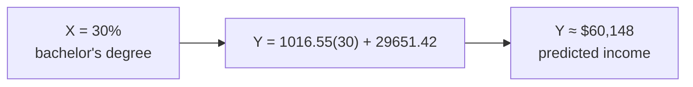

---

## 5. r-Squared — Coefficient of Determination

```sql
SELECT round(regr_r2(median_hh_income, pct_bachelors_higher)::numeric, 3)
AS r_squared
FROM acs_2014_2018_stats;
```

| r_squared | Interpretation |
|---|---|
| 0.490 | 49% of income variation explained by education |

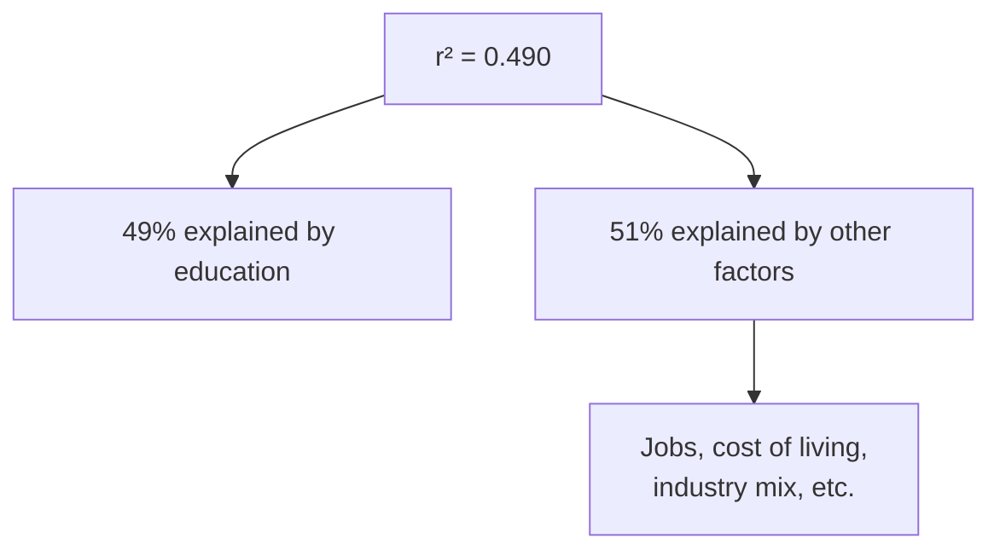

> ⚠️ **Remember**: Correlation doesn't prove causality. Test for significance.

---

## 6. Variance and Standard Deviation

| Function | Purpose |
|---|---|
| `var_pop(numeric)` | Population variance |
| `var_samp(numeric)` | Sample variance |
| `stddev_pop(numeric)` | Population standard deviation |
| `stddev_samp(numeric)` | Sample standard deviation |

### Key Differences

| Measure | Units | Use Case |
|---|---|---|
| **Variance** | Squared units | Finance (volatility) |
| **Standard Deviation** | Same as data | Normal distributions |

### Normal Distribution Rule

| Range | % of Values |
|---|---|
| ±1 standard deviation | ~66% |
| ±2 standard deviations | ~95% |

> Example: Average US women's height = 65.5 in, SD = 2.5 in → ~2/3 between 63–68 in.

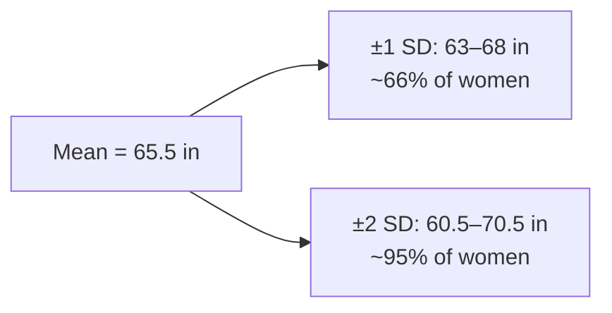

---

## 7. Rankings with `rank()` and `dense_rank()`

### Key Difference

| Function | Tie Behavior | Example (tie at 3rd) |
|---|---|---|
| `rank()` | Skips next rank | 1, 2, 3, 3, **5**, 6 |
| `dense_rank()` | No gap | 1, 2, 3, 3, **4**, 5 |

### Example: Widget Companies

| company | widget_output | rank | dense_rank |
|---|---|---|---|
| Miles Amalgamated | 620,000 | 1 | 1 |
| Arthur Industries | 244,000 | 2 | 2 |
| Fischer Worldwide | 201,000 | 3 | 3 |
| Saito Widget Co. | 201,000 | 3 | 3 |
| Dream Widget Inc. | 196,000 | **5** | **4** |
| Ariadne Widget Masters | 143,000 | 6 | 5 |
| Mal Inc. | 133,000 | 7 | 6 |
| Dom Widgets | 125,000 | 8 | 7 |

```sql
SELECT
    company,
    widget_output,
    rank() OVER (ORDER BY widget_output DESC),
    dense_rank() OVER (ORDER BY widget_output DESC)
FROM widget_companies
ORDER BY widget_output DESC;
```

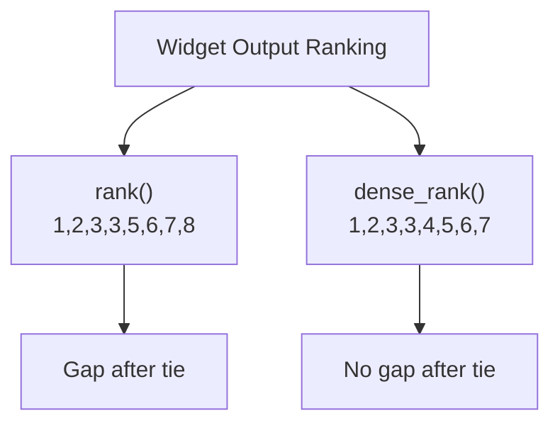

> **Recommendation**: Use `rank()` — it reflects total companies ahead.

---

## 8. Ranking Within Subgroups with `PARTITION BY`

### Table: `store_sales`

| store | category | unit_sales |
|---|---|---|
| Broders | Cereal | 1104 |
| Wallace | Ice Cream | 1863 |
| Broders | Ice Cream | 2517 |
| Cramers | Ice Cream | 2112 |
| Broders | Beer | 641 |
| Cramers | Cereal | 1003 |
| Cramers | Beer | 640 |
| Wallace | Cereal | 980 |
| Wallace | Beer | 988 |

```sql
SELECT
    category,
    store,
    unit_sales,
    rank() OVER (PARTITION BY category ORDER BY unit_sales DESC)
FROM store_sales
ORDER BY category, rank() OVER (PARTITION BY category ORDER BY unit_sales DESC);
```

### Result

| category | store | unit_sales | rank |
|---|---|---|---|
| Beer | Wallace | 988 | 1 |
| Beer | Broders | 641 | 2 |
| Beer | Cramers | 640 | 3 |
| Cereal | Broders | 1104 | 1 |
| Cereal | Cramers | 1003 | 2 |
| Cereal | Wallace | 980 | 3 |
| Ice Cream | Broders | 2517 | 1 |
| Ice Cream | Cramers | 2112 | 2 |
| Ice Cream | Wallace | 1863 | 3 |

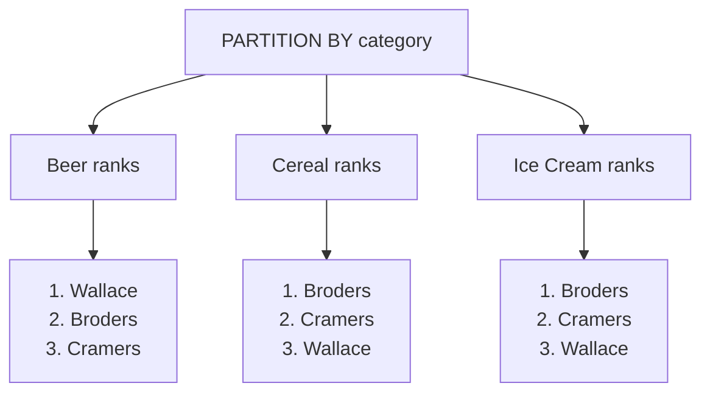

---

## 9. Calculating Rates for Meaningful Comparisons

### Why Rates Matter

| State | Births (2019) | Population | Fertility Rate |
|---|---|---|---|
| Texas | 377,599 | ~29M | 62.5 per 1,000 |
| Utah | 46,826 | ~3.2M | 66.7 per 1,000 |

> Despite fewer births, Utah has a **higher** fertility rate.

### Rate Formula

$$\text{Rate per 1,000} = \frac{\text{Count}}{\text{Population}} \times 1000$$

### Example: Tourism Businesses per 1,000 Population

```sql
SELECT
    cbp.county,
    cbp.st,
    cbp.establishments,
    pop.pop_est_2018,
    round((cbp.establishments::numeric / pop.pop_est_2018) * 1000, 1)
        AS estabs_per_1000
FROM cbp_naics_72_establishments cbp
JOIN us_counties_pop_est_2019 pop
    ON cbp.state_fips = pop.state_fips
    AND cbp.county_fips = pop.county_fips
WHERE pop.pop_est_2018 >= 50000
ORDER BY cbp.establishments::numeric / pop.pop_est_2018 DESC;
```

### Top Results

| county | st | establishments | pop_est_2018 | estabs_per_1000 |
|---|---|---|---|---|
| Cape May County | New Jersey | 925 | 92,446 | 10.0 |
| Worcester County | Maryland | 453 | 51,960 | 8.7 |
| Monroe County | Florida | 540 | 74,757 | 7.2 |
| Warren County | New York | 427 | 64,215 | 6.6 |
| New York County | New York | 10,428 | 1,629,055 | 6.4 |
| Hancock County | Maine | 337 | 54,734 | 6.2 |
| Sevier County | Tennessee | 570 | 97,895 | 5.8 |
| Eagle County | Colorado | 309 | 54,943 | 5.6 |

> **Insight**: Beach/resort counties dominate — makes intuitive sense.

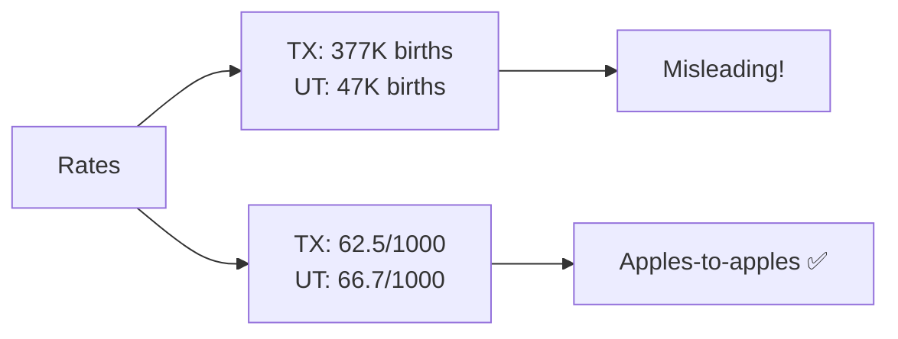

---

## 10. Smoothing Uneven Data with Rolling Averages

### Concept

A **rolling average** (moving average) calculates an average for each time period using a moving window of rows.

### Hammer Sales Example

| Date | Hammer Sales | 7-Day Average |
|---|---|---|
| 2022-05-01 | 0 | — |
| 2022-05-02 | 20 | — |
| 2022-05-03 | 15 | — |
| 2022-05-04 | 3 | — |
| 2022-05-05 | 6 | — |
| 2022-05-06 | 1 | — |
| 2022-05-07 | 1 | **6.6** |
| 2022-05-08 | 2 | **6.9** |
| 2022-05-09 | 18 | **6.6** |
| 2022-05-10 | 13 | **6.3** |
| 2022-05-11 | 2 | **6.1** |
| 2022-05-12 | 4 | **5.9** |
| 2022-05-13 | 12 | **7.4** |
| 2022-05-14 | 2 | **7.6** |

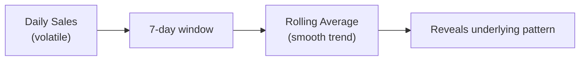

---

## 11. SQL for Rolling Averages

### Table: `us_exports`

| Column | Type |
|---|---|
| `year` | smallint |
| `month` | smallint |
| `citrus_export_value` | bigint |
| `soybeans_export_value` | bigint |

### 12-Month Rolling Average Query

```sql
SELECT year, month, citrus_export_value,
    round(
        avg(citrus_export_value)
        OVER(ORDER BY year, month
             ROWS BETWEEN 11 PRECEDING AND CURRENT ROW), 0)
    AS twelve_month_avg
FROM us_exports
ORDER BY year, month;
```

### Window Function Syntax Breakdown

| Component | Purpose |
|---|---|
| `avg(citrus_export_value)` | Aggregate to compute |
| `OVER(...)` | Defines the window |
| `ORDER BY year, month` | Sorts rows for window |
| `ROWS BETWEEN 11 PRECEDING AND CURRENT ROW` | Window size (12 rows) |

### Sample Results

| year | month | citrus_export_value | twelve_month_avg |
|---|---|---|---|
| 2019 | 9 | 14,012,305 | 74,465,440 |
| 2019 | 10 | 26,308,151 | 74,756,757 |
| 2019 | 11 | 60,885,676 | 74,853,312 |
| 2019 | 12 | 84,873,954 | 74,871,644 |
| 2020 | 1 | 110,924,836 | 75,099,275 |
| 2020 | 2 | 171,767,821 | 78,874,520 |
| 2020 | 3 | 201,231,998 | 79,593,712 |
| 2020 | 4 | 122,708,243 | 78,278,945 |
| 2020 | 5 | 75,644,260 | 77,999,174 |
| 2020 | 6 | 36,090,558 | 78,045,059 |
| 2020 | 7 | 20,561,815 | 78,343,206 |
| 2020 | 8 | 15,510,692 | 78,376,692 |

> **Insight**: Rolling average reveals steady trend despite monthly volatility.

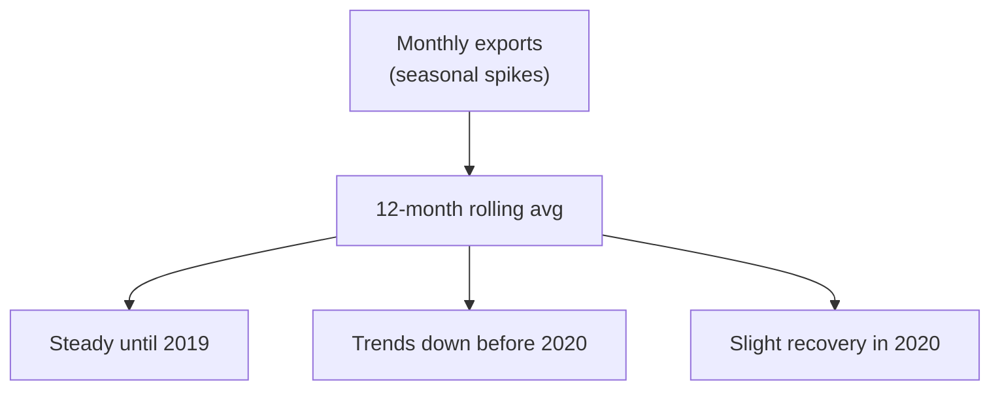

> ⚠️ **Note**: Rolling averages work best with no gaps in time periods. A missing month turns a 12-month sum into a 13-month sum.

---

## 12. Complete Statistical Functions Reference

| Function | Type | Purpose |
|---|---|---|
| `corr(Y, X)` | Binary aggregate | Pearson correlation coefficient |
| `regr_slope(Y, X)` | Binary aggregate | Regression slope |
| `regr_intercept(Y, X)` | Binary aggregate | Regression y-intercept |
| `regr_r2(Y, X)` | Binary aggregate | Coefficient of determination |
| `var_pop(numeric)` | Aggregate | Population variance |
| `var_samp(numeric)` | Aggregate | Sample variance |
| `stddev_pop(numeric)` | Aggregate | Population standard deviation |
| `stddev_samp(numeric)` | Aggregate | Sample standard deviation |
| `rank()` | Window | Rank with gaps after ties |
| `dense_rank()` | Window | Rank without gaps |
| `avg()` | Aggregate/Window | Average |
| `sum()` | Aggregate/Window | Sum |
| `round(numeric, int)` | Scalar | Round to n decimals |

---

## 13. Window Functions vs. Aggregate Functions

| Aspect | Aggregate Functions | Window Functions |
|---|---|---|
| **Output rows** | One per group | One per input row |
| **GROUP BY** | Required for grouping | Uses `OVER()` clause |
| **Use case** | Summarize groups | Rank, running totals, rolling averages |
| **Examples** | `sum()`, `avg()`, `count()` | `rank()`, `dense_rank()`, `avg() OVER(...)` |

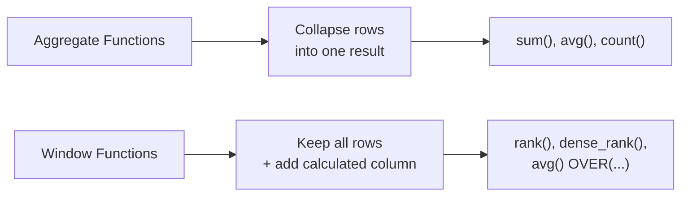

---

## 14. Key Takeaways

| # | Takeaway |
|---|---|
| 1 | `corr(Y, X)` returns Pearson r between −1 and 1. |
| 2 | Correlation ≠ Causation — always test significance. |
| 3 | Regression predicts values: `Y = bX + a`. |
| 4 | `regr_slope()` and `regr_intercept()` give the regression line. |
| 5 | `regr_r2()` tells you how much variation is explained. |
| 6 | Variance and standard deviation measure dispersion. |
| 7 | `rank()` skips numbers after ties; `dense_rank()` doesn't. |
| 8 | `PARTITION BY` creates rankings within subgroups. |
| 9 | Rates (per 1,000) allow apples-to-apples comparisons. |
| 10 | Rolling averages smooth uneven time-series data. |
| 11 | `ROWS BETWEEN 11 PRECEDING AND CURRENT ROW` defines a 12-row window. |
| 12 | Window functions keep all rows; aggregates collapse them. |
| 13 | Always read the data documentation for methodology and caveats. |
| 14 | SQL is a capable tool for preliminary statistical analysis. |