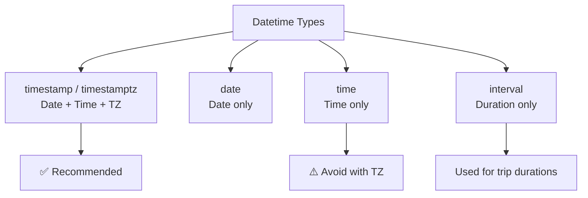
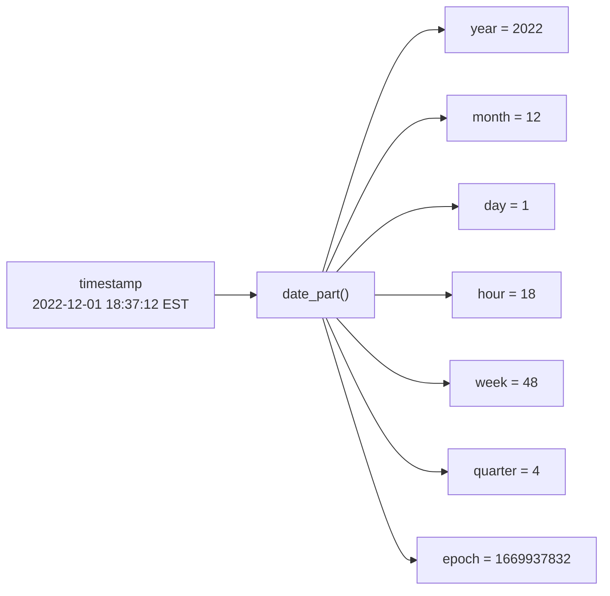
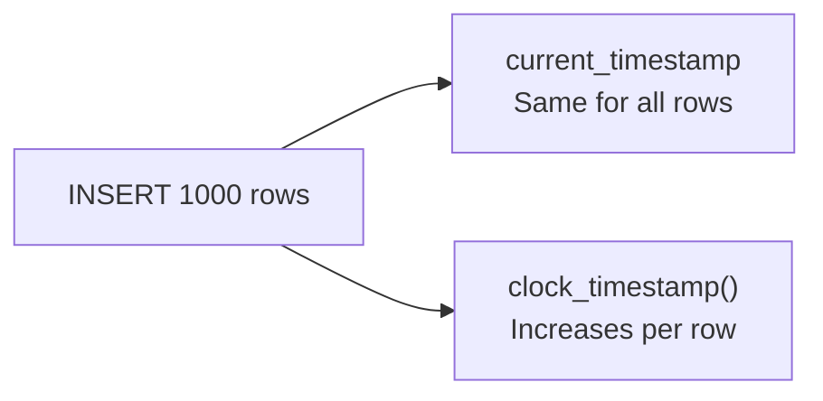
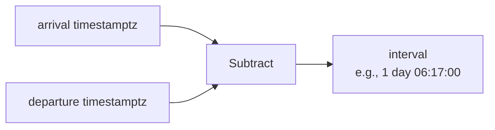
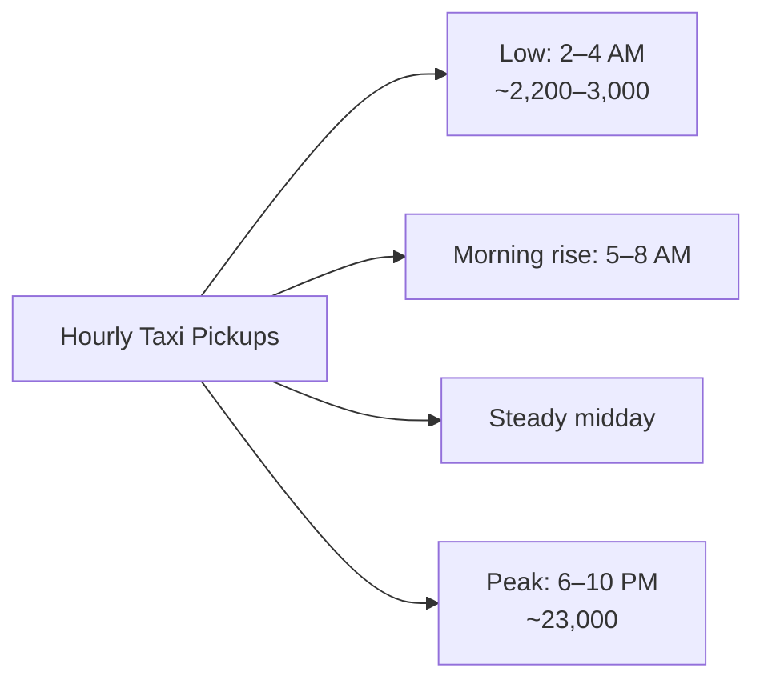
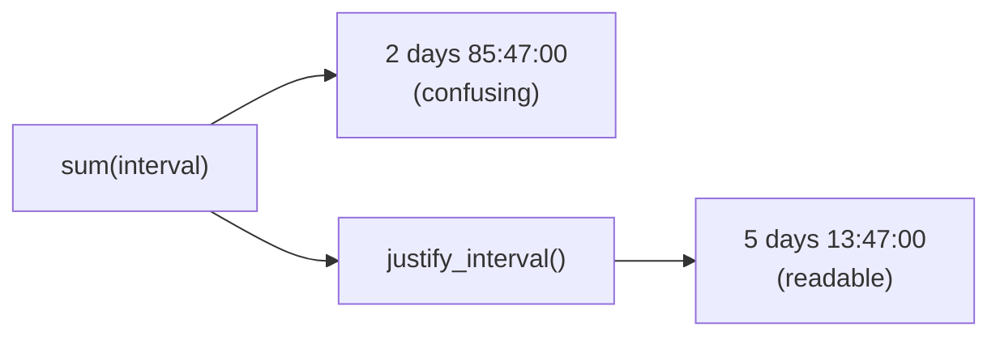

# Working with Dates and Times — Concepts, Tables & Diagrams

Below is a complete breakdown of Chapter 12, covering datetime data types, manipulation functions, time zones, arithmetic, and real-world analysis with NYC taxi and Amtrak data.

---

## 1. Chapter Overview

| Topic | Purpose |
|---|---|
| **Datetime Data Types** | `timestamp`, `date`, `time`, `interval` |
| **Extracting Components** | `date_part()`, `extract()` |
| **Creating Datetimes** | `make_date()`, `make_time()`, `make_timestamptz()` |
| **Current Time** | `current_timestamp`, `clock_timestamp()` |
| **Time Zones** | `SET TIME ZONE`, `AT TIME ZONE` |
| **Datetime Arithmetic** | Addition, subtraction, intervals |
| **Pattern Analysis** | Taxi trips by hour, trip duration |
| **Cumulative Intervals** | Window functions + `justify_interval()` |

---

## 2. Datetime Data Types

| Data Type | Records | Format | Notes |
|---|---|---|---|
| `timestamp with time zone` / `timestamptz` | Date + time + time zone | `2022-12-01 18:37:12 EST` | **Always use this** — times are comparable globally |
| `date` | Date only | `2022-09-21` (ISO 8601) | Default PostgreSQL output |
| `time` | Time only | `18:37:12` | `time with time zone` is **discouraged** |
| `interval` | Duration | `12 days`, `8 hours` | Records duration, not start/end |



> ⚠️ **Calendar rules enforced**: June 31 → error; Feb 29 valid only in leap years.

---

## 3. Extracting Components with `date_part()`

### Syntax

```sql
date_part(text, value)
```

### Components Available

| Component | Example Value | Description |
|---|---|---|
| `year` | 2022 | Year |
| `month` | 12 | Month (1–12) |
| `day` | 1 | Day of month |
| `hour` | 18 | Hour (0–23) |
| `minute` | 37 | Minute |
| `seconds` | 12 | Seconds |
| `timezone_hour` | -5 | UTC offset hours |
| `week` | 48 | ISO week number (starts Monday) |
| `quarter` | 4 | Quarter (1–4) |
| `epoch` | 1669937832 | Seconds since 1970-01-01 UTC |

### Example Query

```sql
SELECT
    date_part('year', '2022-12-01 18:37:12 EST'::timestamptz) AS year,
    date_part('month', '2022-12-01 18:37:12 EST'::timestamptz) AS month,
    date_part('day', '2022-12-01 18:37:12 EST'::timestamptz) AS day,
    date_part('hour', '2022-12-01 18:37:12 EST'::timestamptz) AS hour,
    date_part('minute', '2022-12-01 18:37:12 EST'::timestamptz) AS minute,
    date_part('seconds', '2022-12-01 18:37:12 EST'::timestamptz) AS seconds,
    date_part('timezone_hour', '2022-12-01 18:37:12 EST'::timestamptz) AS tz,
    date_part('week', '2022-12-01 18:37:12 EST'::timestamptz) AS week,
    date_part('quarter', '2022-12-01 18:37:12 EST'::timestamptz) AS quarter,
    date_part('epoch', '2022-12-01 18:37:12 EST'::timestamptz) AS epoch;
```

### Output

| year | month | day | hour | minute | seconds | tz | week | quarter | epoch |
|---|---|---|---|---|---|---|---|---|---|
| 2022 | 12 | 1 | 18 | 37 | 12 | -5 | 48 | 4 | 1669937832 |



> ⚠️ **Epoch caveats**: Double precision floating-point errors; Year 2038 problem.

### Alternative: `extract()`

```sql
extract(year from '2022-12-01 18:37:12 EST'::timestamptz)
```

| Function | Standard | Notes |
|---|---|---|
| `date_part()` | PostgreSQL-specific | Name reminds you what it does |
| `extract()` | SQL standard | Not supported in SQL Server |

---

## 4. Creating Datetimes from Components

| Function | Returns | Example |
|---|---|---|
| `make_date(year, month, day)` | `date` | `make_date(2022, 2, 22)` → `2022-02-22` |
| `make_time(hour, minute, seconds)` | `time` | `make_time(18, 4, 30.3)` → `18:04:30.3` |
| `make_timestamptz(year, month, day, hour, minute, second, tz)` | `timestamptz` | `make_timestamptz(2022, 2, 22, 18, 4, 30.3, 'Europe/Lisbon')` |

### Example Output

| Function | Result |
|---|---|
| `make_date(2022, 2, 22)` | `2022-02-22` |
| `make_time(18, 4, 30.3)` | `18:04:30.3` |
| `make_timestamptz(2022, 2, 22, 18, 4, 30.3, 'Europe/Lisbon')` | `2022-02-22 13:04:30.3-05` |

> Note: Lisbon is UTC+0; Eastern is UTC−5 in winter → 5-hour difference.

---

## 5. Current Date and Time Functions

| Function | Returns | Notes |
|---|---|---|
| `current_timestamp` / `now()` | Current timestamp with TZ | Time at **start** of query |
| `localtimestamp` | Current timestamp without TZ | ⚠️ Avoid — meaningless globally |
| `current_date` | Current date | |
| `current_time` | Current time with TZ | ⚠️ Useless without date |
| `localtime` | Current time without TZ | |
| `clock_timestamp()` | Current time as it elapses | PostgreSQL-specific; slower |

### Comparison: `current_timestamp` vs `clock_timestamp()`

```sql
CREATE TABLE current_time_example (
    time_id integer GENERATED ALWAYS AS IDENTITY,
    current_timestamp_col timestamptz,
    clock_timestamp_col timestamptz
);

INSERT INTO current_time_example
    (current_timestamp_col, clock_timestamp_col)
    (SELECT current_timestamp, clock_timestamp()
     FROM generate_series(1, 1000));
```

| Column | Behavior |
|---|---|
| `current_timestamp_col` | **Same** value for all 1,000 rows |
| `clock_timestamp_col` | **Increases** with each row inserted |



---

## 6. Working with Time Zones

### Viewing Your Time Zone

```sql
SHOW timezone;
SELECT current_setting('timezone');
```

| Result | Platform |
|---|---|
| `America/New_York` | macOS, Linux |
| `US/Eastern` | Windows |

### Time Zone Reference Tables

| Query | Returns |
|---|---|
| `SELECT * FROM pg_timezone_abbrevs ORDER BY abbrev;` | Abbreviations + UTC offsets |
| `SELECT * FROM pg_timezone_names ORDER BY name;` | Full names + offsets + DST flag |

### Filtering Time Zones

```sql
SELECT * FROM pg_timezone_names
WHERE name LIKE 'Europe%'
ORDER BY name;
```

| name | abbrev | utc_offset | is_dst |
|---|---|---|---|
| Europe/Amsterdam | CEST | 02:00:00 | true |
| Europe/Andorra | CEST | 02:00:00 | true |
| Europe/Astrakhan | +04 | 04:00:00 | false |
| Europe/Athens | EEST | 03:00:00 | true |
| Europe/Belfast | BST | 01:00:00 | true |

### Setting the Time Zone

```sql
SET TIME ZONE 'US/Pacific';

CREATE TABLE time_zone_test (
    test_date timestamptz
);

INSERT INTO time_zone_test VALUES ('2023-01-01 4:00');

SELECT test_date FROM time_zone_test;
-- Result: 2023-01-01 04:00:00-08

SET TIME ZONE 'US/Eastern';
SELECT test_date FROM time_zone_test;
-- Result: 2023-01-01 07:00:00-05

SELECT test_date AT TIME ZONE 'Asia/Seoul' FROM time_zone_test;
-- Result: 2023-01-01 21:00:00
```

### Time Zone Conversion Flow


> ⚠️ **Quirk**: `AT TIME ZONE` on a `timestamptz` returns a timestamp **without** TZ. On a timestamp without TZ, it returns **with** TZ.

> **Note**: `timestamptz` stores UTC internally; time zone setting only governs display.

---

## 7. Datetime Arithmetic

### Basic Operations

| Operation | Example | Result |
|---|---|---|
| Subtract dates | `'1929-09-30'::date - '1929-09-27'::date` | `3` (integer days) |
| Add interval to date | `'1929-09-30'::date + '5 years'::interval` | `1934-09-30` |
| Subtract timestamps | `arrival - departure` | `interval` |

### Interval Format

| Duration | PostgreSQL Format |
|---|---|
| < 24 hours | `HH:MM:SS` (e.g., `19:53:00`) |
| ≥ 24 hours | `1 day 08:28:00` |



---

## 8. NYC Yellow Taxi Data

### Table: `nyc_yellow_taxi_trips`

| Column | Type | Notes |
|---|---|---|
| `trip_id` | bigint GENERATED ALWAYS AS IDENTITY PRIMARY KEY | Surrogate key |
| `vendor_id` | text NOT NULL | |
| `tpep_pickup_datetime` | timestamptz NOT NULL | Start time |
| `tpep_dropoff_datetime` | timestamptz NOT NULL | End time |
| `passenger_count` | integer NOT NULL | |
| `trip_distance` | numeric(8,2) NOT NULL | |
| `pickup_longitude` | numeric(18,15) NOT NULL | |
| `pickup_latitude` | numeric(18,15) NOT NULL | |
| `rate_code_id` | text NOT NULL | |
| `store_and_fwd_flag` | text NOT NULL | |
| `dropoff_longitude` | numeric(18,15) NOT NULL | |
| `dropoff_latitude` | numeric(18,15) NOT NULL | |
| `payment_type` | text NOT NULL | |
| `fare_amount` | numeric(9,2) NOT NULL | |
| `extra` | numeric(9,2) NOT NULL | |
| `mta_tax` | numeric(5,2) NOT NULL | |
| `tip_amount` | numeric(9,2) NOT NULL | |
| `tolls_amount` | numeric(9,2) NOT NULL | |
| `improvement_surcharge` | numeric(9,2) NOT NULL | |
| `total_amount` | numeric(9,2) NOT NULL | |

| Metric | Value |
|---|---|
| Row count | 368,774 (June 1, 2016) |
| Index | `tpep_pickup_idx` on `tpep_pickup_datetime` |
| UTC offset | -4 (Eastern Daylight Time) |

### Busiest Time of Day

```sql
SELECT
    date_part('hour', tpep_pickup_datetime) AS trip_hour,
    count(*)
FROM nyc_yellow_taxi_trips
GROUP BY trip_hour
ORDER BY trip_hour;
```

| trip_hour | count | | trip_hour | count |
|---|---|---|---|---|
| 0 | 8,182 | | 12 | 18,031 |
| 1 | 5,003 | | 13 | 17,998 |
| 2 | 3,070 | | 14 | 19,125 |
| 3 | 2,275 | | 15 | 18,053 |
| 4 | 2,229 | | 16 | 15,069 |
| 5 | 3,925 | | 17 | 18,513 |
| 6 | 10,825 | | 18 | 22,689 |
| 7 | 18,287 | | 19 | 23,190 |
| 8 | 21,062 | | 20 | 23,098 |
| 9 | 18,975 | | 21 | 24,106 |
| 10 | 17,367 | | 22 | 22,554 |
| 11 | 17,383 | | 23 | 17,765 |

> **Pattern**: Peak hours 6 PM–10 PM; lowest 2 AM–4 AM.



### Median Trip Time by Hour

```sql
SELECT
    date_part('hour', tpep_pickup_datetime) AS trip_hour,
    percentile_cont(.5)
        WITHIN GROUP (ORDER BY tpep_dropoff_datetime - tpep_pickup_datetime)
        AS median_trip
FROM nyc_yellow_taxi_trips
GROUP BY trip_hour
ORDER BY trip_hour;
```

| trip_hour | median_trip | | trip_hour | median_trip |
|---|---|---|---|---|
| 0 | 00:10:04 | | 12 | 00:14:49 |
| 1 | 00:09:27 | | 13 | **00:15:00** |
| 2 | 00:08:59 | | 14 | 00:14:35 |
| 3 | 00:09:57 | | 15 | 00:14:43 |
| 4 | 00:10:06 | | 16 | 00:14:42 |
| 5 | 00:07:37 | | 17 | 00:14:15 |
| 6 | 00:07:54 | | 18 | 00:13:19 |
| 7 | 00:10:23 | | 19 | 00:12:25 |
| 8 | 00:12:28 | | 20 | 00:11:46 |
| 9 | 00:13:11 | | 21 | 00:11:54 |
| 10 | 00:13:46 | | 22 | 00:11:37 |
| 11 | 00:14:20 | | 23 | 00:11:14 |

> **Insight**: Shortest trips early morning (less traffic); longest at 1 PM.


---

## 9. Amtrak Train Data

### Table: `train_rides`

| Column | Type | Notes |
|---|---|---|
| `trip_id` | bigint GENERATED ALWAYS AS IDENTITY PRIMARY KEY | |
| `segment` | text NOT NULL | Route description |
| `departure` | timestamptz NOT NULL | With time zone |
| `arrival` | timestamptz NOT NULL | With time zone |

### Data

| trip_id | segment | departure | arrival |
|---|---|---|---|
| 1 | Chicago to New York | 2020-11-13 21:30 CST | 2020-11-14 18:23 EST |
| 2 | New York to New Orleans | 2020-11-15 14:15 EST | 2020-11-16 19:32 CST |
| 3 | New Orleans to Los Angeles | 2020-11-17 13:45 CST | 2020-11-18 9:00 PST |
| 4 | Los Angeles to San Francisco | 2020-11-19 10:10 PST | 2020-11-19 21:24 PST |
| 5 | San Francisco to Denver | 2020-11-20 9:10 PST | 2020-11-21 18:38 MST |
| 6 | Denver to Chicago | 2020-11-22 19:10 MST | 2020-11-23 14:50 CST |

### Segment Durations

```sql
SELECT segment,
       to_char(departure, 'YYYY-MM-DD HH12:MI a.m. TZ') AS departure,
       arrival - departure AS segment_duration
FROM train_rides;
```

| segment | departure | segment_duration |
|---|---|---|
| Chicago to New York | 2020-11-13 09:30 p.m. CST | 19:53:00 |
| New York to New Orleans | 2020-11-15 01:15 p.m. CST | 1 day 06:17:00 |
| New Orleans to Los Angeles | 2020-11-17 01:45 p.m. CST | 21:15:00 |
| Los Angeles to San Francisco | 2020-11-19 12:10 p.m. CST | 11:14:00 |
| San Francisco to Denver | 2020-11-20 11:10 a.m. CST | 1 day 08:28:00 |
| Denver to Chicago | 2020-11-22 08:10 p.m. CST | 18:40:00 |

### Cumulative Trip Duration

```sql
SELECT segment,
       arrival - departure AS segment_duration,
       justify_interval(sum(arrival - departure)
           OVER (ORDER BY trip_id)) AS cume_duration
FROM train_rides;
```

| segment | segment_duration | cume_duration |
|---|---|---|
| Chicago to New York | 19:53:00 | 19:53:00 |
| New York to New Orleans | 1 day 06:17:00 | 2 days 02:10:00 |
| New Orleans to Los Angeles | 21:15:00 | 2 days 23:25:00 |
| Los Angeles to San Francisco | 11:14:00 | 3 days 10:39:00 |
| San Francisco to Denver | 1 day 08:28:00 | 4 days 19:07:00 |
| Denver to Chicago | 18:40:00 | **5 days 13:47:00** |

> **Total trip**: 5 days 13 hours 47 minutes

### Why `justify_interval()` Matters

| Without `justify_interval()` | With `justify_interval()` |
|---|---|
| `2 days 85:47:00` | `5 days 13:47:00` |
| Hard to read | Standardized format |



---

## 10. Formatting with `to_char()`

### Syntax

```sql
to_char(timestamp, 'format')
```

### Format Patterns

| Pattern | Meaning | Example |
|---|---|---|
| `YYYY` | 4-digit year | 2020 |
| `MM` | 2-digit month | 11 |
| `DD` | 2-digit day | 13 |
| `HH12` | 12-hour clock | 09 |
| `HH24` | 24-hour clock | 21 |
| `MI` | Minutes | 30 |
| `a.m.` | AM/PM with periods | p.m. |
| `TZ` | Time zone abbreviation | CST |

### Example

```sql
to_char(departure, 'YYYY-MM-DD HH12:MI a.m. TZ')
-- Result: 2020-11-13 09:30 p.m. CST
```

---

## 11. Complete Datetime Function Reference

| Function | Type | Purpose |
|---|---|---|
| `date_part(text, value)` | Extract | Get component from datetime |
| `extract(text from value)` | Extract | SQL-standard alternative |
| `make_date(y, m, d)` | Create | Build date |
| `make_time(h, m, s)` | Create | Build time |
| `make_timestamptz(y, m, d, h, m, s, tz)` | Create | Build timestamptz |
| `current_timestamp` / `now()` | Current | Time at query start |
| `clock_timestamp()` | Current | Time as it elapses |
| `current_date` | Current | Today's date |
| `current_time` | Current | Current time |
| `localtimestamp` | Current | Timestamp without TZ |
| `localtime` | Current | Time without TZ |
| `justify_interval()` | Format | Standardize interval output |
| `to_char()` | Format | Custom datetime formatting |
| `percentile_cont(.5)` | Aggregate | Median |
| `generate_series(1, n)` | Set | Generate integer series |

---

## 12. Key Takeaways

| # | Takeaway |
|---|---|
| 1 | Always use `timestamp with time zone` (`timestamptz`) for global comparability. |
| 2 | Use `date` for date-only values; ISO 8601 format (`YYYY-MM-DD`) recommended. |
| 3 | Avoid `time with time zone` — meaningless without a date. |
| 4 | `interval` stores durations, not start/end points. |
| 5 | `date_part()` extracts components: year, month, day, hour, week, quarter, epoch. |
| 6 | `make_date()`, `make_time()`, `make_timestamptz()` build datetimes from components. |
| 7 | `current_timestamp` is fixed at query start; `clock_timestamp()` reflects elapsed time. |
| 8 | `SET TIME ZONE` changes session display; `AT TIME ZONE` converts output only. |
| 9 | `timestamptz` stores UTC internally; time zone setting governs display. |
| 10 | Datetime arithmetic: subtract dates → days; subtract timestamps → interval. |
| 11 | Taxi trips peak 6–10 PM; shortest in early morning; longest at 1 PM. |
| 12 | `justify_interval()` converts `2 days 85:47:00` → `5 days 13:47:00`. |
| 13 | Use `to_char()` for custom datetime formatting. |
| 14 | Time zones matter for accurate interval calculations across regions. |