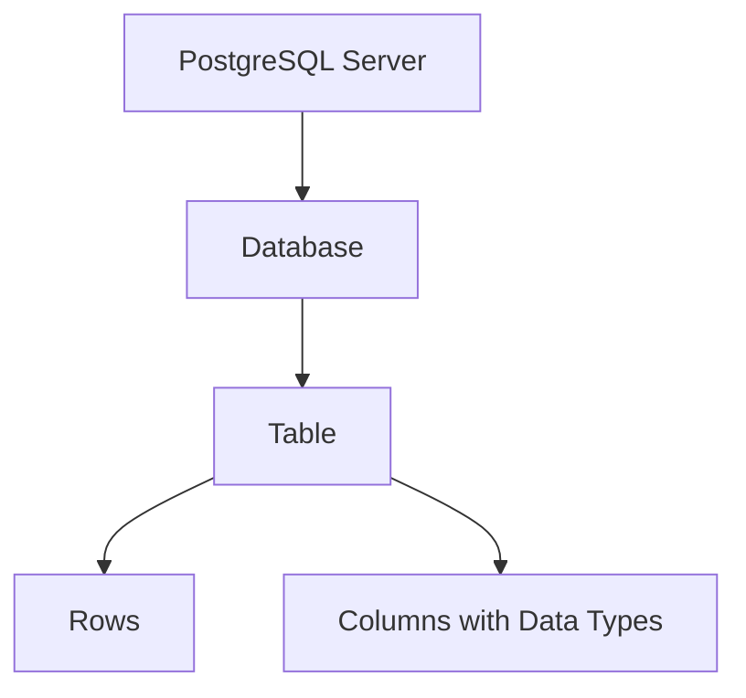
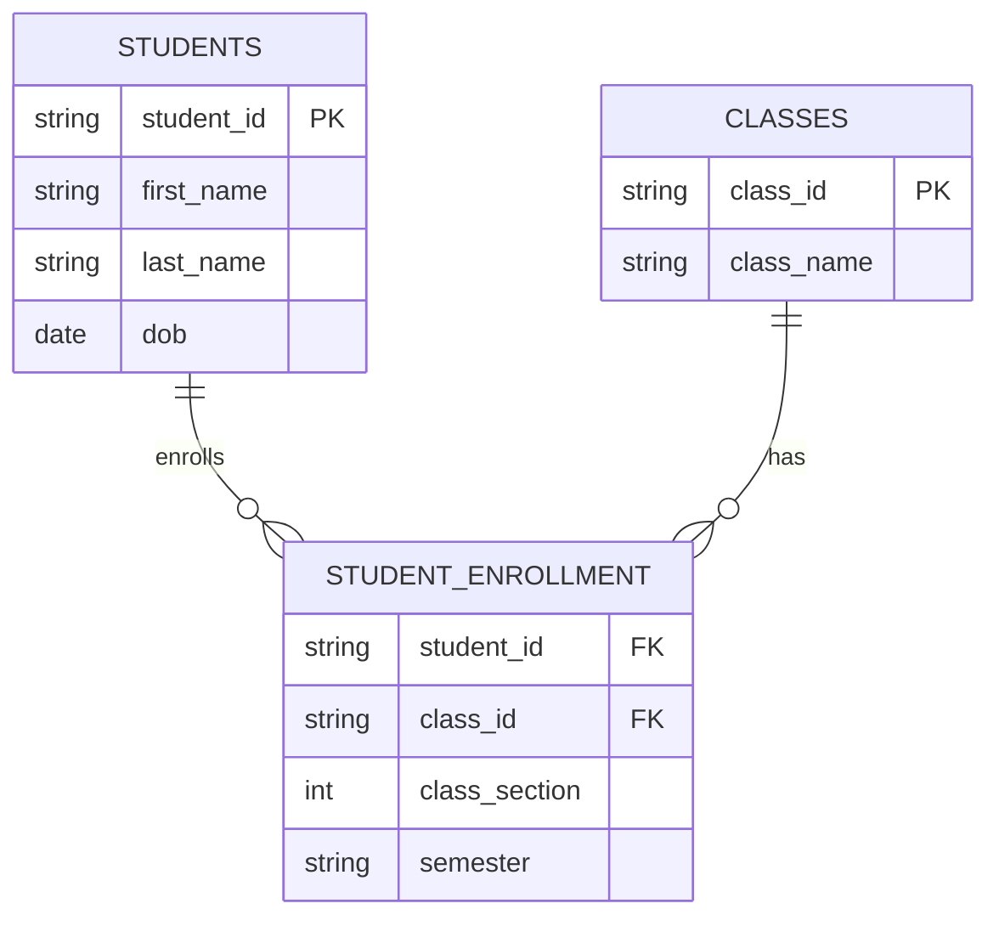
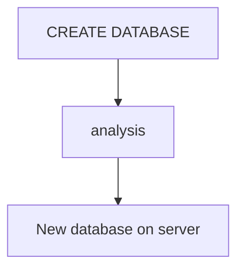
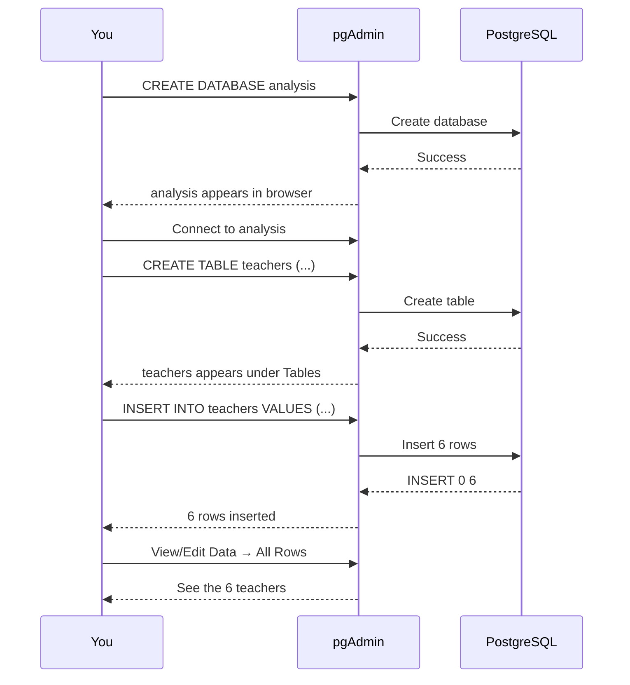

first you create cabinet (database), then add drawers (tables) then put folders (rows) inside.

---



---

## relation database



**Why separate tables?**
- Avoid repeating data (e.g., Davis Hernandez's name stored once, not for every class)
- Use `student_id` as  **unique key** to connect tables

---

```sql
CREATE DATABASE analysis;
```



>  `;`   signals end of command.

---
Before creating table, you must **switch** from `postgres` to `analysis`.

---

```sql
CREATE TABLE teachers (
    id bigserial,
    first_name varchar(25),
    last_name varchar(50),
    school varchar(50),
    hire_date date,
    salary numeric
);
```


| Column | Data Type | What It Means |
|--------|-----------|---------------|
| `id` | `bigserial` | Auto-incrementing integer (1, 2, 3...) |
| `first_name` | `varchar(25)` | Text, max 25 characters |
| `last_name` | `varchar(50)` | Text, max 50 characters |
| `school` | `varchar(50)` | Text, max 50 characters |
| `hire_date` | `date` | Date (YYYY-MM-DD format) |
| `salary` | `numeric` | Numbers (integers or decimals) |

---

## Inserting Rows into Table

```sql
INSERT INTO teachers (first_name, last_name, school, hire_date, salary)
VALUES ('Janet', 'Smith', 'F.D. Roosevelt HS', '2011-10-30', 36200),
       ('Lee', 'Reynolds', 'F.D. Roosevelt HS', '1993-05-22', 65000),
       ('Samuel', 'Cole', 'Myers Middle School', '2005-08-01', 43500),
       ('Samantha', 'Bush', 'Myers Middle School', '2011-10-30', 36200),
       ('Betty', 'Diaz', 'Myers Middle School', '2005-08-30', 43500),
       ('Kathleen', 'Roush', 'F.D. Roosevelt HS', '2010-10-22', 38500);
```

- **Text & dates** → wrap in single quotes: `'Janet'`, `'2011-10-30'`
- **Numbers** → no quotes: `36200`
- **Order** of values must match order of columns
- **Commas** separate rows; last row ends with `;`
- **`id` column** auto-filled by `bigserial` — you don't insert it

### Date Format
Always use **`YYYY-MM-DD`** (international standard) 

---

## ✍️ SQL Formatting

| Convention | Example |
|------------|---------|
| **UPPERCASE keywords** | `SELECT`, `CREATE TABLE` |
| **lowercase data types** | `varchar`, `numeric`, `date` |
| **snake_case for names** | `first_name`, `hire_date` (not `firstName`) |
| **Indent with 2 space ** | Align clauses for readability |

---

## Complete Workflow 



