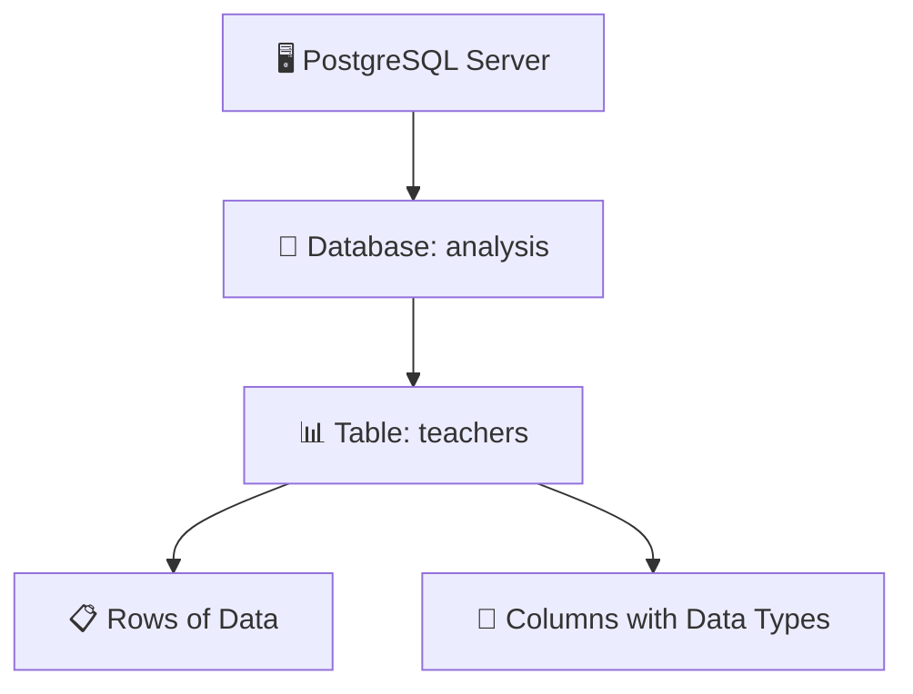
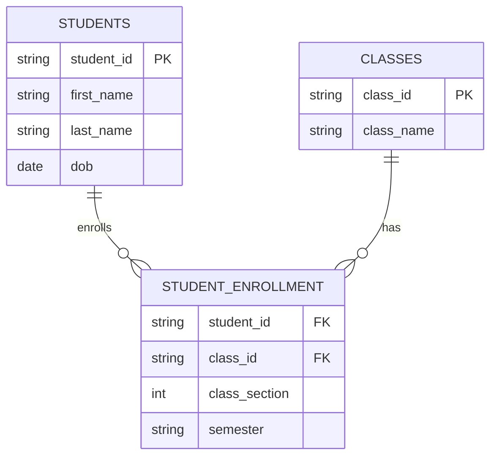
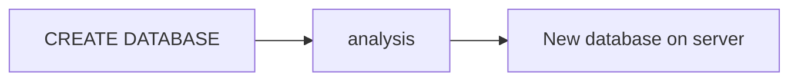
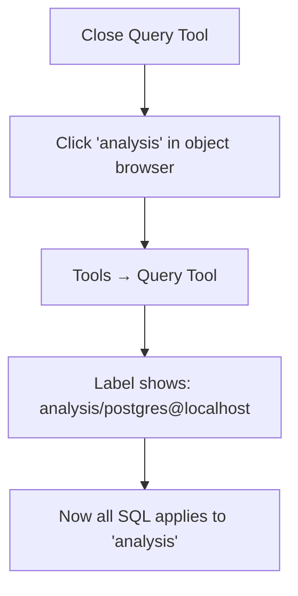
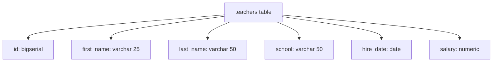
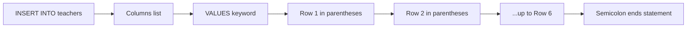
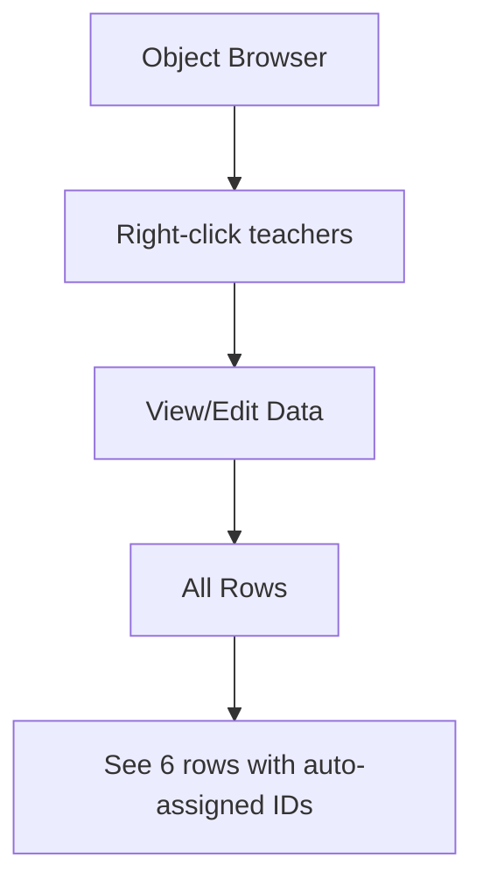
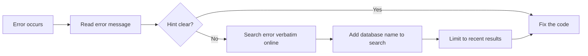
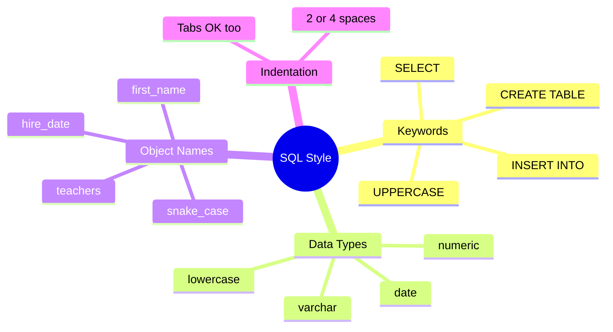
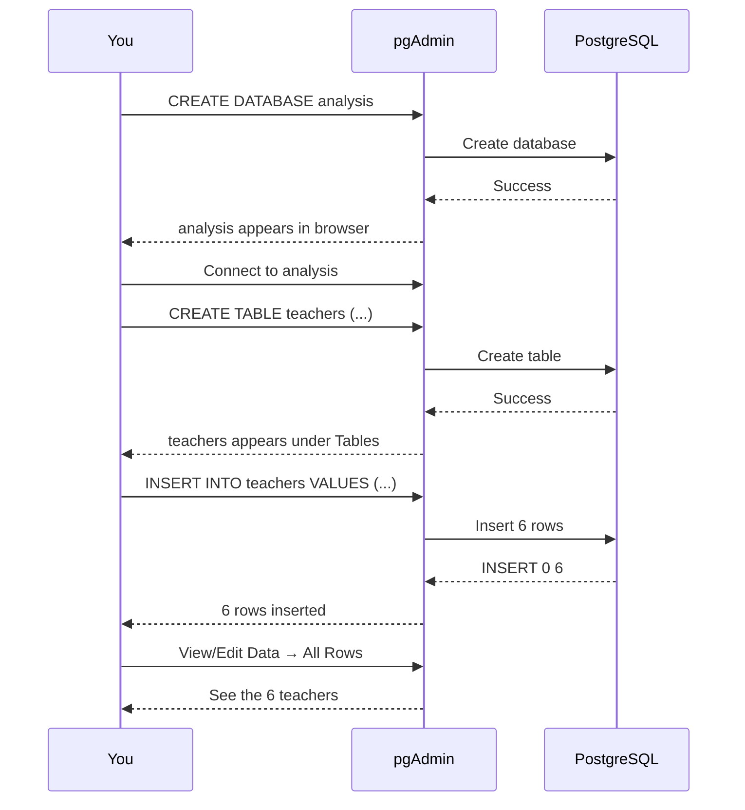

# Creating Your First Database and Table — Explained Simply

This chapter is about **building the structure** that holds your data. Think of it like building a filing cabinet: first you create the cabinet (database), then you add drawers (tables), then you put folders (rows) inside.

---

## 🗄️ The Big Picture: From Database to Data



- **Database** = A collection of related objects (tables, functions, etc.)
- **Table** = A grid of rows and columns that stores data
- **Row** = One record (e.g., one teacher)
- **Column** = One field/attribute (e.g., first_name)

---

## 🧠 Understanding Tables (The School Example)

Before writing SQL, the book shows a **relational database** example for a school:



**Why separate tables?**
- Avoid repeating data (e.g., Davis Hernandez's name stored once, not for every class)
- Use `student_id` as a **unique key** to connect tables
- This is the power of a **relational database**

---

## 1️⃣ Creating a Database

You need **one line of SQL**:

```sql
CREATE DATABASE analysis;
```



> ⚠️ **Always end statements with a semicolon (`;`)** — it signals the end of the command (ANSI SQL standard).

### How to Run It in pgAdmin
1. Launch PostgreSQL + pgAdmin
2. Connect to the default `postgres` database
3. Open **Query Tool** (Tools → Query Tool)
4. Type the SQL
5. Click **Execute/Refresh** (▶ icon)
6. Right-click **Databases** → **Refresh** to see `analysis`

---

## 2️⃣ Connecting to the New Database

Before creating a table, you must **switch** from `postgres` to `analysis`.



---

## 3️⃣ Creating a Table

### The `CREATE TABLE` Statement

```sql
CREATE TABLE teachers (
    id bigserial,
    first_name varchar(25),
    last_name varchar(50),
    school varchar(50),
    hire_date date,
    salary numeric
);
```

### Breaking Down the Columns



| Column | Data Type | What It Means |
|--------|-----------|---------------|
| `id` | `bigserial` | Auto-incrementing integer (1, 2, 3...) |
| `first_name` | `varchar(25)` | Text, max 25 characters |
| `last_name` | `varchar(50)` | Text, max 50 characters |
| `school` | `varchar(50)` | Text, max 50 characters |
| `hire_date` | `date` | Date (YYYY-MM-DD format) |
| `salary` | `numeric` | Numbers (integers or decimals) |

> 💡 **Data types enforce data integrity** — a `date` column won't accept "peach".

---

## 4️⃣ Inserting Rows into a Table

### The `INSERT INTO ... VALUES` Statement

```sql
INSERT INTO teachers (first_name, last_name, school, hire_date, salary)
VALUES ('Janet', 'Smith', 'F.D. Roosevelt HS', '2011-10-30', 36200),
       ('Lee', 'Reynolds', 'F.D. Roosevelt HS', '1993-05-22', 65000),
       ('Samuel', 'Cole', 'Myers Middle School', '2005-08-01', 43500),
       ('Samantha', 'Bush', 'Myers Middle School', '2011-10-30', 36200),
       ('Betty', 'Diaz', 'Myers Middle School', '2005-08-30', 43500),
       ('Kathleen', 'Roush', 'F.D. Roosevelt HS', '2010-10-22', 38500);
```



### Key Rules
- **Text & dates** → wrap in single quotes: `'Janet'`, `'2011-10-30'`
- **Numbers** → no quotes: `36200`
- **Order** of values must match order of columns
- **Commas** separate rows; last row ends with `;`
- **`id` column** is auto-filled by `bigserial` — you don't insert it

### Date Format
Always use **`YYYY-MM-DD`** (international standard) to avoid confusion.

---

## 5️⃣ Viewing the Data

In pgAdmin:
1. Right-click the `teachers` table
2. Choose **View/Edit Data → All Rows**



You'll notice:
- Each teacher has an `id` (1–6) even though you didn't insert it
- Column headers show data types (e.g., `character varying` = `varchar`)

---

## 🚨 When Code Goes Wrong

Errors happen. Example — forgetting a comma:

```
ERROR: syntax error at or near "("
LINE 4: ('Samuel', 'Cole', ...
        ^
```



---

## ✍️ SQL Formatting Conventions

SQL doesn't care about formatting, but **humans do**. Best practices:

| Convention | Example |
|------------|---------|
| **UPPERCASE keywords** | `SELECT`, `CREATE TABLE` |
| **lowercase data types** | `varchar`, `numeric`, `date` |
| **snake_case for names** | `first_name`, `hire_date` (not `firstName`) |
| **Indent with 2 or 4 spaces** | Align clauses for readability |



---

## 🔄 Complete Workflow Summary



---

## ✅ Chapter 2 Checklist

| Step | Task | Done? |
|------|------|-------|
| 1 | Create database `analysis` | ☐ |
| 2 | Connect Query Tool to `analysis` | ☐ |
| 3 | Create table `teachers` with 6 columns | ☐ |
| 4 | Insert 6 rows of teacher data | ☐ |
| 5 | View data via right-click → View/Edit Data | ☐ |
| 6 | Practice reading error messages | ☐ |

---

## 🎯 Key Takeaway

> **Tables are the core building block of every database.** They define the structure (columns + data types) that holds your data, and they let you organize relationships between different entities (like students and classes).

In **Chapter 3**, you'll learn how to **query** this data using `SELECT` — the most important SQL command for analyzing data. 🚀