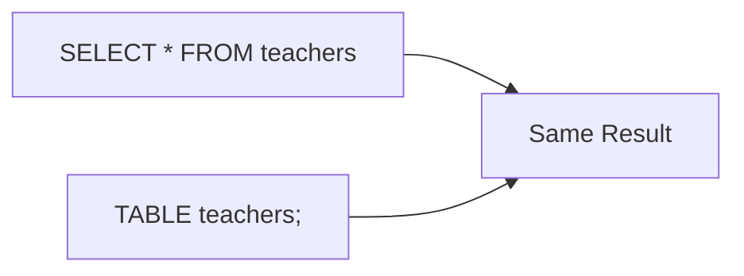
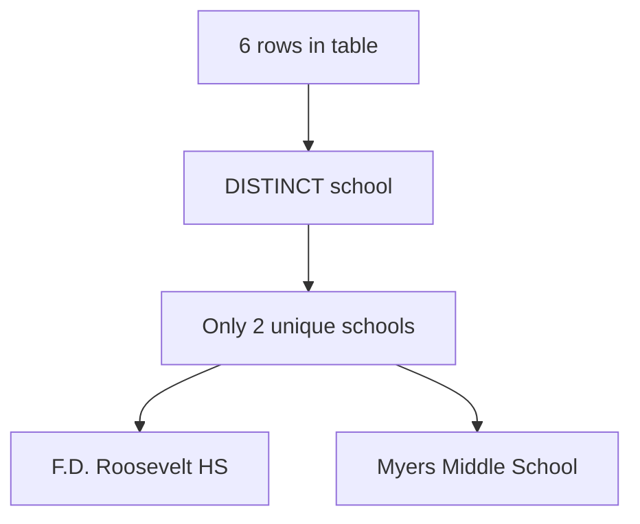
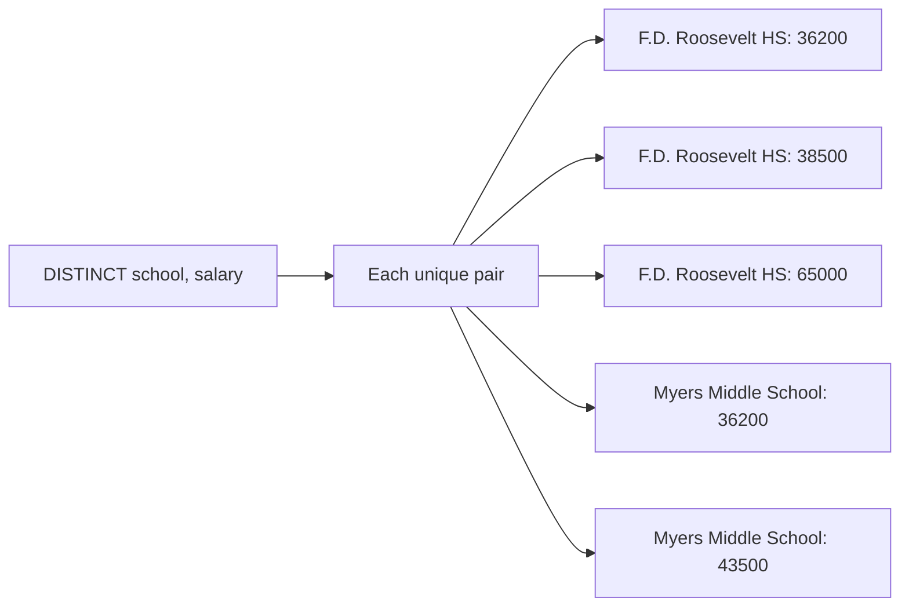
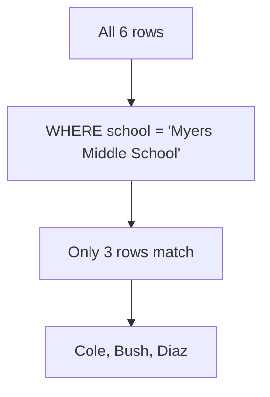
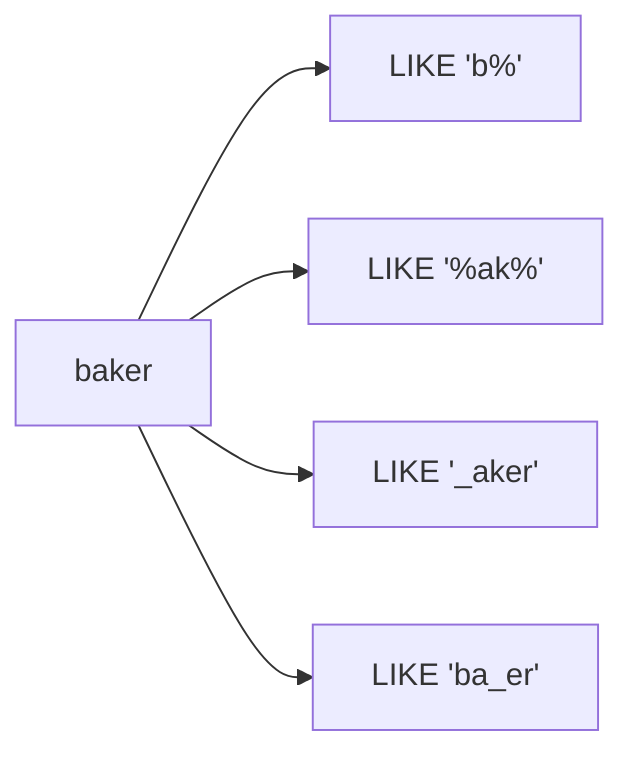
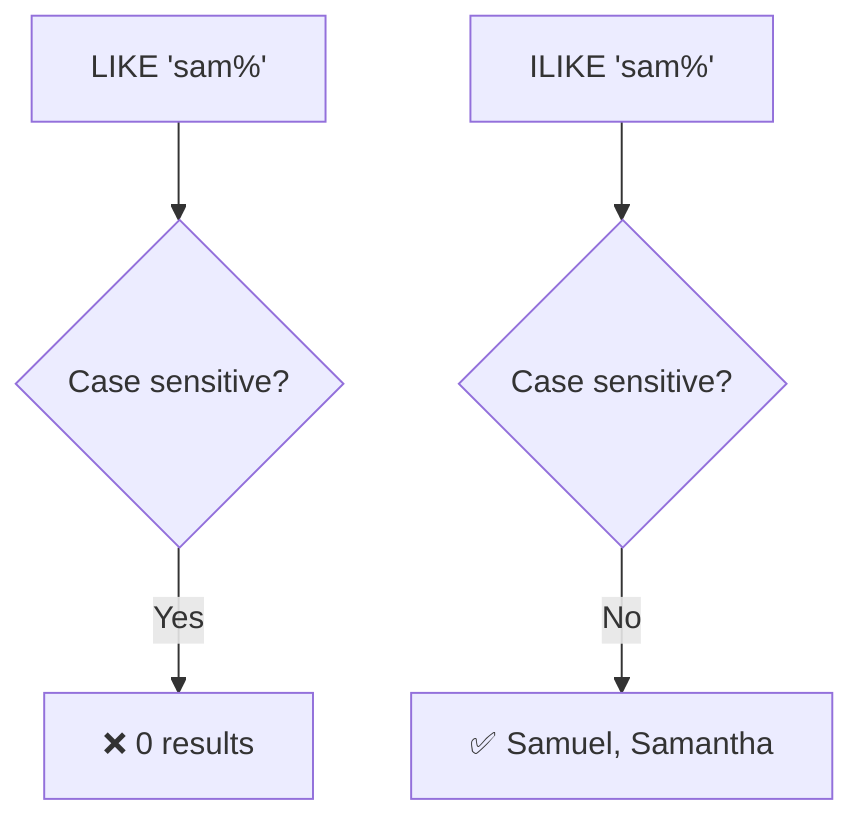
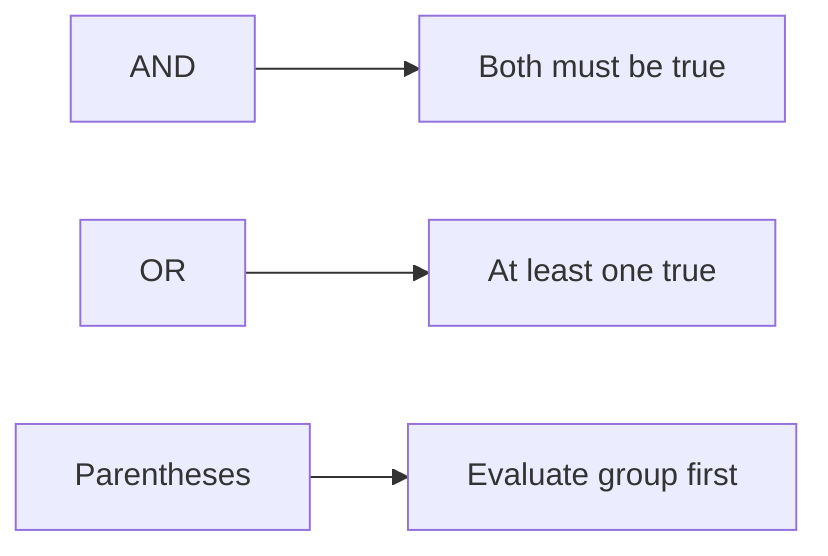
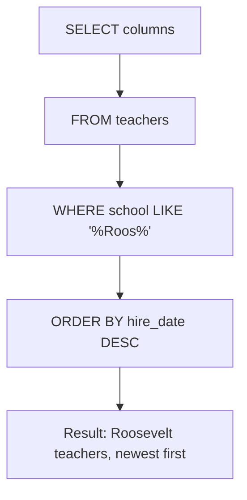

```sql
SELECT * FROM teachers;
```

| `SELECT` | "select data" |
|------|---------|
| `*` | **all columns** |
| `FROM teachers` | From `teachers` table |
| `;` | End statement |

### Three Ways to See All Rows


---

```sql
SELECT last_name, first_name, salary FROM teachers;
```

---

```sql
SELECT first_name, last_name, salary
FROM teachers
ORDER BY salary DESC;
```

---
### Sort  Multiple Columns

```sql
SELECT last_name, school, hire_date
FROM teachers
ORDER BY school ASC, hire_date DESC;
```

> can also use column **numbers** (`ORDER BY 3 DESC`).

---

## Using DISTINCT to Find Unique Values

```sql
SELECT DISTINCT school FROM teachers ORDER BY school;
```



### DISTINCT on Multiple Columns

```sql
SELECT DISTINCT school, salary FROM teachers ORDER BY school, salary;
```



---

## Filter Rows with WHERE

```sql
SELECT last_name, school, hire_date
FROM teachers
WHERE school = 'Myers Middle School';
```



| Query | What It Finds |
|-------|---------------|
| `WHERE first_name = 'Janet'` | Teachers named Janet |
| `WHERE school <> 'F.D. Roosevelt HS'` | Everyone except Roosevelt |
| `WHERE hire_date < '2000-01-01'` | Hired before 2000 |
| `WHERE salary >= 43500` | Earning $43,500 or more |
| `WHERE salary BETWEEN 40000 AND 65000` | Earning $40k–$65k (inclusive) |

> ⚠️ **Beware of BETWEEN:** It's inclusive. `BETWEEN 10 AND 20` and `BETWEEN 20 AND 30` both include 20 → double-counting.

**Safer alternative:**
```sql
WHERE salary >= 40000 AND salary <= 65000
```

---

| Symbol | Meaning |
|--------|---------|
| `%` | Match **one or more** characters |
| `_` | Match **exactly one** character |

### Pattern Examples for "baker"


### LIKE vs ILIKE

```sql
-- Case-sensitive (ANSI standard)
SELECT first_name FROM teachers WHERE first_name LIKE 'sam%';
-- Returns: 0 rows (because 'Samuel' has capital S)

-- Case-insensitive (PostgreSQL-only)
SELECT first_name FROM teachers WHERE first_name ILIKE 'sam%';
-- Returns: Samuel, Samantha
```



---
## Combining Operators with AND / OR

```sql
-- AND: both conditions must be true
SELECT * FROM teachers
WHERE school = 'Myers Middle School' AND salary < 40000;

-- OR: at least one condition must be true
SELECT * FROM teachers
WHERE last_name = 'Cole' OR last_name = 'Bush';

-- Parentheses: group conditions
SELECT * FROM teachers
WHERE school = 'F.D. Roosevelt HS'
AND (salary < 38000 OR salary > 40000);
```



> ⚠️ **Order of evaluation:** Without parentheses, SQL evaluates **AND before OR**. Use parentheses to control logic.

---

```sql
SELECT first_name, last_name, school, hire_date, salary
FROM teachers
WHERE school LIKE '%Roos%'
ORDER BY hire_date DESC;
```



**Output:**

| first_name | last_name | school |hire_date | salary |
|------------|-----------|--------|-----------|--------|
| Janet | Smith | F.D. Roosevelt HS | 2011-10-30 | 36200 |
| Kathleen | Roush | F.D. Roosevelt HS | 2010-10-22 | 38500 |
| Lee | Reynolds | F.D. Roosevelt HS | 1993-05-22 | 65000 |

---
