# Beginning Data Exploration with SELECT — Explained Simply

This chapter is about **interviewing your data**. Think of it like asking questions to a job candidate — you want to find out if the data is clean, complete, and what story it tells.

---

## 🔍 The Big Picture: What SELECT Does

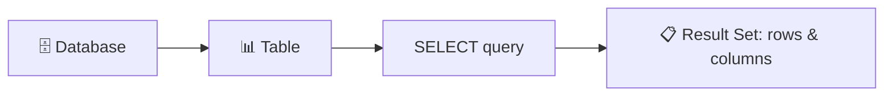

- **SELECT** = The SQL keyword that retrieves data
- **Result Set** = The virtual table returned by your query
- You can filter, sort, and limit what you see — without changing the original table

---

## 1️⃣ Basic SELECT Syntax

```sql
SELECT * FROM teachers;
```

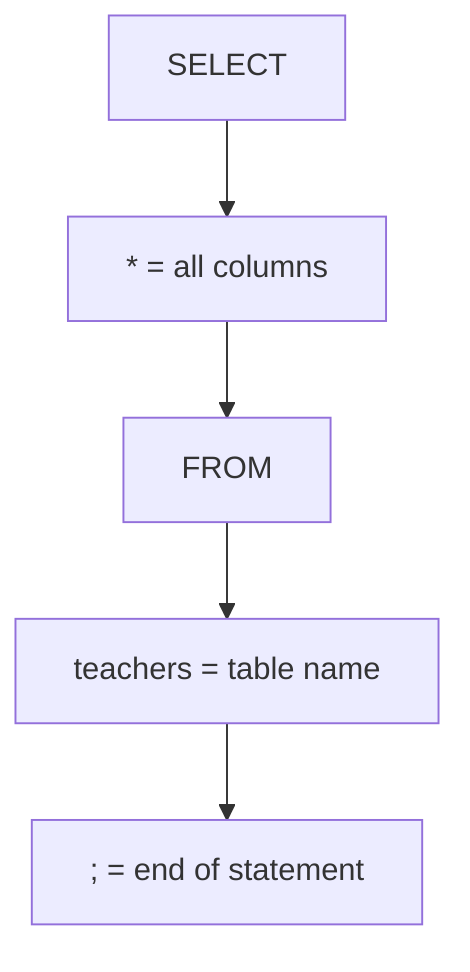

| Part | Meaning |
|------|---------|
| `SELECT` | "I want to retrieve data" |
| `*` | Wildcard = **all columns** |
| `FROM teachers` | From the `teachers` table |
| `;` | End of statement |

### Three Ways to See All Rows
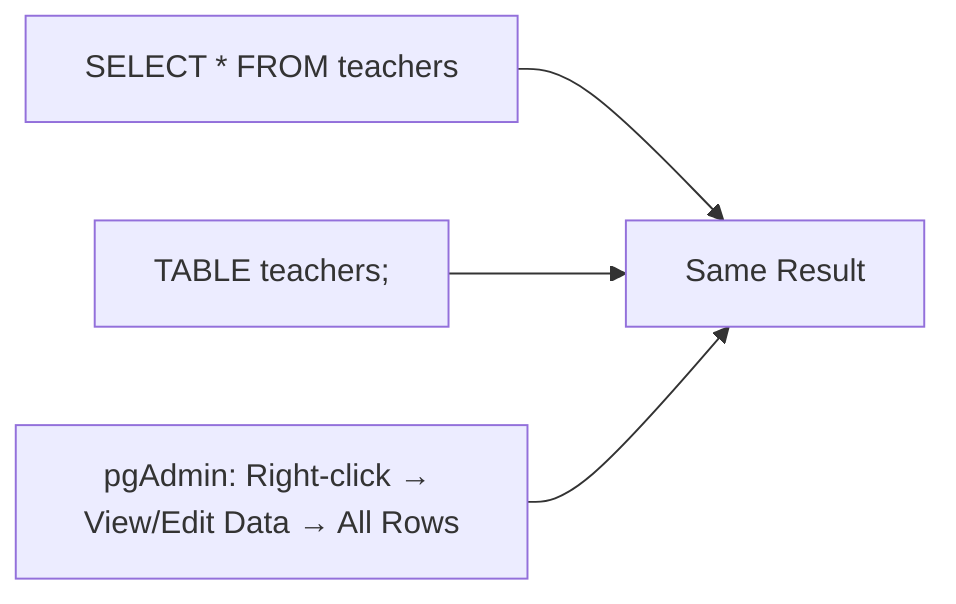

---

## 2️⃣ Querying a Subset of Columns

Instead of `*`, name the columns you want:

```sql
SELECT last_name, first_name, salary FROM teachers;
```

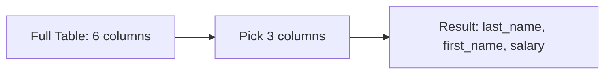

> 💡 **Column order in query ≠ column order in table.** You can rearrange them however you like.

---

## 3️⃣ Sorting Data with ORDER BY

```sql
SELECT first_name, last_name, salary
FROM teachers
ORDER BY salary DESC;
```

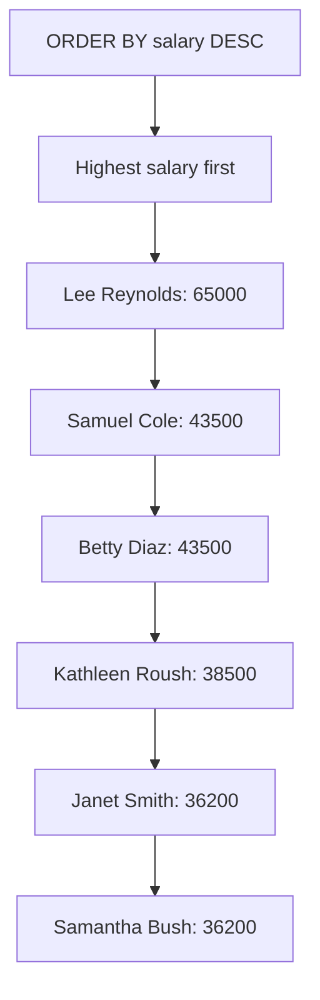

### Sort Directions
| Keyword | Meaning |
|---------|---------|
| `ASC` | Ascending (A→Z, 1→9) — **default** |
| `DESC` | Descending (Z→A, 9→1) |

### Sort by Multiple Columns

```sql
SELECT last_name, school, hire_date
FROM teachers
ORDER BY school ASC, hire_date DESC;
```

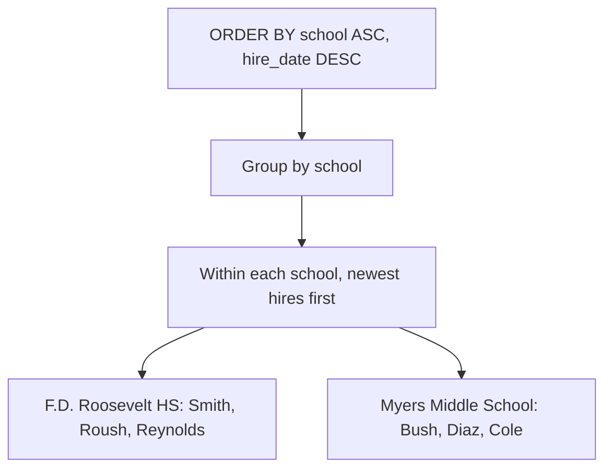

> 💡 You can also use column **numbers** (e.g., `ORDER BY 3 DESC`) instead of names.

---

## 4️⃣ Using DISTINCT to Find Unique Values

```sql
SELECT DISTINCT school FROM teachers ORDER BY school;
```

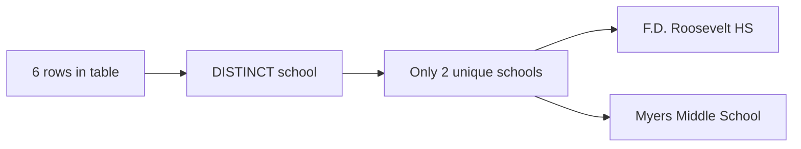

### DISTINCT on Multiple Columns

```sql
SELECT DISTINCT school, salary FROM teachers ORDER BY school, salary;
```

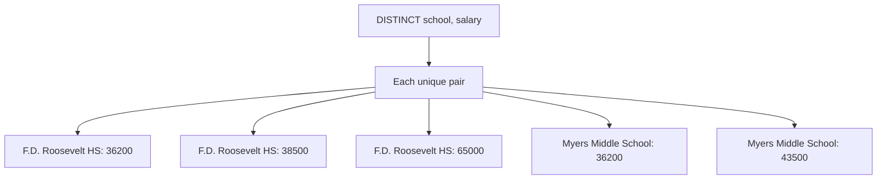

> 💡 **Use case:** "For each X, what are all the Y values?" — e.g., for each school, what salaries exist?

---

## 5️⃣ Filtering Rows with WHERE

```sql
SELECT last_name, school, hire_date
FROM teachers
WHERE school = 'Myers Middle School';
```

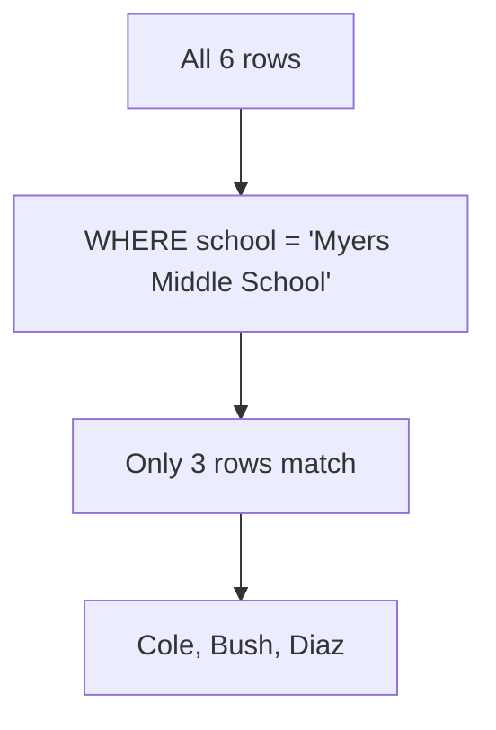

### Comparison Operators (Table 3-1)

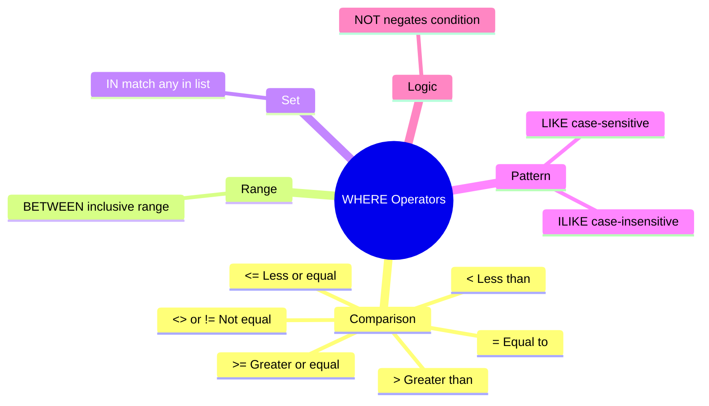

### Examples

| Query | What It Finds |
|-------|---------------|
| `WHERE first_name = 'Janet'` | Teachers named Janet |
| `WHERE school <> 'F.D. Roosevelt HS'` | Everyone except Roosevelt |
| `WHERE hire_date < '2000-01-01'` | Hired before 2000 |
| `WHERE salary >= 43500` | Earning $43,500 or more |
| `WHERE salary BETWEEN 40000 AND 65000` | Earning $40k–$65k (inclusive) |

> ⚠️ **Beware of BETWEEN:** It's inclusive. `BETWEEN 10 AND 20` and `BETWEEN 20 AND 30` both include 20 → double-counting.

**Safer alternative:**
```sql
WHERE salary >= 40000 AND salary <= 65000
```

---

## 6️⃣ LIKE and ILIKE — Pattern Matching

| Symbol | Meaning |
|--------|---------|
| `%` | Matches **one or more** characters |
| `_` | Matches **exactly one** character |

### Pattern Examples for "baker"
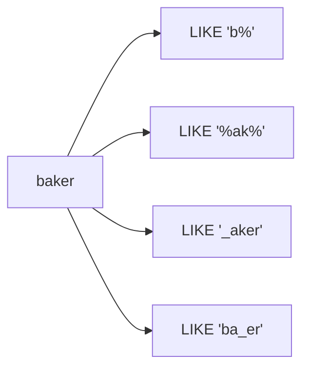

### LIKE vs ILIKE

```sql
-- Case-sensitive (ANSI standard)
SELECT first_name FROM teachers WHERE first_name LIKE 'sam%';
-- Returns: 0 rows (because 'Samuel' has capital S)

-- Case-insensitive (PostgreSQL-only)
SELECT first_name FROM teachers WHERE first_name ILIKE 'sam%';
-- Returns: Samuel, Samantha
```

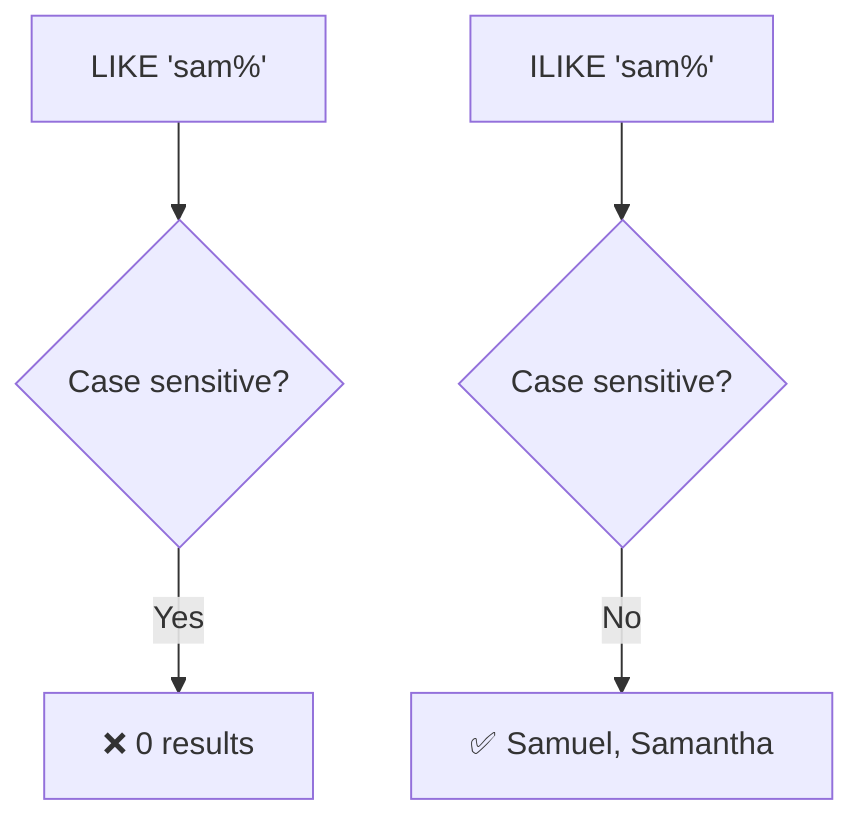

> 💡 **Tip:** Use `ILIKE` when vetting data — you don't know if someone capitalized names correctly.

---

## 7️⃣ Combining Operators with AND / OR

```sql
-- AND: both conditions must be true
SELECT * FROM teachers
WHERE school = 'Myers Middle School' AND salary < 40000;

-- OR: at least one condition must be true
SELECT * FROM teachers
WHERE last_name = 'Cole' OR last_name = 'Bush';

-- Parentheses: group conditions
SELECT * FROM teachers
WHERE school = 'F.D. Roosevelt HS'
AND (salary < 38000 OR salary > 40000);
```

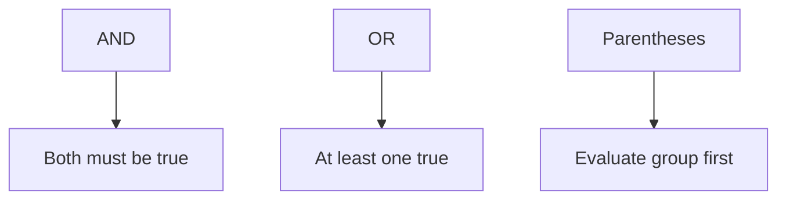

> ⚠️ **Order of evaluation:** Without parentheses, SQL evaluates **AND before OR**. Use parentheses to control logic.

---

## 🧩 Putting It All Together — The Full SELECT Syntax

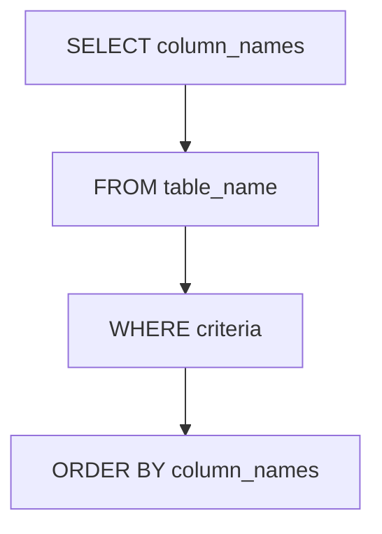

### Complete Example (Listing 3-10)

```sql
SELECT first_name, last_name, school, hire_date, salary
FROM teachers
WHERE school LIKE '%Roos%'
ORDER BY hire_date DESC;
```

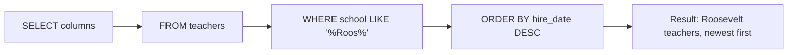

**Output:**
| first_name | last_name | school | hire_date | salary |
|------------|-----------|--------|-----------|--------|
| Janet | Smith | F.D. Roosevelt HS | 2011-10-30 | 36200 |
| Kathleen | Roush | F.D. Roosevelt HS | 2010-10-22 | 38500 |
| Lee | Reynolds | F.D. Roosevelt HS | 1993-05-22 | 65000 |

---

## 🎯 Complete Query Workflow

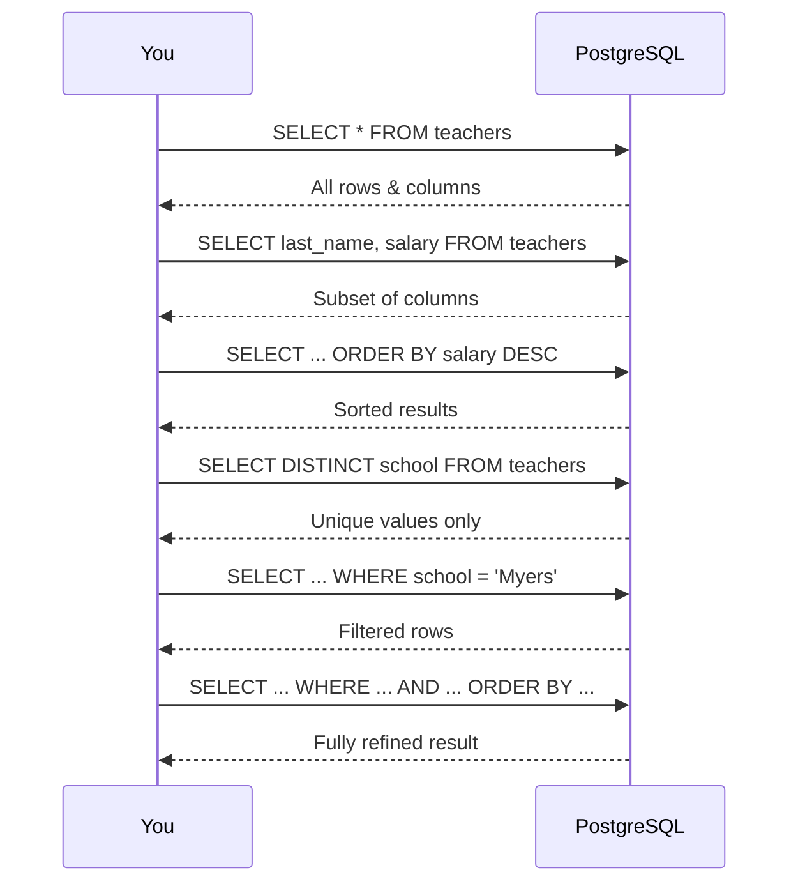

---

## ✅ Chapter 3 Checklist

| Concept | SQL Keyword | Purpose |
|---------|-------------|---------|
| Select all | `SELECT *` | Get every column |
| Select specific | `SELECT col1, col2` | Get chosen columns |
| Sort | `ORDER BY` | Arrange results (ASC/DESC) |
| Unique values | `DISTINCT` | Remove duplicates |
| Filter rows | `WHERE` | Match criteria |
| Pattern match | `LIKE` / `ILIKE` | Search with wildcards |
| Combine filters | `AND` / `OR` | Multiple conditions |

---

## 🧠 Key Takeaways

1. **SELECT is your interview tool** — ask questions to understand data quality
2. **Start broad, then narrow** — `SELECT *` first, then add `WHERE`, `ORDER BY`
3. **DISTINCT reveals data quality** — spot spelling variations, inconsistent formats
4. **LIKE/ILIKE find patterns** — perfect for rooting out misspellings
5. **AND/OR with parentheses** — control exactly which rows come back
6. **SQL has a required order:** `SELECT → FROM → WHERE → ORDER BY`

> In **Chapter 4**, you'll go deeper into **data types** — understanding how numbers, text, and dates are stored and manipulated. 🚀