# Understanding Data Types — Explained Simply

This chapter is about **choosing the right container** for your data. Think of it like packing for a trip: you wouldn't put soup in a paper bag or clothes in a water bottle. Each type of data needs the right container.

---

## 🎯 The Big Picture: Why Data Types Matter

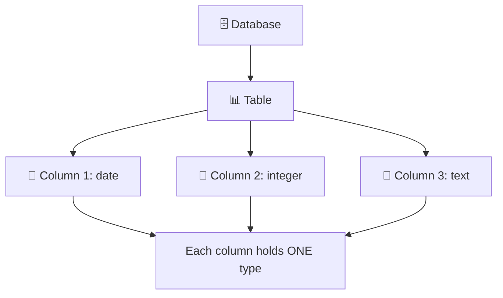

**Key rule:** Each column in a SQL table can hold **one and only one** data type. You declare it in `CREATE TABLE`.

### The Three Main Categories

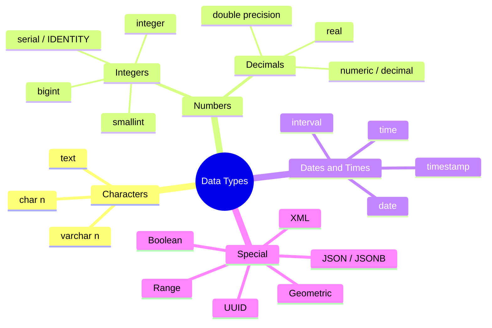

---

## 1️⃣ Character Types (Text)

```sql
CREATE TABLE eagle_watch (
    observation_date date,
    eagles_seen integer,
    notes text
);
```

### The Three Character Types

| Type | Behavior | Example |
|------|----------|---------|
| `char(n)` | Fixed length — pads with spaces | `char(10)` always stores 10 chars |
| `varchar(n)` | Variable length, max n | `varchar(10)` stores only what you insert |
| `text` | Variable length, unlimited (up to ~1GB) | Best for most use cases |

### Visualizing the Difference

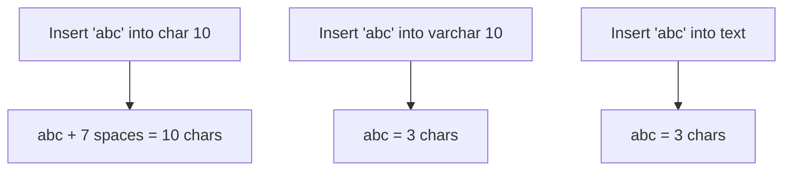

### Proof with COPY (Listing 4-1)

```sql
CREATE TABLE char_data_types (
    char_column char(10),
    varchar_column varchar(10),
    text_column text
);
INSERT INTO char_data_types
VALUES ('abc', 'abc', 'abc'),
       ('defghi', 'defghi', 'defghi');
COPY char_data_types TO 'C:\YourDirectory\typetest.txt'
WITH (FORMAT CSV, HEADER, DELIMITER '|');
```

**Output file (`typetest.txt`):**
```
char_column|varchar_column|text_column
abc       |abc|abc
defghi    |defghi|defghi
```

> 💡 Notice `char_column` pads with spaces. `varchar` and `text` don't.

> ⚠️ **Never do math on numbers stored as text.** Use character types only for codes (e.g., ZIP codes).

---

## 2️⃣ Number Types

### Integer Types

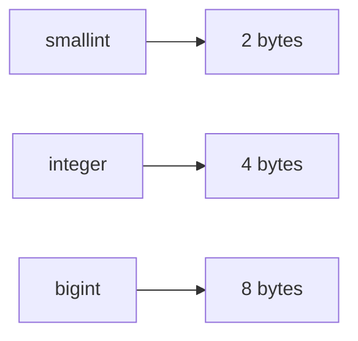

| Type | Storage | Range |
|------|---------|-------|
| `smallint` | 2 bytes | −32,768 to +32,767 |
| `integer` | 4 bytes | −2.1B to +2.1B |
| `bigint` | 8 bytes | −9.2 quintillion to +9.2 quintillion |

### Auto-Incrementing Integers

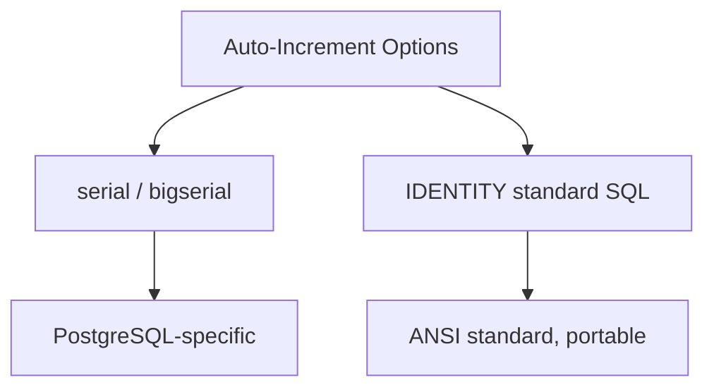

**Using `serial`:**
```sql
CREATE TABLE people (
    id serial,
    person_name varchar(100)
);
```

**Using `IDENTITY` (recommended):**
```sql
CREATE TABLE people (
    id integer GENERATED ALWAYS AS IDENTITY,
    person_name varchar(100)
);
```

| Option | Meaning |
|--------|---------|
| `GENERATED ALWAYS AS IDENTITY` | User **cannot** insert a value |
| `GENERATED BY DEFAULT AS IDENTITY` | User **can** override |

> ⚠️ **Gaps happen:** If a row is deleted or an insert aborted, the sequence still increments.

---

### Decimal Types

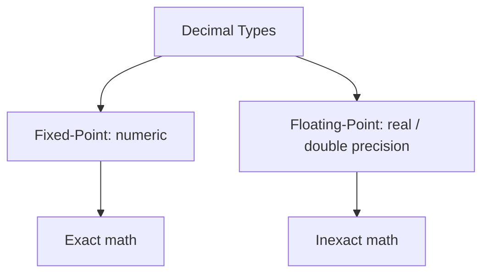

| Type | Storage | Precision |
|------|---------|-----------|
| `numeric(precision, scale)` | Variable | Up to 131,072 digits before, 16,383 after |
| `real` | 4 bytes | 6 decimal digits |
| `double precision` | 8 bytes | 15 decimal digits |

### Seeing the Difference (Listing 4-2)

```sql
CREATE TABLE number_data_types (
    numeric_column numeric(20,5),
    real_column real,
    double_column double precision
);
INSERT INTO number_data_types
VALUES (.7, .7, .7),
       (2.13579, 2.13579, 2.13579),
       (2.1357987654, 2.1357987654, 2.1357987654);
SELECT * FROM number_data_types;
```

**Output:**
| numeric_column | real_column | double_column |
|----------------|-------------|---------------|
| 0.70000 | 0.7 | 0.7 |
| 2.13579 | 2.13579 | 2.13579 |
| 2.13580 | 2.1357987 | 2.1357987654 |

> Notice: `numeric` **pads** and **rounds**. Floating-point shows shortest representation.

### ⚠️ The Floating-Point Trap (Listing 4-3)

```sql
SELECT
    numeric_column * 10000000 AS fixed,
    real_column * 10000000 AS floating
FROM number_data_types
WHERE numeric_column = .7;
```

**Output:**
| fixed | floating |
|-------|----------|
| 7000000.00000 | 6999999.88079071 |

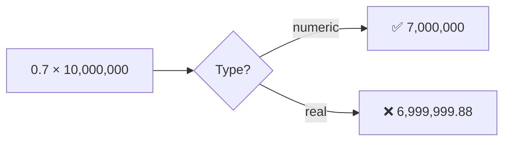

**Why?** Floating-point can't represent all decimals exactly in binary.

### Choosing Your Number Type

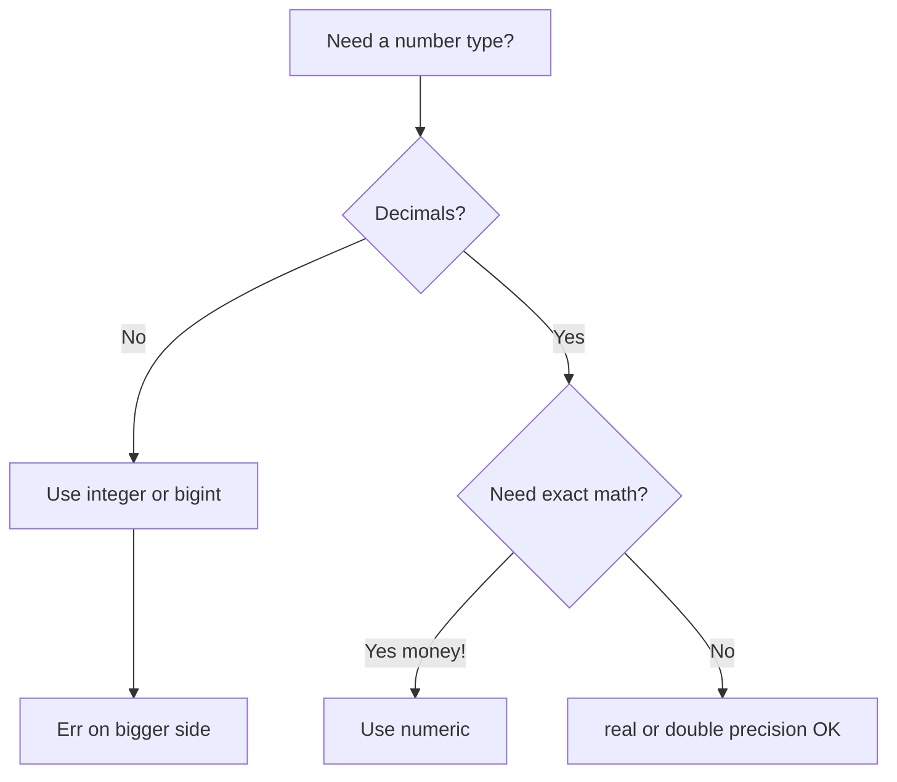

> 💡 **Rule of thumb:** Use `numeric` for money. Use `integer`/`bigint` for whole numbers.

---

## 3️⃣ Dates and Times

| Type | Storage | Description |
|------|---------|-------------|
| `timestamp` | 8 bytes | Date + time (add `with time zone`!) |
| `date` | 4 bytes | Date only |
| `time` | 8 bytes | Time only |
| `interval` | 16 bytes | A duration (e.g., `2 days`) |

### Seeing Them in Action (Listing 4-4)

```sql
CREATE TABLE date_time_types (
    timestamp_column timestamp with time zone,
    interval_column interval
);
INSERT INTO date_time_types
VALUES
    ('2022-12-31 01:00 EST', '2 days'),
    ('2022-12-31 01:00 -8', '1 month'),
    ('2022-12-31 01:00 Australia/Melbourne', '1 century'),
    (now(), '1 week');
SELECT * FROM date_time_types;
```

**Output (depends on your time zone):**
| timestamp_column | interval_column |
|------------------|-----------------|
| 2022-12-31 01:00:00-05 | 2 days |
| 2022-12-31 04:00:00-05 | 1 mon |
| 2022-12-30 09:00:00-05 | 100 years |
| 2020-05-31 21:31:15-05 | 7 days |

> 💡 Always use `timestamp with time zone` (`timestamptz`) when tracking events across regions.

### Using interval in Calculations (Listing 4-5)

```sql
SELECT
    timestamp_column,
    interval_column,
    timestamp_column - interval_column AS new_date
FROM date_time_types;
```

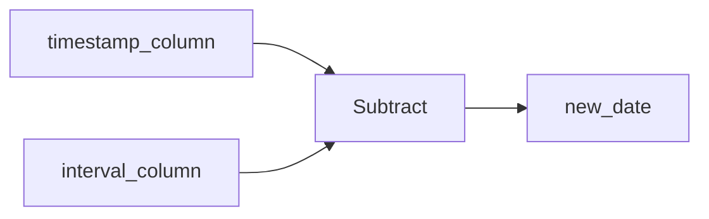

**Output:**
| timestamp_column | interval_column | new_date |
|------------------|-----------------|----------|
| 2022-12-31 01:00:00-05 | 2 days | 2022-12-29 01:00:00-05 |
| 2022-12-31 04:00:00-05 | 1 mon | 2022-11-30 04:00:00-05 |
| 2022-12-30 09:00:00-05 | 100 years | 1922-12-30 09:00:00-05 |

> 💡 Great for "follow up 90 days after contract signed" type calculations.

---

## 4️⃣ JSON and JSONB

JSON = **JavaScript Object Notation** — a structured format for key/value pairs.

```json
{
  "business_name": "Old Ebbitt Grill",
  "business_type": "Restaurant",
  "employees": 300,
  "address": {
    "street": "675 15th St NW",
    "city": "Washington",
    "state": "DC",
    "zip_code": "20005"
  }
}
```

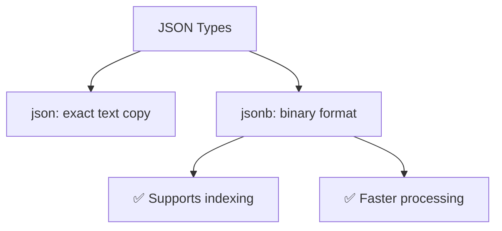

> 💡 Use `jsonb` when you need to query/search JSON. Use `json` when you need exact preservation.

---

## 5️⃣ Miscellaneous Types

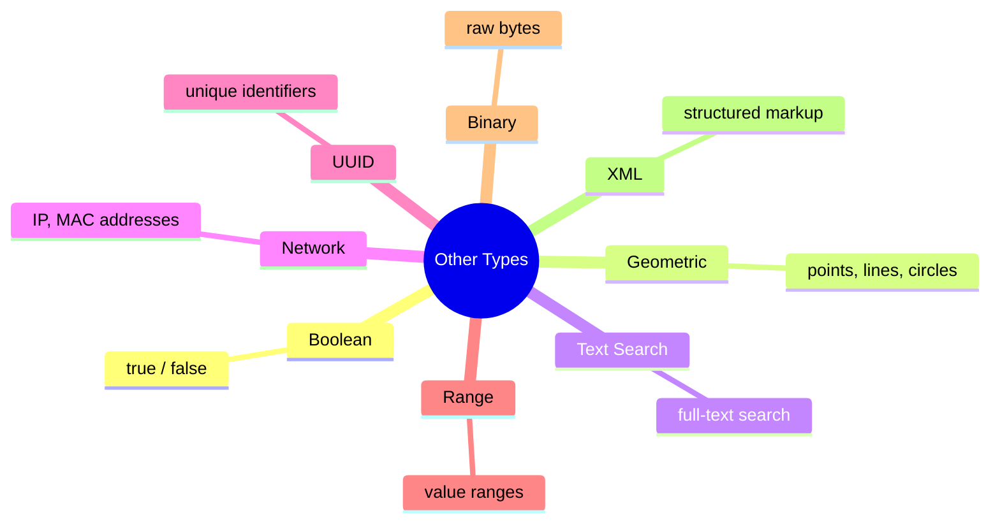

---

## 🔄 CAST: Transforming Between Types

Sometimes you need to convert a value from one type to another.

### Three Examples (Listing 4-6)

```sql
-- 1. Timestamp → varchar (truncated to 10 chars = date only)
SELECT timestamp_column, CAST(timestamp_column AS varchar(10))
FROM date_time_types;

-- 2. Numeric → integer (rounds) and numeric → text (no rounding)
SELECT numeric_column,
       CAST(numeric_column AS integer),
       CAST(numeric_column AS text)
FROM number_data_types;

-- 3. This FAILS: text with letters → integer
SELECT CAST(char_column AS integer) FROM char_data_types;
```

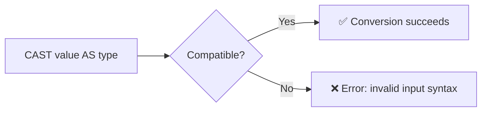

### The Double-Colon Shortcut

```sql
-- These two are equivalent:
SELECT CAST(timestamp_column AS varchar(10)) FROM date_time_types;
SELECT timestamp_column::varchar(10) FROM date_time_types;
```

> ⚠️ `::` is **PostgreSQL-only**. Use `CAST()` for portability.

---

## 🧩 Complete Data Type Decision Flow

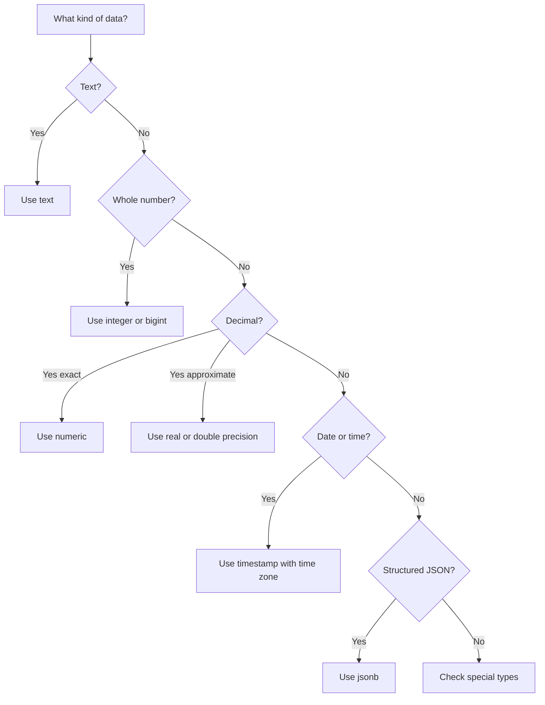

---

## ✅ Chapter 4 Checklist

| Concept | Best Practice |
|---------|---------------|
| Text | Use `text` (avoids length limits) |
| Whole numbers | Use `integer` or `bigint` |
| Auto-increment ID | Use `GENERATED ALWAYS AS IDENTITY` |
| Money/decimal | Use `numeric` (exact math) |
| Approximate decimals | `real` or `double precision` (inexact!) |
| Dates/times | Use `timestamp with time zone` |
| Durations | Use `interval` |
| JSON | Use `jsonb` for querying |
| Type conversion | Use `CAST()` for portability |

---

## 🎯 Key Takeaways

1. **Each column holds one type** — declared in `CREATE TABLE`
2. **`char(n)` pads with spaces** — use `text` or `varchar` instead
3. **Floating-point math is inexact** — never use for money
4. **`numeric` is exact** — use for financial data
5. **Always use `timestamp with time zone`** — for global event tracking
6. **`interval` makes date math easy** — add/subtract durations
7. **`CAST()` converts types** — but only when compatible
8. **`jsonb` > `json`** — when you need to query JSON

> In **Chapter 5**, you'll learn how to **import and export data** using CSV files and the `COPY` command. 🚀