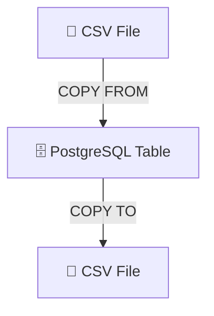

- **`COPY ... FROM`** = Import data INTO a table
- **`COPY ... TO`** = Export data OUT of a table

---

## 📄 **delimited text file** has:
- One row of data per line
- Each column separated (delimited) by character (comma)

```csv
FIRSTNAME,LASTNAME,STREET,CITY,STATE,PHONE
John,Doe,123 Main St.,Hyde Park,NY,845-555-1212
```

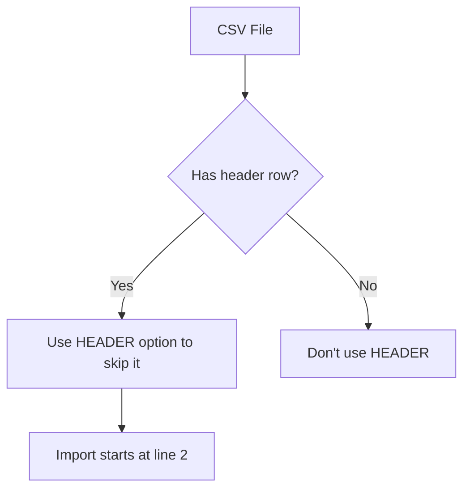

---

```csv
FIRSTNAME,LASTNAME,STREET,CITY,STATE,PHONE
John,Doe,"123 Main St., Apartment 200",Hyde Park,NY,845-555-1212
```

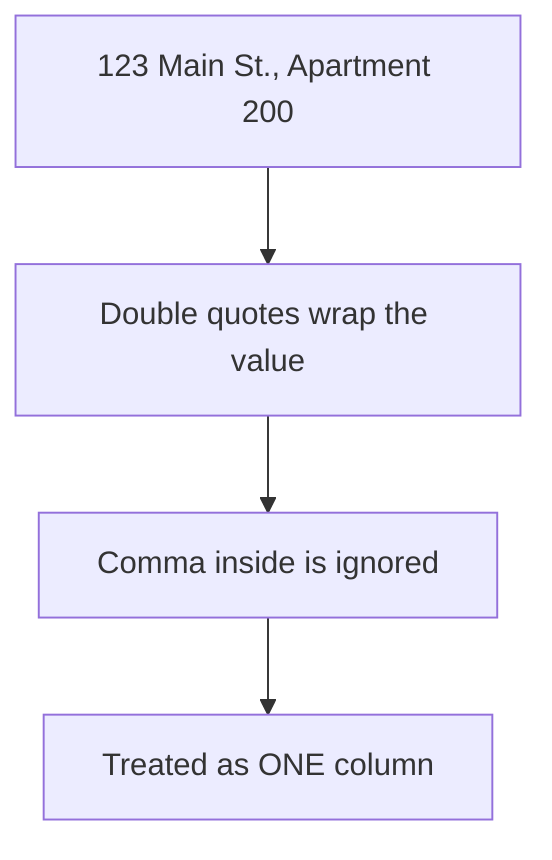

---

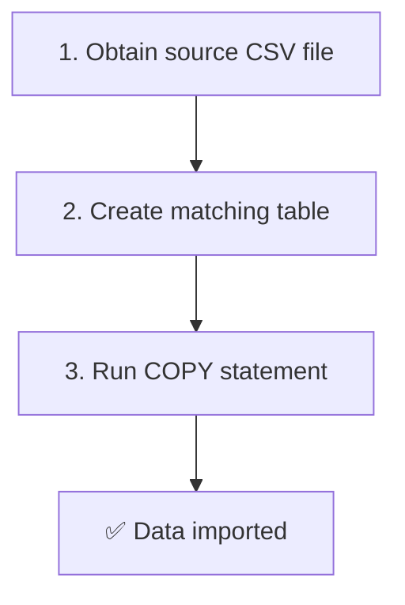

---

```sql
COPY table_name
FROM 'C:\YourDirectory\your_file.csv'
WITH (FORMAT CSV, HEADER);
```


| Option | Purpose |
|--------|---------|
| `FORMAT CSV` | File is comma-separated |
| `HEADER` | Skip the header row (or include on export) |
| `DELIMITER '|'` | Use a different delimiter |
| `QUOTE '"'` | Specify a different text qualifier |

---

## 🏛️ Real Example: Census County Data

### The Dataset
- **3,142 rows** (every US county)
- **16 columns** (population estimates, geography, etc.)
- File: `us_counties_pop_est_2019.csv`

### Creating Table 

```sql
CREATE TABLE us_counties_pop_est_2019 (
    state_fips text,
    county_fips text,
    region smallint,
    state_name text,
    county_name text,
    area_land bigint,
    area_water bigint,
    internal_point_lat numeric(10,7),
    internal_point_lon numeric(10,7),
    pop_est_2018 integer,
    pop_est_2019 integer,
    births_2019 integer,
    deaths_2019 integer,
    international_migr_2019 integer,
    domestic_migr_2019 integer,
    residual_2019 integer,
    CONSTRAINT counties_2019_key PRIMARY KEY (state_fips, county_fips)
);
```


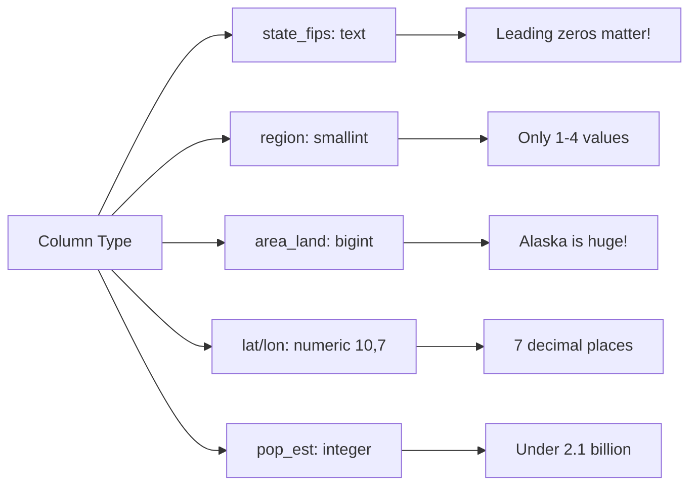

> 💡FIPS are **text**, not numbers. Alaska's `02` would become `2` if stored as integer.


```sql
COPY us_counties_pop_est_2019
FROM 'C:\YourDirectory\us_counties_pop_est_2019.csv'
WITH (FORMAT CSV, HEADER);
```

**Success message:**
```
COPY 3142
Query returned successfully in 75 msec.
```


```sql
-- Check largest land areas
SELECT county_name, state_name, area_land
FROM us_counties_pop_est_2019
ORDER BY area_land DESC
LIMIT 3;
```

| county_name | state_name | area_land |
|-------------|------------|-----------|
| Yukon-Koyukuk Census Area | Alaska | 377038836685 |
| North Slope Borough | Alaska | 230054247231 |
| Bethel Census Area | Alaska | 105232821617 |

> 🎉 Alaska dominates because it's massive!

### The Antimeridian Surprise

```sql
SELECT county_name, state_name, internal_point_lon
FROM us_counties_pop_est_2019
ORDER BY internal_point_lon DESC
LIMIT 5;
```


| county_name | state_name | internal_point_lon |
|-------------|------------|---------------------|
| Aleutians West Census Area | Alaska | 179.6211882 |
| Washington County | Maine | -67.6093542 |

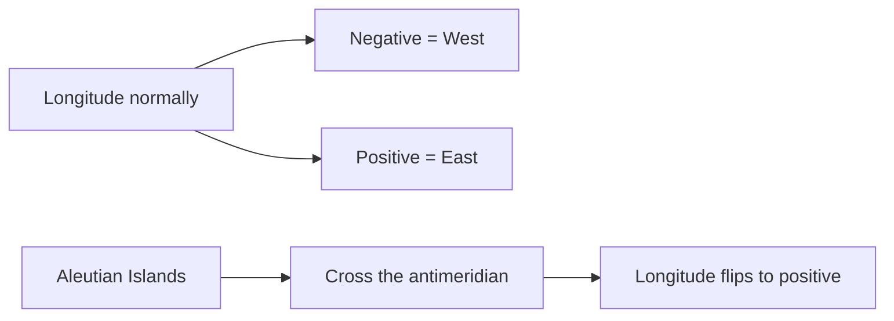

> 💡 Not a data error — just geography!

---

## 🔧 Advanced Import Techniques

CSV only has 3 columns, but table has 7.

```sql
COPY supervisor_salaries (town, supervisor, salary)
FROM 'C:\YourDirectory\supervisor_salaries.csv'
WITH (FORMAT CSV, HEADER);
```

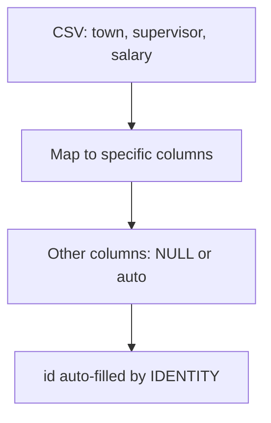

> ⚠️ **Error if you don't specify columns:** PostgreSQL tries to fill `id` with `"Anytown"` → fails.


```sql
COPY supervisor_salaries (town, supervisor, salary)
FROM 'C:\YourDirectory\supervisor_salaries.csv'
WITH (FORMAT CSV, HEADER)
WHERE town = 'New Brillig';
```

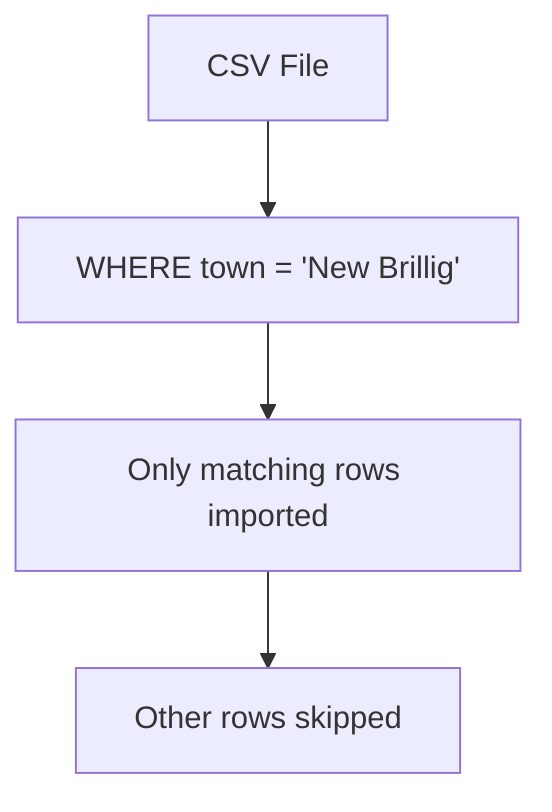

> 💡 **PostgreSQL 12+** supports `WHERE` in `COPY`.

### Adding a Value During Import 

 CSV lacks `county`, but you know it should be `'Mills'`.

```sql
-- Step 1: Create temp table
CREATE TEMPORARY TABLE supervisor_salaries_temp
(LIKE supervisor_salaries INCLUDING ALL);

-- Step 2: Import CSV into temp table
COPY supervisor_salaries_temp (town, supervisor, salary)
FROM 'C:\YourDirectory\supervisor_salaries.csv'
WITH (FORMAT CSV, HEADER);

-- Step 3: Insert with hardcoded county value
INSERT INTO supervisor_salaries (town, county, supervisor, salary)
SELECT town, 'Mills', supervisor, salary
FROM supervisor_salaries_temp;

-- Step 4: Clean up
DROP TABLE supervisor_salaries_temp;
```

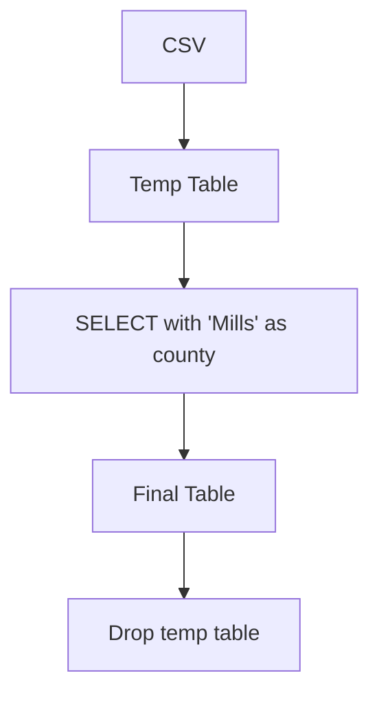

> 💡 **Temporary tables** vanish when you disconnect. Perfect for staging data.

---

## 📤 Exporting Data with COPY


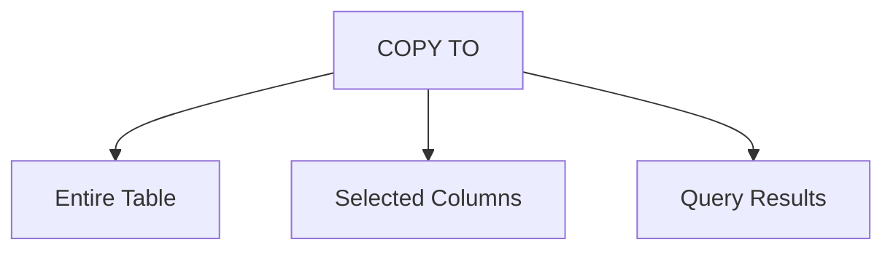

### Export Entire Table

```sql
COPY us_counties_pop_est_2019
TO 'C:\YourDirectory\us_counties_export.txt'
WITH (FORMAT CSV, HEADER, DELIMITER '|');
```


```
state_fips|county_fips|region|state_name|county_name|...
01|001|3|Alabama|Autauga County|...
```

### Export Selected Columns 

```sql
COPY us_counties_pop_est_2019
(county_name, internal_point_lat, internal_point_lon)
TO 'C:\YourDirectory\us_counties_latlon_export.txt'
WITH (FORMAT CSV, HEADER, DELIMITER '|');
```


### Export Query Results

```sql
COPY (
    SELECT county_name, state_name
    FROM us_counties_pop_est_2019
    WHERE county_name ILIKE '%mill%'
)
TO 'C:\YourDirectory\us_counties_mill_export.csv'
WITH (FORMAT CSV, HEADER);
```

```
county_name,state_name
Miller County,Arkansas
Miller County,Georgia
Vermillion County,Indiana
...
```

---

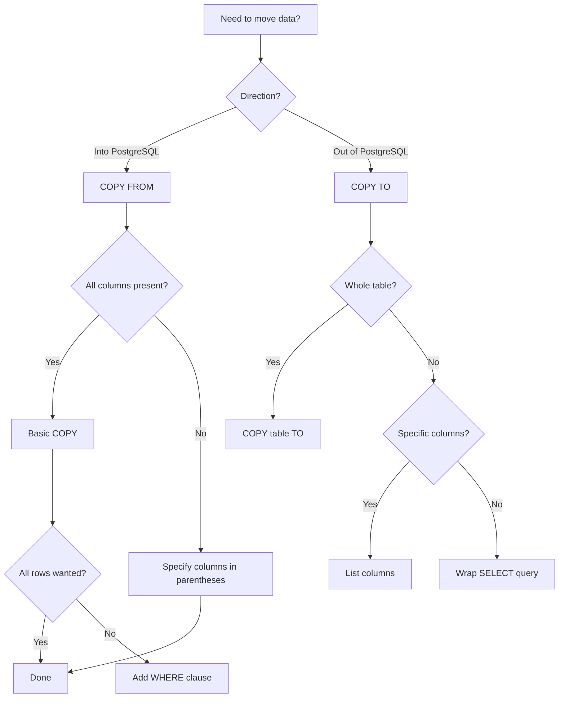

---

| Task | Command |
|------|---------|
| Import all columns | `COPY table FROM 'file.csv' WITH (FORMAT CSV, HEADER);` |
| Import subset of columns | `COPY table (col1, col2) FROM 'file.csv' ...` |
| Import subset of rows | `COPY table FROM 'file.csv' ... WHERE condition;` |
| Add value during import | Use temp table + INSERT SELECT |
| Export entire table | `COPY table TO 'file.csv' WITH (FORMAT CSV, HEADER);` |
| Export selected columns | `COPY table (col1, col2) TO 'file.csv' ...` |
| Export query results | `COPY (SELECT ...) TO 'file.csv' ...` |
| Remote server | Use pgAdmin Import/Export wizard |

---

1. **CSV is the universal format** — every tool can read/write it
2. **`COPY` is fast** — built for bulk operations
3. **Codes are text, not numbers** — FIPS codes need leading zeros
4. **`bigint` for big numbers** — Alaska's land area exceeds `integer` limits
5. **Temp tables are staging areas** — transform data before final insert
6. **`COPY` can export queries** — wrap any `SELECT` in parentheses
7. **Remote servers need pgAdmin** — `COPY` can only see local files
8. **Always inspect after import** — check row counts and sample data
