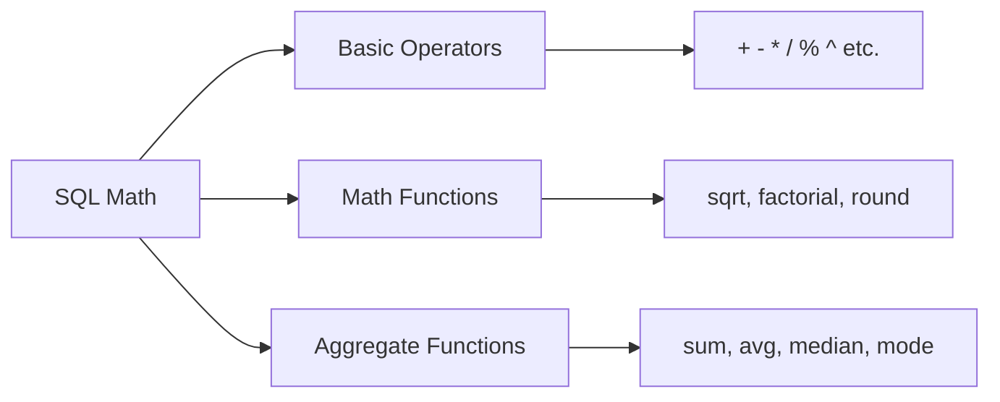
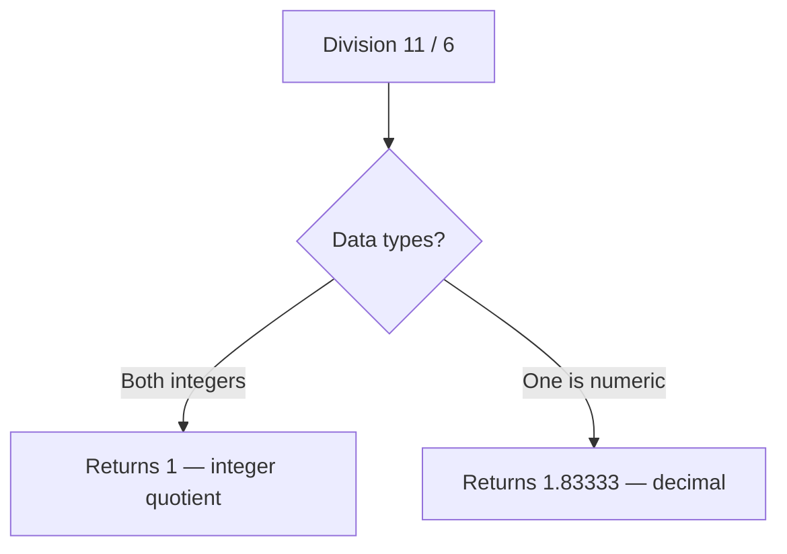
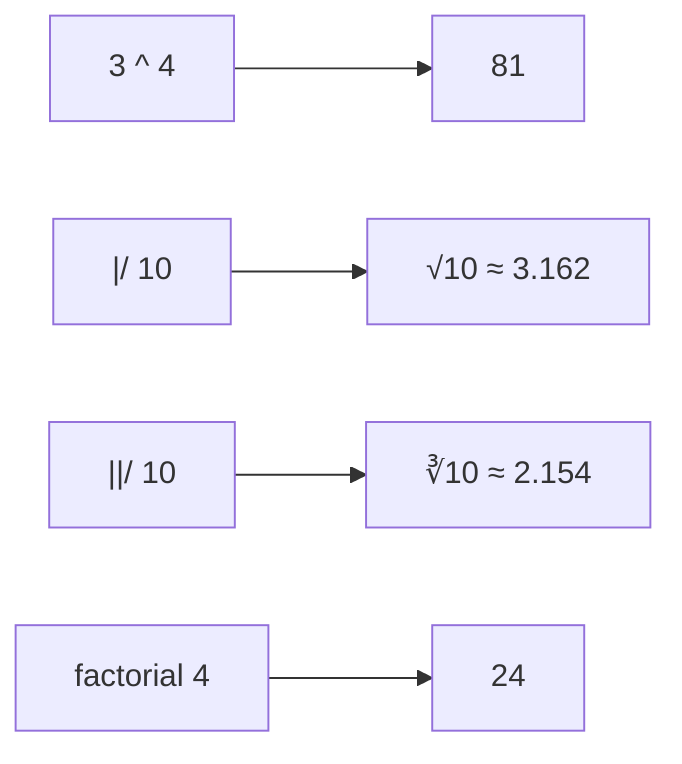
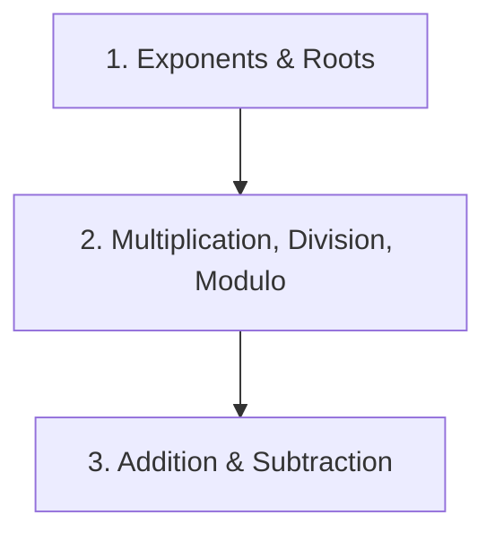
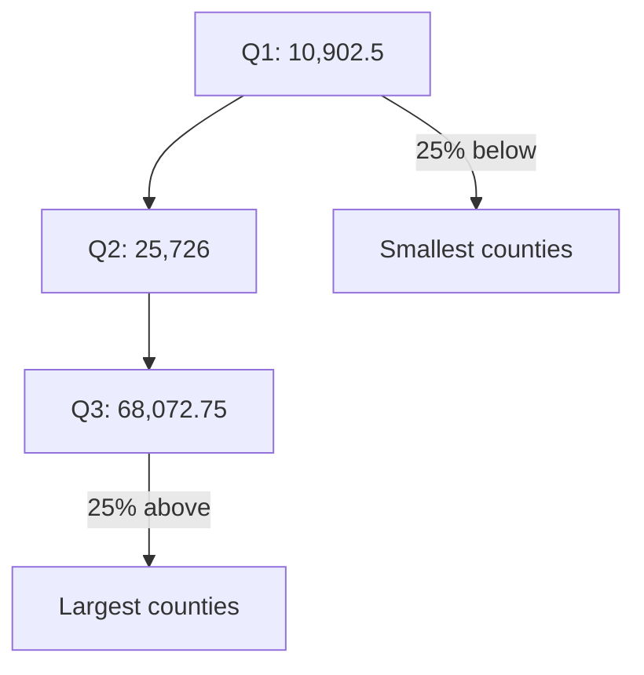
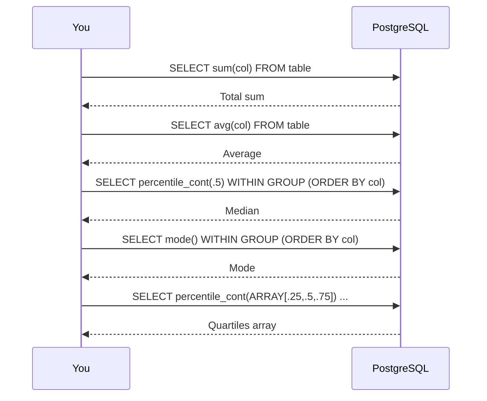

# Basic Math and Stats with SQL

---



---

```sql
SELECT 2 + 2;    -- Returns 4
SELECT 9 - 1;    -- Returns 8
SELECT 3 * 4;    -- Returns 12
```

**Output column name `?column?`** unless you use an alias:
```sql
SELECT 3 * 4 AS result;  -- Column named "result"
```





```sql
SELECT 11 / 6;                          -- Returns 1 (integer division)
SELECT 11 % 6;                          -- Returns 5 (remainder)
SELECT 11.0 / 6;                        -- Returns 1.83333 (decimal)
SELECT CAST(11 AS numeric(3,1)) / 6;    -- Returns 1.83333 (forced decimal)
```


---

## 🧮 Exponents, Roots, and Factorials

```sql
SELECT 3 ^ 4;           -- 81 (3 to the 4th power)
SELECT |/ 10;           -- Square root of 10
SELECT sqrt(10);        -- Same as above
SELECT ||/ 10;          -- Cube root of 10
SELECT factorial(4);    -- 24 (4 × 3 × 2 × 1)
```



---

##  Order of Operation



```sql
SELECT 7 + 8 * 9;       -- 79 (multiply first)
SELECT (7 + 8) * 9;     -- 135 (parentheses first)
SELECT 3 ^ 3 - 1;       -- 26 (exponent first)
SELECT 3 ^ (3 - 1);     -- 9 (parentheses first)
```

>  **use parentheses** when you want different order.

---

## 📊 Math Across Table Columns


```sql
SELECT county_name AS county,
       state_name AS state,
       pop_est_2019 AS pop,
       births_2019 AS births,
       deaths_2019 AS deaths
FROM us_counties_pop_est_2019;
```


```sql
SELECT county_name AS county,
       state_name AS state,
       births_2019 AS births,
       deaths_2019 AS deaths,
       births_2019 - deaths_2019 AS natural_increase
FROM us_counties_pop_est_2019
ORDER BY state_name, county_name;
```


| county | state | births | deaths | natural_increase |
|--------|-------|--------|--------|------------------|
| Autauga County | Alabama | 624 | 541 | 83 |
| Baldwin County | Alabama | 2304 | 2326 | -22 |
| Barbour County | Alabama | 256 | 312 | -56 |


```sql
SELECT county_name AS county,
       state_name AS state,
       pop_est_2019 AS pop,
       pop_est_2018 + births_2019 - deaths_2019 +
       international_migr_2019 + domestic_migr_2019 +
       residual_2019 AS components_total,
       pop_est_2019 - (pop_est_2018 + births_2019 - deaths_2019 +
       international_migr_2019 + domestic_migr_2019 +
       residual_2019) AS difference
FROM us_counties_pop_est_2019
ORDER BY difference DESC;
```

---

## 📈 Percentages and Percent Change

### Percent of the Whole (Listing 6-7)

```sql
SELECT county_name AS county,
       state_name AS state,
       area_water::numeric / (area_land + area_water) * 100 AS pct_water
FROM us_counties_pop_est_2019
ORDER BY pct_water DESC;
```

**Output (top 5):**

| county | state | pct_water |
|--------|-------|-----------|
| Keweenaw County | Michigan | 90.95% |
| Leelanau County | Michigan | 86.29% |
| Nantucket County | Massachusetts | 84.80% |
| St. Bernard Parish | Louisiana | 82.48% |
| Alger County | Michigan | 81.87% |

> 💡 **Casting to `numeric`** is required — otherwise integer division returns 0.

### Percent Change

**Formula:**
```
(new number – old number) / old number
```

```sql
CREATE TABLE percent_change (
    department text,
    spend_2019 numeric(10,2),
    spend_2022 numeric(10,2)
);
INSERT INTO percent_change
VALUES
    ('Assessor', 178556, 179500),
    ('Building', 250000, 289000),
    ('Clerk', 451980, 650000),
    ('Library', 87777, 90001),
    ('Parks', 250000, 223000),
    ('Water', 199000, 195000);

SELECT department,
       spend_2019,
       spend_2022,
       round((spend_2022 - spend_2019) / spend_2019 * 100, 1) AS pct_change
FROM percent_change;
```

| department | spend_2019 | spend_2022 | pct_change |
|------------|------------|------------|------------|
| Assessor | 178556.00 | 179500.00 | 0.5 |
| Building | 250000.00 | 289000.00 | 15.6 |
| Clerk | 451980.00 | 650000.00 | 43.8 |
| Library | 87777.00 | 90001.00 | 2.5 |
| Parks | 250000.00 | 223000.00 | -10.8 |
| Water | 199000.00 | 195000.00 | -2.0 |

---

### Sum and Average 

```sql
SELECT sum(pop_est_2019) AS county_sum,
       round(avg(pop_est_2019), 0) AS county_average
FROM us_counties_pop_est_2019;
```

| county_sum | county_average |
|------------|----------------|
| 328239523 | 104468 |

### Finding Median

```sql
CREATE TABLE percentile_test (
    numbers integer
);
INSERT INTO percentile_test (numbers) VALUES
(1), (2), (3), (4), (5), (6);

SELECT
    percentile_cont(.5) WITHIN GROUP (ORDER BY numbers),
    percentile_disc(.5) WITHIN GROUP (ORDER BY numbers)
FROM percentile_test;
```

| Function | Result | Meaning |
|----------|--------|---------|
| `percentile_cont(.5)` | 3.5 | Continuous — averages middle two |
| `percentile_disc(.5)` | 3 | Discrete — picks one value |

> 💡 **Use `percentile_cont(.5)` for median** — it follows standard method.

### Median with Census Data

```sql
SELECT sum(pop_est_2019) AS county_sum,
       round(avg(pop_est_2019), 0) AS county_average,
       percentile_cont(.5) WITHIN GROUP (ORDER BY pop_est_2019) AS county_median
FROM us_counties_pop_est_2019;
```

| county_sum | county_avg | county_median |
|------------|------------|---------------|
| 328239523 | 104468 | 25726 |

> ⚠️ **Huge gap!** Average (104,468) vs Median (25,726). A few huge counties (like LA) skew the average.

### Finding Quartiles with Arrays

```sql
SELECT percentile_cont(ARRAY[.25,.5,.75])
       WITHIN GROUP (ORDER BY pop_est_2019) AS quartiles
FROM us_counties_pop_est_2019;
```

**Output:**
```
{10902.5,25726,68072.75}
```



### Using `unnest()` to Turn Array into Rows 

```sql
SELECT unnest(
    percentile_cont(ARRAY[.25,.5,.75])
    WITHIN GROUP (ORDER BY pop_est_2019)
) AS quartiles
FROM us_counties_pop_est_2019;
```

| quartiles |
|-----------|
| 10902.5 |
| 25726 |
| 68072.75 |

> 💡 **`unnest()` makes arrays readable** as rows.

### Finding the Mode

```sql
SELECT mode() WITHIN GROUP (ORDER BY births_2019)
FROM us_counties_pop_est_2019;
```

**Output:** `86` — 16 counties had exactly 86 births.

---



---

| Task | SQL |
|------|-----|
| Add/subtract/multiply | `SELECT a + b;` |
| Divide (decimal) | `SELECT a::numeric / b;` |
| Remainder | `SELECT a % b;` |
| Exponent | `SELECT a ^ b;` |
| Square root | `SELECT |/ a;` |
| Factorial | `SELECT factorial(a);` |
| Column math | `SELECT col1 - col2 FROM table;` |
| Percent | `SELECT (part / total) * 100 FROM table;` |
| Percent change | `SELECT (new - old) / old * 100 FROM table;` |
| Sum | `SELECT sum(col) FROM table;` |
| Average | `SELECT avg(col) FROM table;` |
| Median | `SELECT percentile_cont(.5) WITHIN GROUP (ORDER BY col) FROM table;` |
| Mode | `SELECT mode() WITHIN GROUP (ORDER BY col) FROM table;` |
| Quartiles | `SELECT percentile_cont(ARRAY[.25,.5,.75]) ...;` |

---

1. **Integer division truncates** — cast to `numeric` for decimals
2. **Modulo (`%`) returns remainder** — useful for even/odd checks
3. **SQL follows math order of operations** — use parentheses to control
4. **Aliases (`AS`) make results readable**
5. **Column math validates data** — if `difference` is 0, import is clean
6. **Average vs. Median** — median resists outliers
7. **`percentile_cont(.5)` = median** — no built-in `median()` function
8. **Arrays let you get multiple percentiles at once**
9. **`unnest()` turns arrays into rows** for readability
10. **`mode()` finds the most frequent value**
