| Concept                 | Definition                                                             | Key Points                                                            |
| ----------------------- | ---------------------------------------------------------------------- | --------------------------------------------------------------------- |
| **Relational Database** | application that supports data stored across multiple, related tables. | Each table holds data on a single entity; rows describe one entity.   |
| **Table Join**          | links rows in one table to rows in other tables.                       | Uses `JOIN ... ON` construct.                                         |
| **Primary Key**         | column whose values uniquely identify each row.                        | Must be unique; cannot be NULL.                                       |
| **Foreign Key**         | column that references a primary in another table.                     | Can be empty; can contain duplicates; enforces referential integrity. |
| **UNIQUE Constraint**   | Guarantees values in a column (or combination) are unique.             | Helps avoid duplicate data; can form a natural key.                   |
| **NULL**                | A special value representing no data or unknown data.                  | Different from `0` or `''`; usable across data types.                 |
| **Normalization**       | Organizing data across several tables to reduce redundancy.            | Doesn't prevent viewing data as a whole via JOIN.                     |

---
### `departments` Table

| dept_id (PK) | dept | city |
|---|---|---|
| 1 | Tax | Atlanta |
| 2 | IT | Boston |

### `employees` Table

| emp_id (PK) | first_name | last_name | salary | dept_id (FK) |
|---|---|---|---|---|
| 1 | Julia | Reyes | 115300.00 | 1 |
| 2 | Janet | King | 98000.00 | 1 |
| 3 | Arthur | Pappas | 72700.00 | 2 |
| 4 | Michael | Taylor | 89500.00 | 2 |

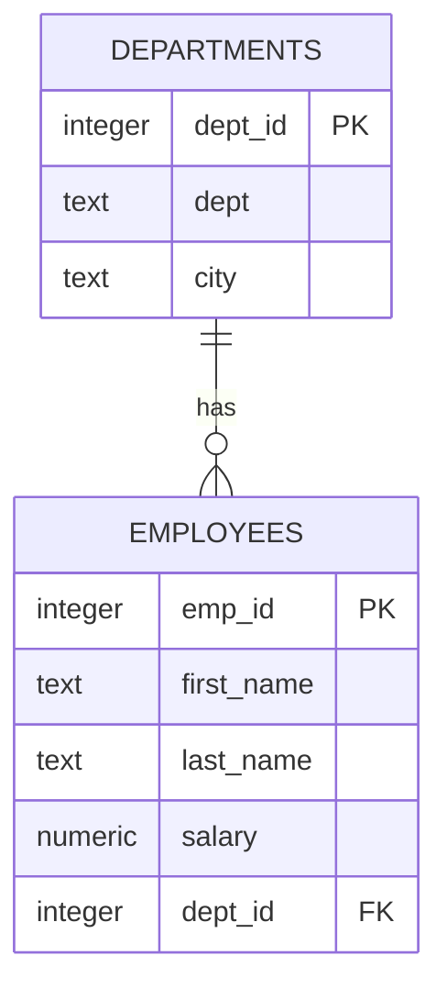

> **One-to-Many**: One department has many employees.

---

## 3. JOIN Types — Summary Table

| JOIN Type | Returns | Matching Rows | Non-Matching Rows |
|---|---|---|---|
| `JOIN` / `INNER JOIN` | Rows where values match in both tables | ✅ Included | ❌ Excluded |
| `LEFT JOIN` | All rows from left table + matches from right | ✅ Included | Left: included (right = NULL) |
| `RIGHT JOIN` | All rows from right table + matches from left | ✅ Included | Right: included (left = NULL) |
| `FULL OUTER JOIN` | All rows from both tables | ✅ Included | Both sides included (NULLs where missing) |
| `CROSS JOIN` | Every possible combination (Cartesian product) | N/A | All combinations |

---

## 4. JOIN Syntax Variants

| Syntax | Example | Notes |
|---|---|---|
| `JOIN ... ON` | `FROM a JOIN b ON a.id = b.id` | Standard; any Boolean expression. |
| `JOIN ... USING` | `FROM a JOIN b USING (id)` | Shorthand when column names are identical; column shown once. |
| Table Aliases | `FROM district_2020 AS d20` | Shorten long table names; `AS` is optional. |
| Multiple Joins | `FROM a JOIN b ON ... JOIN c ON ...` | Chain joins; no hard SQL limit. |

---

## 5. The School District Example (`district_2020` & `district_2035`)

### `district_2020`

| id (PK) | school_2020 |
|---|---|
| 1 | Oak Street School |
| 2 | Roosevelt High School |
| 5 | Dover Middle School |
| 6 | Webutuck High School |

### `district_2035`

| id (PK) | school_2035 |
|---|---|
| 1 | Oak Street School |
| 2 | Roosevelt High School |
| 3 | Morrison Elementary |
| 4 | Chase Magnet Academy |
| 6 | Webutuck High School |

### Visualizing Each JOIN

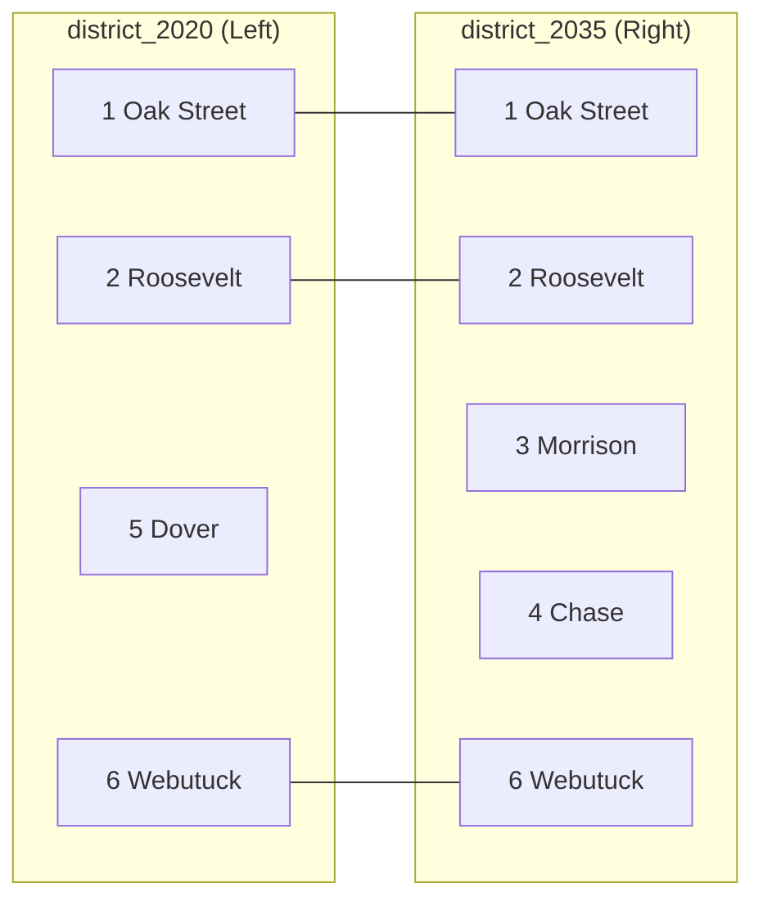

#### JOIN (INNER)

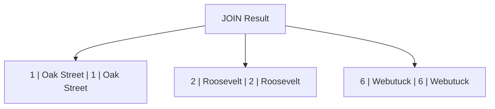

#### LEFT JOIN

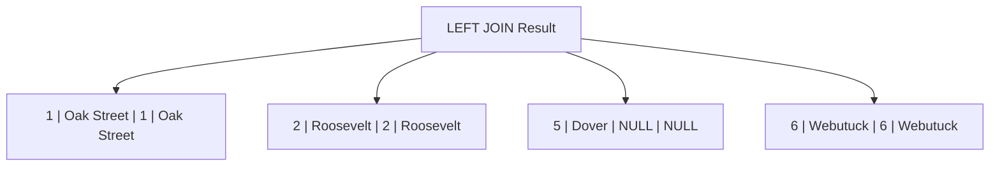

#### RIGHT JOIN

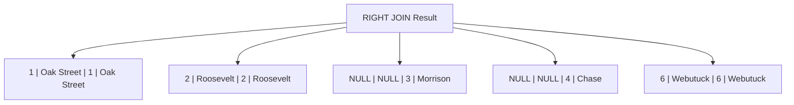

#### FULL OUTER JOIN

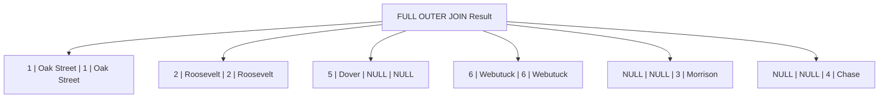

#### CROSS JOIN (Cartesian Product)

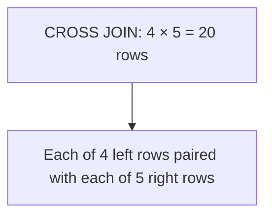

> ⚠️ **Warning**: CROSS JOIN on large tables (e.g., 250,000 × 250,000) produces 62.5 billion rows.

---

## 6. Finding Missing Values with NULL

| Concept | Description |
|---|---|
| `IS NULL` | Filters rows where a column has no value. |
| `IS NOT NULL` | Filters rows where a column has data. |
| **Anti-Join** | A LEFT JOIN + `WHERE right.id IS NULL` to find unmatched rows. |

---

## 7. Three Types of Table Relationships

| Relationship | Definition | Example | Diagram |
|---|---|---|---|
| **One-to-One** | One row in Table A matches exactly one row in Table B. | Census income ↔ education (one row per state). | `A ||--|| B` |
| **One-to-Many** | One row in Table A matches many rows in Table B. | Departments → Employees. | `A ||--o{ B` |
| **Many-to-Many** | Many rows in A relate to many rows in B (needs a junction table). | Baseball players ↔ positions. | `A }o--o{ B` |

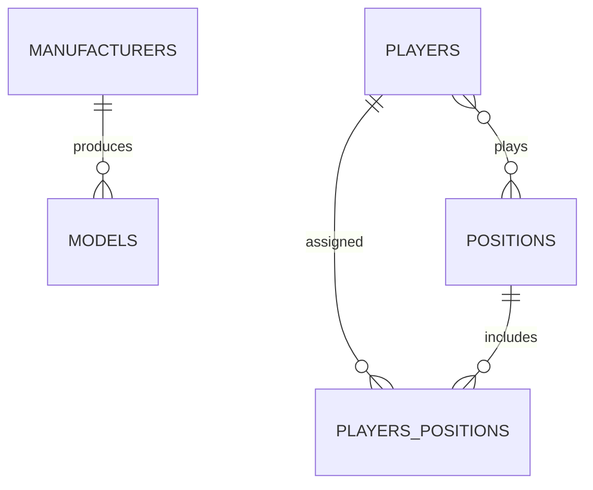

---

## 8. Selecting Specific Columns & Avoiding Ambiguity

| Problem | Solution |
|---|---|
| `SELECT id` when `id` exists in both tables → **ambiguous column error** | Prefix with table name: `SELECT district_2020.id` |
| Long, repetitive table names | Use table aliases: `FROM district_2020 AS d20` |
| Renaming output columns | Use `AS`: `SELECT d20.id AS d20_id` |

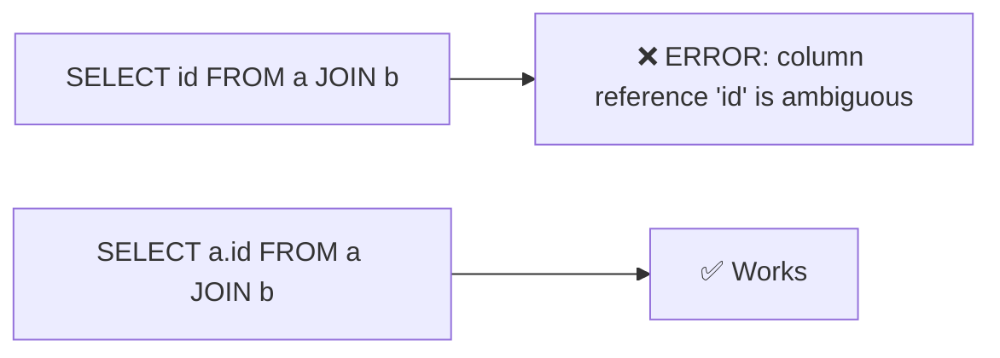

---

## 9. Joining Multiple Tables

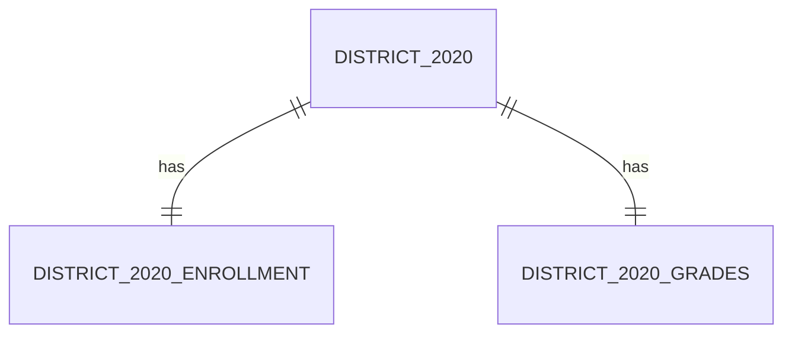

### Result of Three-Table Join

| id | school_2020 | enrollment | grades |
|---|---|---|---|
| 1 | Oak Street School | 360 | K-3 |
| 2 | Roosevelt High School | 1001 | 9-12 |
| 5 | Dover Middle School | 450 | 6-8 |
| 6 | Webutuck High School | 927 | 9-12 |

---

## 10. Set Operators (UNION, INTERSECT, EXCEPT)

| Operator | Description | Duplicates |
|---|---|---|
| `UNION` | Combines results of two queries. | Removed |
| `UNION ALL` | Combines results of two queries. | Kept |
| `INTERSECT` | Rows that exist in **both** query results. | Removed |
| `EXCEPT` | Rows in first query but **not** in second. | Removed |

> **Rule**: Both queries must produce the same number of columns with compatible data types.

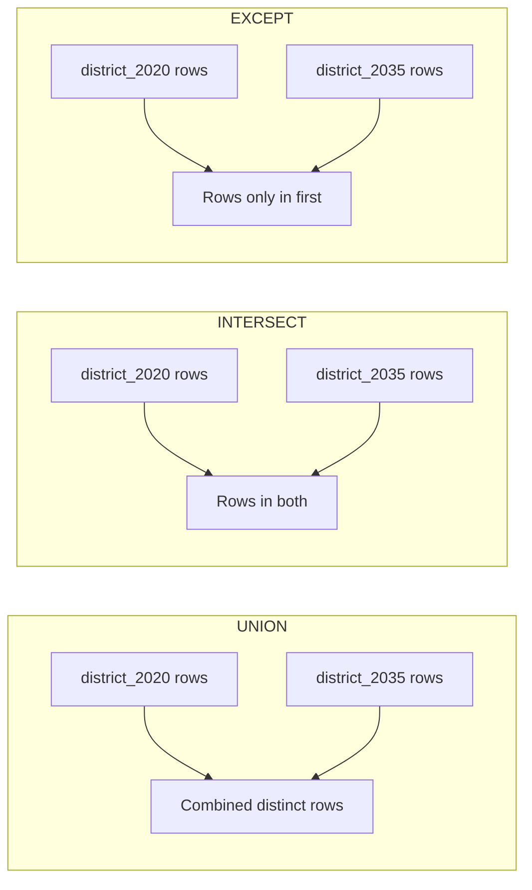

### UNION Example Result

| id | school_2020 |
|---|---|
| 1 | Oak Street School |
| 2 | Roosevelt High School |
| 3 | Morrison Elementary |
| 4 | Chase Magnet Academy |
| 5 | Dover Middle School |
| 6 | Webutuck High School |

### INTERSECT Example Result

| id | school_2020 |
|---|---|
| 1 | Oak Street School |
| 2 | Roosevelt High School |
| 6 | Webutuck High School |

### EXCEPT Example Result

| id | school_2020 |
|---|---|
| 5 | Dover Middle School |

---

## 11. Performing Math on Joined Table Columns

| Operation | Formula | Example |
|---|---|---|
| Raw change | `pop_2019 - pop_2010` | `15024 - 6359 = 8665` |
| Percent change | `round((pop_2019 - pop_2010) / pop_2010 * 100, 1)` | `136.3` |
| Join on multiple columns | `ON a.state_fips = b.state_fips AND a.county_fips = b.county_fips` | Ensures unique county match |

### Top 5 Fastest-Growing Counties (2010–2019)

| county_name | state_name | pop_2019 | pop_2010 | raw_change | pct_change |
|---|---|---|---|---|---|
| McKenzie County | North Dakota | 15024 | 6359 | 8665 | 136.3 |
| Loving County | Texas | 169 | 82 | 87 | 106.1 |
| Williams County | North Dakota | 37589 | 22399 | 15190 | 67.8 |
| Hays County | Texas | 230191 | 157103 | 73088 | 46.5 |
| Wasatch County | Utah | 34091 | 23525 | 10566 | 44.9 |

---

## 12. Complete JOIN Decision Flowchart

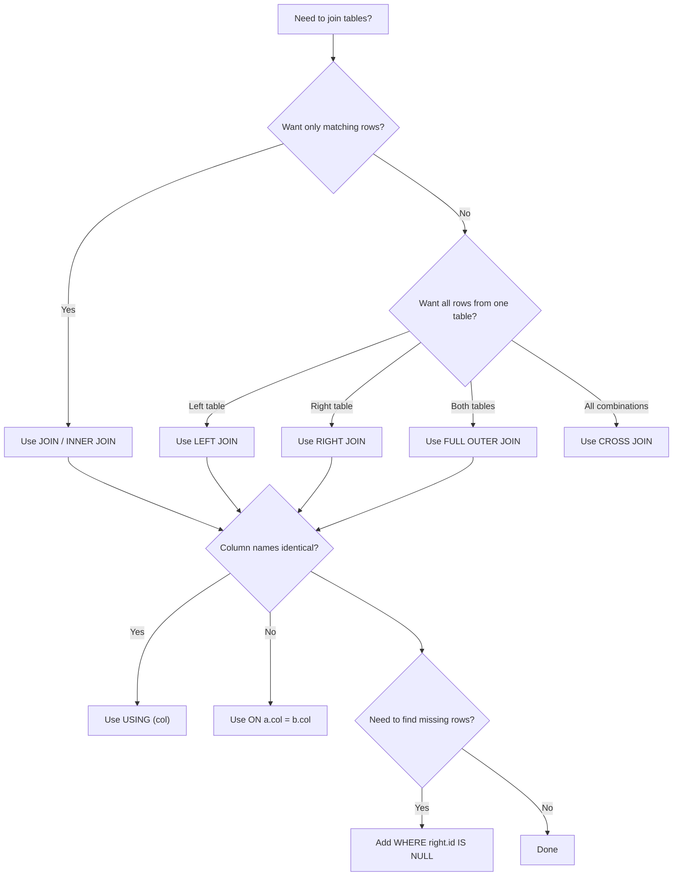

---

## 13. Key Takeaways

| # | Takeaway |
|---|---|
| 1 | Relational databases split data into related tables to reduce redundancy. |
| 2 | Primary keys uniquely identify rows; foreign keys link to other tables. |
| 3 | `JOIN ... ON` is the fundamental construct for linking tables. |
| 4 | Different JOIN types (INNER, LEFT, RIGHT, FULL OUTER, CROSS) serve different analytical needs. |
| 5 | `USING` simplifies syntax when column names match. |
| 6 | Table aliases make complex queries readable. |
| 7 | `NULL` represents unknown/missing data; `IS NULL` finds unmatched rows (anti-join). |
| 8 | Relationships can be one-to-one, one-to-many, or many-to-many. |
| 9 | Set operators (`UNION`, `INTERSECT`, `EXCEPT`) combine query results vertically. |
| 10 | Math functions work on joined columns; join on multiple columns for precision. |