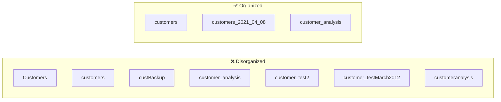
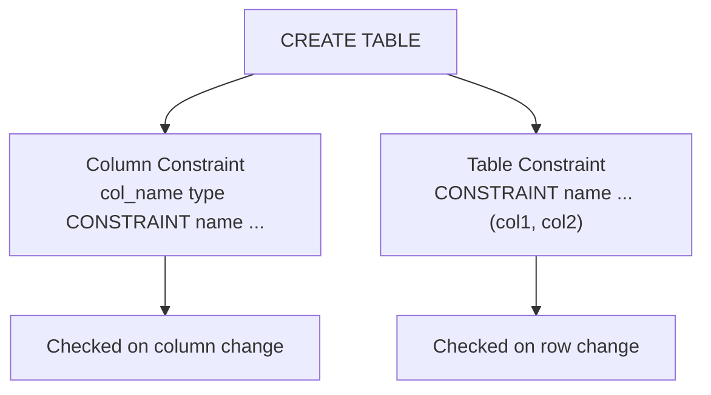
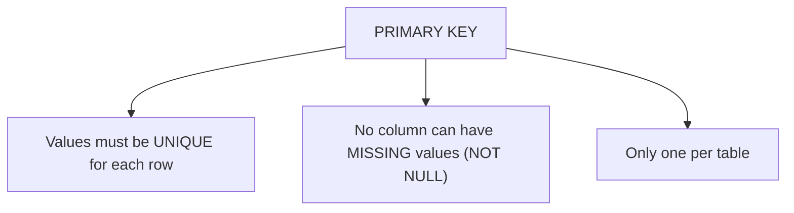
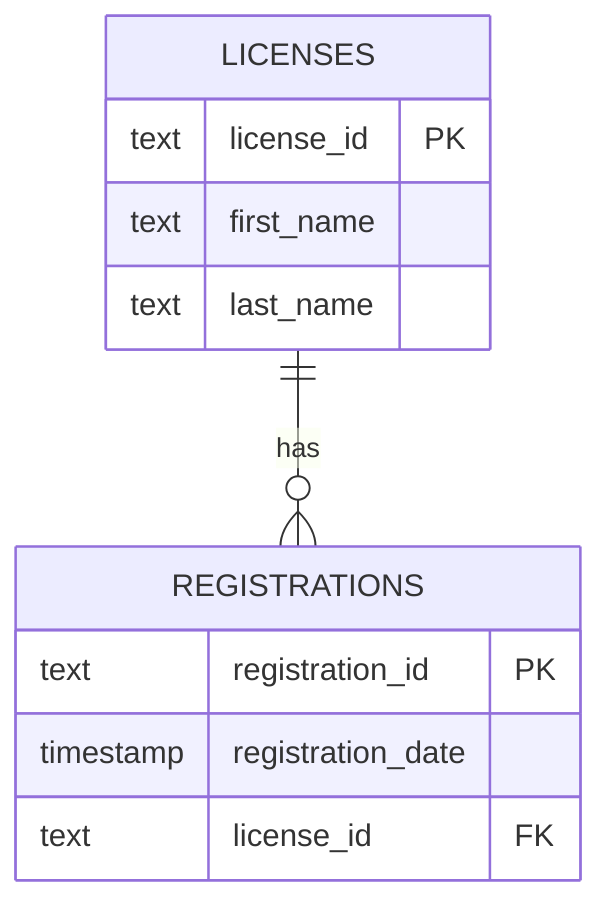
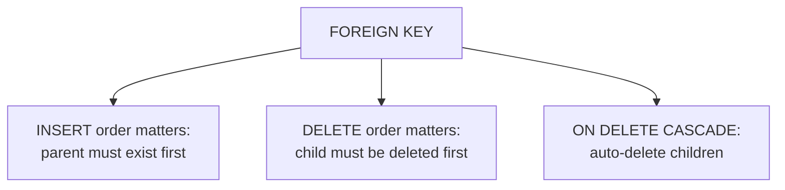
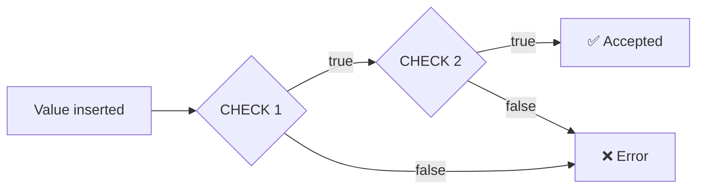
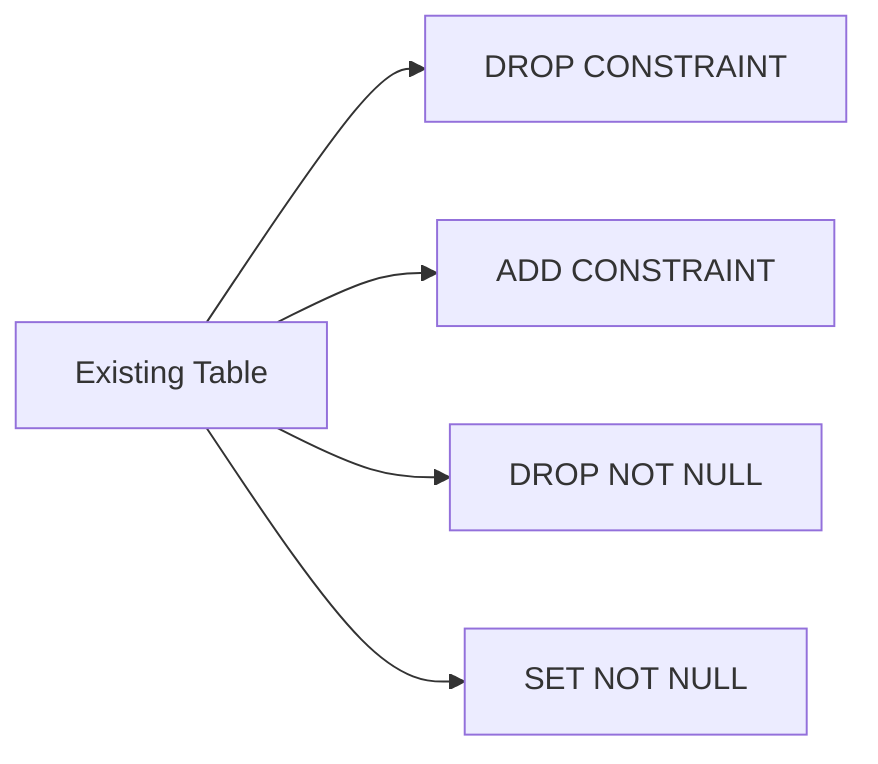
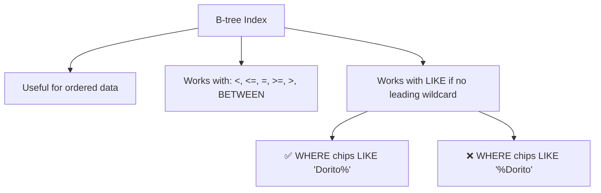
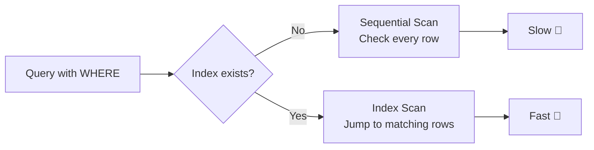
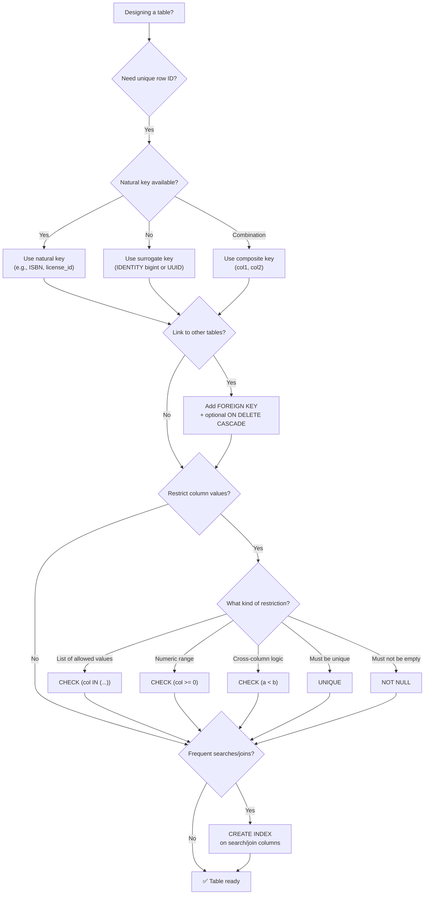

# Table Design That Works for You — Concepts, Tables & Diagrams

Below is a complete breakdown of Chapter 8, covering naming conventions, constraints, keys, and indexes with Markdown tables and Mermaid diagrams.

---

## 1. Chapter Overview

| Topic | Purpose |
|---|---|
| **Naming Conventions** | Consistency, readability, and avoiding pitfalls with quoted identifiers |
| **Constraints** | Controlling what data columns accept (CHECK, UNIQUE, NOT NULL, PRIMARY KEY, FOREIGN KEY) |
| **Primary Keys** | Natural vs. Surrogate vs. Composite |
| **Foreign Keys** | Referential integrity, CASCADE deletes |
| **Indexes** | Speeding up queries with B-tree and other index types |
| **EXPLAIN ANALYZE** | Benchmarking query performance before/after indexing |

---

## 2. Naming Conventions

### Case Styles Comparison

| Style | Example | Notes |
|---|---|---|
| **Camel Case** | `berrySmoothie` | First word lowercase, subsequent words capitalized |
| **Pascal Case** | `BerrySmoothie` | Every word capitalized (used by Microsoft SQL Server docs) |
| **Snake Case** | `berry_smoothie` | All lowercase, words separated by underscores (used in this book & PostgreSQL docs) |

### PostgreSQL Case Behavior

| Statement | Result |
|---|---|
| `CREATE TABLE customers (...)` | Creates table `customers` (lowercase) |
| `CREATE TABLE Customers (...)` | ❌ Error: `relation "customers" already exists` — treated same as `customers` |
| `CREATE TABLE "Customers" (...)` | Creates table `Customers` (must quote in all queries) |

### Quoting Identifiers — Pros & Cons

| Aspect | Detail |
|---|---|
| **Enables mixed case** | `"Customers"` is distinct from `customers` |
| **Allows spaces** | `"trees planted"` — but every reference must be quoted |
| **Allows reserved keywords** | e.g., `"SELECT"` — confusing and error-prone |
| **Recommendation** | Avoid quoting; use snake_case instead |

### Naming Guidelines

| Guideline | Example | Reason |
|---|---|---|
| Use snake case | `video_on_demand` | Readable, reliable, matches PostgreSQL docs |
| Avoid cryptic abbreviations | `arrival_time` not `arv_tm` | Clarity |
| Use plural table names | `teachers`, `vehicles`, `departments` | Each row = one entity instance |
| Mind the length | PostgreSQL: 63 chars; SQL standard: 128; older Oracle: 30 | Portability |
| Date-stamp table copies | `vehicle_parts_2021_04_08` | Sorts in date order |

### Bad vs. Good Naming Example



---

## 3. Constraint Types Overview

| Constraint | Purpose | NULL allowed? | Duplicates allowed? |
|---|---|---|---|
| **PRIMARY KEY** | Uniquely identifies each row | ❌ No | ❌ No |
| **FOREIGN KEY** | Links to another table's key | ✅ Yes | ✅ Yes |
| **UNIQUE** | Ensures unique values | ✅ Yes (multiple NULLs) | ❌ No |
| **NOT NULL** | Prevents empty values | ❌ No | ✅ Yes |
| **CHECK** | Boolean test must pass | Depends on test | Depends on test |

### Column vs. Table Constraints

| Type | Declaration Location | Applies To |
|---|---|---|
| **Column constraint** | After column name + data type | Single column |
| **Table constraint** | After all columns defined | One or more columns |



---

## 4. Primary Keys: Natural vs. Surrogate vs. Composite

### Comparison Table

| Key Type | Definition | Example | Pros | Cons |
|---|---|---|---|---|
| **Natural** | Uses existing meaningful column(s) | Driver's license ID, ISBN, part number | No extra column; meaningful | Data changes can break key |
| **Surrogate** | Artificial auto-generated value | `bigint GENERATED ALWAYS AS IDENTITY` | Guaranteed unique; stable | Extra column; no meaning |
| **Composite** | Combines 2+ columns | `(student_id, school_day)` | Uniqueness from combination | More complex queries |

### Natural Key Example

| driver_id | st | first_name | last_name |
|---|---|---|---|
| 10302019 | NY | Patrick | Corbin |
| 10302019 | FL | Howard | Kendrick |

> `driver_id` alone is **not** unique (same ID in different states), but `(driver_id, st)` **is** unique → **composite natural key**.

### Surrogate Key Example

| id | first_name | last_name |
|---|---|---|
| 1 | Patrick | Corbin |
| 2 | Howard | Kendrick |
| 3 | David | Martinez |

### UUID Example

```
2911d8a8-6dea-4a46-af23-d64175a08237
```

> ⚠️ UUIDs are 32 hex digits — inefficient compared to `bigint`. Use with caution.

### Primary Key Rules



### Single-Column Primary Key — Two Syntaxes

| Syntax | Example |
|---|---|
| Column constraint | `license_id text CONSTRAINT license_key PRIMARY KEY` |
| Table constraint | `CONSTRAINT license_key PRIMARY KEY (license_id)` |
| Omit name | `license_id text PRIMARY KEY` → PostgreSQL names it `table_pkey` |

### Composite Primary Key Example

| student_id | school_day | present |
|---|---|---|
| 775 | 2022-01-22 | Y |
| 775 | 2022-01-23 | Y |
| 775 | 2022-01-23 | N ❌ duplicate key violation |

```sql
CONSTRAINT student_key PRIMARY KEY (student_id, school_day)
```

### Auto-Incrementing Surrogate Key (IDENTITY)

```sql
CREATE TABLE surrogate_key_example (
    order_number bigint GENERATED ALWAYS AS IDENTITY,
    product_name text,
    order_time timestamp with time zone,
    CONSTRAINT order_number_key PRIMARY KEY (order_number)
);
```

| order_number | product_name | order_time |
|---|---|---|
| 1 | Beachball Polish | 2020-03-15 09:21:00-07 |
| 2 | Wrinkle De-Atomizer | 2017-05-22 14:00:00-07 |
| 3 | Flux Capacitor | 1985-10-26 01:18:00-07 |

### Restarting an IDENTITY Sequence

```sql
INSERT INTO surrogate_key_example
OVERRIDING SYSTEM VALUE
VALUES (4, 'Chicken Coop', '2021-09-03 10:33-07');

ALTER TABLE surrogate_key_example ALTER COLUMN order_number
RESTART WITH 5;

INSERT INTO surrogate_key_example (product_name, order_time)
VALUES ('Aloe Plant', '2020-03-15 10:09-07');
```

| order_number | product_name | order_time |
|---|---|---|
| 1 | Beachball Polish | 2020-03-15 09:21:00-07 |
| 2 | Wrinkle De-Atomizer | 2017-05-22 14:00:00-07 |
| 3 | Flux Capacitor | 1985-10-26 01:18:00-07 |
| 4 | Chicken Coop | 2021-09-03 10:33:00-07 |
| 5 | Aloe Plant | 2020-03-15 10:09:00-07 |

---

## 5. Foreign Keys & Referential Integrity

### Example: `licenses` and `registrations`



| licenses | registrations |
|---|---|
| `license_id` (PK) | `registration_id` + `license_id` (composite PK) |
| T229901 | A203391, T229901 ✅ |
| — | A75772, T000001 ❌ (no such license) |

### Rules Enforced by Foreign Keys



### ON DELETE CASCADE

```sql
CREATE TABLE registrations (
    registration_id text,
    registration_date date,
    license_id text REFERENCES licenses (license_id) ON DELETE CASCADE,
    CONSTRAINT registration_key PRIMARY KEY (registration_id, license_id)
);
```

> Deleting a row in `licenses` automatically deletes related rows in `registrations`.

---

## 6. CHECK Constraint

### Syntax

| Level | Syntax |
|---|---|
| Column | `col_name type CHECK (logical_expression)` |
| Table | `CONSTRAINT name CHECK (logical_expression)` |

### Example

```sql
CREATE TABLE check_constraint_example (
    user_id bigint GENERATED ALWAYS AS IDENTITY,
    user_role text,
    salary numeric(10,2),
    CONSTRAINT user_id_key PRIMARY KEY (user_id),
    CONSTRAINT check_role_in_list CHECK (user_role IN('Admin', 'Staff')),
    CONSTRAINT check_salary_not_below_zero CHECK (salary >= 0)
);
```

### Combining Multiple Tests

| Constraint | Expression |
|---|---|
| Both must pass | `CHECK (credits >= 120 AND tuition = 'Paid')` |
| Cross-column test | `CHECK (sale_price < retail_price)` |



---

## 7. UNIQUE Constraint

| Feature | PRIMARY KEY | UNIQUE |
|---|---|---|
| Uniqueness | ✅ Required | ✅ Required |
| NULLs allowed | ❌ No | ✅ Yes (multiple) |
| Count per table | 1 | Many |

### Example

```sql
CREATE TABLE unique_constraint_example (
    contact_id bigint GENERATED ALWAYS AS IDENTITY,
    first_name text,
    last_name text,
    email text,
    CONSTRAINT contact_id_key PRIMARY KEY (contact_id),
    CONSTRAINT email_unique UNIQUE (email)
);
```

| first_name | last_name | email |
|---|---|---|
| Samantha | Lee | slee@example.org |
| Betty | Diaz | bdiaz@example.org |
| Sasha | Lee | slee@example.org ❌ duplicate |

---

## 8. NOT NULL Constraint

```sql
CREATE TABLE not_null_example (
    student_id bigint GENERATED ALWAYS AS IDENTITY,
    first_name text NOT NULL,
    last_name text NOT NULL,
    CONSTRAINT student_id_key PRIMARY KEY (student_id)
);
```

> If `first_name` or `last_name` is omitted or NULL → ❌ error.

---

## 9. Removing & Adding Constraints with ALTER TABLE

| Operation | Syntax |
|---|---|
| Drop PK/FK/UNIQUE | `ALTER TABLE table_name DROP CONSTRAINT constraint_name;` |
| Drop NOT NULL | `ALTER TABLE table_name ALTER COLUMN column_name DROP NOT NULL;` |
| Add PK/FK/UNIQUE | `ALTER TABLE table_name ADD CONSTRAINT name ...;` |
| Add NOT NULL | `ALTER TABLE table_name ALTER COLUMN column_name SET NOT NULL;` |



> ⚠️ You can add a constraint only if existing data already satisfies it (no duplicates/NULLs for PK).

---

## 10. Indexes

### What Is an Index?

| Aspect | Detail |
|---|---|
| **Definition** | A separate data structure the database manages to speed up queries |
| **Analogy** | Like a book's index — find info without scanning every page |
| **Auto-created** | On PRIMARY KEY and UNIQUE constraints |
| **Default type** | B-tree (balanced tree) |
| **Other types** | GIN, GiST (PostgreSQL); varies by DBMS |

### B-tree Index Characteristics



### Creating an Index

```sql
CREATE INDEX street_idx ON new_york_addresses (street);
```

| Component | Meaning |
|---|---|
| `CREATE INDEX` | Command |
| `street_idx` | Index name (your choice) |
| `ON new_york_addresses` | Target table |
| `(street)` | Column(s) to index |

### EXPLAIN ANALYZE — Benchmarking

| Command | Purpose |
|---|---|
| `EXPLAIN` | Shows query plan (how DB will execute) |
| `EXPLAIN ANALYZE` | Executes query + shows actual timing |

#### Before Index — Sequential Scan

```
Parallel Seq Scan on new_york_addresses
  Filter: (street = 'BROADWAY'::text)
  Rows Removed by Filter: 312346
Execution Time: 389.232 ms
```

#### After Index — Index Scan

```
Bitmap Index Scan on street_idx
  Index Cond: (street = 'BROADWAY'::text)
Execution Time: 5.113 ms
```

### Performance Comparison (Table 8-1)

| Query filter | Before index | After index |
|---|---|---|
| `WHERE street = 'BROADWAY'` | 92 ms | 5 ms |
| `WHERE street = '52 STREET'` | 94 ms | 1 ms |
| `WHERE street = 'ZWICKY AVENUE'` | 93 ms | <1 ms |



### Dropping an Index

```sql
DROP INDEX index_name;
```

### When to Use Indexes — Guidelines

| Guideline | Reason |
|---|---|
| ✅ Index columns used in **table joins** | Avoid expensive sequential scans |
| ✅ Index **foreign key** columns | Speed up cascading deletes |
| ✅ Index columns frequently in **WHERE** clauses | Search performance |
| ✅ Use `EXPLAIN ANALYZE` to test | Optimization is a process |
| ❌ Don't index every column | Enlarges DB; slows INSERT/UPDATE/DELETE |
| ❌ Drop unused indexes | Reduce size; speed up writes |

> **Note**: Primary keys are indexed by default; foreign keys are **not** in PostgreSQL — they're a good target for manual indexing.

---

## 11. Complete Constraint & Index Decision Flowchart



---

## 12. Key Takeaways

| # | Takeaway |
|---|---|
| 1 | Pick a naming convention (snake_case recommended) and apply it **consistently**. |
| 2 | Avoid quoting identifiers; it complicates queries and can cause errors. |
| 3 | Use **plural** table names; keep names short, clear, and descriptive. |
| 4 | Constraints enforce data integrity at the database level. |
| 5 | **Primary keys** can be natural, surrogate, or composite. |
| 6 | **Foreign keys** enforce referential integrity; `ON DELETE CASCADE` automates cleanup. |
| 7 | **CHECK** constraints validate column values with Boolean expressions. |
| 8 | **UNIQUE** allows multiple NULLs; **PRIMARY KEY** does not. |
| 9 | **NOT NULL** ensures a column always has a value. |
| 10 | Use `ALTER TABLE` to add/drop constraints on existing tables. |
| 11 | **Indexes** dramatically speed up queries but add write overhead and storage. |
| 12 | Use `EXPLAIN ANALYZE` to measure query performance before/after indexing. |
| 13 | Index foreign keys and frequently-searched columns; don't over-index. |