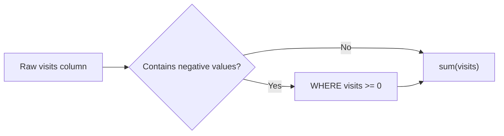
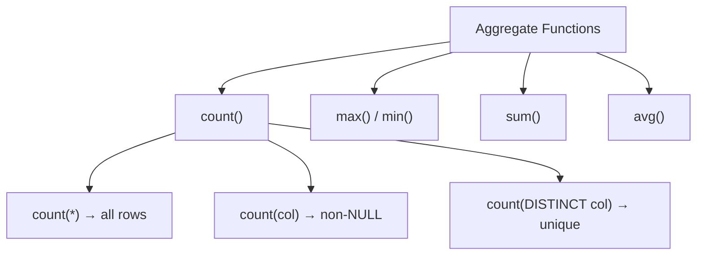
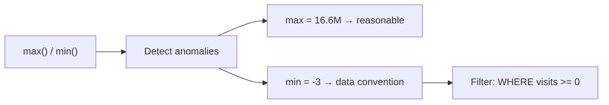
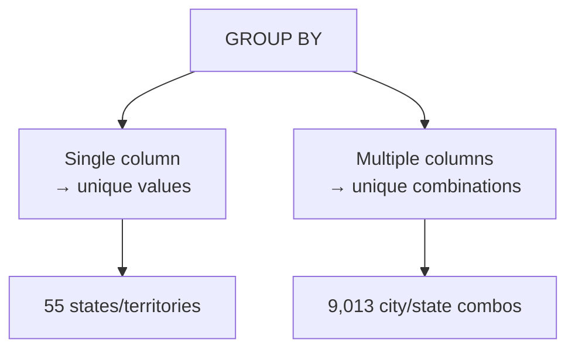
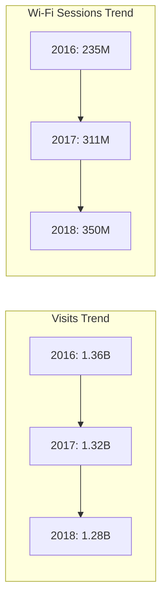
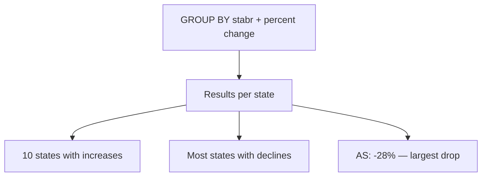
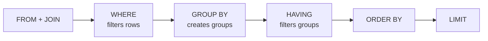
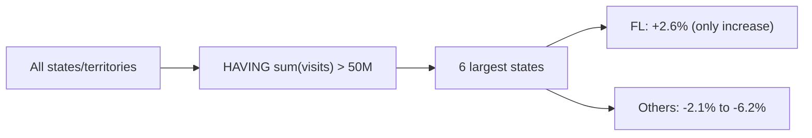
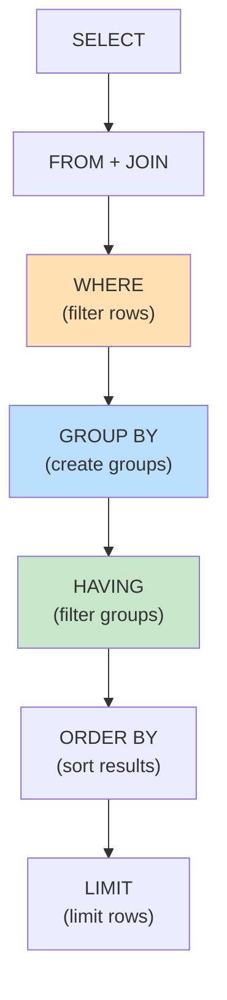

# Extracting Information by Grouping and Summarizing — Concepts, Tables & Diagrams

Below is a complete breakdown of Chapter 9, covering aggregate functions, `GROUP BY`, `HAVING`, and trend analysis using the Public Libraries Survey data.

---

## 1. Chapter Overview

| Topic | Purpose |
|---|---|
| **Aggregate Functions** | Combine values from multiple rows into a single result |
| **count()** | Count rows, non-NULL values, or distinct values |
| **max() / min()** | Find largest and smallest values; spot data issues |
| **sum()** | Total numeric values across rows |
| **GROUP BY** | Group results by one or more columns |
| **HAVING** | Filter results of aggregate functions |
| **Trend Analysis** | Compare metrics across multiple years using joins |

---

## 2. The Library Survey Dataset

### Three Tables Created

| Table | Year | Row Count | Primary Key | Index |
|---|---|---|---|---|
| `pls_fy2018_libraries` | 2018 | 9,261 | `fscskey` | `libname_2018_idx` |
| `pls_fy2017_libraries` | 2017 | 9,245 | `fscskey` | `libname_2017_idx` |
| `pls_fy2016_libraries` | 2016 | 9,252 | `fscskey` | `libname_2016_idx` |

### Table Structure (simplified)

| Column | Type | Notes |
|---|---|---|
| `stabr` | text NOT NULL | State abbreviation |
| `fscskey` | text PRIMARY KEY | Unique library code (natural key) |
| `libid` | text NOT NULL | Library ID |
| `libname` | text NOT NULL | Library agency name |
| `address` | text NOT NULL | Street address |
| `city` | text NOT NULL | City |
| `zip` | text NOT NULL | ZIP code |
| `visits` | integer | Annual visits (can be negative!) |
| `centlib` | integer | Number of central libraries |
| `branlib` | integer | Number of branch libraries |
| `wifisess` | integer | Wi-Fi sessions |
| `stataddr` | text | Address change status code |
| `phone` | text | Phone number |
| `longitude` | numeric(10,7) NOT NULL | Longitude |
| `latitude` | numeric(10,7) NOT NULL | Latitude |

### Negative Value Convention

| Value | Meaning |
|---|---|
| `-1` | Nonresponse to that question |
| `-3` | Not applicable (library closed temporarily or permanently) |

> ⚠️ **Important**: Always filter out negative values before summing, or totals will be incorrect.



---

## 3. Aggregate Functions Overview

| Function | Purpose | Example |
|---|---|---|
| `count(*)` | Count all rows (including NULLs) | `SELECT count(*) FROM table;` |
| `count(column)` | Count non-NULL values in a column | `SELECT count(phone) FROM table;` |
| `count(DISTINCT column)` | Count unique non-NULL values | `SELECT count(DISTINCT libname) FROM table;` |
| `max(column)` | Largest value | `SELECT max(visits) FROM table;` |
| `min(column)` | Smallest value | `SELECT min(visits) FROM table;` |
| `sum(column)` | Total of numeric values | `SELECT sum(visits) FROM table;` |
| `avg(column)` | Average of numeric values | `SELECT avg(visits) FROM table;` |



---

## 4. Counting Rows and Values

### Row Counts Match Expected Values

| Table | Expected Rows | Actual Count |
|---|---|---|
| `pls_fy2018_libraries` | 9,261 | 9,261 ✅ |
| `pls_fy2017_libraries` | 9,245 | 9,245 ✅ |
| `pls_fy2016_libraries` | 9,252 | 9,252 ✅ |

### Counting Non-NULL Values in `phone`

| Query | Result | Interpretation |
|---|---|---|
| `count(phone)` | 9,261 | Every row has a phone value |

### Counting Distinct Library Names

| Query | Result | Interpretation |
|---|---|---|
| `count(libname)` | 9,261 | All rows have a name |
| `count(DISTINCT libname)` | 8,478 | 526 agencies share names with others |

> Example: 10 agencies named `OXFORD PUBLIC LIBRARY` across different states.

---

## 5. Finding Max and Min Values — Spotting Data Issues

```sql
SELECT max(visits), min(visits)
FROM pls_fy2018_libraries;
```

| max | min |
|---|---|
| 16,686,945 | -3 |

> The `-3` reveals the negative-value convention. Must filter with `WHERE visits >= 0`.



---

## 6. GROUP BY — Basics

### GROUP BY on Single Column

```sql
SELECT stabr
FROM pls_fy2018_libraries
GROUP BY stabr
ORDER BY stabr;
```

| stabr |
|---|
| AK |
| AL |
| AR |
| AS |
| AZ |
| CA |
| ... |
| WY |

> Returns 55 unique state/territory abbreviations.

### GROUP BY on Multiple Columns

```sql
SELECT city, stabr
FROM pls_fy2018_libraries
GROUP BY city, stabr
ORDER BY city, stabr;
```

| city | stabr |
|---|---|
| ABBEVILLE | AL |
| ABBEVILLE | LA |
| ABBEVILLE | SC |
| ABBOTSFORD | WI |
| ABERDEEN | ID |
| ABERDEEN | SD |
| ABERNATHY | TX |
| ... | ... |

> Returns 9,013 rows — 248 fewer than total, meaning some city/state combos have multiple agencies.



---

## 7. Combining GROUP BY with count()

### Count Agencies by State

```sql
SELECT stabr, count(*)
FROM pls_fy2018_libraries
GROUP BY stabr
ORDER BY count(*) DESC;
```

| stabr | count |
|---|---|
| NY | 756 |
| IL | 623 |
| TX | 560 |
| IA | 544 |
| PA | 451 |
| MI | 398 |
| WI | 381 |
| MA | 369 |
| ... | ... |

### GROUP BY on Multiple Columns with count()

```sql
SELECT stabr, stataddr, count(*)
FROM pls_fy2018_libraries
GROUP BY stabr, stataddr
ORDER BY stabr, stataddr;
```

| stabr | stataddr | count |
|---|---|---|
| AK | 00 | 82 |
| AL | 00 | 220 |
| AL | 07 | 3 |
| AL | 15 | 1 |
| AR | 00 | 58 |
| AR | 07 | 1 |
| AR | 15 | 1 |
| AS | 00 | 1 |
| ... | ... | ... |

### `stataddr` Code Meanings

| Code | Meaning |
|---|---|
| `00` | No change from last year |
| `07` | Moved to a new location |
| `15` | Minor address change |

> Code `00` is most common in every state — expected and reassuring.


---

## 8. Revisiting sum() — Library Visits Trend

### Summing Visits Separately per Year

```sql
SELECT sum(visits) AS visits_2018 FROM pls_fy2018_libraries WHERE visits >= 0;
SELECT sum(visits) AS visits_2017 FROM pls_fy2017_libraries WHERE visits >= 0;
SELECT sum(visits) AS visits_2016 FROM pls_fy2016_libraries WHERE visits >= 0;
```

| Year | Total Visits |
|---|---|
| 2018 | 1,292,348,697 |
| 2017 | 1,319,803,999 |
| 2016 | 1,355,648,987 |

> Downward trend: ~5% drop from 2016 to 2018.

### Summing Visits on Joined Tables (Agencies in All 3 Years)

```sql
SELECT sum(pls18.visits) AS visits_2018,
       sum(pls17.visits) AS visits_2017,
       sum(pls16.visits) AS visits_2016
FROM pls_fy2018_libraries pls18
JOIN pls_fy2017_libraries pls17 ON pls18.fscskey = pls17.fscskey
JOIN pls_fy2016_libraries pls16 ON pls18.fscskey = pls16.fscskey
WHERE pls18.visits >= 0
  AND pls17.visits >= 0
  AND pls16.visits >= 0;
```

| visits_2018 | visits_2017 | visits_2016 |
|---|---|---|
| 1,278,148,838 | 1,319,325,387 | 1,355,078,384 |

> Trend holds; totals slightly smaller because only agencies present in all 3 years are included.

### Wi-Fi Sessions — A Different Trend

| Year | Wi-Fi Sessions |
|---|---|
| 2018 | 349,767,271 |
| 2017 | 311,336,231 |
| 2016 | 234,926,102 |

> **Insight**: Visits down, but Wi-Fi use up sharply — libraries' role is changing.



---

## 9. Grouping Visit Sums by State with Percent Change

```sql
SELECT pls18.stabr,
       sum(pls18.visits) AS visits_2018,
       sum(pls17.visits) AS visits_2017,
       sum(pls16.visits) AS visits_2016,
       round( (sum(pls18.visits::numeric) - sum(pls17.visits)) /
              sum(pls17.visits) * 100, 1 ) AS chg_2018_17,
       round( (sum(pls17.visits::numeric) - sum(pls16.visits)) /
              sum(pls16.visits) * 100, 1 ) AS chg_2017_16
FROM pls_fy2018_libraries pls18
JOIN pls_fy2017_libraries pls17 ON pls18.fscskey = pls17.fscskey
JOIN pls_fy2016_libraries pls16 ON pls18.fscskey = pls16.fscskey
WHERE pls18.visits >= 0
  AND pls17.visits >= 0
  AND pls16.visits >= 0
GROUP BY pls18.stabr
ORDER BY chg_2018_17 DESC;
```

### Top 10 States with Increases (2017→2018)

| stabr | visits_2018 | visits_2017 | visits_2016 | chg_2018_17 | chg_2017_16 |
|---|---|---|---|---|---|
| SD | 3,824,804 | 3,699,212 | 3,722,376 | 3.4 | -0.6 |
| MT | 4,332,900 | 4,215,484 | 4,298,268 | 2.8 | -1.9 |
| FL | 68,423,689 | 66,697,122 | 70,991,029 | 2.6 | -6.0 |
| ND | 2,216,377 | 2,162,189 | 2,201,730 | 2.5 | -1.8 |
| ID | 8,179,077 | 8,029,503 | 8,597,955 | 1.9 | -6.6 |
| DC | 3,632,539 | 3,593,201 | 3,930,763 | 1.1 | -8.6 |
| ME | 6,746,380 | 6,731,768 | 6,811,441 | 0.2 | -1.2 |
| NH | 7,045,010 | 7,028,800 | 7,236,567 | 0.2 | -2.9 |
| UT | 15,326,963 | 15,295,494 | 16,096,911 | 0.2 | -5.0 |
| DE | 4,122,181 | 4,117,904 | 4,125,899 | 0.1 | -0.2 |

### Bottom 5 States/Territories (Largest Declines)

| stabr | visits_2018 | visits_2017 | visits_2016 | chg_2018_17 | chg_2017_16 |
|---|---|---|---|---|---|
| GA | 26,835,701 | 28,816,233 | 27,987,249 | -6.9 | 3.0 |
| AR | 9,551,686 | 10,358,181 | 10,596,035 | -7.8 | -2.2 |
| GU | 75,119 | 81,572 | 71,813 | -7.9 | 13.6 |
| MS | 7,602,710 | 8,581,994 | 8,915,406 | -11.4 | -3.7 |
| HI | 3,456,131 | 4,135,229 | 4,490,320 | -16.4 | -7.9 |
| AS | 48,828 | 67,848 | 63,166 | -28.0 | 7.4 |

> **Insight**: Wide variation by state. Some show consecutive declines; others show gains after prior decreases.



---

## 10. HAVING — Filtering Aggregate Results

### Why HAVING?

| Clause | Filters | Works with Aggregates? |
|---|---|---|
| `WHERE` | Individual rows | ❌ No |
| `HAVING` | Groups (after aggregation) | ✅ Yes |



### Example: Only States with >50M Visits in 2018

```sql
...
GROUP BY pls18.stabr
HAVING sum(pls18.visits) > 50000000
ORDER BY chg_2018_17 DESC;
```

| stabr | visits_2018 | visits_2017 | visits_2016 | chg_2018_17 | chg_2017_16 |
|---|---|---|---|---|---|
| FL | 68,423,689 | 66,697,122 | 70,991,029 | 2.6 | -6.0 |
| NY | 97,921,323 | 100,012,193 | 103,081,304 | -2.1 | -3.0 |
| CA | 146,656,984 | 151,056,672 | 155,613,529 | -2.9 | -2.9 |
| IL | 63,466,887 | 66,166,082 | 67,336,230 | -4.1 | -1.7 |
| OH | 68,176,967 | 71,895,854 | 74,119,719 | -5.2 | -3.0 |
| TX | 66,168,387 | 70,514,138 | 70,975,901 | -6.2 | -0.7 |

> **Insight**: Among the 6 largest states, only Florida saw an increase. The rest declined 2–6%.



---

## 11. Complete Query Execution Order



| Clause | Purpose | Operates On |
|---|---|---|
| `WHERE` | Filter individual rows | Rows |
| `GROUP BY` | Create groups | Rows → Groups |
| `HAVING` | Filter groups | Groups |
| `ORDER BY` | Sort final results | Output rows |

---

## 12. Aggregate Functions — Quick Reference

| Function | Syntax | Use Case |
|---|---|---|
| `count(*)` | `count(*)` | Total row count |
| `count(col)` | `count(phone)` | Count non-NULL values |
| `count(DISTINCT col)` | `count(DISTINCT libname)` | Count unique values |
| `max(col)` | `max(visits)` | Largest value |
| `min(col)` | `min(visits)` | Smallest value |
| `sum(col)` | `sum(visits)` | Total numeric values |
| `avg(col)` | `avg(visits)` | Average value |
| `round(expr, n)` | `round(..., 1)` | Round to n decimals |

---

## 13. Key Takeaways

| # | Takeaway |
|---|---|
| 1 | **Aggregate functions** combine values from multiple rows into one result. |
| 2 | `count(*)` counts all rows; `count(col)` counts non-NULL; `count(DISTINCT col)` counts unique. |
| 3 | `max()` and `min()` help spot data anomalies (e.g., negative values). |
| 4 | Always **read the data documentation** to understand conventions like `-1`/`-3`. |
| 5 | Filter out negative values (`WHERE visits >= 0`) before summing. |
| 6 | `GROUP BY` eliminates duplicates and groups rows by one or more columns. |
| 7 | When selecting columns + aggregates, all non-aggregated columns **must** be in `GROUP BY`. |
| 8 | `sum()` on joined tables reveals trends across years. |
| 9 | **Percent change** formulas help compare trends across groups. |
| 10 | `HAVING` filters **groups** after aggregation; `WHERE` filters **rows** before. |
| 11 | Use `HAVING` when you need to filter on an aggregate result (e.g., `sum(visits) > 50000000`). |
| 12 | Data analysis often raises new questions — consult domain experts. |
| 13 | Trends can vary dramatically by subgroup (state, size, etc.) — always drill down. |