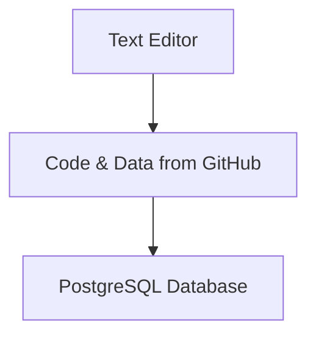
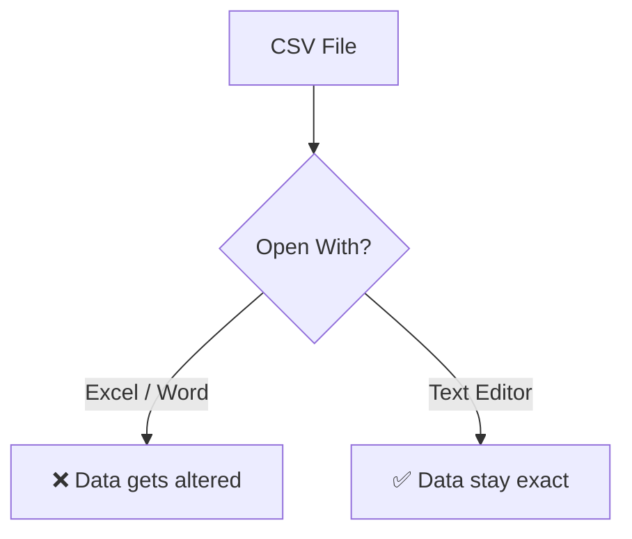

```mermaid
flowchart TD
    A[Text Editor] --> B[Code & Data from GitHub]
    B --> C[PostgreSQL Database]
``` 

---

## Why  Text Editor?

```mermaid
flowchart TD
    A[CSV File] --> B{Open With?}
    B -->|Excel / Word| C[❌ Data gets altered]
    B -->|Text Editor| D[✅ Data stay exact]
```

---

---

> "Proper planning prevents poor performance."

>Setting up correctly **avoids headache later**.