## 1. What Are Vector Embeddings?

**Vector embeddings** solve a fundamental challenge: how to represent complex, unstructured data (text, images, audio, video) in way that machine can understand and process efficiently.

- **Traditional data structure** work well for number, date and categorical value.
- **Embeddings** map raw data into vectors that capture **meaning** and **relation**.

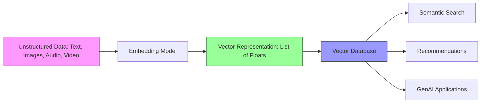

embeddings are **learned representations** where proximity in vector space reflects semantic similarity.

---

## 2. Evolution of Embeddings

### 2.1 Word2Vec: (2013)

Before Word2Vec, NLP used **sparse representations** like bag-of-words and TF-IDF, where words were discrete symbols without inherent relationships.

**Word2Vec** introduce **dense vectors** in a continuous vector space where geometric relationships captured semantic relationships.

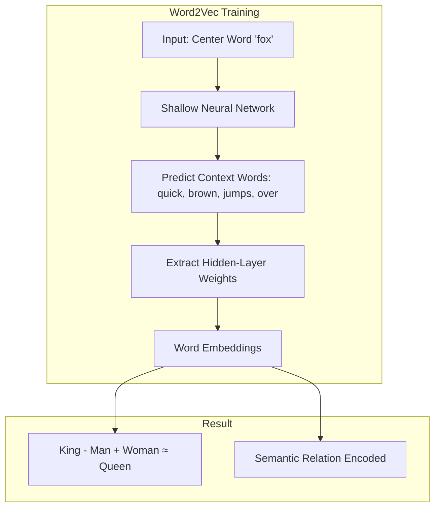

- Words in similar context get similar vectors.
- Vector arithmetic capture semantic relation.
- "You shall know a word by the company it keeps." — JR Firth

### 2.2 Doc2Vec: (2014)

**Doc2Vec** extended Word2Vec to represent larger text unit like sentence, paragraph, document as single vectors.

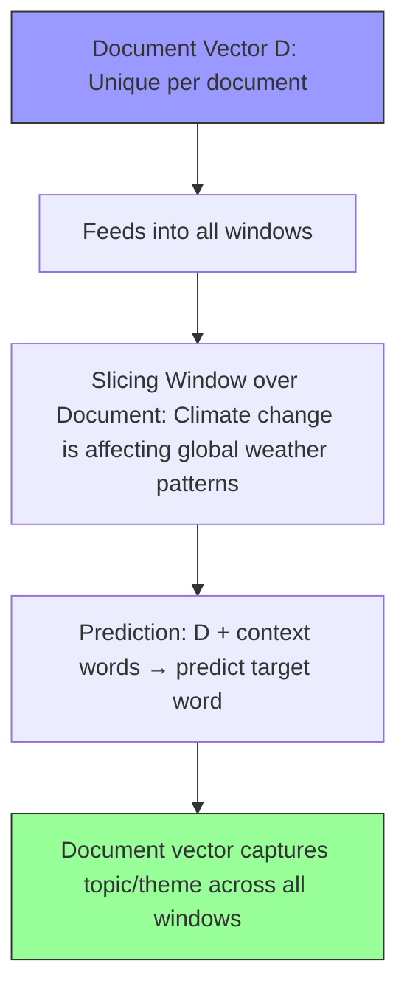

document vector act as additional memory, capturing global relation that persist across all sliding windows.

---

## 3. Sparse vs Dense Embeddings

| Feature | Sparse (One-Hot, TF-IDF) | Dense (Word2Vec, Transformers) |
|---------|--------------------------|--------------------------------|
| **Dimensiona** | 100,000+ (vocabulary size) | 100–1,000 |
| **Values** | Mostly zeros | All meaningful |
| **Memory** | Inefficient | Compact |
| **Semantics** | None (just identity) | Encoded in every dimension |
| **Relationships** | Weak | Strong |
| **Interpretability** | Easy | Hard |

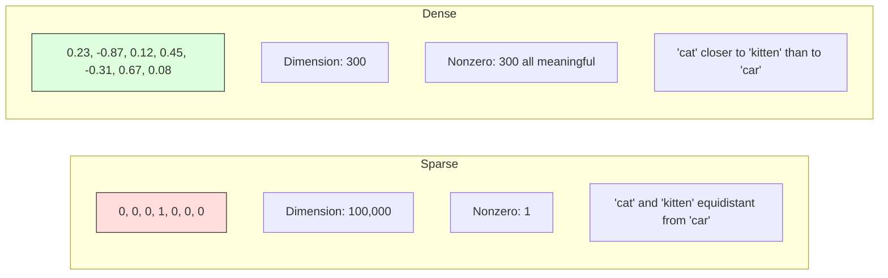

**Modern Systems:** combine dense embeddings for semantic matching and sparse vectors for exact keyword match.

---

## 4. Embeddings in Modern Language Models

### 4.1 The Transformer Connection

Vector embeddings are **fundamental building blocks** of modern LLMs. Every token must first be converted to a vector representation.

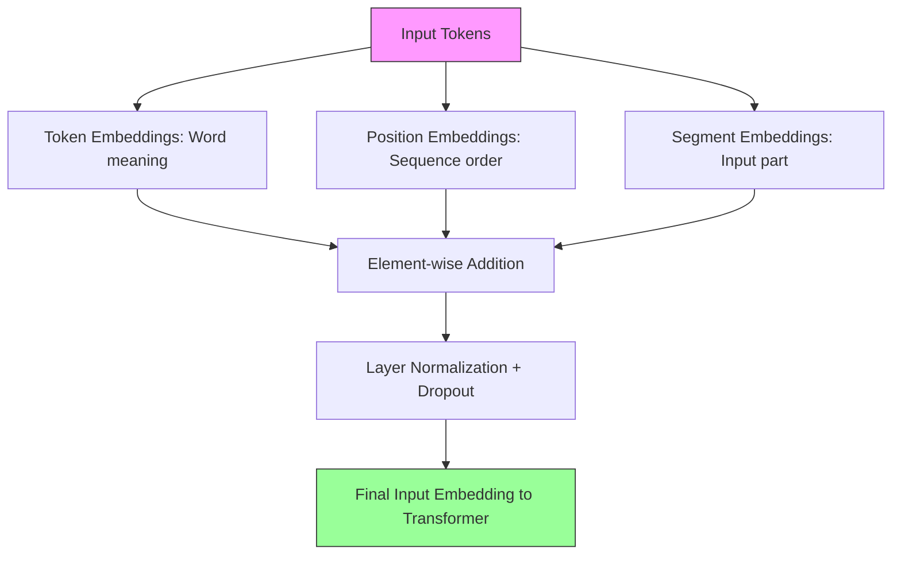

### 4.2 Three Transformer Architectures

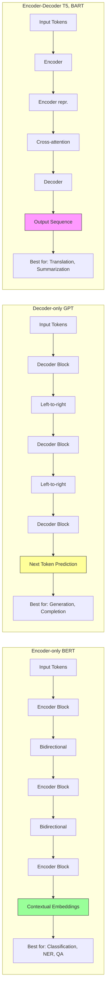

**Across all architecture:**
- **Input embeddings** convert tokens into vectors.
- **Positional embeddings** encode sequence order.
- **Layer embeddings** capture increasingly abstract features.
- **Output embeddings** map back to token probabilities.

---

## 5. Embedding Models: Specialized Vector Generators

Dedicated embedding model created for high-quality vector representation.

### 5.1 Distinction from Traditional Models

| Aspect | Embedding Models | LLMs (Internal Embeddings) |
|--------|------------------|----------------------------|
| **Architecture** | Optimized for embedding generation | Full generative architecture |
| **Consistency** | Consistent vectors for same input | Dynamic, context-dependent |
| **Efficiency** | Smaller, faster | Larger, slower |
| **Optimization** | Contrastive learning for similarity | Next-token prediction |

### 5.2 Contrastive Learning

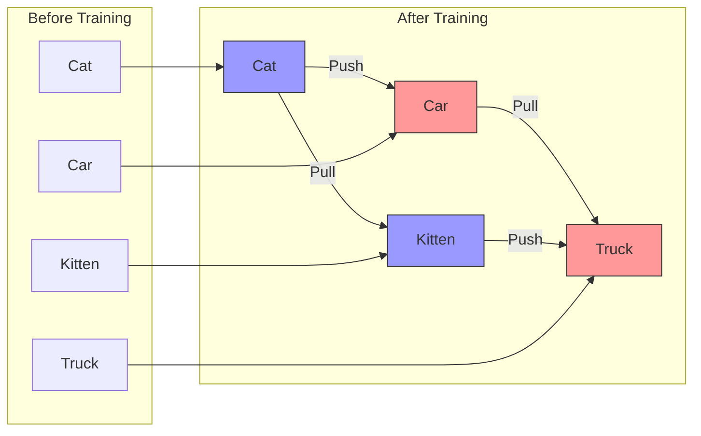

**Contrastive Learning:** Push similar vectors closer together and distinct vectors farther apart, increasing semantic contrast.

---

## 6. RAG Architecture 

Embedding model are essential component of **RAG pattern**, which is transforming how we build AI application.

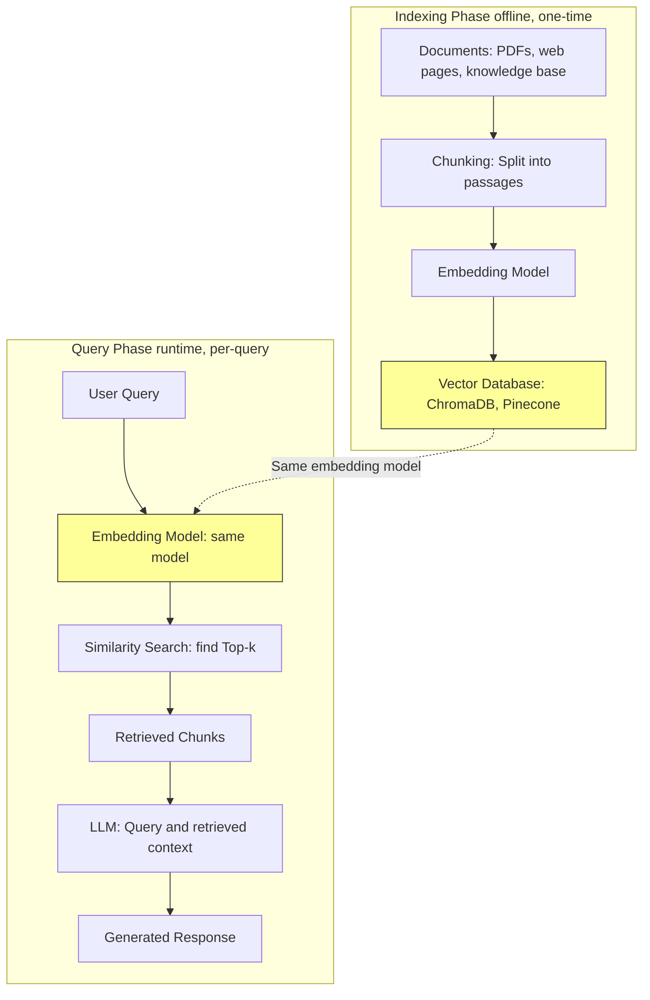

same embedding model used for indexing document and encoding query to ensure they exist in same vector space.

---

## 7. Practical Applications and Use Cases

Modern embedding models enable a wide range of applications:

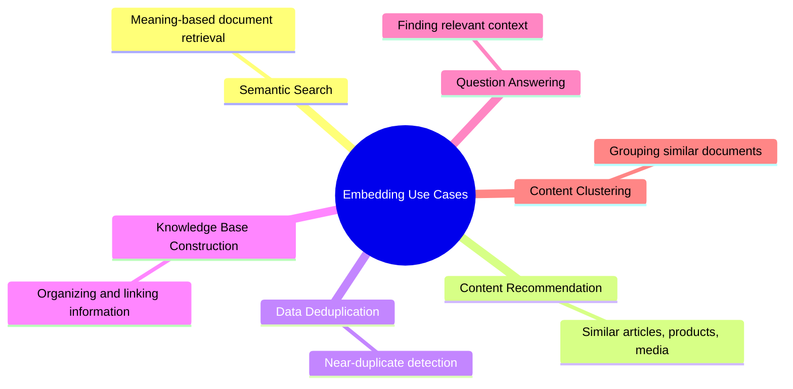

---

## 8. Sentence-transformers Library

offer pretrained models optimized for sentence embeddings.

### 8.1 Popular Models

| Model | Dimensions | Size | Speed | Best For |
|-------|-----------|------|-------|----------|
| `all-MiniLM-L6-v2` | 384 | ~80 MB | Very fast | Production, speed-critical |
| `all-mpnet-base-v2` | 768 | ~420 MB | Moderate | Accuracy-critical |
| `paraphrase-multilingual-mpnet-base-v2` | 768 | ~970 MB | Slower | Multilingual applications |

### 8.2 Simple RAG Pipeline

```python
from sentence_transformers import SentenceTransformer
from chromadb import Client, Settings
import chromadb

# Initialize the embedding model
model = SentenceTransformer('all-MiniLM-L6-v2')

# Initialize ChromaDB as vector store
chroma_client = Client(Settings(is_persistent=False))
collection = chroma_client.create_collection(name="climate_docs")

# Example documents
documents = [
    "Climate change is affecting global weather patterns, causing more extreme events.",
    "Rising sea levels threaten coastal communities worldwide.",
    "Greenhouse gas emissions continue to rise despite international agreements."
]

# Create embeddings for documents
embeddings = model.encode(documents)

# Store documents and embeddings
collection.add(
    embeddings=[e.tolist() for e in embeddings],
    documents=documents,
    ids=[f"doc_{i}" for i in range(len(documents))]
)

# Process a query
query = "How does climate change affect weather?"
query_embedding = model.encode(query)

# Search for similar documents
results = collection.query(
    query_embeddings=[query_embedding.tolist()],
    n_results=2
)

# Print results
for doc in results['documents'][0]:
    print(f"Retrieved document: {doc}")
```

### 8.3 Best Practices

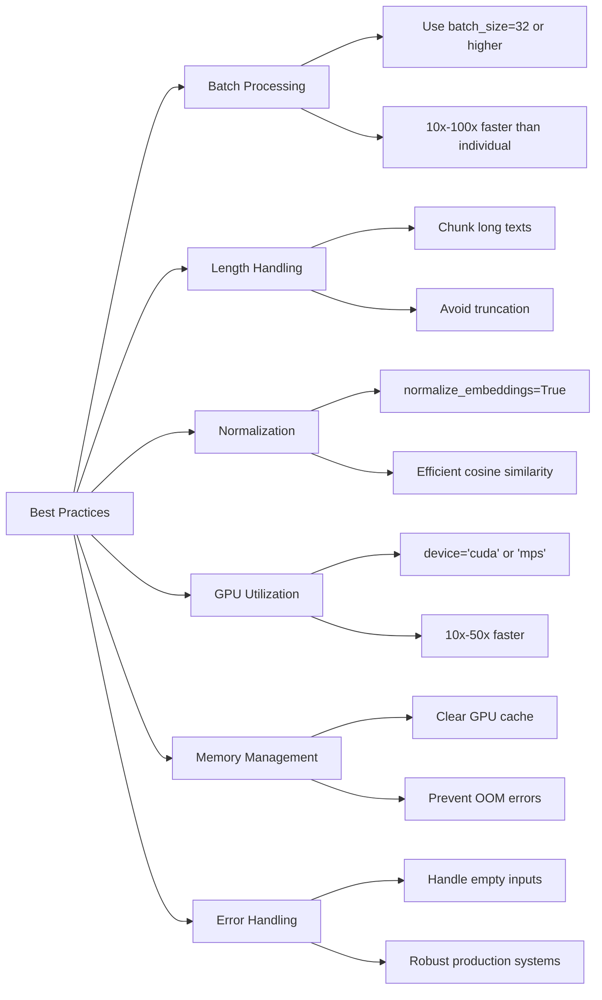

---

## 9. Zero-Shot Learning with Embeddings

generalize new concept without explicit training.

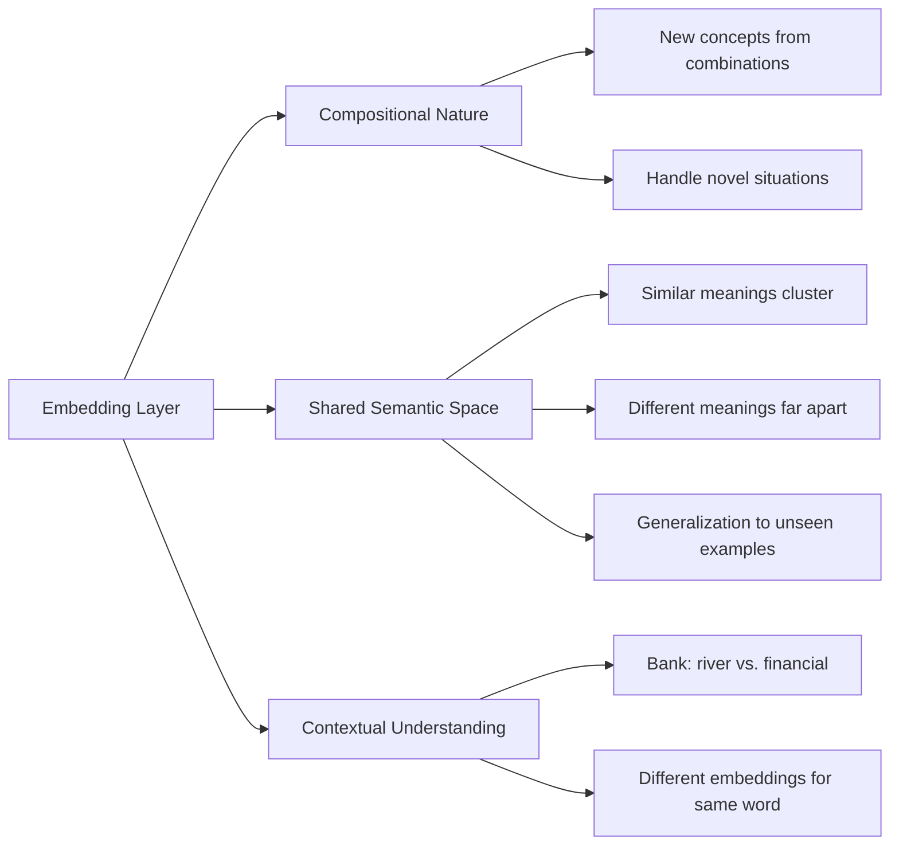

**Zero-Shot Classification**

```python
from sentence_transformers import SentenceTransformer, util
import torch

class ZeroShotClassifier:
    def __init__(self, model_name='all-mpnet-base-v2'):
        self.model = SentenceTransformer(model_name)
    
    def classify(self, text, candidate_labels):
        text_embedding = self.model.encode(text, convert_to_tensor=True)
        label_prompts = [f"This text is about {label}" for label in candidate_labels]
        label_embeddings = self.model.encode(label_prompts, convert_to_tensor=True)
        similarities = util.pytorch_cos_sim(text_embedding, label_embeddings)[0]
        results = {label: float(score) for label, score in zip(candidate_labels, similarities)}
        return results

# Example usage
classifier = ZeroShotClassifier()
text = "The new quantum computer can perform calculations in seconds that would take classical computers thousands of years."
labels = ["technology", "sports", "cooking", "politics"]
results = classifier.classify(text, labels)
print("Zero-shot classification results:")
for label, score in sorted(results.items(), key=lambda x: x[1], reverse=True):
    print(f"{label}: {score:.3f}")
```

---

## 10. Vector Arithmetic with Word2Vec

### 10.1 Setup

```bash
pip install gensim numpy nltk
```

### 10.2 Load Pretrained Model

```python
import gensim.downloader as api
import numpy as np

# Load Google's pretrained Word2Vec model (~1.6 GB)
word2vec_model = api.load('word2vec-google-news-300')

def cosine_similarity(vec1, vec2):
    return np.dot(vec1, vec2) / (np.linalg.norm(vec1) * np.linalg.norm(vec2))

def find_similar_words(vector, n=5):
    return word2vec_model.similar_by_vector(vector, topn=n)
```

### 10.3 Vector Arithmetic Functions

```python
def vector_arithmetic(*words_and_weights):
    """
    Perform vector arithmetic with words and weights.
    Example: vector_arithmetic(("king", 1), ("man", -1), ("woman", 1))
    """
    resulting_vector = np.zeros(word2vec_model.vector_size)
    for word, weight in words_and_weights:
        if word not in word2vec_model:
            raise ValueError(f"Word '{word}' not found in vocabulary")
        resulting_vector += weight * word2vec_model[word]
    return resulting_vector
```

### 10.4 Classic King–Queen Analogy

```python
def demonstrate_royal_analogy():
    print("\n=== Royal Analogy Demonstration ===")
    result = vector_arithmetic(
        ("king", 1),
        ("man", -1),
        ("woman", 1)
    )
    print_analogy_results(result, ["king", "man", "woman"], n_results=5)

demonstrate_royal_analogy()
```

**Output:**
```
=== Royal Analogy Demonstration ===
Vector arithmetic: king - man + woman
Most similar words:
queen: 0.7118
monarch: 0.6523
princess: 0.6342
kings: 0.6103
prince: 0.5932
```

### 10.5 More Analogies

```python
def explore_more_analogies():
    print("\n=== More Analogy Examples ===")
    
    # Paris : France :: Berlin : ?
    result1 = vector_arithmetic(("Paris", -1), ("France", 1), ("Berlin", 1))
    print("\nParis : France :: Berlin : ?")
    print_analogy_results(result1, ["Paris", "France", "Berlin"])
    
    # walking : walked :: running : ?
    result2 = vector_arithmetic(("walking", -1), ("walked", 1), ("running", 1))
    print("\nwalking : walked :: running : ?")
    print_analogy_results(result2, ["walking", "walked", "running"])
    
    # good : better :: bad : ?
    result3 = vector_arithmetic(("good", -1), ("better", 1), ("bad", 1))
    print("\ngood : better :: bad : ?")
    print_analogy_results(result3, ["good", "better", "bad"])

explore_more_analogies()
```

**Patterns Observed:**
- **Gender relationships:** king/queen, actor/actress
- **Verb tenses:** walk/walked, run/ran
- **Country-capital:** France/Paris, Germany/Berlin
- **Comparative forms:** good/better, bad/worse

---

## 11. Limitations and Considerations

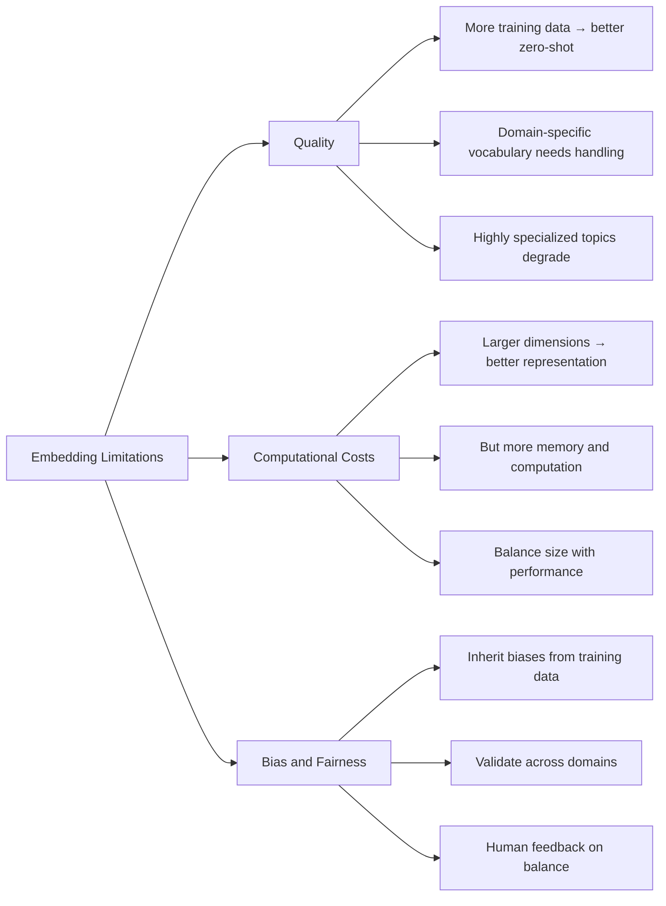

---

## 12. Latest Development

- **Multimodal embeddings:** Compatible embeddings across text, images, code
- **Instruction-tuned embeddings:** Adapt embedding strategies based on instructions
- **Domain-specific embeddings:** Optimized for legal, medical, scientific text
- **Hierarchical embeddings:** Multiple levels of granularity (words, sentences, paragraphs)
- **Efficient embedding:** Reduce dimension while maintaining semantic quality

---

## 13. Summary

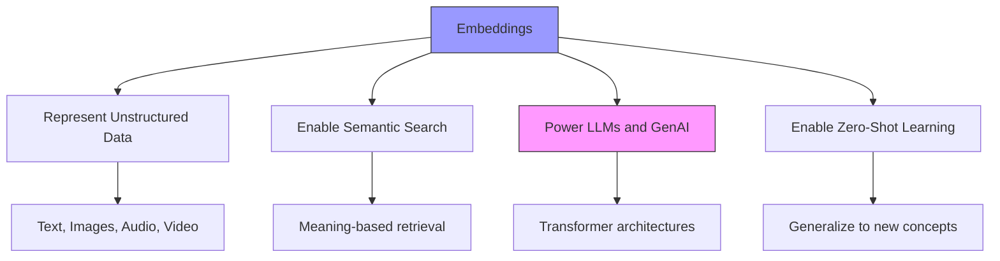

**Key Takeaways:**
1. **Embeddings** map unstructured data to vectors that capture meaning.
2. **Word2Vec** (2013) revolutionized NLP with dense, learned representations.
3. **Doc2Vec** extended this to documents and paragraphs.
4. **Transformer architectures** (BERT, GPT, T5) use embeddings as their foundation.
5. **Specialized embedding models** (sentence-transformers) power RAG applications.
6. **Vector arithmetic** reveals semantic relationships encoded in vector space.
7. **Best practices** include batching, normalization, GPU utilization, and error handling.

This foundation is essential for understanding vector database applications, especially RAG, which will be explored in subsequent chapters.