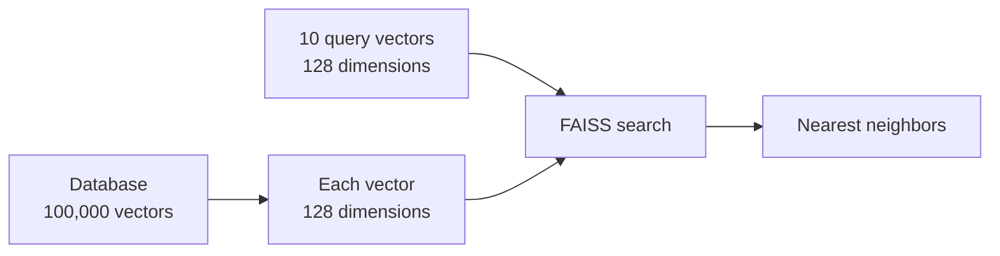
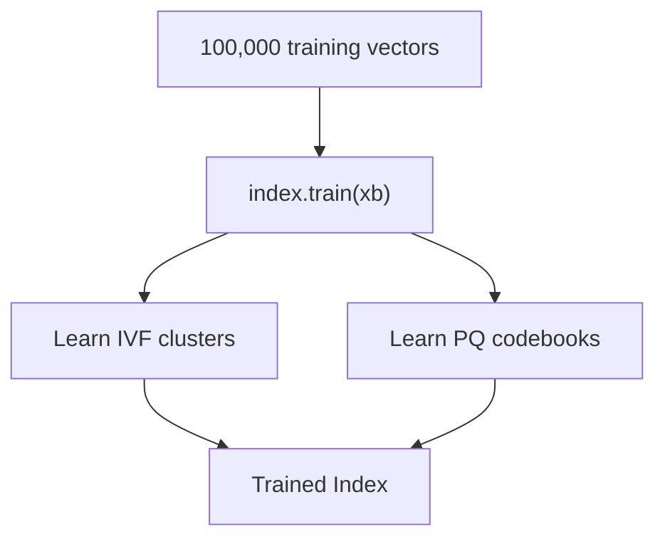
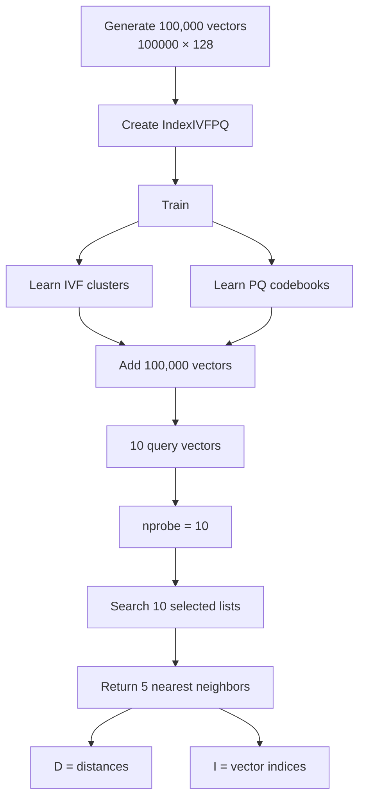

FAISS is a library for searching vectors efficiently. `IndexIVFPQ` combine **inverted-file index (IVF)** with **Product Quantization (PQ)** to reduce amount of work and memory needed for large vector searches.

---

```python
import faiss
import numpy as np
```

---

`faiss` is library we use for **similarity / nearest-neighbor search on vectors**.

For example, if we have:

```text
Vector A
Vector B
Vector C
Vector D
```

and a query:

```text
Query
```

FAISS can find:

```text
Query
  ↓
Which vectors are closest?
  ↓
A, C, D
```

FAISS provide different index structure such as `IndexFlatL2`, `IndexIVFPQ`, HNSW

---

```python
d = 128
nb = 100000
nq = 10
```

---

`d` means **dimension**.

> Every vector has 128 dimension.


```text
[0.12, 0.73, ...., 128]
```

---

`nb` **number of base vectors**.

> We have 100,000 vectors in our database.

---

`nq` **number of query vectors**.

search using 10 vectors.

```text
Query 1
Query 2
Query 3
...
Query 10
```

---




---

# 3. Creating database vectors

```python
xb = np.random.random((nb, d)).astype('float32')
```

---

```python
np.random.random(...)
```

generate random numbers between:

```text
0 and 1
```


```python
np.random.random(5)
```


```text
[0.21, 0.83, 0.14, 0.67, 0.45]
```

---

```python
(nb, d)
```

```python
(100000, 128)
```

> Create 2-dimensional array containing 100,000 rows and 128 columns.


```text
    
    r0│x |x |..|128  
    r1│x |x |..|128     
  ....|  |  |..|        r99999|x |x |..|128        
        
```

---

```python
.astype('float32')
```

`astype` 

> Convert data into particular data type.


```python
'float32'
```

> Store each number as 32-bit floating-point number.

For example:

```text
0.28374
0.91723
0.10293
```

are floating-point numbers.

FAISS commonly works with `float32` vectors, so this conversion is important. FAISS's vector interfaces use floating-point vector data. 

---

`xb` is the variable to store **database vectors**.

---

# Query vectors

```python
xq = np.random.random((nq, d)).astype('float32')
```

```text
(10, 128)
```

```text
10 queries
×
128 dimensions
```

---

# 8. Creating quantizer

```python
quantizer = faiss.IndexFlatL2(d)
```

---

## `faiss.IndexFlatL2`

`IndexFlatL2` FAISS index that perform **exact L2-distance search**.


```text
Index
  +
Flat
  +
L2
```

---

### `Flat`

store vectors without compression to compare directly.

`IndexFlatL2` perform L2 search. 

---

### `L2`

`L2` means **Euclidean distance**.

For two vectors:

```text
A = [1, 2]
B = [4, 6]
```

L2 distance is:

```text
√((1-4)² + (2-6)²)

= √(9 + 16)

= √25

= 5
```

Smaller distance :

```text
more similar
```


---

```python
faiss.IndexFlatL2(d)
```


```python
d = 128
```


```python
faiss.IndexFlatL2(128)
```

> Create L2 index for vectors containing 128 dimension.

---

# Creating IVF + PQ index

```python
index = faiss.IndexIVFPQ(quantizer, d, nlist, m, 8)
```


The constructor is essentially:

```text
IndexIVFPQ(
    quantizer,
    dimension,
    number_of_lists,
    number_of_subquantizers,
    bits_per_subquantizer
)
```

FAISS API define these parameters as `quantizer`, `d`, `nlist`, `M`, and `nbits_per_idx`.

---

# `IndexIVFPQ`

```python
faiss.IndexIVFPQ
```


```text
IVF
+
PQ
```

**IVF = Inverted File**

Instead of searching all:

```text
100,000 vectors
```

FAISS divides them into clusters.

```text
100,000 vectors

       ↓

┌─────────┬─────────┬─────┐
│Cluster  │ Cluster │ ... │
│    1    │    2    │     |
└─────────┴─────────┴─────
```

Your code uses:

```python
nlist = 100
```


```text
100 lists
```

IVF structure use quantizer to assign vectors to these inverted lists.

---

```python
quantizer
```


```python
faiss.IndexFlatL2(d)
```

IVF system use L2 index to determine **which cluster a vector belongs to**.


```text
Vector
   ↓
quantizer
   ↓
Which cluster?
   ↓
Cluster 37
```

---


```python
nlist = 100
```


```text
100 cluster
```

---

```python
m = 8
```

number of **PQ subquantizers**.

vector has:

```text
128 dimensions
```

 PQ divides it into:

```text
8 pieces
```

```text
128 / 8 = 16
```

Each subvector has 16 dimensions.

```text
128-dimensional vector

┌────────────┬────────────┬────────────┬─────┐
│ dimensions │ dimensions │ dimensions │ ... │
│    1-16    │   17-32    │   33-48    │     │
└────────────┴────────────┴────────────┴─────┘
       8 subquantizers total
```

FAISS require vector dimension to be compatible with number of subquantizers; here `128 / 8 = 16`, so it fits.

---


```python
faiss.IndexIVFPQ(quantizer, d, nlist, m, 8)
```

```python
8
```

> Use 8 bits per PQ subquantizer code.


```text
                 IndexIVFPQ
                     │
       ┌─────────────┼─────────────┐
       ▼             ▼             ▼
   quantizer         d          nlist
       │             │             │
   L2 index        128            100
                     
                     + 
                     
                   m = 8
                     
                     +
                     
                 nbits = 8
```

FAISS documents `IndexIVFPQ` as using `M` subquantizers and `nbits` bits per subquantizer. 

---

```python
index.train(xb)
```


`IndexIVFPQ` is **not ready to search immediately**.

It needs to learn:

```text
1. IVF clusters
2. PQ codebooks
```

FAISS's `IndexIVFPQ.train()` trains quantizer and subquantizers. 





```python
train()
```

does **not** mean:

> Train a neural network.

It means:

> Learn how to organize and compress vectors.

---


```python
index.add(xb)
```

put 100,000 vectors into FAISS index.

Before:

```text
xb
│
└── 100,000 vectors
```

After:

```text
FAISS index
│
├── List 0
├── List 1
├── List 2
├── ...
└── List 99
```

vectors are assigned to IVF lists and encoded using PQ representation. 

---
`IndexIVFPQ.add()` adds vectors using its encoding mechanism. 

---

 `nprobe`

```python
index.nprobe = 10
```

control **how many IVF listsFAISS examines during search**.

```text
nlist = 100
```

```text
100 total lists
```

but:

```text
nprobe = 10
```

> Search only 10 selected list instead of all 100.

```text
100 lists

┌────┬────┬────┬────┬────┬────┬────┬────┬────┐
│  1 │  2 │  3 │  4 │  5 │... │ 98 │ 99 │100 │
└────┴────┴────┴────┴────┴────┴────┴────┴────┘
          ▲
          │
       nprobe=10
          │
     search these
```

FAISS defines `nprobe` as number of inverted lists probed during search.

This create **speed ↔ recall tradeoff**:

```text
nprobe small
    ↓
faster
    ↓
may miss some true nearest neighbors

nprobe large
    ↓
more work
    ↓
better chance of finding nearest neighbors
```

---

```python
D, I = index.search(xq, 5)
```

> Search index using 10 query vector and return 5 nearest neighbors for each query.

---

## `index.search`

```python
index.search(...)
```

call FAISS's search operation.

---

## `xq`

```python
xq
```

is your query matrix:

```text
10 queries × 128 dimensions
```

---

## `5`

```python
index.search(xq, 5)
```

> Return 5 nearest vectors for each query.

```text
10 queries
×
5 results
```

produces:

```text
10 × 5
```

results.

---

# 19. `D`

```python
D, I = ...
```

`D` means **distances**.

For every result, FAISS gives you a distance.

For example:

```text
D =
[
 [0.23, 0.41, 0.52, 0.71, 0.88],
 [0.12, 0.31, 0.49, 0.63, 0.91],
 ...
]
```

Each row corresponds to one query.

For example:

```text
Query 0

Nearest:
1st → distance 0.23
2nd → distance 0.41
3rd → distance 0.52
4th → distance 0.71
5th → distance 0.88
```

With L2 search, smaller distance means closer. 

---

# 20. `I`

```python
I
```

`I` means **indices/IDs of  matching vectors**.

Suppose:

```text
I =
[
 [5321, 9182, 103, 7721, 445],
 ...
]
```

Then:

```text
Query 0
   │
   ├── closest → vector 5321
   ├── 2nd     → vector 9182
   ├── 3rd     → vector 103
   ├── 4th     → vector 7721
   └── 5th     → vector 445
```

FAISS's search returns both distances and labels/indices for nearest neighbors.

---

```python
print("Distances:", D)
```

---

```python
print("Indices:", I)
```

---

# The entire flow




## In one sentence

> **"Create 100,000 random 128-dimensional vectors, organize them into 100 IVF clusters, compress them using 8 PQ subquantizers with 8 bits each, then search 10 queries by examining 10 clusters and return the 5 closest vectors."**


```text
100,000 vectors
       │
       ▼
   100 IVF lists
       │
       ▼
   PQ compression
       │
       ▼
10 query vectors
       │
       ▼
  nprobe = 10
       │
       ▼
5 nearest neighbors
       │
   ┌───┴───┐
   ▼       ▼
   D       I
distance  index
```

One particularly important distinction is **`nlist=100` vs `nprobe=10`**:

|`nlist = 100`|Create **100 list**|
|---|---|
|`nprobe = 10`|Search **10 list**|
|`m = 8`|Split each 128-D vector into **8 PQ pieces**|
|final `8`|Use **8 bits** for each PQ piece|
|`5` in `search(xq, 5)`|Return **5 neighbors per query**|


