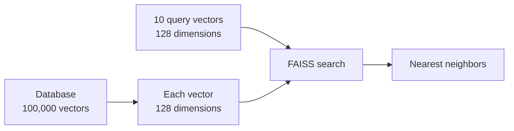
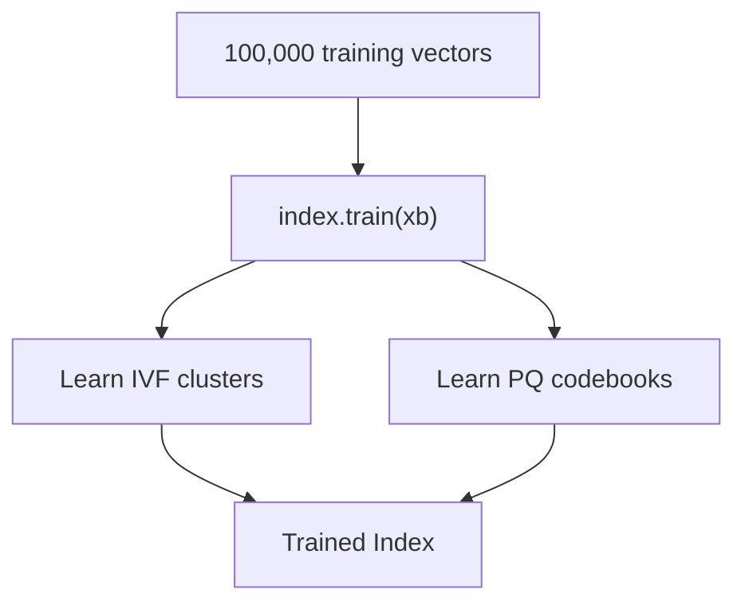
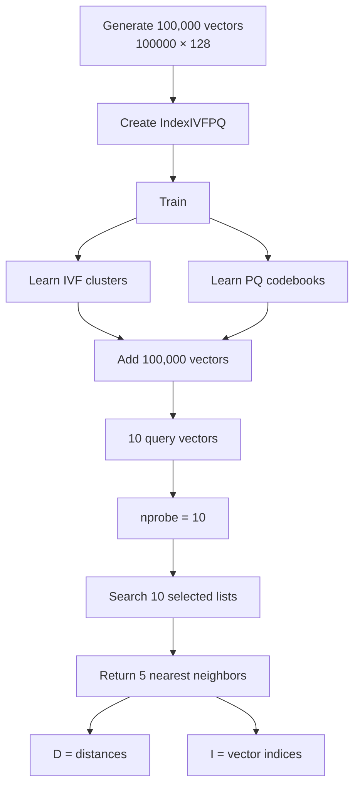

Absolutely. I’ll ignore the comments and explain the **actual Python code**, including what each important word, symbol, and number means.

FAISS is a library for searching vectors efficiently. `IndexIVFPQ` combines an **inverted-file index (IVF)** with **Product Quantization (PQ)** to reduce the amount of work and memory needed for large vector searches. ([GitHub](https://github.com/facebookresearch/faiss/wiki/Faiss-indexes?utm_source=chatgpt.com "Faiss indexes · facebookresearch/faiss Wiki · GitHub"))

---

# 1. Importing libraries

```python
import faiss
import numpy as np
```

## `import`

`import` means:

> "Bring a Python library into this program so I can use it."

For example:

```python
import numpy
```

means:

> Load the NumPy library.

---

## `faiss`

```python
import faiss
```

`faiss` is the library we use for **similarity / nearest-neighbor search on vectors**.

For example, if we have:

```text
Vector A
Vector B
Vector C
Vector D
```

and a query:

```text
Query
```

FAISS can find:

```text
Query
  ↓
Which vectors are closest?
  ↓
A, C, D
```

FAISS provides different index structures such as `IndexFlatL2`, `IndexIVFPQ`, HNSW, etc. ([GitHub](https://github.com/facebookresearch/faiss/wiki/Faiss-indexes?utm_source=chatgpt.com "Faiss indexes · facebookresearch/faiss Wiki · GitHub"))

---

## `np`

```python
import numpy as np
```

Here:

```text
numpy
  ↓
np
```

`np` is simply a **short name** for NumPy.

So instead of:

```python
numpy.random.random(...)
```

we can write:

```python
np.random.random(...)
```

---

# 2. Variables

```python
d = 128
nb = 100000
nq = 10
```

These are ordinary Python variables.

---

## `d`

```python
d = 128
```

`d` means **dimension**.

You are saying:

> Every vector has 128 numbers.

For example, a 4-dimensional vector could be:

```text
[0.12, 0.73, 0.41, 0.92]
```

Here:

```text
d = 4
```

Your code uses:

```text
d = 128
```

so one vector looks conceptually like:

```text
[
  x1, x2, x3, ... x128
]
```

Therefore:

```text
1 vector = 128 numbers
```

---

## `nb`

```python
nb = 100000
```

`nb` means **number of base vectors**.

Think:

```text
Database
├── vector 0
├── vector 1
├── vector 2
├── ...
└── vector 99999
```

So:

```text
nb = 100000
```

means:

> We have 100,000 vectors in our database.

---

## `nq`

```python
nq = 10
```

`nq` means **number of query vectors**.

You want to search using 10 vectors.

```text
Query 1
Query 2
Query 3
...
Query 10
```

So:

```text
nb = 100000
nq = 10
d  = 128
```

means:



---

# 3. Creating the database vectors

```python
xb = np.random.random((nb, d)).astype('float32')
```

This line has several pieces.

Let's break it from inside → outside.

---

## `np.random`

```python
np.random
```

`random` is NumPy's collection of functions for generating random numbers.

---

## `.random()`

```python
np.random.random(...)
```

This generates random numbers between:

```text
0 and 1
```

For example:

```python
np.random.random(5)
```

could produce:

```text
[0.21, 0.83, 0.14, 0.67, 0.45]
```

---

# 4. `(nb, d)`

```python
(nb, d)
```

Remember:

```python
nb = 100000
d = 128
```

Therefore:

```python
(nb, d)
```

becomes:

```python
(100000, 128)
```

This tells NumPy:

> Create a 2-dimensional array containing 100,000 rows and 128 columns.

So:

```text
100,000 vectors
        ×
128 numbers each
```

The shape is:

```text
(100000, 128)
```

Conceptually:

```text
              128 dimensions
        ┌───────────────────────┐
vector 0│ x x x x x x ... x     │
vector 1│ x x x x x x ... x     │
vector 2│ x x x x x x ... x     │
  ...   │         ...           │
vector 99999
        └───────────────────────┘
           100,000 vectors
```

---

# 5. `.astype('float32')`

```python
.astype('float32')
```

`astype` means:

> Convert the data into a particular data type.

Here:

```python
'float32'
```

means:

> Store each number as a 32-bit floating-point number.

For example:

```text
0.28374
0.91723
0.10293
```

are floating-point numbers.

FAISS commonly works with `float32` vectors, so this conversion is important. FAISS's vector interfaces use floating-point vector data. ([Faiss](https://faiss.ai/cpp_api/file/IndexIVFPQ_8h.html?utm_source=chatgpt.com "File IndexIVFPQ.h — Faiss documentation"))

---

# 6. `xb`

```python
xb = ...
```

`xb` is simply the variable name chosen to store the **base/database vectors**.

After this line:

```python
xb.shape
```

would be:

```text
(100000, 128)
```

So:

```text
xb
│
├── 100,000 vectors
│
└── each vector has 128 numbers
```

---

# 7. Query vectors

```python
xq = np.random.random((nq, d)).astype('float32')
```

This is almost identical.

We have:

```python
nq = 10
d = 128
```

Therefore:

```python
(nq, d)
```

becomes:

```python
(10, 128)
```

So:

```text
xq.shape
```

is:

```text
(10, 128)
```

Meaning:

```text
10 queries
×
128 dimensions
```

---

# 8. Creating the quantizer

```python
quantizer = faiss.IndexFlatL2(d)
```

This is an important line.

---

## `faiss.IndexFlatL2`

`IndexFlatL2` is a FAISS index that performs **exact L2-distance search**. ([Faiss](https://faiss.ai/cpp_api/struct/structfaiss_1_1IndexFlatL2.html?utm_source=chatgpt.com "Struct faiss::IndexFlatL2 — Faiss documentation"))

Let's break the name apart:

```text
Index
  +
Flat
  +
L2
```

### `Index`

An **index** is a data structure that helps us search data.

Think of a database index.

---

### `Flat`

`Flat` means the vectors are stored without this particular compression scheme and can be compared directly.

`IndexFlatL2` performs exhaustive L2 search. ([Faiss](https://faiss.ai/cpp_api/file/IndexFlat_8h.html?utm_source=chatgpt.com "File IndexFlat.h — Faiss documentation"))

---

### `L2`

`L2` means **Euclidean distance**.

For two vectors:

```text
A = [1, 2]
B = [4, 6]
```

L2 distance is:

```text
√((1-4)² + (2-6)²)

= √(9 + 16)

= √25

= 5
```

Smaller distance means:

```text
more similar
```

for L2-based nearest-neighbor search.

---

## `d`

```python
faiss.IndexFlatL2(d)
```

You previously defined:

```python
d = 128
```

Therefore:

```python
faiss.IndexFlatL2(128)
```

means:

> Create an L2 index for vectors containing 128 dimensions.

---

# 9. Creating the IVF + PQ index

```python
index = faiss.IndexIVFPQ(quantizer, d, nlist, m, 8)
```

This is the most important line.

The constructor is essentially:

```text
IndexIVFPQ(
    quantizer,
    dimension,
    number_of_lists,
    number_of_subquantizers,
    bits_per_subquantizer
)
```

The FAISS API defines these parameters as `quantizer`, `d`, `nlist`, `M`, and `nbits_per_idx`. ([Faiss](https://faiss.ai/cpp_api/struct/structfaiss_1_1IndexIVFPQ.html?utm_source=chatgpt.com "Struct faiss::IndexIVFPQ — Faiss documentation"))

Let's break every piece.

---

# 10. `IndexIVFPQ`

```python
faiss.IndexIVFPQ
```

It combines:

```text
IVF
+
PQ
```

### IVF

**IVF = Inverted File**

Instead of searching all:

```text
100,000 vectors
```

FAISS divides them into groups/lists.

For example:

```text
100,000 vectors

       ↓

┌─────────┬─────────┬─────────┬─────┐
│ Cluster │ Cluster │ Cluster │ ... │
│    1    │    2    │    3    │     │
└─────────┴─────────┴─────────┴─────┘
```

Your code uses:

```python
nlist = 100
```

so there are:

```text
100 lists
```

The IVF structure uses a quantizer to assign vectors to these inverted lists. ([GitHub](https://github.com/facebookresearch/faiss/wiki/Faiss-indexes?utm_source=chatgpt.com "Faiss indexes · facebookresearch/faiss Wiki · GitHub"))

---

# 11. `quantizer`

```python
quantizer
```

This is:

```python
faiss.IndexFlatL2(d)
```

So the IVF system uses the L2 index to determine **which cluster/list a vector belongs to**.

Think:

```text
Vector
   ↓
quantizer
   ↓
Which cluster?
   ↓
Cluster 37
```

---

# 12. `nlist`

```python
nlist = 100
```

This means:

```text
100 clusters/lists
```

Imagine your 100,000 vectors being organized like:

```text
             100,000 vectors
                    │
                    ▼
              ┌──────────┐
              │   IVF    │
              └────┬─────┘
                   │
       ┌───────────┼───────────┐
       ▼           ▼           ▼
    List 0       List 1      List 2 ... List 99
```

Each vector is assigned to one of these lists.

---

# 13. `m`

```python
m = 8
```

This is the number of **PQ subquantizers**.

Your vector has:

```text
128 dimensions
```

and PQ divides it into:

```text
8 pieces
```

Therefore:

```text
128 / 8 = 16
```

Each subvector has 16 dimensions.

Conceptually:

```text
128-dimensional vector

┌────────────┬────────────┬────────────┬─────┐
│ dimensions │ dimensions │ dimensions │ ... │
│    1-16    │   17-32    │   33-48    │     │
└────────────┴────────────┴────────────┴─────┘
       8 subquantizers total
```

FAISS requires the vector dimension to be compatible with the number of subquantizers; here `128 / 8 = 16`, so it fits. ([GitHub](https://github.com/facebookresearch/faiss/wiki/Faiss-indexes?utm_source=chatgpt.com "Faiss indexes · facebookresearch/faiss Wiki · GitHub"))

---

# 14. The final `8`

```python
faiss.IndexIVFPQ(quantizer, d, nlist, m, 8)
```

The final:

```python
8
```

means:

> Use 8 bits per PQ subquantizer code.

So the arguments are:

```text
                 IndexIVFPQ
                     │
       ┌─────────────┼─────────────┐
       ▼             ▼             ▼
   quantizer         d          nlist
       │             │             │
   L2 index        128            100
                     
                     + 
                     
                   m = 8
                     
                     +
                     
                 nbits = 8
```

FAISS documents `IndexIVFPQ` as using `M` subquantizers and `nbits` bits per subquantizer. ([Faiss](https://faiss.ai/cpp_api/struct/structfaiss_1_1IndexIVFPQ.html?utm_source=chatgpt.com "Struct faiss::IndexIVFPQ — Faiss documentation"))

---

# 15. Training

```python
index.train(xb)
```

This is extremely important.

`IndexIVFPQ` is **not ready to search immediately**.

It needs to learn:

```text
1. IVF clusters
2. PQ codebooks
```

FAISS's `IndexIVFPQ.train()` trains the quantizer and the subquantizers. ([Faiss](https://faiss.ai/cpp_api/struct/structfaiss_1_1IndexIVFPQ.html?utm_source=chatgpt.com "Struct faiss::IndexIVFPQ — Faiss documentation"))

Think:



The important idea:

```python
train()
```

does **not** mean:

> Train a neural network.

It means:

> Learn how to organize and compress the vectors.

---

# 16. Adding vectors

```python
index.add(xb)
```

Now you put the 100,000 vectors into the FAISS index.

Before:

```text
xb
│
└── 100,000 vectors
```

After:

```text
FAISS index
│
├── List 0
├── List 1
├── List 2
├── ...
└── List 99
```

The vectors are assigned to the IVF lists and encoded using the PQ representation. `IndexIVFPQ.add()` adds vectors using its encoding mechanism. ([Faiss](https://faiss.ai/cpp_api/struct/structfaiss_1_1IndexIVFPQ.html?utm_source=chatgpt.com "Struct faiss::IndexIVFPQ — Faiss documentation"))

---

# 17. `nprobe`

```python
index.nprobe = 10
```

This controls **how many IVF lists FAISS examines during search**.

You have:

```text
nlist = 100
```

So:

```text
100 total lists
```

but:

```text
nprobe = 10
```

means:

> Search only 10 selected lists instead of all 100.

Conceptually:

```text
100 lists

┌────┬────┬────┬────┬────┬────┬────┬────┬────┐
│  1 │  2 │  3 │  4 │  5 │... │ 98 │ 99 │100 │
└────┴────┴────┴────┴────┴────┴────┴────┴────┘
          ▲
          │
       nprobe=10
          │
     search these
```

FAISS defines `nprobe` as the number of inverted lists probed during search. ([Faiss](https://faiss.ai/cpp_api/struct/structfaiss_1_1IndexIVFPQ.html?utm_source=chatgpt.com "Struct faiss::IndexIVFPQ — Faiss documentation"))

This creates a **speed ↔ recall tradeoff**:

```text
nprobe small
    ↓
faster
    ↓
may miss some true nearest neighbors

nprobe large
    ↓
more work
    ↓
better chance of finding nearest neighbors
```

---

# 18. Searching

```python
D, I = index.search(xq, 5)
```

This means:

> Search the index using the 10 query vectors and return the 5 nearest neighbors for each query.

---

## `index.search`

```python
index.search(...)
```

calls FAISS's search operation.

---

## `xq`

```python
xq
```

is your query matrix:

```text
10 queries × 128 dimensions
```

---

## `5`

```python
index.search(xq, 5)
```

The `5` means:

> Return the 5 nearest vectors for each query.

So:

```text
10 queries
×
5 results
```

produces:

```text
10 × 5
```

results.

---

# 19. `D`

```python
D, I = ...
```

`D` means **distances**.

For every result, FAISS gives you a distance.

For example:

```text
D =
[
 [0.23, 0.41, 0.52, 0.71, 0.88],
 [0.12, 0.31, 0.49, 0.63, 0.91],
 ...
]
```

Each row corresponds to one query.

For example:

```text
Query 0

Nearest:
1st → distance 0.23
2nd → distance 0.41
3rd → distance 0.52
4th → distance 0.71
5th → distance 0.88
```

With L2 search, smaller distance means closer. ([Faiss](https://faiss.ai/cpp_api/struct/structfaiss_1_1IndexFlatL2.html?utm_source=chatgpt.com "Struct faiss::IndexFlatL2 — Faiss documentation"))

---

# 20. `I`

```python
I
```

`I` means the **indices/IDs of the matching vectors**.

Suppose:

```text
I =
[
 [5321, 9182, 103, 7721, 445],
 ...
]
```

Then:

```text
Query 0
   │
   ├── closest → vector 5321
   ├── 2nd     → vector 9182
   ├── 3rd     → vector 103
   ├── 4th     → vector 7721
   └── 5th     → vector 445
```

FAISS's search returns both distances and labels/indices for nearest neighbors. ([Faiss](https://faiss.ai/cpp_api/struct/structfaiss_1_1IndexFlatL2.html?utm_source=chatgpt.com "Struct faiss::IndexFlatL2 — Faiss documentation"))

---

# 21. Printing

```python
print("Distances:", D)
```

`print()` displays something on the screen.

```python
"Distances:"
```

is a Python string.

`,` separates the things being printed.

So:

```python
print("Distances:", D)
```

means:

```text
Print the text "Distances:"
then print D
```

---

Similarly:

```python
print("Indices:", I)
```

prints:

```text
Indices:
```

followed by the vector IDs.

---

# The entire flow

Your entire program is basically doing this:



## In one sentence

Your code says:

> **"Create 100,000 random 128-dimensional vectors, organize them into 100 IVF clusters, compress them using 8 PQ subquantizers with 8 bits each, then search 10 queries by examining 10 clusters and return the 5 closest vectors."**

And the key structure is:

```text
100,000 vectors
       │
       ▼
   100 IVF lists
       │
       ▼
   PQ compression
       │
       ▼
10 query vectors
       │
       ▼
  nprobe = 10
       │
       ▼
5 nearest neighbors
       │
   ┌───┴───┐
   ▼       ▼
   D       I
distance  index
```

One particularly important distinction is **`nlist=100` vs `nprobe=10`**:

|Variable|Meaning|
|---|---|
|`nlist = 100`|Create **100 total clusters/lists**|
|`nprobe = 10`|Search **10 of those 100 lists**|
|`m = 8`|Split each 128-D vector into **8 PQ pieces**|
|final `8`|Use **8 bits** for each PQ piece|
|`5` in `search(xq, 5)`|Return **5 neighbors per query**|
