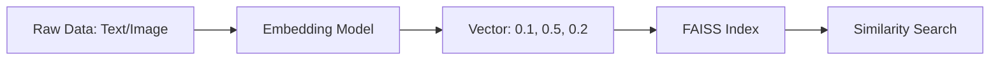
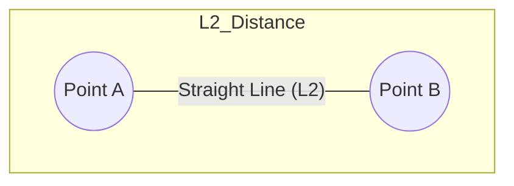
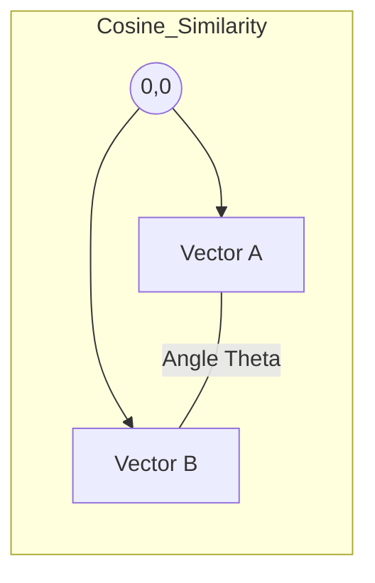
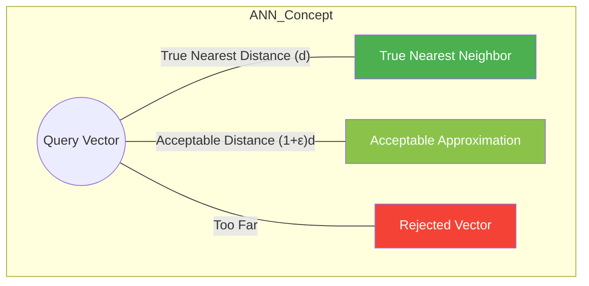
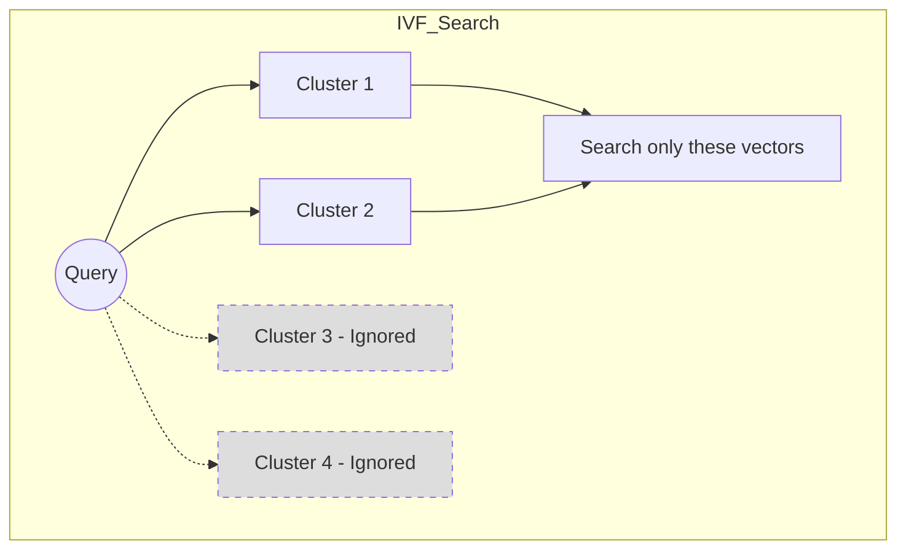
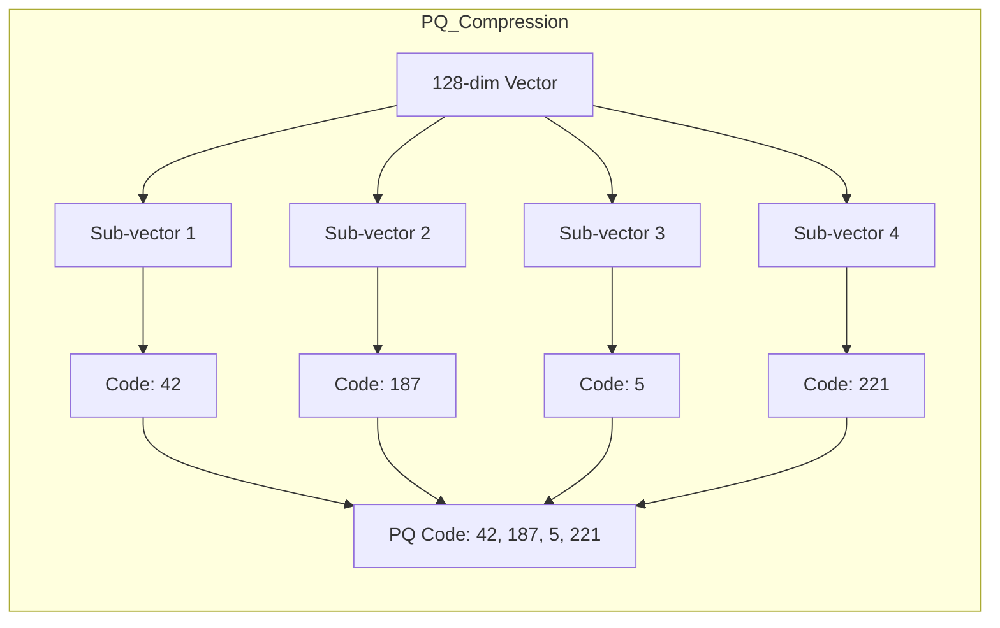
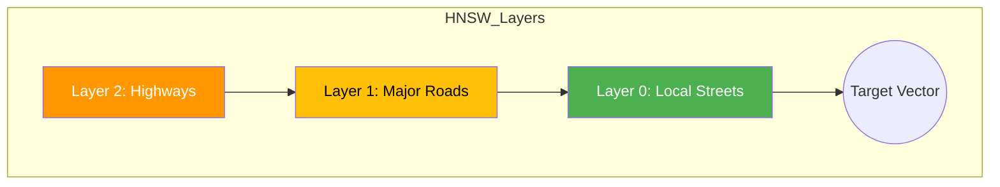
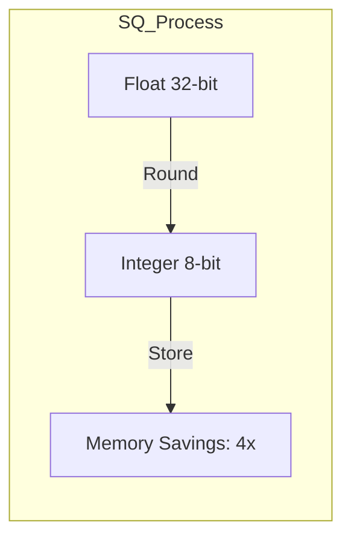
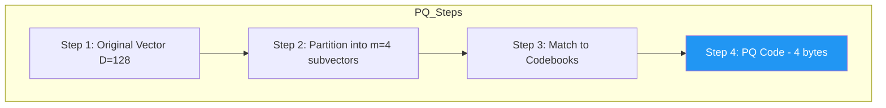
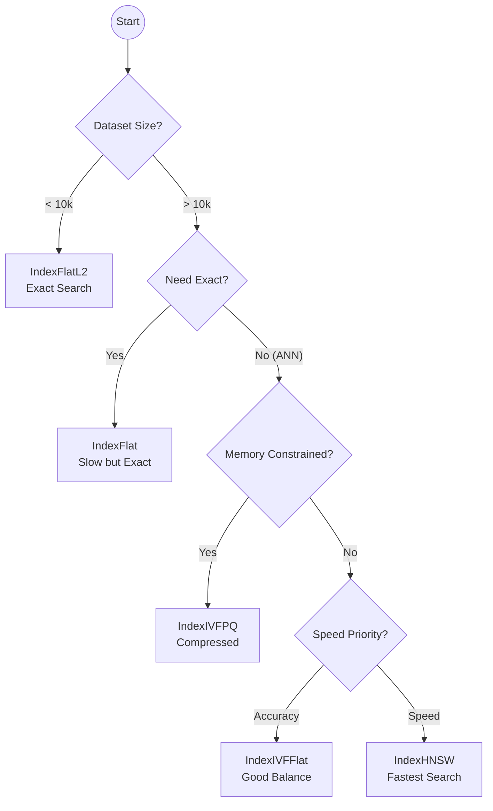

Here is a comprehensive note in Markdown format, designed to be saved directly into Obsidian. It uses simple language, Mermaid diagrams, and vector graphics (SVG) to explain the core concepts of FAISS and similarity search.

---

# FAISS & Similarity Search: The Core Concepts

This note simplifies the complex ideas behind FAISS (Facebook AI Similarity Search). It focuses on **how** we find similar items in massive datasets without checking every single item one by one.

## 1. The Big Picture: What is Similarity Search?

Imagine you have a database of 1 million images. You want to find images that look like a specific query image. 

**The Problem:** Comparing your query to all 1 million images (Brute Force) is too slow and expensive.
**The Solution:** FAISS. It organizes data so we only check a small, likely subset of images.

### The Vector Representation
Computers don't see "images" or "words"; they see **vectors** (lists of numbers). 
- A sentence might be `[0.1, 0.5, -0.2]`.
- An image might be `[0.9, 0.1, 0.4]`.

In FAISS, similar items are vectors that are "close" to each other in space.



---

## 2. Distance Metrics: How do we measure "Closeness"?

To find similar vectors, we need a ruler. FAISS uses three main rulers (metrics).

### A. L2 (Euclidean) Distance
This is the straight-line distance between two points. It is sensitive to both the **direction** and the **magnitude** (length) of the vector.


*   **Use when:** You care about absolute differences (e.g., K-means clustering).
*   **Formula:** \(\sqrt{\sum (x_i - y_i)^2}\)

### B. Inner Product (Dot Product)
This measures how much two vectors point in the same direction. It is sensitive to magnitude.
*   **Use when:** Recommender systems (a "strong" preference has a longer vector).
*   **Formula:** \(\sum x_i y_i\)

### C. Cosine Similarity
This measures the **angle** between vectors, ignoring their length. It normalizes the vectors first.
*   **Use when:** Text similarity (a long document and a short sentence can be "similar" if they talk about the same topic).


*   **Formula:** \(\frac{x \cdot y}{||x|| ||y||}\)

---

## 3. The Core Problem: ANN (Approximate Nearest Neighbor)

FAISS doesn't always find the *exact* closest vector. It finds the **Approximate** nearest neighbor. This is a trade-off: **Speed vs. Accuracy**.

### The \(\epsilon\)-tolerance Zone
We accept a vector if its distance is within a small error margin (\(\epsilon\)) of the true nearest neighbor.



*   **\(\epsilon = 0\)**: Exact search (Slow).
*   **\(\epsilon > 0\)**: Approximate search (Fast, but might miss the absolute best match).

---

## 4. Indexing Strategies: How FAISS Organizes Data

FAISS uses different "Indexes" to speed up the search. Think of these as different ways to organize a library.

### A. Flat Index (Brute Force)
The simplest index. It stores vectors exactly as they are and compares the query to every single vector.
*   **Pros:** 100% Accurate.
*   **Cons:** Very slow for large datasets.
*   **Class:** `IndexFlatL2`

### B. IVF (Inverted File Index) - Clustering
This is like a library with different rooms (Voronoi cells).
1.  **Clustering:** The space is divided into clusters (e.g., 100 clusters).
2.  **Search:** The query only checks the clusters closest to it, ignoring the rest.


*   **Parameter `nprobe`:** How many clusters to check. Higher = More accurate but slower.
*   **Class:** `IndexIVFFlat`

### C. PQ (Product Quantization) - Compression
This compresses vectors to save memory.
1.  **Split:** A 128-dim vector is split into 4 sub-vectors of 32-dim.
2.  **Quantize:** Each sub-vector is replaced by a "code" (ID of the closest centroid).
3.  **Result:** A huge vector becomes a tiny list of IDs.


*   **Class:** `IndexPQ`, `IndexIVFPQ`

### D. HNSW (Hierarchical Navigable Small World) - Graph
This is like a highway system. 
- **Top Layer:** Highways connecting distant cities (broad concepts).
- **Bottom Layer:** Local streets connecting neighbors (fine details).
- **Search:** Start at the top, zoom down to the specific neighborhood.


*   **Parameter `M`:** Number of connections per node. Higher = More accurate, more memory.
*   **Class:** `IndexHNSWFlat`

---

## 5. Quantization: Saving Memory (SQ vs PQ)

Quantization reduces the precision of numbers to save space.

### Scalar Quantization (SQ)
Treats each dimension independently.
- **Original:** 32-bit float (e.g., 0.123456)
- **Quantized:** 8-bit integer (e.g., 42)



### Product Quantization (PQ)
Splits the vector into segments and quantizes each segment.
- **Compression Ratio:** Often 128x or more.
- **Trade-off:** Loss of accuracy, but massive speed gains.



---

## 6. Choosing the Right Index (Decision Tree)

Use this flowchart to decide which index to use.



---

## 7. Key FAISS Concepts Summary

| Concept | Description | Key Parameter |
| :--- | :--- | :--- |
| **Vector** | A list of numbers representing an object. | Dimension (d) |
| **L2 Distance** | Straight-line distance. | - |
| **Cosine** | Angle between vectors (direction only). | - |
| **IVF** | Clustering to reduce search space. | `nprobe` |
| **PQ** | Compression by splitting vectors. | `m` (subvectors) |
| **HNSW** | Graph-based navigation (Highways). | `M`, `efSearch` |
| **SQ** | Simple compression (32-bit to 8-bit). | `QT_8bit` |

## 8. Practical Example (Python Pseudocode)

```python
import faiss
import numpy as np

# 1. Setup
d = 128          # Dimension
nb = 100000      # Database size
nq = 10          # Queries

# 2. Create Data
xb = np.random.random((nb, d)).astype('float32')
xq = np.random.random((nq, d)).astype('float32')

# 3. Choose Index (IVF + PQ for speed and memory)
nlist = 100      # Number of clusters
m = 8            # Number of subquantizers
quantizer = faiss.IndexFlatL2(d)
index = faiss.IndexIVFPQ(quantizer, d, nlist, m, 8)

# 4. Train (Learn the clusters and codebooks)
index.train(xb)

# 5. Add Data
index.add(xb)

# 6. Search
index.nprobe = 10  # Check 10 closest clusters
D, I = index.search(xq, 5) # Find 5 nearest neighbors

print("Distances:", D)
print("Indices:", I)
```

---

## 9. Vector Visualization (SVG)

Here is a visual representation of how vectors relate in space. 

<svg width="400" height="300" xmlns="http://www.w3.org/2000/svg">
  <!-- Grid -->
  <defs>
    <pattern id="grid" width="20" height="20" patternUnits="userSpaceOnUse">
      <path d="M 20 0 L 0 0 0 20" fill="none" stroke="#eee" stroke-width="1"/>
    </pattern>
  </defs>
  <rect width="100%" height="100%" fill="url(#grid)" />

  <!-- Axes -->
  <line x1="50" y1="250" x2="350" y2="250" stroke="black" stroke-width="2" />
  <line x1="50" y1="250" x2="50" y2="50" stroke="black" stroke-width="2" />
  <text x="360" y="265" font-family="Arial" font-size="12">Dimension 1</text>
  <text x="20" y="40" font-family="Arial" font-size="12">Dimension 2</text>

  <!-- Vector A -->
  <line x1="50" y1="250" x2="150" y2="150" stroke="#2196F3" stroke-width="3" marker-end="url(#arrowhead)" />
  <text x="160" y="145" fill="#2196F3" font-family="Arial" font-size="14" font-weight="bold">Vector A</text>

  <!-- Vector B -->
  <line x1="50" y1="250" x2="250" y2="100" stroke="#F44336" stroke-width="3" marker-end="url(#arrowhead)" />
  <text x="260" y="95" fill="#F44336" font-family="Arial" font-size="14" font-weight="bold">Vector B</text>

  <!-- Vector C (Similar to A) -->
  <line x1="50" y1="250" x2="130" y2="170" stroke="#4CAF50" stroke-width="3" marker-end="url(#arrowhead)" />
  <text x="140" y="180" fill="#4CAF50" font-family="Arial" font-size="14" font-weight="bold">Vector C</text>

  <!-- Angle Arc for Cosine -->
  <path d="M 80 220 Q 100 200 120 200" fill="none" stroke="#FF9800" stroke-width="2" />
  <text x="100" y="215" fill="#FF9800" font-family="Arial" font-size="12">θ</text>

  <!-- Arrowhead Marker -->
  <defs>
    <marker id="arrowhead" markerWidth="10" markerHeight="7" refX="9" refY="3.5" orient="auto">
      <polygon points="0 0, 10 3.5, 0 7" fill="#333" />
    </marker>
  </defs>
</svg>

*   **Vector A (Blue)** and **Vector C (Green)** are close together. They have a small angle (\(\theta\)) between them, meaning they are **similar** (high Cosine Similarity).
*   **Vector B (Red)** is far away. It points in a different direction. It is **dissimilar**.
*   **L2 Distance** would measure the straight line between the tips of Vector A and Vector C.
*   **Inner Product** would measure how much of Vector A "projects" onto Vector C.