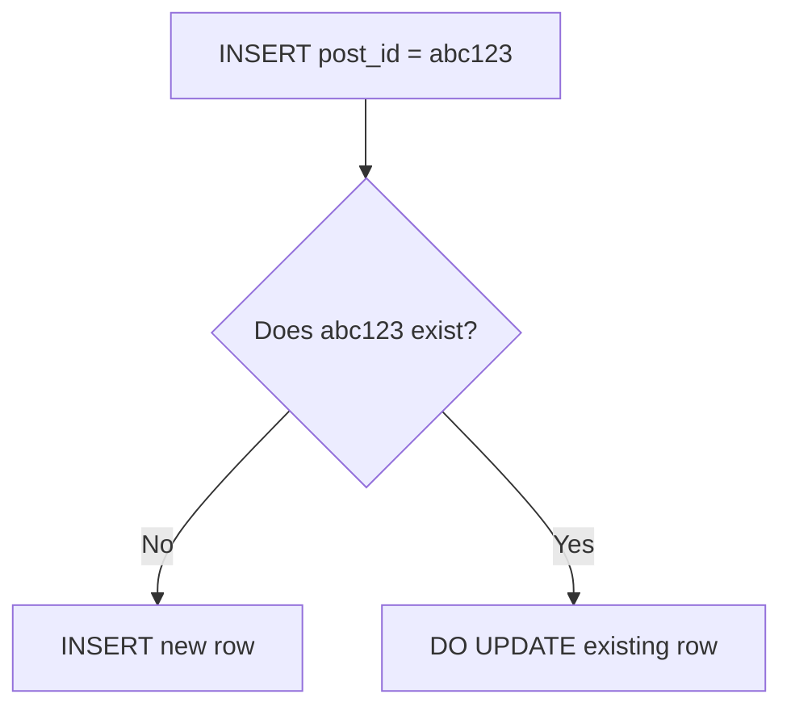
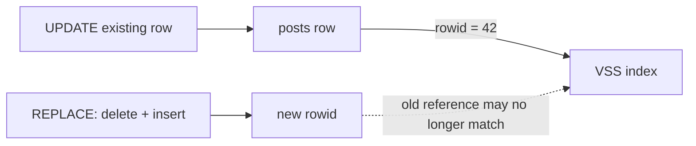
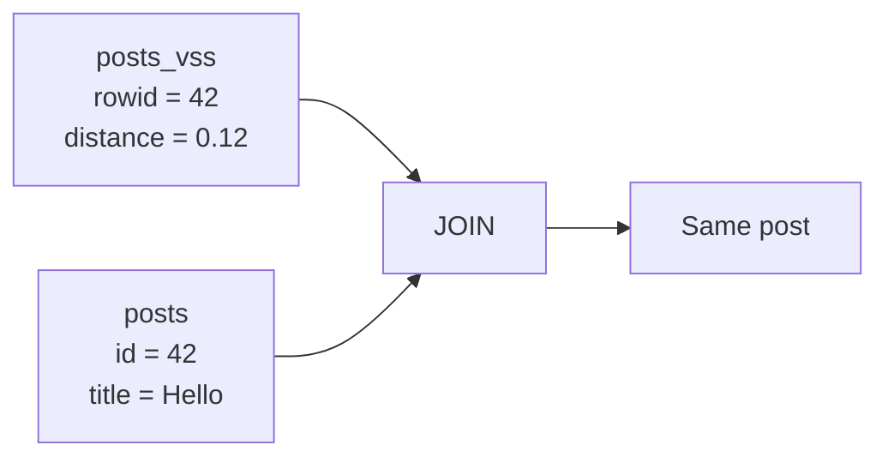
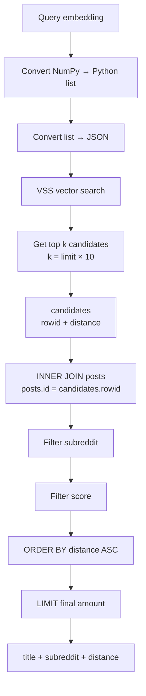

Yes. This code is doing something very important for a **vector search database**: it keeps the normal SQL table and the VSS/vector index synchronized.

I'll explain **each word and symbol**, like before.

---

# Part 1 — Safe `INSERT ... ON CONFLICT`

```python
cursor = conn.execute("""
    INSERT INTO posts (post_id, title, embedding, ...)
    VALUES (?, ?, ?, ...)
    ON CONFLICT(post_id) DO UPDATE SET
        title = excluded.title,
        embedding = excluded.embedding
    RETURNING id
""", (post_id, title, embedding_blob, ...))
```

## First: what is happening?

Imagine your database has:

```text
posts
┌────┬─────────┬─────────────┬───────────┐
│ id │ post_id │ title       │ embedding │
├────┼─────────┼─────────────┼───────────┤
│ 1  │ abc123  │ Hello       │ vector    │
│ 2  │ xyz999  │ FAISS/VSS   │ vector    │
└────┴─────────┴─────────────┴───────────┘
```

You want to insert:

```text
post_id = abc123
title   = New title
embedding = new vector
```

But `abc123` already exists.

Instead of deleting the old row and creating a new row, you want:

```text
OLD ROW
   │
   │ update
   ▼
SAME ROW
```

That is what `ON CONFLICT ... DO UPDATE` does.

---

# 2. `cursor`

```python
cursor = ...
```

`cursor` is a Python variable.

It will contain the result of the SQL operation.

Think:

```text
Python
  │
  ▼
cursor
  │
  ▼
SQL result
```

---

# 3. `conn`

```python
conn.execute(...)
```

`conn` normally means **connection**.

It represents your connection to the SQLite database.

For example:

```python
conn = sqlite3.connect("database.db")
```

Then:

```python
conn.execute(...)
```

means:

> Execute this SQL command using my database connection.

---

# 4. `execute`

```python
conn.execute(...)
```

`execute()` means:

> Send this SQL statement to the database and execute it.

So:

```python
conn.execute(SQL)
```

means:

```text
Python
  ↓
SQLite
  ↓
Execute SQL
```

---

# 5. Triple quotes

```python
"""
    INSERT ...
"""
```

Python's:

```python
"""
...
"""
```

creates a **multiline string**.

This is useful because SQL is usually several lines long.

Instead of:

```python
sql = "INSERT INTO posts ..."
```

you can write:

```python
sql = """
INSERT INTO posts ...
VALUES ...
"""
```

---

# 6. `INSERT INTO`

```sql
INSERT INTO posts
```

`INSERT` means:

> Add data.

`INTO` means:

> Put the data into this table.

`posts` is the table name.

So:

```sql
INSERT INTO posts
```

means:

> Add a new row to the `posts` table.

---

# 7. Column names

```sql
INSERT INTO posts
    (post_id, title, embedding, ...)
```

These are the columns you want to provide values for.

For example:

```text
posts
┌────┬─────────┬──────────────┐
│ id │ post_id │ title        │
├────┼─────────┼──────────────┤
│ 1  │ abc     │ Hello world  │
└────┴─────────┴──────────────┘
```

You're saying:

```text
post_id    → value
title      → value
embedding  → value
```

---

# 8. `VALUES`

```sql
VALUES (?, ?, ?, ...)
```

`VALUES` specifies the actual values being inserted.

The `?` characters are **placeholders**.

For example:

```sql
VALUES (?, ?, ?)
```

and Python:

```python
(post_id, title, embedding_blob)
```

means:

```text
?       → post_id
?       → title
?       → embedding_blob
```

So if:

```python
post_id = "abc123"
title = "Hello"
embedding_blob = b"..."
```

SQLite receives approximately:

```text
abc123
Hello
vector data
```

The important point is that `?` parameters are preferable to constructing SQL by string concatenation.

---

# 9. `ON CONFLICT`

```sql
ON CONFLICT(post_id)
```

This is SQLite's conflict-handling mechanism.

Suppose `post_id` is unique:

```sql
post_id TEXT UNIQUE
```

You try:

```text
INSERT post_id = abc123
```

but:

```text
abc123 already exists
```

Normally SQLite would report a uniqueness conflict.

But:

```sql
ON CONFLICT(post_id)
```

says:

> If the `post_id` conflicts with an existing row, do something else.

---

# 10. `DO UPDATE`

```sql
ON CONFLICT(post_id) DO UPDATE
```

This says:

> If that `post_id` already exists, update the existing row instead of inserting another row.

So:



This is commonly called an **upsert**:

```text
INSERT
   +
UPDATE
   =
UPSERT
```

---

# 11. `SET`

```sql
DO UPDATE SET
```

`SET` specifies which columns should be changed.

For example:

```sql
SET
    title = ...,
    embedding = ...
```

means:

```text
change title
change embedding
```

---

# 12. `excluded`

This is an important SQLite keyword.

```sql
excluded.title
```

means:

> The `title` value from the row I was trying to insert.

Imagine the database already contains:

```text
post_id = abc123
title = "Old title"
```

You try to insert:

```text
post_id = abc123
title = "New title"
```

Then:

```sql
excluded.title
```

means:

```text
"New title"
```

not:

```text
"Old title"
```

So:

```sql
title = excluded.title
```

means:

> Replace the existing title with the new title that I attempted to insert.

Similarly:

```sql
embedding = excluded.embedding
```

means:

> Replace the existing embedding with the new embedding.

---

# 13. `RETURNING id`

```sql
RETURNING id
```

This asks SQLite:

> After doing the INSERT or UPDATE, give me the row's `id`.

For example:

```text
Database:
id = 42
```

then:

```python
cursor.fetchone()
```

could give:

```text
(42,)
```

This is useful because you can immediately know which database row was affected.

---

# 14. The Python values

```python
(post_id, title, embedding_blob, ...)
```

These correspond to:

```sql
VALUES (?, ?, ?, ...)
```

Positionally:

```text
SQL                  Python
──────────────────────────────
?          ←         post_id
?          ←         title
?          ←         embedding_blob
```

---

# Why this is "GOOD"

The important thing is that the existing row's identity is preserved.

Imagine:

```text
posts

id = 42
post_id = abc
```

You update it.

It remains:

```text
id = 42
post_id = abc
```

rather than becoming:

```text
id = 57
post_id = abc
```

That matters when another table/index refers to the original row ID.

---

# Part 2 — Why `INSERT OR REPLACE` can be dangerous

```sql
INSERT OR REPLACE INTO posts ...
```

This looks like:

```text
UPDATE
```

but SQLite's `REPLACE` behavior is fundamentally different.

Conceptually, when a uniqueness conflict occurs, SQLite may:

```text
DELETE old row
      ↓
INSERT new row
```

rather than updating the existing row in place.

So imagine:

```text
Before

posts
┌────┬─────────┐
│ id │ post_id │
├────┼─────────┤
│ 42 │ abc     │
└────┴─────────┘

VSS
┌─────────┐
│ rowid 42│
└─────────┘
```

Then `REPLACE` can effectively cause:

```text
DELETE id=42
      ↓
INSERT new row
      ↓
new row may get id=43
```

Now you can have:

```text
posts
┌────┬─────────┐
│ id │ post_id │
├────┼─────────┤
│ 43 │ abc     │
└────┴─────────┘

VSS
┌─────────┐
│ rowid 42 │ ← old reference
└─────────┘
```

That's why this is dangerous **if your VSS index is keyed by SQLite rowid and isn't updated accordingly**.

The central idea is:



---

# Part 3 — Overfetching

Now the second code:

```python
k = limit * 10
query_vector_json = json.dumps(embedding.tolist())
```

This is related to a very common vector-search problem.

Suppose the user ultimately wants:

```text
limit = 10
```

But you have SQL filters:

```text
subreddit = ?
score > ?
```

You don't want to search for only 10 vector matches because some of those 10 may later be eliminated by the filters.

So:

```python
k = limit * 10
```

means:

```text
desired results = 10

search candidates = 100
```

---

# Why?

Imagine vector search returns:

```text
1  cat
2  dog
3  car
4  house
5  tree
6  phone
...
```

But then SQL says:

```text
subreddit = "machinelearning"
```

Maybe 8 of your first 10 vector matches aren't from that subreddit.

If you only fetched 10:

```text
10 vector candidates
       ↓
SQL filter
       ↓
2 remaining
```

You don't have enough results.

Instead:

```text
100 vector candidates
       ↓
SQL filter
       ↓
maybe 15 remaining
       ↓
LIMIT 10
```

That's called **overfetching**.

---

# 16. `limit`

```python
limit
```

is presumably the number of results the user actually wants.

For example:

```python
limit = 10
```

---

# 17. `k`

```python
k = limit * 10
```

`k` is the number of vector candidates requested.

If:

```text
limit = 10
```

then:

```text
k = 10 × 10
  = 100
```

So:

```text
User wants:      10
Vector search:  100
```

---

# Part 4 — Converting the embedding

```python
query_vector_json = json.dumps(embedding.tolist())
```

This has three important pieces.

---

## `embedding`

This is presumably your vector.

For example:

```python
embedding
```

might contain:

```text
[0.21, 0.73, 0.15, 0.92]
```

If it is a NumPy array:

```python
embedding
```

might actually be:

```python
array([0.21, 0.73, 0.15, 0.92])
```

---

# 18. `.tolist()`

```python
embedding.tolist()
```

converts a NumPy array into a normal Python list.

For example:

```text
NumPy array
    ↓
array([0.2, 0.7, 0.1])
    ↓
.tolist()
    ↓
[0.2, 0.7, 0.1]
```

---

# 19. `json.dumps()`

```python
json.dumps(...)
```

converts a Python object into a JSON string.

For example:

```python
[0.2, 0.7, 0.1]
```

becomes approximately:

```text
"[0.2, 0.7, 0.1]"
```

So:

```python
query_vector_json = json.dumps(embedding.tolist())
```

means:


---

# Part 5 — SQL query

```python
sql = """
    WITH candidates AS (
        SELECT rowid, distance
        FROM posts_vss
        WHERE vss_search(embedding, vector_from_json(?))
        ORDER BY distance ASC
        LIMIT ?
    )
    SELECT p.title, p.subreddit, c.distance
    FROM candidates c
    INNER JOIN posts p ON p.id = c.rowid
    WHERE p.subreddit = ? AND p.score > ?
    ORDER BY c.distance ASC
    LIMIT ?
"""
```

This looks complicated, but the structure is actually simple:

```text
Vector search
     ↓
Get many candidates
     ↓
Join candidates with posts
     ↓
Apply normal SQL filters
     ↓
Sort by vector distance
     ↓
Return final limit
```

---

# 20. `WITH`

```sql
WITH candidates AS (...)
```

`WITH` creates a temporary named result called a **CTE**.

CTE means:

> Common Table Expression.

You can think of it as creating a temporary table for the duration of this query.

---

# 21. `candidates`

```sql
WITH candidates AS
```

You are naming that temporary result:

```text
candidates
```

So:

```text
WITH candidates AS (...)
```

means:

> Run the query inside `(...)` and call its result `candidates`.

---

# 22. `SELECT`

```sql
SELECT rowid, distance
```

`SELECT` means:

> Retrieve these columns.

You're asking for:

```text
rowid
distance
```

---

# 23. `rowid`

```sql
SELECT rowid
```

SQLite tables commonly have an internal `rowid` for row identification when applicable.

Here, the important relationship is:

```text
VSS rowid
    ↓
posts.id
```

That's why later you see:

```sql
ON p.id = c.rowid
```

---

# 24. `distance`

```sql
SELECT rowid, distance
```

`distance` represents how far the database vector is from your query vector.

For example:

```text
rowid   distance
─────   ────────
42      0.12
17      0.19
91      0.25
```

Smaller:

```text
distance ↓
```

means closer for the distance metric being used.

---

# 25. `FROM posts_vss`

```sql
FROM posts_vss
```

This says:

> Search/read from the VSS virtual table.

So you effectively have two tables:

```text
posts
│
├── id
├── title
├── subreddit
├── score
└── ...

posts_vss
│
├── rowid
└── embedding
```

The first contains normal application data.

The second contains vector-search data.

---

# 26. `WHERE vss_search(...)`

```sql
WHERE vss_search(
    embedding,
    vector_from_json(?)
)
```

This is the vector-search part.

It tells the VSS extension:

> Search the `embedding` column using this query vector.

---

# 27. `vector_from_json`

```sql
vector_from_json(?)
```

The `?` contains:

```python
query_vector_json
```

So conceptually:

```text
Python embedding
       ↓
.tolist()
       ↓
json.dumps()
       ↓
JSON string
       ↓
?
       ↓
vector_from_json()
       ↓
vector
```

---

# 28. `ORDER BY`

```sql
ORDER BY distance ASC
```

`ORDER BY` means:

> Sort the results.

You're sorting by:

```text
distance
```

---

# 29. `ASC`

```sql
ASC
```

means:

> Ascending order.

So:

```text
0.1
0.2
0.3
0.4
```

rather than:

```text
0.4
0.3
0.2
0.1
```

For distance-based nearest-neighbor search, ascending distance means closest first.

---

# 30. `LIMIT ?`

```sql
LIMIT ?
```

This controls how many vector candidates you retrieve.

The first `?` gets:

```python
k
```

So:

```text
LIMIT k
```

Conceptually:

```text
100 candidates
```

instead of:

```text
10 candidates
```

if `limit = 10`.

---

# 31. Closing the CTE

```sql
)
```

This closes:

```sql
WITH candidates AS (
    ...
)
```

Now the temporary result is available as:

```text
candidates
```

---

# 32. Second `SELECT`

```sql
SELECT p.title, p.subreddit, c.distance
```

Now we're selecting the final information.

You want:

```text
title
subreddit
distance
```

Notice:

```text
p.title
p.subreddit
c.distance
```

The letters `p` and `c` are aliases.

---

# 33. `FROM candidates c`

```sql
FROM candidates c
```

This means:

```text
candidates → c
```

So instead of writing:

```sql
candidates.distance
```

you can write:

```sql
c.distance
```

---

# 34. `INNER JOIN`

```sql
INNER JOIN posts p
```

Now you're connecting:

```text
candidates
```

with:

```text
posts
```

Why?

Because the VSS table has things like:

```text
rowid
distance
```

but your actual post information is in:

```text
posts
```

---

# 35. `p`

```sql
posts p
```

means:

```text
posts → p
```

So:

```sql
p.title
```

means:

```text
posts.title
```

And:

```sql
p.score
```

means:

```text
posts.score
```

---

# 36. `ON`

```sql
ON p.id = c.rowid
```

`ON` specifies **how the two tables should be connected**.

You're saying:

```text
posts.id
     =
candidates.rowid
```

So:



This is the critical relationship.

---

# 37. `WHERE`

```sql
WHERE p.subreddit = ?
```

Now you apply your normal database filters.

For example:

```text
subreddit = "machinelearning"
```

Only posts from that subreddit survive.

---

# 38. `AND`

```sql
WHERE p.subreddit = ? AND p.score > ?
```

`AND` means:

> Both conditions must be true.

So a post must satisfy:

```text
subreddit = requested subreddit
       AND
score > requested minimum
```

---

# 39. `p.score > ?`

This says:

> The post's score must be greater than the supplied value.

For example:

```text
score > 100
```

So:

```text
score = 150 → yes
score = 101 → yes
score = 100 → no
score = 50  → no
```

---

# 40. Final `ORDER BY`

```sql
ORDER BY c.distance ASC
```

After filtering, sort the remaining posts by vector distance.

So you get:

```text
closest
   ↓
second closest
   ↓
third closest
   ↓
...
```

---

# 41. Final `LIMIT`

```sql
LIMIT ?
```

This is different from the earlier `LIMIT ?`.

### First limit

Inside `candidates`:

```sql
LIMIT ?
```

gets:

```text
k = limit × 10
```

So if:

```text
limit = 10
```

you get:

```text
100 candidates
```

### Final limit

The last:

```sql
LIMIT ?
```

gets:

```text
limit
```

So you return:

```text
10 final results
```

---

# Complete picture

This is the key architecture:



## Why overfetching matters

The vector search and SQL filters are doing **different jobs**:

```text
                    SEARCH
                      │
                      ▼
              Vector similarity
                      │
              ┌───────┴───────┐
              │               │
          100 candidates      │
              │               │
              ▼               │
           SQL FILTER         │
              │               │
       ┌──────┴──────┐        │
       │             │        │
   subreddit      score       │
       │             │        │
       └──────┬──────┘        │
              ▼               │
       10 final results ◄─────┘
```

So the basic strategy is:

```text
Vector search:
    "Give me MORE than I need."

SQL:
    "Now remove things I don't want."

Final LIMIT:
    "Give me exactly what the user requested."
```

And the most important database relationship is:

```text
posts.id
   ▲
   │
   │ must correspond
   │
VSS.rowid
```

That's also why preserving the row identity during updates is important.