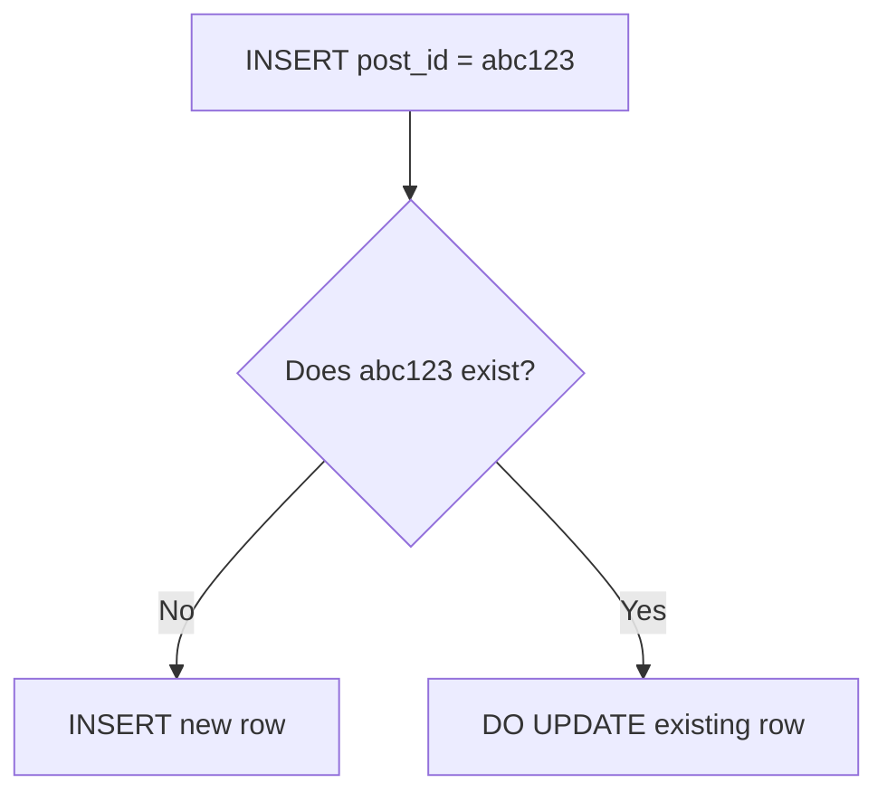
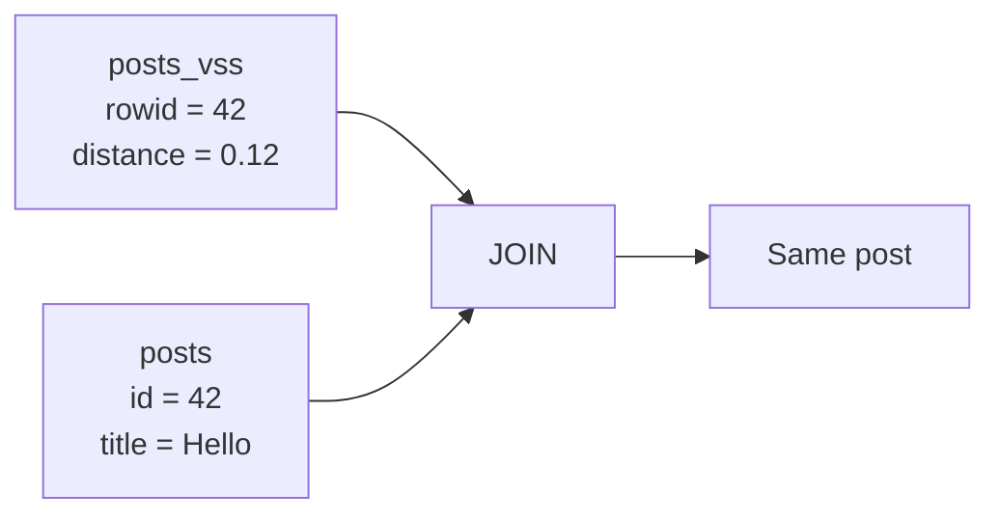
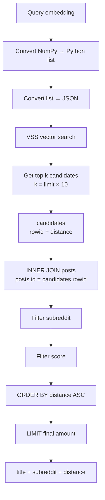

#  `INSERT ... ON CONFLICT`

```python
cursor = conn.execute("""
    INSERT INTO posts (post_id, title, embedding, ...)
    VALUES (?, ?, ?, ...)
    ON CONFLICT(post_id) DO UPDATE SET
        title = excluded.title,
        embedding = excluded.embedding
    RETURNING id
""", (post_id, title, embedding_blob, ...))
```


Imagine your database has:

```text
posts

┌────┬─────────┬─────────────┬───────────┐
│ id │ post_id │ title       │ embedding │
├────┼─────────┼─────────────┼───────────┤
│ 1  │ abc123  │ Hello       │ vector    │
│ 2  │ xyz999  │ FAISS/VSS   │ vector    │
└────┴─────────┴─────────────┴───────────┘
```

You want to insert:

```text
post_id = abc123
title   = New title
embedding = new vector
```

But `abc123` already exists.

Instead of deleting old row and creating new row, you want:

```text
OLD ROW
   │
   │ update
   ▼
SAME ROW
```

That is what `ON CONFLICT ... DO UPDATE` does.

---

```python
cursor = ...
```

 variable which contain result of SQL operation.
 
---

```python
conn.execute(...)
```

`conn` **connection** to SQLite database.

```python
conn = sqlite3.connect("database.db")
```

```python
conn.execute(...)
```

> Execute this SQL command using my database connection.

---


```python
conn.execute(...)
```

`execute()` means:

> Send this SQL statement to database and execute it.


```python
conn.execute(SQL)
```


```text
Python
  ↓
SQLite
  ↓
Execute SQL
```

---

# Triple quotes

```python
"""
...
"""
```

creates  **multiline string** because SQL is several lines long.

```python
sql = """
INSERT INTO posts ...
VALUES ...
"""
```

---

```sql
INSERT INTO posts
```

> Add new row to the `posts` table.

---

```sql
INSERT INTO posts
    (post_id, title, embedding, ...)
```

columns you want to provide values for.

---

```sql
VALUES (?, ?, ?, ...)
```

`VALUES` actual values being inserted.

`?` **placeholders**.


```sql
VALUES (?, ?, ?)
```

```python
(post_id, title, embedding_blob)
```

```text
?       → post_id
?       → title
?       → embedding_blob
```

 if:

```python
post_id = "abc123"
title = "Hello"
embedding_blob = b"..."
```

SQLite receives :

```text
abc123
Hello
vector data
```

 `?` parameter prefer to construct SQL by string concatenation.

---

```sql
ON CONFLICT(post_id)
```

SQLite's conflict-handling mechanism.

Suppose `post_id` is unique:

```sql
post_id TEXT UNIQUE
```


```text
INSERT post_id = abc123
```


```text
abc123 already exists
```


```sql
ON CONFLICT(post_id)
```


> If  `post_id` conflicts existing row, do something else.

---

```sql
ON CONFLICT(post_id) DO UPDATE
```

> If `post_id` already exists, update  existing row instead of inserting another row.

---




```text
INSERT
   +
UPDATE
   =
UPSERT
```

---

# `SET`

```sql
DO UPDATE SET
```

`SET` specifies which columns should be changed.


```sql
SET
    title = ...,
    embedding = ...
```

means:

```text
change title
change embedding
```

---

# `excluded`

```sql
title = excluded.title
```

> Replace existing title with new title that i insert.


```sql
embedding = excluded.embedding
```

> Replace existing embedding with new embedding.

---

```sql
RETURNING id
```

> After INSERT or UPDATE, give me  row's `id`.
> 

```text
Database:
id = 42
```

```python
cursor.fetchone()
```

```text
(42,)
```

immediately know which database row was affected.

---

```python
(post_id, title, embedding_blob, ...)
```

These correspond to:

```sql
VALUES (?, ?, ?, ...)
```

Positionally:

```text
SQL            Python

?    ←         post_id
?    ←         title
?    ←       embedding_blob
```

---

existing row's identity is preserved.

```text
posts

id = 42
post_id = abc
```

You update it.

It remains:

```text
id = 42
post_id = abc
```

rather than becoming:

```text
id = 57
post_id = abc
```

That matters when another table/index refers to original row ID.

---

# Why `INSERT OR REPLACE` can be dangerous

```sql
INSERT OR REPLACE INTO posts ...
```

looks like:

```text
UPDATE
```

but SQLite `REPLACE` behavior is different.

when unique conflict occurs, SQLite :

```text
DELETE old row
      ↓
INSERT new row
```

rather than update existing row in place.

```text
Before

posts
┌────┬─────────┐
│ id │ post_id │
├────┼─────────┤
│ 42 │ abc     │
└────┴─────────┘

VSS
┌─────────┐
│ rowid 42│
└─────────┘
```

`REPLACE` cause:

```text
DELETE id=42
      ↓
INSERT new row
      ↓
new row may get id=43
```

Now you have:

```text
posts
┌────┬─────────┐
│ id │ post_id │
├────┼─────────┤
│ 43 │ abc     │
└────┴─────────┘

VSS
┌─────────┐
│ rowid 42 │ ← old reference
└─────────┘
```

That's why it's dangerous **if your VSS index is keyed by SQLite rowid and isn't updated accordingly**.

---

# Overfetching

```python
k = limit * 10
query_vector_json = json.dumps(embedding.tolist())
```

Suppose user wants:

```text
limit = 10
```

But you have SQL filters:

```text
subreddit = ?
score > ?
```

You don't want to search only 10 vector matches because some of those 10 may later be eliminated by filters.

So:

```python
k = limit * 10
```

means:

```text
desired results = 10

search candidates = 100
```

---

# Why?

Imagine vector search returns:

```text
1  cat
2  dog
3  car
4  house
5  tree
6  phone
...
```

But SQL says:

```text
subreddit = "machinelearning"
```

Maybe 8 of your first 10 vector matches aren't from that subreddit.

If you only fetched 10:

```text
10 vector candidates
       ↓
SQL filter
       ↓
2 remaining
```

You don't have enough results.

```text
100 vector candidates
       ↓
SQL filter
       ↓
maybe 15 remaining
       ↓
LIMIT 10
```

That's called **overfetching**.

---

```python
limit = 10
```

number of result user wants.

---

```python
k = limit * 10
```

`k` number of vector candidates requested.

If:

```text
limit = 10
```

then:

```text
k = 10 × 10
  = 100
```

So:

```text
User wants:      10
Vector search:  100
```

---

# Converting embedding

```python
query_vector_json = json.dumps(embedding.tolist())
```

---

```python
embedding
```

```text
[0.21, 0.73, 0.15, 0.92]
```

If NumPy array:

```python
embedding
```

```python
array([0.21, 0.73, 0.15, 0.92])
```

---

# `.tolist()`

```python
embedding.tolist()
```

converts NumPy array into Python list.

```text
NumPy array
    ↓
array([0.2, 0.7, 0.1])
    ↓
.tolist()
    ↓
[0.2, 0.7, 0.1]
```

---

# `json.dumps()`

```python
json.dumps(...)
```

converts Python object into JSON string.

```python
[0.2, 0.7, 0.1]
```

becomes :

```text
"[0.2, 0.7, 0.1]"
```

---

# SQL query

```python
sql = """
    WITH candidates AS (
        SELECT rowid, distance
        FROM posts_vss
        WHERE vss_search(embedding, vector_from_json(?))
        ORDER BY distance ASC
        LIMIT ?
    )
    SELECT p.title, p.subreddit, c.distance
    FROM candidates c
    INNER JOIN posts p ON p.id = c.rowid
    WHERE p.subreddit = ? AND p.score > ?
    ORDER BY c.distance ASC
    LIMIT ?
"""
```


```text
Vector search
     ↓
Get many candidates
     ↓
Join candidates with posts
     ↓
Apply normal SQL filters
     ↓
Sort by vector distance
     ↓
Return final limit
```

---

# `WITH`

```sql
WITH candidates AS (...)
```

`WITH` creates temporary named result called **CTE**.

CTE means:

> Common Table Expression.

creating temporary table for during this query.

---

# 21. `candidates`

```sql
WITH candidates AS
```

```text
WITH candidates AS (...)
```

> Run query inside `(...)` and call its result `candidates`.

---

```sql
SELECT rowid, distance
```

---

# `rowid`

```sql
SELECT rowid
```

SQLite tables have internal `rowid` for row identification.

```text
VSS rowid
    ↓
posts.id
```

That's why later you see:

```sql
ON p.id = c.rowid
```

---

# `distance`

```sql
SELECT rowid, distance
```

`distance` how far database vector is from query vector.

```text
rowid   distance
─────   ────────
42      0.12
17      0.19
91      0.25
```

---

# `FROM posts_vss`

```sql
FROM posts_vss
```

> Search/read from VSS virtual table.

So you effectively have two tables:

```text
posts
│
├── id
├── title
├── subreddit
├── score
└── ...

posts_vss
│
├── rowid
└── embedding
```

posts contains normal application data.

posts_vss contains vector-search data.

---

# `WHERE vss_search(...)`

```sql
WHERE vss_search(
    embedding,
    vector_from_json(?)
)
```

> Search `embedding` column using this query vector.

---

# `vector_from_json`

```sql
vector_from_json(?)
```

`?` contains:

```python
query_vector_json
```

```text
Python embedding
       ↓
.tolist()
       ↓
json.dumps()
       ↓
JSON string
       ↓
?
       ↓
vector_from_json()
       ↓
vector
```

---

```sql
ORDER BY distance ASC
```

---

```sql
ASC
```

> Ascending order.

```text
0.1
0.2
0.3
0.4
```

rather than:

```text
0.4
0.3
0.2
0.1
```

distance-based nearest-neighbor search, ascending distance means closest first.

---

```sql
LIMIT ?
```

controls how many vector candidates you retrieve.

first `?` gets:

```python
k
```

```text
LIMIT k
```

```text
100 candidates
```

instead of:

```text
10 candidates
```

if `limit = 10`.

---

```sql
WITH candidates AS (
    ...
)
```

Now temporary result is available as:

```text
candidates
```

---

```sql
SELECT p.title, p.subreddit, c.distance
```
You want:

```text
title
subreddit
distance
```

Notice:

```text
p.title
p.subreddit
c.distance
```

The letters `p` and `c` are aliases.

---

```sql
FROM candidates c
```

This means:

```text
candidates → c
```

So instead of writing:

```sql
candidates.distance
```

you write:

```sql
c.distance
```

---

```sql
INNER JOIN posts p
```

connecting:

```text
candidates
```

with:

```text
posts
```

because VSS table has things like:

```text
rowid
distance
```

but your actual post information is in:

```text
posts
```

---

```sql
posts p
```

means:

```text
posts → p
```

So:

```sql
p.title
```

means:

```text
posts.title
```

---

```sql
ON p.id = c.rowid
```

`ON` specifies **how two tables should be connected**.

```text
posts.id
     =
candidates.rowid
```

---



---

```sql
WHERE p.subreddit = ? AND p.score > ?
```

> Both conditions must be true.

So a post must satisfy:

```text
subreddit = requested subreddit
       AND
score > requested minimum
```

---

# `p.score > ?`

```text
score > 100
```

```text
score = 150 → yes
score = 101 → yes
score = 100 → no
score = 50  → no
```

---

```sql
ORDER BY c.distance ASC
```

After filtering, sort remaining posts by vector distance.

```text
closest
   ↓
second closest
   ↓
third closest
   ↓
...
```

---

#  Final `LIMIT`

```sql
LIMIT ?
```

different from earlier `LIMIT ?`.

### First limit

Inside `candidates`:

```sql
LIMIT ?
```

gets:

```text
k = limit × 10
```

So if:

```text
limit = 10
```

you get:

```text
100 candidates
```

### Final limit

```sql
LIMIT ?
```

gets:

```text
limit
```

return:

```text
10 final results
```

---

# Complete picture



## Why overfetching matters

vector search and SQL filters are doing **different jobs**:

```text
                    SEARCH
                      │
                      ▼
              Vector similarity
                      │
              ┌───────┴───────┐
              │               │
          100 candidates      │
              │               │
              ▼               │
           SQL FILTER         │
              │               │
       ┌──────┴──────┐        │
       │             │        │
   subreddit      score       │
       │             │        │
       └──────┬──────┘        │
              ▼               │
       10 final results ◄─────┘
```


```text
Vector search:
    "Give me MORE than I need."

SQL:
    "remove things I don't want."

Final LIMIT:
    "Give me exactly what user requested."
```

---
most important database relation is:

```text
posts.id
   ▲
   │
   │ must correspond
   │
VSS.rowid
```

That's why preserving row identity during update is important.