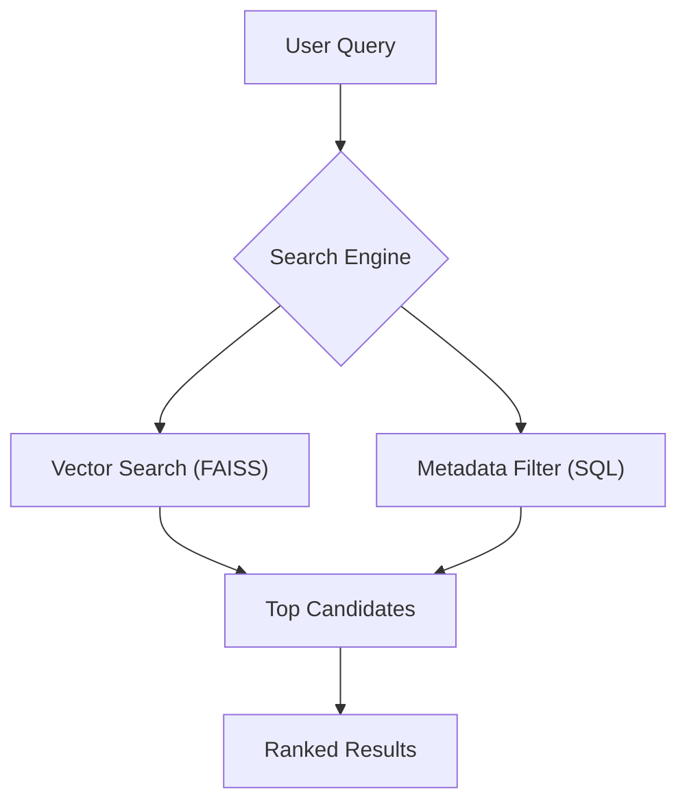
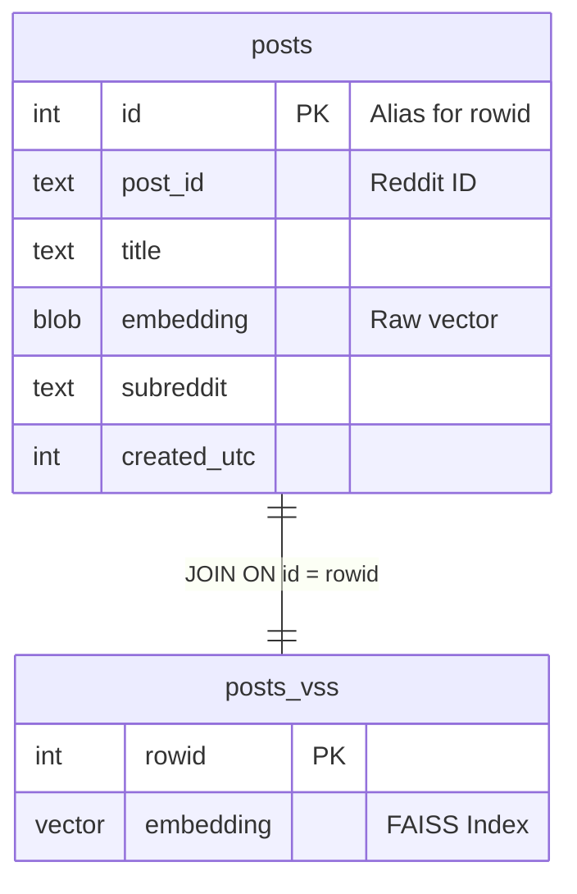
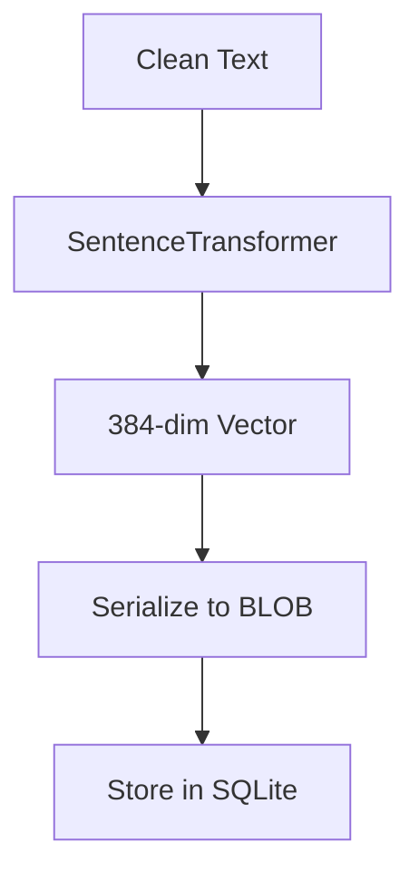
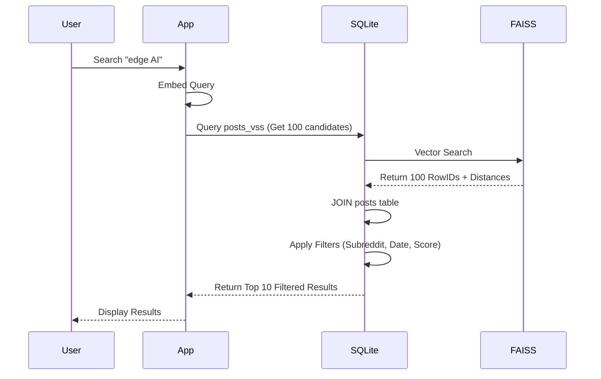
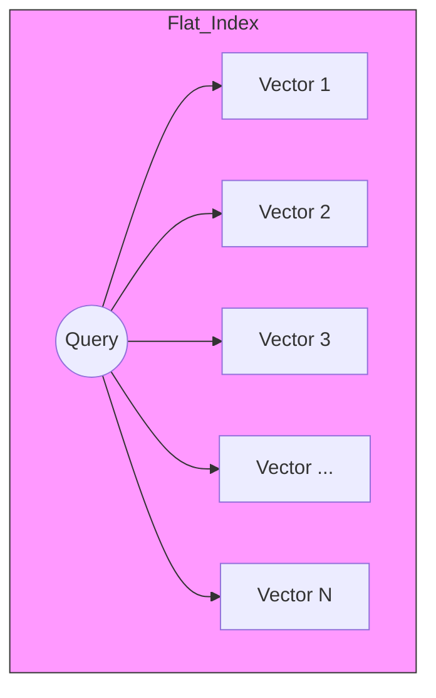

# Semantic Search with SQLite3 & FAISS

how to build  **Personal Knowledge Management system** that searches by *meaning* rather than just keywords. 

---
We use **SQLite3** with **sqlite-vss** (vector search extension that wraps FAISS).

---

## Hybrid Search

Traditional databases search for exact words (e.g., `WHERE title LIKE '%deep learning%'`).

Vector databases search for *meaning* (e.g., finding "neural networks" when you search "deep learning").

We use SQLite for metadata filtering (date, subreddit, score) and `sqlite-vss` for semantic similarity.

---



---

## Two-Table 

1.  **`posts` (Regular Table):** Store text, metadata (author, score, date) and raw embedding BLOB.
2.  **`posts_vss` (Virtual Table):** Store FAISS index for fast vector search.

**Critical Rule:** `posts_vss` table keys vectors by SQLite's internal `rowid`. You **must** use `UPSERT` (Update or Insert) instead of `INSERT OR REPLACE`. Because `REPLACE` deletes row and create new one breaking link to vector index!



---

## 3. Ingestion Pipeline 

Before we can search, we must fetch and process data.

### Step A: Fetching Data 
We use Python Reddit API Wrapper (PRAW) to get posts. We must handle rate limit (429 errors) with exponential backoff.

### Step B: Text Preprocessing
Raw Reddit text is messy. We clean it before embedding.

### Step C: Embedding Generation
We use `SentenceTransformers` (`all-MiniLM-L6-v2`) to convert text into 384-dimensional vector.



---

## Query Pipeline

When user search, we perform **Hybrid Query**.

### "Overfetch-then-Filter" Pattern
Because SQLite doesn't push metadata filters into FAISS index, we must:
1.  Fetch **more** candidates than needed (`limit * 10`).
2.  Apply SQL `WHERE` clauses (`subreddit = 'MachineLearning'`).
3.  Return top `limit` results.



---

## Index Types: Flat vs IVF vs HNSW

`sqlite-vss` supports different FAISS index types. For a personal knowledge base (thousands of posts), **Flat** is usually fast enough.

| Index Type | Speed | Accuracy | Memory | Best For |
| :--- | :--- | :--- | :--- | :--- |
| **Flat** | Slow | 100% Exact | Low | < 100k vectors |
| **IVF** | Fast  | ~95% | Medium | 100k - 10M vectors |
| **HNSW** | Very Fast | ~98% | High | Any scale, low latency |



*For personal Reddit search, start with `Flat`. It guarante exact result.*

---

## Code Concepts

### Storing Data
```python
# GOOD: Preserves rowid, keeps index intact
cursor = conn.execute("""
    INSERT INTO posts (post_id, title, embedding, ...)
    VALUES (?, ?, ?, ...)
    ON CONFLICT(post_id) DO UPDATE SET
        title = excluded.title,
        embedding = excluded.embedding
    RETURNING id
""", (post_id, title, embedding_blob, ...))

# BAD: Breaks the VSS index!
# INSERT OR REPLACE INTO posts ...
```

### Searching (Hybrid Query)
```python
# 1. Overfetch candidates (e.g., 10x limit)
k = limit * 10
query_vector_json = json.dumps(embedding.tolist())

# 2. Join VSS and posts, apply SQL filters
sql = """
    WITH candidates AS (
        SELECT rowid, distance
        FROM posts_vss
        WHERE vss_search(embedding, vector_from_json(?))
        ORDER BY distance ASC
        LIMIT ?
    )
    SELECT p.title, p.subreddit, c.distance
    FROM candidates c
    INNER JOIN posts p ON p.id = c.rowid
    WHERE p.subreddit = ? AND p.score > ?
    ORDER BY c.distance ASC
    LIMIT ?
"""
```

---

 This architecture gives power of vector database with portability and familiarity of single SQLite file.