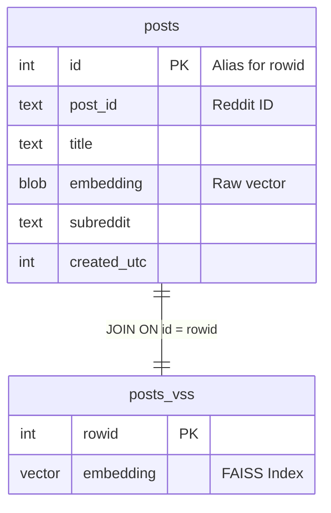
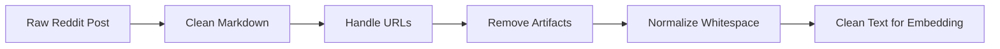
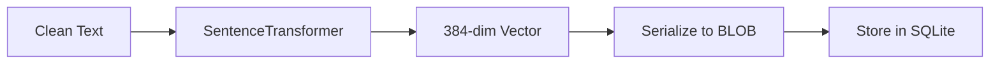
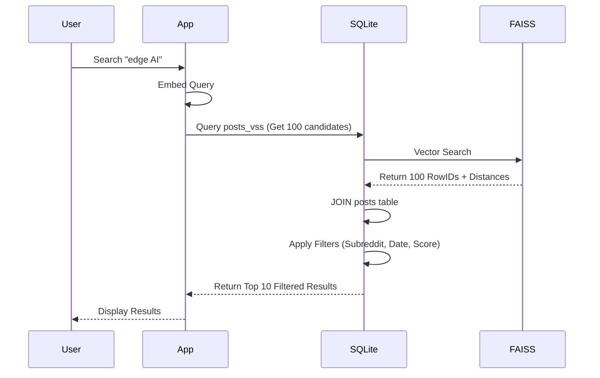
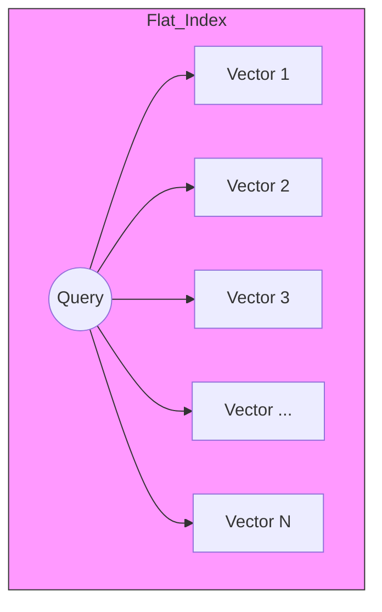

Here is a comprehensive note in Markdown format, designed for Obsidian. It explains the core concepts of building a semantic search system with SQLite3, using simple language, Mermaid diagrams, and SVG graphics.

---

# Semantic Search with SQLite3 & FAISS

This note explains how to build a **Personal Knowledge Management (PKM) system** that searches by *meaning* rather than just keywords. We use **SQLite3** (a lightweight database) combined with **sqlite-vss** (a vector search extension that wraps FAISS).

## 1. The Big Idea: Hybrid Search

Traditional databases search for exact words (e.g., `WHERE title LIKE '%deep learning%'`).
Vector databases search for *meaning* (e.g., finding "neural networks" when you search "deep learning").

**Our Approach:** We combine both. We use SQLite for metadata filtering (date, subreddit, score) and `sqlite-vss` for semantic similarity.

```mermaid
graph LR
    A[User Query] --> B{Search Engine}
    B --> C[Vector Search (FAISS)]
    B --> D[Metadata Filter (SQL)]
    C --> E[Top Candidates]
    D --> E
    E --> F[Ranked Results]
```

---

## 2. Architecture: The Two-Table Pattern

The system uses a clever **two-table architecture** inside SQLite:

1.  **`posts` (Regular Table):** Stores the text, metadata (author, score, date), and the raw embedding BLOB.
2.  **`posts_vss` (Virtual Table):** Stores the FAISS index for fast vector search.

**Critical Rule:** The `posts_vss` table keys vectors by SQLite's internal `rowid`. You **must** use `UPSERT` (Update or Insert) instead of `INSERT OR REPLACE`. Why? Because `REPLACE` deletes the row and creates a new one, breaking the link to the vector index!



---

## 3. The Ingestion Pipeline (Left Side of System)

Before we can search, we must fetch and process data.

### Step A: Fetching Data (PRAW)
We use the Python Reddit API Wrapper (PRAW) to get posts. We must handle rate limits (429 errors) with exponential backoff.

### Step B: Text Preprocessing
Raw Reddit text is messy (markdown, URLs, deleted comments). We clean it before embedding.



### Step C: Embedding Generation
We use `SentenceTransformers` (e.g., `all-MiniLM-L6-v2`) to convert text into a 384-dimensional vector.



---

## 4. The Query Pipeline (Right Side of System)

When a user searches, we perform a **Hybrid Query**.

### The "Overfetch-then-Filter" Pattern
Because SQLite doesn't push metadata filters into the FAISS index, we must:
1.  Fetch **more** candidates than needed (e.g., `limit * 10`).
2.  Apply SQL `WHERE` clauses (e.g., `subreddit = 'MachineLearning'`).
3.  Return the top `limit` results.



---

## 5. Index Types: Flat vs. IVF vs. HNSW

`sqlite-vss` supports different FAISS index types. For a personal knowledge base (thousands of posts), **Flat** is usually fast enough.

| Index Type | Speed | Accuracy | Memory | Best For |
| :--- | :--- | :--- | :--- | :--- |
| **Flat** | Slow (O(n)) | 100% Exact | Low | < 100k vectors |
| **IVF** | Fast (O(n/k)) | ~95% | Medium | 100k - 10M vectors |
| **HNSW** | Very Fast | ~98% | High | Any scale, low latency |



*For a personal Reddit search, start with `Flat`. It guarantees exact results.*

---

## 6. Visualizing the Vector Space

Here is a visual representation of how your Reddit posts look in vector space.

<svg width="500" height="350" xmlns="http://www.w3.org/2000/svg">
  <!-- Background Grid -->
  <defs>
    <pattern id="grid" width="30" height="30" patternUnits="userSpaceOnUse">
      <path d="M 30 0 L 0 0 0 30" fill="none" stroke="#e0e0e0" stroke-width="1"/>
    </pattern>
  </defs>
  <rect width="100%" height="100%" fill="url(#grid)" />

  <!-- Axes -->
  <line x1="50" y1="300" x2="450" y2="300" stroke="#333" stroke-width="2" />
  <line x1="50" y1="300" x2="50" y2="50" stroke="#333" stroke-width="2" />
  <text x="460" y="315" font-family="Arial" font-size="14" fill="#333">Dimension 1</text>
  <text x="10" y="40" font-family="Arial" font-size="14" fill="#333">Dimension 2</text>

  <!-- Query Vector -->
  <circle cx="250" cy="150" r="8" fill="#FF5722" />
  <text x="260" y="145" font-family="Arial" font-size="14" font-weight="bold" fill="#FF5722">Query: "Edge AI"</text>

  <!-- Cluster 1: Similar Posts -->
  <circle cx="230" cy="170" r="6" fill="#2196F3" />
  <circle cx="270" cy="130" r="6" fill="#2196F3" />
  <circle cx="240" cy="140" r="6" fill="#2196F3" />
  <text x="280" y="125" font-family="Arial" font-size="12" fill="#2196F3">Similar Post</text>

  <!-- Cluster 2: Dissimilar Posts -->
  <circle cx="100" cy="80" r="6" fill="#9E9E9E" />
  <circle cx="120" cy="100" r="6" fill="#9E9E9E" />
  <circle cx="80" cy="110" r="6" fill="#9E9E9E" />
  <text x="130" y="95" font-family="Arial" font-size="12" fill="#9E9E9E">Dissimilar Post</text>

  <!-- Distance Line -->
  <line x1="250" y1="150" x2="230" y2="170" stroke="#FF5722" stroke-width="1" stroke-dasharray="4" />
  <text x="200" y="175" font-family="Arial" font-size="10" fill="#FF5722">L2 Distance</text>
</svg>

*   **Red Dot:** Your search query.
*   **Blue Dots:** Reddit posts semantically similar to your query.
*   **Grey Dots:** Unrelated posts.
*   The **L2 Distance** is the straight-line measurement between the query and the post.

---

## 7. Key Code Concepts (Python)

### Storing Data (The Critical UPSERT)
```python
# GOOD: Preserves rowid, keeps index intact
cursor = conn.execute("""
    INSERT INTO posts (post_id, title, embedding, ...)
    VALUES (?, ?, ?, ...)
    ON CONFLICT(post_id) DO UPDATE SET
        title = excluded.title,
        embedding = excluded.embedding
    RETURNING id
""", (post_id, title, embedding_blob, ...))

# BAD: Breaks the VSS index!
# INSERT OR REPLACE INTO posts ...
```

### Searching (Hybrid Query)
```python
# 1. Overfetch candidates (e.g., 10x limit)
k = limit * 10
query_vector_json = json.dumps(embedding.tolist())

# 2. Join VSS and posts, apply SQL filters
sql = """
    WITH candidates AS (
        SELECT rowid, distance
        FROM posts_vss
        WHERE vss_search(embedding, vector_from_json(?))
        ORDER BY distance ASC
        LIMIT ?
    )
    SELECT p.title, p.subreddit, c.distance
    FROM candidates c
    INNER JOIN posts p ON p.id = c.rowid
    WHERE p.subreddit = ? AND p.score > ?
    ORDER BY c.distance ASC
    LIMIT ?
"""
```

---

## 8. Summary Checklist

- [x] **Schema:** Two tables (`posts` + `posts_vss`).
- [x] **Extensions:** Load `vector0` then `vss0`.
- [x] **Updates:** Always use `UPSERT` to preserve `rowid`.
- [x] **Search:** Use "Overfetch-then-Filter" for hybrid queries.
- [x] **Index:** Use `Flat` for < 100k posts; `IVF` or `HNSW` for larger.
- [x] **Text:** Clean markdown and URLs before embedding.

This architecture gives you the power of a vector database with the portability and familiarity of a single SQLite file.