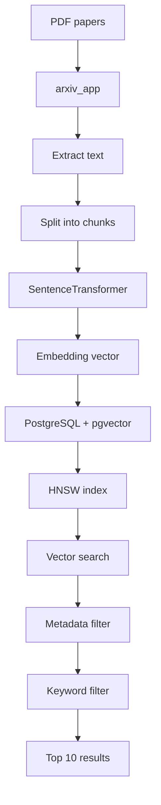
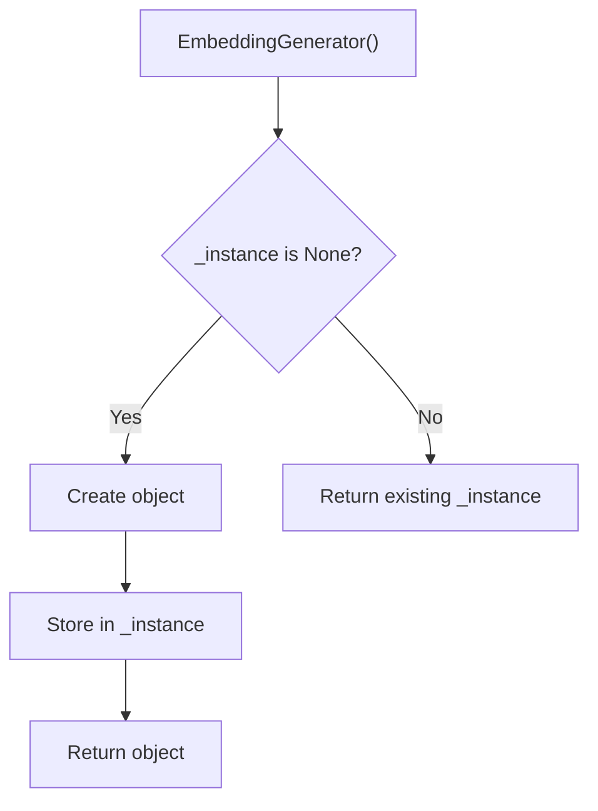
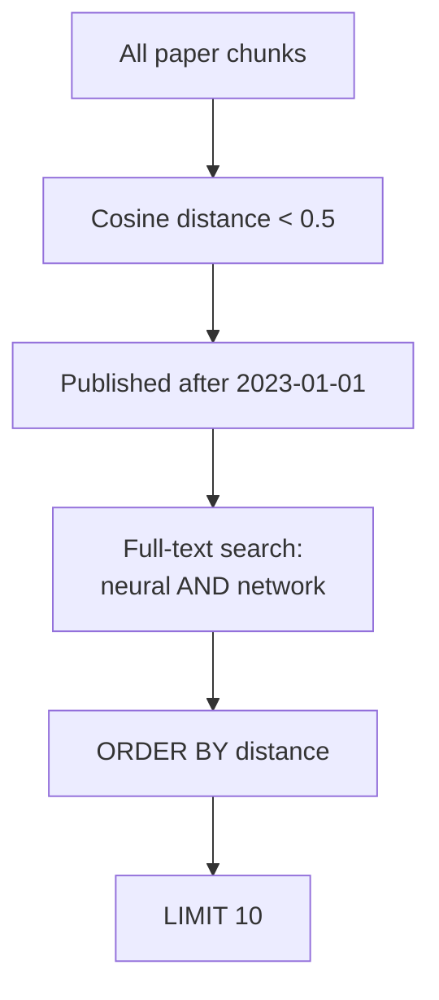
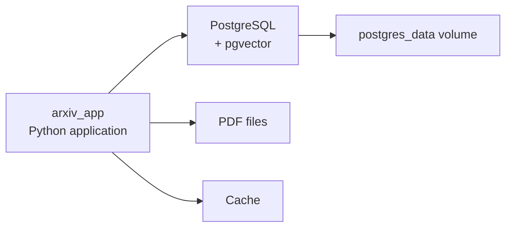
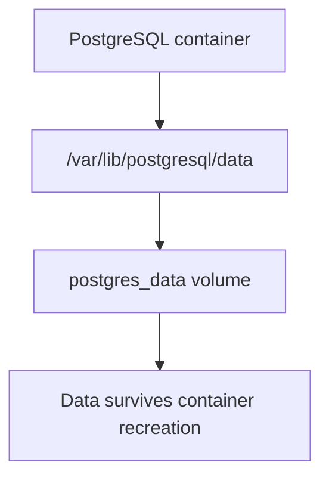
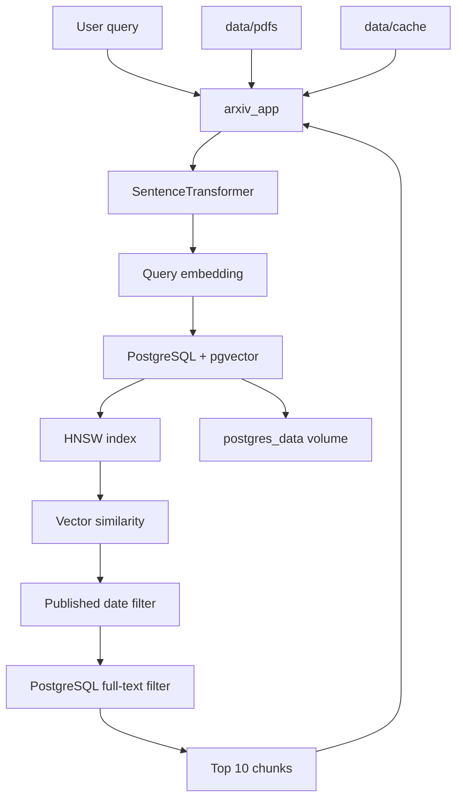

**PostgreSQL + pgvector + SentenceTransformer + Docker** 




---

# HNSW index

```sql
CREATE INDEX idx_chunks_embedding ON paper_chunks
USING hnsw (embedding vector_cosine_ops)
WITH (m = 16, ef_construction = 64);
```

---

```sql
CREATE INDEX
```

With HNSW index:

```text
1,000,000 vectors
       ↓
HNSW graph
       ↓
navigate promising areas
       ↓
nearest vectors
```

---

```sql
idx_chunks_embedding
```

 >name of your index

---

```sql
ON paper_chunks
```

> Create index for `paper_chunks` table.

---

```sql
USING hnsw
```

> Use HNSW algorithm for this index.

**Hierarchical Navigable Small World**

> organize vectors into graph that can be navigated efficiently for approximate nearest-neighbor search.

>search doesn't need to compare query against every vector.

---

```sql
(embedding vector_cosine_ops)
```

```sql
embedding
```

This is your vector column.

```text
paper_chunks
┌────┬───────────┬──────────────────────┐
│ id │ chunk_text│ embedding            │
├────┼───────────┼──────────────────────┤
│ 1  │ Neural... │ [0.12,0.43,...]      │
│ 2  │ CNNs...   │ [0.91,0.12,...]      │
└────┴───────────┴──────────────────────┘
```

---

```sql
vector_cosine_ops
```

> Use cosine similarity for this vector index.

---

```sql
WITH (m = 16, ef_construction = 64)
```

---

```sql
m = 16
```

control number of connection each graph node can have.

Think about each vector as node:

```text
       vector
      /  |  \
     /   |   \
    v    v    v
 vector vector vector
```

Large `m` :

```text
more connections
     ↓
more memory
     +
potentially better search quality
```

Small `m` :

```text
fewer connections
     ↓
less memory
     +
potentially lower search quality
```

---

```sql
ef_construction = 64
```

control how much work is performed **while building the HNSW index**.

```text
ef_construction
       ↓
How carefully should I build the graph?
```

Higher:

```text
64 → 128 → 256
```

more construction work and better graph.


```text
ef_construction
       ↓
BUILDING the index
```

search-time setting `ef_search` control:

```text
SEARCHING the index
```

---

```python
class EmbeddingGenerator:
    _instance = None
```

---

```python
def __new__(cls, *args, **kwargs):
```

```python
obj = EmbeddingGenerator()
```

```text
EmbeddingGenerator()
       ↓
__new__()
       ↓
object created
       ↓
__init__()
       ↓
object initialized
```

---

```python
cls
```

> class itself.

```text
cls = EmbeddingGenerator
```

similar to:

```python
self
```

```text
self → object
cls  → class
```

---

```python
*args
```

collect additional **positional arguments**.

```python
EmbeddingGenerator("model", 123, True)
```

---

```python
**kwargs
```

>collect additional **keyword arguments**.

For example:

```python
EmbeddingGenerator(
    model_name="abc",
    device="cuda"
)
```

could put those named arguments into `kwargs`.

---

```python
if cls._instance is None:
```

```text
_instance = None
```

```text
None?
 ↓
YES
 ↓
create object
```

Later:

```text
_instance = existing object
```

Then:

```text
None?
 ↓
NO
 ↓
return existing object
```

This implement **Singleton pattern**.

---

```python
super(EmbeddingGenerator, cls)
```

>`super()` help access method from parent class.


```python
super(EmbeddingGenerator, cls).__new__(cls)
```


> Use parent `__new__` method to create object.

---

# `cls._instance = ...`

```python
cls._instance = super(EmbeddingGenerator, cls).__new__(cls)
```

>create object and stores it.


```text
First call:

EmbeddingGenerator()
       ↓
_instance is None
       ↓
create object
       ↓
_instance = object
```

---

# `_initialized`

```python
cls._instance._initialized = False
```

```text
_initialized = False
```

> model hasn't been initialized yet.

---

```python
return cls._instance
```

 first call creates it.

Second call:

```python
EmbeddingGenerator()
```

doesn't create another object.

It return existing one.

---

# Singleton visualization



This is useful because loading SentenceTransformer model can be expensive.

```text
Request 1 → load model
Request 2 → load model
Request 3 → load model
Request 4 → load model
```

Instead:

```text
Request 1 → load model
Request 2 → reuse model
Request 3 → reuse model
Request 4 → reuse model
```

---

```python
def __init__(self, model_name='all-MiniLM-L6-v2'):
```

---


```python
if self._initialized:
    return
```

> prevent loading model again.

---

```python
self.model = SentenceTransformer(model_name)
```

`SentenceTransformer(model_name)` loads the embedding model.

```text
text
 ↓
SentenceTransformer
 ↓
vector
```

```text
"neural networks are powerful"
            ↓
      embedding model
            ↓
[0.12, -0.31, 0.82, ...]
```

---

```python
self._initialized = True
```

---

```python
from pgvector.psycopg2 import register_vector
```

Psycopg2 Python PostgreSQL driver.


```text
Python
  │
  ▼
psycopg2
  │
  ▼
PostgreSQL
  │
  ▼
pgvector
```

---

```python
register_vector(conn)
```

> tell PostgreSQL Python connection how to work with pgvector's vector type.

> Without appropriate registration, Python don't know how to send/receive PostgreSQL's `vector` type through psycopg2.


---

# search query

```sql
SELECT p.title, p.abstract, c.distance
FROM paper_chunks c
JOIN papers p ON p.id = c.paper_id
WHERE c.embedding <=> query_vector < 0.5
  AND p.published_date > '2023-01-01'
  AND c.chunk_text @@ to_tsquery('neural & network')
ORDER BY c.distance ASC
LIMIT 10;
```

```text
Vector similarity
+
Metadata filtering
+
Keyword search
```

---

```sql
SELECT p.title, p.abstract, c.distance
```

```text
paper title
paper abstract
vector distance
```

---

```sql
FROM paper_chunks c
```

> give it  short name c


```sql
c.embedding
```

```text
paper_chunks.embedding
```

---

```sql
JOIN papers p
```

connect chunks to their parent papers.

```text
papers
   │
   ├── paper 1
   │    ├── chunk 1
   │    ├── chunk 2
   │    └── chunk 3
   │
   └── paper 2
        ├── chunk 4
        └── chunk 5
```

---

```sql
ON p.id = c.paper_id
```

```text
papers.id
    =
paper_chunks.paper_id
```

So PostgreSQL knows which paper each chunk belongs to.

---

```sql
c.embedding <=> query_vector
```

`<=>` is pgvector's **cosine distance operator** when used with cosine distance.

It calculates distance between:

```text
database embedding
        and
query vector
```


```text
query vector
     │
     │ compare
     ▼
chunk embedding
     │
     ▼
cosine distance
```

Lower cosine distance means vectors are more similar.

---

# `< 0.5`

```sql
c.embedding <=> query_vector < 0.5
```

> Only keep chunks whose cosine distance is less than `0.5`.
> 

```text
0.10 → keep
0.25 → keep
0.49 → keep
0.50 → don't keep
0.80 → don't keep
```

---

```sql
p.published_date > '2023-01-01'
```

> Only papers published after January 1, 2023.

So you have:

```text
Vector filter
        AND
Date filter
```

---

```sql
c.chunk_text @@ ...
```

`@@` is PostgreSQL's **full-text search matching operator**.


> Does this text match this full-text-search query?

---

# `to_tsquery`

```sql
to_tsquery('neural & network')
```

converts string into PostgreSQL text-search query.


```text
neural & network
```

> Find text containing both `neural` and `network` according to PostgreSQL full-text-search rules.

---

Your query effectively says:

```text
Find chunks where:

        vector is similar
                AND
        paper is recent
                AND
        text contains required search terms
```



---

```sql
ORDER BY c.distance ASC
```

Sort vector distance from smallest to largest:

```text
0.05
0.09
0.13
0.21
0.31
...
```

closest vectors appear first.

---

```sql
LIMIT 10
```

Return only first 10 results.

```text
Millions of chunks
       ↓
Vector similarity
       ↓
Date filter
       ↓
Keyword filter
       ↓
Sort by similarity
       ↓
10 results
```

---


```yaml
version: '3.8'
services:
```

Docker Compose configuration.

describes multiple containers that work together.



---

```yaml
services:
```

containerized component of your application.

```text
services
├── postgres
└── arxiv_app
```

---

```yaml
postgres:
```

define service name:

```text
postgres
```

---

```yaml
image: pgvector/pgvector:pg15
```

Use Docker image `pgvector/pgvector` with `pg15` tag.

> instead of manually installing:

```text
PostgreSQL
+
pgvector
```

the image provide PostgreSQL environment with pgvector.

---

```yaml
environment:
```

Environment variables are configuration values supplied to container.

```yaml
POSTGRES_USER: postgres
POSTGRES_PASSWORD: password
POSTGRES_DB: arxiv_papers
```

So PostgreSQL starts with:

```text
username: postgres
password: password
database: arxiv_papers
```

---

```yaml
volumes:
  - postgres_data:/var/lib/postgresql/data
```

Docker containers can be deleted/recreated. You don't want your database disappearing when  container is removed. So you create persistent Docker volume:

```text
postgres_data
```

and mount it into PostgreSQL's data directory:

```text
/var/lib/postgresql/data
```




---

```yaml
ports:
  - "5432:5432"
```

---

```text
host port 5432
        ↓
container port 5432
```

PostgreSQL normally listens on:

```text
5432
```

So your host machine can connect to:

```text
localhost:5432
```

---

```yaml
arxiv_app:
```

your Python application container. which contain:

```text
FastAPI
SentenceTransformer
PDF processing
PostgreSQL client
pgvector
```

---

```yaml
build: .
```

> Build Docker image using  Dockerfile in current directory.


```text
project/
├── Dockerfile
├── docker-compose.yml
├── app/
└── data/
```

```text
.
```


> Current directory.

---

```yaml
depends_on:
  - postgres
```

This tells Compose that:

```text
arxiv_app
```

depends on:

```text
postgres
```

So Compose start PostgreSQL service as dependency.

However, `depends_on` does **not guarantee that PostgreSQL is fully ready to accept connection**. A production setup commonly add healthcheck or retry logic.

---

```yaml
environment:
  DB_HOST: postgres
  DB_PORT: 5432
```

```yaml
DB_HOST: postgres
```

not:

```yaml
DB_HOST: localhost
```

?

Because both services are inside Docker Compose's network.

Docker Compose provide service-name DNS.

```text
arxiv_app
    │
    │ DB_HOST=postgres
    ▼
postgres container
```

service name:

```text
postgres
```

acts as hostname.

---

```yaml
DB_PORT: 5432
```

PostgreSQL listen on port:

```text
5432
```

inside container network.

So Python app can connect to:

```text
postgres:5432
```

---

```yaml
volumes:
  - ./data/pdfs:/data/pdfs
  - ./data/cache:/data/cache
```

### First

```text
./data/pdfs
        ↓
/data/pdfs
```

```text
Host
project/data/pdfs
        │
        ▼
Container
/data/pdfs
```

---

### Second

```text
./data/cache
        ↓
/data/cache
```

>This lets your application persist/use cached files outside container filesystem.

---

# Final architecture



## whole system in plain English

```text
1. Download academic papers
        ↓
2. Extract text
        ↓
3. Split papers into chunks
        ↓
4. SentenceTransformer converts each chunk to a vector
        ↓
5. Store:
       paper metadata → PostgreSQL
       chunk text     → PostgreSQL
       embeddings     → pgvector
        ↓
6. HNSW makes vector search fast
        ↓
7. User asks a question
        ↓
8. Convert question → embedding
        ↓
9. Search similar chunks
        ↓
10. Filter by date
        ↓
11. Filter by keywords
        ↓
12. Return closest 10 results
```

The most important concept to understand is that you actually have **three kinds of search happening together**:

```text
                    SEARCH
                      │
       ┌──────────────┼──────────────┐
       ▼              ▼              ▼
   Vector          Metadata       Keyword
   similarity       filters        search
       │              │              │
       │          published_date     │
       │              │          neural & network
       └──────────────┼──────────────┘
                      ▼
                 Final results
```