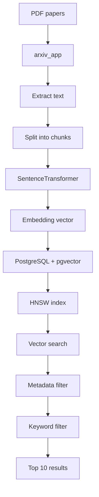
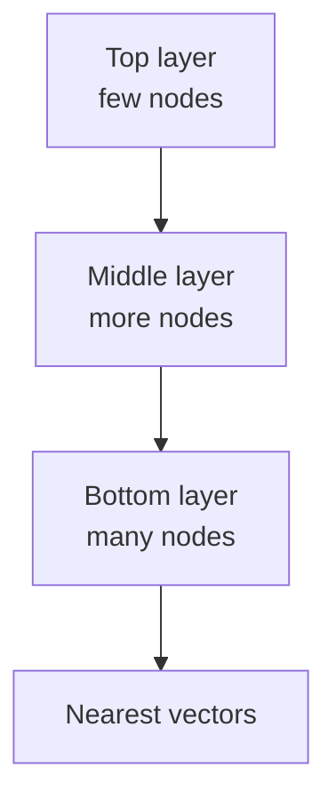
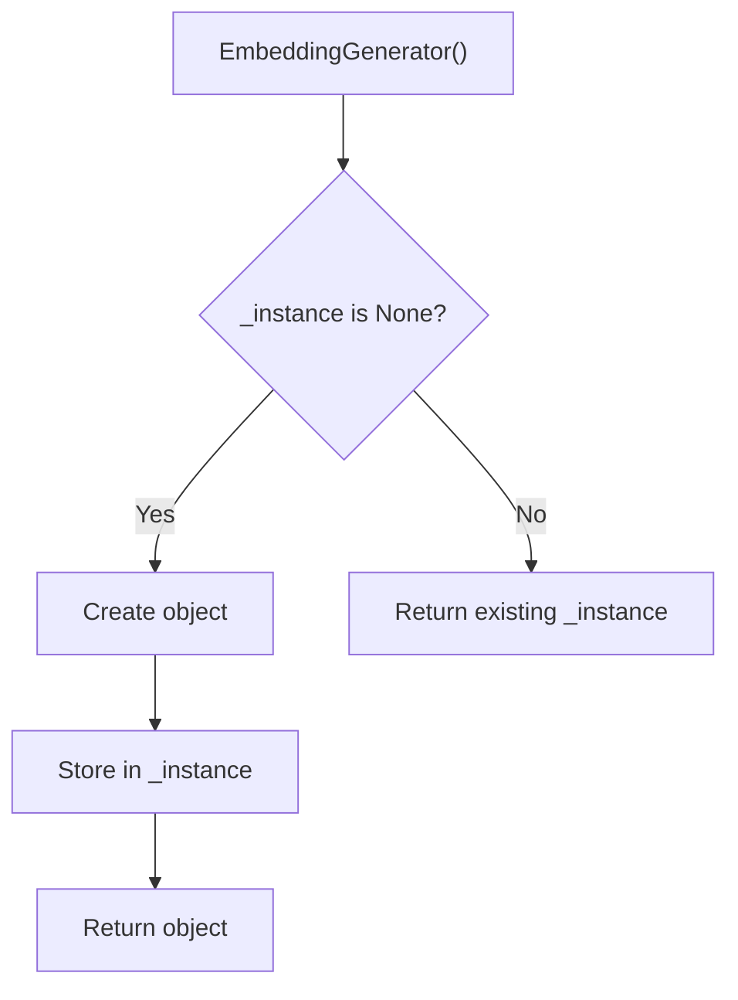
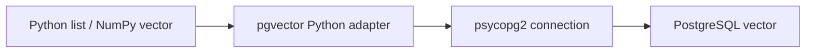
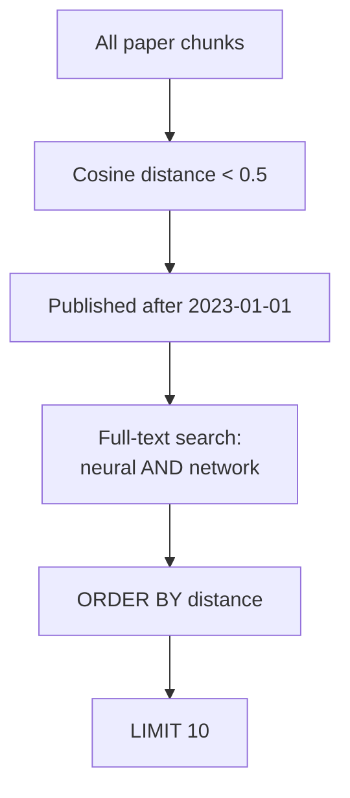
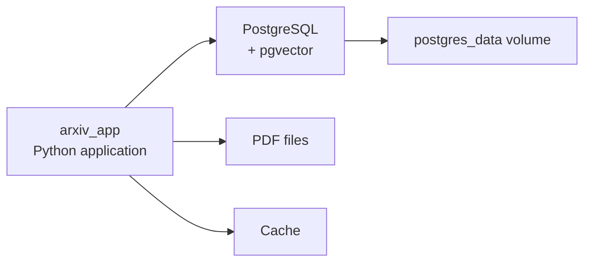
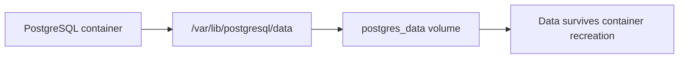
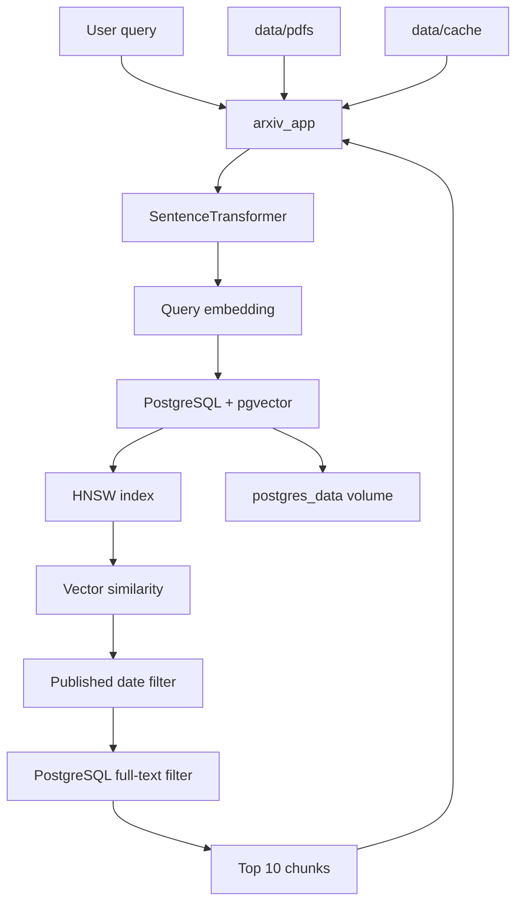

Yes — this is a **PostgreSQL + pgvector + SentenceTransformer + Docker** setup. I'll explain each part from first principles.

The overall architecture is:



---

# 1. HNSW index

```sql
CREATE INDEX idx_chunks_embedding ON paper_chunks
USING hnsw (embedding vector_cosine_ops)
WITH (m = 16, ef_construction = 64);
```

Let's break every part.

---

## `CREATE INDEX`

```sql
CREATE INDEX
```

`CREATE` means:

> Create something.

`INDEX` means:

> Create a data structure that makes searching faster.

Without an index, PostgreSQL may need to inspect many rows.

For example:

```text
1,000,000 vectors
       ↓
check many/all vectors
       ↓
find nearest vectors
```

With an HNSW index:

```text
1,000,000 vectors
       ↓
HNSW graph
       ↓
navigate promising areas
       ↓
nearest vectors
```

---

# 2. `idx_chunks_embedding`

```sql
idx_chunks_embedding
```

This is simply the **name of your index**.

You could call it:

```sql
paper_vector_index
```

or:

```sql
my_hnsw_index
```

The name doesn't change how the index works.

---

# 3. `ON paper_chunks`

```sql
ON paper_chunks
```

This tells PostgreSQL:

> Create the index for the `paper_chunks` table.

Your database might look like:

```text
paper_chunks
├── id
├── paper_id
├── chunk_text
└── embedding
```

---

# 4. `USING hnsw`

```sql
USING hnsw
```

This tells PostgreSQL:

> Use the HNSW algorithm for this index.

HNSW stands for:

**Hierarchical Navigable Small World**

It organizes vectors into a graph that can be navigated efficiently for approximate nearest-neighbor search.

Conceptually:



The important idea is that search doesn't need to compare your query against every vector.

---

# 5. `(embedding vector_cosine_ops)`

```sql
(embedding vector_cosine_ops)
```

This contains two things:

```text
embedding
     +
vector_cosine_ops
```

---

## `embedding`

```sql
embedding
```

This is your vector column.

For example:

```text
paper_chunks
┌────┬───────────┬──────────────────────┐
│ id │ chunk_text│ embedding            │
├────┼───────────┼──────────────────────┤
│ 1  │ Neural... │ [0.12,0.43,...]      │
│ 2  │ CNNs...   │ [0.91,0.12,...]      │
└────┴───────────┴──────────────────────┘
```

---

## `vector_cosine_ops`

```sql
vector_cosine_ops
```

This tells pgvector:

> Use cosine distance/similarity operations for this vector index.

This matters because vector similarity can be measured in different ways:

```text
Cosine
L2 / Euclidean
Inner product
```

You're choosing:

```text
Cosine
```

---

# 6. `WITH`

```sql
WITH (m = 16, ef_construction = 64)
```

Here `WITH` provides configuration options for the HNSW index.

---

# 7. `m = 16`

```sql
m = 16
```

`m` controls the approximate number of connections each graph node can have.

Think about each vector as a node:

```text
       vector
      /  |  \
     /   |   \
    v    v    v
 vector vector vector
```

Larger `m` generally means:

```text
more connections
     ↓
more memory
     +
potentially better search quality
```

Smaller `m` generally means:

```text
fewer connections
     ↓
less memory
     +
potentially lower search quality
```

---

# 8. `ef_construction = 64`

```sql
ef_construction = 64
```

This controls how much work is performed **while building the HNSW index**.

Think:

```text
ef_construction
       ↓
How carefully should I build the graph?
```

Higher:

```text
64 → 128 → 256
```

generally means more construction work and often a better graph, at the cost of more build time/resources.

Important distinction:

```text
ef_construction
       ↓
BUILDING the index
```

while a search-time setting such as `ef_search` controls:

```text
SEARCHING the index
```

---

# 9. EmbeddingGenerator

Now Python:

```python
class EmbeddingGenerator:
    _instance = None
```

This creates a Python class.

---

# 10. `class`

```python
class EmbeddingGenerator:
```

`class` means:

> Define a new type/object blueprint.

You're creating a class called:

```text
EmbeddingGenerator
```

Its job is to generate embeddings.

Conceptually:

```text
EmbeddingGenerator
       │
       ▼
SentenceTransformer
       │
       ▼
text → vector
```

---

# 11. `_instance`

```python
_instance = None
```

This is a class variable.

Initially:

```text
_instance
   ↓
None
```

`None` means:

> Nothing has been stored here yet.

The underscore:

```text
_
```

is a Python naming convention indicating that this is intended for internal use.

---

# 12. `__new__`

```python
def __new__(cls, *args, **kwargs):
```

This is more advanced Python.

`__new__()` controls **creation of the object itself**.

Normally:

```python
obj = EmbeddingGenerator()
```

Python creates an object.

`__new__` gets involved before `__init__`.

The simplified order is:

```text
EmbeddingGenerator()
       ↓
__new__()
       ↓
object created
       ↓
__init__()
       ↓
object initialized
```

---

# 13. `cls`

```python
cls
```

`cls` means:

> The class itself.

Here:

```text
cls = EmbeddingGenerator
```

It's similar to how:

```python
self
```

usually refers to an object instance.

So:

```text
self → object
cls  → class
```

---

# 14. `*args`

```python
*args
```

This collects additional **positional arguments**.

For example:

```python
EmbeddingGenerator("model", 123, True)
```

could result in additional arguments being collected into `args`.

---

# 15. `**kwargs`

```python
**kwargs
```

This collects additional **keyword arguments**.

For example:

```python
EmbeddingGenerator(
    model_name="abc",
    device="cuda"
)
```

could put those named arguments into `kwargs`.

For this particular class, they aren't actually used inside `__new__`.

---

# 16. `if cls._instance is None`

```python
if cls._instance is None:
```

This asks:

> Have we already created an instance?

Initially:

```text
_instance = None
```

Therefore:

```text
None?
 ↓
YES
 ↓
create object
```

Later:

```text
_instance = existing object
```

Then:

```text
None?
 ↓
NO
 ↓
return existing object
```

This implements the **Singleton pattern**.

---

# 17. `super()`

```python
super(EmbeddingGenerator, cls)
```

`super()` allows you to access methods from the parent class.

Here:

```python
super(EmbeddingGenerator, cls).__new__(cls)
```

means approximately:

> Use the parent object's `__new__` method to create the object.

---

# 18. `cls._instance = ...`

```python
cls._instance = super(EmbeddingGenerator, cls).__new__(cls)
```

This creates the object and stores it.

Conceptually:

```text
First call:

EmbeddingGenerator()
       ↓
_instance is None
       ↓
create object
       ↓
_instance = object
```

---

# 19. `_initialized`

```python
cls._instance._initialized = False
```

This adds a flag to the object.

Initially:

```text
_initialized = False
```

Meaning:

> The model hasn't been initialized yet.

---

# 20. `return cls._instance`

```python
return cls._instance
```

Return the object.

So the first call creates it.

Second call:

```python
EmbeddingGenerator()
```

doesn't create another object.

It returns the existing one.

---

# Singleton visualization



This is useful here because loading a SentenceTransformer model can be expensive.

You generally don't want:

```text
Request 1 → load model
Request 2 → load model
Request 3 → load model
Request 4 → load model
```

Instead:

```text
Request 1 → load model
Request 2 → reuse model
Request 3 → reuse model
Request 4 → reuse model
```

---

# 21. `__init__`

```python
def __init__(self, model_name='all-MiniLM-L6-v2'):
```

`__init__` initializes the object.

The default:

```python
model_name='all-MiniLM-L6-v2'
```

means:

> If the caller doesn't specify a model, use `all-MiniLM-L6-v2`.

---

# 22. `_initialized`

```python
if self._initialized:
    return
```

This asks:

> Has this object already been initialized?

If yes:

```python
return
```

means:

> Stop `__init__` immediately.

This prevents loading the model again.

---

# 23. `self.model`

```python
self.model = SentenceTransformer(model_name)
```

`self` refers to the current object.

So:

```python
self.model
```

means:

> Store the SentenceTransformer model inside this object.

`SentenceTransformer(model_name)` loads the embedding model.

Conceptually:

```text
text
 ↓
SentenceTransformer
 ↓
vector
```

For example:

```text
"neural networks are powerful"
            ↓
      embedding model
            ↓
[0.12, -0.31, 0.82, ...]
```

---

# 24. `self._initialized = True`

```python
self._initialized = True
```

Now the object says:

```text
"I have been initialized."
```

Next time:

```python
if self._initialized:
    return
```

will stop the initialization.

---

# 25. pgvector Python registration

```python
from pgvector.psycopg2 import register_vector
```

This imports:

```text
register_vector
```

from the pgvector Psycopg2 integration.

Psycopg2 is a Python PostgreSQL driver.

The overall relationship is:

```text
Python
  │
  ▼
psycopg2
  │
  ▼
PostgreSQL
  │
  ▼
pgvector
```

---

# 26. `register_vector(conn)`

```python
register_vector(conn)
```

This tells the PostgreSQL Python connection how to work with pgvector's vector type.

Without appropriate adaptation/registration, Python doesn't automatically know how to send/receive PostgreSQL's `vector` type through psycopg2.

Conceptually:



---

# 27. The search query

Now:

```sql
SELECT p.title, p.abstract, c.distance
FROM paper_chunks c
JOIN papers p ON p.id = c.paper_id
WHERE c.embedding <=> query_vector < 0.5
  AND p.published_date > '2023-01-01'
  AND c.chunk_text @@ to_tsquery('neural & network')
ORDER BY c.distance ASC
LIMIT 10;
```

This is doing **hybrid search**.

You're combining:

```text
Vector similarity
+
Metadata filtering
+
Keyword search
```

---

# 28. `SELECT`

```sql
SELECT p.title, p.abstract, c.distance
```

You want three things:

```text
paper title
paper abstract
vector distance
```

---

# 29. `FROM paper_chunks c`

```sql
FROM paper_chunks c
```

Start with:

```text
paper_chunks
```

and give it the short name:

```text
c
```

So:

```sql
c.embedding
```

means:

```text
paper_chunks.embedding
```

---

# 30. `JOIN papers p`

```sql
JOIN papers p
```

Now connect the chunks to their parent papers.

```text
papers
   │
   ├── paper 1
   │    ├── chunk 1
   │    ├── chunk 2
   │    └── chunk 3
   │
   └── paper 2
        ├── chunk 4
        └── chunk 5
```

---

# 31. `ON p.id = c.paper_id`

```sql
ON p.id = c.paper_id
```

This specifies the relationship:

```text
papers.id
    =
paper_chunks.paper_id
```

So PostgreSQL knows which paper each chunk belongs to.

---

# 32. `<=>`

```sql
c.embedding <=> query_vector
```

`<=>` is pgvector's **cosine distance operator** when used with cosine distance.

It calculates the distance between:

```text
database embedding
        and
query vector
```

Conceptually:

```text
query vector
     │
     │ compare
     ▼
chunk embedding
     │
     ▼
cosine distance
```

Lower cosine distance means the vectors are more similar.

---

# 33. `< 0.5`

```sql
c.embedding <=> query_vector < 0.5
```

This means:

> Only keep chunks whose cosine distance is less than `0.5`.

So:

```text
0.10 → keep
0.25 → keep
0.49 → keep
0.50 → don't keep
0.80 → don't keep
```

---

# 34. Published-date filter

```sql
p.published_date > '2023-01-01'
```

This means:

> Only papers published after January 1, 2023.

So you have:

```text
Vector filter
        AND
Date filter
```

---

# 35. `@@`

```sql
c.chunk_text @@ ...
```

`@@` is PostgreSQL's **full-text search matching operator**.

It asks:

> Does this text match this full-text-search query?

---

# 36. `to_tsquery`

```sql
to_tsquery('neural & network')
```

This converts the string into a PostgreSQL text-search query.

The:

```text
&
```

means **AND**.

So:

```text
neural & network
```

means approximately:

> Find text containing both `neural` and `network` according to PostgreSQL full-text-search rules.

---

# 37. Combining all three filters

Your query effectively says:

```text
Find chunks where:

        vector is similar
                AND
        paper is recent
                AND
        text contains required search terms
```

Like this:



That's a very useful pattern for academic search.

---

# 38. `ORDER BY c.distance ASC`

```sql
ORDER BY c.distance ASC
```

Sort by vector distance from smallest to largest:

```text
0.05
0.09
0.13
0.21
0.31
...
```

The closest vectors appear first.

---

# 39. `LIMIT 10`

```sql
LIMIT 10
```

Return only the first 10 results.

So the whole search pipeline is:

```text
Millions of chunks
       ↓
Vector similarity
       ↓
Date filter
       ↓
Keyword filter
       ↓
Sort by similarity
       ↓
10 results
```

---

# 40. Docker Compose

Now the final section:

```yaml
version: '3.8'
services:
```

This is a Docker Compose configuration.

It describes multiple containers that work together.

Your architecture is:



---

# 41. `version: '3.8'`

```yaml
version: '3.8'
```

This specifies the Compose file format version.

One note: modern Docker Compose generally no longer needs the top-level `version` field; current Compose implementations treat it as obsolete/ignored. So for a modern Compose file, you can generally omit it.

---

# 42. `services`

```yaml
services:
```

A **service** is a containerized component of your application.

You have two:

```text
services
├── postgres
└── arxiv_app
```

---

# 43. PostgreSQL service

```yaml
postgres:
```

This defines a service named:

```text
postgres
```

---

# 44. `image`

```yaml
image: pgvector/pgvector:pg15
```

This says:

> Use the Docker image `pgvector/pgvector` with the `pg15` tag.

So instead of manually installing:

```text
PostgreSQL
+
pgvector
```

the image provides a PostgreSQL environment with pgvector.

---

# 45. `environment`

```yaml
environment:
```

Environment variables are configuration values supplied to the container.

You have:

```yaml
POSTGRES_USER: postgres
POSTGRES_PASSWORD: password
POSTGRES_DB: arxiv_papers
```

So PostgreSQL starts with:

```text
username: postgres
password: password
database: arxiv_papers
```

For real deployment, don't use a simple password like this; use secrets/environment management.

---

# 46. `volumes`

```yaml
volumes:
  - postgres_data:/var/lib/postgresql/data
```

This is extremely important.

Docker containers can be deleted/recreated.

You don't want your database disappearing when the container is removed.

So you create a persistent Docker volume:

```text
postgres_data
```

and mount it into PostgreSQL's data directory:

```text
/var/lib/postgresql/data
```

Conceptually:



---

# 47. `ports`

```yaml
ports:
  - "5432:5432"
```

This maps:

```text
host port 5432
        ↓
container port 5432
```

PostgreSQL normally listens on:

```text
5432
```

So your host machine can connect to:

```text
localhost:5432
```

---

# 48. `arxiv_app`

```yaml
arxiv_app:
```

This is your Python application container.

It might contain:

```text
FastAPI
SentenceTransformer
PDF processing
PostgreSQL client
pgvector
```

---

# 49. `build: .`

```yaml
build: .
```

This means:

> Build the Docker image using the Dockerfile in the current directory.

For example:

```text
project/
├── Dockerfile
├── docker-compose.yml
├── app/
└── data/
```

The:

```text
.
```

means:

> Current directory.

---

# 50. `depends_on`

```yaml
depends_on:
  - postgres
```

This tells Compose that:

```text
arxiv_app
```

depends on:

```text
postgres
```

So Compose starts the PostgreSQL service as a dependency.

However, `depends_on` does **not by itself guarantee that PostgreSQL is fully ready to accept connections**. A production setup commonly adds a healthcheck and/or application retry logic.

---

# 51. Application environment

```yaml
environment:
  DB_HOST: postgres
  DB_PORT: 5432
```

This is particularly interesting.

Why is:

```yaml
DB_HOST: postgres
```

not:

```yaml
DB_HOST: localhost
```

?

Because both services are inside Docker Compose's network.

Docker Compose provides service-name DNS.

So:

```text
arxiv_app
    │
    │ DB_HOST=postgres
    ▼
postgres container
```

The service name:

```text
postgres
```

acts as the hostname.

---

# 52. `DB_PORT`

```yaml
DB_PORT: 5432
```

PostgreSQL listens on port:

```text
5432
```

inside the container network.

So your Python app can conceptually connect to:

```text
postgres:5432
```

---

# 53. Application volumes

```yaml
volumes:
  - ./data/pdfs:/data/pdfs
  - ./data/cache:/data/cache
```

There are two mounts.

### First

```text
./data/pdfs
        ↓
/data/pdfs
```

Your host machine's:

```text
data/pdfs
```

appears inside the container as:

```text
/data/pdfs
```

So:

```text
Host
project/data/pdfs
        │
        ▼
Container
/data/pdfs
```

---

### Second

```text
./data/cache
        ↓
/data/cache
```

Same idea.

This lets your application persist/use cached files outside the container filesystem.

---

# Final architecture

Putting everything together:



## The whole system in plain English

```text
1. Download academic papers
        ↓
2. Extract text
        ↓
3. Split papers into chunks
        ↓
4. SentenceTransformer converts each chunk to a vector
        ↓
5. Store:
       paper metadata → PostgreSQL
       chunk text     → PostgreSQL
       embeddings     → pgvector
        ↓
6. HNSW makes vector search fast
        ↓
7. User asks a question
        ↓
8. Convert question → embedding
        ↓
9. Search similar chunks
        ↓
10. Filter by date
        ↓
11. Filter by keywords
        ↓
12. Return closest 10 results
```

The most important concept to understand is that you actually have **three kinds of search happening together**:

```text
                    SEARCH
                      │
       ┌──────────────┼──────────────┐
       ▼              ▼              ▼
   Vector          Metadata       Keyword
   similarity       filters        search
       │              │              │
       │          published_date     │
       │              │          neural & network
       └──────────────┼──────────────┘
                      ▼
                 Final results
```

That's the foundation of a **hybrid RAG/search system for academic papers**.