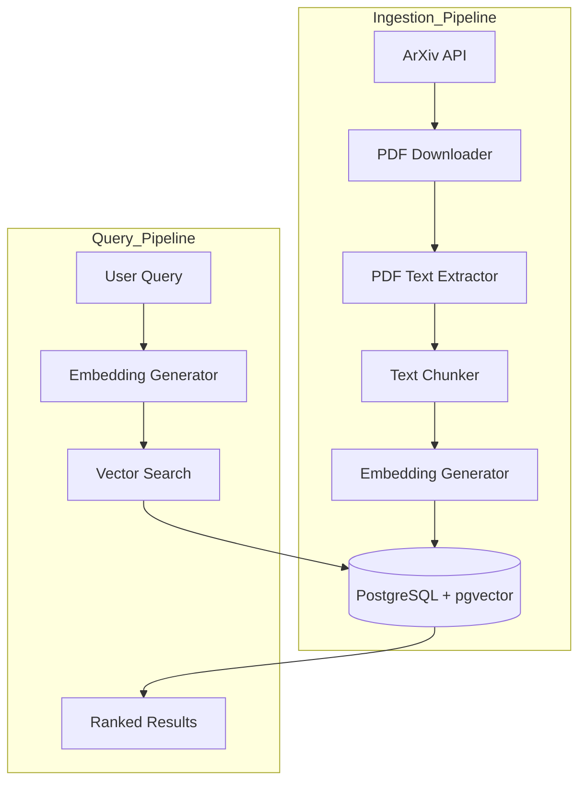
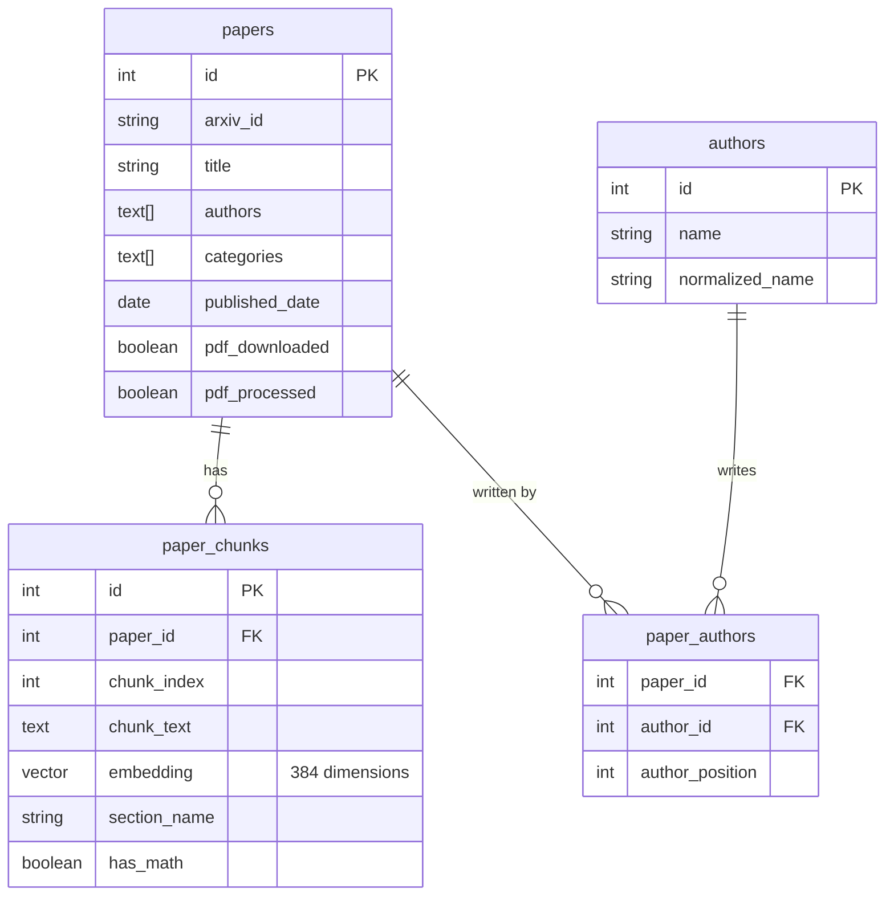
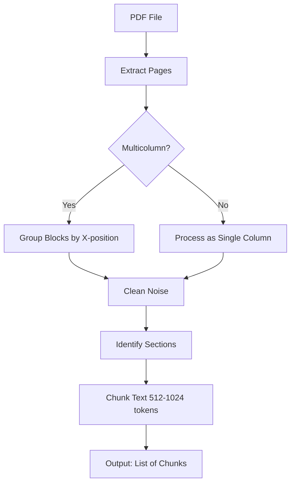
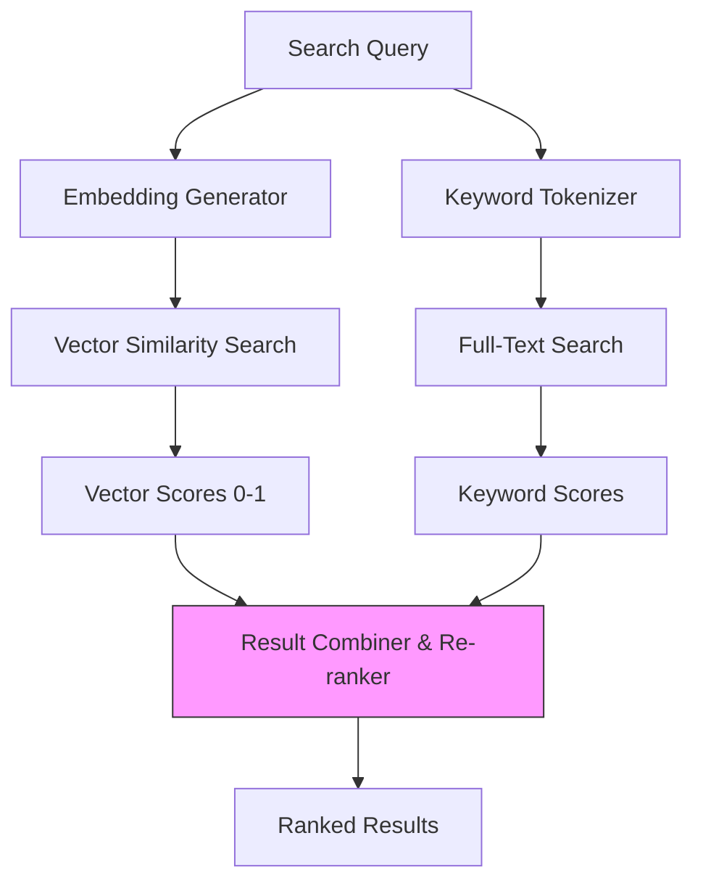
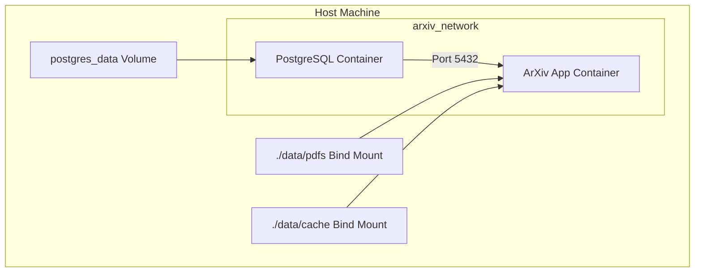

# Building ArXiv Paper Search System with PostgreSQL pgvector

build **Semantic Search System** for scientific papers. We use **PostgreSQL** with **pgvector** (extension that adds vector search capabilities) to find papers by meaning, not just keywords.

Traditional keyword search fails when researchers use different terminology for same concept (e.g., "neural network optimization" vs. "gradient descent improvements"). Vector search solves this by understanding *meaning* behind text.

We fetch papers from ArXiv, extract text from PDFs, convert text into vectors and store them in PostgreSQL. 

When user search, we convert query into vector and find closest match.

---

## 2. System Architecture



1.  **ArXiv API Integration:** Fetch metadata (title, authors, abstract).
2.  **PDF Download & Management:** Download PDFs and organiz them by year.
3.  **PDF Text Extraction:** Use PyMuPDF to extract clean text from complex academic layouts.
4.  **Embedding Generation:** Use SentenceTransformers (`all-MiniLM-L6-v2`) to create 384-dimensional vectors.
5.  **PostgreSQL + pgvector:** Store metadata, text chunks and vectors. Uses HNSW indexing for fast search.
6.  **Search Interface:** A CLI tool for user to query database.

---

## Database Schema: Hybrid Approach

We use **hybrid schema** that combine normalized tables for metadata with denormalized storage for vectors and text chunks.

### Core Tables:
- **`papers`**: Store (title, authors, categories, dates).
- **`paper_chunks`**: Store text segments and their vector embeddings.
- **`authors`**: Store author information.
- **`paper_authors`**: Many-to-many relationship between papers and authors.
- **`categories`**: ArXiv taxonomy.
- **`search_history`**: Log user queries for analysis.



### Vector Storage Strategy:
- **Dimension:** 384 (`all-MiniLM-L6-v2`).
- **Chunk Size:** 512 to 1,024 tokens ( 1-3 paragraphs).
- **Overlap:** 20% between consecutive chunks to preserve context.
- **Index:** HNSW (Hierarchical Navigable Small World) for fast approximate search.

```sql
-- Example: Creating the HNSW index
CREATE INDEX idx_chunks_embedding ON paper_chunks
USING hnsw (embedding vector_cosine_ops)
WITH (m = 16, ef_construction = 64);
```

---

## 4. PDF Extraction

### Extraction Pipeline:
1.  **Extract Pages:** Use PyMuPDF (`fitz`) to read PDF.
2.  **Detect Columns:** Check if page has multi-column layout.
3.  **Group Blocks:** Group text blocks by their x-position to maintain reading order.
4.  **Clean Noise:** Remove header, footer and page number.
5.  **Identify Sections:** Detect section boundaries.
6.  **Chunk Text:** Split into overlapping chunks of 512-1024 tokens.



---

## Embedding Generation

To avoid memory overhead, we use  **Singleton Pattern** for embedding model. So, only one instance of model is loaded into memory.

```python
class EmbeddingGenerator:
    _instance = None

    def __new__(cls, *args, **kwargs):
        if cls._instance is None:
            cls._instance = super(EmbeddingGenerator, cls).__new__(cls)
            cls._instance._initialized = False
        return cls._instance

    def __init__(self, model_name='all-MiniLM-L6-v2'):
        if self._initialized:
            return
        self.model = SentenceTransformer(model_name)
        self._initialized = True
```

### Batch Processing:
- Process 100 chunks at a time.
- Use `execute_batch` from `psycopg2` for efficient database inserts.
- Register `pgvector` helper with  connection to handle numpy arrays.

```python
from pgvector.psycopg2 import register_vector
register_vector(conn)
```

---

## Hybrid Search

**Vector Similarity** (semantic meaning) with **Keyword Search** (exact match) and **Metadata Filters** (date, author, category).

### Search Mode:
- **Vector:** Pure semantic search.
- **Hybrid:** Combine vector and keyword score ( 70% vector, 30% keyword).
- **Keyword:** full-text search using PostgreSQL's `ts_vector` and `pg_trgm`.



### Example Hybrid Query:
```sql
SELECT p.title, p.abstract, c.distance
FROM paper_chunks c
JOIN papers p ON p.id = c.paper_id
WHERE c.embedding <=> query_vector < 0.5  -- Vector similarity
  AND p.published_date > '2023-01-01'     -- Metadata filter
  AND c.chunk_text @@ to_tsquery('neural & network') -- Keyword filter
ORDER BY c.distance ASC
LIMIT 10;
```

---

## Docker Packaging: Consistent Deployment

Docker Compose to orchestrate application and database.



### Docker Compose Configuration:
```yaml
version: '3.8'
services:
  postgres:
    image: pgvector/pgvector:pg15
    environment:
      POSTGRES_USER: postgres
      POSTGRES_PASSWORD: password
      POSTGRES_DB: arxiv_papers
    volumes:
      - postgres_data:/var/lib/postgresql/data
    ports:
      - "5432:5432"

  arxiv_app:
    build: .
    depends_on:
      - postgres
    environment:
      DB_HOST: postgres
      DB_PORT: 5432
    volumes:
      - ./data/pdfs:/data/pdfs
      - ./data/cache:/data/cache
```

---


This architecture provide personal research assistant, enabling you to find relevant papers by meaning rather than just keywords.