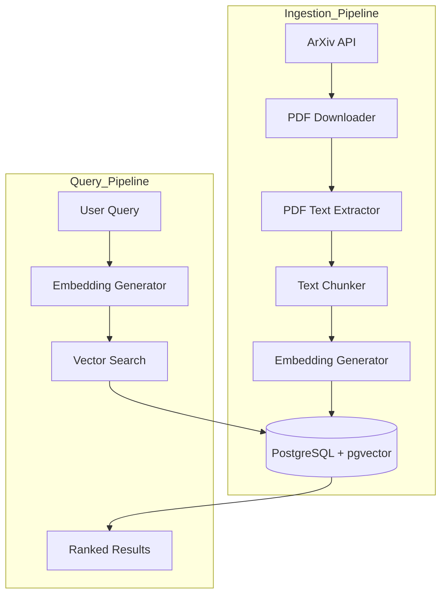
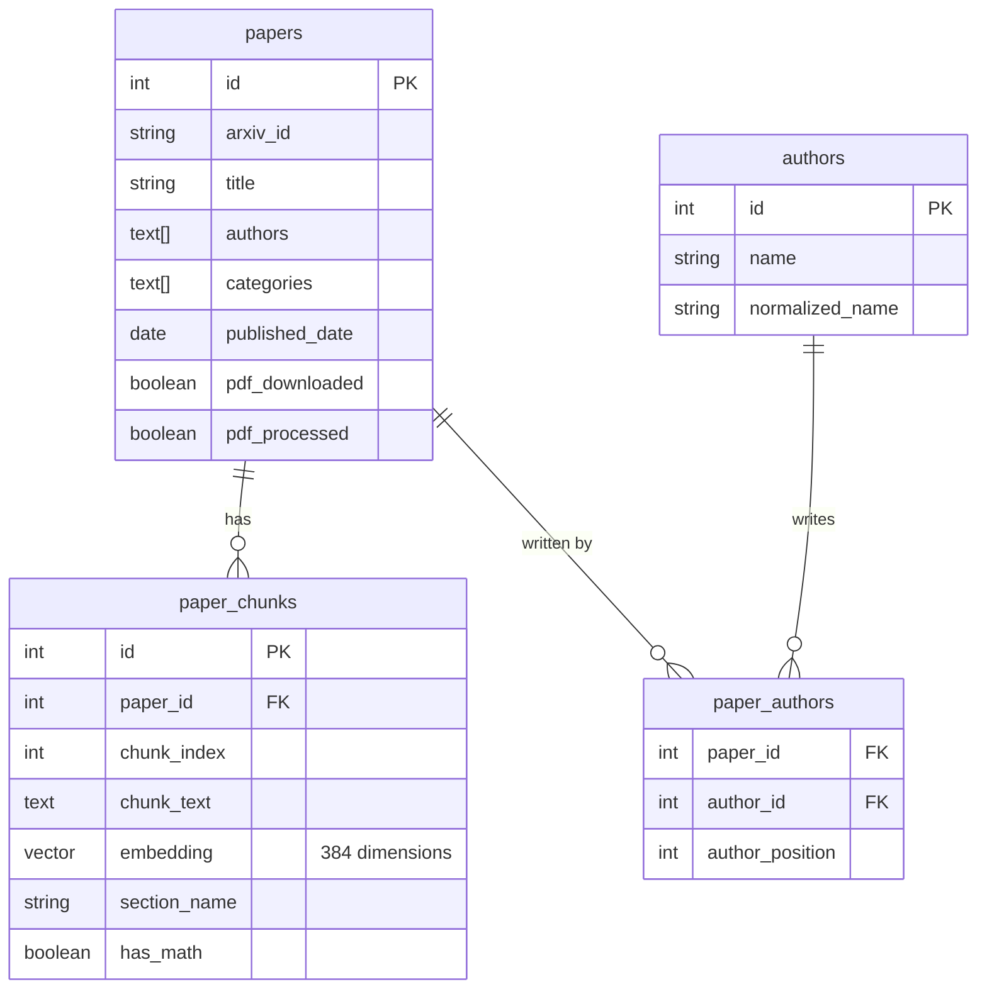
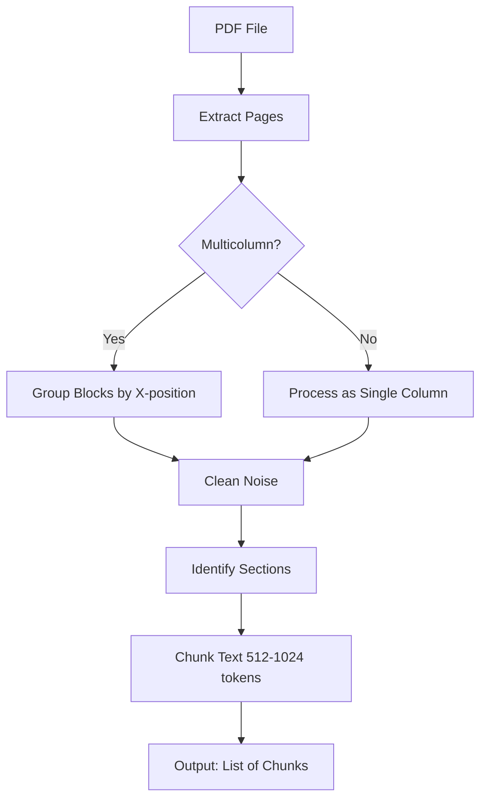
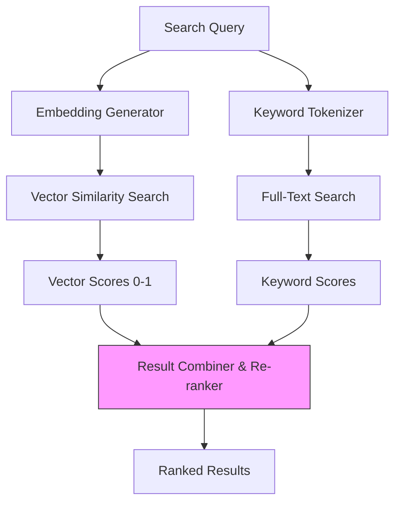
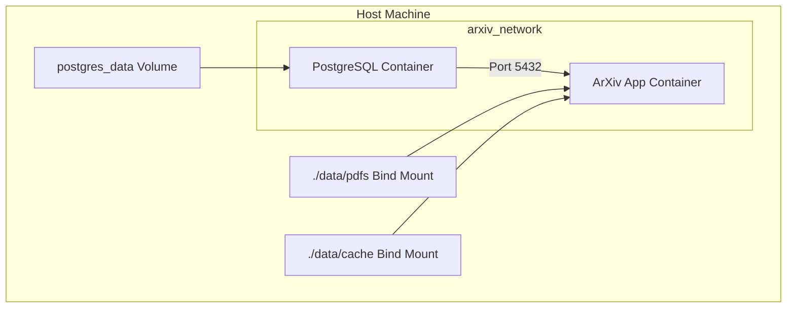

Here is a comprehensive note in Markdown format, designed to be saved directly into Obsidian. It explains the core concepts of building an ArXiv paper search system using PostgreSQL and pgvector, using simple language, Mermaid diagrams, and SVG graphics.

---

# Building an ArXiv Paper Search System with PostgreSQL pgvector

This note explains how to build a **Semantic Search System** for scientific papers. We use **PostgreSQL** (a powerful relational database) combined with **pgvector** (an extension that adds vector search capabilities) to find papers by meaning, not just keywords.

## 1. The Big Idea: Semantic Search for Science

Traditional keyword search fails when researchers use different terminology for the same concept (e.g., "neural network optimization" vs. "gradient descent improvements"). Vector search solves this by understanding the *meaning* behind the text.

**Our Approach:** We fetch papers from ArXiv, extract text from PDFs, convert text into vectors (embeddings), and store them in PostgreSQL. When a user searches, we convert their query into a vector and find the closest matches.

```mermaid
graph LR
    A[User Query: "Edge AI"] --> B[Embedding Model]
    B --> C[Query Vector]
    C --> D[PostgreSQL pgvector]
    D --> E[Similar Papers]
```

---

## 2. System Architecture: The Data Pipeline

The system consists of six interconnected components that transform raw PDFs into searchable vectors.



### Key Components:
1.  **ArXiv API Integration:** Fetches metadata (title, authors, abstract).
2.  **PDF Download & Management:** Downloads PDFs and organizes them by year.
3.  **PDF Text Extraction:** Uses PyMuPDF to extract clean text from complex academic layouts.
4.  **Embedding Generation:** Uses SentenceTransformers (`all-MiniLM-L6-v2`) to create 384-dimensional vectors.
5.  **PostgreSQL + pgvector:** Stores metadata, text chunks, and vectors. Uses HNSW indexing for fast search.
6.  **Search Interface:** A CLI tool for users to query the database.

---

## 3. Database Schema: The Hybrid Approach

We use a **hybrid schema** that combines normalized tables for metadata with denormalized storage for vectors and text chunks.

### Core Tables:
- **`papers`**: Stores metadata (title, authors, categories, dates).
- **`paper_chunks`**: Stores text segments and their vector embeddings.
- **`authors`**: Stores author information.
- **`paper_authors`**: Many-to-many relationship between papers and authors.
- **`categories`**: ArXiv taxonomy.
- **`search_history`**: Logs user queries for analysis.



### Vector Storage Strategy:
- **Dimension:** 384 (from `all-MiniLM-L6-v2`).
- **Chunk Size:** 512 to 1,024 tokens (roughly 1-3 paragraphs).
- **Overlap:** 20% between consecutive chunks to preserve context.
- **Index:** HNSW (Hierarchical Navigable Small World) for fast approximate search.

```sql
-- Example: Creating the HNSW index
CREATE INDEX idx_chunks_embedding ON paper_chunks
USING hnsw (embedding vector_cosine_ops)
WITH (m = 16, ef_construction = 64);
```

---

## 4. PDF Extraction: Taming the Wild West

Academic PDFs are notoriously difficult to parse. They have multicolumn layouts, mathematical equations, and headers/footers that add noise.

### The Extraction Pipeline:
1.  **Extract Pages:** Use PyMuPDF (`fitz`) to read the PDF.
2.  **Detect Columns:** Check if the page has a multi-column layout.
3.  **Group Blocks:** Group text blocks by their x-position to maintain reading order.
4.  **Clean Noise:** Remove headers, footers, and page numbers.
5.  **Identify Sections:** Detect section boundaries (Introduction, Methods, etc.).
6.  **Chunk Text:** Split into overlapping chunks of 512-1024 tokens.



---

## 5. Embedding Generation: The Singleton Pattern

To avoid memory overhead, we use the **Singleton Pattern** for the embedding model. This ensures only one instance of the model is loaded into memory.

```python
class EmbeddingGenerator:
    _instance = None

    def __new__(cls, *args, **kwargs):
        if cls._instance is None:
            cls._instance = super(EmbeddingGenerator, cls).__new__(cls)
            cls._instance._initialized = False
        return cls._instance

    def __init__(self, model_name='all-MiniLM-L6-v2'):
        if self._initialized:
            return
        self.model = SentenceTransformer(model_name)
        self._initialized = True
```

### Batch Processing:
- Process chunks in batches (e.g., 100 chunks at a time).
- Use `execute_batch` from `psycopg2` for efficient database inserts.
- Register the `pgvector` helper with the connection to handle numpy arrays.

```python
from pgvector.psycopg2 import register_vector
register_vector(conn)
```

---

## 6. Hybrid Search: The Best of Both Worlds

We combine **Vector Similarity** (semantic meaning) with **Keyword Search** (exact matches) and **Metadata Filters** (date, author, category).

### Search Modes:
- **Vector:** Pure semantic search.
- **Hybrid:** Combines vector and keyword scores (e.g., 70% vector, 30% keyword).
- **Keyword:** Traditional full-text search using PostgreSQL's `ts_vector` and `pg_trgm`.



### Example Hybrid Query:
```sql
SELECT p.title, p.abstract, c.distance
FROM paper_chunks c
JOIN papers p ON p.id = c.paper_id
WHERE c.embedding <=> query_vector < 0.5  -- Vector similarity
  AND p.published_date > '2023-01-01'     -- Metadata filter
  AND c.chunk_text @@ to_tsquery('neural & network') -- Keyword filter
ORDER BY c.distance ASC
LIMIT 10;
```

---

## 7. Docker Packaging: Consistent Deployment

We use Docker Compose to orchestrate the application and database.



### Docker Compose Configuration:
```yaml
version: '3.8'
services:
  postgres:
    image: pgvector/pgvector:pg15
    environment:
      POSTGRES_USER: postgres
      POSTGRES_PASSWORD: password
      POSTGRES_DB: arxiv_papers
    volumes:
      - postgres_data:/var/lib/postgresql/data
    ports:
      - "5432:5432"

  arxiv_app:
    build: .
    depends_on:
      - postgres
    environment:
      DB_HOST: postgres
      DB_PORT: 5432
    volumes:
      - ./data/pdfs:/data/pdfs
      - ./data/cache:/data/cache
```

---

## 8. Visualizing the Vector Space

Here is a visual representation of how ArXiv papers are clustered in vector space.

<svg width="500" height="350" xmlns="http://www.w3.org/2000/svg">
  <!-- Background Grid -->
  <defs>
    <pattern id="grid" width="30" height="30" patternUnits="userSpaceOnUse">
      <path d="M 30 0 L 0 0 0 30" fill="none" stroke="#e0e0e0" stroke-width="1"/>
    </pattern>
  </defs>
  <rect width="100%" height="100%" fill="url(#grid)" />

  <!-- Axes -->
  <line x1="50" y1="300" x2="450" y2="300" stroke="#333" stroke-width="2" />
  <line x1="50" y1="300" x2="50" y2="50" stroke="#333" stroke-width="2" />
  <text x="460" y="315" font-family="Arial" font-size="14" fill="#333">Dimension 1 (e.g., "Math")</text>
  <text x="10" y="40" font-family="Arial" font-size="14" fill="#333">Dimension 2 (e.g., "CS")</text>

  <!-- Query Vector -->
  <circle cx="250" cy="150" r="8" fill="#FF5722" />
  <text x="260" y="145" font-family="Arial" font-size="14" font-weight="bold" fill="#FF5722">Query: "Neural Networks"</text>

  <!-- Cluster 1: Deep Learning Papers -->
  <circle cx="230" cy="170" r="6" fill="#2196F3" />
  <circle cx="270" cy="130" r="6" fill="#2196F3" />
  <circle cx="240" cy="140" r="6" fill="#2196F3" />
  <text x="280" y="125" font-family="Arial" font-size="12" fill="#2196F3">Deep Learning</text>

  <!-- Cluster 2: Optimization Papers -->
  <circle cx="180" cy="200" r="6" fill="#4CAF50" />
  <circle cx="160" cy="220" r="6" fill="#4CAF50" />
  <circle cx="190" cy="210" r="6" fill="#4CAF50" />
  <text x="140" y="240" font-family="Arial" font-size="12" fill="#4CAF50">Optimization</text>

  <!-- Cluster 3: Unrelated Papers -->
  <circle cx="100" cy="80" r="6" fill="#9E9E9E" />
  <circle cx="120" cy="100" r="6" fill="#9E9E9E" />
  <circle cx="80" cy="110" r="6" fill="#9E9E9E" />
  <text x="130" y="95" font-family="Arial" font-size="12" fill="#9E9E9E">Unrelated</text>

  <!-- Distance Line -->
  <line x1="250" y1="150" x2="230" y2="170" stroke="#FF5722" stroke-width="1" stroke-dasharray="4" />
  <text x="200" y="175" font-family="Arial" font-size="10" fill="#FF5722">L2 Distance</text>
</svg>

*   **Red Dot:** Your search query.
*   **Blue Dots:** Deep Learning papers (semantically similar).
*   **Green Dots:** Optimization papers (related but different).
*   **Grey Dots:** Unrelated papers.
*   The **L2 Distance** measures how close the query is to each paper.

---

## 9. Summary Checklist

- [x] **Environment:** PostgreSQL 15+ with `pgvector`, Python 3.9+.
- [x] **Schema:** `papers`, `paper_chunks` (with `vector(384)`), `authors`, `paper_authors`.
- [x] **Indexing:** HNSW index on `embedding` column.
- [x] **Extraction:** PyMuPDF for text, custom logic for columns and noise.
- [x] **Chunking:** 512-1024 tokens with 20% overlap.
- [x] **Embedding:** `all-MiniLM-L6-v2` (384 dimensions).
- [x] **Search:** Hybrid (Vector + Keyword + Metadata).
- [x] **Deployment:** Docker Compose for consistent setup.

This architecture provides a robust foundation for a personal research assistant, enabling you to find relevant papers by meaning rather than just keywords.