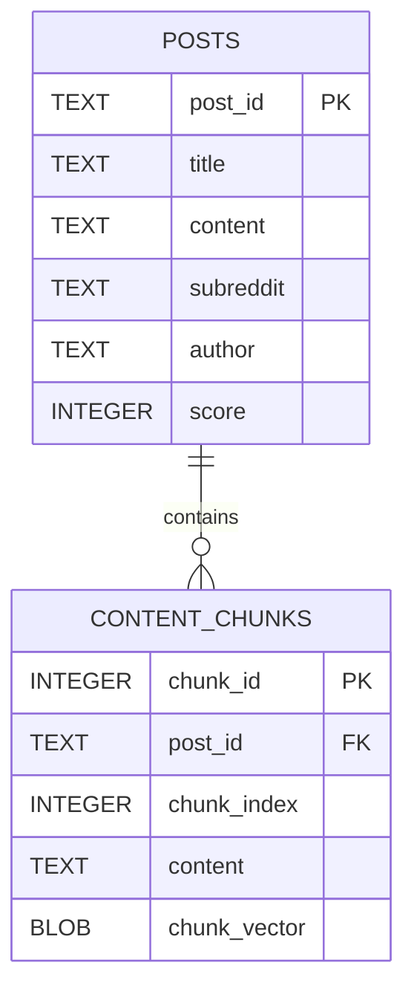
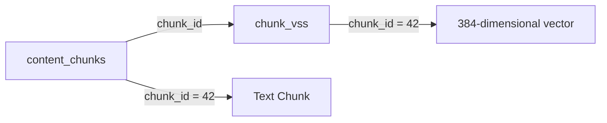
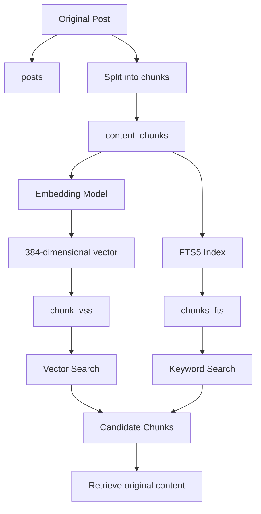
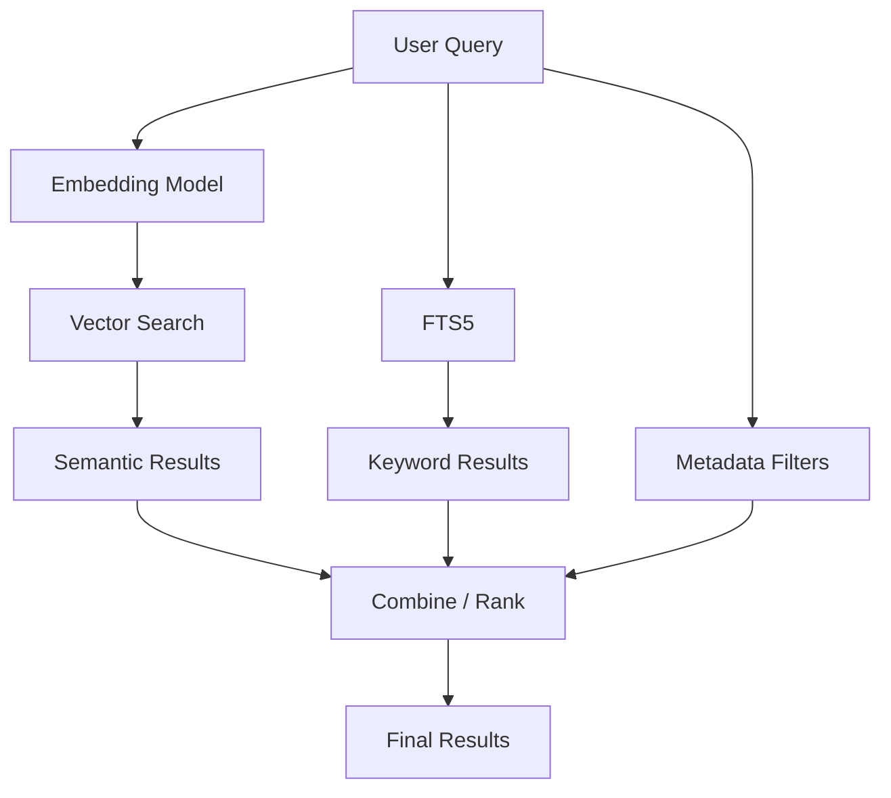
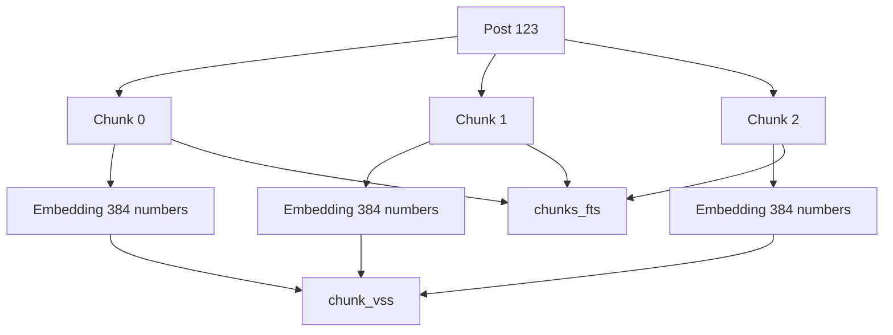

Absolutely. This code creates **three different layers of storage/search** in SQLite:

1. `posts` → stores the original Reddit-like posts
    
2. `content_chunks` → stores smaller pieces of each post + their embeddings
    
3. `chunk_vss` → enables **vector similarity search**
    
4. `chunks_fts` → enables **keyword/full-text search**
    

I'll explain **every important word and symbol**.

---

# 1. `posts` table

```sql
CREATE TABLE posts (
    post_id TEXT PRIMARY KEY,
    title TEXT,
    content TEXT,
    subreddit TEXT,
    author TEXT,
    score INTEGER
);
```

This creates the main table containing the original posts.

## Visual idea



One post can have **many chunks**.

---

## `CREATE`

```sql
CREATE
```

Means:

> Make something new.

Examples:

```sql
CREATE TABLE
CREATE INDEX
CREATE DATABASE
```

Here we are creating a table.

---

## `TABLE`

```sql
CREATE TABLE
```

`TABLE` tells SQLite:

> The thing I want to create is a database table.

So:

```sql
CREATE TABLE posts
```

means:

> Create a table called `posts`.

---

# 2. `posts`

```sql
posts
```

This is the name of your table.

You could name it:

```sql
posts
reddit_posts
documents
articles
```

Here you chose:

```text
posts
```

---

# 3. Opening `(`

```sql
(
```

This starts the list of columns.

Everything between:

```sql
(
...
)
```

describes the table's columns.

---

# 4. `post_id TEXT PRIMARY KEY`

```sql
post_id TEXT PRIMARY KEY,
```

This defines a column called `post_id`.

### `post_id`

The column name.

For example:

|post_id|
|---|
|abc123|
|xyz789|
|post001|

---

### `TEXT`

```sql
post_id TEXT
```

means the column stores text.

Example:

```text
"abc123"
"reddit_001"
"post_xyz"
```

---

### `PRIMARY KEY`

```sql
post_id TEXT PRIMARY KEY
```

means `post_id` uniquely identifies each post.

For example:

|post_id|title|
|---|---|
|`abc123`|Python question|
|`xyz789`|ML question|

You cannot have:

```text
abc123
abc123
```

for two different rows.

Think of it as:

```text
post_id
   ↓
unique identity of the post
```

---

# 5. `title TEXT`

```sql
title TEXT,
```

Stores the post title.

Example:

```text
"How does FAISS work?"
```

---

# 6. `content TEXT`

```sql
content TEXT,
```

Stores the complete post content.

Example:

```text
"I am learning vector databases.
How does similarity search work?"
```

---

# 7. `subreddit TEXT`

```sql
subreddit TEXT,
```

Stores the subreddit.

Example:

```text
"MachineLearning"
"Python"
"datascience"
```

---

# 8. `author TEXT`

```sql
author TEXT,
```

Stores the author's name.

Example:

```text
"john123"
"alice"
"bob"
```

---

# 9. `score INTEGER`

```sql
score INTEGER
```

Stores an integer score.

For example:

```text
125
42
-3
1000
```

`INTEGER` means whole numbers.

Not:

```text
12.5
```

but:

```text
12
```

---

# 10. `);`

```sql
);
```

The `)` ends the column definitions.

The `;` means:

> The SQL statement is finished.

So the whole thing:

```sql
CREATE TABLE posts (
    ...
);
```

means:

> Create a table called `posts` with these columns.

---

# 11. `content_chunks`

Now we have:

```sql
CREATE TABLE content_chunks (
    chunk_id INTEGER PRIMARY KEY,
    post_id TEXT,
    chunk_index INTEGER,
    content TEXT,
    chunk_vector BLOB,
    FOREIGN KEY (post_id) REFERENCES posts(post_id)
);
```

This table breaks large posts into smaller pieces.

Why?

Because embedding a huge document as one vector isn't always ideal.

Instead:

```text
Post
 │
 ├── Chunk 0
 ├── Chunk 1
 ├── Chunk 2
 └── Chunk 3
```

Each chunk gets its own embedding.

---

# 12. `chunk_id INTEGER PRIMARY KEY`

```sql
chunk_id INTEGER PRIMARY KEY,
```

Each chunk gets a unique integer ID.

Example:

|chunk_id|
|--:|
|1|
|2|
|3|
|4|

Because it's:

```sql
PRIMARY KEY
```

each ID must be unique.

---

# 13. `post_id TEXT`

```sql
post_id TEXT,
```

This tells us:

> Which post does this chunk belong to?

Example:

|chunk_id|post_id|
|--:|---|
|1|abc123|
|2|abc123|
|3|abc123|
|4|xyz789|

So:

```text
abc123
 ├── chunk 1
 ├── chunk 2
 └── chunk 3

xyz789
 └── chunk 4
```

---

# 14. `chunk_index INTEGER`

```sql
chunk_index INTEGER,
```

This stores the position of the chunk inside the original post.

For example:

|chunk_id|post_id|chunk_index|
|--:|---|--:|
|1|abc123|0|
|2|abc123|1|
|3|abc123|2|

So:

```text
Post abc123

chunk 0
   ↓
"The first part..."

chunk 1
   ↓
"The second part..."

chunk 2
   ↓
"The third part..."
```

This lets you reconstruct the original order.

---

# 15. `content TEXT`

```sql
content TEXT,
```

This contains the actual chunk text.

For example:

```text
chunk 0:
"FAISS is a library for similarity search."

chunk 1:
"FAISS can search millions of vectors."

chunk 2:
"IVF and PQ can make search faster."
```

---

# 16. `chunk_vector BLOB`

This is one of the most important lines:

```sql
chunk_vector BLOB,
```

A **vector embedding** is stored here.

For example, an embedding might conceptually look like:

```text
[0.12, -0.42, 0.73, 0.08, ...]
```

Your vector has **384 numbers**.

Because SQLite doesn't have a native pgvector-style vector type here, the vector is stored as:

```text
BLOB
```

---

## What is `BLOB`?

BLOB means:

> Binary Large Object

It stores raw binary data.

For example:

```text
Python list
    ↓
[0.12, -0.42, 0.73, ...]
    ↓
NumPy array
    ↓
bytes
    ↓
SQLite BLOB
```

---

# 17. `FOREIGN KEY`

```sql
FOREIGN KEY (post_id)
```

This tells SQLite:

> `content_chunks.post_id` is connected to another table.

Specifically:

```sql
FOREIGN KEY (post_id)
REFERENCES posts(post_id)
```

means:

```text
content_chunks.post_id
        │
        │ references
        ↓
posts.post_id
```

So you have a relationship between the tables.

---

# 18. Why use a foreign key?

Suppose:

```text
posts

post_id
-------
abc123
xyz789
```

Then this is valid:

```text
content_chunks

chunk_id | post_id
---------|--------
1        | abc123
2        | abc123
3        | xyz789
```

But this would be problematic:

```text
chunk_id | post_id
---------|--------
4        | DOES_NOT_EXIST
```

because there is no corresponding post.

---

# 19. Vector Search Virtual Table

Now we get to the interesting part:

```sql
CREATE VIRTUAL TABLE chunk_vss USING vss0(
    chunk_vector(384),
    chunk_id INTEGER
);
```

This creates a **vector search table**.

---

# 20. `VIRTUAL TABLE`

```sql
CREATE VIRTUAL TABLE
```

A virtual table is different from a normal SQLite table.

It is provided by an SQLite extension.

Instead of SQLite handling everything itself, an extension can implement specialized behavior.

Here:

```text
SQLite
   │
   └── VSS extension
          │
          └── vector search
```

---

# 21. `chunk_vss`

```sql
chunk_vss
```

This is the name of the virtual table.

You could call it:

```text
vector_search
chunk_vectors
embeddings
```

Here:

```text
chunk_vss
```

`vss` generally means:

> Vector Similarity Search

---

# 22. `USING vss0`

```sql
USING vss0
```

This tells SQLite:

> Create this virtual table using the `vss0` module.

`vss0` comes from the vector-search extension.

Conceptually:

```text
CREATE VIRTUAL TABLE
        │
        ↓
   chunk_vss
        │
        ↓
     USING
        │
        ↓
      vss0
        │
        ↓
Vector Similarity Search
```

---

# 23. `chunk_vector(384)`

```sql
chunk_vector(384)
```

This is extremely important.

The:

```text
384
```

means your vectors have **384 dimensions**.

For example:

```text
Vector 1:

[
  0.12,
  -0.42,
  0.73,
  ...
]
```

There are 384 numbers total.

So:

```text
chunk_vector(384)
```

means:

> Store/search vectors with 384 dimensions.

This matches models such as:

```text
all-MiniLM-L6-v2
```

which produces 384-dimensional embeddings.

---

# 24. `chunk_id INTEGER`

```sql
chunk_id INTEGER
```

This connects the vector-search record to the actual chunk.

Think:

```text
Vector Search Table

chunk_id → vector
```

and:

```text
content_chunks

chunk_id → text
```

So:



The same `chunk_id` connects the text and vector.

---

# 25. FTS5 Virtual Table

Finally:

```sql
CREATE VIRTUAL TABLE chunks_fts USING fts5(
    content,
    content='content_chunks',
    content_rowid='chunk_id'
);
```

This creates a **full-text search index**.

FTS5 means:

> Full-Text Search 5

It is SQLite's full-text-search system.

---

# 26. `chunks_fts`

```sql
chunks_fts
```

This is the name of the FTS table.

It is designed for searches like:

```text
machine learning
neural network
python
FAISS
vector database
```

---

# 27. `USING fts5`

```sql
USING fts5
```

This tells SQLite:

> Use SQLite's FTS5 search engine.

So:

```text
chunks_fts
      │
      ↓
    FTS5
      │
      ↓
keyword/full-text search
```

---

# 28. `content`

```sql
content,
```

This tells FTS5 that the searchable column is:

```text
content
```

For example:

```text
"FAISS is useful for vector similarity search."
```

FTS5 can index the words:

```text
FAISS
useful
vector
similarity
search
```

---

# 29. `content='content_chunks'`

This is an important special setting:

```sql
content='content_chunks'
```

It means:

> The actual text lives in the `content_chunks` table.

So `chunks_fts` is essentially an **index over another table**.

Conceptually:


Instead of thinking:

```text
chunks_fts = another copy of all text
```

think:

```text
content_chunks
      │
      │ source data
      ↓
   chunks_fts
      │
      ↓
 search index
```

---

# 30. `content_rowid='chunk_id'`

```sql
content_rowid='chunk_id'
```

This tells FTS5:

> The row identifier in `content_chunks` is `chunk_id`.

So FTS5 knows how its search result corresponds to the original chunk.

For example:

```text
content_chunks

chunk_id = 42
content = "FAISS performs vector search"
```

FTS5 can return:

```text
chunk_id = 42
```

and you can then retrieve the actual chunk.

---

# 31. The entire architecture

Now put everything together:



You essentially have **two search engines over the same chunks**.

---

# 32. Vector search vs keyword search

This is the key idea.

Suppose your chunk says:

```text
"Neural networks can learn complex patterns from data."
```

A user searches:

```text
How can computers learn complicated patterns?
```

### Vector search

The words are different:

```text
user:
"computers learn complicated patterns"

document:
"neural networks can learn complex patterns"
```

But the meanings are similar.

Embedding search can potentially find it.

---

### Keyword search

FTS5 looks for actual terms.

For example:

```text
neural network
```

It can efficiently find chunks containing those terms.

---

# 33. Hybrid search

Your architecture therefore allows:



So you can combine:

### 1. Semantic similarity

```text
"What is machine learning?"
```

Finds text with similar meaning.

### 2. Keyword search

```text
"machine learning"
```

Finds exact/relevant words.

### 3. Metadata filtering

For example:

```sql
WHERE subreddit = 'MachineLearning'
AND score > 100
```

---

# 34. One important relationship

Your tables are connected like this:

```text
posts
  │
  │ post_id
  ↓
content_chunks
  │
  ├──────────────→ chunk_vss
  │                  │
  │                  └── vector
  │
  └──────────────→ chunks_fts
                     │
                     └── keyword index
```

Example:

```text
POST
post_id = "abc123"
       │
       ├── chunk_id = 1
       │      ├── text
       │      ├── vector
       │      └── FTS index
       │
       ├── chunk_id = 2
       │      ├── text
       │      ├── vector
       │      └── FTS index
       │
       └── chunk_id = 3
              ├── text
              ├── vector
              └── FTS index
```

---

# 35. Why split into chunks?

Imagine a post has 10,000 words.

Instead of:

```text
10,000 words
      ↓
   1 vector
```

you do:

```text
10,000 words
      ↓
split
      ↓
┌────────────┐
│ chunk 0    │
├────────────┤
│ chunk 1    │
├────────────┤
│ chunk 2    │
├────────────┤
│ ...        │
├────────────┤
│ chunk 99   │
└────────────┘
      ↓
each chunk → embedding
```

Then a query can find the **specific relevant section**, rather than retrieving the entire post.

---

# 36. Complete data flow

Suppose you have this post:

```text
post_id: 123

title:
"How neural networks learn"

content:
"Neural networks use layers...
Backpropagation calculates gradients...
Gradient descent updates weights..."
```

You split it:

```text
chunk 0:
"Neural networks use layers..."

chunk 1:
"Backpropagation calculates gradients..."

chunk 2:
"Gradient descent updates weights..."
```

Then:



Now your system can search both **meaning** and **words**.

---

# 37. The four components at a glance

|Component|Purpose|Example|
|---|---|---|
|`posts`|Original posts|title, author, score|
|`content_chunks`|Smaller text pieces|chunk text + vector|
|`chunk_vss`|Vector similarity search|"similar meaning"|
|`chunks_fts`|Full-text search|matching words|

The important distinction is:

```text
content_chunks
      ↓
actual data

chunk_vss
      ↓
vector search

chunks_fts
      ↓
keyword search
```

So this design is building a **hybrid retrieval system**:

> **SQLite + chunks + embeddings + vector search + full-text search + metadata.**