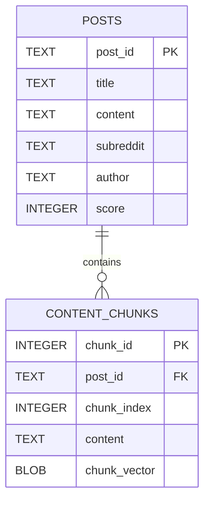
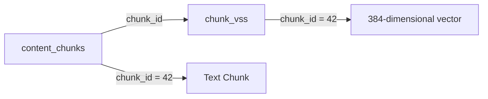
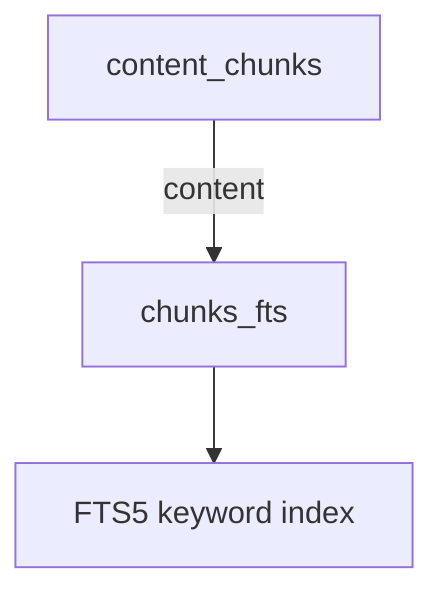
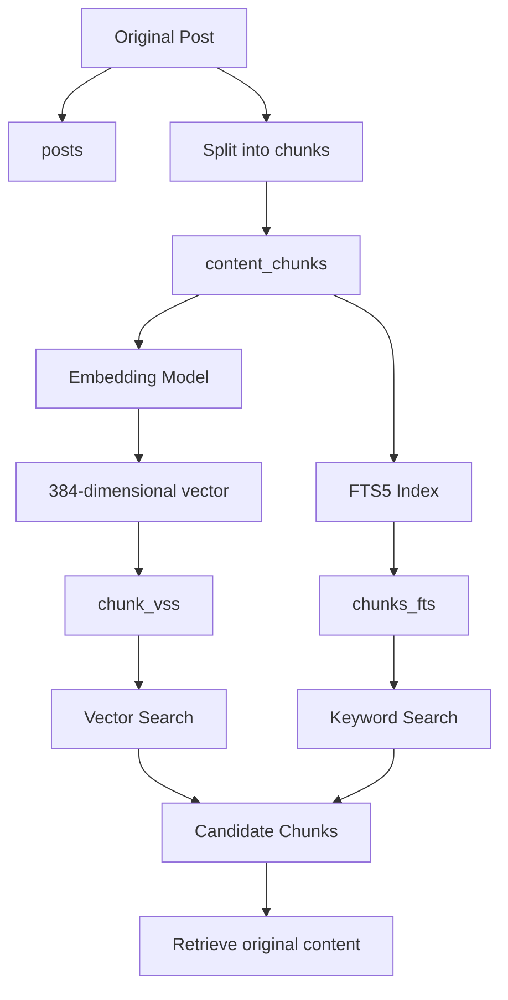
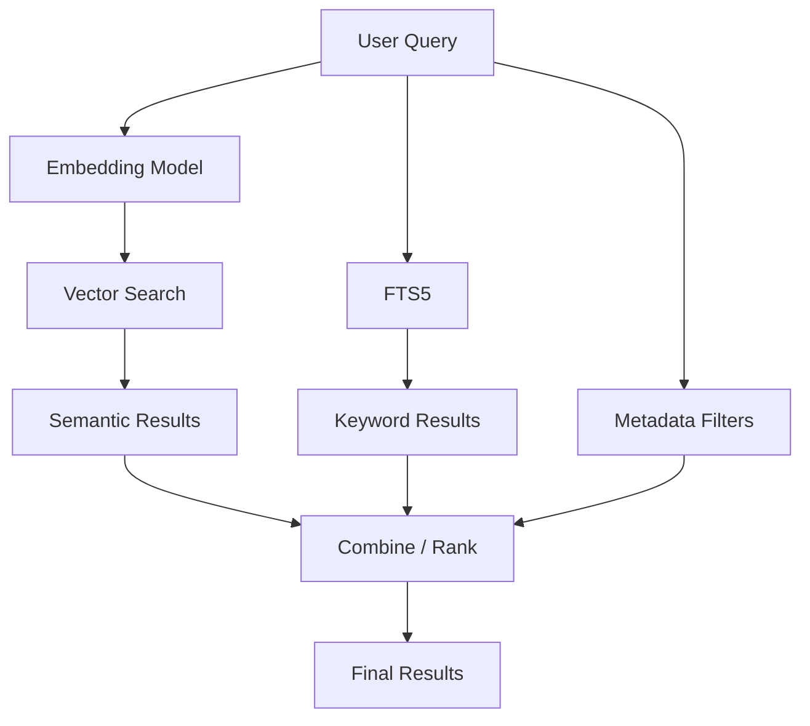
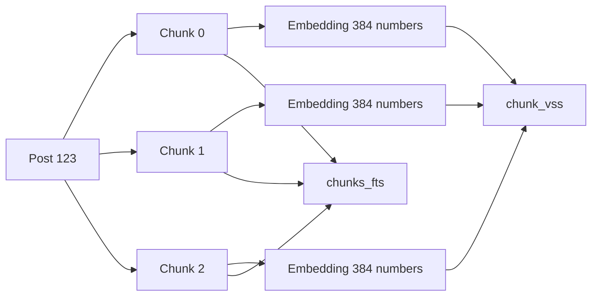

1. `posts` → store original Reddit-like posts
    
2. `content_chunks` → store smaller piece of each post + their embeddings
    
3. `chunk_vss` → enable **vector similarity search**
    
4. `chunks_fts` → enable **keyword/full-text search**

---

# `posts` table

```sql
CREATE TABLE posts (
    post_id TEXT PRIMARY KEY,
    title TEXT,
    content TEXT,
    subreddit TEXT,
    author TEXT,
    score INTEGER
);
```




One post can have **many chunks**.

---

```sql
CREATE TABLE posts
```

> Create table `posts`.

---

Everything between:

```sql
(
...
)
```

describes table columns.

---

```sql
post_id TEXT PRIMARY KEY,
```

>define column `post_id`

|post_id|
|---|
|abc123|
|xyz789|
|post001|

---


```sql
post_id TEXT
```

>column store text.


```text
"abc123"
"reddit_001"
"post_xyz"
```

---

### `PRIMARY KEY`

```sql
post_id TEXT PRIMARY KEY
```

> `post_id` unique for each post.

|post_id|title|
|---|---|
|`abc123`|Python question|
|`xyz789`|ML question|

can't have:

```text
abc123
abc123
```

for two different rows.

---

```sql
title TEXT,
```

Store post title.

```text
"How does FAISS work?"
```

---

```sql
content TEXT,
```

Store post content.


```text
"I am learning vector databases.
How does similarity search work?"
```

---

```sql
subreddit TEXT,
```

Store subreddit.

```text
"MachineLearning"
"Python"
"datascience"
```

---

```sql
author TEXT,
```

Store author's name.

```text
"john123"
"alice"
"bob"
```

---

```sql
score INTEGER
```

```text
125
42
-3
1000
```

---

```sql
);
```

>`)` end column definition.

`;` 

>  SQL statement is finished.


```sql
CREATE TABLE posts (
    ...
);
```

> Create table `posts` with these columns.

---

```sql
CREATE TABLE content_chunks (
    chunk_id INTEGER PRIMARY KEY,
    post_id TEXT,
    chunk_index INTEGER,
    content TEXT,
    chunk_vector BLOB,
    FOREIGN KEY (post_id) REFERENCES posts(post_id)
);
```

> This table break large posts into smaller pieces.

> Because embedding huge document as one vector isn't ideal.

Instead:

```text
Post
 │
 ├── Chunk 0
 ├── Chunk 1
 ├── Chunk 2
 └── Chunk 3
```

Each chunk gets its own embedding.

---

```sql
chunk_id INTEGER PRIMARY KEY,
```

Each chunk gets unique integer ID.

|chunk_id|
|--:|
|1|
|2|
|3|
|4|

```sql
PRIMARY KEY
```

each ID must be unique.

---

```sql
post_id TEXT,
```

|chunk_id|post_id|
|--:|---|
|1|abc123|
|2|abc123|
|3|abc123|
|4|xyz789|

So:

```text
abc123
 ├── chunk 1
 ├── chunk 2
 └── chunk 3

xyz789
 └── chunk 4
```

---

```sql
chunk_index INTEGER,
```

|chunk_id|post_id|chunk_index|
|--:|---|--:|
|1|abc123|0|
|2|abc123|1|
|3|abc123|2|


```text
Post abc123

chunk 0
   ↓
"The first part..."

chunk 1
   ↓
"The second part..."

chunk 2
   ↓
"The third part..."
```

This lets you reconstruct original order.

---

```sql
content TEXT,
```

```text
chunk 0:
"FAISS is a library for similarity search."

chunk 1:
"FAISS can search millions of vectors."

chunk 2:
"IVF and PQ can make search faster."
```

---

```sql
chunk_vector BLOB,
```

```text
[0.12, -0.42, 0.73, 0.08, ...]
```

Because SQLite doesn't have native pgvector-style vector type here, vector is stored as:

```text
BLOB
```

---

## `BLOB`

> Binary Large Object

store raw binary data.

```text
Python list
    ↓
[0.12, -0.42, 0.73, ...]
    ↓
NumPy array
    ↓
bytes
    ↓
SQLite BLOB
```

---

```sql
FOREIGN KEY (post_id)
```

> `content_chunks.post_id` is connected to another table.

```sql
FOREIGN KEY (post_id)
REFERENCES posts(post_id)
```

```text
content_chunks.post_id
        │
        │ references
        ↓
posts.post_id
```

So you have relation between tables.

---

```sql
CREATE VIRTUAL TABLE chunk_vss USING vss0(
    chunk_vector(384),
    chunk_id INTEGER
);
```

 creates **vector search table**.

---

# 20. `VIRTUAL TABLE`

```sql
CREATE VIRTUAL TABLE
```

virtual table is different from normal SQLite table.

```text
SQLite
   │
   └── VSS extension
          │
          └── vector search
```

---

```sql
chunk_vss
```

name of virtual table.

---

```text
CREATE VIRTUAL TABLE
        │
        ↓
   chunk_vss
        │
        ↓
     USING
        │
        ↓
      vss0
        │
        ↓
Vector Similarity Search
```

---

```sql
chunk_vector(384)
```

> Store vectors with 384 dimension.

---

```sql
chunk_id INTEGER
```

This connet vector-search record to  actual chunk.

```text
Vector Search Table

chunk_id → vector
```

```text
content_chunks

chunk_id → text
```



same `chunk_id` connect text and vector.

---

```sql
CREATE VIRTUAL TABLE chunks_fts USING fts5(
    content,
    content='content_chunks',
    content_rowid='chunk_id'
);
```

FTS5

> Full-Text Search 5

>SQLite's full-text-search system.

---

```sql
chunks_fts
```

name of  FTS table designed for searches like:

```text
machine learning
neural network
python
FAISS
vector database
```

---

```sql
content,
```

tell FTS5 that searchable column is:

```text
content
```

```text
"FAISS is useful for vector similarity search."
```

FTS5 can index words:

```text
FAISS
useful
vector
similarity
search
```

---

```sql
content='content_chunks'
```

> actual text lives in `content_chunks` table.

So `chunks_fts` is essentially an **index over another table**.



Instead of thinking:

```text
chunks_fts = another copy of all text
```

think:

```text
content_chunks
      │
      │ source data
      ↓
   chunks_fts
      │
      ↓
 search index
```

---

```sql
content_rowid='chunk_id'
```

> row identifier in `content_chunks` is `chunk_id`.
> 

```text
content_chunks

chunk_id = 42
content = "FAISS performs vector search"
```

FTS5 can return:

```text
chunk_id = 42
```

then retrieve actual chunk.

---

# Entire architecture



**two search engines over same chunks**.

---

# Hybrid search



So you can combine:

### 1. Semantic similarity

```text
"What is machine learning?"
```

Finds text with similar meaning.

### 2. Keyword search

```text
"machine learning"
```

Finds exact/relevant words.

### 3. Metadata filtering

```sql
WHERE subreddit = 'MachineLearning'
AND score > 100
```

---

# tables are connected like this:

```text
posts
  │
  │ post_id
  ↓
content_chunks
  │
  ├──────────────→ chunk_vss
  │                  │
  │                  └── vector
  │
  └──────────────→ chunks_fts
                     │
                     └── keyword index
```

Example:

```text
POST
post_id = "abc123"
       │
       ├── chunk_id = 1
       │      ├── text
       │      ├── vector
       │      └── FTS index
       │
       ├── chunk_id = 2
       │      ├── text
       │      ├── vector
       │      └── FTS index
       │
       └── chunk_id = 3
              ├── text
              ├── vector
              └── FTS index
```

---

# Why split into chunks?

Instead of:

```text
10,000 words
      ↓
   1 vector
```

you :

```text
10,000 words
      ↓
split
      ↓
┌────────────┐
│ chunk 0    │
├────────────┤
│ chunk 1    │
├────────────┤
│ chunk 2    │
├────────────┤
│ ...        │
├────────────┤
│ chunk 99   │
└────────────┘
      ↓
each chunk → embedding
```

query can find **specific relevant section**, rather than retrieving entire post.

---

# Complete data flow

Suppose you have this post:

```text
post_id: 123

title:
"How neural networks learn"

content:
"Neural networks use layers...
Backpropagation calculates gradients...
Gradient descent updates weights..."
```

You split it:

```text
chunk 0:
"Neural networks use layers..."

chunk 1:
"Backpropagation calculates gradients..."

chunk 2:
"Gradient descent updates weights..."
```




Now your system can search both **meaning** and **words**.

---

|Component|Purpose|Example|
|---|---|---|
|`posts`|Original post|title, author, score|
|`content_chunks`|Small text piece|chunk text + vector|
|`chunk_vss`|Vector similarity search|"similar meaning"|
|`chunks_fts`|Full-text search|matching words|


```text
content_chunks
      ↓
actual data

chunk_vss
      ↓
vector search

chunks_fts
      ↓
keyword search
```