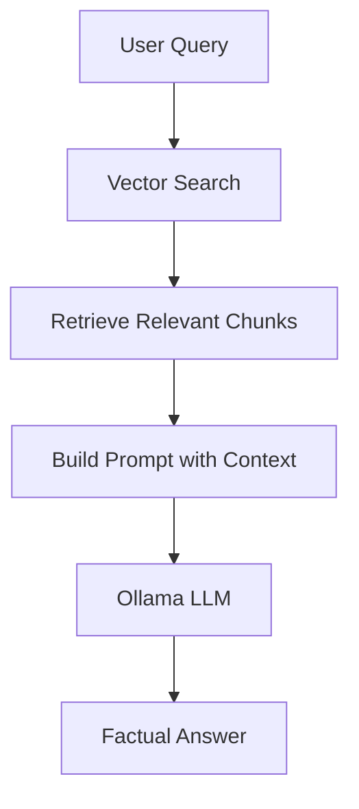
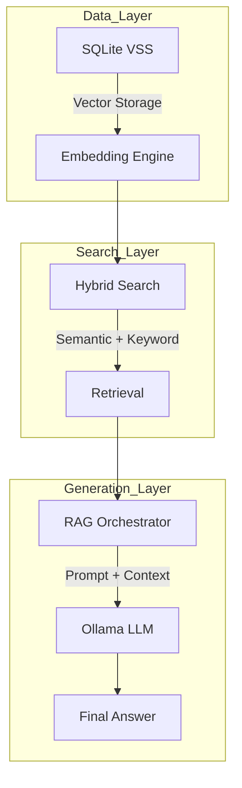
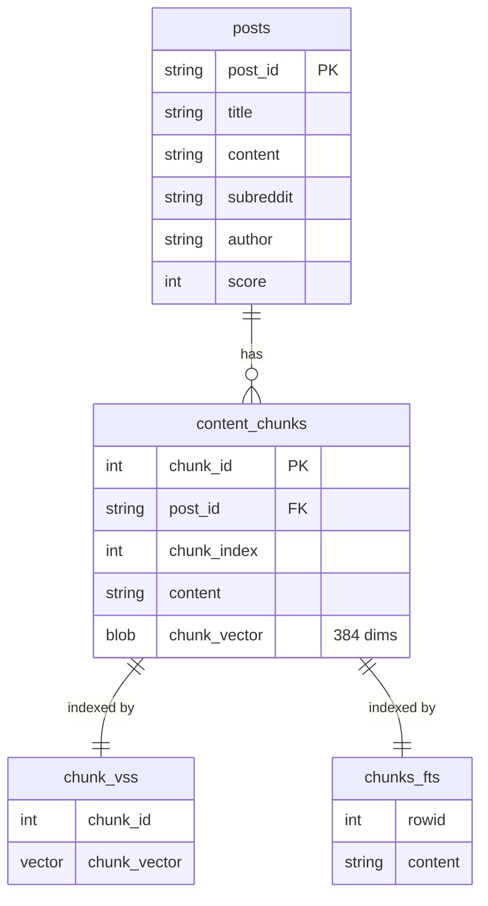
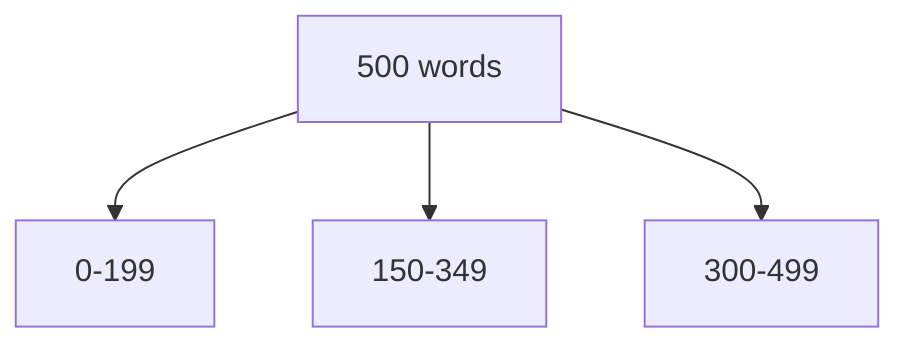
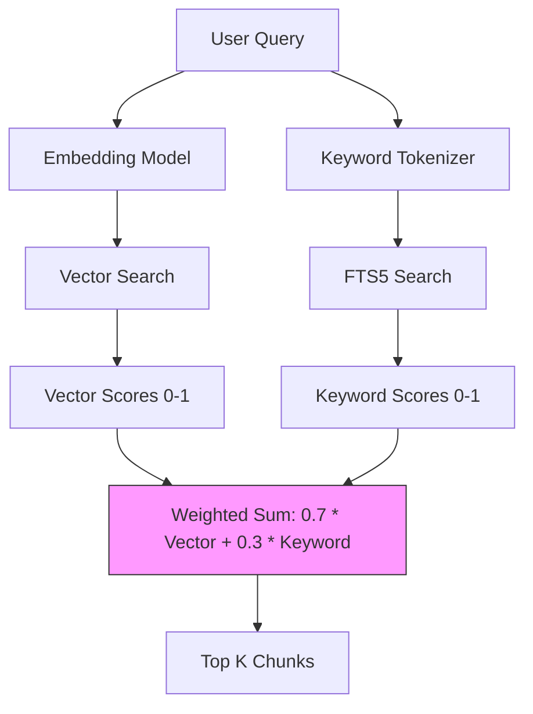
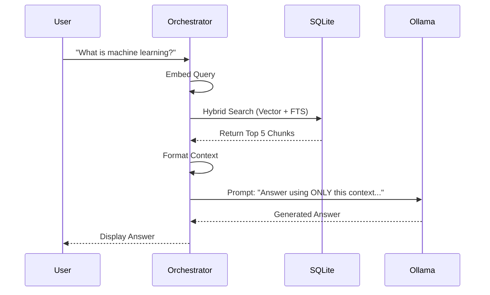
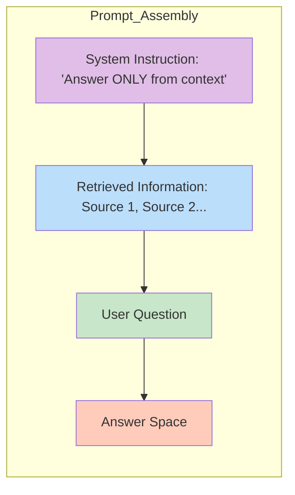

# Building Local RAG System with SQLite VSS & Ollama

>**(RAG)** system that run entirely on local machine. 

>**SQLite VSS** for vector search engine 

>**Ollama** as  local LLM "brain." 



---

## System Architecture



---
1.  **Vector Database (SQLite VSS):** Store text chunks and their embeddings.
2.  **Embedding Engine (SentenceTransformers):** Convert text to 384-dimensional vectors.
3.  **Hybrid Search:** Combine vector similarity with keyword search (FTS5).
4.  **LLM Integration (Ollama):** Local inference for generating answers.
5.  **Orchestrator:** Coordinate retrieval and generation.

---

## Database Schema: Two-Table Pattern

One table store raw content and virtual table store vectors.




### SQL Setup:
```sql
-- Main content table
CREATE TABLE posts (
    post_id TEXT PRIMARY KEY,
    title TEXT,
    content TEXT,
    subreddit TEXT,
    author TEXT,
    score INTEGER
);

-- Chunks table with vector BLOB
CREATE TABLE content_chunks (
    chunk_id INTEGER PRIMARY KEY,
    post_id TEXT,
    chunk_index INTEGER,
    content TEXT,
    chunk_vector BLOB,
    FOREIGN KEY (post_id) REFERENCES posts(post_id)
);

-- Virtual table for Vector Search (VSS)
CREATE VIRTUAL TABLE chunk_vss USING vss0(
    chunk_vector(384),
    chunk_id INTEGER
);

-- Virtual table for Keyword Search (FTS5)
CREATE VIRTUAL TABLE chunks_fts USING fts5(
    content,
    content='content_chunks',
    content_rowid='chunk_id'
);
```

---

## Text Chunking

LLM have limited context window. We must break large documents into smaller **chunks**. 

Use sliding window with **overlap**. This ensures that important information isn't cut in half at boundary.



*   **Chunk Size:** 200 words.
*   **Overlap:** 50 words.
*   **Why?** end of Chunk 1 and start of Chunk 2, overlap ensures it appears in both.

---

## Hybrid Search

**Semantic Search** with **Keyword Search** (FTS5).

### The Algorithm:
1.  **Semantic Search:** Find chunks with similar meaning.
2.  **Keyword Search:** Find chunks with exact word match.
3.  **Normalize:** Scale scores to 0-1 range.
4.  **Fuse:** Combine scores using weighted average (e.g., 70% Semantic, 30% Keyword).



### Why 70/30?
*   **70% Semantic:** Capture *intent* and *meaning*.
*   **30% Keyword:** Ensure specific technical terms aren't missed.
*   *Tip:* If your search is too vague, increase keyword weight.

---

## RAG Pipeline



### Prompt Structure
>carefully crafted to prevent hallucination.



**Example Prompt:**
```
You are a helpful assistant. Answer the user's question using ONLY the retrieved information below.
1. If the information is not in the context, state that you do not know.
2. Do not use outside knowledge.

USER QUESTION:
What is machine learning?

ANSWER:
```

---