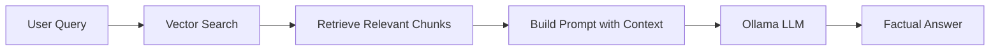
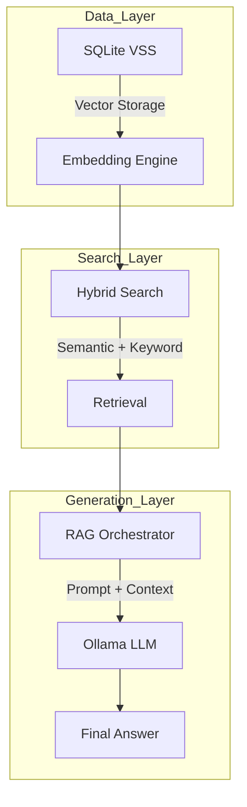
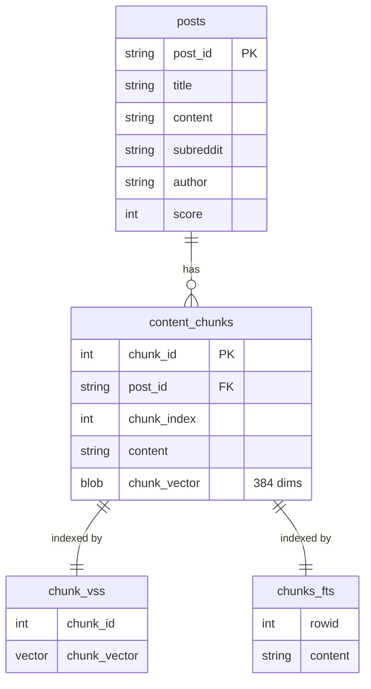
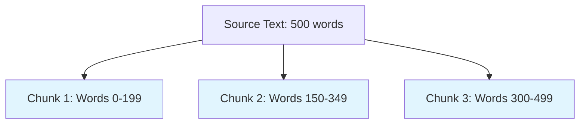
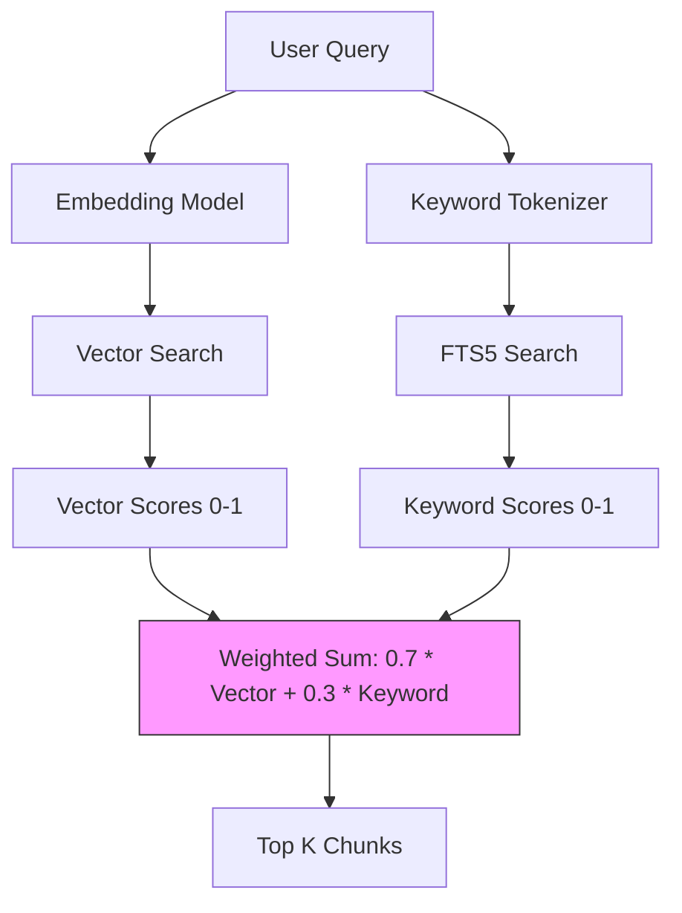
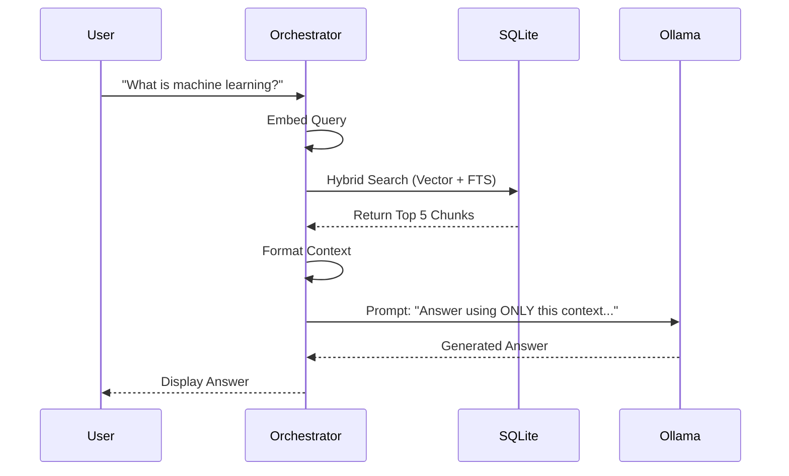

Here is a comprehensive note in Markdown format, designed to be saved directly into Obsidian. It explains the core concepts of building a Retrieval-Augmented Generation (RAG) system using SQLite VSS and Ollama, using simple language, Mermaid diagrams, and SVG graphics.

---

# Building a Local RAG System with SQLite VSS & Ollama

This note explains how to build a **Retrieval-Augmented Generation (RAG)** system that runs entirely on your local machine. We use **SQLite VSS** for the vector search engine and **Ollama** as the local LLM "brain."

## 1. The Big Idea: Why RAG?

LLMs (like Llama 3) are frozen in time. They don't know about your private files or recent events. RAG solves this by giving the LLM a "cheat sheet" of relevant information retrieved from your database before it answers.

**The Flow:** 
1. **Retrieve:** Find relevant chunks of text from your database.
2. **Augment:** Combine the user's question with the retrieved text.
3. **Generate:** The LLM reads the context and writes a factual answer.



---

## 2. System Architecture: The Five Pillars

Our RAG system consists of five main components working in concert.



### Key Components:
1.  **Vector Database (SQLite VSS):** Stores text chunks and their embeddings.
2.  **Embedding Engine (SentenceTransformers):** Converts text to 384-dimensional vectors.
3.  **Hybrid Search:** Combines vector similarity with keyword search (FTS5).
4.  **LLM Integration (Ollama):** Local inference for generating answers.
5.  **Orchestrator:** Coordinates retrieval and generation.

---

## 3. Database Schema: The Two-Table Pattern

We use a **two-table pattern** in SQLite. One table stores the raw content, and a virtual table stores the vectors.

**Critical Rule:** Use `INSERT OR REPLACE` carefully. It deletes the old row and creates a new one, which can break the VSS index if not handled properly. Always ensure the `rowid` is preserved.



### SQL Setup:
```sql
-- Main content table
CREATE TABLE posts (
    post_id TEXT PRIMARY KEY,
    title TEXT,
    content TEXT,
    subreddit TEXT,
    author TEXT,
    score INTEGER
);

-- Chunks table with vector BLOB
CREATE TABLE content_chunks (
    chunk_id INTEGER PRIMARY KEY,
    post_id TEXT,
    chunk_index INTEGER,
    content TEXT,
    chunk_vector BLOB,
    FOREIGN KEY (post_id) REFERENCES posts(post_id)
);

-- Virtual table for Vector Search (VSS)
CREATE VIRTUAL TABLE chunk_vss USING vss0(
    chunk_vector(384),
    chunk_id INTEGER
);

-- Virtual table for Keyword Search (FTS5)
CREATE VIRTUAL TABLE chunks_fts USING fts5(
    content,
    content='content_chunks',
    content_rowid='chunk_id'
);
```

---

## 4. Text Chunking: The Art of Slicing

LLMs have a limited context window. We must break large documents into smaller **chunks**. 

**Strategy:** Use a sliding window with **overlap**. This ensures that important information isn't cut in half at the boundary.



*   **Chunk Size:** 200 words.
*   **Overlap:** 50 words.
*   **Why?** If a key sentence spans the end of Chunk 1 and the start of Chunk 2, the overlap ensures it appears in both.

---

## 5. Hybrid Search: The Best of Both Worlds

Relying only on vector search can miss exact keyword matches (like a specific error code or name). We combine **Semantic Search** (VSS) with **Keyword Search** (FTS5).

### The Algorithm:
1.  **Semantic Search:** Find chunks with similar meaning.
2.  **Keyword Search:** Find chunks with exact word matches.
3.  **Normalize:** Scale scores to a 0-1 range.
4.  **Fuse:** Combine scores using a weighted average (e.g., 70% Semantic, 30% Keyword).



### Why 70/30?
*   **70% Semantic:** Captures the *intent* and *meaning*.
*   **30% Keyword:** Ensures specific technical terms aren't missed.
*   *Tip:* If your search is too vague, increase the keyword weight.

---

## 6. The RAG Pipeline: Orchestrating the Answer

This is where everything comes together. The pipeline takes a question, retrieves context, and asks the LLM to answer.



### The Prompt Structure:
The prompt is carefully crafted to prevent hallucinations (making things up).

```mermaid
graph TD
    subgraph Prompt_Assembly
    A[System Instruction: "Answer ONLY from context"] --> B[Retrieved Information: Source 1, Source 2...]
    B --> C[User Question]
    C --> D[Answer Space]
    end
    style A fill:#e1bee7
    style B fill:#bbdefb
    style C fill:#c8e6c9
    style D fill:#ffccbc
```

**Example Prompt:**
```
You are a helpful assistant. Answer the user's question using ONLY the retrieved information below.
1. If the information is not in the context, state that you do not know.
2. Do not use outside knowledge.
3. For every claim you make, you MUST cite the source number (e.g., [Source 1]).

RETRIEVED INFORMATION:
SOURCE 1: From r/explainlikeimfive... Machine learning is like teaching a computer...
SOURCE 2: From r/learnpython... NumPy is for numerical computing...

USER QUESTION:
What is machine learning?

ANSWER:
```

---

## 7. Visualizing the Vector Space

Here is a visual representation of how text chunks are clustered in vector space.

<svg width="500" height="350" xmlns="http://www.w3.org/2000/svg">
  <!-- Background Grid -->
  <defs>
    <pattern id="grid" width="30" height="30" patternUnits="userSpaceOnUse">
      <path d="M 30 0 L 0 0 0 30" fill="none" stroke="#e0e0e0" stroke-width="1"/>
    </pattern>
  </defs>
  <rect width="100%" height="100%" fill="url(#grid)" />

  <!-- Axes -->
  <line x1="50" y1="300" x2="450" y2="300" stroke="#333" stroke-width="2" />
  <line x1="50" y1="300" x2="50" y2="50" stroke="#333" stroke-width="2" />
  <text x="460" y="315" font-family="Arial" font-size="14" fill="#333">Dimension 1</text>
  <text x="10" y="40" font-family="Arial" font-size="14" fill="#333">Dimension 2</text>

  <!-- Query Vector -->
  <circle cx="250" cy="150" r="8" fill="#FF5722" />
  <text x="260" y="145" font-family="Arial" font-size="14" font-weight="bold" fill="#FF5722">Query: "machine learning"</text>

  <!-- Cluster 1: Close Matches -->
  <circle cx="230" cy="170" r="6" fill="#4CAF50" />
  <circle cx="270" cy="130" r="6" fill="#4CAF50" />
  <circle cx="240" cy="140" r="6" fill="#4CAF50" />
  <text x="280" y="125" font-family="Arial" font-size="12" fill="#4CAF50">Close Matches</text>

  <!-- Cluster 2: Distant Chunks -->
  <circle cx="100" cy="80" r="6" fill="#9E9E9E" />
  <circle cx="120" cy="100" r="6" fill="#9E9E9E" />
  <circle cx="80" cy="110" r="6" fill="#9E9E9E" />
  <text x="130" y="95" font-family="Arial" font-size="12" fill="#9E9E9E">Distant Chunks</text>

  <!-- Distance Line -->
  <line x1="250" y1="150" x2="230" y2="170" stroke="#FF5722" stroke-width="1" stroke-dasharray="4" />
  <text x="200" y="175" font-family="Arial" font-size="10" fill="#FF5722">L2 Distance</text>
</svg>

*   **Red Dot:** Your search query.
*   **Green Dots:** Text chunks that are semantically similar (Close Matches).
*   **Grey Dots:** Unrelated chunks (Distant Chunks).

---

## 8. Summary Checklist

- [x] **Database:** SQLite with VSS and FTS5 extensions.
- [x] **Schema:** `posts` + `content_chunks` + `chunk_vss` + `chunks_fts`.
- [x] **Chunking:** 200 words with 50-word overlap.
- [x] **Embedding:** `all-MiniLM-L6-v2` (384 dimensions).
- [x] **Search:** Hybrid (70% Semantic + 30% Keyword).
- [x] **LLM:** Ollama (Llama 3.1:8b) with low temperature (0.1).
- [x] **Prompt:** Strict instructions to use ONLY retrieved context.

This architecture provides a private, local, and factual question-answering system. By grounding the LLM in retrieved data, we minimize hallucinations and ensure the answers are based on your actual documents.