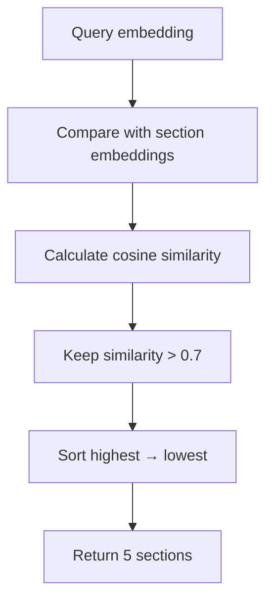
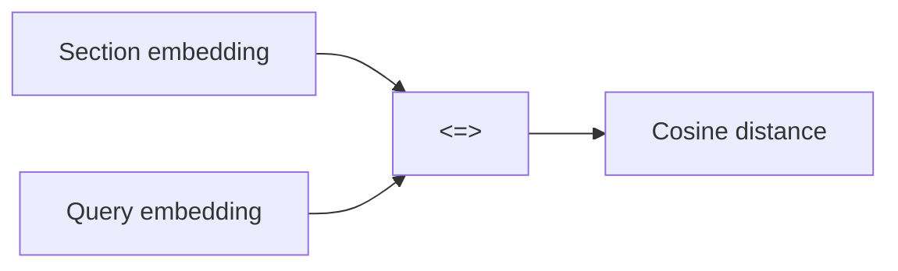
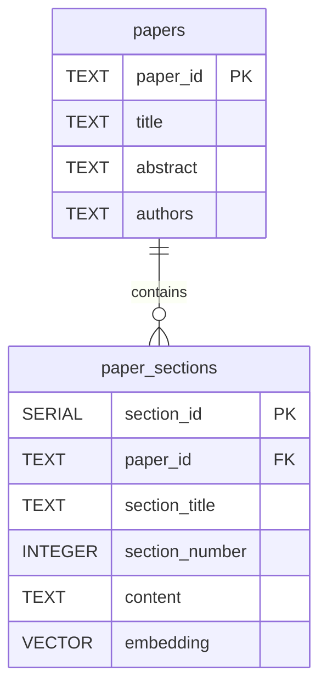
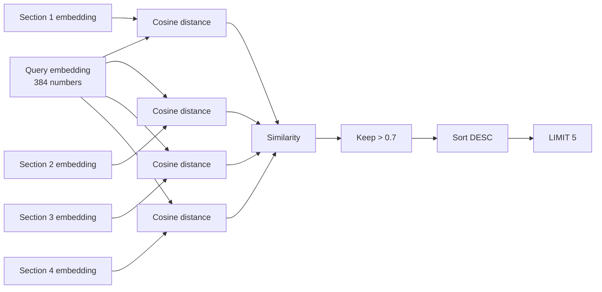

```sql
SELECT
    ps.paper_id,
    p.title,
    ps.section_number,
    ps.content,
    1 - (ps.embedding <=> %s::vector) as similarity
FROM paper_sections ps
JOIN papers p ON ps.paper_id = p.paper_id
WHERE 1 - (ps.embedding <=> %s::vector) > 0.7
ORDER BY similarity DESC
LIMIT 5;
```




---

```sql
SELECT title
FROM papers;
```

> Give me `title` from `papers`.

---

```sql
ps.paper_id
```

> `paper_id` column from `paper_sections`.

---

```sql
p.title
```

> `title` column from `papers`.

---

```sql
ps.section_number
```

> Get section number from `paper_sections`.

```text
1 → Introduction
2 → Methodology
3 → Results
4 → Discussion
```

---

```sql
ps.content
```

> Get actual text of section.

```text
"Machine learning is a field of artificial intelligence..."
```

---

```sql
1 - (ps.embedding <=> %s::vector) AS similarity
```

calculates similarity between:

```text
stored section embedding
        ↓
ps.embedding

        and

search/query embedding
        ↓
%s::vector
```

---

# `ps.embedding`

```text
"Deep learning uses neural networks"
```

```text
[0.12, -0.45, 0.78, ...]
```

---

# `<=>` 

```sql
ps.embedding <=> query_embedding
```

> Calculate **cosine distance** between two vectors.

```text
<=> = cosine distance
```

It is **not directly cosine similarity**.




---

# Why `1 - distance`?

```sql
1 - (ps.embedding <=> %s::vector)
```

Because pgvector gives you:

```text
cosine distance
```

but you want:

```text
cosine similarity
```


```text
similarity = 1 - cosine_distance
```

```sql
1 - (ps.embedding <=> query)
```

produce similarity-like score.

```text
cosine distance = 0.1

1 - 0.1
= 0.9
```

```text
similarity = 0.9
```

---

```sql
%s
```

i**placeholder**.

```python
query = """
SELECT ...
WHERE ...
"""

cursor.execute(query, (query_embedding,))
```

Python replace `%s` with actual vector value.

```sql
%s
```

becomes:

```text
[0.12, -0.45, 0.78, ...]
```

```sql
ps.embedding <=> %s
```

> Compare stored section embedding against user's query embedding.

---

# `::vector`


```sql
%s::vector
```


> Treat value `%s` as PostgreSQL `vector`.


```sql
value::type
```

 PostgreSQL's type-casting syntax.


```sql
'123'::INTEGER
```

```text
"123" → INTEGER
```

And:

```sql
%s::vector
```

```text
%s → vector
```

Because your column is:

```sql
embedding vector(384)
```

database needs to know query value is also a vector.

---

```sql
AS similarity
```

`AS` gives result a name.

Without it:

```sql
1 - (ps.embedding <=> %s::vector)
```

would be an unnamed calculated column.

With:

```sql
AS similarity
```

you get:

```text
similarity
-----------
0.91
0.87
0.82
```

---

```sql
FROM paper_sections ps
```

---

```sql
JOIN papers p
```

`JOIN` combines rows from two tables.

You have:

```text
papers
```

and:

```text
paper_sections
```

The relationship is:



section contains:

```text
paper_id
```

which tells us which paper it belongs to.

---


# `ON`

```sql
ON ps.paper_id = p.paper_id
```

`ON` tells PostgreSQL:

> **How should two tables be connected?**

### `papers`

|paper_id|title|
|---|---|
|P001|Neural Networks|
|P002|Transformers|

### `paper_sections`

|paper_id|section_number|content|
|---|--:|---|
|P001|1|Introduction...|
|P001|2|Methodology...|
|P002|1|Introduction...|

When joined:

```text
P001 → Neural Networks → Introduction
P001 → Neural Networks → Methodology
P002 → Transformers → Introduction
```

---

```sql
WHERE 1 - (ps.embedding <=> %s::vector) > 0.7
```

> Only keep sections whose similarity is greater than `0.7`.

---

```text
> 0.9
```

→ strict

Lower threshold:

```text
> 0.5
```

→ more results

---

```sql
ORDER BY similarity
```


> Sort results according to `similarity`.

---

```sql
DESC
```

> Descending order.

```text
0.95
0.91
0.88
0.82
0.75
```

---

```sql
LIMIT 5
```

> Return 5 rows.

---

```sql
SELECT
    ps.paper_id,
    p.title,
    ps.section_number,
    ps.content,
    1 - (ps.embedding <=> %s::vector) AS similarity
```

> Give me paper ID, paper title, section number, section content, and calculate  similarity between this section's embedding and my query embedding.

```sql
FROM paper_sections ps
```

```sql
JOIN papers p ON ps.paper_id = p.paper_id
```

> Connect each section to its paper using `paper_id`, so I can get paper title.


```sql
WHERE 1 - (ps.embedding <=> %s::vector) > 0.7
```

```sql
ORDER BY similarity DESC
```

```sql
LIMIT 5;
```

---

# Complete mental picture

```text
                    PostgreSQL
                        │
             ┌──────────┴──────────┐
             │                     │
          papers             paper_sections
             │                     │
             │                     ├── Introduction
             │                     ├── Methodology
             │                     ├── Results
             │                     └── Discussion
             │
             └──── paper_id ───────┘
```

```text
"How are transformers trained?"
```

```text
query embedding
[0.12, -0.45, 0.78, ... 384 numbers ...]
```

PostgreSQL compares it against every section:



For example:

|Section|Cosine distance|`1 - distance`|?|
|---|--:|--:|---|
|Introduction|0.08|0.92|✅|
|Methodology|0.15|0.85|✅|
|Results|0.23|0.77|✅|
|Discussion|0.38|0.62|❌|
|Conclusion|0.12|0.88|✅|

database return:

```text
0.92
0.88
0.85
0.77
```

---

```python
section_headers = [
    'introduction',
    'abstract',
    'methodology',
    'results',
    'discussion',
    'conclusion'
]
```

could help your program recognize:

```text
## Introduction
        ↓
section_title = "introduction"

## Methodology
        ↓
section_title = "methodology"

## Results
        ↓
section_title = "results"
```

Then extracted section can be stored in:

```sql
paper_sections
```

