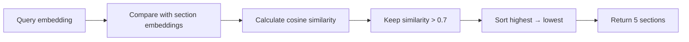
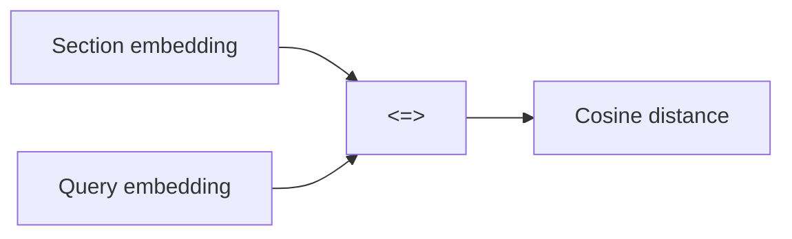
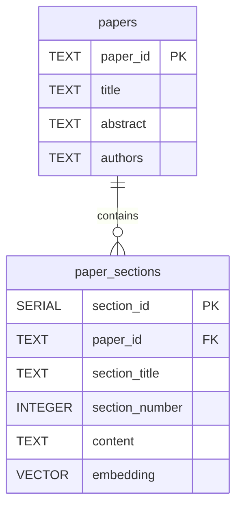
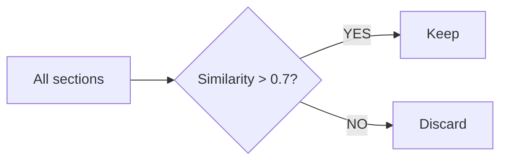
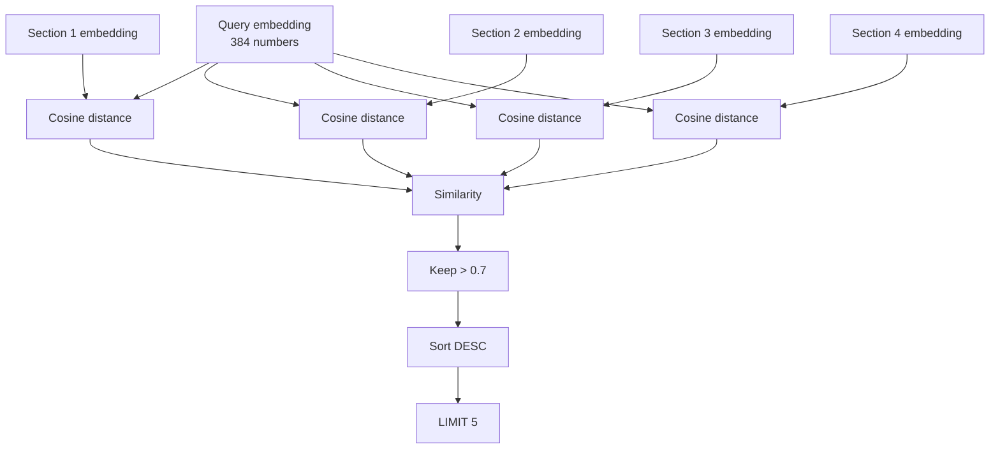

Absolutely. Let’s break this SQL **word by word**, especially the important PostgreSQL/pgvector parts.

Your query is:

```sql
SELECT
    ps.paper_id,
    p.title,
    ps.section_number,
    ps.content,
    1 - (ps.embedding <=> %s::vector) as similarity
FROM paper_sections ps
JOIN papers p ON ps.paper_id = p.paper_id
WHERE 1 - (ps.embedding <=> %s::vector) > 0.7
ORDER BY similarity DESC
LIMIT 5;
```

## 1. First understand what the query is doing

In simple English:

> **Take paper sections, compare their embeddings with my search embedding, calculate similarity, keep only sections with similarity greater than 0.7, sort them from most similar to least similar, and return the top 5.**

The overall flow is:



---

# 2. `SELECT`

```sql
SELECT
```

`SELECT` means:

> **I want to retrieve these columns/data.**

Think:

```text
SELECT = "Give me..."
```

For example:

```sql
SELECT title
FROM papers;
```

means:

> Give me the `title` from `papers`.

---

# 3. `ps.paper_id`

```sql
ps.paper_id
```

There are two parts:

```text
ps       .       paper_id
│                │
│                └── column
└────────────────── table alias
```

`paper_id` is a column from `paper_sections`.

Remember:

```sql
FROM paper_sections ps
```

This gives `paper_sections` the short name:

```text
ps
```

So:

```sql
ps.paper_id
```

means:

> `paper_id` column from `paper_sections`.

---

# 4. `p.title`

```sql
p.title
```

Here:

```text
p
```

is an alias for the `papers` table.

Because later we have:

```sql
JOIN papers p
```

So:

```sql
p.title
```

means:

> `title` column from `papers`.

---

# 5. `ps.section_number`

```sql
ps.section_number
```

Means:

> Get the section number from `paper_sections`.

For example:

```text
1 → Introduction
2 → Methodology
3 → Results
4 → Discussion
```

---

# 6. `ps.content`

```sql
ps.content
```

Means:

> Get the actual text of the section.

For example:

```text
"Machine learning is a field of artificial intelligence..."
```

---

# 7. The most important part

```sql
1 - (ps.embedding <=> %s::vector) AS similarity
```

This calculates the similarity between:

```text
stored section embedding
        ↓
ps.embedding

        and

search/query embedding
        ↓
%s::vector
```

Let's break it apart.

---

# 8. `ps.embedding`

Your table contains:

```sql
embedding vector(384)
```

So each section has a vector containing **384 numbers**.

Example:

```text
[0.12, -0.45, 0.78, ... 384 numbers ...]
```

This vector represents the meaning of the text.

For example:

```text
"Deep learning uses neural networks"
```

might become:

```text
[0.12, -0.45, 0.78, ...]
```

---

# 9. `<=>`

This is a **pgvector operator**.

```sql
ps.embedding <=> query_embedding
```

means:

> Calculate **cosine distance** between the two vectors.

Important:

```text
<=> = cosine distance
```

It is **not directly cosine similarity**.

Conceptually:



---

# 10. Why `1 - distance`?

Your query says:

```sql
1 - (ps.embedding <=> %s::vector)
```

Because pgvector gives you:

```text
cosine distance
```

but you want:

```text
cosine similarity
```

For normalized vectors, the relationship is:

```text
similarity = 1 - cosine_distance
```

So:

```sql
1 - (ps.embedding <=> query)
```

produces a similarity-like score.

For example:

```text
cosine distance = 0.1

1 - 0.1
= 0.9
```

So:

```text
similarity = 0.9
```

---

# 11. `%s`

This:

```sql
%s
```

is a **placeholder**.

It usually comes from Python.

For example:

```python
query = """
SELECT ...
WHERE ...
"""

cursor.execute(query, (query_embedding,))
```

Python replaces `%s` with the actual vector value.

Imagine:

```sql
%s
```

eventually becomes:

```text
[0.12, -0.45, 0.78, ...]
```

So:

```sql
ps.embedding <=> %s
```

means:

> Compare the stored section embedding against the user's query embedding.

---

# 12. `::vector`

This:

```sql
%s::vector
```

means:

> Treat the value `%s` as a PostgreSQL `vector`.

The syntax:

```sql
value::type
```

is PostgreSQL's type-casting syntax.

Examples:

```sql
'123'::INTEGER
```

means:

```text
"123" → INTEGER
```

And:

```sql
%s::vector
```

means:

```text
%s → vector
```

Because your column is:

```sql
embedding vector(384)
```

the database needs to know that the query value is also a vector.

---

# 13. `AS`

```sql
AS similarity
```

`AS` gives a result a name.

Without it:

```sql
1 - (ps.embedding <=> %s::vector)
```

would be an unnamed calculated column.

With:

```sql
AS similarity
```

you get:

```text
similarity
-----------
0.91
0.87
0.82
```

Think:

```text
AS = "call this result..."
```

---

# 14. `FROM`

```sql
FROM paper_sections ps
```

`FROM` tells PostgreSQL:

> Where should I get the data?

Here:

```text
paper_sections
```

is the table.

And:

```text
ps
```

is its alias.

So:

```sql
FROM paper_sections ps
```

means:

```text
paper_sections → ps
```

Then you can write:

```sql
ps.embedding
ps.content
ps.paper_id
```

instead of:

```sql
paper_sections.embedding
paper_sections.content
paper_sections.paper_id
```

---

# 15. `JOIN`

```sql
JOIN papers p
```

`JOIN` combines rows from two tables.

You have:

```text
papers
```

and:

```text
paper_sections
```

The relationship is:



A section contains:

```text
paper_id
```

which tells us which paper it belongs to.

---

# 16. `papers p`

```sql
papers p
```

Again:

```text
papers = table
p      = alias
```

So:

```sql
p.title
```

means:

> title from papers.

---

# 17. `ON`

```sql
ON ps.paper_id = p.paper_id
```

`ON` tells PostgreSQL:

> **How should these two tables be connected?**

Here:

```sql
ps.paper_id = p.paper_id
```

means:

```text
paper_sections.paper_id
        =
papers.paper_id
```

Example:

### `papers`

|paper_id|title|
|---|---|
|P001|Neural Networks|
|P002|Transformers|

### `paper_sections`

|paper_id|section_number|content|
|---|--:|---|
|P001|1|Introduction...|
|P001|2|Methodology...|
|P002|1|Introduction...|

When joined:

```text
P001 → Neural Networks → Introduction
P001 → Neural Networks → Methodology
P002 → Transformers → Introduction
```

---

# 18. `WHERE`

```sql
WHERE
```

`WHERE` filters rows.

Think:

```text
WHERE = "Only keep rows where..."
```

Your condition is:

```sql
WHERE 1 - (ps.embedding <=> %s::vector) > 0.7
```

So:

> Only keep sections whose similarity is greater than `0.7`.

---

# 19. `>`

```sql
> 0.7
```

`>` means:

> greater than

So:

```text
0.91 > 0.7  → YES
0.82 > 0.7  → YES
0.71 > 0.7  → YES
0.70 > 0.7  → NO
0.65 > 0.7  → NO
```

Therefore:

```text
0.91  ✓
0.82  ✓
0.71  ✓
0.70  ✗
0.65  ✗
```

---

# 20. Why `0.7`?

```sql
> 0.7
```

is your **similarity threshold**.

You are saying:

> I only want reasonably similar sections.

Conceptually:



Higher threshold:

```text
> 0.9
```

→ stricter

Lower threshold:

```text
> 0.5
```

→ more results

---

# 21. `ORDER BY`

```sql
ORDER BY similarity
```

means:

> Sort the results according to `similarity`.

---

# 22. `DESC`

```sql
DESC
```

means:

> Descending order.

So:

```text
0.95
0.91
0.88
0.82
0.75
```

instead of:

```text
0.75
0.82
0.88
0.91
0.95
```

You want the **most similar sections first**.

---

# 23. `LIMIT`

```sql
LIMIT 5
```

means:

> Return at most 5 rows.

So even if there are:

```text
1000 matching sections
```

you only get:

```text
5
```

---

# 24. The entire query in plain English

Let's translate every part:

```sql
SELECT
    ps.paper_id,
    p.title,
    ps.section_number,
    ps.content,
    1 - (ps.embedding <=> %s::vector) AS similarity
```

Means:

> Give me the paper ID, paper title, section number, section content, and calculate the similarity between this section's embedding and my query embedding.

Then:

```sql
FROM paper_sections ps
```

> Get sections from `paper_sections`.

Then:

```sql
JOIN papers p ON ps.paper_id = p.paper_id
```

> Connect each section to its paper using `paper_id`, so I can also get the paper title.

Then:

```sql
WHERE 1 - (ps.embedding <=> %s::vector) > 0.7
```

> Only keep sections whose similarity is greater than 0.7.

Then:

```sql
ORDER BY similarity DESC
```

> Put the most similar sections first.

Then:

```sql
LIMIT 5;
```

> Give me only the first 5.

---

# 25. Complete mental picture

Imagine the database has:

```text
                    PostgreSQL
                        │
             ┌──────────┴──────────┐
             │                     │
          papers             paper_sections
             │                     │
             │                     ├── Introduction
             │                     ├── Methodology
             │                     ├── Results
             │                     └── Discussion
             │
             └──── paper_id ───────┘
```

The user asks something like:

```text
"How are transformers trained?"
```

That becomes an embedding:

```text
query embedding
[0.12, -0.45, 0.78, ... 384 numbers ...]
```

PostgreSQL compares it against every section:



For example:

|Section|Cosine distance|`1 - distance`|Keep?|
|---|--:|--:|---|
|Introduction|0.08|0.92|✅|
|Methodology|0.15|0.85|✅|
|Results|0.23|0.77|✅|
|Discussion|0.38|0.62|❌|
|Conclusion|0.12|0.88|✅|

The database returns:

```text
0.92
0.88
0.85
0.77
```

sorted from highest to lowest.

---

# 26. One important detail about your `section_headers`

You also have:

```python
section_headers = [
    'introduction',
    'abstract',
    'methodology',
    'results',
    'discussion',
    'conclusion'
]
```

This is **Python**, not SQL.

It is simply a list of section names that you probably use while parsing papers.

For example:

```python
section_headers = [
    'introduction',
    'abstract',
    'methodology',
    'results',
    'discussion',
    'conclusion'
]
```

could help your program recognize:

```text
## Introduction
        ↓
section_title = "introduction"

## Methodology
        ↓
section_title = "methodology"

## Results
        ↓
section_title = "results"
```

Then the extracted section can be stored in:

```sql
paper_sections
```

---

## The most important operators to remember

|SQL|Meaning|
|---|---|
|`SELECT`|choose data|
|`FROM`|choose table|
|`JOIN`|combine tables|
|`ON`|specify how tables connect|
|`WHERE`|filter rows|
|`<=>`|pgvector cosine distance|
|`1 - distance`|cosine similarity-like score|
|`::vector`|cast value to vector|
|`AS`|give a name/alias|
|`ORDER BY`|sort|
|`DESC`|highest → lowest|
|`LIMIT 5`|maximum 5 rows|
|`>`|greater than|
|`%s`|parameter placeholder|

### In one sentence:

```text
SELECT → get data
FROM → sections
JOIN → find their papers
WHERE → keep similar sections
ORDER BY → highest similarity first
LIMIT → only 5
```

That is essentially a **semantic search query using pgvector**.