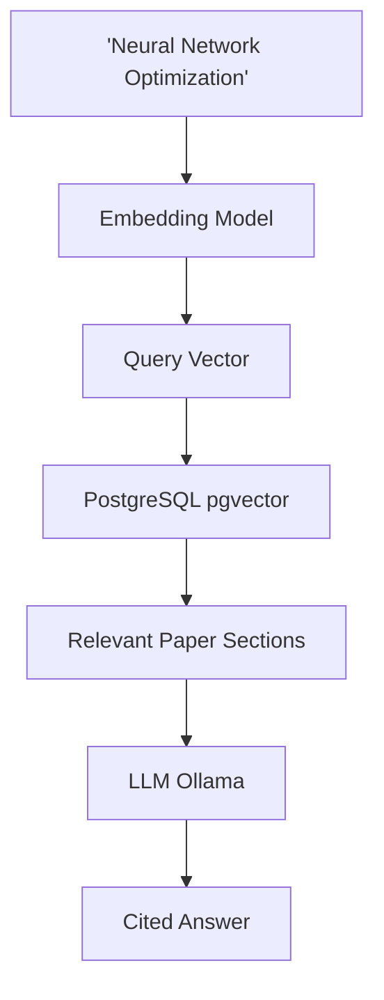
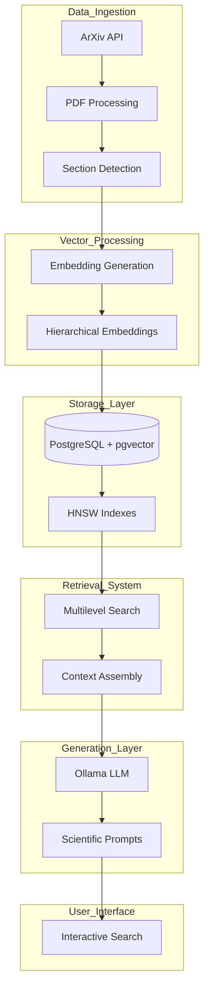
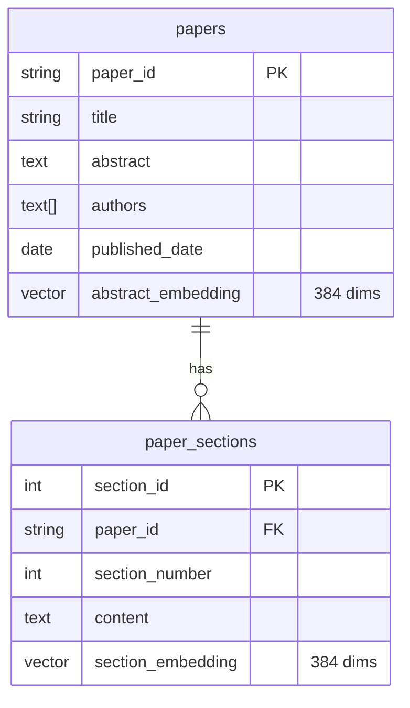
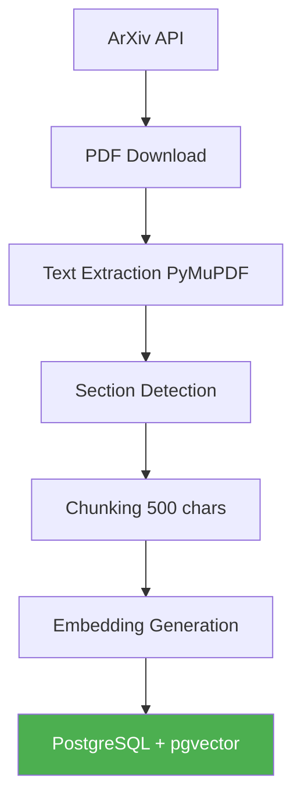
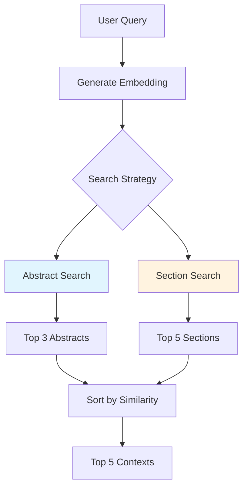
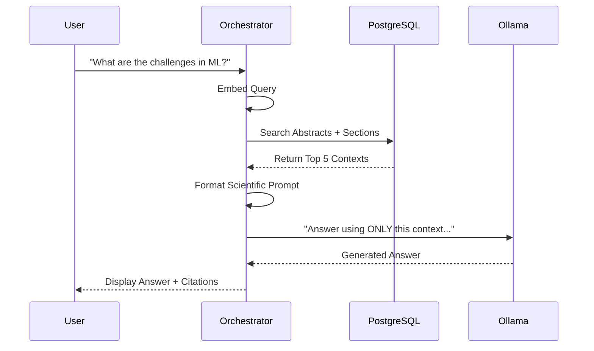

---

## System Architecture



1.  **Data Ingestion:** Fetch papers from ArXiv and extract text using PyMuPDF.
2.  **Vector Processing:** Use`all-MiniLM-L6-v2` to generate 384-dimensional vectors.
3.  **Storage:** PostgreSQL with `pgvector` for ACID compliance and vector search.
4.  **Retrieval:** Multilevel search (Abstracts + Sections) with similarity thresholds.
5.  **Generation:** Local LLM (Ollama) with scientific prompt engineering.
6.  **UI:** Interactive CLI for searching and asking question.

---

## Database Schema:  Two-Table Pattern

 **two-table pattern** to separate high-level paper metadata from granular section content.

**Critical Rule:** Use `ON DELETE CASCADE` to maintain referential integrity. If a paper is deleted, its sections should be automatically removed.



### SQL Setup:
```sql
-- Enable pgvector extension
CREATE EXTENSION IF NOT EXISTS vector;

-- Main papers table
CREATE TABLE papers (
    paper_id TEXT PRIMARY KEY,
    title TEXT NOT NULL,
    abstract TEXT,
    authors TEXT[],
    published_date DATE,
    pdf_url TEXT,
    abstract_embedding vector(384)
);

-- Sections table for chunked content
CREATE TABLE paper_sections (
    section_id SERIAL PRIMARY KEY,
    paper_id TEXT REFERENCES papers(paper_id) ON DELETE CASCADE,
    section_title TEXT,
    section_number INTEGER,
    content TEXT,
    embedding vector(384)
);

-- HNSW Indexes for fast similarity search
CREATE INDEX idx_abstract_embeddings ON papers
USING hnsw (abstract_embedding vector_cosine_ops);

CREATE INDEX idx_section_embeddings ON paper_sections
USING hnsw (embedding vector_cosine_ops);
```

---

## Data Ingestion Pipeline: From PDF to Vector




### Section Detection Heuristics:
We look for common headers like "Introduction", "Methodology", "Results", etc.
```python
section_headers = ['introduction', 'abstract', 'methodology',
                   'results', 'discussion', 'conclusion']
```

### Chunking Strategy:
- **Chunk Size:** 500 characters (roughly 1 paragraph).
- **Overlap:** 50 character.

---

## 5. Multilevel Search: Abstracts vs. Sections

Sometimes you want broad overview (Abstract), sometimes specific detail (Section).



- **0.8+:** high similarity
- **0.7:** "Sweet spot" for relevant but diverse papers.
- **0.6 or lower:** High risk of hallucination.

### SQL Query for Section Search:
```sql
SELECT
    ps.paper_id,
    p.title,
    ps.section_number,
    ps.content,
    1 - (ps.embedding <=> %s::vector) as similarity
FROM paper_sections ps
JOIN papers p ON ps.paper_id = p.paper_id
WHERE 1 - (ps.embedding <=> %s::vector) > 0.7
ORDER BY similarity DESC
LIMIT 5;
```

---

## RAG Pipeline: Orchestrating the Answer



### The Scientific Prompt:
```
You are a scientific assistant helping researchers understand academic literature.
Answer the question based ONLY on the provided research paper excerpts.
Cite the specific papers when referencing information.

Question: {question}

Relevant research findings:
{context_section}

Answer based on the scientific literature above:
```

---

## HNSW Index: The Engine Behind Fast Search

Hierarchical Navigable Small World is a graph-based index that enables fast approximate nearest neighbor search.

- **`m` (16):** Number of connections per node. Higher = more accurate, more memory.
- **`ef_construction` (64):** Search breadth during index construction. Higher = better index quality.
- **`efSearch`:** Query-time exploration budget. Higher = more accurate, slower.
