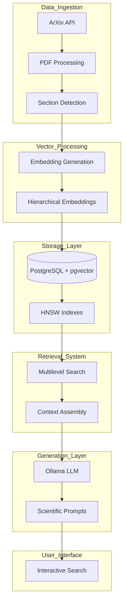
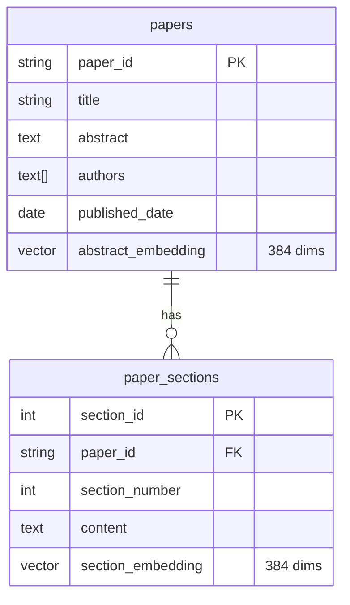
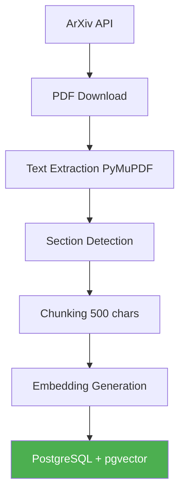
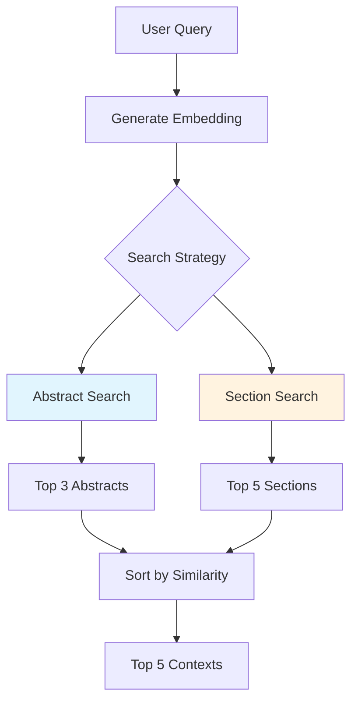
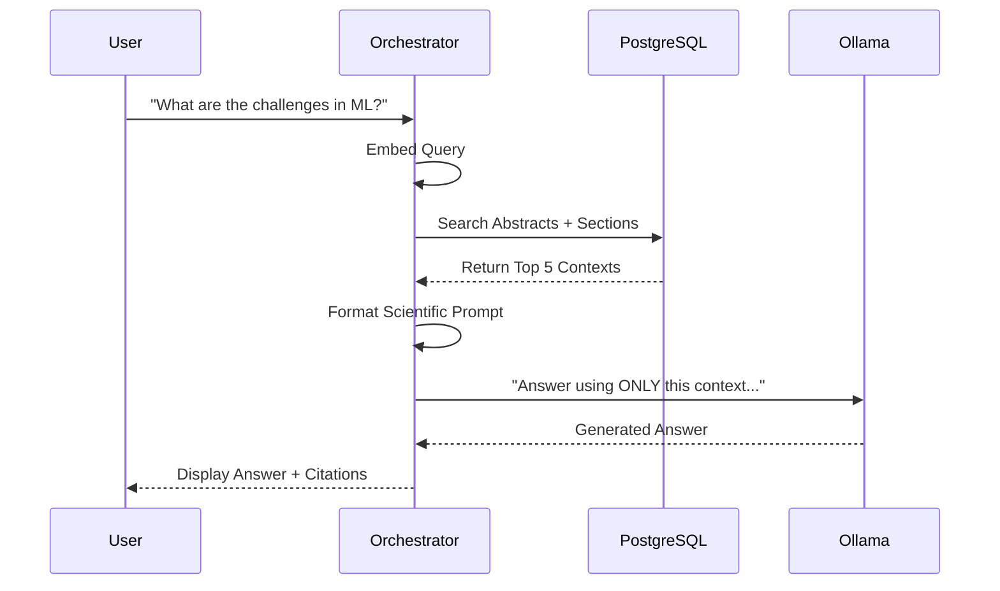
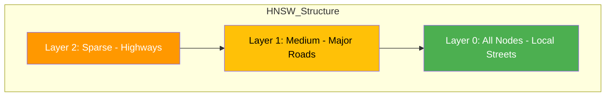

Here is a comprehensive note in Markdown format, designed to be saved directly into Obsidian. It explains the core concepts of building a Scientific RAG system using PostgreSQL and pgvector, using simple language, Mermaid diagrams, and SVG graphics.

---

# Building a Scientific RAG System with PostgreSQL & pgvector

This note explains how to build a **Retrieval-Augmented Generation (RAG)** system specifically designed for **Scientific Literature**. We use **PostgreSQL** with the **pgvector** extension to store and search through academic papers from ArXiv.

## 1. The Big Idea: Why Scientific RAG?

Scientific papers are dense, full of jargon, and often use different terms for the same concept. Traditional keyword search fails here. We need a system that understands the **meaning** of the text and can retrieve specific sections (like Methodology or Results) to answer complex research questions.

**The Goal:** Create a local research assistant that can:
- Find papers by conceptual similarity (not just keywords).
- Synthesize answers across multiple papers.
- Cite sources accurately.

```mermaid
graph LR
    A[User Query: "Neural Network Optimization"] --> B[Embedding Model]
    B --> C[Query Vector]
    C --> D[PostgreSQL pgvector]
    D --> E[Relevant Paper Sections]
    E --> F[LLM Ollama]
    F --> G[Cited Answer]
```

---

## 2. System Architecture: The Six Pillars

The system is composed of six interconnected components that transform raw PDFs into a searchable knowledge base.



### Key Components:
1.  **Data Ingestion:** Fetches papers from ArXiv and extracts text using PyMuPDF.
2.  **Vector Processing:** Uses `all-MiniLM-L6-v2` to generate 384-dimensional vectors.
3.  **Storage:** PostgreSQL with `pgvector` for ACID compliance and vector search.
4.  **Retrieval:** Multilevel search (Abstracts + Sections) with similarity thresholds.
5.  **Generation:** Local LLM (Ollama) with scientific prompt engineering.
6.  **UI:** Interactive CLI for searching and asking questions.

---

## 3. Database Schema: The Two-Table Pattern

We use a **two-table pattern** to separate high-level paper metadata from granular section content.

**Critical Rule:** Use `ON DELETE CASCADE` to maintain referential integrity. If a paper is deleted, its sections should be automatically removed.



### SQL Setup:
```sql
-- Enable pgvector extension
CREATE EXTENSION IF NOT EXISTS vector;

-- Main papers table
CREATE TABLE papers (
    paper_id TEXT PRIMARY KEY,
    title TEXT NOT NULL,
    abstract TEXT,
    authors TEXT[],
    published_date DATE,
    pdf_url TEXT,
    abstract_embedding vector(384)
);

-- Sections table for chunked content
CREATE TABLE paper_sections (
    section_id SERIAL PRIMARY KEY,
    paper_id TEXT REFERENCES papers(paper_id) ON DELETE CASCADE,
    section_title TEXT,
    section_number INTEGER,
    content TEXT,
    embedding vector(384)
);

-- HNSW Indexes for fast similarity search
CREATE INDEX idx_abstract_embeddings ON papers
USING hnsw (abstract_embedding vector_cosine_ops);

CREATE INDEX idx_section_embeddings ON paper_sections
USING hnsw (embedding vector_cosine_ops);
```

---

## 4. Data Ingestion Pipeline: From PDF to Vector

Scientific PDFs are messy. We need a robust pipeline to extract clean text and split it into meaningful chunks.



### Section Detection Heuristics:
We look for common headers like "Introduction", "Methodology", "Results", etc.
```python
section_headers = ['introduction', 'abstract', 'methodology',
                   'results', 'discussion', 'conclusion']
```

### Chunking Strategy:
- **Chunk Size:** 500 characters (roughly 1 paragraph).
- **Overlap:** 50 characters (ensures context isn't lost at boundaries).

---

## 5. Multilevel Search: Abstracts vs. Sections

Scientific queries require different granularities. Sometimes you want a broad overview (Abstract), sometimes a specific detail (Section).



### Similarity Thresholds:
- **0.8+:** Very high similarity (likely the same method).
- **0.7:** "Sweet spot" for relevant but diverse papers.
- **0.6 or lower:** High risk of hallucinated relevance.

### SQL Query for Section Search:
```sql
SELECT
    ps.paper_id,
    p.title,
    ps.section_number,
    ps.content,
    1 - (ps.embedding <=> %s::vector) as similarity
FROM paper_sections ps
JOIN papers p ON ps.paper_id = p.paper_id
WHERE 1 - (ps.embedding <=> %s::vector) > 0.7
ORDER BY similarity DESC
LIMIT 5;
```

---

## 6. The RAG Pipeline: Orchestrating the Answer

The RAG pipeline combines retrieval with generation. We use **Ollama** for local, privacy-preserving inference.



### The Scientific Prompt:
```
You are a scientific assistant helping researchers understand academic literature.
Answer the question based ONLY on the provided research paper excerpts.
Cite the specific papers when referencing information.

Question: {question}

Relevant research findings:
{context_section}

Answer based on the scientific literature above:
```

---

## 7. Visualizing the Vector Space

Here is a visual representation of how scientific papers are clustered in vector space.

<svg width="500" height="350" xmlns="http://www.w3.org/2000/svg">
  <!-- Background Grid -->
  <defs>
    <pattern id="grid" width="30" height="30" patternUnits="userSpaceOnUse">
      <path d="M 30 0 L 0 0 0 30" fill="none" stroke="#e0e0e0" stroke-width="1"/>
    </pattern>
  </defs>
  <rect width="100%" height="100%" fill="url(#grid)" />

  <!-- Axes -->
  <line x1="50" y1="300" x2="450" y2="300" stroke="#333" stroke-width="2" />
  <line x1="50" y1="300" x2="50" y2="50" stroke="#333" stroke-width="2" />
  <text x="460" y="315" font-family="Arial" font-size="14" fill="#333">Dimension 1 (e.g., "Math")</text>
  <text x="10" y="40" font-family="Arial" font-size="14" fill="#333">Dimension 2 (e.g., "CS")</text>

  <!-- Query Vector -->
  <circle cx="250" cy="150" r="8" fill="#FF5722" />
  <text x="260" y="145" font-family="Arial" font-size="14" font-weight="bold" fill="#FF5722">Query: "Neural Networks"</text>

  <!-- Cluster 1: Deep Learning Papers -->
  <circle cx="230" cy="170" r="6" fill="#2196F3" />
  <circle cx="270" cy="130" r="6" fill="#2196F3" />
  <circle cx="240" cy="140" r="6" fill="#2196F3" />
  <text x="280" y="125" font-family="Arial" font-size="12" fill="#2196F3">Deep Learning</text>

  <!-- Cluster 2: Optimization Papers -->
  <circle cx="180" cy="200" r="6" fill="#4CAF50" />
  <circle cx="160" cy="220" r="6" fill="#4CAF50" />
  <circle cx="190" cy="210" r="6" fill="#4CAF50" />
  <text x="140" y="240" font-family="Arial" font-size="12" fill="#4CAF50">Optimization</text>

  <!-- Cluster 3: Unrelated Papers -->
  <circle cx="100" cy="80" r="6" fill="#9E9E9E" />
  <circle cx="120" cy="100" r="6" fill="#9E9E9E" />
  <circle cx="80" cy="110" r="6" fill="#9E9E9E" />
  <text x="130" y="95" font-family="Arial" font-size="12" fill="#9E9E9E">Unrelated</text>

  <!-- Distance Line -->
  <line x1="250" y1="150" x2="230" y2="170" stroke="#FF5722" stroke-width="1" stroke-dasharray="4" />
  <text x="200" y="175" font-family="Arial" font-size="10" fill="#FF5722">L2 Distance</text>
</svg>

*   **Red Dot:** Your search query.
*   **Blue Dots:** Deep Learning papers (semantically similar).
*   **Green Dots:** Optimization papers (related but different).
*   **Grey Dots:** Unrelated papers.

---

## 8. HNSW Index: The Engine Behind Fast Search

HNSW (Hierarchical Navigable Small World) is a graph-based index that enables fast approximate nearest neighbor search.



### Key Parameters:
- **`m` (16):** Number of connections per node. Higher = more accurate, more memory.
- **`ef_construction` (64):** Search breadth during index construction. Higher = better index quality.
- **`efSearch`:** Query-time exploration budget. Higher = more accurate, slower.

### Performance Note:
HNSW is often described as O(log n), but this is a **practical heuristic**, not a theorem. Between O(log n) and O(n) is closer to the truth, depending on recall requirements and data distribution.

---

## 9. Summary Checklist

- [x] **Database:** PostgreSQL with `pgvector` extension.
- [x] **Schema:** `papers` + `paper_sections` with `ON DELETE CASCADE`.
- [x] **Indexing:** HNSW indexes on `abstract_embedding` and `section_embedding`.
- [x] **Ingestion:** ArXiv API + PyMuPDF for text extraction.
- [x] **Chunking:** 500 characters with 50-character overlap.
- [x] **Embedding:** `all-MiniLM-L6-v2` (384 dimensions).
- [x] **Search:** Multilevel (Abstracts + Sections) with similarity thresholds.
- [x] **LLM:** Ollama (Llama 3.1:8b) with low temperature (0.1).
- [x] **Prompt:** Strict instructions to use ONLY retrieved context and cite sources.

This architecture provides a robust foundation for a personal scientific research assistant. By combining semantic understanding with structured retrieval, you can navigate vast amounts of academic literature and synthesize knowledge efficiently.