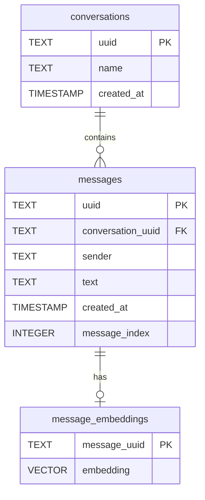
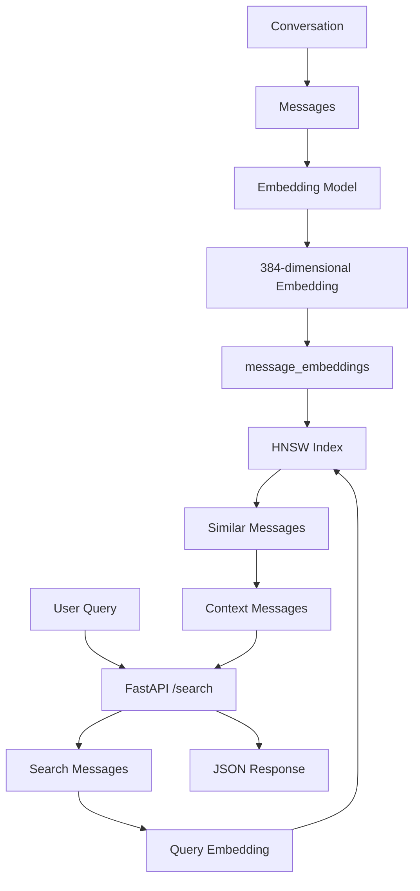

I'll ignore all comments and explain only the executable code, **word by word and line by line**.

# 1. Database tables

## `CREATE EXTENSION`

```sql
CREATE EXTENSION IF NOT EXISTS vector;
```

|Word|Meaning|
|---|---|
|`CREATE`|Make something new|
|`EXTENSION`|Add extra functionality to PostgreSQL|
|`IF NOT EXISTS`|Only create it if it isn't already there|
|`vector`|The pgvector extension|

After this, PostgreSQL understands:

```sql
vector(384)
```

and vector operations such as:

```sql
<=>
```

---

# 2. `conversations` table

```sql
CREATE TABLE conversations (
    uuid TEXT PRIMARY KEY,
    name TEXT NOT NULL,
    created_at TIMESTAMP DEFAULT CURRENT_TIMESTAMP
);
```

### `CREATE TABLE`

```text
CREATE TABLE conversations
```

means:

> Create a database table called `conversations`.

Think of a table like a spreadsheet:

```text
conversations
┌──────────────┬──────────────┬──────────────┐
│ uuid         │ name         │ created_at   │
├──────────────┼──────────────┼──────────────┤
│ abc123       │ Python Chat  │ 2026-09-19   │
│ xyz789       │ ML Chat      │ 2026-09-18   │
└──────────────┴──────────────┴──────────────┘
```

### `uuid TEXT PRIMARY KEY`

```sql
uuid TEXT PRIMARY KEY
```

Breakdown:

```text
uuid
 ↓
column name

TEXT
 ↓
data type

PRIMARY KEY
 ↓
unique identifier
```

So:

```text
uuid = "abc123"
```

Each conversation gets its own identifier.

`PRIMARY KEY` means:

- cannot be duplicated
    
- identifies one row
    
- cannot be `NULL`
    

---

### `name TEXT NOT NULL`

```sql
name TEXT NOT NULL
```

Means:

```text
name → text value
NOT NULL → must have a value
```

This is allowed:

```text
"Machine Learning"
```

This is not:

```text
NULL
```

---

### `created_at`

```sql
created_at TIMESTAMP DEFAULT CURRENT_TIMESTAMP
```

|Part|Meaning|
|---|---|
|`created_at`|column name|
|`TIMESTAMP`|date + time|
|`DEFAULT`|automatic value|
|`CURRENT_TIMESTAMP`|current date/time|

So if you insert:

```sql
INSERT INTO conversations (uuid, name)
VALUES ('abc', 'Python');
```

PostgreSQL automatically sets:

```text
created_at = current date/time
```

---

# 3. `messages` table

```sql
CREATE TABLE messages (
    uuid TEXT PRIMARY KEY,
    conversation_uuid TEXT REFERENCES conversations(uuid) ON DELETE CASCADE,
    sender TEXT NOT NULL,
    text TEXT NOT NULL,
    created_at TIMESTAMP DEFAULT CURRENT_TIMESTAMP,
    message_index INTEGER
);
```

This stores individual messages.

Relationship:



---

## `conversation_uuid`

```sql
conversation_uuid TEXT REFERENCES conversations(uuid) ON DELETE CASCADE
```

This is very important.

### `conversation_uuid`

Stores the ID of the conversation:

```text
conversation_uuid
       ↓
"abc123"
```

### `REFERENCES`

```sql
REFERENCES conversations(uuid)
```

means:

> This value must refer to a `uuid` in the `conversations` table.

So:

```text
conversations
     │
     │ uuid = abc123
     ↓
messages
conversation_uuid = abc123
```

This creates a **foreign key relationship**.

---

## `ON DELETE CASCADE`

```sql
ON DELETE CASCADE
```

means:

> If a conversation is deleted, automatically delete its messages too.

Example:

```text
Conversation ABC
     │
     ├── Message 1
     ├── Message 2
     └── Message 3
```

Delete conversation:

```text
Conversation ABC ❌
     │
     ├── Message 1 ❌
     ├── Message 2 ❌
     └── Message 3 ❌
```

---

# 4. `sender`

```sql
sender TEXT NOT NULL
```

Stores who sent the message.

For example:

```text
"user"
"assistant"
```

Because of `NOT NULL`, it cannot be empty/NULL.

---

# 5. `text`

```sql
text TEXT NOT NULL
```

Stores the actual message.

Example:

```text
"Explain neural networks"
```

---

# 6. `message_index`

```sql
message_index INTEGER
```

`INTEGER` means whole number.

For example:

```text
0
1
2
3
4
```

This tells you the message's position inside the conversation.

Example:

```text
message_index = 0 → first message
message_index = 1 → second message
message_index = 2 → third message
```

This becomes useful for retrieving surrounding context.

---

# 7. `message_embeddings`

```sql
CREATE TABLE message_embeddings (
    message_uuid TEXT PRIMARY KEY REFERENCES messages(uuid) ON DELETE CASCADE,
    embedding vector(384) NOT NULL
);
```

This table connects a message with its embedding.

Example:

```text
messages
┌────────┬──────────────────────────┐
│ uuid   │ text                     │
├────────┼──────────────────────────┤
│ abc123 │ "What is Python?"        │
└────────┴──────────────────────────┘

message_embeddings
┌────────┬──────────────────────────┐
│ uuid   │ embedding                │
├────────┼──────────────────────────┤
│ abc123 │ [0.12, -0.4, ... 384]   │
└────────┴──────────────────────────┘
```

---

## `message_uuid TEXT PRIMARY KEY`

This identifies which message the embedding belongs to.

Because it is also:

```sql
REFERENCES messages(uuid)
```

the embedding must belong to an existing message.

---

# 8. `vector(384)`

```sql
embedding vector(384)
```

This means:

> Store a vector containing **384 dimensions**.

For example, conceptually:

```text
[0.12, -0.42, 0.87, 0.21, ...]
 ↑
 384 numbers total
```

The vector represents the semantic meaning of the message.

---

# 9. HNSW index

```sql
CREATE INDEX idx_message_embeddings_vector
ON message_embeddings
USING hnsw (embedding vector_cosine_ops);
```

This creates a special index for searching vectors quickly.

### `CREATE INDEX`

```text
CREATE INDEX
```

means:

> Create a data structure that makes searching faster.

---

### `idx_message_embeddings_vector`

This is simply the name of the index.

You could call it something else.

---

### `ON message_embeddings`

Means:

> Create the index on the `message_embeddings` table.

---

### `USING hnsw`

Tells PostgreSQL:

> Use the HNSW indexing algorithm.

HNSW is useful for approximate nearest-neighbor vector search.

Without an index, PostgreSQL might need to compare your query against:

```text
1,000,000 messages
        ↓
compare every vector
        ↓
slow
```

With HNSW:

```text
query vector
     ↓
   HNSW
     ↓
find nearby vectors
     ↓
fast
```

---

### `vector_cosine_ops`

```sql
vector_cosine_ops
```

means:

> Use cosine distance when comparing vectors.

So your index is designed for searches using:

```sql
embedding <=> query_embedding
```

---

# 10. Python function

```python
def generate_message_embeddings(db_config, batch_size=100):
```

Breakdown:

|Code|Meaning|
|---|---|
|`def`|define a function|
|`generate_message_embeddings`|function name|
|`db_config`|database configuration argument|
|`batch_size=100`|default batch size|
|`:`|beginning of function body|

Calling:

```python
generate_message_embeddings(config)
```

uses:

```text
batch_size = 100
```

You could also do:

```python
generate_message_embeddings(config, 500)
```

Then:

```text
batch_size = 500
```

---

# 11. Database query

```python
cursor.execute("""
    SELECT m.uuid, m.text
    FROM messages m
    LEFT JOIN message_embeddings me ON m.uuid = me.message_uuid
    WHERE me.message_uuid IS NULL
    ORDER BY m.created_at
""")
```

## `cursor`

A database cursor is an object used to execute SQL.

```python
cursor.execute(...)
```

means:

> Send this SQL query to PostgreSQL.

---

# 12. `SELECT m.uuid, m.text`

```sql
SELECT m.uuid, m.text
```

Get:

```text
message UUID
message text
```

from `messages`.

---

# 13. `FROM messages m`

```sql
FROM messages m
```

means:

```text
messages = table
m = alias
```

So:

```sql
m.uuid
m.text
```

means:

```text
messages.uuid
messages.text
```

---

# 14. `LEFT JOIN`

```sql
LEFT JOIN message_embeddings me
    ON m.uuid = me.message_uuid
```

This connects:

```text
messages
    │
    │ uuid
    ↓
message_embeddings
    │
    │ message_uuid
```

`LEFT JOIN` keeps **all messages**, even if they don't have an embedding.

That's important because we're trying to find messages that **don't have embeddings yet**.

---

# 15. `WHERE ... IS NULL`

```sql
WHERE me.message_uuid IS NULL
```

This is the clever part.

After the `LEFT JOIN`:

```text
Message A → embedding exists
Message B → embedding exists
Message C → no embedding
```

The missing embedding becomes:

```text
NULL
```

So:

```sql
WHERE me.message_uuid IS NULL
```

means:

> Give me only messages that don't have embeddings.

---

# 16. `ORDER BY`

```sql
ORDER BY m.created_at
```

Sort messages by creation time.

Normally this means:

```text
oldest
  ↓
newer
  ↓
newest
```

---

# 17. Batch processing

```python
for i in range(0, len(messages), batch_size):
```

This loops through messages in groups.

Suppose:

```text
len(messages) = 250
batch_size = 100
```

Then:

```text
batch 1 → 0–99
batch 2 → 100–199
batch 3 → 200–249
```

### `range`

```python
range(0, 250, 100)
```

produces approximately:

```text
0
100
200
```

### `len`

```python
len(messages)
```

means:

> How many messages are there?

---

# 18. Get one batch

```python
batch = messages[i:i + batch_size]
```

This is Python slicing.

If:

```text
i = 100
batch_size = 100
```

then:

```python
messages[100:200]
```

means:

> Get messages from position 100 up to, but not including, 200.

---

# 19. Extract text

```python
texts = [msg[1] for msg in batch]
```

This is a Python list comprehension.

Suppose:

```python
batch = [
    ("abc", "Hello"),
    ("def", "How are you?"),
    ("ghi", "Explain AI")
]
```

`msg[1]` means:

> Take the second item.

Result:

```python
texts = [
    "Hello",
    "How are you?",
    "Explain AI"
]
```

Why `1`?

Python indexes start at `0`:

```text
msg[0] → uuid
msg[1] → text
```

---

# 20. Generate embeddings

```python
embeddings = model.encode(texts, convert_to_numpy=True)
```

`model.encode()` converts text into vectors.

For example:

```text
"Explain AI"
      ↓
 embedding model
      ↓
[0.13, -0.42, 0.81, ... 384 numbers ...]
```

`convert_to_numpy=True` means:

> Return the embeddings as NumPy arrays.

So:

```text
texts
  ↓
model.encode()
  ↓
NumPy arrays
  ↓
embeddings
```

---

# 21. Insert embeddings

```python
cursor.executemany("""
    INSERT INTO message_embeddings (message_uuid, embedding)
    VALUES (%s, %s)
    ON CONFLICT (message_uuid) DO NOTHING
""", data)
```

### `executemany`

Means:

> Execute the same SQL operation multiple times with different data.

Instead of:

```text
INSERT message 1
INSERT message 2
INSERT message 3
...
```

individually, it can process many rows.

---

# 22. `INSERT INTO`

```sql
INSERT INTO message_embeddings
```

means:

> Add rows to `message_embeddings`.

---

### Columns

```sql
(message_uuid, embedding)
```

means we're inserting values into:

```text
message_uuid
embedding
```

---

# 23. `VALUES`

```sql
VALUES (%s, %s)
```

The two `%s` values correspond to:

```text
%s → message_uuid
%s → embedding
```

For example:

```text
%s → "abc123"
%s → [0.12, -0.42, ...]
```

---

# 24. `ON CONFLICT`

```sql
ON CONFLICT (message_uuid)
```

Suppose the embedding already exists:

```text
message_uuid = abc123
```

Since:

```sql
message_uuid TEXT PRIMARY KEY
```

you can't insert another row with the same ID.

That creates a conflict.

---

# 25. `DO NOTHING`

```sql
DO NOTHING
```

means:

> If that embedding already exists, don't do anything.

So:

```text
new message
     ↓
embedding already exists?
     │
   ┌─┴─┐
  YES  NO
   │    │
 skip  insert
```

---

# 26. `get_message_context`

```python
def get_message_context(db_config, message_uuid, context_size=3):
```

This function retrieves messages surrounding a target message.

Arguments:

```text
db_config
message_uuid
context_size
```

Default:

```text
context_size = 3
```

So it can retrieve approximately:

```text
3 messages before
+
target message
+
3 messages after
```

---

# 27. Find target message

```python
cursor.execute("""
    SELECT conversation_uuid, message_index
    FROM messages
    WHERE uuid = %s
""", (message_uuid,))
```

It searches for the target message.

It retrieves:

```text
conversation_uuid
message_index
```

For example:

```text
message_uuid = abc123

conversation_uuid = conversation1
message_index = 20
```

Now the program knows:

```text
Which conversation?
        ↓
conversation1

Where in conversation?
        ↓
message 20
```

---

# 28. `(message_uuid,)`

```python
(message_uuid,)
```

This is a **one-element Python tuple**.

The comma matters.

```python
(message_uuid,)
```

is a tuple.

But:

```python
(message_uuid)
```

is just the value surrounded by parentheses.

It is used to supply the `%s` parameter safely.

---

# 29. Get surrounding messages

```python
cursor.execute("""
    SELECT uuid, text, sender, message_index, created_at
    FROM messages
    WHERE conversation_uuid = %s
    AND message_index >= %s
    AND message_index <= %s
    ORDER BY message_index
""", (conv_uuid, target_index - context_size, target_index + context_size))
```

Now the function gets nearby messages.

Suppose:

```text
target_index = 20
context_size = 3
```

Then:

```text
target_index - context_size
= 20 - 3
= 17
```

and:

```text
target_index + context_size
= 20 + 3
= 23
```

So the query becomes conceptually:

```text
message_index >= 17
AND
message_index <= 23
```

Therefore:

```text
17
18
19
20 ← target
21
22
23
```

That's **7 messages total**.

```text
3 before + target + 3 after
```

---

# 30. `AND`

```sql
AND
```

means:

> Both conditions must be true.

So:

```sql
conversation_uuid = %s
AND message_index >= %s
AND message_index <= %s
```

means:

> Same conversation **and** within the requested message range.

---

# 31. FastAPI section

```python
from fastapi import FastAPI, HTTPException
```

`from` means:

> Import something from a package/module.

`fastapi` is the package.

```text
FastAPI
HTTPException
```

are imported objects.

---

# 32. Pydantic

```python
from pydantic import BaseModel
```

`BaseModel` is used to define structured request data.

---

# 33. Create FastAPI application

```python
app = FastAPI(title="Claude Conversation Search")
```

`FastAPI(...)` creates the web application.

```text
app
 ↓
FastAPI application
```

`title=` gives the API a title.

---

# 34. `class SearchRequest`

```python
class SearchRequest(BaseModel):
```

This creates a Python class representing the expected request body.

Because it inherits from:

```python
BaseModel
```

Pydantic validates the incoming data.

---

# 35. Request fields

```python
query: str
limit: int = 10
threshold: float = 0.7
```

### `query: str`

Means:

```text
query must be a string
```

Example:

```json
{
  "query": "machine learning"
}
```

---

### `limit: int = 10`

Means:

```text
limit → integer
default → 10
```

If the user doesn't provide `limit`:

```text
limit = 10
```

---

### `threshold: float = 0.7`

Means:

```text
threshold → floating-point number
default → 0.7
```

Example:

```json
{
  "query": "machine learning",
  "limit": 5,
  "threshold": 0.8
}
```

---

# 36. API endpoint

```python
@app.post("/search")
```

This is a FastAPI decorator.

It says:

> When someone sends an HTTP **POST** request to `/search`, use the function below.

So:

```text
POST /search
       ↓
search_endpoint()
```

---

# 37. Function

```python
def search_endpoint(request: SearchRequest):
```

The function receives:

```text
request
```

and expects it to be:

```text
SearchRequest
```

Therefore:

```python
request.query
request.limit
request.threshold
```

are available.

---

# 38. `try`

```python
try:
```

Means:

> Try running this code.

If something goes wrong, Python can handle it using `except`.

---

# 39. Search function

```python
results = search_messages(
    DB_CONFIG,
    request.query,
    request.limit,
    request.threshold
)
```

This calls:

```python
search_messages()
```

with four values:

```text
DB_CONFIG
     ↓
database configuration

request.query
     ↓
user's search text

request.limit
     ↓
maximum number of results

request.threshold
     ↓
minimum similarity
```

For example:

```text
query = "transformers"
limit = 5
threshold = 0.7
```

---

# 40. Return

```python
return {"results": results}
```

This sends JSON back to the API client.

Conceptually:

```json
{
  "results": [
    {
      "uuid": "abc123",
      "text": "Transformers use attention..."
    }
  ]
}
```

---

# 41. `except`

```python
except Exception as e:
```

Means:

> If an error occurs, catch it.

`Exception` represents a general Python error.

`as e` stores the error in:

```text
e
```

---

# 42. `HTTPException`

```python
raise HTTPException(status_code=500, detail=str(e))
```

`raise` means:

> Trigger an exception.

`HTTPException` creates an HTTP error response.

```text
status_code=500
```

means:

> Internal server error.

And:

```python
str(e)
```

converts the Python error into text.

---

# Complete architecture

Your code is building this system:



The key idea is:

```text
Conversation
    ↓
Messages
    ↓
Embeddings
    ↓
pgvector + HNSW
    ↓
Semantic search
    ↓
Find similar messages
    ↓
Get surrounding conversation
    ↓
Return results through FastAPI
```

One thing to notice: the Python snippets you provided omit some required surrounding code/assignments—such as where `cursor`, `messages`, `data`, `conv_uuid`, and `target_index` are created. The SQL concepts themselves are clear, but those snippets are not standalone as written.