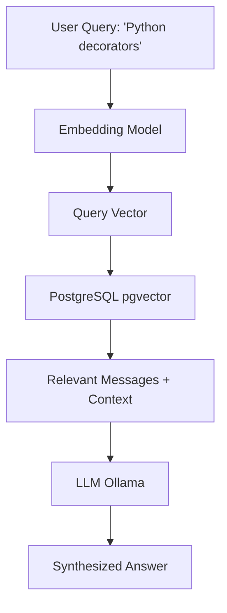
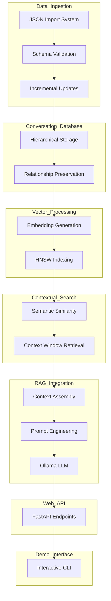
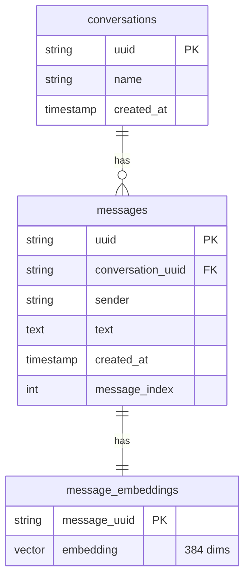
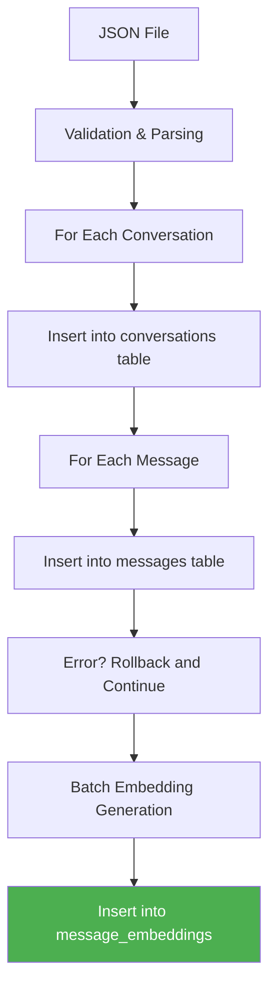
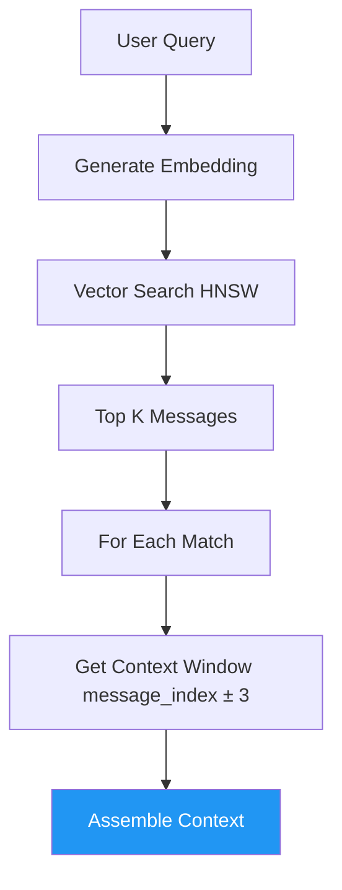
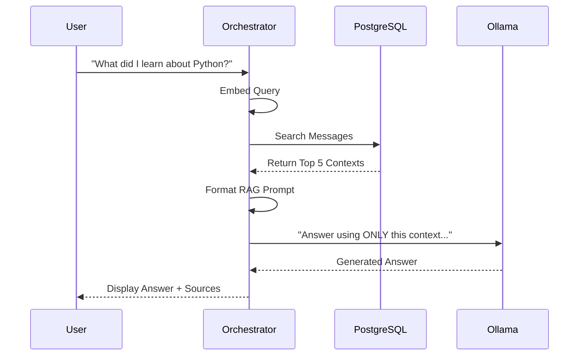
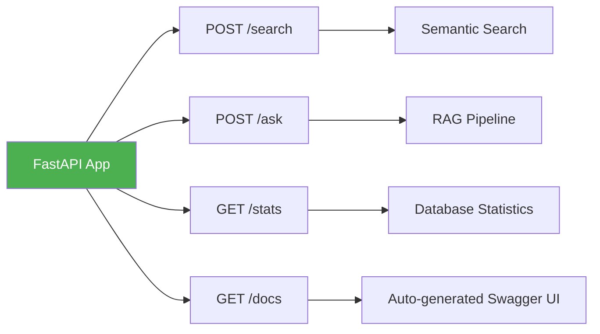

We use **PostgreSQL** with **pgvector** to store conversations, **SentenceTransformers** to embed them and **FastAPI** to serve it as web API.


transform raw JSON export into searchable, contextual knowledge base.



---

## System Architecture




1.  **Data Ingestion:** Process Claude JSON export with error handling.
2.  **Database Design:** Three-table schema for conversation, message and embeddings.
3.  **Vector Processing:** `all-MiniLM-L6-v2` for 384-dimensional embeddings.
4.  **Contextual Search:** Find message and retrieve surrounding context.
5.  **RAG Integration:** Combine context into prompt for local LLM.
6.  **Web API:** FastAPI for search, ask and stats endpoints.
7.  **Demo Interface:** CLI for testing and sample data generation.

---

`ON DELETE CASCADE` 

If a conversation is deleted, its message and embeddings should be automatically removed.



### SQL Setup:
```sql
-- Enable pgvector extension
CREATE EXTENSION IF NOT EXISTS vector;

-- Conversations table
CREATE TABLE conversations (
    uuid TEXT PRIMARY KEY,
    name TEXT NOT NULL,
    created_at TIMESTAMP DEFAULT CURRENT_TIMESTAMP
);

-- Messages table
CREATE TABLE messages (
    uuid TEXT PRIMARY KEY,
    conversation_uuid TEXT REFERENCES conversations(uuid) ON DELETE CASCADE,
    sender TEXT NOT NULL,
    text TEXT NOT NULL,
    created_at TIMESTAMP DEFAULT CURRENT_TIMESTAMP,
    message_index INTEGER
);

-- Embeddings table
CREATE TABLE message_embeddings (
    message_uuid TEXT PRIMARY KEY REFERENCES messages(uuid) ON DELETE CASCADE,
    embedding vector(384) NOT NULL
);

-- HNSW Index for fast similarity search
CREATE INDEX idx_message_embeddings_vector
ON message_embeddings
USING hnsw (embedding vector_cosine_ops);
```

---

## Data Ingestion Pipeline



Generating embeddings one-by-one slow. We process them in batches of 100.

```python
def generate_message_embeddings(db_config, batch_size=100):
    # Find messages without embeddings
    cursor.execute("""
        SELECT m.uuid, m.text
        FROM messages m
        LEFT JOIN message_embeddings me ON m.uuid = me.message_uuid
        WHERE me.message_uuid IS NULL
        ORDER BY m.created_at
    """)
    
    # Process in batches
    for i in range(0, len(messages), batch_size):
        batch = messages[i:i + batch_size]
        texts = [msg[1] for msg in batch]
        embeddings = model.encode(texts, convert_to_numpy=True)
        
        # Insert batch
        cursor.executemany("""
            INSERT INTO message_embeddings (message_uuid, embedding)
            VALUES (%s, %s)
            ON CONFLICT (message_uuid) DO NOTHING
        """, data)
```

---

## Contextual Search: Finding the Flow

Searching conversations requires more than finding similar messages. We need to retrieve **context window** (surrounding messages) to understand the flow.



### Context Window:
If message match, we fetch 3 messages before and after it to preserve conversational flow.

```python
def get_message_context(db_config, message_uuid, context_size=3):
    # Get target message position
    cursor.execute("""
        SELECT conversation_uuid, message_index
        FROM messages
        WHERE uuid = %s
    """, (message_uuid,))
    
    # Get surrounding messages
    cursor.execute("""
        SELECT uuid, text, sender, message_index, created_at
        FROM messages
        WHERE conversation_uuid = %s
        AND message_index >= %s
        AND message_index <= %s
        ORDER BY message_index
    """, (conv_uuid, target_index - context_size, target_index + context_size))
```

---

## RAG Pipeline



### Conversational Prompt:
```
You are a helpful assistant answering questions based on the user's conversation history with Claude.
Use ONLY the information provided in the contexts below to answer the question.
If the answer cannot be found in the contexts, say so clearly.

Question: {question}

Relevant contexts from your conversations:
Context 1 (from 'Python Learning Discussion' - Assistant, similarity: 0.85):
List comprehensions are a concise way to create lists...

Context 2 (from 'Python Learning Discussion' - Human, similarity: 0.82):
That's helpful! What about filtering with conditions?

Answer based on the above contexts:
```

---

## Web API with FastAPI



### API Endpoints:
| Method | Endpoint | Request Body | Response |
| :--- | :--- | :--- | :--- |
| **POST** | `/search` | `{query, limit, threshold}` | `{results: [...]}` |
| **POST** | `/ask` | `{question, max_contexts, threshold}` | `{answer, contexts, stats}` |
| **GET** | `/stats` | None | `{total_conversations, total_messages, ...}` |
| **GET** | `/docs` | None | Swagger UI |

### Example FastAPI Code:
```python
from fastapi import FastAPI, HTTPException
from pydantic import BaseModel

app = FastAPI(title="Claude Conversation Search")

class SearchRequest(BaseModel):
    query: str
    limit: int = 10
    threshold: float = 0.7

@app.post("/search")
def search_endpoint(request: SearchRequest):
    try:
        results = search_messages(DB_CONFIG, request.query,
                                  request.limit, request.threshold)
        return {"results": results}
    except Exception as e:
        raise HTTPException(status_code=500, detail=str(e))
```

---