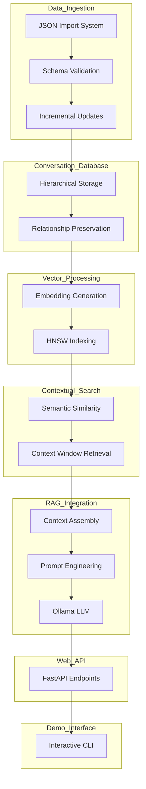
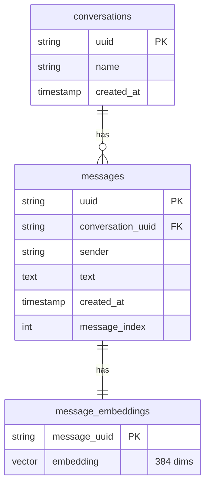
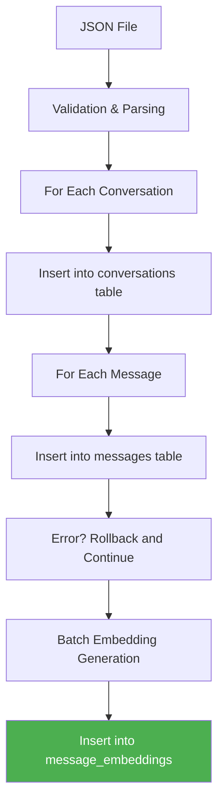
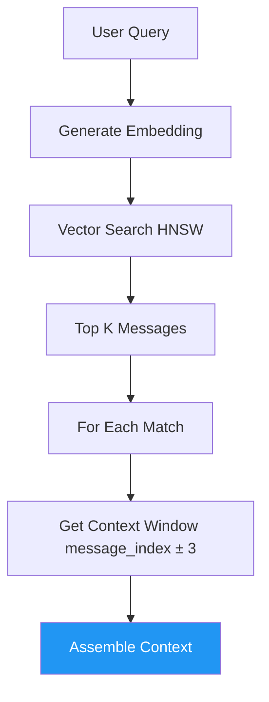
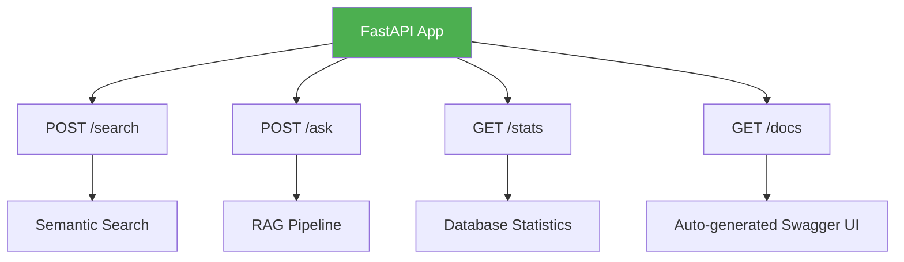

Here is a comprehensive note in Markdown format, designed to be saved directly into Obsidian. It explains the core concepts of building a Complete Conversation Search and RAG System using PostgreSQL, pgvector, and FastAPI, using simple language, Mermaid diagrams, and SVG graphics.

---

# Building a Complete Conversation Search & RAG System

This note explains how to build a **"Second Brain"** for your AI chat history (like Claude or ChatGPT). We use **PostgreSQL** with **pgvector** to store conversations, **SentenceTransformers** to embed them, and **FastAPI** to serve it as a web API.

## 1. The Big Idea: From Ephemeral Chats to Permanent Knowledge

Conversations with AI contain valuable insights, but they are often lost in a sea of messages. This system transforms raw JSON exports into a searchable, contextual knowledge base.

**The Goal:** Create a system that can:
- Find messages by *meaning*, not just keywords.
- Retrieve *surrounding context* (the conversation flow).
- Synthesize answers across multiple conversations using RAG.

```mermaid
graph LR
    A[User Query: "Python decorators"] --> B[Embedding Model]
    B --> C[Query Vector]
    C --> D[PostgreSQL pgvector]
    D --> E[Relevant Messages + Context]
    E --> F[LLM Ollama]
    F --> G[Synthesized Answer]
```

---

## 2. System Architecture: The Seven Pillars

The system consists of seven integrated components that transform raw conversation data into an intelligent, searchable knowledge system.



### Key Components:
1.  **Data Ingestion:** Processes Claude JSON exports with error handling.
2.  **Database Design:** Three-table schema for conversations, messages, and embeddings.
3.  **Vector Processing:** `all-MiniLM-L6-v2` for 384-dimensional embeddings.
4.  **Contextual Search:** Finds messages and retrieves surrounding context.
5.  **RAG Integration:** Combines contexts into prompts for local LLM.
6.  **Web API:** FastAPI for search, ask, and stats endpoints.
7.  **Demo Interface:** CLI for testing and sample data generation.

---

## 3. Database Schema: The Three-Table Pattern

Conversations have a hierarchical structure. We use three tables to balance normalized data integrity with query performance.

**Critical Rule:** Use `ON DELETE CASCADE` to maintain referential integrity. If a conversation is deleted, its messages and embeddings should be automatically removed.



### SQL Setup:
```sql
-- Enable pgvector extension
CREATE EXTENSION IF NOT EXISTS vector;

-- Conversations table
CREATE TABLE conversations (
    uuid TEXT PRIMARY KEY,
    name TEXT NOT NULL,
    created_at TIMESTAMP DEFAULT CURRENT_TIMESTAMP
);

-- Messages table
CREATE TABLE messages (
    uuid TEXT PRIMARY KEY,
    conversation_uuid TEXT REFERENCES conversations(uuid) ON DELETE CASCADE,
    sender TEXT NOT NULL,
    text TEXT NOT NULL,
    created_at TIMESTAMP DEFAULT CURRENT_TIMESTAMP,
    message_index INTEGER
);

-- Embeddings table
CREATE TABLE message_embeddings (
    message_uuid TEXT PRIMARY KEY REFERENCES messages(uuid) ON DELETE CASCADE,
    embedding vector(384) NOT NULL
);

-- HNSW Index for fast similarity search
CREATE INDEX idx_message_embeddings_vector
ON message_embeddings
USING hnsw (embedding vector_cosine_ops);
```

---

## 4. Data Ingestion Pipeline: From JSON to Vector

Claude exports conversations as JSON. We need to parse this, store it in the database, and generate embeddings.



### Batch Processing for Embeddings:
Generating embeddings one-by-one is slow. We process them in batches of 100.

```python
def generate_message_embeddings(db_config, batch_size=100):
    # Find messages without embeddings
    cursor.execute("""
        SELECT m.uuid, m.text
        FROM messages m
        LEFT JOIN message_embeddings me ON m.uuid = me.message_uuid
        WHERE me.message_uuid IS NULL
        ORDER BY m.created_at
    """)
    
    # Process in batches
    for i in range(0, len(messages), batch_size):
        batch = messages[i:i + batch_size]
        texts = [msg[1] for msg in batch]
        embeddings = model.encode(texts, convert_to_numpy=True)
        
        # Insert batch
        cursor.executemany("""
            INSERT INTO message_embeddings (message_uuid, embedding)
            VALUES (%s, %s)
            ON CONFLICT (message_uuid) DO NOTHING
        """, data)
```

---

## 5. Contextual Search: Finding the Flow

Searching conversations requires more than finding similar messages. We need to retrieve the **context window** (surrounding messages) to understand the flow.



### The Context Window:
If a message matches, we fetch the 3 messages before and after it to preserve conversational flow.

```python
def get_message_context(db_config, message_uuid, context_size=3):
    # Get target message position
    cursor.execute("""
        SELECT conversation_uuid, message_index
        FROM messages
        WHERE uuid = %s
    """, (message_uuid,))
    
    # Get surrounding messages
    cursor.execute("""
        SELECT uuid, text, sender, message_index, created_at
        FROM messages
        WHERE conversation_uuid = %s
        AND message_index >= %s
        AND message_index <= %s
        ORDER BY message_index
    """, (conv_uuid, target_index - context_size, target_index + context_size))
```

---

## 6. The RAG Pipeline: Synthesizing Answers

The RAG pipeline combines retrieved contexts into a prompt for the local LLM (Ollama).

```mermaid
sequenceDiagram
    participant User
    participant Orchestrator
    participant PostgreSQL
    participant Ollama
    
    User->>Orchestrator: "What did I learn about Python?"
    Orchestrator->>Orchestrator: Embed Query
    Orchestrator->>PostgreSQL: Search Messages
    PostgreSQL-->>Orchestrator: Return Top 5 Contexts
    Orchestrator->>Orchestrator: Format RAG Prompt
    Orchestrator->>Ollama: "Answer using ONLY this context..."
    Ollama-->>Orchestrator: Generated Answer
    Orchestrator-->>User: Display Answer + Sources
```



### The Conversational Prompt:
```
You are a helpful assistant answering questions based on the user's conversation history with Claude.
Use ONLY the information provided in the contexts below to answer the question.
If the answer cannot be found in the contexts, say so clearly.

Question: {question}

Relevant contexts from your conversations:
Context 1 (from 'Python Learning Discussion' - Assistant, similarity: 0.85):
List comprehensions are a concise way to create lists...

Context 2 (from 'Python Learning Discussion' - Human, similarity: 0.82):
That's helpful! What about filtering with conditions?

Answer based on the above contexts:
```

---

## 7. Web API with FastAPI: Making it Accessible

We wrap the system in a FastAPI web service so it can be used by other applications.



### API Endpoints:
| Method | Endpoint | Request Body | Response |
| :--- | :--- | :--- | :--- |
| **POST** | `/search` | `{query, limit, threshold}` | `{results: [...]}` |
| **POST** | `/ask` | `{question, max_contexts, threshold}` | `{answer, contexts, stats}` |
| **GET** | `/stats` | None | `{total_conversations, total_messages, ...}` |
| **GET** | `/docs` | None | Swagger UI |

### Example FastAPI Code:
```python
from fastapi import FastAPI, HTTPException
from pydantic import BaseModel

app = FastAPI(title="Claude Conversation Search")

class SearchRequest(BaseModel):
    query: str
    limit: int = 10
    threshold: float = 0.7

@app.post("/search")
def search_endpoint(request: SearchRequest):
    try:
        results = search_messages(DB_CONFIG, request.query,
                                  request.limit, request.threshold)
        return {"results": results}
    except Exception as e:
        raise HTTPException(status_code=500, detail=str(e))
```

---

## 8. Visualizing the Vector Space

Here is a visual representation of how conversation messages are clustered in vector space.

<svg width="500" height="350" xmlns="http://www.w3.org/2000/svg">
  <!-- Background Grid -->
  <defs>
    <pattern id="grid" width="30" height="30" patternUnits="userSpaceOnUse">
      <path d="M 30 0 L 0 0 0 30" fill="none" stroke="#e0e0e0" stroke-width="1"/>
    </pattern>
  </defs>
  <rect width="100%" height="100%" fill="url(#grid)" />

  <!-- Axes -->
  <line x1="50" y1="300" x2="450" y2="300" stroke="#333" stroke-width="2" />
  <line x1="50" y1="300" x2="50" y2="50" stroke="#333" stroke-width="2" />
  <text x="460" y="315" font-family="Arial" font-size="14" fill="#333">Dimension 1 (e.g., "Python")</text>
  <text x="10" y="40" font-family="Arial" font-size="14" fill="#333">Dimension 2 (e.g., "ML")</text>

  <!-- Query Vector -->
  <circle cx="250" cy="150" r="8" fill="#FF5722" />
  <text x="260" y="145" font-family="Arial" font-size="14" font-weight="bold" fill="#FF5722">Query: "List Comprehensions"</text>

  <!-- Cluster 1: Python Messages -->
  <circle cx="230" cy="170" r="6" fill="#2196F3" />
  <circle cx="270" cy="130" r="6" fill="#2196F3" />
  <circle cx="240" cy="140" r="6" fill="#2196F3" />
  <text x="280" y="125" font-family="Arial" font-size="12" fill="#2196F3">Python Chat</text>

  <!-- Cluster 2: ML Messages -->
  <circle cx="180" cy="200" r="6" fill="#4CAF50" />
  <circle cx="160" cy="220" r="6" fill="#4CAF50" />
  <circle cx="190" cy="210" r="6" fill="#4CAF50" />
  <text x="140" y="240" font-family="Arial" font-size="12" fill="#4CAF50">ML Chat</text>

  <!-- Cluster 3: Unrelated Messages -->
  <circle cx="100" cy="80" r="6" fill="#9E9E9E" />
  <circle cx="120" cy="100" r="6" fill="#9E9E9E" />
  <circle cx="80" cy="110" r="6" fill="#9E9E9E" />
  <text x="130" y="95" font-family="Arial" font-size="12" fill="#9E9E9E">Unrelated</text>

  <!-- Distance Line -->
  <line x1="250" y1="150" x2="230" y2="170" stroke="#FF5722" stroke-width="1" stroke-dasharray="4" />
  <text x="200" y="175" font-family="Arial" font-size="10" fill="#FF5722">L2 Distance</text>
</svg>

*   **Red Dot:** Your search query.
*   **Blue Dots:** Python messages (semantically similar).
*   **Green Dots:** Machine Learning messages (related but different).
*   **Grey Dots:** Unrelated messages.

---

## 9. Summary Checklist

- [x] **Database:** PostgreSQL with `pgvector` extension.
- [x] **Schema:** `conversations` + `messages` + `message_embeddings` with `ON DELETE CASCADE`.
- [x] **Indexing:** HNSW index on `embedding` column.
- [x] **Ingestion:** JSON import with `ON CONFLICT DO NOTHING` for idempotency.
- [x] **Embedding:** `all-MiniLM-L6-v2` (384 dimensions) processed in batches of 100.
- [x] **Search:** Semantic search + context window retrieval (`message_index ± 3`).
- [x] **RAG:** Ollama (Llama 3.1:8b) with low temperature (0.1).
- [x] **API:** FastAPI with `/search`, `/ask`, `/stats`, and `/docs` endpoints.

This architecture provides a robust foundation for a personal knowledge assistant. By combining semantic understanding with structured retrieval and a web API, you can transform your AI conversation history into a living, queryable knowledge base.