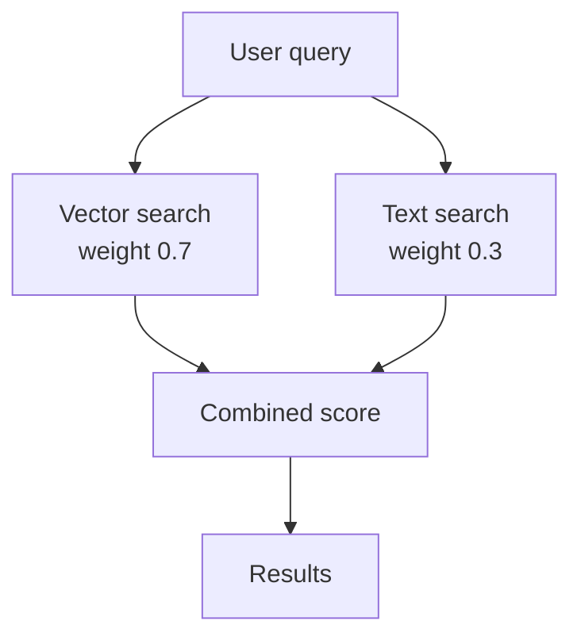
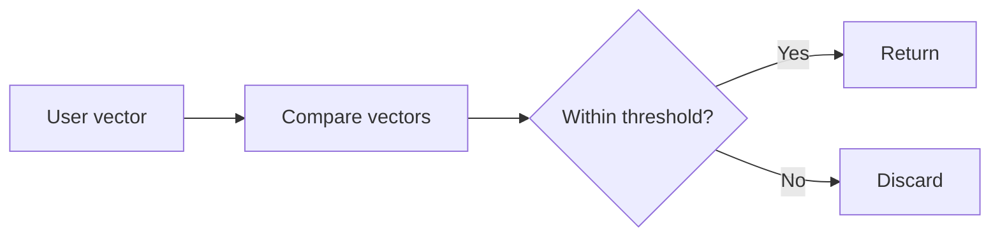
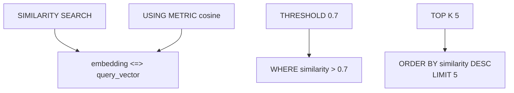

These are examples of **vector-database query syntax**. I'll ignore the comments and explain what each word/operator means.

> **Important:** `SIMILARITY SEARCH`, `RANGE SEARCH`, `HYBRID SEARCH`, `BATCH SIMILARITY SEARCH`, and `GEOMETRIC_MEDIAN()` are **not standard PostgreSQL/pgvector SQL syntax**. They represent a conceptual/vector-database query language. PostgreSQL + pgvector uses SQL such as `ORDER BY embedding <=> query_vector`.

---

# 1. General vector-search structure

```sql
SELECT subspace
FROM collection_name.table_name
VECTOR_OPERATION operation_parameters
WHERE metadata_filters
USING METRIC distance_metric
LIMIT top_k
```

Think of it as:


### `SELECT`

```sql
SELECT subspace
```

Means:

> What information do I want returned?

`subspace` is a placeholder for the columns/data you want.

---

### `FROM`

```sql
FROM collection_name.table_name
```

Means:

> Which data collection/table should I search?

For example:

```sql
FROM ecommerce.product_vectors
```

means:

```text
ecommerce = schema/namespace
product_vectors = table
```

---

### `VECTOR_OPERATION`

This represents the operation you want to perform on vectors.

Examples:

```text
SIMILARITY SEARCH
RANGE SEARCH
HYBRID SEARCH
BATCH SIMILARITY SEARCH
```

---

### `WHERE`

Filters normal metadata.

For example:

```sql
WHERE category = 'electronics'
```

means:

> Only search products whose category is electronics.

---

### `USING METRIC`

Specifies how vector distance/similarity should be calculated.

Examples:

```text
cosine
euclidean
```

---

### `LIMIT`

Controls how many results are returned.

```sql
LIMIT 10
```

means:

> Return at most 10 results.

---

# 2. Similarity search

```sql
SELECT *
FROM ecommerce.product_vectors
SIMILARITY SEARCH [1.2, 0.8, -0.2, 0.5]
USING METRIC cosine
TOP K 10;
```

The idea is:

> Find the 10 products whose vectors are most similar to this vector.

```text
query vector
     │
     ▼
[1.2, 0.8, -0.2, 0.5]
     │
     ▼
compare against product vectors
     │
     ▼
cosine distance/similarity
     │
     ▼
top 10
```

### `*`

```sql
SELECT *
```

`*` means:

> Return all columns.

---

### `ecommerce.product_vectors`

```sql
FROM ecommerce.product_vectors
```

Two names separated by `.`:

```text
ecommerce
    ↓
schema / namespace

product_vectors
    ↓
table
```

---

### `SIMILARITY SEARCH`

Means:

> Find vectors that are similar to the supplied vector.

The supplied vector is:

```text
[1.2, 0.8, -0.2, 0.5]
```

It has **4 dimensions**:

```text
dimension 1 → 1.2
dimension 2 → 0.8
dimension 3 → -0.2
dimension 4 → 0.5
```

---

### `USING METRIC cosine`

Use **cosine distance/similarity** to compare vectors.

Cosine compares the **direction** of vectors rather than simply their physical distance.

---

### `TOP K 10`

Means:

> Return the best 10 matching vectors.

`K` means the number of nearest results you want.

```text
TOP K 5  → 5 results
TOP K 10 → 10 results
TOP K 100 → 100 results
```

---

# 3. Similarity + threshold + metadata filter

```sql
SELECT *
FROM ecommerce.product_vectors
SIMILARITY SEARCH [1.2, 0.8, -0.2, 0.5]
THRESHOLD 0.8
USING METRIC euclidean
WHERE category = 'electronics' AND price < 1000
TOP K 5;
```

This means:

> Search electronic products costing less than 1000, compare their vectors using Euclidean distance, apply a threshold of 0.8, and return up to 5 results.

---

## `THRESHOLD 0.8`

A threshold establishes a cutoff.

Conceptually:

```text
similarity/distance
       │
       ▼
   threshold
       │
   ┌───┴───┐
   │       │
passes   fails
   │       │
   ▼       X
 results
```

**Important:** whether `0.8` means "greater than 0.8" or "less than 0.8" depends on the database's definition of the metric/query syntax.

That's especially important with **Euclidean distance**, because smaller distance means closer.

---

## `USING METRIC euclidean`

Use Euclidean distance.

For two vectors:

```text
A = [a₁, a₂]
B = [b₁, b₂]
```

Euclidean distance is:

```text
√((a₁-b₁)² + (a₂-b₂)²)
```

So:

```text
distance = 0
```

means the vectors are identical.

---

## `WHERE category = 'electronics'`

```sql
category = 'electronics'
```

means:

> The `category` column must equal the text `"electronics"`.

---

## `AND`

```sql
AND price < 1000
```

means **both conditions must be true**:

```text
category = electronics
        AND
price < 1000
```

So:

```text
Electronics + $500    ✅
Electronics + $1500  ❌
Clothing + $500      ❌
```

---

# 4. Hybrid search

```sql
HYBRID SEARCH (
    VECTOR [1.2, 0.8, -0.2] WEIGHT 0.7,
    TEXT "machine learning" WEIGHT 0.3
)
FROM research.paper_vectors
WHERE publication_year > 2020;
```

This combines **vector search + text search**.



---

## `VECTOR`

```sql
VECTOR [1.2, 0.8, -0.2]
```

This is the semantic/vector part of the search.

---

## `WEIGHT 0.7`

Means:

> Give this component a weight of 0.7 when combining scores.

And:

```sql
TEXT "machine learning" WEIGHT 0.3
```

gives the text component a weight of `0.3`.

Conceptually:

```text
combined score
      =
vector score × 0.7
+
text score × 0.3
```

So the vector component contributes more to the combined score than the text component.

---

## `TEXT`

```sql
TEXT "machine learning"
```

means search the textual content for:

```text
machine learning
```

---

## `publication_year > 2020`

This is a metadata filter.

Only papers with:

```text
2021
2022
2023
...
```

would satisfy it.

---

# 5. Range search

```sql
SELECT *
FROM user_data.behavior_vectors
RANGE SEARCH [user_vector]
THRESHOLD 0.5
USING METRIC cosine;
```

This means:

> Find vectors within a specified similarity/distance range around `user_vector`, using cosine as the metric.

The main difference from `TOP K` search is the idea of a **boundary** rather than simply asking for a fixed number of results.



---

# 6. Batch similarity search

```sql
BATCH SIMILARITY SEARCH (
    SELECT query_vectors FROM user_queries.batch_requests
)
FROM ecommerce.product_vectors
TOP K 5;
```

Instead of searching with **one query vector**, you're searching with **many query vectors**.

First:

```sql
SELECT query_vectors
FROM user_queries.batch_requests
```

gets multiple vectors.

For example:

```text
query 1 → [0.1, 0.2, ...]
query 2 → [0.8, 0.3, ...]
query 3 → [0.4, 0.9, ...]
```

Then:

```text
BATCH SIMILARITY SEARCH
          │
          ├── query 1 → top 5
          ├── query 2 → top 5
          └── query 3 → top 5
```

This is useful when you need to process many searches together.

---

# 7. `AVG()` centroid

```sql
SELECT AVG(user_vector) AS centroid
FROM analytics.user_profiles
GROUP BY user_category;
```

The idea here is:

> Calculate the average vector for each user category.

Suppose one category has:

```text
A = [1, 2]
B = [3, 4]
C = [5, 6]
```

The average is:

```text
[(1+3+5)/3, (2+4+6)/3]
```

=

```text
[3, 4]
```

So:

```text
A ─┐
B ─┼──> average → centroid
C ─┘
```

---

## `AS centroid`

```sql
AVG(user_vector) AS centroid
```

`AS` gives the calculated result a name:

```text
centroid
```

---

## `GROUP BY user_category`

This is important.

Instead of calculating one average for everyone:

```text
ALL USERS
    ↓
one centroid
```

it calculates one per category:

```text
Category A
    ↓
centroid A

Category B
    ↓
centroid B

Category C
    ↓
centroid C
```

---

# 8. Geometric median

```sql
SELECT GEOMETRIC_MEDIAN(feature_vector) AS representative
FROM analytics.product_features
GROUP BY product_category;
```

`GEOMETRIC_MEDIAN()` is intended to find a vector that represents the **central position** of a group while minimizing total distance to the group's vectors.

Conceptually:

```text
        ●
   ●         ●

        ★
      median

   ●         ●
        ●
```

`AS representative` names the resulting vector:

```text
representative
```

And:

```sql
GROUP BY product_category
```

means:

> Calculate one representative vector for each product category.

---

# 9. The important difference between these searches

|Operation|Main purpose|
|---|---|
|`SIMILARITY SEARCH`|Find vectors similar to one query|
|`THRESHOLD`|Apply a cutoff|
|`RANGE SEARCH`|Find vectors inside a distance/similarity boundary|
|`TOP K`|Return a fixed number of nearest results|
|`HYBRID SEARCH`|Combine vector + text search|
|`BATCH SIMILARITY SEARCH`|Search using many query vectors|
|`AVG()`|Calculate an average/centroid|
|`GEOMETRIC_MEDIAN()`|Find a central representative vector|

---

## One important connection to your previous pgvector code

Your previous real PostgreSQL query was:

```sql
SELECT
    ps.paper_id,
    p.title,
    ps.section_number,
    ps.content,
    1 - (ps.embedding <=> %s::vector) AS similarity
FROM paper_sections ps
JOIN papers p ON ps.paper_id = p.paper_id
WHERE 1 - (ps.embedding <=> %s::vector) > 0.7
ORDER BY similarity DESC
LIMIT 5;
```

That is the **actual pgvector/PostgreSQL way** to express the conceptual:

```sql
SIMILARITY SEARCH query_vector
USING METRIC cosine
TOP K 5
```

The mapping is roughly:



So the examples you're studying are teaching you the **conceptual vocabulary of vector databases**, while your earlier `pgvector` query shows how those concepts are actually expressed in PostgreSQL.