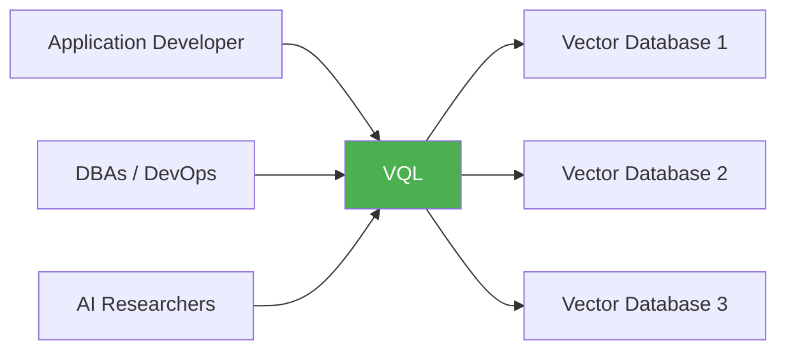
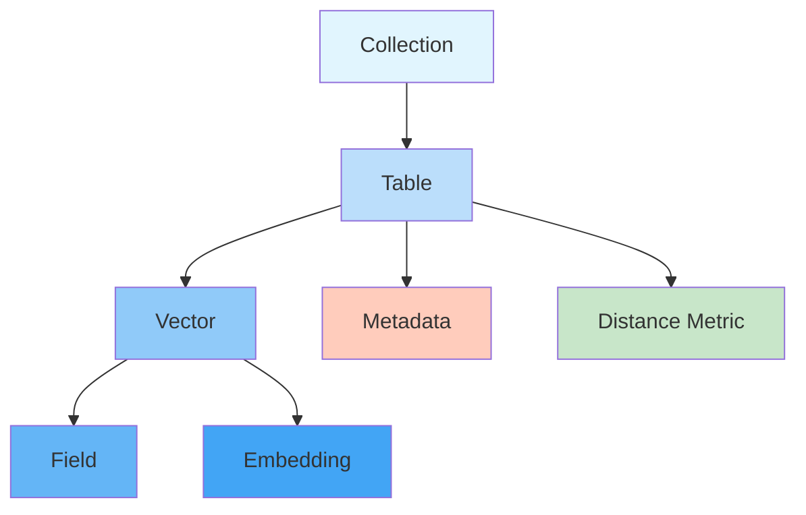
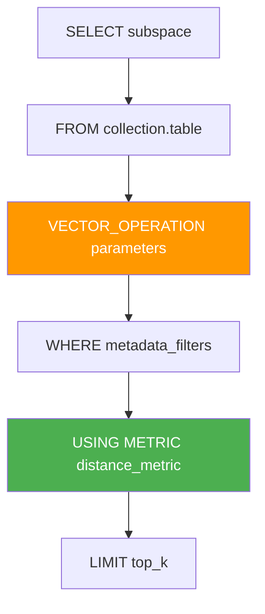
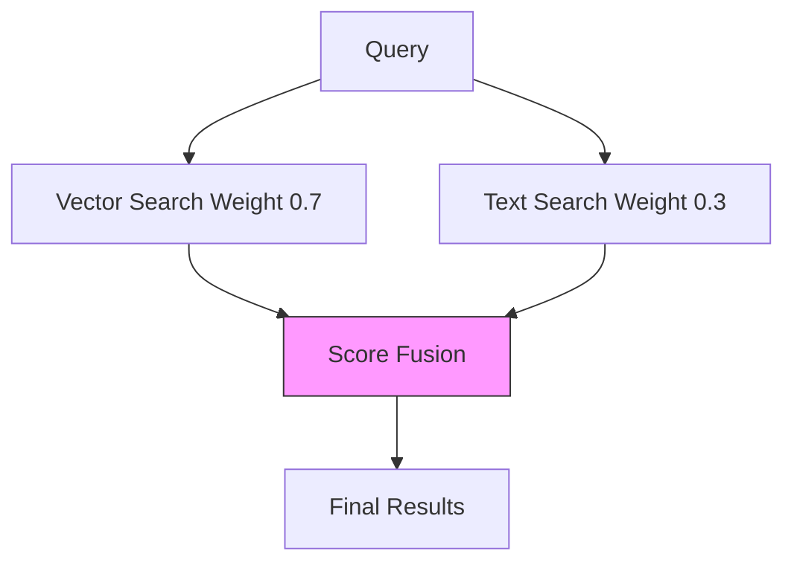
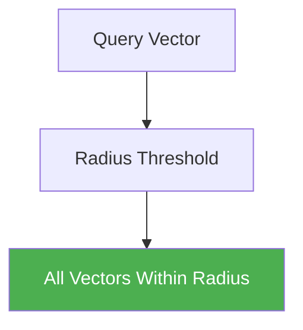
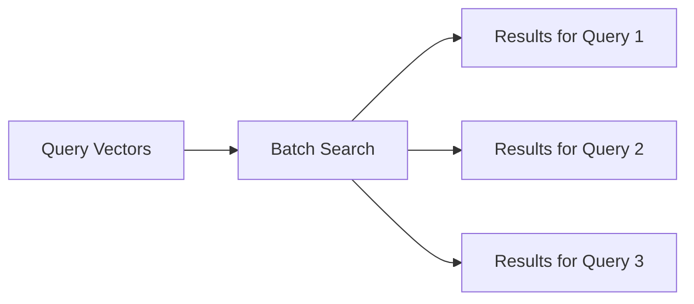
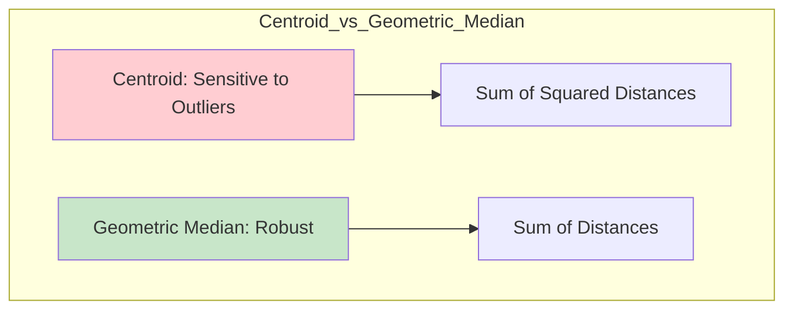

Here is a comprehensive note in Markdown format, designed to be saved directly into Obsidian. It explains the core concepts of Vector Query Language (VQL), a proposed SQL-inspired language for vector databases, using simple language, Mermaid diagrams, and SVG graphics.

---

# Vector Query Language (VQL): A SQL-Inspired Language for Vector Databases

This note explains the core concepts of **Vector Query Language (VQL)** , a hypothetical SQL-inspired query language designed for vector databases. It aims to provide a common abstraction layer across different vector database vendors, making it easier for developers, DBAs, and researchers to work with vector data.

## 1. The Big Idea: Why VQL?

Currently, every vector database (Pinecone, Weaviate, pgvector, etc.) has its own API and syntax. This ties applications to specific vendors. VQL proposes a standard, SQL-like language to solve this.

**The Goal:** Create a universal language that:
- Insulates application developers from underlying vector database implementations.
- Provides a common access layer across vendors.
- Enables researchers to write readable, maintainable scripts for vector operations.



---

## 2. Core Data Model: The Building Blocks

VQL uses a hierarchical data model similar to SQL, but optimized for vector spaces.



### Key Concepts:
- **Collection:** Top-level container (analogous to a database).
- **Table:** Structured set of vectors with metadata (analogous to a table).
- **Vector:** A numerical array with fixed dimensions.
- **Embedding:** A vector representing an encoded entity.
- **Field:** An element of the vector (like a column in a row).
- **Metadata:** Data associated with a vector (e.g., `create_date`, `author`).
- **Distance Metric:** The mathematical function used to measure similarity (e.g., cosine, Euclidean).

---

## 3. Basic Syntax Structure: The Template

VQL queries follow a familiar SQL-like structure, with a new `VECTOR_OPERATION` clause.



### The Template:
```sql
SELECT subspace
FROM collection_name.table_name
VECTOR_OPERATION operation_parameters
WHERE metadata_filters
USING METRIC distance_metric
LIMIT top_k
```

---

## 4. Vector Operations: The Heart of VQL

VQL supports a variety of vector-specific operations. Here are the core ones.

### A. Similarity Search
Find the top K most similar vectors to a query vector.


**Basic Similarity Search:**
```sql
SELECT *
FROM ecommerce.product_vectors
SIMILARITY SEARCH [1.2, 0.8, -0.2, 0.5]
USING METRIC cosine
TOP K 10;
```

**With Metadata Filtering:**
```sql
SELECT *
FROM ecommerce.product_vectors
SIMILARITY SEARCH [1.2, 0.8, -0.2, 0.5]
THRESHOLD 0.8
USING METRIC euclidean
WHERE category = 'electronics' AND price < 1000
TOP K 5;
```

### B. Hybrid Search
Combine vector similarity with traditional text search.



**Example:**
```sql
HYBRID SEARCH (
    VECTOR [1.2, 0.8, -0.2] WEIGHT 0.7,
    TEXT "machine learning" WEIGHT 0.3
)
FROM research.paper_vectors
WHERE publication_year > 2020;
```

### C. Range Search
Find all vectors within a distance threshold.



**Example:**
```sql
SELECT *
FROM user_data.behavior_vectors
RANGE SEARCH [user_vector]
THRESHOLD 0.5
USING METRIC cosine;
```

### D. Batch Operations
Process multiple query vectors simultaneously.



**Example:**
```sql
BATCH SIMILARITY SEARCH (
    SELECT query_vectors FROM user_queries.batch_requests
)
FROM ecommerce.product_vectors
TOP K 5;
```

---

## 5. Vector Functions and Aggregations

VQL provides functions for vector arithmetic and aggregation.

### A. Vector Functions
- **`DIMENSION(embedding)`**: Returns the dimensionality of a vector.
- **`DISTANCE(v1, v2, 'cosine')`**: Calculates distance between vectors.
- **`CONCAT(v1, v2)`**: Concatenates two vectors.
- **`DOT(v1, v2)`**: Calculates dot product.
- **`v1 + v2`**: Vector addition.
- **`v1 * scalar`**: Scalar multiplication.

### B. Vector Aggregations
- **`AVG(vector)`**: Computes the centroid (average vector).
- **`GEOMETRIC_MEDIAN(vector)`**: Computes the geometric median (more robust to outliers).



**Example:**
```sql
-- Compute centroids
SELECT AVG(user_vector) AS centroid
FROM analytics.user_profiles
GROUP BY user_category;

-- Find representative vectors
SELECT GEOMETRIC_MEDIAN(feature_vector) AS representative
FROM analytics.product_features
GROUP BY product_category;
```

---

## 6. Visualizing Vector Operations

Here is a visual representation of how VQL operations work in vector space.

<svg width="500" height="350" xmlns="http://www.w3.org/2000/svg">
  <!-- Background Grid -->
  <defs>
    <pattern id="grid" width="30" height="30" patternUnits="userSpaceOnUse">
      <path d="M 30 0 L 0 0 0 30" fill="none" stroke="#e0e0e0" stroke-width="1"/>
    </pattern>
  </defs>
  <rect width="100%" height="100%" fill="url(#grid)" />

  <!-- Axes -->
  <line x1="50" y1="300" x2="450" y2="300" stroke="#333" stroke-width="2" />
  <line x1="50" y1="300" x2="50" y2="50" stroke="#333" stroke-width="2" />
  <text x="460" y="315" font-family="Arial" font-size="14" fill="#333">Dimension 1</text>
  <text x="10" y="40" font-family="Arial" font-size="14" fill="#333">Dimension 2</text>

  <!-- Query Vector -->
  <circle cx="250" cy="150" r="8" fill="#FF5722" />
  <text x="260" y="145" font-family="Arial" font-size="14" font-weight="bold" fill="#FF5722">Query Vector</text>

  <!-- Similarity Search: Top K -->
  <circle cx="230" cy="170" r="6" fill="#2196F3" />
  <circle cx="270" cy="130" r="6" fill="#2196F3" />
  <circle cx="240" cy="140" r="6" fill="#2196F3" />
  <text x="280" y="125" font-family="Arial" font-size="12" fill="#2196F3">Top K Results</text>

  <!-- Range Search: Radius -->
  <circle cx="250" cy="150" r="60" fill="none" stroke="#4CAF50" stroke-width="2" stroke-dasharray="5" />
  <text x="180" y="80" font-family="Arial" font-size="12" fill="#4CAF50">Range Search Threshold</text>

  <!-- Hybrid Search: Text + Vector -->
  <circle cx="180" cy="200" r="6" fill="#9C27B0" />
  <circle cx="160" cy="220" r="6" fill="#9C27B0" />
  <text x="140" y="240" font-family="Arial" font-size="12" fill="#9C27B0">Text Match Results</text>

  <!-- Distance Line -->
  <line x1="250" y1="150" x2="230" y2="170" stroke="#FF5722" stroke-width="1" stroke-dasharray="4" />
  <text x="200" y="175" font-family="Arial" font-size="10" fill="#FF5722">Distance</text>
</svg>

*   **Red Dot:** Your query vector.
*   **Blue Dots:** Top K similarity search results.
*   **Green Circle:** Range search threshold (all vectors within this radius).
*   **Purple Dots:** Hybrid search text match results.

---

## 7. Summary Checklist

- [x] **VQL** is a proposed SQL-inspired language for vector databases.
- [x] **Data Model:** Collection → Table → Vector → Field/Metadata.
- [x] **Syntax:** `SELECT ... FROM ... VECTOR_OPERATION ... WHERE ... USING METRIC ... LIMIT ...`
- [x] **Operations:** Similarity Search, Hybrid Search, Range Search, Batch Search.
- [x] **Functions:** `DIMENSION`, `DISTANCE`, `CONCAT`, `DOT`, vector arithmetic.
- [x] **Aggregations:** `AVG` (centroid), `GEOMETRIC_MEDIAN` (robust representative).
- [x] **Goal:** Standardization across vector database vendors.

This language is an experiment meant to inspire community collaboration and eventually standardize how we interact with vector databases. By providing a familiar SQL-like syntax, VQL aims to democratize access to vector search capabilities.