## 1. Why Do You Need Vector Databases?

Traditional SQL databases are excellent for **structured data** (numbers, strings, dates) and **syntax-based matching** (exact keywords). However, they struggle with **unstructured data** (text, images, audio, video) and **semantic search** (understanding meaning).

### The Core Problem
- **SQL databases** match on **syntax** (exact words).
- **Vector databases** match on **semantics** (meaning).

**Example:**
- Query: *"How do I get my money back?"*
- **Keyword search** might return pages with "money" and "back" but miss "Refund Policy."
- **Semantic search** understands the intent and returns "Refund Policy," "Return and Exchange," etc.

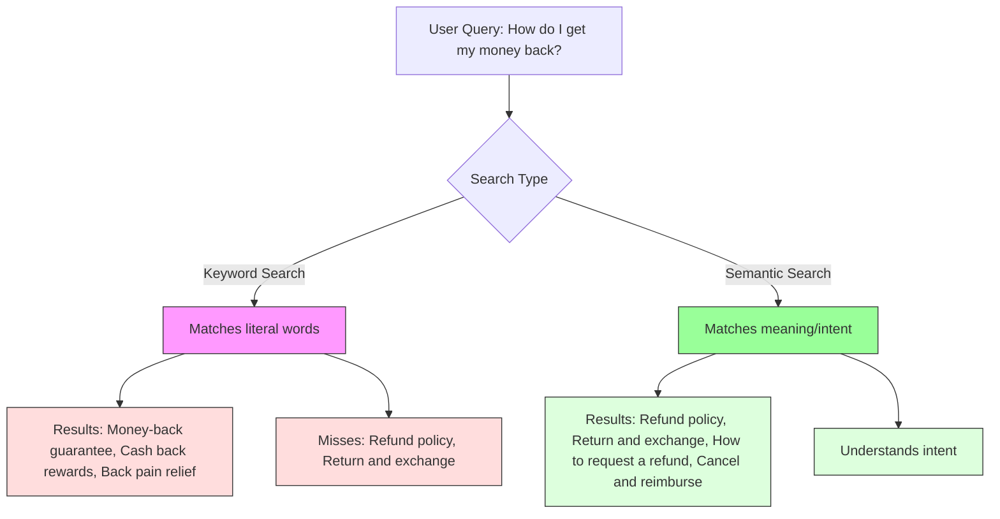

---

## 2. What is a Vector?

A **vector** is a list of floating-point numbers (e.g., `[0.1, 0.2, ..., 0.768]`). In a database, it is a new data type.

- **In Postgres**, the `pgvector` extension adds a `VECTOR` type.
- A `VECTOR(768)` column stores 768 floats.
- Each float encodes some aspect of **semantic meaning**.

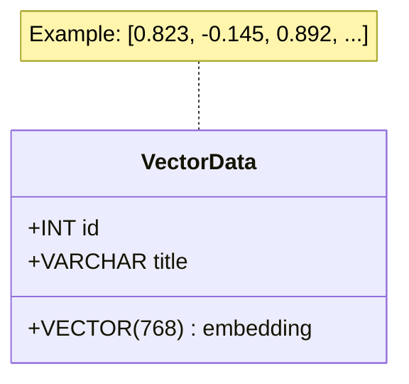

---

## 3. Embedding: The Process and the Output

**Embedding** is used as both a **verb** (the process) and a **noun** (the result).

- **Process (verb):** Mapping unstructured data (text, images) to vectors.
- **Output (noun):** The set of vectors produced.

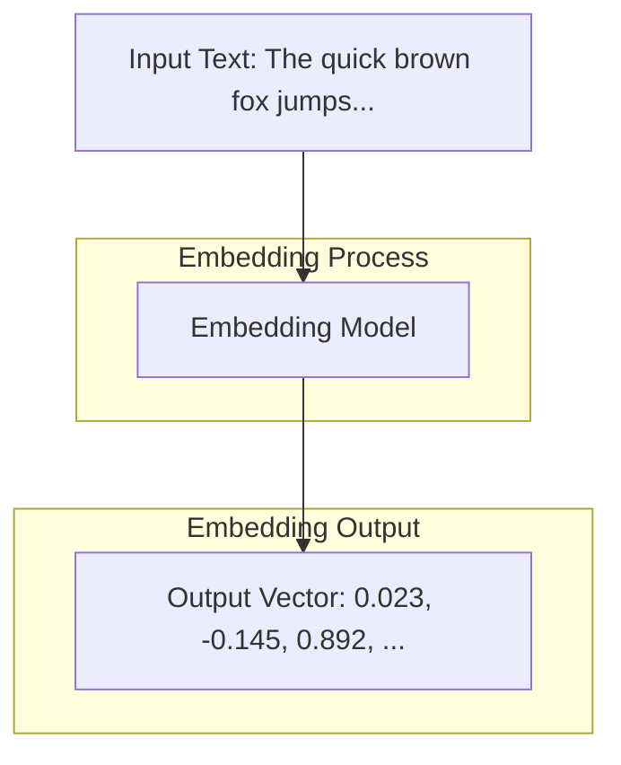

**Key Property:** Words close in meaning map to vectors close in vector space.

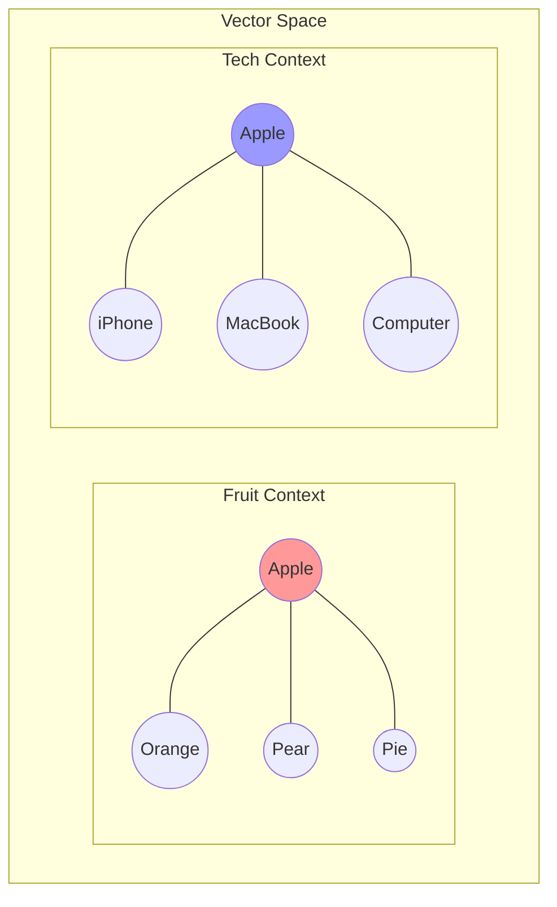

---

## 4. Key Operations on Vector Data

### 4.1 Similarity Comparison
- **Cosine Similarity:** Measures the angle between two vectors.
- **Range:** -1 to 1. Identical vectors = 1.

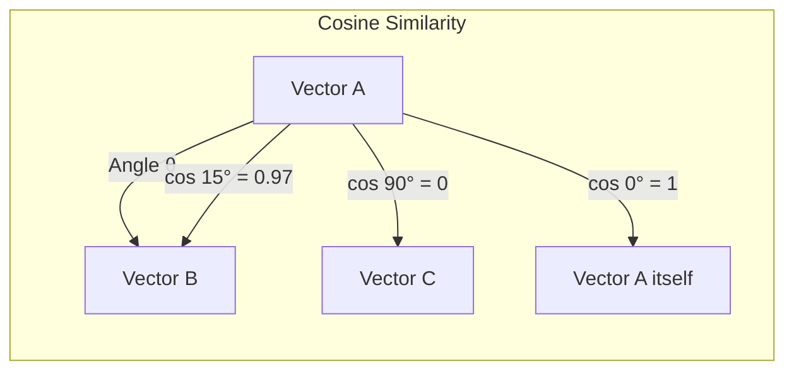

### 4.2 Nearest-Neighbor Search
- **ANN (Approximate Nearest Neighbors):** Fast, ~95% accurate.
- **Exact NN:** Slow, 100% accurate.
- **Why ANN?** GenAI is probabilistic; exact matches are not required.

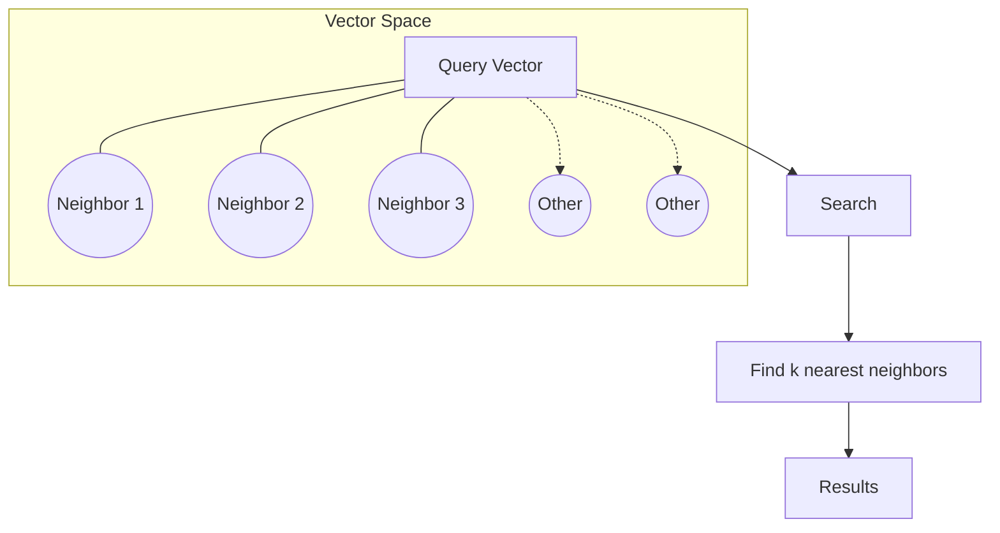

### 4.3 Vector Arithmetic
- **Famous Example:** `Vec("King") - Vec("Man") + Vec("Woman") ≈ Vec("Queen")`

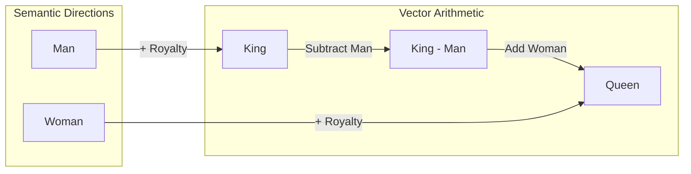

---

## 5. SQL vs. Vector Databases

| Feature | SQL Database | Vector Database |
|---------|--------------|-----------------|
| Data Type | Integers, Strings, BCD | Vectors (floats) |
| Search | Exact / Keyword | Similarity / Semantic |
| Indexing | B-tree, GIN | HNSW, IVFFlat |
| Operations | CRUD, Joins, Aggregations | Cosine, Euclidean, KNN |
| Use Case | Business data | AI, GenAI, Recommendations |

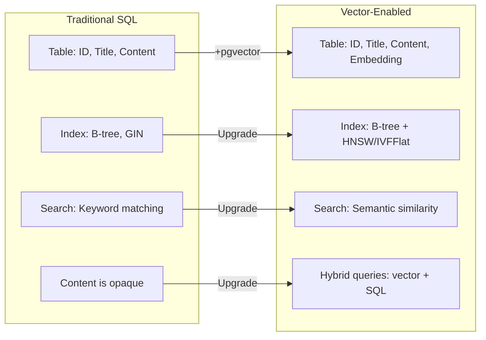

---

## 6. Hybrid Database Architecture

Most real-world systems need **both** vector data and **structured metadata**.

- **Vector Store:** Optimized for ANN search (HNSW, IVFFlat).
- **Metadata Store:** Relational tables for filtering, sorting, constraints.
- **Integration Layer:** Unified query interface (e.g., PostgreSQL + pgvector).

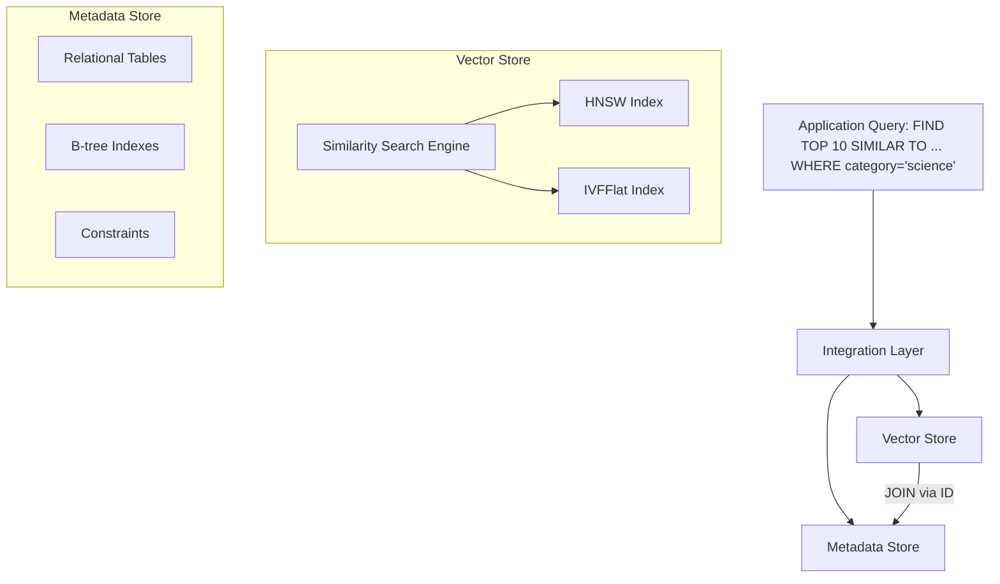

---

## 7. Use Cases

Vector databases power a wide range of applications:

- **Semantic Search:** Understands meaning, not just keywords.
- **Recommendation Systems:** Personalized content.
- **Image/Video Retrieval:** Content-based search.
- **NLP:** Text classification, sentiment analysis.
- **Anomaly Detection:** Cybersecurity, fraud.
- **Bioinformatics:** Genetic sequences.
- **Computer Vision:** Object recognition.
- **Audio Processing:** Music recommendation.
- **Chatbots:** Contextual responses.
- **Drug Discovery:** Candidate identification.
- **Financial Analysis:** Risk assessment.

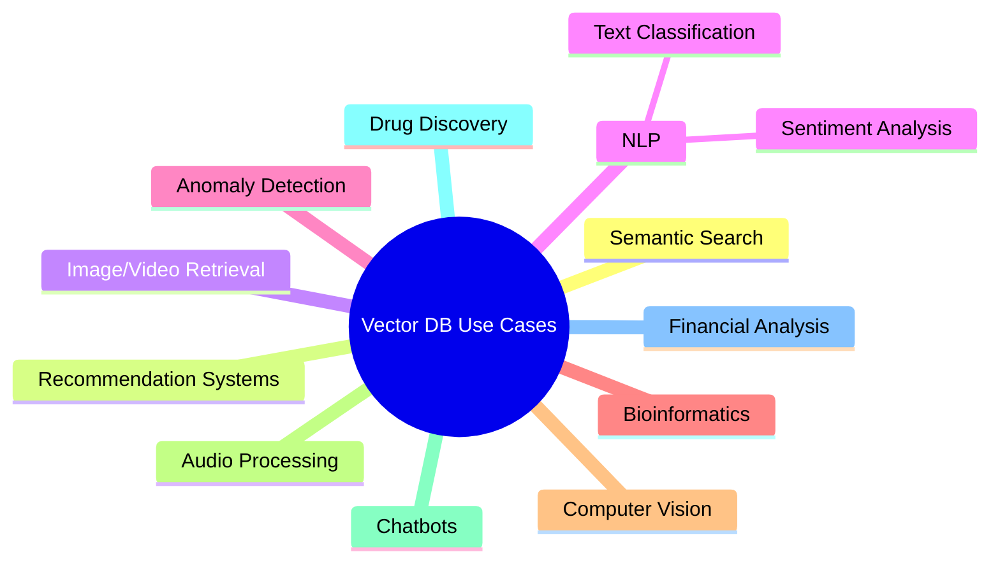

---

## 8. Summary

- **Vector databases** solve the problem of **semantic search** over unstructured data.
- **Embeddings** map data to vectors that preserve meaning.
- **Key operations:** Cosine similarity, ANN search, vector arithmetic.
- **Hybrid architecture** combines vector and relational capabilities.
- **PostgreSQL + pgvector** is a powerful, familiar choice for enterprise applications.

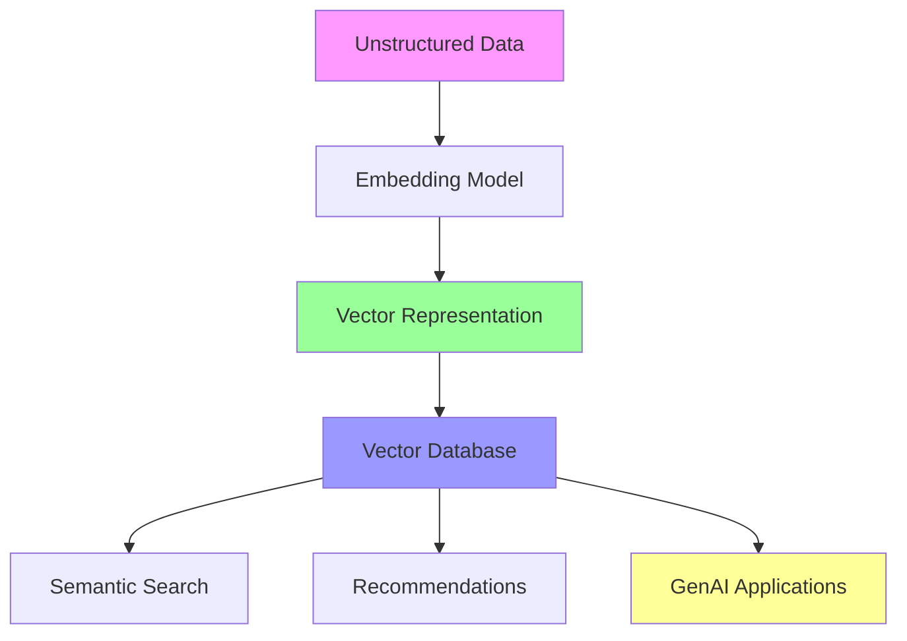