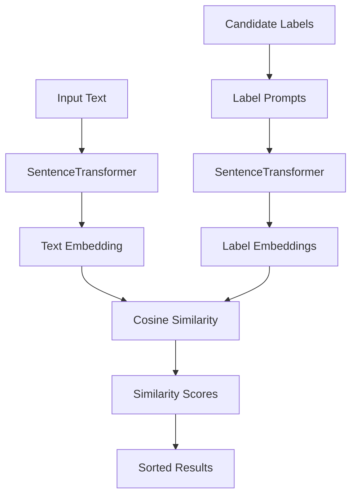
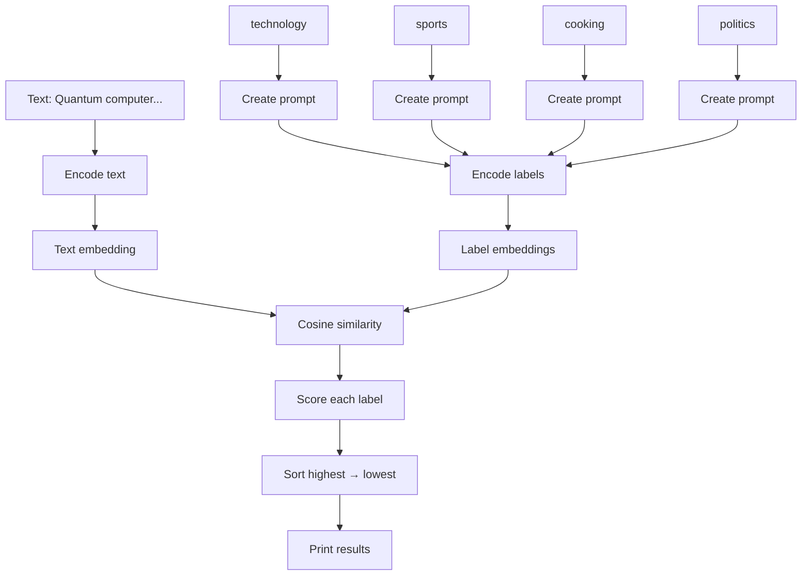

Let's use the same format: **clean code → step-by-step → each important word → small examples → Mermaid diagram → complete flow.**

# 1. Cleaned code

```python
from sentence_transformers import SentenceTransformer, util
import torch


class ZeroShotClassifier:

    def __init__(self, model_name='all-mpnet-base-v2'):
        self.model = SentenceTransformer(model_name)

    def classify(self, text, candidate_labels):
        text_embedding = self.model.encode(
            text,
            convert_to_tensor=True
        )

        label_prompts = [
            f"This text is about {label}"
            for label in candidate_labels
        ]

        label_embeddings = self.model.encode(
            label_prompts,
            convert_to_tensor=True
        )

        similarities = util.pytorch_cos_sim(
            text_embedding,
            label_embeddings
        )[0]

        results = {
            label: float(score)
            for label, score in zip(
                candidate_labels,
                similarities
            )
        }

        return results


classifier = ZeroShotClassifier()

text = "The new quantum computer can perform calculations in seconds that would take classical computers thousands of years."

labels = [
    "technology",
    "sports",
    "cooking",
    "politics"
]

results = classifier.classify(text, labels)

print("Zero-shot classification results:")

for label, score in sorted(
    results.items(),
    key=lambda x: x[1],
    reverse=True
):
    print(f"{label}: {score:.3f}")
```

---

# 2. What is this program doing?

This program performs **zero-shot text classification**.

You give it:

```text
Text:
"The new quantum computer..."
```

and labels:

```text
technology
sports
cooking
politics
```

The model has **not been specifically trained by you** for these four categories.

Instead, it compares the meaning of the text against the meaning of each label.



For example, the result might look approximately like:

```text
technology: 0.82
politics:   0.21
sports:     0.08
cooking:    0.03
```

The important idea is:

> **It determines which label has the most similar meaning to the input text.**

---

# 3. Import `SentenceTransformer` and `util`

```python
from sentence_transformers import SentenceTransformer, util
```

Let's break it down.

### `from`

Means:

> Get something from a package.

### `sentence_transformers`

The Python library.

### `import`

Bring something into your program.

### `SentenceTransformer`

Class used to load a sentence embedding model.

### `util`

A collection of useful functions.

Here we use it for:

```python
util.pytorch_cos_sim()
```

which calculates **cosine similarity**.

So:

```text
sentence_transformers
        │
        ├── SentenceTransformer
        │
        └── util
              │
              └── pytorch_cos_sim()
```

---

# 4. Import PyTorch

```python
import torch
```

### `torch`

PyTorch.

In this particular program, you don't directly write something like:

```python
torch.tensor(...)
```

but the embedding and similarity operations use PyTorch tensors internally.

---

# 5. Create the class

```python
class ZeroShotClassifier:
```

### `class`

Creates a Python class.

A class is a blueprint.

### `ZeroShotClassifier`

The name of our blueprint.

The idea is:

```text
ZeroShotClassifier
        │
        ├── model
        │
        └── classify()
```

---

# 6. The constructor

```python
def __init__(self, model_name='all-mpnet-base-v2'):
```

### `def`

Defines a function.

### `__init__`

Special function that runs when the object is created.

For example:

```python
classifier = ZeroShotClassifier()
```

automatically calls:

```python
__init__()
```

---

## `self`

```python
self
```

means:

> This particular object.

For example:

```python
classifier = ZeroShotClassifier()
```

Then:

```python
self.model
```

refers to the model belonging to `classifier`.

---

## `model_name`

```python
model_name='all-mpnet-base-v2'
```

This is a parameter.

If you don't provide one, Python uses:

```text
all-mpnet-base-v2
```

So:

```python
ZeroShotClassifier()
```

is equivalent to:

```python
ZeroShotClassifier('all-mpnet-base-v2')
```

---

# 7. Load the model

```python
self.model = SentenceTransformer(model_name)
```

This creates the SentenceTransformer model.

```text
model_name
    │
    ▼
SentenceTransformer
    │
    ▼
self.model
```

So now:

```python
self.model
```

contains the embedding model.

---

# 8. Create the `classify()` function

```python
def classify(self, text, candidate_labels):
```

This function takes two things:

```text
text
candidate_labels
```

For example:

```python
text = "Quantum computers are very powerful."

candidate_labels = [
    "technology",
    "sports",
    "cooking"
]
```

---

# 9. Encode the text

```python
text_embedding = self.model.encode(
    text,
    convert_to_tensor=True
)
```

This converts the text into an embedding.

For example:

```text
"The quantum computer is powerful."
             │
             ▼
       SentenceTransformer
             │
             ▼
[0.12, -0.42, 0.71, ...]
```

That vector represents the **semantic meaning** of the text.

---

## `encode()`

```python
self.model.encode(...)
```

means:

> Convert text into an embedding.

---

## `convert_to_tensor=True`

This tells the model:

> Return the embedding as a PyTorch tensor.

Instead of something like a NumPy array:

```text
[0.12, -0.42, 0.71, ...]
```

you get a PyTorch tensor.

This is useful because:

```python
util.pytorch_cos_sim(...)
```

works with PyTorch tensors.

---

# 10. Create label prompts

```python
label_prompts = [
    f"This text is about {label}"
    for label in candidate_labels
]
```

This is very important.

Suppose:

```python
candidate_labels = [
    "technology",
    "sports",
    "cooking",
    "politics"
]
```

The code creates:

```text
This text is about technology
This text is about sports
This text is about cooking
This text is about politics
```

Why?

Because the embedding model understands **sentences** better than isolated labels.

Instead of comparing:

```text
quantum computer
      ↓
technology
```

we compare:

```text
"The new quantum computer..."
              ↓
"This text is about technology"
```

---

# 11. Understanding the list comprehension

```python
[
    f"This text is about {label}"
    for label in candidate_labels
]
```

This is equivalent to:

```python
label_prompts = []

for label in candidate_labels:
    label_prompts.append(
        f"This text is about {label}"
    )
```

If:

```text
label = "technology"
```

then:

```python
f"This text is about {label}"
```

becomes:

```text
"This text is about technology"
```

The `f` means **formatted string**.

---

# 12. Encode the labels

```python
label_embeddings = self.model.encode(
    label_prompts,
    convert_to_tensor=True
)
```

Now all four label prompts become embeddings.

```text
"This text is about technology"
              ↓
       [vector]

"This text is about sports"
              ↓
       [vector]

"This text is about cooking"
              ↓
       [vector]

"This text is about politics"
              ↓
       [vector]
```

So we now have:

```text
text_embedding

       +

label_embeddings
```

---

# 13. Calculate similarity

```python
similarities = util.pytorch_cos_sim(
    text_embedding,
    label_embeddings
)[0]
```

This is the mathematical heart of the program.

### `util`

The utility module we imported.

### `pytorch_cos_sim`

Means:

> Calculate cosine similarity using PyTorch.

### Cosine similarity

It measures how similar two vectors point in meaning-space.

Conceptually:

```text
Very similar
     ↗
    /
   /
  ●────────●

Less similar
  ●
   \
    \
     ●
```

A simplified interpretation:

```text
1.0  → very similar
0.5  → somewhat similar
0.0  → little similarity
-1.0 → opposite direction
```

For embeddings, the exact score should be interpreted as a **relative similarity signal**, not automatically as a probability.

---

# 14. Why `[0]`?

Suppose:

```python
util.pytorch_cos_sim(...)
```

returns something shaped like:

```text
[
    [0.82, 0.08, 0.03, 0.21]
]
```

The outer list represents the query.

```python
[0]
```

gets the first row:

```text
[0.82, 0.08, 0.03, 0.21]
```

So:

```python
similarities
```

contains one score for each label.

```text
technology → 0.82
sports     → 0.08
cooking    → 0.03
politics   → 0.21
```

---

# 15. Create the results dictionary

```python
results = {
    label: float(score)
    for label, score in zip(
        candidate_labels,
        similarities
    )
}
```

This converts the labels and scores into a dictionary.

---

## `zip()`

Suppose:

```python
candidate_labels = [
    "technology",
    "sports",
    "cooking",
    "politics"
]
```

and:

```python
similarities = [
    0.82,
    0.08,
    0.03,
    0.21
]
```

`zip()` pairs them:

```text
technology → 0.82
sports     → 0.08
cooking    → 0.03
politics   → 0.21
```

---

## `float(score)`

A PyTorch tensor value is converted into a normal Python floating-point number.

For example:

```text
tensor(0.82)
      ↓
float
      ↓
0.82
```

---

# 16. Return the results

```python
return results
```

The function sends the dictionary back.

For example:

```python
{
    "technology": 0.82,
    "sports": 0.08,
    "cooking": 0.03,
    "politics": 0.21
}
```

---

# 17. Create the classifier

```python
classifier = ZeroShotClassifier()
```

This creates an object from our class.

```text
ZeroShotClassifier
        │
        ▼
   classifier
        │
        └── model
             ↓
      all-mpnet-base-v2
```

---

# 18. Give it text

```python
text = "The new quantum computer can perform calculations in seconds that would take classical computers thousands of years."
```

This is the text we want to classify.

---

# 19. Give it labels

```python
labels = [
    "technology",
    "sports",
    "cooking",
    "politics"
]
```

These are the categories we want to compare against.

Notice something important:

**We never trained the model specifically on these labels.**

That's why this is called:

> **Zero-shot classification**

---

# 20. Run classification

```python
results = classifier.classify(text, labels)
```

This calls:

```python
classify()
```

with:

```text
text
  +
labels
  ↓
classifier
  ↓
similarity scores
```

---

# 21. Print heading

```python
print("Zero-shot classification results:")
```

Simply prints:

```text
Zero-shot classification results:
```

---

# 22. Sort the results

```python
for label, score in sorted(
    results.items(),
    key=lambda x: x[1],
    reverse=True
):
```

This looks complicated, so let's break it down.

First:

```python
results.items()
```

gives pairs:

```text
("technology", 0.82)
("sports", 0.08)
("cooking", 0.03)
("politics", 0.21)
```

---

## `key=lambda x: x[1]`

This tells `sorted()`:

> Sort according to the score.

For example:

```text
x = ("technology", 0.82)

x[0] → "technology"
x[1] → 0.82
```

So:

```python
lambda x: x[1]
```

means:

> Take each pair and use its second value for sorting.

---

## `reverse=True`

Normally sorting goes:

```text
small → large
```

But:

```python
reverse=True
```

makes it:

```text
large → small
```

So the highest similarity appears first.

---

# 23. Print each result

```python
print(f"{label}: {score:.3f}")
```

### `{label}`

Prints the label.

### `{score:.3f}`

Prints the score with **3 digits after the decimal point**.

For example:

```text
0.823719
```

becomes:

```text
0.824
```

---

# 24. Complete process

Here is the whole system:



---

# 25. The most important concept

The model is **not directly thinking**:

```text
"This is technology."
```

Instead, it does something closer to:

```text
TEXT
 │
 ▼
Vector
 │
 │ compare
 ▼
"This text is about technology"
 │
 ▼
Vector
 │
 ▼
Similarity = high
```

Then:

```text
TEXT
 │
 ├── compare → technology → 0.82
 ├── compare → sports     → 0.08
 ├── compare → cooking    → 0.03
 └── compare → politics   → 0.21
```

Then the highest similarity is shown first.

---

# 26. Why is this called "zero-shot"?

Normally, you might train a classifier like:

```text
Training data

Text                         Label
────────────────────────────────────
"I bought a new laptop"     technology
"The football match..."     sports
"I cooked pasta"            cooking
"Election results..."       politics
```

Then the classifier learns those categories.

But here:

```text
No category-specific training
             ↓
Pretrained embedding model
             ↓
Compare meaning
             ↓
Choose similarity
```

That's the basic idea of **zero-shot classification**.

### One-line summary

> **Your code uses a pretrained SentenceTransformer to turn both the input text and candidate-label descriptions into vectors, compares them with cosine similarity, and uses the similarity scores to determine which labels are semantically closest.**