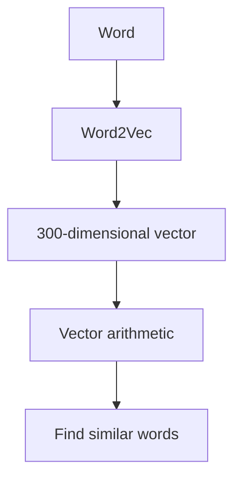
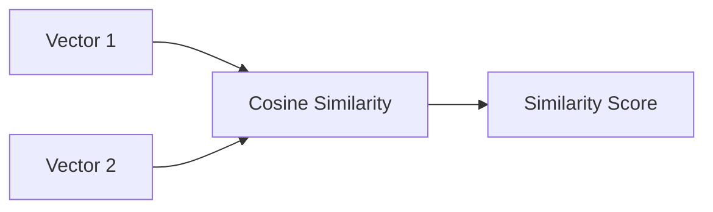
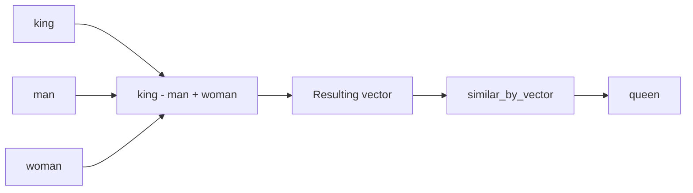
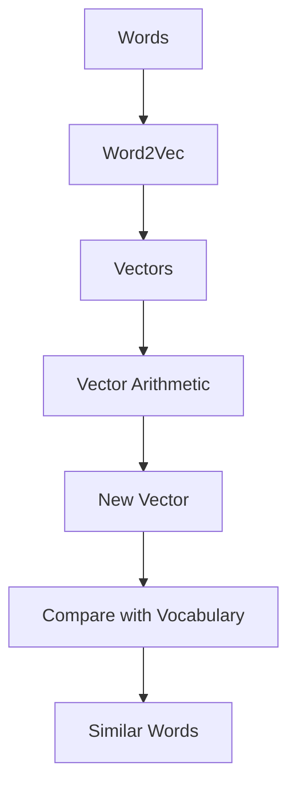

Absolutely. I’ll explain this in the same format, but first I’ll **fix the errors in the original code**. There are a few typos such as `simial_by_vector`, incorrect indentation, and malformed quotes.

# 1. What are we building?

We are building a small **Word2Vec exploration program**.

The main idea is:



For example:

```text
king - man + woman
        ↓
     queen
```

The computer doesn't actually understand the word `"king"` like a human does.

Instead:

```text
"king"
   ↓
[0.23, -0.51, 0.72, ...]
```

Word2Vec represents words as **vectors of numbers**.

---

# 2. Step 1 — Installation

```bash
pip install gensim
pip install numpy
pip install nltk
```

## `pip`

`pip` is Python's package installer.

```text
pip
 │
 └── installs Python packages
```

---

## `install`

Means:

> Download and install a package.

---

## `gensim`

A Python library containing tools for:

- Word2Vec
    
- FastText
    
- topic modeling
    
- similarity calculations
    
- other NLP algorithms
    

---

## `numpy`

A Python library for numerical calculations.

We need it for:

```python
np.array
np.zeros
np.dot
np.linalg.norm
```

---

## `nltk`

Natural Language Toolkit.

It provides tools for working with human language.

**Note:** This particular code doesn't actually use NLTK, so you can omit it unless another part of your project needs it.

---

# 3. Step 2 — Import libraries

```python
import gensim.downloader as api
import numpy as np
from typing import List, Tuple
```

Let's break this down.

---

## `import gensim.downloader as api`

### `import`

Bring a Python module into your program.

### `gensim`

The Gensim library.

### `.`

Access something inside `gensim`.

### `downloader`

Gensim's model downloader.

It lets us download pretrained models.

### `as api`

Give `gensim.downloader` the shorter name:

```python
api
```

So instead of:

```python
gensim.downloader.load(...)
```

we can write:

```python
api.load(...)
```

---

# 4. Import NumPy

```python
import numpy as np
```

`numpy` is the package.

`np` is its short name.

So:

```python
np.zeros()
```

means:

> Use NumPy's `zeros()` function.

---

# 5. Import type hints

```python
from typing import List, Tuple
```

These are used to describe what type of data a function expects or returns.

### `List`

Means a list.

Example:

```python
List[str]
```

means:

> A list containing strings.

Example:

```text
["king", "queen", "man"]
```

---

### `Tuple`

A tuple is a fixed group of values.

Example:

```python
("king", 1)
```

contains:

```text
string + number
```

---

# 6. Load the pretrained Word2Vec model

```python
word2vec_model = api.load('word2vec-google-news-300')
```

This is one of the most important lines.

### `api.load()`

Means:

> Download/load a pretrained model.

### `'word2vec-google-news-300'`

This identifies Google's pretrained Word2Vec model trained on Google News data.

The model contains **300-dimensional word vectors**.

Conceptually:

```text
"king"
   ↓
Word2Vec
   ↓
300 numbers

[0.12, -0.34, 0.51, ...]
```

---

# 7. What does "300-dimensional" mean?

Suppose we simplify the model to only 5 dimensions:

```text
king =
[0.2, 0.7, -0.1, 0.4, 0.8]
```

Real model:

```text
king =
[0.2, 0.7, -0.1, 0.4, ..., 0.8]
 ↑
300 numbers
```

So:

```python
word2vec_model.vector_size
```

will give:

```text
300
```

---

# 8. Check whether a word exists

Later we use:

```python
if word not in word2vec_model:
```

This means:

> Is this word absent from the model's vocabulary?

For example:

```python
if "king" not in word2vec_model:
```

If `"king"` exists:

```text
False
```

If it doesn't:

```text
True
```

---

# 9. `cosine_similarity()`

```python
def cosine_similarity(vec1: np.ndarray, vec2: np.ndarray) -> float:
    return np.dot(vec1, vec2) / (
        np.linalg.norm(vec1) * np.linalg.norm(vec2)
    )
```

This function calculates the similarity between two vectors.

---

## `def`

Defines a function.

---

## `cosine_similarity`

The function name.

---

## `vec1`

First vector.

For example:

```text
[0.2, 0.5, 0.8]
```

---

## `vec2`

Second vector.

```text
[0.3, 0.4, 0.7]
```

---

## `np.ndarray`

This is a NumPy array.

The type hint:

```python
vec1: np.ndarray
```

means:

> `vec1` is expected to be a NumPy array.

---

## `-> float`

Means:

> This function returns a floating-point number.

For example:

```text
0.82
```

---

# 10. How cosine similarity works

The formula is:

```text
              vec1 · vec2
similarity = ─────────────────
             |vec1| × |vec2|
```

In Python:

```python
np.dot(vec1, vec2)
```

calculates the dot product.

And:

```python
np.linalg.norm(vec1)
```

calculates the length/magnitude of the vector.

So:

```python
np.dot(vec1, vec2) / (
    np.linalg.norm(vec1) *
    np.linalg.norm(vec2)
)
```

calculates cosine similarity.

The basic idea:



---

# 11. `find_similar_words()`

```python
def find_similar_words(
    vector: np.ndarray,
    n: int = 5
) -> List[Tuple[str, float]]:
```

This function asks:

> Given a vector, which words have vectors closest to it?

---

## `vector`

The vector we want to search around.

---

## `n: int = 5`

This means:

```text
n
 ↓
integer
 ↓
default = 5
```

So if you call:

```python
find_similar_words(vector)
```

it returns 5 results.

You could also do:

```python
find_similar_words(vector, 10)
```

to request 10.

---

## Return type

```python
-> List[Tuple[str, float]]
```

means:

> Return a list of tuples containing a string and a float.

For example:

```python
[
    ("queen", 0.71),
    ("monarch", 0.65),
    ("princess", 0.63)
]
```

---

# 12. Find similar words

The original code says:

```python
word2vec_model.simial_by_vector(vector, topn=n)
```

There is a typo.

It should be:

```python
word2vec_model.similar_by_vector(vector, topn=n)
```

### `similar_by_vector()`

Means:

> Find words whose vectors are most similar to this vector.

### `topn=n`

Means:

> Return the top `n` results.

So:

```python
word2vec_model.similar_by_vector(
    vector,
    topn=5
)
```

means:

> Find the 5 words whose vectors are closest to this vector.

---

# 13. Vector arithmetic

Now we get to the interesting part.

```python
def vector_arithmetic(
    *words_and_weights: Tuple[str, float]
) -> np.ndarray:
```

This function lets us do things like:

```text
king - man + woman
```

---

## `*words_and_weights`

The `*` means:

> Accept any number of arguments.

So we can call:

```python
vector_arithmetic(
    ("king", 1),
    ("man", -1),
    ("woman", 1)
)
```

There are three arguments.

---

# 14. Why use weights?

Each word has a weight.

```text
king  → +1
man   → -1
woman → +1
```

So mathematically:

```text
king × 1
+
man × -1
+
woman × 1
```

which is:

```text
king - man + woman
```

---

# 15. Create an empty vector

```python
resulting_vector = np.zeros(
    word2vec_model.vector_size
)
```

If:

```python
word2vec_model.vector_size
```

is:

```text
300
```

then:

```python
np.zeros(300)
```

creates:

```text
[0, 0, 0, 0, 0, ..., 0]
```

with 300 zeros.

We start with zero because we are going to add vectors to it.

---

# 16. Loop through words

```python
for word, weight in words_and_weights:
```

Suppose:

```python
words_and_weights = [
    ("king", 1),
    ("man", -1),
    ("woman", 1)
]
```

The loop does:

```text
word = "king"    weight = 1
word = "man"     weight = -1
word = "woman"   weight = 1
```

---

# 17. Check vocabulary

```python
if word not in word2vec_model:
    raise ValueError(
        f"Word '{word}' not found in vocabulary"
    )
```

This checks whether the model knows the word.

If not:

```python
raise ValueError(...)
```

stops the function and produces an error.

For example:

```text
Word 'xyzabc' not found in vocabulary
```

---

# 18. Add the weighted vector

```python
resulting_vector += weight * word2vec_model[word]
```

This is the actual vector arithmetic.

Suppose:

```text
king  = [0.8, 0.2, 0.5]
man   = [0.3, 0.1, 0.4]
woman = [0.2, 0.7, 0.6]
```

Then:

```text
king - man + woman
```

becomes:

```text
[0.8, 0.2, 0.5]
-
[0.3, 0.1, 0.4]
+
[0.2, 0.7, 0.6]
```

Result:

```text
[0.7, 0.8, 0.7]
```

The real Word2Vec vectors have 300 dimensions.

---

# 19. Return the vector

```python
return resulting_vector
```

The function gives back the calculated vector.

---

# 20. `print_analogy_results()`

```python
def print_analogy_results(
    result_vector: np.ndarray,
    original_words: List[str],
    n_results: int = 5
):
```

This function doesn't perform the arithmetic.

Instead, it:

1. Finds similar words
    
2. Prints them nicely
    
3. Removes the original words
    

---

# 21. Find similar words

```python
similar_words = find_similar_words(
    result_vector,
    n_results
)
```

If our resulting vector represents something close to `"queen"`:

```text
result_vector
     ↓
similar_by_vector()
     ↓
queen
monarch
princess
...
```

---

# 22. Print the arithmetic

```python
print(
    "\nVector arithmetic:",
    " + ".join(original_words)
)
```

### `"\n"`

Means:

> Start a new line.

### `.join()`

Combines strings.

If:

```python
original_words = ["king", "man", "woman"]
```

then:

```python
" + ".join(original_words)
```

produces:

```text
king + man + woman
```

---

# 23. Loop through similar words

```python
for word, similarity in similar_words:
```

Each result looks like:

```text
("queen", 0.7118)
```

So:

```text
word       = "queen"
similarity = 0.7118
```

---

# 24. Don't show input words

```python
if word not in original_words:
```

Suppose the search returns:

```text
king
queen
man
woman
monarch
```

We don't want to show:

```text
king
man
woman
```

because those were our inputs.

So the condition removes them.

---

# 25. Print the score

```python
print(f"{word}: {similarity:.4f}")
```

`:.4f` means:

> Show 4 digits after the decimal point.

For example:

```text
0.711823
```

becomes:

```text
0.7118
```

---

# 26. Classic king–queen analogy

```python
result = vector_arithmetic(
    ("king", 1),
    ("man", -1),
    ("woman", 1)
)
```

This means:

```text
king × 1
+
man × -1
+
woman × 1
```

which is:

```text
king - man + woman
```

Conceptually:



The famous relationship is:

```text
king - man ≈ queen - woman
```

Therefore:

```text
king - man + woman ≈ queen
```

This is an **emergent property of the learned vector space**, not a hard-coded rule saying "king becomes queen."

---

# 27. Paris → France → Berlin

```python
result1 = vector_arithmetic(
    ("Paris", -1),
    ("France", 1),
    ("Berlin", 1)
)
```

Mathematically:

```text
-Paris + France + Berlin
```

or:

```text
France - Paris + Berlin
```

The idea is that the model may learn a relationship resembling:

```text
Paris → France
Berlin → Germany
```

So the resulting vector may be close to:

```text
Germany
```

---

# 28. Walking → walked

```python
result2 = vector_arithmetic(
    ("walking", -1),
    ("walked", 1),
    ("running", 1)
)
```

Conceptually:

```text
walking → walked
running → ?
```

The resulting vector may be close to:

```text
ran
```

although actual results depend on the pretrained model and vocabulary.

---

# 29. Good → better

```python
result3 = vector_arithmetic(
    ("good", -1),
    ("better", 1),
    ("bad", 1)
)
```

The intended relationship is:

```text
good → better
bad  → ?
```

and the result may be close to:

```text
worse
```

Again, Word2Vec does not guarantee perfect analogies.

---

# 30. Interactive analogy explorer

```python
def explore_custom_analogy():
```

This creates a function that lets the user type their own words.

For example:

```text
Enter word1: king
Enter word2: man
Enter word3: woman
```

The program performs:

```text
king : man :: woman : ?
```

---

# 31. `input()`

```python
word1 = input("Enter word1: ").strip()
```

### `input()`

Waits for the user to type something.

### `.strip()`

Removes unnecessary spaces from the beginning and end.

For example:

```text
"  king  "
```

becomes:

```text
"king"
```

---

# 32. `try` / `except`

```python
try:
    ...
except ValueError as e:
    ...
```

This handles errors.

For example, if the user enters a word that Word2Vec doesn't know:

```text
xyzabc
```

the program doesn't crash unexpectedly.

Instead, it can display:

```text
Error: Word 'xyzabc' not found in vocabulary
```

---

# 33. `if __name__ == "__main__"`

```python
if __name__ == "__main__":
    explore_custom_analogy()
```

This is a common Python pattern.

It means:

> Run this part when this file is executed directly.

For example:

```bash
python analogy.py
```

will run:

```python
explore_custom_analogy()
```

But if another Python file imports it:

```python
import analogy
```

the interactive tool doesn't automatically run.

---

# 34. The complete corrected program

Here is the full version with the errors fixed:

```python
import gensim.downloader as api
import numpy as np
from typing import List, Tuple


print("Loading Word2Vec model...")
word2vec_model = api.load("word2vec-google-news-300")
print("Model loaded!")


def cosine_similarity(
    vec1: np.ndarray,
    vec2: np.ndarray
) -> float:
    return np.dot(vec1, vec2) / (
        np.linalg.norm(vec1) *
        np.linalg.norm(vec2)
    )


def find_similar_words(
    vector: np.ndarray,
    n: int = 5
) -> List[Tuple[str, float]]:
    return word2vec_model.similar_by_vector(
        vector,
        topn=n
    )


def vector_arithmetic(
    *words_and_weights: Tuple[str, float]
) -> np.ndarray:

    resulting_vector = np.zeros(
        word2vec_model.vector_size
    )

    for word, weight in words_and_weights:

        if word not in word2vec_model:
            raise ValueError(
                f"Word '{word}' not found in vocabulary"
            )

        resulting_vector += (
            weight * word2vec_model[word]
        )

    return resulting_vector


def print_analogy_results(
    result_vector: np.ndarray,
    original_words: List[str],
    n_results: int = 5
):

    similar_words = find_similar_words(
        result_vector,
        n_results
    )

    print(
        "\nVector arithmetic:",
        " + ".join(original_words)
    )

    print("\nMost similar words:")

    for word, similarity in similar_words:

        if word not in original_words:
            print(
                f"{word}: {similarity:.4f}"
            )


def demonstrate_royal_analogy():

    print("\n=== Royal Analogy Demonstration ===")

    result = vector_arithmetic(
        ("king", 1),
        ("man", -1),
        ("woman", 1)
    )

    print_analogy_results(
        result,
        ["king", "man", "woman"],
        n_results=5
    )


def explore_more_analogies():

    print("\n=== More Analogy Examples ===")

    result1 = vector_arithmetic(
        ("Paris", -1),
        ("France", 1),
        ("Berlin", 1)
    )

    print("\nParis : France :: Berlin : ?")

    print_analogy_results(
        result1,
        ["Paris", "France", "Berlin"]
    )

    result2 = vector_arithmetic(
        ("walking", -1),
        ("walked", 1),
        ("running", 1)
    )

    print("\nwalking : walked :: running : ?")

    print_analogy_results(
        result2,
        ["walking", "walked", "running"]
    )

    result3 = vector_arithmetic(
        ("good", -1),
        ("better", 1),
        ("bad", 1)
    )

    print("\ngood : better :: bad : ?")

    print_analogy_results(
        result3,
        ["good", "better", "bad"]
    )


def explore_custom_analogy():

    print("\n=== Custom Analogy Explorer ===")

    print(
        "Format: word1 is to word2 "
        "as word3 is to ???"
    )

    try:

        word1 = input(
            "Enter word1: "
        ).strip()

        word2 = input(
            "Enter word2: "
        ).strip()

        word3 = input(
            "Enter word3: "
        ).strip()

        result = vector_arithmetic(
            (word1, -1),
            (word2, 1),
            (word3, 1)
        )

        print(
            f"\n{word1} : {word2} :: "
            f"{word3} : ?"
        )

        print_analogy_results(
            result,
            [word1, word2, word3]
        )

    except ValueError as e:

        print(f"Error: {e}")

        print(
            "Make sure all words are in "
            "the vocabulary!"
        )


if __name__ == "__main__":

    demonstrate_royal_analogy()

    explore_more_analogies()

    explore_custom_analogy()
```

---

# 35. The big picture

Everything in this program revolves around one idea:



For the famous analogy:

```text
             Word2Vec space

                  king
                   │
                   │
              - man
                   │
                   ▼
             + woman
                   │
                   ▼
                result
                   │
                   │ similarity search
                   ▼
                 queen
```

### The core formula

```text
king - man + woman ≈ queen
```

But remember:

> **Word2Vec is learning statistical patterns from text. The vectors are not manually given meanings such as "gender", "royalty", or "country." Those relationships emerge from the training data.**

And one important distinction from your previous **SentenceTransformer** example:

```text
Word2Vec
   ↓
one vector per word
   ↓
"bank" has one main vector
```

whereas modern sentence-transformer models produce embeddings for larger pieces of text:

```text
SentenceTransformer
   ↓
sentence / paragraph
   ↓
one embedding representing that text
```

That distinction becomes very important when you move from **Word2Vec → embeddings → RAG → Transformers → LLMs**.