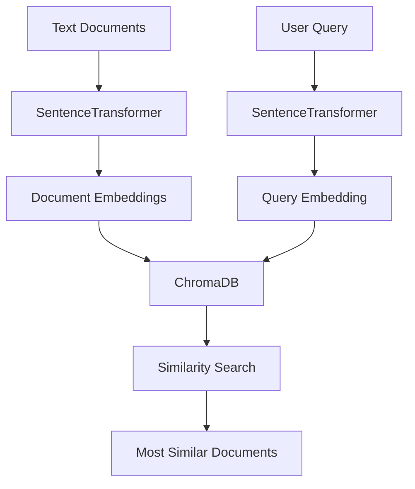
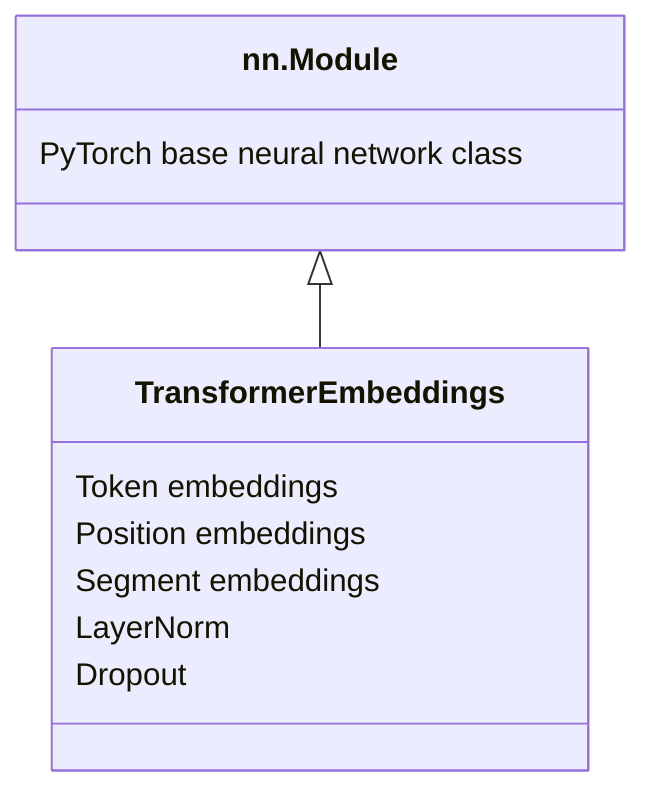
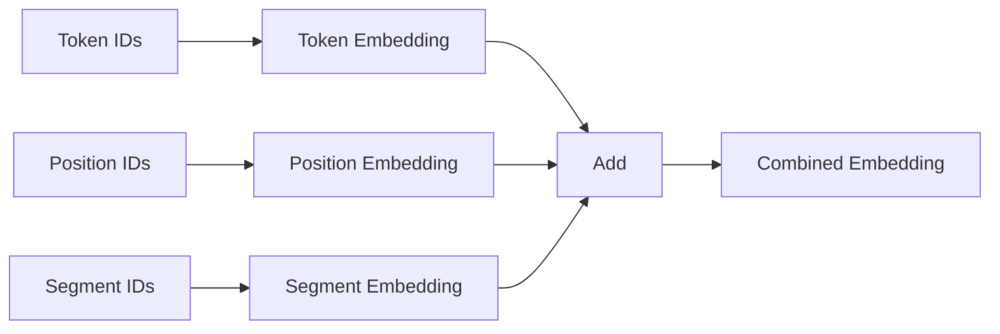
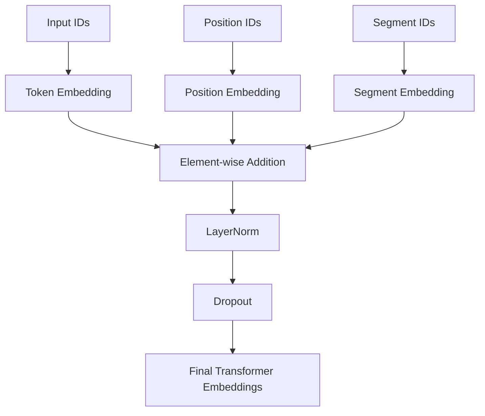

Absolutely. First, here is your code **without comments**, with the broken line wrapping fixed:

```python
from sentence_transformers import SentenceTransformer
from chromadb import Client, Settings
import chromadb

model = SentenceTransformer('all-MiniLM-L6-v2')

chroma_client = Client(Settings(is_persistent=False))
collection = chroma_client.create_collection(name="climate_docs")

documents = [
    "Climate change is affecting global weather patterns, causing more extreme events.",
    "Rising sea levels threaten coastal communities worldwide.",
    "Greenhouse gas emissions continue to rise despite international agreements."
]

embeddings = model.encode(documents)

collection.add(
    embeddings=[e.tolist() for e in embeddings],
    documents=documents,
    ids=[f"doc_{i}" for i in range(len(documents))]
)

query = "How does climate change affect weather?"
query_embedding = model.encode(query)

results = collection.query(
    query_embeddings=[query_embedding.tolist()],
    n_results=2
)

for doc in results['documents'][0]:
    print(f"Retrieved document: {doc}")
```

Now let's explain **each important word**, step by step.

---

# 1. Import SentenceTransformer

```python
from sentence_transformers import SentenceTransformer
```

### Each word

|Word|Meaning|
|---|---|
|`from`|Get something from a Python package|
|`sentence_transformers`|Python library for converting text into embeddings|
|`import`|Bring something into your program|
|`SentenceTransformer`|A class used to load an embedding model|

Think:

```text
sentence_transformers
        │
        └── SentenceTransformer
                │
                ▼
          loads embedding model
```

So:

```python
SentenceTransformer(...)
```

means:

> "Create a SentenceTransformer model."

---

# 2. Import ChromaDB classes

```python
from chromadb import Client, Settings
```

|Word|Meaning|
|---|---|
|`from`|Get something from|
|`chromadb`|Vector database library|
|`import`|Bring into program|
|`Client`|Object used to communicate with ChromaDB|
|`Settings`|Configuration options for ChromaDB|

So:

```python
Client
```

is basically your **connection/interface to ChromaDB**.

---

# 3. Import chromadb

```python
import chromadb
```

|Word|Meaning|
|---|---|
|`import`|Load a Python module|
|`chromadb`|ChromaDB Python package|

In **this particular code**, you actually don't directly use `chromadb`.

You could remove:

```python
import chromadb
```

and the program would still work.

---

# 4. Create the embedding model

```python
model = SentenceTransformer('all-MiniLM-L6-v2')
```

This is very important.

### `model`

A Python variable.

You are saying:

```text
model
  ↓
SentenceTransformer
  ↓
all-MiniLM-L6-v2
```

---

### `=`

Assignment operator.

```python
model = something
```

means:

> Put `something` inside the variable `model`.

---

### `SentenceTransformer`

The class we imported earlier.

```python
SentenceTransformer(...)
```

creates a SentenceTransformer model.

---

### `'all-MiniLM-L6-v2'`

The name of the pretrained model.

This model takes text such as:

```text
"Climate change affects weather."
```

and converts it into numbers:

```text
[0.12, -0.43, 0.87, ...]
```

Those numbers are called an **embedding**.

---

# 5. Create ChromaDB client

```python
chroma_client = Client(Settings(is_persistent=False))
```

Let's break it from the inside outward.

## `is_persistent=False`

```python
Settings(is_persistent=False)
```

### `Settings`

Creates configuration settings.

### `is_persistent`

Means:

> Should ChromaDB permanently save the data?

### `False`

Means:

> No.

Therefore:

```python
is_persistent=False
```

means:

> Keep the database in memory rather than permanently storing it.

---

## `Client`

```python
Client(...)
```

creates a ChromaDB client.

So:

```python
chroma_client = Client(...)
```

means:

> Create a ChromaDB client and store it in `chroma_client`.

The structure is:

```text
Settings
   │
   │ is_persistent=False
   ▼
Client
   │
   ▼
chroma_client
```

---

# 6. Create a collection

```python
collection = chroma_client.create_collection(name="climate_docs")
```

### `collection`

Variable that will hold our ChromaDB collection.

### `chroma_client`

Our ChromaDB client.

### `.`

The dot means:

> Access something belonging to this object.

So:

```python
chroma_client.create_collection
```

means:

> Use the `create_collection` function belonging to `chroma_client`.

### `create_collection`

Creates a collection in ChromaDB.

A collection is similar to a **table/container for documents**.

### `name=`

Keyword argument.

### `"climate_docs"`

Name we give the collection.

So:

```python
name="climate_docs"
```

means:

> Call this collection `climate_docs`.

---

# 7. Create documents

```python
documents = [
    "Climate change is affecting global weather patterns, causing more extreme events.",
    "Rising sea levels threaten coastal communities worldwide.",
    "Greenhouse gas emissions continue to rise despite international agreements."
]
```

### `documents`

A variable.

### `=`

Assign.

### `[ ]`

A Python **list**.

Inside the list are three strings.

```text
documents
   │
   ├── document 0
   ├── document 1
   └── document 2
```

---

# 8. Create embeddings

```python
embeddings = model.encode(documents)
```

### `embeddings`

Variable containing the resulting vectors.

### `model`

Our SentenceTransformer model.

### `.`

Access a method belonging to `model`.

### `encode`

Convert text into embeddings.

### `documents`

The text we want to convert.

So:

```python
model.encode(documents)
```

means:

> Convert all three documents into numerical vectors.

Conceptually:

```text
DOCUMENT
   │
   ▼
SentenceTransformer
   │
   ▼
EMBEDDING
   │
   ▼
[0.12, -0.43, 0.87, ...]
```

---

# 9. Add data to ChromaDB

```python
collection.add(
```

### `collection`

Our ChromaDB collection.

### `.`

Access a method.

### `add`

Store data inside the collection.

---

# 10. Store embeddings

```python
embeddings=[e.tolist() for e in embeddings]
```

This line looks complicated, so let's break it apart.

First:

```python
for e in embeddings
```

means:

> Take each embedding one at a time and call it `e`.

For example:

```text
embeddings
    │
    ├── e = embedding 1
    ├── e = embedding 2
    └── e = embedding 3
```

Then:

```python
e.tolist()
```

means:

> Convert `e` into a normal Python list.

The whole thing:

```python
[e.tolist() for e in embeddings]
```

means:

> For every embedding, convert it to a Python list.

It is equivalent to:

```python
converted = []

for e in embeddings:
    converted.append(e.tolist())
```

---

# 11. Store documents

```python
documents=documents
```

The first `documents` is the **argument name**.

The second `documents` is your **variable**.

So:

```python
documents=documents
```

means:

```text
ChromaDB's documents argument
             │
             ▼
       your documents
```

---

# 12. Create IDs

```python
ids=[f"doc_{i}" for i in range(len(documents))]
```

This creates:

```python
["doc_0", "doc_1", "doc_2"]
```

Let's break it down.

### `len(documents)`

`len` means:

> Find how many items there are.

We have 3 documents:

```python
len(documents)
```

returns:

```text
3
```

---

### `range(3)`

Creates numbers:

```text
0
1
2
```

---

### `i`

A temporary variable.

It becomes:

```text
i = 0
i = 1
i = 2
```

---

### `f"doc_{i}"`

The `f` means **formatted string**.

If:

```python
i = 0
```

then:

```python
f"doc_{i}"
```

becomes:

```text
"doc_0"
```

Therefore:

```python
[f"doc_{i}" for i in range(len(documents))]
```

produces:

```python
["doc_0", "doc_1", "doc_2"]
```

These are unique IDs for ChromaDB.

---

# 13. Query

```python
query = "How does climate change affect weather?"
```

### `query`

Variable containing the user's question.

### `=`

Assign the question to `query`.

---

# 14. Convert query into embedding

```python
query_embedding = model.encode(query)
```

The same model converts the question into a vector.

```text
"How does climate change affect weather?"
                 │
                 ▼
       SentenceTransformer
                 │
                 ▼
          query embedding
```

Now we can compare this vector with the document vectors.

---

# 15. Search ChromaDB

```python
results = collection.query(
```

### `results`

Variable that will contain the search results.

### `collection.query`

Ask ChromaDB:

> Find documents similar to this query.

---

# 16. Query embedding

```python
query_embeddings=[query_embedding.tolist()],
```

### `query_embedding`

The numerical vector for our question.

### `.tolist()`

Convert it into a Python list.

### `[ ... ]`

Put the vector inside another list.

Why?

Because ChromaDB's `query_embeddings` expects **a list of embeddings**, even when you're searching with only one query.

---

# 17. Number of results

```python
n_results=2
```

### `n_results`

Means:

> How many similar documents should ChromaDB return?

```python
n_results=2
```

means:

> Return the 2 most similar documents.

---

# 18. Get documents from results

```python
for doc in results['documents'][0]:
```

This is another important line.

### `for`

Loop through items.

### `doc`

Temporary variable representing one retrieved document.

### `in`

Means:

> Take items from.

### `results`

The result returned by ChromaDB.

### `['documents']`

Get the documents from the result.

Conceptually:

```text
results
   │
   └── documents
          │
          └── retrieved documents
```

### `[0]`

Get the first query's results.

Because ChromaDB returns results in a structure similar to:

```python
[
    [
        "document 1",
        "document 2"
    ]
]
```

The first `[0]` gets:

```python
[
    "document 1",
    "document 2"
]
```

---

# 19. Print the result

```python
print(f"Retrieved document: {doc}")
```

### `print`

Display something in the terminal.

### `f`

Formatted string.

### `"Retrieved document: {doc}"`

The `{doc}` is replaced with the actual document.

For example:

```text
Retrieved document: Climate change is affecting global weather patterns, causing more extreme events.
```

---

# Complete flow

The entire program is doing this:



The key idea is:

```text
DOCUMENT
   ↓
EMBEDDING
   ↓
CHROMADB
   ↑
   │
QUERY → EMBEDDING
   ↓
SIMILARITY SEARCH
   ↓
RELEVANT DOCUMENTS
```

So this code is basically a **small semantic search system**:

> **Text → embeddings → store → query → find similar text.**


Yes — let's use the same format.

## 1. Cleaned code

Your code has indentation and line-break problems, so here is the properly formatted version **without comments**:

```python
import torch
import torch.nn as nn

class TransformerEmbeddings(nn.Module):

    def __init__(self, vocab_size, embedding_dim, max_sequence_length):
        super().__init__()

        self.token_embeddings = nn.Embedding(
            vocab_size,
            embedding_dim
        )

        self.position_embeddings = nn.Embedding(
            max_sequence_length,
            embedding_dim
        )

        self.segment_embeddings = nn.Embedding(
            2,
            embedding_dim
        )

        self.layer_norm = nn.LayerNorm(embedding_dim)
        self.dropout = nn.Dropout(0.1)

    def forward(self, input_ids, segment_ids=None):

        seq_length = input_ids.size(1)

        position_ids = torch.arange(
            seq_length,
            device=input_ids.device
        )

        position_ids = position_ids.unsqueeze(0).expand_as(input_ids)

        if segment_ids is None:
            segment_ids = torch.zeros_like(input_ids)

        embeddings = (
            self.token_embeddings(input_ids)
            + self.position_embeddings(position_ids)
            + self.segment_embeddings(segment_ids)
        )

        embeddings = self.layer_norm(embeddings)
        embeddings = self.dropout(embeddings)

        return embeddings
```

---

# 2. What is this code doing?

This code creates a simplified **Transformer embedding layer**.

Its job is to take token IDs like:

```text
[5, 17, 42, 9]
```

and turn them into vectors that contain three types of information:

```text
Token meaning
     +
Position
     +
Segment
     ↓
Final embedding
```

---

# 3. Import PyTorch

```python
import torch
```

|Word|Meaning|
|---|---|
|`import`|Bring something into Python|
|`torch`|PyTorch library|

PyTorch is a machine-learning framework.

We need it for things like:

```python
torch.arange()
torch.zeros_like()
```

and tensors.

---

# 4. Import `torch.nn`

```python
import torch.nn as nn
```

This is very similar to your previous question.

### `torch`

The main PyTorch package.

### `.`

Means:

> Go inside / access something inside.

So:

```python
torch.nn
```

means:

> The `nn` part of PyTorch.

### `nn`

Short name we give to `torch.nn`.

```python
import torch.nn as nn
```

means:

```text
torch
  │
  └── nn
       │
       ├── Embedding
       ├── LayerNorm
       ├── Dropout
       └── ...
```

Instead of writing:

```python
torch.nn.Embedding
```

we can write:

```python
nn.Embedding
```

---

# 5. Create the class

```python
class TransformerEmbeddings(nn.Module):
```

Let's break this down.

### `class`

Python keyword used to create a class.

A class is like a **blueprint**.

For example:

```text
Class
 ↓
Blueprint
 ↓
Create objects from it
```

---

### `TransformerEmbeddings`

The name of our class.

We are creating a component responsible for creating Transformer embeddings.

---

### `(nn.Module)`

This is extremely important.

```python
class TransformerEmbeddings(nn.Module):
```

means:

> Create `TransformerEmbeddings` as a PyTorch neural-network module.

`nn.Module` is the basic parent class for most PyTorch neural-network components.

Conceptually:



Because our class inherits from `nn.Module`, PyTorch knows how to treat it as a neural-network component.

---

# 6. `__init__`

```python
def __init__(self, vocab_size, embedding_dim, max_sequence_length):
```

### `def`

Python keyword used to define a function.

### `__init__`

A special Python function.

It runs when you create the object.

For example:

```python
model = TransformerEmbeddings(...)
```

Python automatically calls:

```python
__init__()
```

---

## The three inputs

```python
vocab_size
embedding_dim
max_sequence_length
```

### `vocab_size`

Number of different tokens in your vocabulary.

Example:

```text
Vocabulary:

0 → <PAD>
1 → the
2 → cat
3 → dog
4 → runs
...
```

If there are 10,000 tokens:

```python
vocab_size = 10000
```

---

### `embedding_dim`

How many numbers represent each token.

For example:

```python
embedding_dim = 4
```

could produce:

```text
cat → [0.2, -0.5, 0.8, 0.1]
```

With:

```python
embedding_dim = 768
```

each token has 768 numbers.

---

### `max_sequence_length`

Maximum number of tokens in one sequence.

For example:

```python
max_sequence_length = 128
```

means the model can represent positions:

```text
0, 1, 2, ..., 127
```

---

# 7. `super().__init__()`

```python
super().__init__()
```

This calls the constructor of the parent class:

```python
nn.Module
```

Think:

```text
TransformerEmbeddings
       │
       │ inherits
       ▼
   nn.Module
```

So:

```python
super().__init__()
```

basically tells PyTorch:

> Initialize the `nn.Module` part of this object too.

This is important because PyTorch needs to register things like trainable parameters correctly.

---

# 8. Token embeddings

```python
self.token_embeddings = nn.Embedding(
    vocab_size,
    embedding_dim
)
```

This is the first major part.

## `self`

`self` means:

> This particular object.

For example:

```python
model = TransformerEmbeddings(...)
```

Then:

```python
self.token_embeddings
```

belongs to `model`.

---

## `token_embeddings`

The name we give this embedding layer.

---

## `nn.Embedding`

PyTorch's embedding layer.

It converts:

```text
token ID
```

into:

```text
vector
```

For example:

```text
token ID
   ↓
   5
   ↓
Embedding table
   ↓
[0.2, -0.1, 0.7, 0.4]
```

If:

```python
vocab_size = 10
embedding_dim = 4
```

the embedding table has:

```text
10 × 4
```

numbers.

```text
          embedding dimension
        ┌─────────────────────┐
token 0 │ .2  .4 -.1  .8      │
token 1 │ .7 -.2  .5  .1      │
token 2 │ .3  .9  .1 -.4      │
token 3 │ ...                 │
token 4 │ ...                 │
...
token 9 │ ...                 │
        └─────────────────────┘
```

---

# 9. Position embeddings

```python
self.position_embeddings = nn.Embedding(
    max_sequence_length,
    embedding_dim
)
```

Why do we need this?

Because a Transformer needs information about **where a token appears**.

Consider:

```text
"dog bites man"
```

and:

```text
"man bites dog"
```

The same words exist, but their order is different.

So we give every position its own vector:

```text
Position 0 → vector
Position 1 → vector
Position 2 → vector
Position 3 → vector
...
```

For:

```text
"I love AI"
```

we might have:

```text
I     → position 0
love  → position 1
AI    → position 2
```

---

# 10. Segment embeddings

```python
self.segment_embeddings = nn.Embedding(
    2,
    embedding_dim
)
```

This creates embeddings for **two segments**.

Usually:

```text
Segment 0 → first part
Segment 1 → second part
```

For example, in a question-answer system:

```text
Question: What is climate change?
Context: Climate change affects weather...
```

we could represent:

```text
Question → segment 0
Context  → segment 1
```

So the model can distinguish the two parts.

---

# 11. Layer normalization

```python
self.layer_norm = nn.LayerNorm(embedding_dim)
```

### `LayerNorm`

Short for **Layer Normalization**.

It normalizes the values in the embedding.

Why?

It helps keep neural-network calculations more stable.

Conceptually:

```text
Large / uneven values
        ↓
   LayerNorm
        ↓
More controlled values
```

---

# 12. Dropout

```python
self.dropout = nn.Dropout(0.1)
```

`Dropout` is a regularization technique.

```python
0.1
```

means approximately **10%** of values are randomly dropped during training.

The idea is:

```text
Neural network
      ↓
Randomly ignore some values
      ↓
Reduce over-dependence
      ↓
Better generalization
```

---

# 13. `forward`

```python
def forward(self, input_ids, segment_ids=None):
```

This defines what happens when data enters the model.

For example:

```python
output = model(input_ids)
```

PyTorch automatically calls:

```python
forward(...)
```

---

## `input_ids`

These are token IDs.

Example:

```python
input_ids = [
    [5, 17, 42, 9]
]
```

Instead of giving the model:

```text
"The cat runs"
```

we give it numbers representing the tokens.

---

## `segment_ids=None`

`segment_ids` identifies which segment each token belongs to.

If you don't provide it:

```python
segment_ids = None
```

The code later creates zeros automatically.

---

# 14. Get sequence length

```python
seq_length = input_ids.size(1)
```

Suppose:

```python
input_ids.shape
```

is:

```text
[2, 5]
```

This means:

```text
2 sequences
5 tokens each
```

Then:

```python
input_ids.size(1)
```

gets dimension `1`:

```text
5
```

So:

```python
seq_length = 5
```

### Why `1`?

Python/PyTorch dimensions start at `0`.

```text
shape = [2, 5]
         │  │
         │  └── dimension 1
         └───── dimension 0
```

---

# 15. Create position IDs

```python
position_ids = torch.arange(
    seq_length,
    device=input_ids.device
)
```

Suppose:

```python
seq_length = 5
```

Then:

```python
torch.arange(5)
```

creates:

```text
[0, 1, 2, 3, 4]
```

These are the positions.

---

## `device=input_ids.device`

A tensor can live on:

```text
CPU
```

or:

```text
GPU
```

This says:

> Create the position IDs on the same device as `input_ids`.

So if:

```text
input_ids → GPU
```

then:

```text
position_ids → GPU
```

This prevents device mismatch errors.

---

# 16. `unsqueeze`

```python
position_ids = position_ids.unsqueeze(0)
```

Originally:

```text
[0, 1, 2, 3, 4]
```

Shape:

```text
[5]
```

After:

```python
unsqueeze(0)
```

it becomes conceptually:

```text
[[0, 1, 2, 3, 4]]
```

Shape:

```text
[1, 5]
```

### `unsqueeze`

Means:

> Add a new dimension.

---

# 17. `expand_as`

```python
position_ids = position_ids.expand_as(input_ids)
```

Suppose:

```text
input_ids:

[
 [5, 17, 42, 9, 8],
 [2, 11, 7, 3, 6]
]
```

Its shape is:

```text
[2, 5]
```

Our position IDs were:

```text
[
 [0, 1, 2, 3, 4]
]
```

`expand_as(input_ids)` expands them to match:

```text
[
 [0, 1, 2, 3, 4],
 [0, 1, 2, 3, 4]
]
```

So every sequence gets the same position numbers.

---

# 18. Check segment IDs

```python
if segment_ids is None:
```

### `if`

Conditional statement.

### `is None`

Checks whether there is no value.

So:

```python
if segment_ids is None:
```

means:

> If the user didn't provide segment IDs...

---

# 19. Create zero segment IDs

```python
segment_ids = torch.zeros_like(input_ids)
```

`zeros_like()` means:

> Create zeros with the same shape as `input_ids`.

If:

```text
input_ids =
[
 [5, 17, 42],
 [2, 11, 7]
]
```

then:

```text
segment_ids =
[
 [0, 0, 0],
 [0, 0, 0]
]
```

---

# 20. Combine the three embeddings

This is the heart of the code:

```python
embeddings = (
    self.token_embeddings(input_ids)
    + self.position_embeddings(position_ids)
    + self.segment_embeddings(segment_ids)
)
```

There are **three embeddings**.



---

## First

```python
self.token_embeddings(input_ids)
```

Converts token IDs into vectors.

```text
[5, 17, 42]
     ↓
token vectors
```

---

## Second

```python
self.position_embeddings(position_ids)
```

Converts positions into vectors.

```text
[0, 1, 2]
     ↓
position vectors
```

---

## Third

```python
self.segment_embeddings(segment_ids)
```

Converts segment IDs into vectors.

```text
[0, 0, 1]
     ↓
segment vectors
```

---

## Then `+`

The three vectors are added element-by-element:

```text
Token vector
     +
Position vector
     +
Segment vector
     ↓
Final embedding
```

For example:

```text
Token      = [0.2, 0.5, 0.1]
Position   = [0.1, 0.0, 0.3]
Segment    = [0.0, 0.2, 0.1]
             ─────────────────
Result     = [0.3, 0.7, 0.5]
```

This is how the embedding receives information about:

```text
WHAT     → token meaning
WHERE    → position
WHICH    → segment
```

---

# 21. Layer normalization

```python
embeddings = self.layer_norm(embeddings)
```

The combined embeddings are passed through LayerNorm.

```text
Combined embeddings
       ↓
   LayerNorm
       ↓
Normalized embeddings
```

---

# 22. Dropout

```python
embeddings = self.dropout(embeddings)
```

During training, Dropout randomly removes some values.

```text
Normalized embeddings
       ↓
    Dropout
       ↓
Final embeddings
```

---

# 23. Return

```python
return embeddings
```

`return` sends the final result back.

So:

```python
output = model(input_ids)
```

gives:

```text
output
  ↓
final embedding tensor
```

---

# 24. The whole process

Let's put everything together:



The most important idea is:

```text
             TOKEN
               │
               ▼
        Token Embedding
               │
               │
POSITION ──→ Position Embedding
               │
               │
SEGMENT ──→ Segment Embedding
               │
               ▼
             ADD
               │
               ▼
          LayerNorm
               │
               ▼
            Dropout
               │
               ▼
        FINAL EMBEDDING
```

### In one sentence:

> **This class converts token IDs into vectors and adds information about the token's meaning, position, and segment before normalizing and applying dropout.**


