# ArXiv RAG System 

PostgreSQL 18 + pgvector, Python 3.12 and sentence-transformers.

---

```text
fatal error: postgres.h: No such file or directory
```


`postgres.h`  **PostgreSQL server development header**. The system had partial PostgreSQL headers at:

```text
/usr/include/postgresql/18/server
```

but server development files were missing.


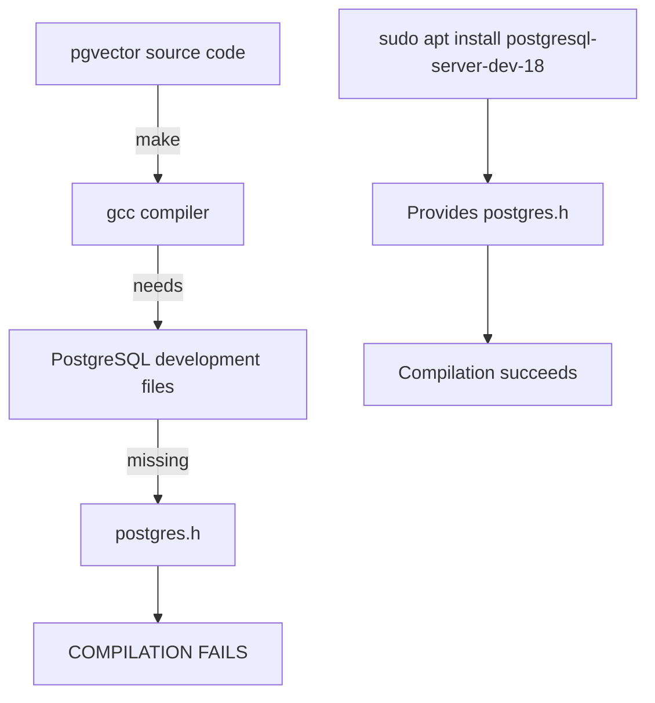
```mermaid
flowchart TD
    A[pgvector source code] -->|make| B[gcc compiler]
    B -->|needs| C[PostgreSQL development files]
    C -->|missing| D[postgres.h]
    D --> E[COMPILATION FAILS]
    
    F[sudo apt install postgresql-server-dev-18] --> G[Provides postgres.h]
    G --> H[Compilation succeeds]
```

---

| 1   | `psql --version`                                  | Check PostgreSQL version     |
| --- | ------------------------------------------------- | ---------------------------- |
| 2   | `pg_config --version`                             | Check pg_config version      |
| 3   | `pg_config --includedir-server`                   | Find server headers path     |
| 4   | `sudo apt update`                                 | Update package lists         |
| 5   | `sudo apt install postgresql-server-dev-18`       | Install dev headers          |
| 6   | `ls /usr/include/postgresql/18/server/postgres.h` | Verify installation          |
| 7   | `cd ~/pgvector && make clean && make`             | Rebuild pgvector             |
| 8   | `sudo make install`                               | Install pgvector system-wide |

### Verification

```bash
ls /usr/include/postgresql/18/server/postgres.h
# Should output: /usr/include/postgresql/18/server/postgres.h
```

---

## pgvector Installation Success output

```text
/usr/bin/install -c -m 755 vector.so \
'/usr/lib/postgresql/18/lib/vector.so'

'/usr/share/postgresql/18/extension/vector.control'
```

### Installation vs Enablement

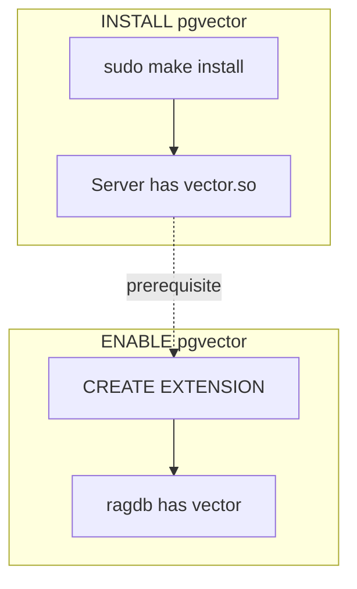
```mermaid
flowchart TD
    subgraph INSTALL["INSTALL pgvector"]
        A[sudo make install] --> B[Server has vector.so]
    end
    
    subgraph ENABLE["ENABLE pgvector"]
        C[CREATE EXTENSION] --> D[ragdb has vector]
    end
    
    B -.->|prerequisite| C
```

### Architecture After Installation

| Component | Location | Purpose |
|-----------|----------|---------|
| `vector.so` | `/usr/lib/postgresql/18/lib/` | Shared library |
| `vector.control` | `/usr/share/postgresql/18/extension/` | Extension control file |
| `vector--0.8.6.sql` | `/usr/share/postgresql/18/extension/` | SQL definitions |

### Enabling in Database

```sql
CREATE EXTENSION vector;
```

### Verification

```sql
\dx
```

Expected output:

```text
             List of installed extensions
   Name   | Version |   Schema   |        Description
----------+---------+------------+-------------------------
 plpgsql  | 1.0     | pg_catalog | PL/pgSQL procedural language
 vector   | 0.8.6   | public     | vector data type and ...
```

### Testing Vectors

```sql
CREATE TABLE test_vectors (
    id SERIAL PRIMARY KEY,
    text TEXT,
    embedding vector(3)
);

INSERT INTO test_vectors (text, embedding)
VALUES
    ('hello', '[1,0,0]'),
    ('good morning', '[0.9,0.1,0]'),
    ('cat', '[0,0,1]');

SELECT
    text,
    embedding <=> '[1,0,0]' AS distance
FROM test_vectors
ORDER BY embedding <=> '[1,0,0]'
LIMIT 3;
```


> **pgvector gives PostgreSQL ability to store and search vectors.

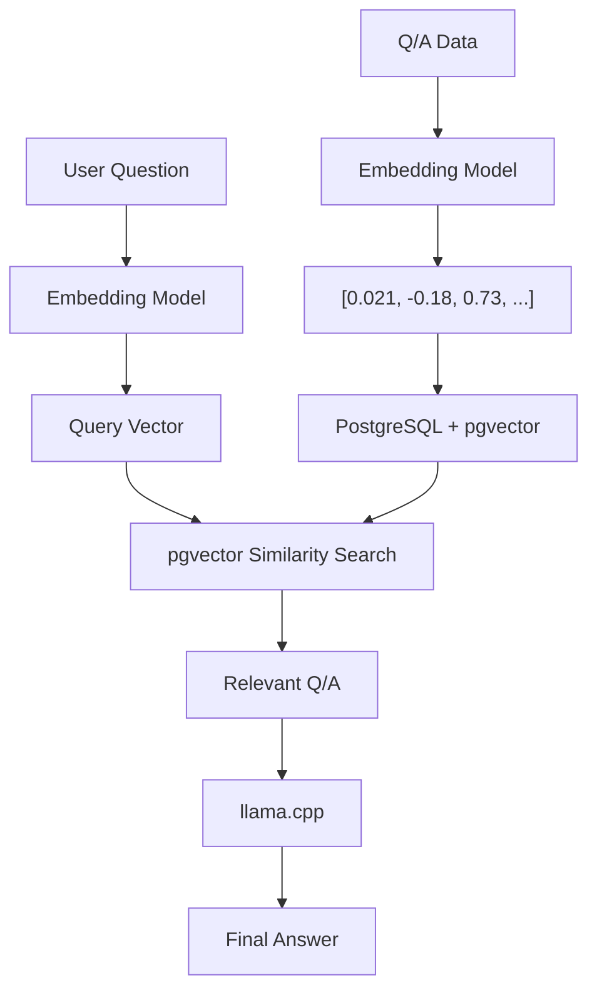
```mermaid
flowchart TD
    A[Q/A Data] --> B[Embedding Model]
    B --> C["[0.021, -0.18, 0.73, ...]"]
    C --> D[PostgreSQL + pgvector]
    
    E[User Question] --> F[Embedding Model]
    F --> G[Query Vector]
    G --> H[pgvector Similarity Search]
    D --> H
    H --> I[Relevant Q/A]
    I --> J[llama.cpp]
    J --> K[Final Answer]
```

---

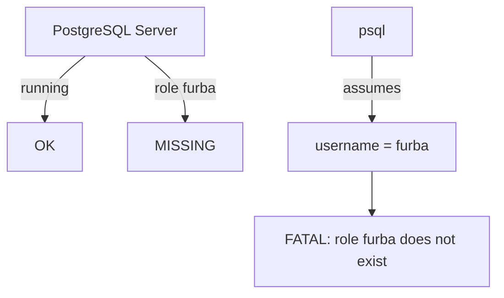
```mermaid
flowchart TD
    A[PostgreSQL Server] -->|running| B[OK]
    A -->|role furba| C[MISSING]
    
    D[psql] -->|assumes| E[username = furba]
    E --> F[FATAL: role furba does not exist]
```

### Solution

| Step | Command                                                           | Purpose                  |
| ---- | ----------------------------------------------------------------- | ------------------------ |
| 1    | `sudo -u postgres psql`                                           | Connect as administrator |
| 2    | `\du`                                                             | List all roles           |
| 3    | `CREATE ROLE furba WITH LOGIN CREATEDB PASSWORD 'your_password';` | Create role              |
| 4    | `\q`                                                              | Exit                     |
| 5    | `psql`                                                            | Test connection          |

### Database Creation Flow

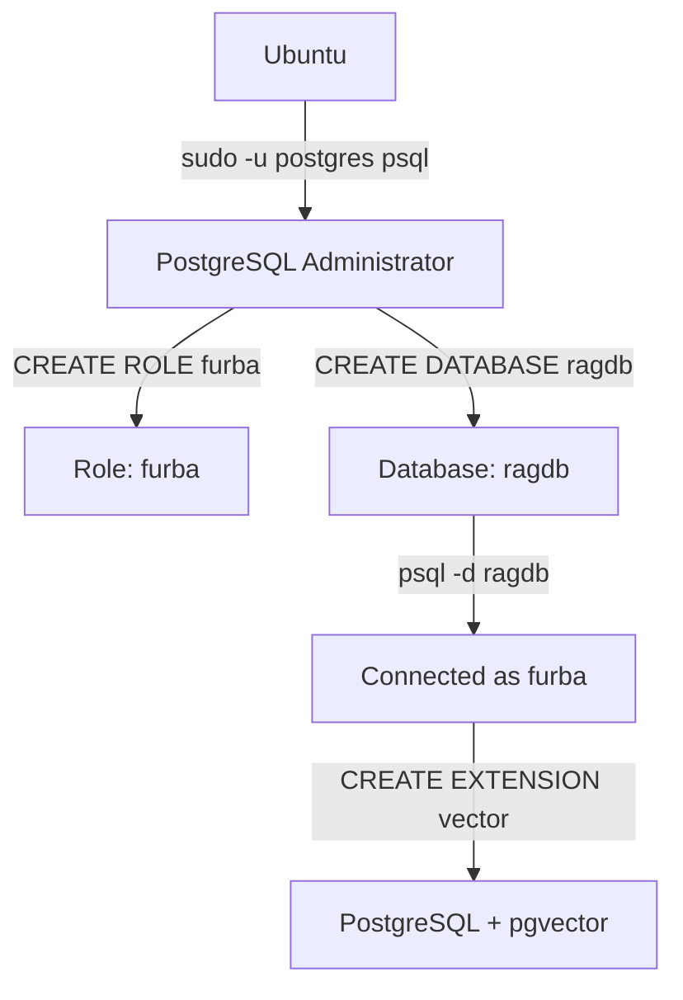
```mermaid
flowchart TD
    A[Ubuntu] -->|sudo -u postgres psql| B[PostgreSQL Administrator]
    B -->|CREATE ROLE furba| C[Role: furba]
    B -->|CREATE DATABASE ragdb| D[Database: ragdb]
    D -->|psql -d ragdb| E[Connected as furba]
    E -->|CREATE EXTENSION vector| F[PostgreSQL + pgvector]
```

```bash
sudo -u postgres psql
```

```sql
CREATE ROLE furba WITH LOGIN CREATEDB PASSWORD 'your_password';
\du
\q
```

```bash
psql
```

```sql
CREATE DATABASE ragdb;
\c ragdb
CREATE EXTENSION IF NOT EXISTS vector;
SELECT * FROM pg_extension WHERE extname = 'vector';
```

---


```text
FATAL: database "furba" does not exist
```

### Root Cause

When running `psql`:

```text
user     = furba
database = furba
```

The user exists, but the database doesn't.

### Solution

```sql
CREATE DATABASE furba OWNER furba;
```

Or create project database:

```sql
CREATE DATABASE ragdb;
\c ragdb
CREATE EXTENSION IF NOT EXISTS vector;
```

### Database Architecture

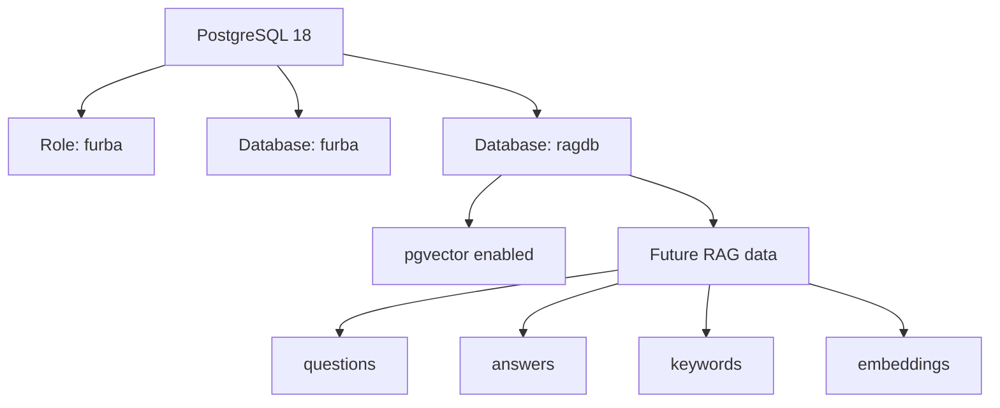
```mermaid
flowchart TD
    A[PostgreSQL 18] --> B[Role: furba]
    A --> C[Database: furba]
    A --> D[Database: ragdb]
    D --> E[pgvector enabled]
    D --> F[Future RAG data]
    F --> G[questions]
    F --> H[answers]
    F --> I[keywords]
    F --> J[embeddings]
```

---

### Directory Structure

```text
~/arxiv_search/
├── env/                    # Python virtual environment
├── config/
│   └── settings.py         # Application settings
├── .env                    # Passwords/configuration
├── data/
│   ├── pdfs/
│   │   ├── 2024/
│   │   └── 2025/
│   ├── cache/
│   └── logs/
├── src/
│   ├── __init__.py
│   ├── arxiv_client.py
│   ├── pdf_processor.py
│   ├── embeddings.py
│   ├── database.py
│   └── search.py
└── scripts/
    ├── setup_db.py
    ├── fetch_papers.py
    └── build_index.py
```


```bash
cd ~/arxiv_search
python3 -m venv env
source env/bin/activate
python -m pip install --upgrade pip setuptools wheel
```


```bash
pip install \
  arxiv \
  PyMuPDF \
  psycopg2-binary \
  sentence-transformers \
  requests \
  numpy \
  tqdm \
  python-dotenv \
  pgvector
```


### Two pgvector Parts

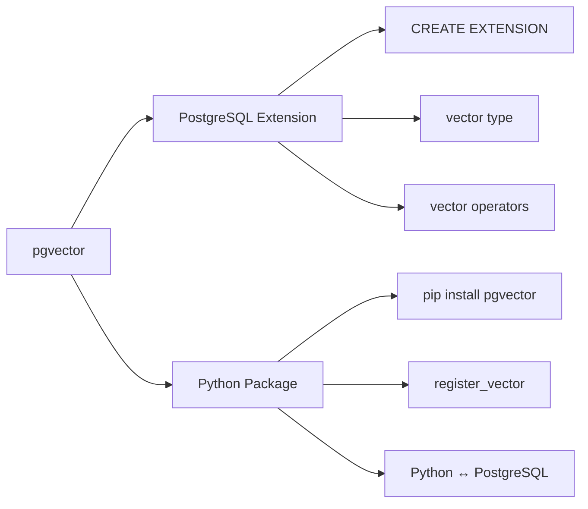
```mermaid
flowchart LR
    A[pgvector] --> B[PostgreSQL Extension]
    A --> C[Python Package]
    B --> D[CREATE EXTENSION]
    B --> E[vector type]
    B --> F[vector operators]
    C --> G[pip install pgvector]
    C --> H[register_vector]
    C --> I[Python ↔ PostgreSQL]
```

### Verifi

```bash
python -c "import arxiv, fitz, psycopg2, sentence_transformers, requests, numpy, tqdm, dotenv, pgvector; print('All imports OK')"
```

```text
All imports OK
```

---


```bash
mkdir -p config
mkdir -p data/pdfs/2024
mkdir -p data/pdfs/2025
mkdir -p data/cache
mkdir -p data/logs
mkdir -p src
mkdir -p scripts
```


```bash
touch src/__init__.py
touch config/settings.py
touch src/arxiv_client.py
touch src/pdf_processor.py
touch src/embeddings.py
touch src/database.py
touch src/search.py
touch scripts/setup_db.py
touch scripts/fetch_papers.py
touch scripts/build_index.py
```

### `.env`

```dotenv
# Database Configuration
DB_HOST=localhost
DB_PORT=5432
DB_NAME=ragdb
DB_USER=furba
DB_PASSWORD=YOUR_PASSWORD

# ArXiv Configuration
ARXIV_MAX_RESULTS=100
ARXIV_RATE_LIMIT=3

# Model Configuration
EMBEDDING_MODEL=all-MiniLM-L6-v2
EMBEDDING_BATCH_SIZE=32
EMBEDDING_DEVICE=cpu

# Storage Configuration
PDF_STORAGE_PATH=./data/pdfs
CACHE_PATH=./data/cache
LOG_PATH=./data/logs
```

### `.gitignore`

```gitignore
.env
env/
__pycache__/
*.pyc

data/pdfs/
data/cache/
data/logs/
```

### `config/settings.py`

```python
import os
from pathlib import Path

from dotenv import load_dotenv


# Project root directory
BASE_DIR = Path(__file__).resolve().parent.parent

# Load .env
load_dotenv(BASE_DIR / ".env")


# Database
DB_HOST = os.getenv("DB_HOST", "localhost")
DB_PORT = int(os.getenv("DB_PORT", "5432"))
DB_NAME = os.getenv("DB_NAME", "ragdb")
DB_USER = os.getenv("DB_USER", "furba")
DB_PASSWORD = os.getenv("DB_PASSWORD")


# ArXiv
ARXIV_MAX_RESULTS = int(os.getenv("ARXIV_MAX_RESULTS", "100"))
ARXIV_RATE_LIMIT = float(os.getenv("ARXIV_RATE_LIMIT", "3"))


# Embedding model
EMBEDDING_MODEL = os.getenv(
    "EMBEDDING_MODEL",
    "all-MiniLM-L6-v2",
)

EMBEDDING_BATCH_SIZE = int(
    os.getenv("EMBEDDING_BATCH_SIZE", "32")
)

EMBEDDING_DEVICE = os.getenv(
    "EMBEDDING_DEVICE",
    "cpu",
)


# Storage
PDF_STORAGE_PATH = BASE_DIR / os.getenv(
    "PDF_STORAGE_PATH",
    "data/pdfs",
)

CACHE_PATH = BASE_DIR / os.getenv(
    "CACHE_PATH",
    "data/cache",
)

LOG_PATH = BASE_DIR / os.getenv(
    "LOG_PATH",
    "data/logs",
)
```

### Settings as Bridge

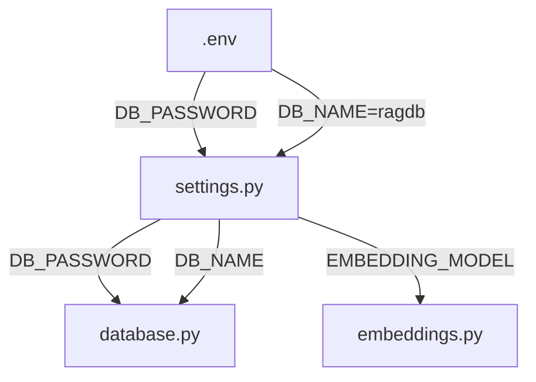
```mermaid
flowchart TD
    A[.env] -->|DB_PASSWORD| B[settings.py]
    A -->|DB_NAME=ragdb| B
    B -->|DB_PASSWORD| C[database.py]
    B -->|DB_NAME| C
    B -->|EMBEDDING_MODEL| D[embeddings.py]
```

---

### Error

Python cannot find `config` folder when running a script inside `scripts/`.

### Root Cause

```text
~/arxiv_search/scripts/verify.py
```

Python doesn't automatically treat:

```text
~/arxiv_search/
```

as an import location for:

```python
from config.settings import ...
```

### Solution

At the top of every script in `scripts/`:

```python
import sys
from pathlib import Path

# Add the project root (arxiv_search/) to Python's import path
PROJECT_ROOT = Path(__file__).resolve().parent.parent
sys.path.insert(0, str(PROJECT_ROOT))
```

### Path Resolution

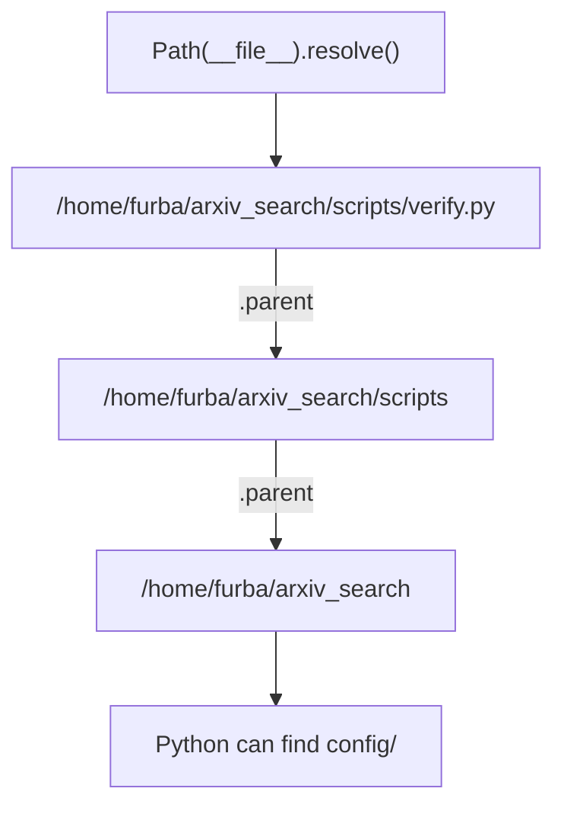
```mermaid
flowchart TD
    A["Path(__file__).resolve()"] --> B["/home/furba/arxiv_search/scripts/verify.py"]
    B -->|.parent| C["/home/furba/arxiv_search/scripts"]
    C -->|.parent| D["/home/furba/arxiv_search"]
    D --> E[Python can find config/]
```

---

## Environment Verifi

### `scripts/verify.py`

```python
#!/usr/bin/env python3

"""Verify the ArXiv search environment."""

import sys
from pathlib import Path

# Add the project root (arxiv_search/) to Python's import path
PROJECT_ROOT = Path(__file__).resolve().parent.parent
sys.path.insert(0, str(PROJECT_ROOT))


def check_imports():
    """Check required Python packages."""

    packages = {
        "arxiv": "arxiv",
        "PyMuPDF": "fitz",
        "psycopg2": "psycopg2",
        "sentence-transformers": "sentence_transformers",
        "requests": "requests",
        "numpy": "numpy",
        "tqdm": "tqdm",
        "python-dotenv": "dotenv",
        "pgvector": "pgvector",
    }

    print("Checking Python packages...")

    failed = []

    for name, module in packages.items():
        try:
            __import__(module)
            print(f"  OK  {name}")
        except ImportError as e:
            print(f"  FAIL {name}: {e}")
            failed.append(name)

    return len(failed) == 0


def check_postgresql():
    """Check PostgreSQL and pgvector."""

    import psycopg2

    from config.settings import (
        DB_HOST,
        DB_PORT,
        DB_NAME,
        DB_USER,
        DB_PASSWORD,
    )

    print("\nChecking PostgreSQL...")

    try:
        conn = psycopg2.connect(
            host=DB_HOST,
            port=DB_PORT,
            dbname=DB_NAME,
            user=DB_USER,
            password=DB_PASSWORD,
        )

        print("  OK  PostgreSQL connection")

        cursor = conn.cursor()

        cursor.execute(
            """
            SELECT extversion
            FROM pg_extension
            WHERE extname = 'vector';
            """
        )

        result = cursor.fetchone()

        if result:
            print(f"  OK  pgvector {result[0]}")
        else:
            print("  FAIL pgvector extension is not enabled")
            conn.close()
            return False

        cursor.close()
        conn.close()

        return True

    except Exception as e:
        print(f"  FAIL PostgreSQL: {e}")
        return False


def check_model_download():
    """Check that the embedding model can be loaded."""

    print("\nChecking embedding model...")

    from config.settings import (
        EMBEDDING_MODEL,
        EMBEDDING_DEVICE,
    )

    print(f"  Model: {EMBEDDING_MODEL}")
    print(f"  Device: {EMBEDDING_DEVICE}")

    try:
        from sentence_transformers import SentenceTransformer

        model = SentenceTransformer(
            EMBEDDING_MODEL,
            device=EMBEDDING_DEVICE,
        )

        dimension = model.get_sentence_embedding_dimension()

        print("  OK  Model loaded")
        print(f"  OK  Embedding dimension: {dimension}")

        return True

    except Exception as e:
        print(f"  FAIL Model: {e}")
        return False


def main():
    """Run all checks."""

    print("=" * 50)
    print("ArXiv Search Environment Verification")
    print("=" * 50)

    results = [
        check_imports(),
        check_postgresql(),
        check_model_download(),
    ]

    print("\n" + "=" * 50)

    if all(results):
        print("ALL CHECKS PASSED")
        return 0

    print("SOME CHECKS FAILED")
    return 1


if __name__ == "__main__":
    sys.exit(main())
```

### Expected Output

```text
==================================================
ArXiv Search Environment Verification
==================================================
Checking Python packages...
  OK  arxiv
  OK  PyMuPDF
  OK  psycopg2
  OK  sentence-transformers
  OK  requests
  OK  numpy
  OK  tqdm
  OK  python-dotenv
  OK  pgvector

Checking PostgreSQL...
  OK  PostgreSQL connection
  OK  pgvector 0.8.6

Checking embedding model...
  Model: all-MiniLM-L6-v2
  Device: cpu
  OK  Model loaded
  OK  Embedding dimension: 384

==================================================
ALL CHECKS PASSED
```

---

## Database Schema Design

### Enable Extensions

```bash
sudo -u postgres psql -d ragdb
```

```sql
CREATE EXTENSION IF NOT EXISTS vector;
CREATE EXTENSION IF NOT EXISTS pg_trgm;
CREATE EXTENSION IF NOT EXISTS btree_gin;
```

### Verify Extensions

```sql
\dx
```

Expected:

```text
Name       | Version | Description
-----------+---------+--------------------------------
btree_gin  | ...     | support for indexing common...
pg_trgm    | ...     | text similarity measurement...
vector     | 0.8.6   | vector data type and ivfflat...
```

### `schema.sql`

```sql
-- =========================================================
-- ArXiv Research Paper Database
-- =========================================================

-- Enable required PostgreSQL extensions
CREATE EXTENSION IF NOT EXISTS vector;
CREATE EXTENSION IF NOT EXISTS pg_trgm;
CREATE EXTENSION IF NOT EXISTS btree_gin;


-- =========================================================
-- Main papers table
-- =========================================================

CREATE TABLE IF NOT EXISTS papers (
    id SERIAL PRIMARY KEY,
    arxiv_id VARCHAR(50) UNIQUE NOT NULL,
    title TEXT NOT NULL,
    abstract TEXT,
    authors TEXT[],
    categories TEXT[],
    primary_category VARCHAR(50),
    published_date DATE,
    updated_date DATE,
    pdf_url TEXT,
    comment TEXT,
    journal_ref TEXT,
    doi VARCHAR(100),

    -- Processing status
    pdf_downloaded BOOLEAN DEFAULT FALSE,
    pdf_processed BOOLEAN DEFAULT FALSE,
    embedding_generated BOOLEAN DEFAULT FALSE,
    processing_error TEXT,

    -- Timestamps
    created_at TIMESTAMP DEFAULT CURRENT_TIMESTAMP,
    updated_at TIMESTAMP DEFAULT CURRENT_TIMESTAMP
);


-- Indexes for common paper queries

CREATE INDEX IF NOT EXISTS idx_papers_published_date
ON papers (published_date DESC);

CREATE INDEX IF NOT EXISTS idx_papers_categories
ON papers USING GIN (categories);

CREATE INDEX IF NOT EXISTS idx_papers_authors
ON papers USING GIN (authors);


-- =========================================================
-- Paper chunks table
-- =========================================================

CREATE TABLE IF NOT EXISTS paper_chunks (
    id SERIAL PRIMARY KEY,

    paper_id INTEGER
        REFERENCES papers(id)
        ON DELETE CASCADE,

    chunk_index INTEGER NOT NULL,

    chunk_text TEXT NOT NULL,

    chunk_tokens INTEGER,

    -- all-MiniLM-L6-v2 produces 384-dimensional vectors
    embedding vector(384),

    -- Metadata
    section_name VARCHAR(255),
    page_number INTEGER,
    char_start INTEGER,
    char_end INTEGER,

    -- Quality indicators
    has_math BOOLEAN DEFAULT FALSE,
    has_code BOOLEAN DEFAULT FALSE,
    has_references BOOLEAN DEFAULT FALSE,

    language VARCHAR(10) DEFAULT 'en',

    created_at TIMESTAMP DEFAULT CURRENT_TIMESTAMP,

    -- A paper cannot have two chunks with the same position
    UNIQUE (paper_id, chunk_index)
);


-- Vector similarity index

CREATE INDEX IF NOT EXISTS idx_chunks_embedding
ON paper_chunks
USING hnsw (embedding vector_cosine_ops)
WITH (m = 16, ef_construction = 64);


-- Find chunks belonging to a paper

CREATE INDEX IF NOT EXISTS idx_chunks_paper_id
ON paper_chunks (paper_id);


-- Full-text similarity using trigram

CREATE INDEX IF NOT EXISTS idx_chunks_text_trgm
ON paper_chunks
USING GIN (chunk_text gin_trgm_ops);


-- =========================================================
-- Authors table
-- =========================================================

CREATE TABLE IF NOT EXISTS authors (
    id SERIAL PRIMARY KEY,

    name TEXT NOT NULL,

    -- Normalized version for matching
    normalized_name TEXT,

    affiliation TEXT,
    orcid VARCHAR(50),
    email VARCHAR(255),

    UNIQUE (normalized_name)
);


CREATE INDEX IF NOT EXISTS idx_authors_name_trgm
ON authors
USING GIN (name gin_trgm_ops);


-- =========================================================
-- Paper ↔ Author relationship
-- =========================================================

CREATE TABLE IF NOT EXISTS paper_authors (
    paper_id INTEGER
        REFERENCES papers(id)
        ON DELETE CASCADE,

    author_id INTEGER
        REFERENCES authors(id)
        ON DELETE CASCADE,

    author_position INTEGER,

    is_corresponding BOOLEAN DEFAULT FALSE,

    PRIMARY KEY (paper_id, author_id)
);


CREATE INDEX IF NOT EXISTS idx_paper_authors_author_id
ON paper_authors (author_id);


CREATE INDEX IF NOT EXISTS idx_paper_authors_paper_id_position
ON paper_authors (paper_id, author_position);


-- =========================================================
-- ArXiv categories
-- =========================================================

CREATE TABLE IF NOT EXISTS categories (
    code VARCHAR(20) PRIMARY KEY,

    name TEXT NOT NULL,

    description TEXT,

    parent_category VARCHAR(20)
);


CREATE INDEX IF NOT EXISTS idx_categories_parent_category
ON categories (parent_category);


-- =========================================================
-- Search history
-- =========================================================

CREATE TABLE IF NOT EXISTS search_history (
    id SERIAL PRIMARY KEY,

    query_text TEXT NOT NULL,

    query_embedding vector(384),

    result_count INTEGER,

    execution_time_ms INTEGER,

    filters JSONB,

    created_at TIMESTAMP DEFAULT CURRENT_TIMESTAMP
);


CREATE INDEX IF NOT EXISTS idx_search_history_created_at
ON search_history (created_at DESC);


-- Vector index for search history

CREATE INDEX IF NOT EXISTS idx_search_history_query_embedding
ON search_history
USING hnsw (query_embedding vector_cosine_ops)
WITH (m = 16, ef_construction = 64);


-- =========================================================
-- Processing queue
-- =========================================================

CREATE TABLE IF NOT EXISTS processing_queue (
    id SERIAL PRIMARY KEY,

    paper_id INTEGER
        REFERENCES papers(id)
        ON DELETE CASCADE,

    operation VARCHAR(50) NOT NULL,

    status VARCHAR(20) DEFAULT 'pending',

    priority INTEGER DEFAULT 0,

    retry_count INTEGER DEFAULT 0,

    error_message TEXT,

    created_at TIMESTAMP DEFAULT CURRENT_TIMESTAMP,

    started_at TIMESTAMP,

    completed_at TIMESTAMP
);


-- Queue lookup indexes

CREATE INDEX IF NOT EXISTS idx_queue_status_priority
ON processing_queue (status, priority DESC);


CREATE INDEX IF NOT EXISTS idx_queue_paper_id
ON processing_queue (paper_id);


CREATE INDEX IF NOT EXISTS idx_queue_operation_status
ON processing_queue (operation, status);
```

### `scripts/setup_db.py`

```python
#!/usr/bin/env python3

import sys
from pathlib import Path

# Add the project root (arxiv_search/) to Python's import path
PROJECT_ROOT = Path(__file__).resolve().parent.parent
sys.path.insert(0, str(PROJECT_ROOT))

import psycopg2

from config.settings import (
    DB_HOST,
    DB_PORT,
    DB_NAME,
    DB_USER,
    DB_PASSWORD,
)


def main():
    """Create the ArXiv database schema."""

    project_root = Path(__file__).resolve().parent.parent
    schema_file = project_root / "schema.sql"

    print("Connecting to PostgreSQL...")

    conn = psycopg2.connect(
        host=DB_HOST,
        port=DB_PORT,
        dbname=DB_NAME,
        user=DB_USER,
        password=DB_PASSWORD,
    )

    print("Connected.")

    schema = schema_file.read_text()

    with conn.cursor() as cursor:
        cursor.execute(schema)

    conn.commit()
    conn.close()

    print("Database schema created successfully.")


if __name__ == "__main__":
    main()
```

### Run Setup

```bash
python scripts/setup_db.py
```

```text
Connecting to PostgreSQL...
Connected.
Database schema created successfully.
```

### Verify Tables

```bash
psql -d ragdb
```

```sql
\dt
```


```text
papers
paper_chunks
authors
paper_authors
categories
search_history
processing_queue
```

### Database Architecture

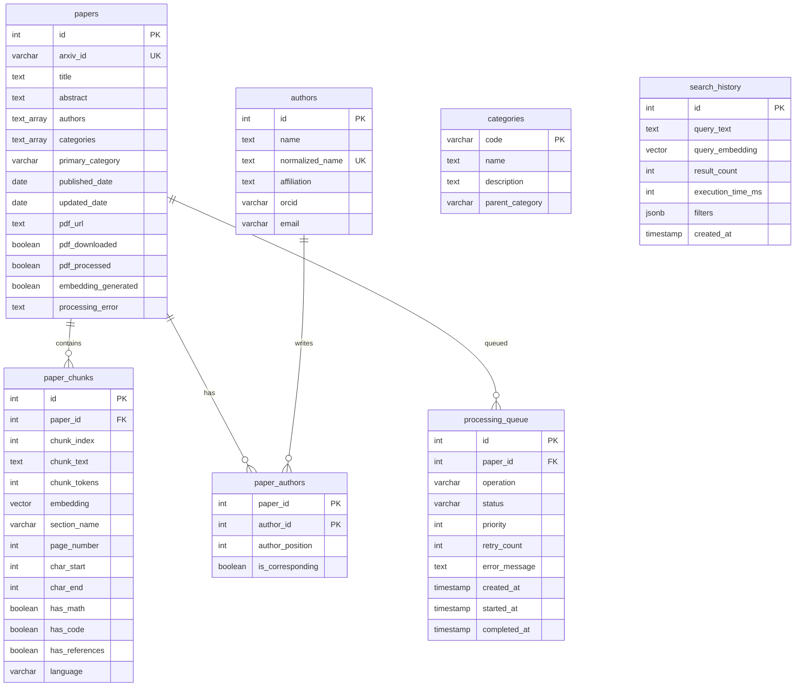
```mermaid
erDiagram
    papers ||--o{ paper_chunks : contains
    papers ||--o{ paper_authors : has
    authors ||--o{ paper_authors : writes
    papers ||--o{ processing_queue : queued
    
    papers {
        int id PK
        varchar arxiv_id UK
        text title
        text abstract
        text_array authors
        text_array categories
        varchar primary_category
        date published_date
        date updated_date
        text pdf_url
        boolean pdf_downloaded
        boolean pdf_processed
        boolean embedding_generated
        text processing_error
    }
    
    paper_chunks {
        int id PK
        int paper_id FK
        int chunk_index
        text chunk_text
        int chunk_tokens
        vector embedding
        varchar section_name
        int page_number
        int char_start
        int char_end
        boolean has_math
        boolean has_code
        boolean has_references
        varchar language
    }
    
    authors {
        int id PK
        text name
        text normalized_name UK
        text affiliation
        varchar orcid
        varchar email
    }
    
    paper_authors {
        int paper_id PK
        int author_id PK
        int author_position
        boolean is_corresponding
    }
    
    categories {
        varchar code PK
        text name
        text description
        varchar parent_category
    }
    
    search_history {
        int id PK
        text query_text
        vector query_embedding
        int result_count
        int execution_time_ms
        jsonb filters
        timestamp created_at
    }
    
    processing_queue {
        int id PK
        int paper_id FK
        varchar operation
        varchar status
        int priority
        int retry_count
        text error_message
        timestamp created_at
        timestamp started_at
        timestamp completed_at
    }
```


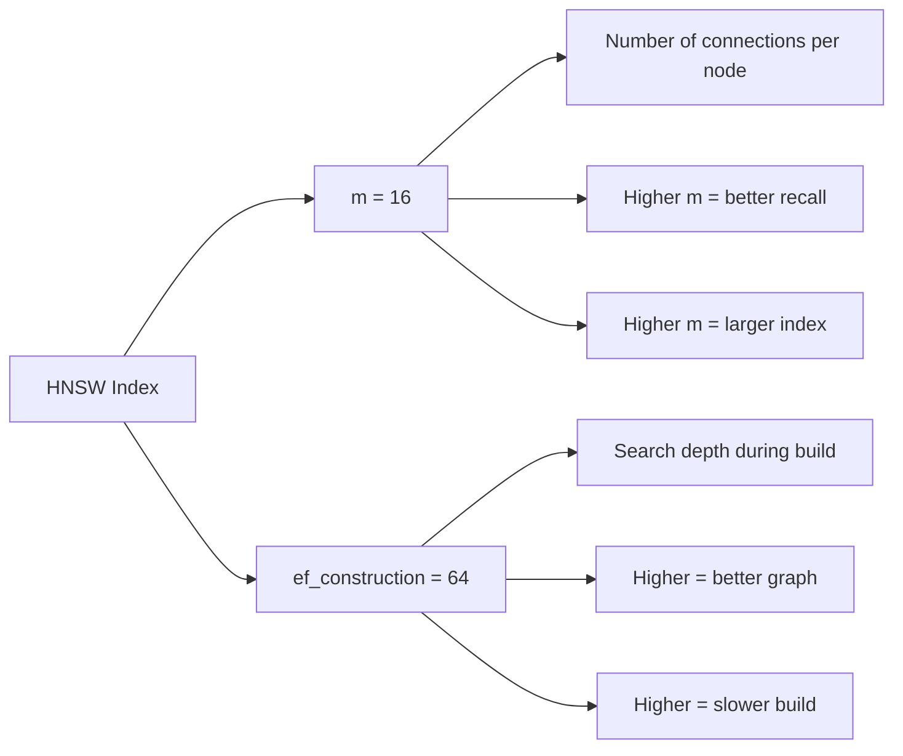
```mermaid
	flowchart LR
    A[HNSW Index] --> B[m = 16]
    A --> C[ef_construction = 64]
    
    B --> D[Number of connections per node]
    B --> E[Higher m = better recall]
    B --> F[Higher m = larger index]
    
    C --> G[Search depth during build]
    C --> H[Higher = better graph]
    C --> I[Higher = slower build]
```

### Hybrid Search Architecture

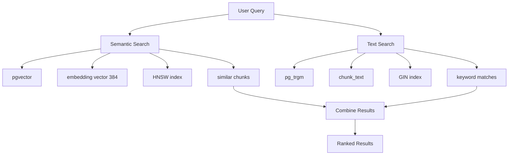
```mermaid
flowchart TD
    A[User Query] --> B[Semantic Search]
    A --> C[Text Search]
    
    B --> D[pgvector]
    B --> E[embedding vector 384]
    B --> F[HNSW index]
    B --> G[similar chunks]
    
    C --> H[pg_trgm]
    C --> I[chunk_text]
    C --> J[GIN index]
    C --> K[keyword matches]
    
    G --> L[Combine Results]
    K --> L
    L --> M[Ranked Results]
```

### Processing Pipeline Flags

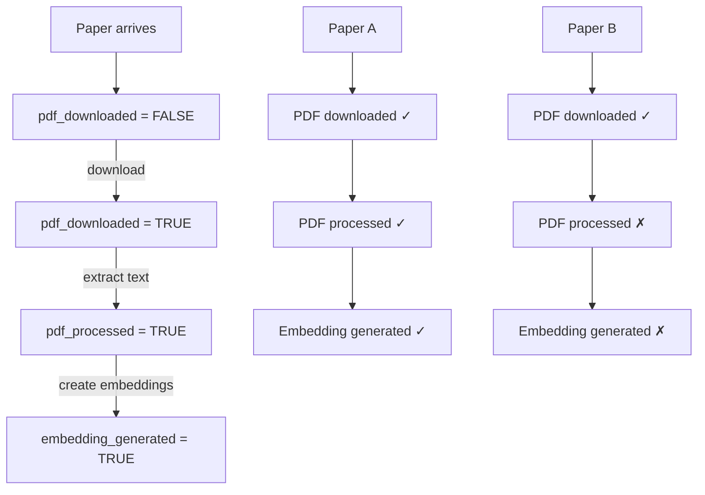
```mermaid
flowchart TD
    A[Paper arrives] --> B[pdf_downloaded = FALSE]
    B -->|download| C[pdf_downloaded = TRUE]
    C -->|extract text| D[pdf_processed = TRUE]
    D -->|create embeddings| E[embedding_generated = TRUE]
    
    F[Paper A] --> G[PDF downloaded ✓]
    G --> H[PDF processed ✓]
    H --> I[Embedding generated ✓]
    
    J[Paper B] --> K[PDF downloaded ✓]
    K --> L[PDF processed ✗]
    L --> M[Embedding generated ✗]
```

### Schema Status Table

| Component | Status | Notes |
|-----------|--------|-------|
| PostgreSQL | ✓ | Version 18 |
| pgvector | ✓ | Version 0.8.6 |
| `vector(384)` | ✓ | In `paper_chunks` |
| HNSW | ✓ | `m=16, ef_construction=64` |
| `pg_trgm` | ✓ | Version 1.6 |
| GIN metadata indexes | ✓ | On authors, categories |
| Paper status flags | ✓ | download, process, embed |
| Chunk fields | ✓ | text, tokens, section, page |
| 768/128 chunking | Later | Not yet implemented |
| Index monitoring | Later | Not needed yet |
| ArXiv API client | Next | To be built |

---

## 10. ArXiv API Client

### Architecture

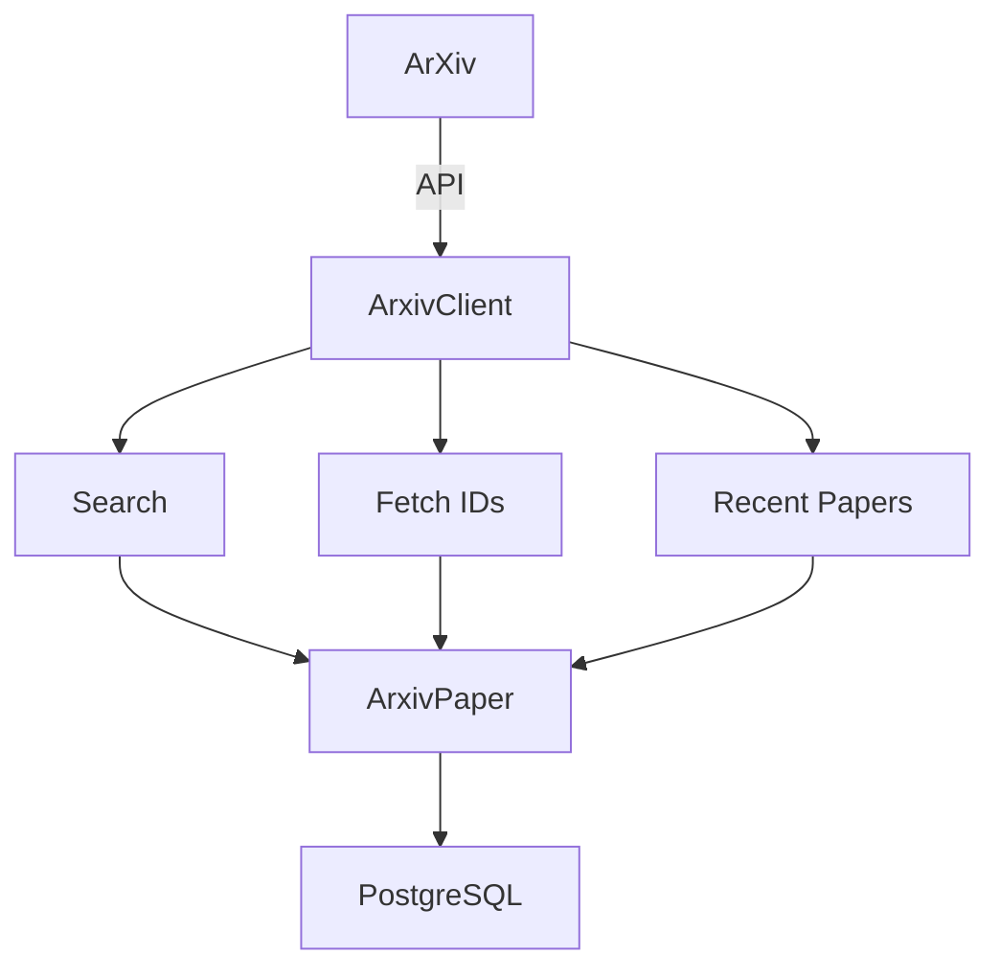
```mermaid
flowchart TD
    A[ArXiv] -->|API| B[ArxivClient]
    B --> C[Search]
    B --> D[Fetch IDs]
    B --> E[Recent Papers]
    C --> F[ArxivPaper]
    D --> F
    E --> F
    F --> G[PostgreSQL]
```

### `src/arxiv_client.py`

```python
import time
import logging
from typing import List, Optional, Generator
from datetime import datetime, timedelta
from dataclasses import dataclass

import arxiv

from config.settings import (
    ARXIV_MAX_RESULTS,
    ARXIV_RATE_LIMIT,
)


logger = logging.getLogger(__name__)


@dataclass
class ArxivPaper:
    """Structured representation of an ArXiv paper."""

    arxiv_id: str
    title: str
    abstract: str
    authors: List[str]
    categories: List[str]
    primary_category: str
    published_date: datetime
    updated_date: datetime
    pdf_url: str
    comment: Optional[str] = None
    journal_ref: Optional[str] = None
    doi: Optional[str] = None


class ArxivClient:
    """ArXiv API client with rate limiting and error handling."""

    def __init__(
        self,
        rate_limit_seconds: float = ARXIV_RATE_LIMIT,
        max_results_per_query: int = ARXIV_MAX_RESULTS,
    ):
        self.rate_limit_seconds = rate_limit_seconds
        self.max_results_per_query = max_results_per_query

        # Time when the previous API request was made.
        self._last_request_time = 0.0

        # The arxiv Python package handles communication with ArXiv.
        self.client = arxiv.Client(
            page_size=max_results_per_query,
            delay_seconds=rate_limit_seconds,
            num_retries=3,
        )

    def _rate_limit(self):
        """Enforce minimum time between API requests."""

        elapsed = time.time() - self._last_request_time

        if elapsed < self.rate_limit_seconds:
            wait_time = self.rate_limit_seconds - elapsed

            logger.debug(
                "Rate limiting: sleeping %.2f seconds",
                wait_time,
            )

            time.sleep(wait_time)

        self._last_request_time = time.time()

    def _convert_result(self, result: arxiv.Result) -> ArxivPaper:
        """Convert an arxiv.Result into our ArxivPaper object."""

        return ArxivPaper(
            arxiv_id=result.entry_id.split("/")[-1],
            title=result.title.strip(),
            abstract=result.summary.strip(),
            authors=[author.name for author in result.authors],
            categories=result.categories,
            primary_category=result.primary_category,
            published_date=result.published,
            updated_date=result.updated,
            pdf_url=result.pdf_url,
            comment=result.comment,
            journal_ref=result.journal_ref,
            doi=result.doi,
        )

    def search_papers(
        self,
        query: str,
        max_results: int = 100,
        sort_by: arxiv.SortCriterion = arxiv.SortCriterion.SubmittedDate,
        sort_order: arxiv.SortOrder = arxiv.SortOrder.Descending,
    ) -> Generator[ArxivPaper, None, None]:
        """
        Search for papers matching an ArXiv query.

        Examples:

            cat:cs.LG

            au:Bengio

            ti:transformer

            cat:cs.LG AND (ti:attention OR ti:transformer)
        """

        search = arxiv.Search(
            query=query,
            max_results=max_results,
            sort_by=sort_by,
            sort_order=sort_order,
        )

        logger.info("Searching ArXiv: %s", query)

        try:
            for result in self.client.results(search):
                yield self._convert_result(result)

        except Exception:
            logger.exception(
                "ArXiv search failed for query: %s",
                query,
            )
            raise

    def fetch_by_ids(
        self,
        arxiv_ids: List[str],
    ) -> List[ArxivPaper]:
        """Fetch specific papers by their ArXiv IDs."""

        if not arxiv_ids:
            return []

        search = arxiv.Search(
            id_list=arxiv_ids,
            max_results=len(arxiv_ids),
        )

        logger.info(
            "Fetching %d ArXiv papers",
            len(arxiv_ids),
        )

        papers = []

        try:
            for result in self.client.results(search):
                papers.append(self._convert_result(result))

        except Exception:
            logger.exception("Failed to fetch ArXiv papers by ID")
            raise

        return papers

    def search_recent_papers(
        self,
        categories: List[str],
        days_back: int = 7,
    ) -> Generator[ArxivPaper, None, None]:
        """Fetch papers from categories published in the last N days."""

        if not categories:
            return

        cutoff = datetime.now() - timedelta(days=days_back)

        category_query = " OR ".join(
            f"cat:{category}"
            for category in categories
        )

        logger.info(
            "Searching recent papers in %s",
            categories,
        )

        for paper in self.search_papers(
            query=f"({category_query})",
            max_results=self.max_results_per_query,
            sort_by=arxiv.SortCriterion.SubmittedDate,
            sort_order=arxiv.SortOrder.Descending,
        ):
            if paper.published_date >= cutoff:
                yield paper
            else:
                # Results are sorted newest first.
                # Once we reach papers older than our cutoff,
                # we can stop searching.
                break
```

### ArxivPaper Structure

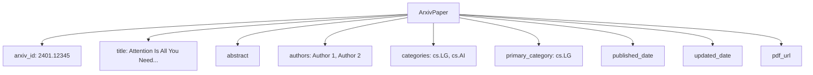
```mermaid
flowchart TD
    A[ArxivPaper] --> B[arxiv_id: 2401.12345]
    A --> C[title: Attention Is All You Need...]
    A --> D[abstract]
    A --> E[authors: Author 1, Author 2]
    A --> F[categories: cs.LG, cs.AI]
    A --> G[primary_category: cs.LG]
    A --> H[published_date]
    A --> I[updated_date]
    A --> J[pdf_url]
```

### Rate Limiting

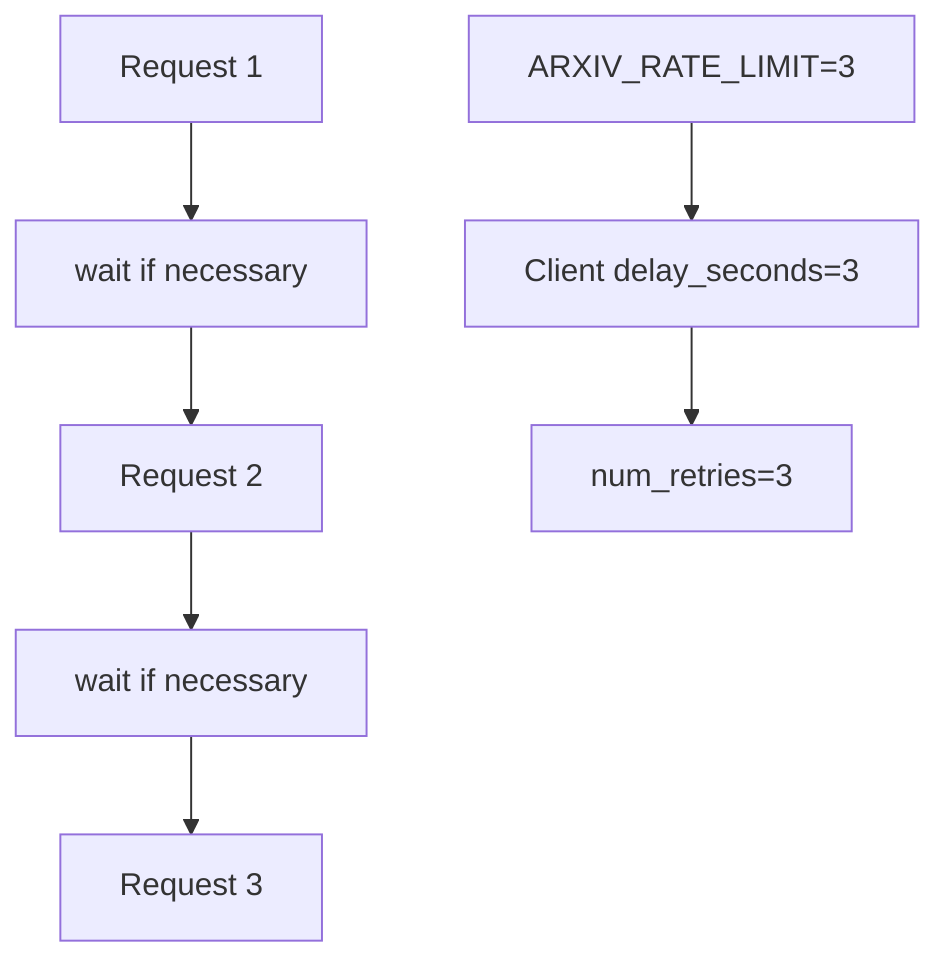
```mermaid
flowchart TD
    A[Request 1] --> B[wait if necessary]
    B --> C[Request 2]
    C --> D[wait if necessary]
    D --> E[Request 3]
    
    F[ARXIV_RATE_LIMIT=3] --> G[Client delay_seconds=3]
    G --> H[num_retries=3]
```

### Search Syntax Examples

| Query | Meaning |
|-------|---------|
| `cat:cs.LG` | Machine learning papers |
| `au:Bengio` | Papers by Bengio |
| `ti:transformer` | Transformer in title |
| `cat:cs.LG AND (ti:attention OR ti:transformer)` | Complex search |

### Test Script

```python
import sys
from pathlib import Path

# Make the project root available for imports.
PROJECT_ROOT = Path(__file__).resolve().parent.parent
sys.path.insert(0, str(PROJECT_ROOT))

from src.arxiv_client import ArxivClient


def main():
    client = ArxivClient()

    print("Searching ArXiv...\n")

    papers = client.search_papers(
        query="cat:cs.LG",
        max_results=5,
    )

    for paper in papers:
        print("=" * 60)
        print(f"ArXiv ID: {paper.arxiv_id}")
        print(f"Title:    {paper.title}")
        print(f"Authors:  {', '.join(paper.authors)}")
        print(f"Category: {paper.primary_category}")
        print(f"PDF:      {paper.pdf_url}")


if __name__ == "__main__":
    main()
```

### Module Separation

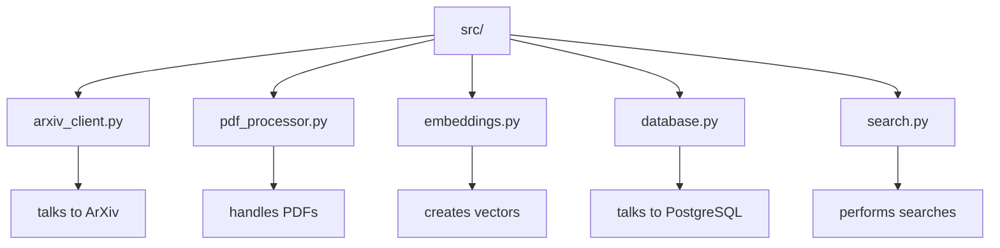
```mermaid
flowchart TD
    A[src/] --> B[arxiv_client.py]
    A --> C[pdf_processor.py]
    A --> D[embeddings.py]
    A --> E[database.py]
    A --> F[search.py]
    
    B --> G[talks to ArXiv]
    C --> H[handles PDFs]
    D --> I[creates vectors]
    E --> J[talks to PostgreSQL]
    F --> K[performs searches]
```

---

## 11. PDF Download Layer

### Architecture

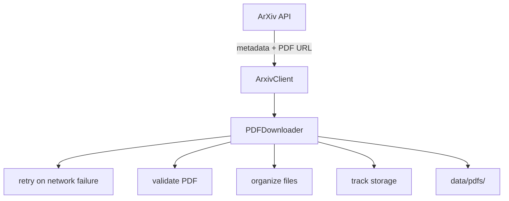
```mermaid
flowchart TD
    A[ArXiv API] -->|metadata + PDF URL| B[ArxivClient]
    B --> C[PDFDownloader]
    C --> D[retry on network failure]
    C --> E[validate PDF]
    C --> F[organize files]
    C --> G[track storage]
    C --> H[data/pdfs/]
```

### `src/pdf_processor.py`

```python
import hashlib
import logging
import time
from datetime import datetime
from pathlib import Path
from typing import Dict, Optional, Tuple

import requests

from config.settings import PDF_STORAGE_PATH


logger = logging.getLogger(__name__)


class PDFDownloader:
    """Manages PDF downloads with retry logic and organization."""

    def __init__(
        self,
        storage_path: str = str(PDF_STORAGE_PATH),
        max_retries: int = 3,
        timeout: int = 30,
    ):
        self.storage_path = Path(storage_path)
        self.max_retries = max_retries
        self.timeout = timeout

        # Make sure the storage directory exists.
        self.storage_path.mkdir(
            parents=True,
            exist_ok=True,
        )

    def _get_pdf_path(
        self,
        arxiv_id: str,
        published_date: datetime,
    ) -> Path:
        """Generate organized storage path for a PDF."""

        year = published_date.year

        # ArXiv IDs can contain characters such as '/'.
        # Replace them so they are safe as filenames.
        safe_id = arxiv_id.replace("/", "_")

        year_directory = self.storage_path / str(year)

        year_directory.mkdir(
            parents=True,
            exist_ok=True,
        )

        return year_directory / f"{safe_id}.pdf"

    def download_pdf(
        self,
        pdf_url: str,
        arxiv_id: str,
        published_date: datetime,
        force: bool = False,
    ) -> Tuple[bool, Optional[Path], Optional[str]]:
        """
        Download a PDF with retry logic.

        Returns:
            (success, pdf_path, error_message)
        """

        pdf_path = self._get_pdf_path(
            arxiv_id,
            published_date,
        )

        # Don't download the same PDF again unless force=True.
        if pdf_path.exists() and not force:
            if self._validate_pdf(pdf_path):
                logger.info(
                    "PDF already exists: %s",
                    pdf_path,
                )
                return True, pdf_path, None

            logger.warning(
                "Existing PDF is invalid. Re-downloading: %s",
                pdf_path,
            )

        for attempt in range(self.max_retries):
            try:
                logger.info(
                    "Downloading %s (attempt %d/%d)",
                    arxiv_id,
                    attempt + 1,
                    self.max_retries,
                )

                response = requests.get(
                    pdf_url,
                    timeout=self.timeout,
                    stream=True,
                )

                response.raise_for_status()

                # Download to a temporary file first.
                temp_path = pdf_path.with_suffix(".tmp")

                with open(temp_path, "wb") as file:
                    for chunk in response.iter_content(
                        chunk_size=8192
                    ):
                        if chunk:
                            file.write(chunk)

                response.close()

                # Validate before replacing the final file.
                if not self._validate_pdf(temp_path):
                    temp_path.unlink(missing_ok=True)

                    raise ValueError(
                        "Downloaded file is not a valid PDF"
                    )

                temp_path.replace(pdf_path)

                logger.info(
                    "Downloaded PDF: %s",
                    pdf_path,
                )

                return True, pdf_path, None

            except Exception as error:
                logger.warning(
                    "Download failed for %s: %s",
                    arxiv_id,
                    error,
                )

                # Clean up incomplete download.
                temp_path = pdf_path.with_suffix(".tmp")
                temp_path.unlink(missing_ok=True)

                # If this wasn't the final attempt, wait using
                # exponential backoff.
                if attempt < self.max_retries - 1:
                    wait_seconds = 2 ** attempt

                    logger.info(
                        "Retrying in %d seconds...",
                        wait_seconds,
                    )

                    time.sleep(wait_seconds)

                else:
                    return False, None, str(error)

        return False, None, "Download failed"

    def _validate_pdf(self, pdf_path: Path) -> bool:
        """Check whether a file is a valid PDF."""

        try:
            if not pdf_path.exists():
                return False

            # A PDF should not be empty.
            if pdf_path.stat().st_size < 100:
                return False

            with open(pdf_path, "rb") as file:
                header = file.read(5)

            # PDF files begin with %PDF-
            return header == b"%PDF-"

        except OSError:
            return False

    def get_storage_stats(self) -> Dict[str, object]:
        """Get statistics about stored PDFs."""

        total_files = 0
        total_bytes = 0

        for pdf_path in self.storage_path.rglob("*.pdf"):
            try:
                total_files += 1
                total_bytes += pdf_path.stat().st_size
            except OSError:
                pass

        total_mb = total_bytes / (1024 * 1024)

        return {
            "total_files": total_files,
            "total_bytes": total_bytes,
            "total_mb": round(total_mb, 2),
        }

    def cleanup_old_pdfs(
        self,
        days_to_keep: int = 90,
    ):
        """Remove PDFs older than the specified number of days."""

        cutoff_time = time.time() - (
            days_to_keep * 24 * 60 * 60
        )

        removed = 0

        for pdf_path in self.storage_path.rglob("*.pdf"):
            try:
                if pdf_path.stat().st_mtime < cutoff_time:
                    pdf_path.unlink()
                    removed += 1

                    logger.info(
                        "Removed old PDF: %s",
                        pdf_path,
                    )

            except OSError as error:
                logger.warning(
                    "Could not remove %s: %s",
                    pdf_path,
                    error,
                )

        return removed
```

### Storage Organization

```text
data/
└── pdfs/
    ├── 2024/
    │   └── ...
    │
    └── 2025/
        ├── 2501.12345.pdf
        ├── 2502.54321.pdf
        └── 2503.98765.pdf
```

### Download Flow

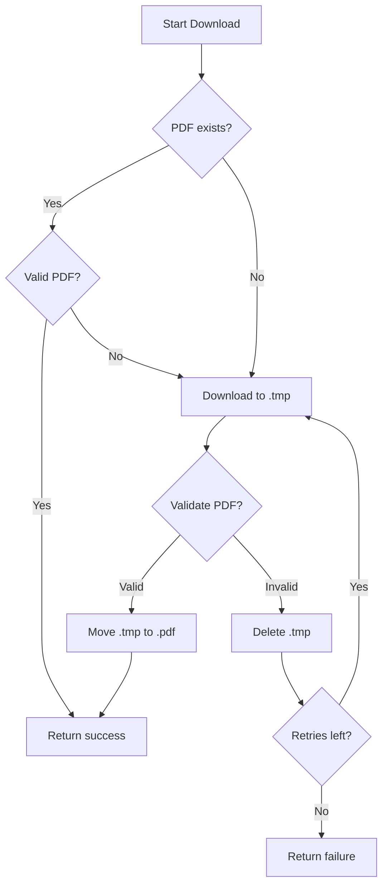
```mermaid
flowchart TD
    A[Start Download] --> B{PDF exists?}
    B -->|Yes| C{Valid PDF?}
    B -->|No| D[Download to .tmp]
    C -->|Yes| E[Return success]
    C -->|No| D
    D --> F{Validate PDF?}
    F -->|Valid| G[Move .tmp to .pdf]
    F -->|Invalid| H[Delete .tmp]
    H --> I{Retries left?}
    I -->|Yes| D
    I -->|No| J[Return failure]
    G --> E
```

### Exponential Backoff


```mermaid
flowchart LR
    A[Attempt 1] -->|fail| B[wait 1s]
    B --> C[Attempt 2]
    C -->|fail| D[wait 2s]
    D --> E[Attempt 3]
    E -->|fail| F[give up]
```

### PDF Validation

```python
header = file.read(5)
return header == b"%PDF-"
```

A real PDF starts with `%PDF-`. This prevents saving error pages as PDFs.

### Test Script

```python
import sys
from pathlib import Path

PROJECT_ROOT = Path(__file__).resolve().parent.parent
sys.path.insert(0, str(PROJECT_ROOT))

from src.pdf_processor import PDFDownloader


def main():
    downloader = PDFDownloader()

    stats = downloader.get_storage_stats()

    print("PDF storage statistics:")
    print(f"  Files: {stats['total_files']}")
    print(f"  Size:  {stats['total_mb']} MB")


if __name__ == "__main__":
    main()
```

Expected (no downloads yet):

```text
PDF storage statistics:
  Files: 0
  Size:  0.0 MB
```

---

## 12. Paper Processor (Orchestrator)

### Architecture

```mermaid
flowchart TD
    A[ArXiv API] --> B[ArxivClient]
    B -->|paper metadata| C[PaperProcessor]
    C --> D[PostgreSQL]
    C --> E[processing_queue]
    E --> F[PDFDownloader]
    F --> G[data/pdfs/]
    D --> H[papers table]
```

### `src/paper_processor.py`

```python
import logging
import re
from concurrent.futures import ThreadPoolExecutor, as_completed
from typing import Dict, List

import psycopg2
from psycopg2.extras import RealDictCursor

from config.settings import (
    DB_HOST,
    DB_PORT,
    DB_NAME,
    DB_USER,
    DB_PASSWORD,
)

from src.arxiv_client import ArxivClient, ArxivPaper
from src.pdf_processor import PDFDownloader


logger = logging.getLogger(__name__)


class PaperProcessor:
    """Orchestrates the complete paper processing pipeline."""

    def __init__(
        self,
        db_config: dict,
        arxiv_client: ArxivClient,
        pdf_downloader: PDFDownloader,
        max_workers: int = 4,
    ):
        self.db_config = db_config
        self.arxiv_client = arxiv_client
        self.pdf_downloader = pdf_downloader
        self.max_workers = max_workers

    def _get_connection(self):
        """Create a new PostgreSQL connection."""

        return psycopg2.connect(
            host=self.db_config["host"],
            port=self.db_config["port"],
            dbname=self.db_config["dbname"],
            user=self.db_config["user"],
            password=self.db_config["password"],
        )

    @staticmethod
    def _normalize_author_name(name: str) -> str:
        """Create a consistent version of an author name."""

        return re.sub(
            r"\s+",
            " ",
            name.strip().lower(),
        )

    def process_papers_batch(
        self,
        query: str,
        max_papers: int = 100,
        skip_existing: bool = True,
    ) -> dict:
        """Process a batch of papers from an ArXiv search query."""

        stats = {
            "found": 0,
            "new": 0,
            "existing": 0,
            "queued": 0,
            "downloaded": 0,
            "failed": 0,
        }

        papers: List[ArxivPaper] = []

        logger.info(
            "Searching ArXiv for: %s",
            query,
        )

        for paper in self.arxiv_client.search_papers(
            query=query,
            max_results=max_papers,
        ):
            papers.append(paper)

        stats["found"] = len(papers)

        if not papers:
            logger.info("No papers found.")
            return stats

        conn = self._get_connection()

        try:
            with conn.cursor(
                cursor_factory=RealDictCursor
            ) as cursor:

                queue_items = []

                for paper in papers:

                    cursor.execute(
                        """
                        SELECT id
                        FROM papers
                        WHERE arxiv_id = %s
                        """,
                        (paper.arxiv_id,),
                    )

                    existing = cursor.fetchone()

                    if existing and skip_existing:
                        stats["existing"] += 1
                        continue

                    paper_id = self._upsert_paper(
                        cursor,
                        paper,
                    )

                    stats["new"] += 1

                    cursor.execute(
                        """
                        INSERT INTO processing_queue
                            (paper_id, operation, status, priority)
                        VALUES
                            (%s, %s, %s, %s)
                        RETURNING id, paper_id, operation
                        """,
                        (
                            paper_id,
                            "download",
                            "pending",
                            10,
                        ),
                    )

                    queue_items.append(cursor.fetchone())
                    stats["queued"] += 1

                conn.commit()

        except Exception:
            conn.rollback()
            raise

        finally:
            conn.close()

        if queue_items:
            self._process_queue(
                queue_items,
                stats,
            )

        return stats

    def _upsert_paper(
        self,
        cursor,
        paper: ArxivPaper,
    ) -> int:
        """Insert or update paper metadata and return database ID."""

        cursor.execute(
            """
            INSERT INTO papers (
                arxiv_id,
                title,
                abstract,
                authors,
                categories,
                primary_category,
                published_date,
                updated_date,
                pdf_url,
                comment,
                journal_ref,
                doi
            )
            VALUES (
                %s, %s, %s, %s, %s, %s,
                %s, %s, %s, %s, %s, %s
            )
            ON CONFLICT (arxiv_id)
            DO UPDATE SET
                title = EXCLUDED.title,
                abstract = EXCLUDED.abstract,
                authors = EXCLUDED.authors,
                categories = EXCLUDED.categories,
                primary_category = EXCLUDED.primary_category,
                published_date = EXCLUDED.published_date,
                updated_date = EXCLUDED.updated_date,
                pdf_url = EXCLUDED.pdf_url,
                comment = EXCLUDED.comment,
                journal_ref = EXCLUDED.journal_ref,
                doi = EXCLUDED.doi,
                updated_at = CURRENT_TIMESTAMP
            RETURNING id
            """,
            (
                paper.arxiv_id,
                paper.title,
                paper.abstract,
                paper.authors,
                paper.categories,
                paper.primary_category,
                paper.published_date.date(),
                paper.updated_date.date(),
                paper.pdf_url,
                paper.comment,
                paper.journal_ref,
                paper.doi,
            ),
        )

        paper_db_id = cursor.fetchone()["id"]

        # Keep the relational author tables synchronized.
        for position, author_name in enumerate(
            paper.authors
        ):
            normalized_name = self._normalize_author_name(
                author_name
            )

            cursor.execute(
                """
                INSERT INTO authors (
                    name,
                    normalized_name
                )
                VALUES (%s, %s)
                ON CONFLICT (normalized_name)
                DO UPDATE SET name = EXCLUDED.name
                RETURNING id
                """,
                (
                    author_name,
                    normalized_name,
                ),
            )

            author_id = cursor.fetchone()["id"]

            cursor.execute(
                """
                INSERT INTO paper_authors (
                    paper_id,
                    author_id,
                    author_position
                )
                VALUES (%s, %s, %s)
                ON CONFLICT (paper_id, author_id)
                DO UPDATE SET
                    author_position = EXCLUDED.author_position
                """,
                (
                    paper_db_id,
                    author_id,
                    position,
                ),
            )

        return paper_db_id

    def _process_queue(
        self,
        queue_items: List[dict],
        stats: dict,
    ):
        """Process queue items using parallel workers."""

        logger.info(
            "Processing %d queue items with %d workers",
            len(queue_items),
            self.max_workers,
        )

        with ThreadPoolExecutor(
            max_workers=self.max_workers
        ) as executor:

            futures = {
                executor.submit(
                    self._process_download,
                    item,
                ): item
                for item in queue_items
            }

            for future in as_completed(futures):

                item = futures[future]

                try:
                    success = future.result()

                    if success:
                        stats["downloaded"] += 1
                    else:
                        stats["failed"] += 1

                except Exception:
                    stats["failed"] += 1

                    logger.exception(
                        "Queue item %s failed",
                        item["id"],
                    )

    def _process_download(
        self,
        item: dict,
    ) -> bool:
        """Process a single PDF download task."""

        conn = self._get_connection()

        try:
            with conn.cursor(
                cursor_factory=RealDictCursor
            ) as cursor:

                # Mark queue item as processing.
                cursor.execute(
                    """
                    UPDATE processing_queue
                    SET
                        status = %s,
                        started_at = CURRENT_TIMESTAMP
                    WHERE id = %s
                    """,
                    (
                        "processing",
                        item["id"],
                    ),
                )

                # Get paper information.
                cursor.execute(
                    """
                    SELECT
                        id,
                        arxiv_id,
                        pdf_url,
                        published_date
                    FROM papers
                    WHERE id = %s
                    """,
                    (item["paper_id"],),
                )

                paper = cursor.fetchone()

                if not paper:
                    raise ValueError(
                        f"Paper {item['paper_id']} not found"
                    )

                conn.commit()

                success, pdf_path, error = (
                    self.pdf_downloader.download_pdf(
                        pdf_url=paper["pdf_url"],
                        arxiv_id=paper["arxiv_id"],
                        published_date=paper[
                            "published_date"
                        ],
                    )
                )

                if success:

                    cursor.execute(
                        """
                        UPDATE papers
                        SET
                            pdf_downloaded = TRUE,
                            processing_error = NULL,
                            updated_at = CURRENT_TIMESTAMP
                        WHERE id = %s
                        """,
                        (paper["id"],),
                    )

                    cursor.execute(
                        """
                        UPDATE processing_queue
                        SET
                            status = %s,
                            completed_at = CURRENT_TIMESTAMP
                        WHERE id = %s
                        """,
                        (
                            "completed",
                            item["id"],
                        ),
                    )

                    conn.commit()

                    logger.info(
                        "Successfully downloaded %s",
                        paper["arxiv_id"],
                    )

                    return True

                cursor.execute(
                    """
                    UPDATE papers
                    SET
                        processing_error = %s,
                        updated_at = CURRENT_TIMESTAMP
                    WHERE id = %s
                    """,
                    (
                        error,
                        paper["id"],
                    ),
                )

                cursor.execute(
                    """
                    UPDATE processing_queue
                    SET
                        status = %s,
                        error_message = %s,
                        retry_count = retry_count + 1
                    WHERE id = %s
                    """,
                    (
                        "failed",
                        error,
                        item["id"],
                    ),
                )

                conn.commit()

                return False

        except Exception as error:

            conn.rollback()

            logger.exception(
                "Download task failed: %s",
                error,
            )

            try:
                with conn.cursor() as cursor:
                    cursor.execute(
                        """
                        UPDATE processing_queue
                        SET
                            status = %s,
                            error_message = %s,
                            retry_count = retry_count + 1
                        WHERE id = %s
                        """,
                        (
                            "failed",
                            str(error),
                            item["id"],
                        ),
                    )

                    conn.commit()

            except Exception:
                conn.rollback()

            return False

        finally:
            conn.close()


def create_default_processor(
    max_workers: int = 4,
) -> PaperProcessor:
    """Create a PaperProcessor using project settings."""

    db_config = {
        "host": DB_HOST,
        "port": DB_PORT,
        "dbname": DB_NAME,
        "user": DB_USER,
        "password": DB_PASSWORD,
    }

    return PaperProcessor(
        db_config=db_config,
        arxiv_client=ArxivClient(),
        pdf_downloader=PDFDownloader(),
        max_workers=max_workers,
    )
```

### Queue Processing

```mermaid
flowchart TD
    A[ArxivClient] --> B[PaperProcessor]
    B --> C[papers table]
    B --> D[processing_queue]
    
    D --> E[Paper A: pending]
    D --> F[Paper B: pending]
    D --> G[Paper C: pending]
    D --> H[Paper D: pending]
    D --> I[Paper E: pending]
    
    E --> J[Worker 1]
    F --> K[Worker 2]
    G --> L[Worker 3]
    H --> M[Worker 4]
    I --> N[Worker 1 next]
    
    J --> O[PDF A]
    K --> P[PDF B]
    L --> Q[PDF C]
    M --> R[PDF D]
    N --> S[PDF E]
```

### Thread Pool Execution

```mermaid
flowchart LR
    A[Thread 1] --> B[PostgreSQL connection 1]
    C[Thread 2] --> D[PostgreSQL connection 2]
    E[Thread 3] --> F[PostgreSQL connection 3]
    G[Thread 4] --> H[PostgreSQL connection 4]
```

### Test Script

```python
import sys
from pathlib import Path

PROJECT_ROOT = Path(__file__).resolve().parent.parent
sys.path.insert(0, str(PROJECT_ROOT))

from src.paper_processor import create_default_processor


def main():
    processor = create_default_processor(
        max_workers=2,
    )

    stats = processor.process_papers_batch(
        query="cat:cs.LG",
        max_papers=3,
    )

    print("\nProcessing results:")
    print(f"  Found:      {stats['found']}")
    print(f"  New:        {stats['new']}")
    print(f"  Existing:   {stats['existing']}")
    print(f"  Queued:     {stats['queued']}")
    print(f"  Downloaded: {stats['downloaded']}")
    print(f"  Failed:     {stats['failed']}")


if __name__ == "__main__":
    main()
```

---

## 13. PDF Extraction and Chunking

### Install NLTK

```bash
pip install nltk
python -c "import nltk; print(nltk.__version__)"
```

### PDF Extraction Architecture

```mermaid
flowchart TD
    A[paper.pdf] --> B[PDFExtractor]
    B --> C[clean structured text]
    C --> D[TextChunker]
    D --> E[chunks]
    E --> F[later: embeddings]
```

### `src/pdf_extractor.py`

```python
import logging
import re
from dataclasses import dataclass
from pathlib import Path
from typing import Dict, List

import fitz


logger = logging.getLogger(__name__)


@dataclass
class ExtractedPage:
    """Structured representation of extracted page content."""

    page_num: int
    text: str
    blocks: List[Dict]
    has_columns: bool
    has_math: bool
    has_tables: bool
    confidence: float


class PDFExtractor:
    """Advanced PDF text extraction for academic papers."""

    def __init__(self):
        pass

    def extract_paper_text(
        self,
        pdf_path: str,
    ) -> Dict[str, object]:
        """Extract complete text from a PDF."""

        pdf_path = Path(pdf_path)

        if not pdf_path.exists():
            raise FileNotFoundError(
                f"PDF not found: {pdf_path}"
            )

        pages: List[ExtractedPage] = []

        document = fitz.open(pdf_path)

        try:
            for page_index, page in enumerate(document):
                page_num = page_index + 1

                extracted_page = self._extract_page(
                    page,
                    page_num,
                )

                pages.append(extracted_page)

        finally:
            document.close()

        full_text = "\n\n".join(
            page.text
            for page in pages
            if page.text.strip()
        )

        full_text = self._clean_extracted_text(
            full_text
        )

        sections = self._identify_sections(
            full_text
        )

        confidence = self._calculate_confidence(
            pages
        )

        return {
            "text": full_text,
            "pages": pages,
            "sections": sections,
            "page_count": len(pages),
            "confidence": confidence,
        }

    def _extract_page(
        self,
        page,
        page_num: int,
    ) -> ExtractedPage:
        """Extract text from one page with layout analysis."""

        raw_blocks = page.get_text(
            "blocks",
            sort=True,
        )

        blocks = []

        for block in raw_blocks:

            if len(block) < 5:
                continue

            x0, y0, x1, y1, text = block[:5]

            text = self._extract_block_text(
                {
                    "x0": x0,
                    "y0": y0,
                    "x1": x1,
                    "y1": y1,
                    "text": text,
                }
            )

            if not text:
                continue

            if self._is_noise(text):
                continue

            block_type = self._classify_block(
                text
            )

            blocks.append(
                {
                    "x0": x0,
                    "y0": y0,
                    "x1": x1,
                    "y1": y1,
                    "text": text,
                    "type": block_type,
                }
            )

        has_columns = self._detect_columns(
            blocks
        )

        if has_columns:
            ordered_blocks = self._extract_multicolumn(
                blocks
            )
        else:
            ordered_blocks = self._extract_singlecolumn(
                blocks
            )

        text = self._combine_blocks(
            ordered_blocks
        )

        has_math = any(
            block["type"] == "math"
            for block in ordered_blocks
        )

        has_tables = self._detect_tables(
            ordered_blocks
        )

        confidence = self._calculate_page_confidence(
            text,
            has_columns,
            page_num,
        )

        return ExtractedPage(
            page_num=page_num,
            text=text,
            blocks=ordered_blocks,
            has_columns=has_columns,
            has_math=has_math,
            has_tables=has_tables,
            confidence=confidence,
        )

    def _detect_columns(
        self,
        blocks: List[Dict],
    ) -> bool:
        """Detect whether a page probably has multiple columns."""

        if len(blocks) < 4:
            return False

        page_width = max(
            block["x1"]
            for block in blocks
        )

        if page_width <= 0:
            return False

        left_blocks = 0
        right_blocks = 0

        midpoint = page_width / 2

        for block in blocks:

            center_x = (
                block["x0"] + block["x1"]
            ) / 2

            if center_x < midpoint:
                left_blocks += 1
            else:
                right_blocks += 1

        return (
            left_blocks >= 2
            and right_blocks >= 2
        )

    def _extract_multicolumn(
        self,
        blocks: List[Dict],
    ) -> List[Dict]:
        """Order blocks from left column to right column."""

        columns = self._group_by_columns(
            blocks
        )

        ordered = []

        for column in columns:
            column.sort(
                key=lambda block: block["y0"]
            )

            ordered.extend(column)

        return ordered

    def _extract_singlecolumn(
        self,
        blocks: List[Dict],
    ) -> List[Dict]:
        """Order blocks vertically."""

        return sorted(
            blocks,
            key=lambda block: (
                block["y0"],
                block["x0"],
            ),
        )

    def _extract_block_text(
        self,
        block: Dict,
    ) -> str:
        """Clean text from an individual block."""

        text = block.get(
            "text",
            "",
        )

        text = text.replace(
            "\x00",
            "",
        )

        text = re.sub(
            r"[ \t]+",
            " ",
            text,
        )

        text = re.sub(
            r"\n{3,}",
            "\n\n",
            text,
        )

        return text.strip()

    def _group_by_columns(
        self,
        blocks: List[Dict],
    ) -> List[List[Dict]]:
        """Group blocks into approximate columns."""

        if not blocks:
            return []

        page_left = min(
            block["x0"]
            for block in blocks
        )

        page_right = max(
            block["x1"]
            for block in blocks
        )

        midpoint = (
            page_left + page_right
        ) / 2

        left = []
        right = []

        for block in blocks:

            center_x = (
                block["x0"] + block["x1"]
            ) / 2

            if center_x < midpoint:
                left.append(block)
            else:
                right.append(block)

        columns = []

        if left:
            columns.append(left)

        if right:
            columns.append(right)

        return columns

    def _combine_blocks(
        self,
        blocks: List[Dict],
    ) -> str:
        """Combine blocks into continuous text."""

        parts = []

        for block in blocks:

            text = block["text"].strip()

            if not text:
                continue

            parts.append(text)

        return "\n\n".join(parts)

    def _is_noise(
        self,
        text: str,
    ) -> bool:
        """Detect obvious headers, footers, and page numbers."""

        text = text.strip()

        if not text:
            return True

        # A block consisting only of a page number.
        if re.fullmatch(
            r"(page\s*)?\d+",
            text,
            flags=re.IGNORECASE,
        ):
            return True

        # Very short standalone noise.
        if len(text) <= 2:
            return True

        return False

    def _classify_block(
        self,
        text: str,
    ) -> str:
        """Classify a text block."""

        stripped = text.strip()

        # Common academic section headings.
        if re.match(
            r"^(abstract|introduction|background|"
            r"related work|methodology|methods|"
            r"experiments|results|discussion|"
            r"conclusion|conclusions|references)"
            r"\s*$",
            stripped,
            flags=re.IGNORECASE,
        ):
            return "heading"

        # Numbered headings such as:
        # 1 Introduction
        # 2.1 Dataset
        if re.match(
            r"^\d+(\.\d+)*\.?\s+\S+",
            stripped,
        ):
            if len(stripped) < 150:
                return "heading"

        # Simple mathematical-looking blocks.
        math_patterns = [
            r"\$.*\$",
            r"\\frac",
            r"\\sum",
            r"\\alpha",
            r"\\beta",
            r"∑",
            r"∫",
            r"≤",
            r"≥",
            r"≈",
        ]

        if any(
            re.search(pattern, stripped)
            for pattern in math_patterns
        ):
            return "math"

        # Figure/table captions.
        if re.match(
            r"^(figure|fig\.|table)\s+\d+",
            stripped,
            flags=re.IGNORECASE,
        ):
            return "caption"

        return "body"

    def _detect_tables(
        self,
        blocks: List[Dict],
    ) -> bool:
        """Heuristically detect tables."""

        table_keywords = re.compile(
            r"\b(table|column|row)\b",
            flags=re.IGNORECASE,
        )

        for block in blocks:

            if block["type"] == "caption":
                if re.match(
                    r"^table",
                    block["text"],
                    flags=re.IGNORECASE,
                ):
                    return True

            if table_keywords.search(
                block["text"]
            ):
                return True

        return False

    def _identify_sections(
        self,
        text: str,
    ) -> List[Dict]:
        """Identify likely document sections."""

        lines = text.splitlines()

        sections = []

        current_section = "Unknown"
        current_start = 0

        heading_pattern = re.compile(
            r"^(?:"
            r"\d+(?:\.\d+)*\.?\s+)?"
            r"(abstract|introduction|background|"
            r"related work|methods?|methodology|"
            r"experiments?|results?|discussion|"
            r"conclusions?|references)"
            r"$",
            flags=re.IGNORECASE,
        )

        position = 0

        for line in lines:

            stripped = line.strip()

            if not stripped:
                position += len(line) + 1
                continue

            if heading_pattern.match(
                stripped
            ):
                if current_start < position:
                    sections.append(
                        {
                            "name": current_section,
                            "start": current_start,
                            "end": position,
                        }
                    )

                current_section = stripped
                current_start = position

            position += len(line) + 1

        if current_start < len(text):
            sections.append(
                {
                    "name": current_section,
                    "start": current_start,
                    "end": len(text),
                }
            )

        return sections

    def _clean_extracted_text(
        self,
        text: str,
    ) -> str:
        """Clean extracted text for downstream processing."""

        # Remove excessive whitespace.
        text = re.sub(
            r"[ \t]+",
            " ",
            text,
        )

        # Normalize excessive blank lines.
        text = re.sub(
            r"\n{3,}",
            "\n\n",
            text,
        )

        # Fix spaces before punctuation.
        text = re.sub(
            r"\s+([,.;:!?])",
            r"\1",
            text,
        )

        return text.strip()

    def _calculate_page_confidence(
        self,
        text: str,
        has_columns: bool,
        page_num: int,
    ) -> float:
        """Calculate a simple page extraction confidence score."""

        if not text.strip():
            return 0.0

        score = 1.0

        # Very little text may indicate a problematic page.
        if len(text) < 100:
            score -= 0.25

        # Replacement characters often indicate encoding issues.
        replacement_count = text.count("�")

        if replacement_count:
            score -= min(
                0.5,
                replacement_count * 0.05,
            )

        # Column detection is not itself bad,
        # but adds complexity.
        if has_columns:
            score -= 0.05

        return max(
            0.0,
            min(1.0, score),
        )

    def _calculate_confidence(
        self,
        pages: List[ExtractedPage],
    ) -> float:
        """Calculate overall extraction confidence."""

        if not pages:
            return 0.0

        return round(
            sum(
                page.confidence
                for page in pages
            ) / len(pages),
            3,
        )
```

### Extraction Flow

```mermaid
flowchart TD
    A[PDF Page] --> B[raw_blocks = page.get_text blocks]
    B --> C[Filter noise blocks]
    C --> D[Classify block types]
    D --> E{Detect columns?}
    E -->|Yes| F[Order left-to-right]
    E -->|No| G[Order top-to-bottom]
    F --> H[Combine blocks]
    G --> H
    H --> I[Calculate confidence]
    I --> J[ExtractedPage]
```

### Column Detection

```text
┌────────────────┬────────────────┐
│ Introduction   │ Some text      │
│ text text      │ text text      │
│ text text      │ text text      │
│ text text      │ text text      │
└────────────────┴────────────────┘
```

Our heuristic tries:

```text
detect columns
      ↓
yes ─────→ group left/right
      ↓
order each column vertically
```

### `src/text_chunker.py`

```python
import logging
from typing import Dict, List, Optional

import nltk
from nltk.tokenize import sent_tokenize


logger = logging.getLogger(__name__)


try:
    nltk.data.find(
        "tokenizers/punkt_tab"
    )
except LookupError:
    nltk.download(
        "punkt_tab",
        quiet=True,
    )


class TextChunker:
    """Intelligent text chunking for academic papers."""

    def __init__(
        self,
        target_chunk_size: int = 768,
        min_chunk_size: int = 256,
        max_chunk_size: int = 1024,
        overlap_size: int = 128,
    ):
        self.target_chunk_size = target_chunk_size
        self.min_chunk_size = min_chunk_size
        self.max_chunk_size = max_chunk_size
        self.overlap_size = overlap_size

    def chunk_paper(
        self,
        text: str,
        sections: List[Dict],
        preserve_sections: bool = True,
    ) -> List[Dict]:
        """
        Chunk paper text intelligently.

        Returns a list of chunks with metadata.
        """

        if not text.strip():
            return []

        if not preserve_sections or not sections:
            return self._chunk_text(text)

        chunks = []

        for section in sections:

            start = section["start"]
            end = section["end"]

            section_text = text[
                start:end
            ].strip()

            if not section_text:
                continue

            section_name = section.get(
                "name",
                "Unknown",
            )

            section_chunks = self._chunk_text(
                section_text,
                section_name=section_name,
            )

            chunks.extend(
                section_chunks
            )

        # Add global chunk indexes.
        for index, chunk in enumerate(
            chunks
        ):
            chunk["chunk_index"] = index

        return chunks

    def _chunk_text(
        self,
        text: str,
        section_name: Optional[str] = None,
    ) -> List[Dict]:
        """Chunk text using sentence boundaries."""

        sentences = sent_tokenize(
            text
        )

        chunks = []

        current_sentences = []
        current_tokens = 0

        for sentence in sentences:

            sentence_tokens = self._count_tokens(
                sentence
            )

            # Extremely long individual sentence.
            if sentence_tokens > self.max_chunk_size:

                if current_sentences:
                    chunks.append(
                        self._make_chunk(
                            current_sentences,
                            section_name,
                        )
                    )

                    current_sentences = []
                    current_tokens = 0

                chunks.append(
                    {
                        "text": sentence.strip(),
                        "token_count": sentence_tokens,
                        "section_name": section_name,
                    }
                )

                continue

            would_exceed = (
                current_tokens
                + sentence_tokens
                > self.max_chunk_size
            )

            if (
                would_exceed
                and current_sentences
            ):

                chunks.append(
                    self._make_chunk(
                        current_sentences,
                        section_name,
                    )
                )

                overlap = self._get_overlap_sentences(
                    current_sentences,
                    self.overlap_size,
                )

                current_sentences = overlap

                current_tokens = sum(
                    self._count_tokens(sentence)
                    for sentence in current_sentences
                )

            current_sentences.append(
                sentence
            )

            current_tokens += sentence_tokens

            # Once we're around the target,
            # allow the next sentence to decide
            # whether the chunk should close.
            if (
                current_tokens
                >= self.target_chunk_size
            ):
                continue

        if current_sentences:
            chunks.append(
                self._make_chunk(
                    current_sentences,
                    section_name,
                )
            )

        # Merge tiny trailing chunks.
        chunks = self._merge_small_chunks(
            chunks
        )

        return chunks

    def _get_overlap_sentences(
        self,
        sentences: List[str],
        target_tokens: int,
    ) -> List[str]:
        """Get sentences from the end for overlap."""

        overlap = []
        token_count = 0

        for sentence in reversed(
            sentences
        ):
            sentence_tokens = self._count_tokens(
                sentence
            )

            if (
                token_count
                + sentence_tokens
                > target_tokens
            ):
                break

            overlap.insert(
                0,
                sentence,
            )

            token_count += sentence_tokens

        return overlap

    def _make_chunk(
        self,
        sentences: List[str],
        section_name: Optional[str],
    ) -> Dict:
        """Create a chunk dictionary."""

        text = " ".join(
            sentence.strip()
            for sentence in sentences
        )

        return {
            "text": text,
            "token_count": self._count_tokens(
                text
            ),
            "section_name": section_name,
        }

    def _count_tokens(
        self,
        text: str,
    ) -> int:
        """
        Estimate token count.

        This is intentionally simple for now.
        The actual embedding tokenizer may use
        a somewhat different token count.
        """

        if not text.strip():
            return 0

        return len(
            text.split()
        )

    def _merge_small_chunks(
        self,
        chunks: List[Dict],
    ) -> List[Dict]:
        """Merge chunks that are too small."""

        if not chunks:
            return []

        result = []

        for chunk in chunks:

            if (
                result
                and chunk["token_count"]
                < self.min_chunk_size
                and result[-1]["token_count"]
                + chunk["token_count"]
                <= self.max_chunk_size
            ):
                previous = result[-1]

                previous["text"] = (
                    previous["text"]
                    + " "
                    + chunk["text"]
                )

                previous["token_count"] = (
                    self._count_tokens(
                        previous["text"]
                    )
                )

            else:
                result.append(chunk)

        return result
```

### NLTK Data Issue

**Error:**

```text
Resource 'punkt_tab' not found.
```

**Fix:**

```bash
python -c "import nltk; nltk.download('punkt_tab')"
```

**Permanent Fix in Code:**

```python
try:
    nltk.data.find(
        "tokenizers/punkt_tab"
    )
except LookupError:
    nltk.download(
        "punkt_tab",
        quiet=True,
    )
```

### NLTK Data Flow

```mermaid
flowchart TD
    A[TextChunker] --> B[sent_tokenize]
    B --> C[NLTK]
    C --> D[punkt_tab]
    D -->|was missing| E[Download punkt_tab]
    E --> F[Works]
```

### Chunking Configuration

| Parameter | Value | Purpose |
|-----------|-------|---------|
| `target_chunk_size` | 768 | Target tokens per chunk |
| `min_chunk_size` | 256 | Minimum tokens per chunk |
| `max_chunk_size` | 1024 | Maximum tokens per chunk |
| `overlap_size` | 128 | Overlap tokens between chunks |

### Overlap Visualization

```text
                 768 tokens
          ┌─────────────────────┐
Chunk 1:  │                     │
          └─────────────────────┘
                         ┌──────┐
                         │ 128  │ overlap
                         └──────┴──────────────┐
                                                │
          ┌─────────────────────────────────────┐
Chunk 2:  │       overlap       + new text      │
          └─────────────────────────────────────┘
```

### Test Scripts

**`scripts/test_extractor.py`:**

```python
import sys
from pathlib import Path

PROJECT_ROOT = Path(__file__).resolve().parent.parent
sys.path.insert(0, str(PROJECT_ROOT))

from src.pdf_extractor import PDFExtractor


def main():
    pdf_directory = (
        PROJECT_ROOT / "data" / "pdfs"
    )

    pdf_files = list(
        pdf_directory.rglob("*.pdf")
    )

    if not pdf_files:
        print("No PDF files found.")
        print(
            "Run the paper processor first "
            "to download some papers."
        )
        return

    pdf_path = pdf_files[0]

    print(
        f"Testing PDF:\n{pdf_path}\n"
    )

    extractor = PDFExtractor()

    result = extractor.extract_paper_text(
        str(pdf_path)
    )

    print("=" * 60)
    print("Extraction results")
    print("=" * 60)

    print(
        f"Pages:      {result['page_count']}"
    )

    print(
        f"Confidence: {result['confidence']}"
    )

    print(
        f"Sections:   {len(result['sections'])}"
    )

    print("\nDetected sections:")

    for section in result["sections"]:
        print(
            f"  - {section['name']}"
        )

    print("\nFirst 2000 characters:")
    print("-" * 60)
    print(
        result["text"][:2000]
    )


if __name__ == "__main__":
    main()
```

**`scripts/test_chunker.py`:**

```python
import sys
from pathlib import Path

PROJECT_ROOT = Path(__file__).resolve().parent.parent
sys.path.insert(0, str(PROJECT_ROOT))

from src.pdf_extractor import PDFExtractor
from src.text_chunker import TextChunker


def main():
    pdf_directory = (
        PROJECT_ROOT / "data" / "pdfs"
    )

    pdf_files = list(
        pdf_directory.rglob("*.pdf")
    )

    if not pdf_files:
        print("No PDF files found.")
        return

    pdf_path = pdf_files[0]

    extractor = PDFExtractor()

    result = extractor.extract_paper_text(
        str(pdf_path)
    )

    chunker = TextChunker(
        target_chunk_size=768,
        min_chunk_size=256,
        max_chunk_size=1024,
        overlap_size=128,
    )

    chunks = chunker.chunk_paper(
        text=result["text"],
        sections=result["sections"],
    )

    print("=" * 60)
    print("Chunking results")
    print("=" * 60)

    print(
        f"PDF: {pdf_path.name}"
    )

    print(
        f"Chunks: {len(chunks)}"
    )

    for index, chunk in enumerate(
        chunks[:5]
    ):
        print("\n" + "=" * 60)
        print(
            f"Chunk {index}"
        )
        print(
            f"Section: {chunk['section_name']}"
        )
        print(
            f"Estimated tokens: "
            f"{chunk['token_count']}"
        )
        print("-" * 60)
        print(
            chunk["text"][:1000]
        )


if __name__ == "__main__":
    main()
```

---

## 14. Embeddings

### Pipeline

```mermaid
flowchart TD
    A[PDF] --> B[PDFExtractor]
    B --> C[clean text]
    C --> D[TextChunker]
    D --> E[~768-token chunks]
    E --> F[EmbeddingGenerator]
    F --> G[384 numbers]
    G --> H[PostgreSQL + pgvector]
```

### Check PyTorch

```bash
python -c "import torch; print(torch.__version__); print(torch.cuda.is_available())"
python -c "from sentence_transformers import SentenceTransformer; print('sentence-transformers OK')"
```

### `src/embeddings.py`

```python
import logging
from typing import List

import numpy as np
import torch
from sentence_transformers import SentenceTransformer
from tqdm import tqdm

from config.settings import (
    EMBEDDING_BATCH_SIZE,
    EMBEDDING_DEVICE,
    EMBEDDING_MODEL,
)


logger = logging.getLogger(__name__)


class EmbeddingGenerator:
    """Generate embeddings using Sentence Transformers."""

    _instance = None

    def __new__(cls, *args, **kwargs):
        if cls._instance is None:
            cls._instance = super(
                EmbeddingGenerator,
                cls
            ).__new__(cls)

            cls._instance._initialized = False

        return cls._instance

    def __init__(
        self,
        model_name: str = EMBEDDING_MODEL,
        device: str = EMBEDDING_DEVICE,
    ):
        if self._initialized:
            return

        logger.info(
            "Loading embedding model: %s",
            model_name,
        )

        self.model_name = model_name
        self.device = device

        self.model = SentenceTransformer(
            model_name,
            device=device,
        )

        self.embedding_dimension = (
            self.model.get_sentence_embedding_dimension()
        )

        logger.info(
            "Embedding dimension: %d",
            self.embedding_dimension,
        )

        self._initialized = True

    def generate_embeddings(
        self,
        texts: List[str],
        show_progress: bool = True,
    ) -> np.ndarray:
        """Generate embeddings for a list of texts."""

        if not texts:
            return np.empty(
                (0, self.embedding_dimension),
                dtype=np.float32,
            )

        cleaned_texts = [
            self._preprocess_text(text)
            for text in texts
        ]

        embeddings = self.model.encode(
            cleaned_texts,
            batch_size=EMBEDDING_BATCH_SIZE,
            show_progress_bar=show_progress,
            convert_to_numpy=True,
            normalize_embeddings=True,
        )

        return embeddings.astype(
            np.float32
        )

    def _preprocess_text(
        self,
        text: str,
    ) -> str:
        """Clean text before embedding generation."""

        if not text:
            return ""

        # Normalize whitespace.
        text = " ".join(
            text.split()
        )

        return text.strip()

    def generate_query_embedding(
        self,
        query: str,
    ) -> np.ndarray:
        """Generate an embedding for a search query."""

        embeddings = self.generate_embeddings(
            [query],
            show_progress=False,
        )

        return embeddings[0]
```

### Embedding Visualization

```text
"Transformers use self-attention to process sequences."
        ↓
all-MiniLM-L6-v2
        ↓
[
    0.021,
   -0.143,
    0.087,
    ...
    0.054
]
```

There are **384 numbers**.

### Why Normalize?

```mermaid
flowchart TD
    A[vector] --> B[normalize to length 1]
    B --> C[cosine similarity]
    C --> D[compare semantic similarity]
```

Our PostgreSQL index is already:

```sql
embedding vector(384)
```

with:

```sql
vector_cosine_ops
```

### Singleton Pattern

```mermaid
flowchart TD
    A[EmbeddingGenerator] --> B[_instance = None]
    B --> C[First call: load model]
    C --> D[Subsequent calls: reuse]
    
    E[Without singleton] --> F[Load model multiple times]
    F --> G[Waste memory]
```

### Test Script

```python
import sys
from pathlib import Path

PROJECT_ROOT = Path(__file__).resolve().parent.parent
sys.path.insert(0, str(PROJECT_ROOT))

from src.embeddings import EmbeddingGenerator


def main():

    generator = EmbeddingGenerator()

    texts = [
        "Transformers use self-attention mechanisms.",
        "PostgreSQL can store vector embeddings.",
        "Cats are domestic animals.",
    ]

    print("Generating embeddings...\n")

    embeddings = generator.generate_embeddings(
        texts,
        show_progress=True,
    )

    print("\nResults:")
    print(
        f"Shape: {embeddings.shape}"
    )

    print(
        f"Data type: {embeddings.dtype}"
    )

    print(
        f"Model dimension: "
        f"{generator.embedding_dimension}"
    )

    print("\nFirst vector:")
    print(
        embeddings[0]
    )

    query_embedding = (
        generator.generate_query_embedding(
            "How do transformer models work?"
        )
    )

    print(
        "\nQuery embedding shape:"
    )

    print(
        query_embedding.shape
    )


if __name__ == "__main__":
    main()
```

Expected:

```text
Shape: (3, 384)
Data type: float32
Model dimension: 384

First vector:
[ 0.02 ... ]

Query embedding shape:
(384,)
```

### Embedding Pipeline

### `src/embedding_pipeline.py`

```python
import logging
import re
from typing import Dict, List

import numpy as np
import psycopg2
from psycopg2.extras import execute_batch

from config.settings import (
    DB_HOST,
    DB_PORT,
    DB_NAME,
    DB_USER,
    DB_PASSWORD,
    EMBEDDING_BATCH_SIZE,
)

from src.embeddings import EmbeddingGenerator


logger = logging.getLogger(__name__)


class EmbeddingPipeline:
    """Generate and store embeddings for paper chunks."""

    def __init__(
        self,
        db_config: dict,
        embedding_generator: EmbeddingGenerator,
        batch_size: int = EMBEDDING_BATCH_SIZE,
    ):
        self.db_config = db_config
        self.embedding_generator = (
            embedding_generator
        )
        self.batch_size = batch_size

    def _get_connection(self):
        """Create a PostgreSQL connection."""

        return psycopg2.connect(
            host=self.db_config["host"],
            port=self.db_config["port"],
            dbname=self.db_config["dbname"],
            user=self.db_config["user"],
            password=self.db_config["password"],
        )

    def process_paper(
        self,
        paper_id: int,
        chunks: List[Dict],
    ) -> Dict[str, object]:
        """Generate and store embeddings for one paper."""

        if not chunks:
            return {
                "paper_id": paper_id,
                "chunks": 0,
                "embedded": 0,
                "status": "empty",
            }

        texts = [
            chunk["text"]
            for chunk in chunks
        ]

        logger.info(
            "Generating embeddings for paper %d (%d chunks)",
            paper_id,
            len(chunks),
        )

        embeddings = (
            self.embedding_generator.generate_embeddings(
                texts,
                show_progress=True,
            )
        )

        self._store_chunks_with_embeddings(
            paper_id,
            chunks,
            embeddings,
        )

        return {
            "paper_id": paper_id,
            "chunks": len(chunks),
            "embedded": len(embeddings),
            "status": "completed",
        }

    def _store_chunks_with_embeddings(
        self,
        paper_id: int,
        chunks: List[Dict],
        embeddings: np.ndarray,
    ):
        """Store chunks and embeddings in PostgreSQL."""

        if len(chunks) != len(embeddings):
            raise ValueError(
                "Number of chunks does not match "
                "number of embeddings"
            )

        conn = self._get_connection()

        try:
            with conn.cursor() as cursor:

                # Remove old chunks for this paper.
                # This makes re-processing safe.
                cursor.execute(
                    """
                    DELETE FROM paper_chunks
                    WHERE paper_id = %s
                    """,
                    (paper_id,),
                )

                rows = []

                for index, (
                    chunk,
                    embedding,
                ) in enumerate(
                    zip(
                        chunks,
                        embeddings,
                    )
                ):

                    text = chunk["text"]

                    rows.append(
                        (
                            paper_id,
                            index,
                            text,
                            chunk.get(
                                "token_count"
                            ),
                            embedding.tolist(),
                            chunk.get(
                                "section_name"
                            ),
                            chunk.get(
                                "page_number"
                            ),
                            chunk.get(
                                "char_start"
                            ),
                            chunk.get(
                                "char_end"
                            ),
                            self._detect_math(
                                text
                            ),
                            self._detect_code(
                                text
                            ),
                            self._detect_references(
                                text
                            ),
                        )
                    )

                execute_batch(
                    cursor,
                    """
                    INSERT INTO paper_chunks (
                        paper_id,
                        chunk_index,
                        chunk_text,
                        chunk_tokens,
                        embedding,
                        section_name,
                        page_number,
                        char_start,
                        char_end,
                        has_math,
                        has_code,
                        has_references
                    )
                    VALUES (
                        %s, %s, %s, %s, %s,
                        %s, %s, %s, %s, %s,
                        %s, %s
                    )
                    """,
                    rows,
                    page_size=self.batch_size,
                )

                cursor.execute(
                    """
                    UPDATE papers
                    SET
                        embedding_generated = TRUE,
                        pdf_processed = TRUE,
                        processing_error = NULL,
                        updated_at = CURRENT_TIMESTAMP
                    WHERE id = %s
                    """,
                    (paper_id,),
                )

            conn.commit()

        except Exception:
            conn.rollback()
            raise

        finally:
            conn.close()

    def _detect_math(
        self,
        text: str,
    ) -> bool:
        """Detect likely mathematical content."""

        patterns = [
            r"\\frac",
            r"\\sum",
            r"\\int",
            r"\\alpha",
            r"\\beta",
            r"\\theta",
            r"∑",
            r"∫",
            r"≤",
            r"≥",
            r"≈",
            r"\bEquation\s+\d+",
        ]

        return any(
            re.search(
                pattern,
                text,
                flags=re.IGNORECASE,
            )
            for pattern in patterns
        )

    def _detect_code(
        self,
        text: str,
    ) -> bool:
        """Detect likely source code."""

        patterns = [
            r"\bdef\s+\w+\(",
            r"\bclass\s+\w+",
            r"\bimport\s+\w+",
            r"\bfrom\s+\w+\s+import\b",
            r"\bSELECT\s+.+\s+FROM\b",
            r"\bfor\s+\w+\s+in\s+",
            r"```",
        ]

        return any(
            re.search(
                pattern,
                text,
                flags=re.IGNORECASE,
            )
            for pattern in patterns
        )

    def _detect_references(
        self,
        text: str,
    ) -> bool:
        """Detect likely academic references."""

        patterns = [
            r"\[\d+\]",
            r"\(\w+\s+et al\.,?\s+\d{4}\)",
            r"\bdoi:\s*10\.",
        ]

        return any(
            re.search(
                pattern,
                text,
                flags=re.IGNORECASE,
            )
            for pattern in patterns
        )

    def process_pending_papers(
        self,
        limit: int = 10,
    ) -> Dict[str, object]:
        """Process papers that still need embeddings."""

        conn = self._get_connection()

        processed = 0
        failed = 0

        try:
            with conn.cursor() as cursor:

                cursor.execute(
                    """
                    SELECT id
                    FROM papers
                    WHERE pdf_downloaded = TRUE
                      AND embedding_generated = FALSE
                    ORDER BY id
                    LIMIT %s
                    """,
                    (limit,),
                )

                paper_ids = [
                    row[0]
                    for row in cursor.fetchall()
                ]

        finally:
            conn.close()

        for paper_id in paper_ids:

            try:
                # Import here to avoid creating
                # unnecessary dependencies at module load.
                from src.pdf_extractor import (
                    PDFExtractor
                )
                from src.text_chunker import (
                    TextChunker
                )

                conn = self._get_connection()

                try:
                    with conn.cursor() as cursor:

                        cursor.execute(
                            """
                            SELECT
                                arxiv_id,
                                published_date
                            FROM papers
                            WHERE id = %s
                            """,
                            (paper_id,),
                        )

                        paper = cursor.fetchone()

                finally:
                    conn.close()

                if not paper:
                    continue

                arxiv_id = paper[0]
                published_date = paper[1]

                pdf_path = (
                    self._find_pdf(
                        arxiv_id,
                        published_date.year,
                    )
                )

                if not pdf_path:
                    raise FileNotFoundError(
                        f"PDF not found for "
                        f"{arxiv_id}"
                    )

                extractor = PDFExtractor()

                extracted = (
                    extractor.extract_paper_text(
                        str(pdf_path)
                    )
                )

                chunker = TextChunker()

                chunks = chunker.chunk_paper(
                    text=extracted["text"],
                    sections=extracted["sections"],
                )

                result = self.process_paper(
                    paper_id,
                    chunks,
                )

                processed += 1

                logger.info(
                    "Processed paper %s: %s",
                    arxiv_id,
                    result,
                )

            except Exception as error:

                failed += 1

                logger.exception(
                    "Failed to process paper %d: %s",
                    paper_id,
                    error,
                )

                self._record_error(
                    paper_id,
                    str(error),
                )

        return {
            "requested": limit,
            "found": len(paper_ids),
            "processed": processed,
            "failed": failed,
        }

    def _find_pdf(
        self,
        arxiv_id: str,
        year: int,
    ):
        """Find a downloaded PDF."""

        from config.settings import PDF_STORAGE_PATH

        safe_id = arxiv_id.replace(
            "/",
            "_",
        )

        path = (
            PDF_STORAGE_PATH
            / str(year)
            / f"{safe_id}.pdf"
        )

        if path.exists():
            return path

        return None

    def _record_error(
        self,
        paper_id: int,
        error: str,
    ):
        """Record processing error in papers table."""

        conn = self._get_connection()

        try:
            with conn.cursor() as cursor:

                cursor.execute(
                    """
                    UPDATE papers
                    SET
                        processing_error = %s,
                        updated_at = CURRENT_TIMESTAMP
                    WHERE id = %s
                    """,
                    (
                        error,
                        paper_id,
                    ),
                )

            conn.commit()

        finally:
            conn.close()


def create_default_pipeline():
    """Create an embedding pipeline using project settings."""

    db_config = {
        "host": DB_HOST,
        "port": DB_PORT,
        "dbname": DB_NAME,
        "user": DB_USER,
        "password": DB_PASSWORD,
    }

    generator = EmbeddingGenerator()

    return EmbeddingPipeline(
        db_config=db_config,
        embedding_generator=generator,
    )
```

### Why `execute_batch()`?

```mermaid
flowchart LR
    A[500 chunks] --> B[Generate embeddings in batches]
    B --> C[Prepare rows]
    C --> D[Batch INSERT]
    D --> E[PostgreSQL]
    
    F[Without batching] --> G[500 individual INSERTs]
    G --> H[Slower]
```

### Database Storage

```text
paper_chunks
┌────┬──────────┬─────────────┬──────────────────┐
│ id │ paper_id │ chunk_index │ embedding        │
├────┼──────────┼─────────────┼──────────────────┤
│ 1  │ 15       │ 0           │ vector(384)      │
│ 2  │ 15       │ 1           │ vector(384)      │
│ 3  │ 15       │ 2           │ vector(384)      │
└────┴──────────┴─────────────┴──────────────────┘
```

---

## 15. End-to-End Integration Test

### `scripts/test_embedding_pipeline.py`

```python
import sys
from pathlib import Path

PROJECT_ROOT = Path(__file__).resolve().parent.parent
sys.path.insert(0, str(PROJECT_ROOT))

from src.embedding_pipeline import create_default_pipeline


def main():
    pipeline = create_default_pipeline()

    result = pipeline.process_pending_papers(
        limit=1
    )

    print("\nEmbedding pipeline results:")
    print("=" * 50)

    for key, value in result.items():
        print(f"{key}: {value}")


if __name__ == "__main__":
    main()
```

### Run

```bash
python scripts/test_embedding_pipeline.py
```

### Expected Output

```text
Embedding pipeline results:
==================================================
requested: 1
found: 1
processed: 1
failed: 0
```

### Verify PostgreSQL

```bash
psql -d ragdb
```

```sql
SELECT
    id,
    paper_id,
    chunk_index,
    chunk_tokens,
    section_name,
    has_math,
    has_code,
    has_references
FROM paper_chunks
ORDER BY id
LIMIT 10;
```

```sql
SELECT
    chunk_index,
    vector_dims(embedding) AS dimensions
FROM paper_chunks
LIMIT 10;
```

Expected:

```text
dimensions
----------
384
```

### End-to-End Flow

```mermaid
flowchart TD
    A[PostgreSQL] --> B[pending paper]
    B --> C[PDF on disk]
    C --> D[PDFExtractor]
    D --> E[Text]
    E --> F[TextChunker]
    F --> G[~768-token chunks]
    G --> H[all-MiniLM-L6-v2]
    H --> I[384D vectors]
    I --> J[paper_chunks]
```

---

## 16. Complete System Status

### Build Progress

| Stage | Component | Status |
|-------|-----------|--------|
| 1 | PostgreSQL 18 | ✓ Complete |
| 2 | pgvector installed | ✓ Complete |
| 3 | Database `ragdb` | ✓ Complete |
| 4 | Extensions enabled | ✓ Complete |
| 5 | Schema created | ✓ Complete |
| 6 | Python environment | ✓ Complete |
| 7 | Dependencies installed | ✓ Complete |
| 8 | Project structure | ✓ Complete |
| 9 | ArXiv API client | ✓ Complete |
| 10 | PDF downloader | ✓ Complete |
| 11 | Paper processor | ✓ Complete |
| 12 | PDF extractor | ✓ Complete |
| 13 | Text chunker | ✓ Complete |
| 14 | Embedding generator | ✓ Complete |
| 15 | Embedding pipeline | ✓ Complete |
| 16 | End-to-end test | ← **Current** |
| 17 | Semantic search | Next |
| 18 | Hybrid search | Next |
| 19 | RAG with LLM | Next |

### Full System Architecture

```mermaid
flowchart TD
    A[ArXiv] -->|API| B[ArxivClient]
    B --> C[PaperProcessor]
    C --> D[PostgreSQL]
    D --> E[papers table]
    D --> F[processing_queue]
    F --> G[PDFDownloader]
    G --> H[data/pdfs/]
    H --> I[PDFExtractor]
    I --> J[TextChunker]
    J --> K[EmbeddingGenerator]
    K --> L[EmbeddingPipeline]
    L --> M[paper_chunks]
    M --> N[pgvector]
    N --> O[Semantic Search]
    
    P[User Query] --> Q[EmbeddingGenerator]
    Q --> R[Query Vector]
    R --> O
    O --> S[Relevant Chunks]
    S --> T[llama.cpp]
    T --> U[Final Answer]
```

### Component Responsibilities

| Component | File | Responsibility |
|-----------|------|----------------|
| ArxivClient | `src/arxiv_client.py` | Fetch paper metadata from ArXiv |
| PDFDownloader | `src/pdf_processor.py` | Download and validate PDFs |
| PaperProcessor | `src/paper_processor.py` | Orchestrate metadata + download |
| PDFExtractor | `src/pdf_extractor.py` | Extract text from PDFs |
| TextChunker | `src/text_chunker.py` | Split text into ~768-token chunks |
| EmbeddingGenerator | `src/embeddings.py` | Create 384-dim vectors |
| EmbeddingPipeline | `src/embedding_pipeline.py` | Store chunks + vectors in PostgreSQL |
| Search | `src/search.py` | Semantic + keyword search |
| Settings | `config/settings.py` | Configuration bridge |

### Database Schema Summary

| Table | Purpose | Key Columns |
|-------|---------|-------------|
| `papers` | Paper metadata | `arxiv_id`, `title`, `authors[]`, status flags |
| `paper_chunks` | RAG search table | `chunk_text`, `embedding vector(384)`, `section_name` |
| `authors` | Author information | `name`, `normalized_name` |
| `paper_authors` | Relationship | `paper_id`, `author_id`, `author_position` |
| `categories` | ArXiv categories | `code`, `name`, `parent_category` |
| `search_history` | Search tracking | `query_text`, `query_embedding` |
| `processing_queue` | Job queue | `paper_id`, `operation`, `status` |

### Extensions Enabled

| Extension | Version | Purpose |
|-----------|---------|---------|
| `vector` | 0.8.6 | Vector data type and operations |
| `pg_trgm` | 1.6 | Text similarity measurement |
| `btree_gin` | 1.3 | GIN index support |
| `plpgsql` | 1.0 | PL/pgSQL procedural language |

### Indexes Created

| Index | Table | Type | Purpose |
|-------|-------|------|---------|
| `idx_papers_published_date` | papers | B-tree | Date filtering |
| `idx_papers_categories` | papers | GIN | Category search |
| `idx_papers_authors` | papers | GIN | Author search |
| `idx_chunks_embedding` | paper_chunks | HNSW | Vector similarity |
| `idx_chunks_paper_id` | paper_chunks | B-tree | Paper lookup |
| `idx_chunks_text_trgm` | paper_chunks | GIN | Text similarity |
| `idx_authors_name_trgm` | authors | GIN | Author name search |
| `idx_paper_authors_author_id` | paper_authors | B-tree | Author lookup |
| `idx_paper_authors_paper_id_position` | paper_authors | B-tree | Position lookup |
| `idx_categories_parent_category` | categories | B-tree | Category hierarchy |
| `idx_search_history_created_at` | search_history | B-tree | Date filtering |
| `idx_search_history_query_embedding` | search_history | HNSW | Query vector |
| `idx_queue_status_priority` | processing_queue | B-tree | Queue ordering |
| `idx_queue_paper_id` | processing_queue | B-tree | Paper lookup |
| `idx_queue_operation_status` | processing_queue | B-tree | Operation filtering |

### HNSW Configuration

| Parameter | Value | Meaning |
|-----------|-------|---------|
| `m` | 16 | Number of connections per node |
| `ef_construction` | 64 | Search depth during index build |

### Chunking Configuration

| Parameter | Value | Meaning |
|-----------|-------|---------|
| `target_chunk_size` | 768 | Target tokens per chunk |
| `min_chunk_size` | 256 | Minimum tokens per chunk |
| `max_chunk_size` | 1024 | Maximum tokens per chunk |
| `overlap_size` | 128 | Overlap tokens between chunks |

### Embedding Configuration

| Parameter | Value | Meaning |
|-----------|-------|---------|
| `EMBEDDING_MODEL` | all-MiniLM-L6-v2 | Sentence transformer model |
| `EMBEDDING_BATCH_SIZE` | 32 | Batch size for encoding |
| `EMBEDDING_DEVICE` | cpu | Computation device |
| Output dimension | 384 | Vector dimensions |

### Environment Variables

| Variable | Value | Purpose |
|----------|-------|---------|
| `DB_HOST` | localhost | PostgreSQL host |
| `DB_PORT` | 5432 | PostgreSQL port |
| `DB_NAME` | ragdb | Database name |
| `DB_USER` | furba | Database user |
| `DB_PASSWORD` | (secret) | Database password |
| `ARXIV_MAX_RESULTS` | 100 | Max papers per query |
| `ARXIV_RATE_LIMIT` | 3 | Seconds between requests |
| `PDF_STORAGE_PATH` | ./data/pdfs | PDF storage location |
| `CACHE_PATH` | ./data/cache | Cache location |
| `LOG_PATH` | ./data/logs | Log location |

---

## 17. Next Steps

After the end-to-end integration test passes, the next stages are:

```mermaid
flowchart TD
    A[End-to-End Test] -->|passes| B[Semantic Search]
    B --> C[Hybrid Search]
    C --> D[RAG with LLM]
    
    B --> E[Query embedding]
    B --> F[pgvector similarity]
    B --> G[Ranked results]
    
    C --> H[Semantic + Keyword]
    C --> I[Combined ranking]
    
    D --> J[Retrieve context]
    D --> K[llama.cpp]
    D --> L[Generate answer]
```

### Immediate Next Step

```bash
python scripts/test_embedding_pipeline.py
```

Then verify:

```sql
SELECT
    chunk_index,
    vector_dims(embedding) AS dimensions
FROM paper_chunks
LIMIT 10;
```

Expected:

```text
dimensions
----------
384
```

### Semantic Search Preview

```mermaid
flowchart TD
    A[User Query] --> B[EmbeddingGenerator]
    B --> C[Query Vector 384-dim]
    C --> D[pgvector]
    D --> E[embedding <=> query_vector]
    E --> F[ORDER BY distance]
    F --> G[LIMIT N]
    G --> H[Relevant Chunks]
    H --> I[Join with papers]
    I --> J[Paper Metadata + Chunks]
```

---

## 18. Key Architectural Decisions

### Separation of Concerns

```mermaid
flowchart TD
    A[src/arxiv_client.py] --> B[talks to ArXiv]
    C[src/pdf_processor.py] --> D[handles PDFs]
    E[src/embeddings.py] --> F[creates vectors]
    G[src/database.py] --> H[talks to PostgreSQL]
    I[src/search.py] --> J[performs searches]
```

### Hybrid Normalized/Denormalized Design

| Approach | Tables | Purpose |
|----------|--------|---------|
| Denormalized | `papers.authors[]`, `papers.categories[]` | Fast filtering |
| Normalized | `authors`, `paper_authors`, `categories` | Detailed relationships |

This allows:

```sql
-- Quick filter
SELECT * FROM papers WHERE 'cs.LG' = ANY(categories);

-- Detailed query
SELECT p.* FROM papers p
JOIN paper_authors pa ON p.id = pa.paper_id
JOIN authors a ON pa.author_id = a.id
WHERE a.normalized_name = 'bengio'
ORDER BY pa.author_position;
```

### Processing Pipeline Flags

```mermaid
stateDiagram-v2
    [*] --> Downloaded: PDF downloaded
    Downloaded --> Processed: Text extracted
    Processed --> Embedded: Vectors created
    Embedded --> [*]
    
    state Downloaded {
        pdf_downloaded: TRUE
        pdf_processed: FALSE
        embedding_generated: FALSE
    }
    
    state Processed {
        pdf_downloaded: TRUE
        pdf_processed: TRUE
        embedding_generated: FALSE
    }
    
    state Embedded {
        pdf_downloaded: TRUE
        pdf_processed: TRUE
        embedding_generated: TRUE
    }
```

### Why Queue-Based Processing?

```mermaid
flowchart TD
    A[5 Papers Found] --> B[Queue Created]
    B --> C[Paper A: pending]
    B --> D[Paper B: pending]
    B --> E[Paper C: pending]
    B --> D2[Paper D: pending]
    B --> E2[Paper E: pending]
    
    C --> F[Worker 1: PDF A]
    D --> G[Worker 2: PDF B]
    E --> H[Worker 3: PDF C]
    D2 --> I[Worker 4: PDF D]
    E2 --> J[Worker 1: PDF E]
    
    F --> K[completed]
    G --> L[completed]
    H --> M[failed]
    I --> N[completed]
    J --> O[completed]
```

**The whole pipeline doesn't stop if one paper fails.**

### Thread Pool Design

```mermaid
flowchart LR
    A[Thread 1] --> B[DB Connection 1]
    C[Thread 2] --> D[DB Connection 2]
    E[Thread 3] --> F[DB Connection 3]
    G[Thread 4] --> H[DB Connection 4]
```

Each worker gets its own database connection — safer for parallel processing.

---

## 19. Common Issues and Solutions

| Issue | Cause | Solution |
|-------|-------|----------|
| `postgres.h` not found | Missing dev headers | `sudo apt install postgresql-server-dev-18` |
| `role "furba" does not exist` | Role not created | `CREATE ROLE furba WITH LOGIN CREATEDB PASSWORD '...'` |
| `database "furba" does not exist` | Database not created | `CREATE DATABASE furba OWNER furba` |
| `numpy==1.24.3` build fails | No Python 3.12 wheel | Use unpinned `numpy` |
| `Cannot import 'setuptools.build_meta'` | Old build tools | `pip install --upgrade pip setuptools wheel` |
| `Resource 'punkt_tab' not found` | NLTK data missing | `nltk.download('punkt_tab')` |
| Python can't find `config` | Script in `scripts/` | Add `PROJECT_ROOT` to `sys.path` |
| `can't adapt type 'numpy.ndarray'` | pgvector not registered | `register_vector(conn)` |

---

## 20. Command Reference

### PostgreSQL

```bash
# Connect as administrator
sudo -u postgres psql

# Connect to specific database
sudo -u postgres psql -d ragdb

# Connect as regular user
psql -d ragdb

# List roles
\du

# List databases
\l

# List tables
\dt

# Describe table
\d papers

# List extensions
\dx

# Quit
\q
```

### Python Environment

```bash
# Create virtual environment
python3 -m venv env

# Activate
source env/bin/activate

# Deactivate
deactivate

# Upgrade tools
python -m pip install --upgrade pip setuptools wheel

# Install packages
pip install arxiv PyMuPDF psycopg2-binary sentence-transformers requests numpy tqdm python-dotenv pgvector
```

### Project Scripts

```bash
# Verify environment
python scripts/verify.py

# Setup database schema
python scripts/setup_db.py

# Test ArXiv client
python scripts/test_arxiv.py

# Test PDF downloader
python scripts/test_pdf.py

# Test paper processor
python scripts/test_processor.py

# Test PDF extractor
python scripts/test_extractor.py

# Test chunker
python scripts/test_chunker.py

# Test embeddings
python scripts/test_embeddings.py

# Test embedding pipeline
python scripts/test_embedding_pipeline.py
```

### Database Queries

```sql
-- Check pgvector version
SELECT extversion FROM pg_extension WHERE extname = 'vector';

-- Check vector dimensions
SELECT chunk_index, vector_dims(embedding) FROM paper_chunks LIMIT 10;

-- Test vector
SELECT '[1,2,3]'::vector;

-- Cosine distance
SELECT embedding <=> '[1,0,0]' FROM test_vectors;
```

---

## 21. Summary

This document covered the complete build of an ArXiv RAG system:

1. **PostgreSQL 18** setup with pgvector
2. **Database schema** with 7 tables, HNSW indexes, and hybrid search support
3. **Python environment** with all dependencies
4. **ArXiv API client** for fetching paper metadata
5. **PDF downloader** with retry logic and validation
6. **Paper processor** with queue-based orchestration
7. **PDF extractor** with column detection and section identification
8. **Text chunker** with 768/128 token configuration
9. **Embedding generator** using all-MiniLM-L6-v2 (384 dimensions)
10. **Embedding pipeline** storing vectors in PostgreSQL
11. **End-to-end integration** from PDF to searchable vectors

The system is now ready for:

- **Semantic search** using pgvector cosine similarity
- **Hybrid search** combining semantic + keyword matching
- **RAG** with llama.cpp for answer generation

### Final Architecture

```mermaid
flowchart TD
    subgraph INPUT["Data Input"]
        A[ArXiv API]
    end
    
    subgraph PROCESSING["Processing Pipeline"]
        B[ArxivClient]
        C[PaperProcessor]
        D[PDFDownloader]
        E[PDFExtractor]
        F[TextChunker]
        G[EmbeddingGenerator]
    end
    
    subgraph STORAGE["Storage"]
        H[PostgreSQL]
        I[papers]
        J[paper_chunks]
        K[pgvector]
        L[data/pdfs/]
    end
    
    subgraph OUTPUT["Search & RAG"]
        M[Semantic Search]
        N[Hybrid Search]
        O[llama.cpp]
        P[Answer]
    end
    
    A --> B
    B --> C
    C --> I
    C --> D
    D --> L
    L --> E
    E --> F
    F --> G
    G --> J
    J --> K
    H --> I
    H --> J
    K --> M
    M --> N
    N --> O
    O --> P
```

### Database Entity Relationships

```mermaid
erDiagram
    papers ||--o{ paper_chunks : "has chunks"
    papers ||--o{ paper_authors : "has authors"
    authors ||--o{ paper_authors : "writes"
    papers ||--o{ processing_queue : "queued for"
    
    papers {
        int id PK
        varchar arxiv_id UK
        text title
        text abstract
        text_array authors
        text_array categories
        varchar primary_category
        date published_date
        date updated_date
        text pdf_url
        boolean pdf_downloaded
        boolean pdf_processed
        boolean embedding_generated
        text processing_error
    }
    
    paper_chunks {
        int id PK
        int paper_id FK
        int chunk_index
        text chunk_text
        int chunk_tokens
        vector embedding
        varchar section_name
        int page_number
        boolean has_math
        boolean has_code
        boolean has_references
    }
    
    authors {
        int id PK
        text name
        text normalized_name UK
        text affiliation
    }
    
    paper_authors {
        int paper_id PK
        int author_id PK
        int author_position
        boolean is_corresponding
    }
    
    processing_queue {
        int id PK
        int paper_id FK
        varchar operation
        varchar status
        int priority
        int retry_count
    }
```

### Embedding Flow

```mermaid
flowchart LR
    A["The paper introduces..."] --> B["all-MiniLM-L6-v2"]
    B --> C["[0.12, -0.43, 0.08, ...]"]
    C --> D["384 numbers"]
    D --> E["vector(384)"]
    E --> F["PostgreSQL + pgvector"]
```

### Query Flow

```mermaid
flowchart TD
    A["What methods are used for image classification?"] --> B[Embedding Model]
    B --> C[Query Vector]
    C --> D[pgvector Search]
    D --> E[Most Similar Chunks]
    E --> F[Papers]
    F --> G[Local LLM/RAG]
    G --> H[Answer]
```

