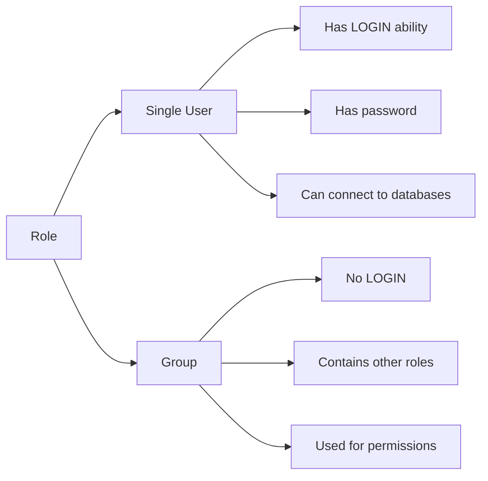
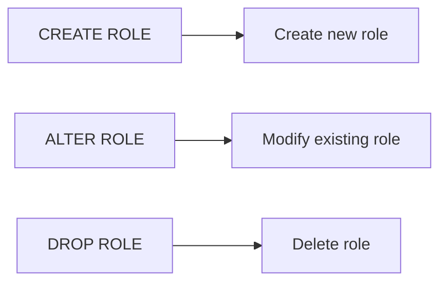
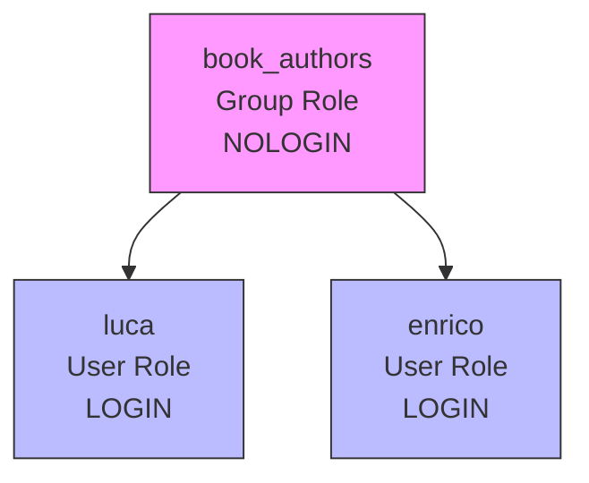
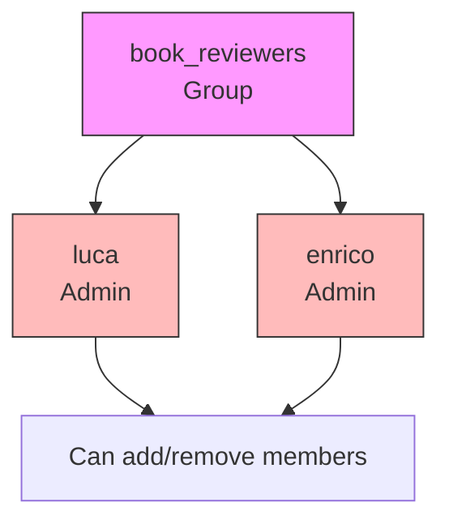
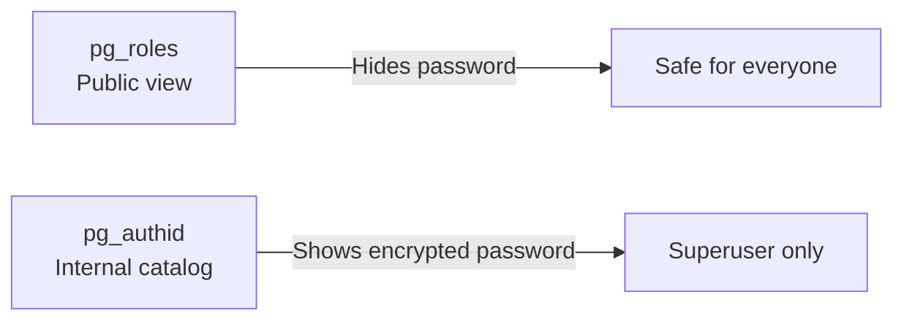
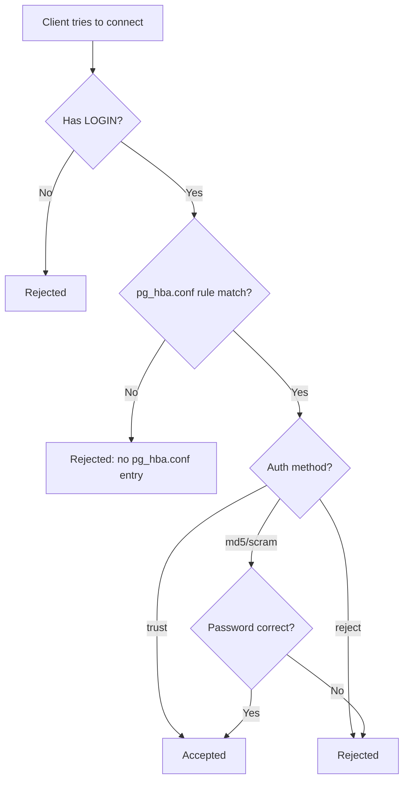
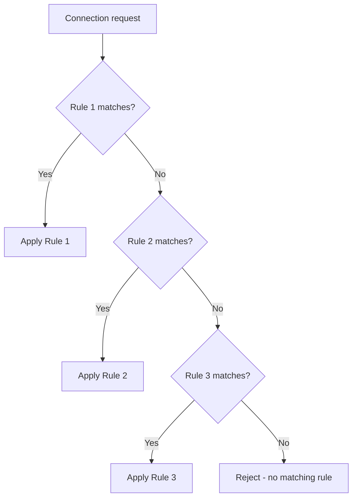
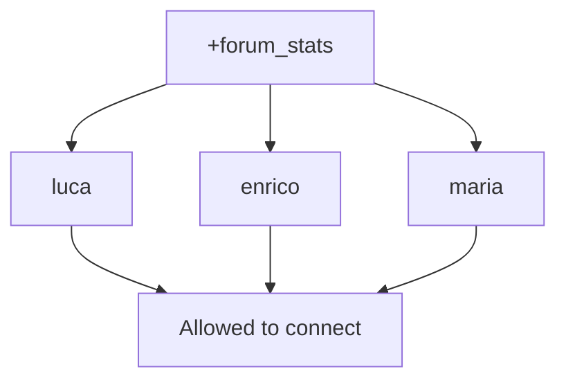
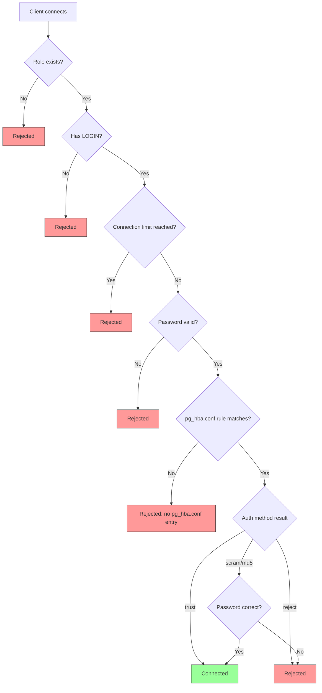

| Rule | Explanation |
|------|-------------|
| **Unique names** | No two roles can have the same name in the entire cluster |
| **Cluster-level** | Roles exist across the whole cluster, not just one database |
| **Different privileges per database** | The same role can have different permissions in different databases |

---





**Positive vs Negative options:**
- `SUPERUSER` / `NOSUPERUSER`
- `LOGIN` / `NOLOGIN`
- `CREATEDB` / `NOCREATEDB`

default is `NOLOGIN` — so if you forget `LOGIN`, the user cannot log in!

```sql
CREATE ROLE luca WITH LOGIN PASSWORD 'xxx';
```

| Option               | What It Does                                      |
| -------------------- | ------------------------------------------------- |
| `PASSWORD 'xxx'`     | Sets the password (stored encrypted)              |
| `CONNECTION LIMIT n` | Max simultaneous connections (default: unlimited) |
| `VALID UNTIL 'date'` | Password expires at this date                     |
| `LOGIN` / `NOLOGIN`  | Can the role log in?                              |

```sql
CREATE ROLE luca
WITH LOGIN PASSWORD 'xxx'
VALID UNTIL '2020-12-25 23:59:59';
```
---
### How Groups Work




**Method 1: Using IN ROLE**
```sql
CREATE ROLE book_authors WITH NOLOGIN;
CREATE ROLE luca WITH LOGIN PASSWORD 'xxx' IN ROLE book_authors;
CREATE ROLE enrico WITH LOGIN PASSWORD 'xxx' IN ROLE book_authors;
```

**Method 2: Using GRANT**
```sql
CREATE ROLE book_authors WITH NOLOGIN;
CREATE ROLE luca WITH LOGIN PASSWORD 'xxx';
CREATE ROLE enrico WITH LOGIN PASSWORD 'xxx';

GRANT book_authors TO luca;
GRANT book_authors TO enrico;
```

```sql
-- Create group with luca as admin
CREATE ROLE book_reviewers
WITH NOLOGIN
ADMIN luca;

-- Make enrico an admin too (using GRANT)
GRANT book_reviewers TO enrico WITH ADMIN OPTION;
```


## Part 4: Removing Roles

```sql
DROP ROLE IF EXISTS name;
DROP ROLE IF EXISTS name1, name2, name3;
```

```sql
DROP ROLE IF EXISTS this_role_does_not_exists;
NOTICE: role "this_role_does_not_exists" does not exist, skipping
DROP ROLE
```

### Check Your Current Role
```sql
SELECT current_role;
```

### List All Roles with `\du`
```sql
\du
```

### Query the Catalog
```sql
SELECT rolname, rolcanlogin, rolconnlimit, rolpassword
FROM pg_roles
WHERE rolname = 'luca';
```
**Note:** `pg_roles` hides the password. Use `pg_authid` to see the encrypted hash:
```sql
SELECT rolname, rolcanlogin, rolconnlimit, rolpassword
FROM pg_authid WHERE rolname = 'luca';
```




---

## Managing Connections — `pg_hba.conf`

Even if a role has `LOGIN`, it still needs permission from the **HBA (Host-Based Access)** file. Think of it as a **firewall for database connections**.



### Syntax of `pg_hba.conf`

Each line has 5 fields:

| Field | Options | Meaning |
|-------|---------|---------|
| **connection-type** | `local`, `host`, `hostssl` | Socket, TCP/IP, or SSL-encrypted TCP/IP |
| **database** | specific name or `all` | Which database(s) |
| **role** | specific name, `all`, `+group`, `@file` | Which role(s) |
| **remote-machine** | hostname, IP, subnet, `all`, `samehost`, `samenet` | Where from |
| **auth-method** | `scram-sha-256`, `md5`, `reject`, `trust` | How to authenticate |

### Auth Methods Explained

| Method | Meaning |
|--------|---------|
| `scram-sha-256` | Most secure (PostgreSQL 10+) |
| `md5` | Older, less secure |
| `reject` | Always refuse |
| `trust` | Always accept (NO password!) — **never use in production** |

### Example `pg_hba.conf`

```
host    all       luca      carmensita            scram-sha-256
hostssl all       test      192.168.222.1/32      scram-sha-256
host    digikamdb pgwatch2  192.168.222.4/32      trust
host    digikamdb enrico    carmensita            reject
```

**Translation:**
1. `luca` can connect to any DB from host `carmensita` with password
2. `test` can connect to any DB via SSL from `192.168.222.1` with password
3. `pgwatch2` can connect to `digikamdb` from `192.168.222.4` without password
4. `enrico` is **blocked** from `digikamdb` from `carmensita`

### Applying Changes

After editing `pg_hba.conf`:
```bash
$EDITOR $PGDATA/pg_hba.conf
sudo -u postgres pg_ctl reload -D $PGDATA
```

---

**First match wins.** The rest are skipped.

```
host all      luca all scram-sha-256
host forumdb  luca all reject
```
Why? Because `luca` connecting to `forumdb` matches the **first** line (`all` includes `forumdb`), so he gets in. The `reject` line is never reached.

### Correct Order
```
host forumdb  luca all reject
host all      luca all scram-sha-256
```
Now `luca` connecting to `forumdb` hits the `reject` first. Connecting to anything else falls through to the second line.



---

**Before merging:**
```
host forumdb    luca   samenet scram-sha-256
host forumdb    enrico samenet scram-sha-256
host digikamdb  luca   samenet scram-sha-256
host digikamdb  enrico samenet scram-sha-256
```

**After merging databases:**
```
host forumdb,digikamdb luca   samenet scram-sha-256
host forumdb,digikamdb enrico samenet scram-sha-256
```

**After merging roles:**
```
host forumdb,digikamdb luca,enrico samenet scram-sha-256
```

---

## Part 9: Using Groups in `pg_hba.conf`

### Without `+` (doesn't work for members)
```
host forumdb forum_stats all scram-sha-256
```
This only matches a role literally named `forum_stats`. `luca` (a member) is **denied**.

### With `+` (works for all members)
```
host forumdb +forum_stats all scram-sha-256
```
The `+` means "all members of this group, including indirect members."



### Excluding One Member

Want to allow the whole group **except** `luca`?

```
host forumdb luca         all reject
host forumdb +forum_stats all scram-sha-256
```

First match wins → `luca` is rejected before the group rule can accept him.

---

## Part 10: Using Files in `pg_hba.conf`

Instead of listing roles inline, you can use `@filename` to read from a file.

```
host forumdb @rejected_users.txt all reject
host forumdb @allowed_users.txt  all scram-sha-256
```

**Contents of `rejected_users.txt`:**
```
luca
enrico
```

**Contents of `allowed_users.txt`:**
```
+forum_stats, postgres
```

**Rules:**
- `@` prefix = read from file
- File is relative to PGDATA
- Can be line-separated or comma-separated
- `+` prefix still works for groups

---

## Part 11: Complete Flow Diagram

Here's how a connection request flows through the entire system:



---

| Concept | Simple Explanation |
|---------|-------------------|
| **Role** | A user or group in PostgreSQL |
| **LOGIN** | Required for a role to connect interactively |
| **Group** | A role without LOGIN that contains other roles |
| **IN ROLE** | Add a new role to a group at creation |
| **GRANT** | Add an existing role to a group |
| **ADMIN option** | Makes someone a group administrator |
| **DROP ROLE** | Delete a role (doesn't cascade to members) |
| **IF EXISTS** | Avoid errors when deleting non-existent roles |
| **pg_hba.conf** | Firewall for connections |
| **First match wins** | Rule order matters! |
| **`+group`** | Include all group members |
| **`@file`** | Read roles from a file |
| **trust** | No password — never use in production |
| **scram-sha-256** | Most secure password method |
| **reload** | Apply pg_hba.conf changes without restart |

---

1. **Always separate users and groups** — don't make a role do both.
2. **Always use LOGIN explicitly** — the default is NOLOGIN.
3. **Never use `trust` in production** — it's a security hole.
4. **Order matters in pg_hba.conf** — first match wins.
5. **Use `+group` to include members** — without `+`, it only matches the group name literally.
6. **Reload after editing pg_hba.conf** — changes don't apply automatically.
7. **Use IF EXISTS in scripts** — avoid unnecessary failures.
8. **Passwords are always encrypted** — you can never see them in plain text.