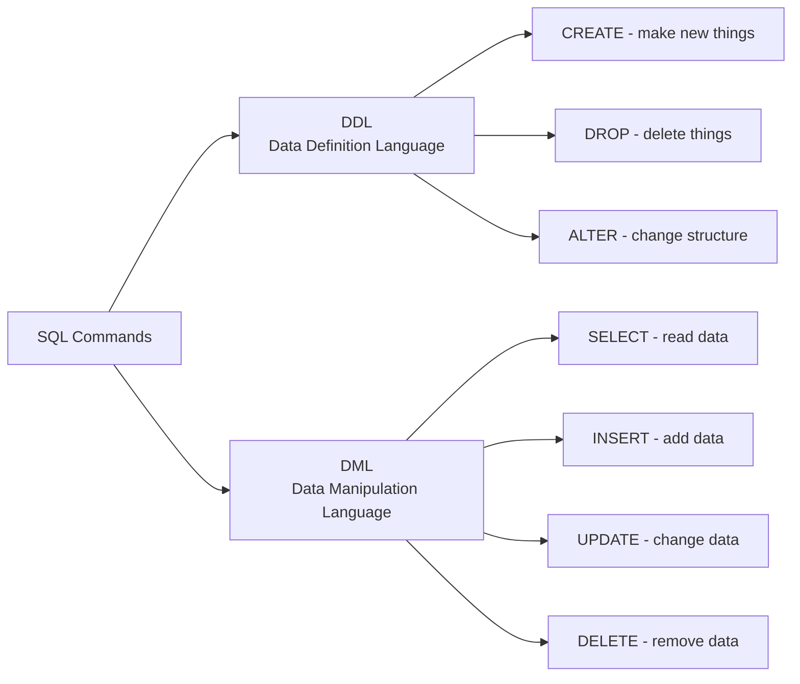

- **DDL** = commands that define the **structure** (databases, tables)
- **DML** = commands that work with the **data inside** those structures

```bash
$ sudo -u postgres psql
psql (12.1)
Type "help" for help.
postgres=#
```

| Command | What It Does |
|---------|-------------|
| `\x` | Toggle expanded display (one field per line) |
| `\l` | List all databases |
| `\c dbname` | Connect to a database |
| `\d` | List all tables |
| `\d tablename` | Describe a table |
| `\pset null NULL` | Show NULL values as "NULL" |

```sql
CREATE DATABASE x;
```

**What happens behind the scenes:**
1. PostgreSQL makes a **physical copy** of `template1`
2. Assigns the new name to the copy

```
template1  ──copy──>  forumdb
```

### List Tables in a Database

```sql
forumdb=# \d
```

```
+-------------------+--------------+----------+
| Schema            | Name         | Type     |
+-------------------+--------------+----------+
| public            | users        | table    |
| public            | posts        | table    |
| public            | tags         | table    |
| public            | categories   | table    |
| public            | users_pk_seq | sequence |
+-------------------+--------------+----------+
```

### Making New Database from a Modified Template

1. Connect to `template1`
2. Create a table called `dummytable`
3. Create a new database `dummydb`
4. The new database will **also have** `dummytable`!

```sql
-- Connect to template1
forumdb=# \c template1

-- Create a table
template1=# CREATE TABLE dummytable (
    dummyfield integer NOT NULL PRIMARY KEY
);
CREATE TABLE

-- Create new database
template1=# CREATE DATABASE dummydb;
CREATE DATABASE

-- Connect to new database
template1=# \c dummydb

-- Check tables
dummydb=# \d
```

```
+----------+------------+-------+----------+
| Schema   | Name       | Type  | Owner    |
+----------+------------+-------+----------+
| public   | dummytable | table | postgres |
+----------+------------+-------+----------+
```

> **Key Rule:** Any change to `template1` appears in **all databases created afterward**.


```sql
-- Drop a table (must be connected to its database)
DROP TABLE x;

-- Drop a database
DROP DATABASE x;
```

**Example:**
```sql
template1=# DROP TABLE dummytable;
DROP TABLE

template1=# DROP DATABASE dummydb;
DROP DATABASE
```

### Database Copy

```sql
CREATE DATABASE forumdb2 TEMPLATE forumdb;
```

```
forumdb  ──copy──>  forumdb2
  ├── users           ├── users
  ├── posts           ├── posts
  ├── tags            ├── tags
  └── categories      └── categories
```

### Checking Database Size

**Method 1: psql**
```sql
forumdb=# \l+ forumdb
```
Output:
```
-[ RECORD 1 ]-----+------------
Name              | forumdb
Owner             | postgres
Size              | 8369 kB
Tablespace        | pg_default
```

**Method 2: SQL**
```sql
SELECT pg_database_size('forumdb');
-- Result: 8569711 (bytes)

SELECT pg_size_pretty(pg_database_size('forumdb'));
-- Result: 8369 kB (human-readable)
```

### Behind the Scenes: pg_database Catalog

```sql
SELECT * FROM pg_database WHERE datname='forumdb';
```

```
+------------------+-----------------------+
| Field            | Value                 |
+------------------+-----------------------+
| oid              | 16630                 |
| datname          | forumdb               |
| datdba           | 10                    |
| encoding         | 6                     |
| datcollate       | en_US.UTF-8           |
| datctype         | en_US.UTF-8           |
| datistemplate    | f                     |
| datallowconn     | t                     |
| datconnlimit     | -1                    |
| dattablespace    | 1663                  |
+------------------+-----------------------+
```

The **OID** (Object Identifier) `16630` matches a directory name in the filesystem:

```
/var/lib/postgresql/12/main/base/
├── 1          → template1
├── 14049      → postgres
├── 14050      → template0
└── 16630      → forumdb
```

> **In PostgreSQL, databases are directories.**

---
### Three Types of Tables

| Type                 | Speed     | Crash-Safe? | Visible To       |
| -------------------- | --------- | ----------- | ---------------- |
| **Temporary**        | Very fast | No          | Only the session |
| **Unlogged**         | Very fast | No          | All users        |
| **Logged** (regular) | Normal    | Yes         | All users        |


```sql
CREATE TABLE users (
    pk int GENERATED ALWAYS AS IDENTITY,
    username text NOT NULL,
    gecos text,
    email text NOT NULL,
    PRIMARY KEY (pk),
    UNIQUE (username)
);
```

```
+----------+---------+-----------+----------+---------------------------+
| Column   | Type    | Collation | Nullable | Default                   |
+----------+---------+-----------+----------+---------------------------+
| pk       | integer |           | not null | generate as identity      |
| username | text    |           | not null |                           |
| gecos    | text    |           |          |                           |
| email    | text    |           | not null |                           |
+----------+---------+-----------+----------+---------------------------+
```

**Indexes created automatically:**
```
Indexes:
  "users_pkey" PRIMARY KEY, btree (pk)
  "users_username_key" UNIQUE CONSTRAINT, btree (username)
```

> **Note:** Primary keys are implemented using **unique indexes** in PostgreSQL.

### IF NOT EXISTS / IF EXISTS

**CREATE with IF NOT EXISTS:**
```sql
CREATE TABLE IF NOT EXISTS users (...);
-- If users exists: NOTICE: relation "users" already exists, skipping
```

**DROP with IF EXISTS:**
```sql
DROP TABLE IF EXISTS users;
-- If users doesn't exist: NOTICE: table "users" does not exist, skipping
```

### Temporary Tables

**Session-level temp table:**
```sql
CREATE TEMP TABLE temp_users (...);
```
- Visible only in the **session** where created
- Automatically dropped when session ends

**Transaction-level temp table:**
```sql
BEGIN WORK;
CREATE TEMP TABLE temp_users (...) ON COMMIT DROP;
-- Table exists only inside this transaction
COMMIT WORK;
-- Table is gone!
```

```
Session starts
  │
  ├── BEGIN ─────────────────────┐
  │     │                        │
  │     ├── CREATE TEMP TABLE    │  ← Table exists here
  │     │   ... ON COMMIT DROP   │
  │     │                        │
  │     └── COMMIT ──────────────┘  ← Table disappears
  │
  └── Session ends
```

```sql
CREATE UNLOGGED TABLE unlogged_users (...);
```
- **Much faster** than regular tables
- **NOT crash-safe** — data may be lost in a crash
- Good for temporary/support data

### Behind the Scenes: Table Storage

**Query the catalog:**
```sql
SELECT oid, relname FROM pg_class WHERE relname='users';
```
```
+-------+---------+
| oid   | relname |
+-------+---------+
| 16630 | users   |
+-------+---------+
```

**Filesystem view:**
```
/var/lib/postgresql/12/main/base/16630/
├── 16633       ← users table (first 1 GB)
├── 16633.1     ← users table (second GB, if needed)
├── 16633.2     ← users table (third GB, if needed)
└── ...
```

**Rule:** Each table is stored in **1 GB segments**. When a table exceeds 1 GB, a new file is created with a numeric suffix.

---

```sql
INSERT INTO users (username, gecos, email)
VALUES ('myusername', 'mygecos', 'myemail');
```

```
INSERT 0 1
```
(0 = OID, 1 = number of rows inserted)

**Insert multiple rows at once:**
```sql
INSERT INTO categories (title, description)
VALUES ('apple', 'fruits'),
       ('orange', 'fruits'),
       ('lettuce', 'vegetable');
```

```
INSERT 0 3
```

```sql
SELECT * FROM users;
```

```
+----+------------+---------+---------+
| pk | username   | gecos   | email   |
+----+------------+---------+---------+
| 1  | myusername | mygecos | myemail |
+----+------------+---------+---------+
```

**Select specific columns:**
```sql
SELECT pk, username, gecos, email FROM users;
```

**With ORDER BY:**
```sql
SELECT pk, username, gecos, email FROM users ORDER BY username;
```
```
+----+------------+--------------+--------------+
| pk | username   | gecos        | email        |
+----+------------+--------------+--------------+
| 1  | myusername | mygecos      | myemail      |
| 2  | scotty     | scotty_gecos | scotty_email |
+----+------------+--------------+--------------+
```

**With WHERE:**
```sql
SELECT * FROM categories WHERE description = 'vegetable';
```
```
+----+---------+-------------+
| pk | title   | description |
+----+---------+-------------+
| 12 | lettuce | vegetable   |
+----+---------+-------------+
```

**With AND:**
```sql
SELECT * FROM categories
WHERE description = 'fruits' AND title = 'orange';
```
```
+----+--------+-------------+
| pk | title  | description |
+----+--------+-------------+
| 11 | orange | fruits      |
+----+--------+-------------+
```

**With ORDER BY DESC:**
```sql
SELECT * FROM categories
WHERE description = 'fruits'
ORDER BY title DESC;
```
```
+----+--------+-------------+
| pk | title  | description |
+----+--------+-------------+
| 11 | orange | fruits      |
| 10 | apple  | fruits      |
+----+--------+-------------+
```

> **Tip:** `ORDER BY 2` means "order by the 2nd column" (position-based sorting).

---
**NULL** = a special marker meaning **"no value"** or **"unknown"**.

It is **NOT** the same as:
- Empty string `''`
- Zero `0`
- False

```sql
INSERT INTO categories (title) VALUES ('lemon');
-- description is not specified, so it becomes NULL
```

```
+----+---------+-------------+
| pk | title   | description |
+----+---------+-------------+
| 10 | apple   | fruits      |
| 11 | orange  | fruits      |
| 12 | lettuce | vegetable   |
| 13 | lemon   | NULL        |  ← NULL here
+----+---------+-------------+
```

### Searching for NULL

**WRONG way:**
```sql
SELECT * FROM categories WHERE description = '';
-- Returns 0 rows (empty string ≠ NULL)
```

**RIGHT way:**
```sql
SELECT * FROM categories WHERE description IS NULL;
```

```
+-------+-------------+
| title | description |
+-------+-------------+
| lemon | NULL        |
+-------+-------------+
```

**NOT NULL:**
```sql
SELECT * FROM categories WHERE description IS NOT NULL;
```

```
+---------+-------------+
| title   | description |
+---------+-------------+
| apple   | fruits      |
| orange  | fruits      |
| lettuce | vegetable   |
+---------+-------------+
```

### Showing NULL in psql

```sql
\pset null NULL
```
Now NULL values display as `NULL` instead of blank.

### Sorting with NULL

**NULLS LAST (default for ASC):**
```sql
SELECT * FROM categories ORDER BY description NULLS LAST;
```

```
+----+---------+-------------+
| pk | title   | description |
+----+---------+-------------+
| 10 | apple   | fruits      |
| 11 | orange  | fruits      |
| 14 | apricot | fruits      |
| 12 | lettuce | vegetable   |
| 13 | lemon   | NULL        |  ← at end
+----+---------+-------------+
```

**NULLS FIRST:**
```sql
SELECT * FROM categories ORDER BY description NULLS FIRST;
```
```
+----+---------+-------------+
| pk | title   | description |
+----+---------+-------------+
| 13 | lemon   | NULL        |  ← at start
| 10 | apple   | fruits      |
| 11 | orange  | fruits      |
| 14 | apricot | fruits      |
| 12 | lettuce | vegetable   |
+----+---------+-------------+
```

**Default behavior:**
- `ASC` → `NULLS LAST`
- `DESC` → `NULLS FIRST`

---

```sql
CREATE TEMP TABLE temp_categories AS
SELECT * FROM categories;
```

This creates a new table with the **same structure and data**.

**Original `categories`:**
```
+----+---------+-------------+
| pk | title   | description |
+----+---------+-------------+
| 10 | apple   | fruits      |
| 11 | orange  | fruits      |
| 12 | lettuce | vegetable   |
| 13 | lemon   | NULL        |
| 14 | apricot | fruits      |
+----+---------+-------------+
```

**New `temp_categories` (identical copy):**
```
+----+---------+-------------+
| pk | title   | description |
+----+---------+-------------+
| 10 | apple   | fruits      |
| 11 | orange  | fruits      |
| 12 | lettuce | vegetable   |
| 13 | lemon   | NULL        |
| 14 | apricot | fruits      |
+----+---------+-------------+
```

---

```sql
UPDATE temp_categories
SET title = 'peach'
WHERE pk = 14;
```

```
UPDATE 1
```

**Before:**
```
+----+---------+-------------+
| 14 | apricot | fruits      |
+----+---------+-------------+
```

**After:**
```
+----+-------+-------------+
| 14 | peach | fruits      |
+----+-------+-------------+
```

**Update multiple rows:**
```sql
UPDATE temp_categories
SET title = 'no title'
WHERE description = 'vegetable';
```

```
UPDATE 1
```

---

```sql
DELETE FROM temp_categories WHERE pk = 10;
```

```
DELETE 1
```

```sql
DELETE FROM temp_categories WHERE description IS NULL;
```

```
DELETE 1
```

**Delete ALL rows:**
```sql
DELETE FROM temp_categories;
```

```
DELETE 3
```

### TRUNCATE — Fast Delete All

```sql
TRUNCATE TABLE temp_categories;
```

```
TRUNCATE TABLE
```

### Insert Data from Another Table

```sql
INSERT INTO temp_categories
SELECT * FROM categories;
```

```
INSERT 0 5
```

## Key Takeaways

1. **DDL** defines structure; **DML** works with data
2. **Databases are directories** on disk, named by OID
3. **Tables are files** in those directories (1 GB segments)
4. **template1** is the source for new databases — changes to it propagate
5. **Three table types:** temp (session-only), unlogged (fast, unsafe), logged (regular, safe)
6. **NULL is not empty string** — use `IS NULL` / `IS NOT NULL`
7. **ORDER BY** defaults: ASC → NULLS LAST, DESC → NULLS FIRST
8. **TRUNCATE** is faster than DELETE but can't use WHERE
9. **Always use IF EXISTS / IF NOT EXISTS** in scripts to avoid errors
10. **UPDATE and DELETE are dangerous** in auto-commit mode — no undo!