```sql
SELECT * FROM categories WHERE pk > 12 ORDER BY title;
```

```
+----+---------+-------------+
| pk | title   | description |
+----+---------+-------------+
| 14 | apricot | fruits      |
| 13 | lemon   | NULL        |
+----+---------+-------------+
```

### Pattern Matching

**Starts with 'a':**
```sql
SELECT * FROM categories WHERE title LIKE 'a%';
```
```
+----+---------+-------------+
| 10 | apple   | fruits      |
| 14 | apricot | fruits      |
+----+---------+-------------+
```

**Ends with 'e':**
```sql
SELECT * FROM categories WHERE title LIKE '%e';
```
```
+----+--------+-------------+
| 10 | apple  | fruits      |
| 11 | orange | fruits      |
+----+--------+-------------+
```

**Contains 'ap':**
```sql
SELECT * FROM categories WHERE title LIKE '%ap%';
```
```
+----+---------+-------------+
| 10 | apple   | fruits      |
| 14 | apricot | fruits      |
+----+---------+-------------+
```

**Case-Sensitive Problem:**
```sql
SELECT * FROM categories WHERE title LIKE 'A%';
-- Returns 0 rows! (LIKE is case-sensitive)
```

**Solution 1: Use UPPER()**
```sql
SELECT * FROM categories WHERE UPPER(title) LIKE 'A%';
```

**Solution 2: Use ILIKE (PostgreSQL-specific)**
```sql
SELECT * FROM categories WHERE title ILIKE 'A%';
```
Both return:
```
+----+---------+-------------+
| 10 | apple   | fruits      |
| 14 | apricot | fruits      |
+----+---------+-------------+
```

### The COALESCE Function

Returns the **first non-NULL** value.

```sql
SELECT COALESCE(NULL, 'test');       -- Result: 'test'
SELECT COALESCE('orange', 'test');   -- Result: 'orange'
```

**Practical use:**
```sql
SELECT description, COALESCE(description, 'No description') FROM categories;
```
```
+-------------+----------------+
| description | coalesce       |
+-------------+----------------+
| fruits      | fruits         |
| fruits      | fruits         |
| fruits      | fruits         |
| vegetable   | vegetable      |
| NULL        | No description |
+-------------+----------------+
```

### Aliases (AS)

```sql
SELECT COALESCE(description, 'No description') AS description FROM categories;
```

**Rule for aliases with spaces or capitals:** Use double quotes!
```sql
SELECT COALESCE(description, 'No description') AS "Description" FROM categories;
```

### DISTINCT (Remove Duplicates)

```sql
SELECT DISTINCT COALESCE(description, 'No description') AS description
FROM categories ORDER BY 1;
```
```
+----------------+
| description    |
+----------------+
| fruits         |
| No description |
| vegetable      |
+----------------+
```

⚠️ **Warning:** DISTINCT requires sorting → slower on large tables.

### LIMIT and OFFSET (Pagination)

**LIMIT 1:**
```sql
SELECT * FROM categories ORDER BY pk LIMIT 1;
```
```
+----+-------+-------------+
| 10 | apple | fruits      |
+----+-------+-------------+
```

**LIMIT 2:**
```sql
SELECT * FROM categories ORDER BY pk LIMIT 2;
```
```
+----+--------+-------------+
| 10 | apple  | fruits      |
| 11 | orange | fruits      |
+----+--------+-------------+
```

**OFFSET 1 LIMIT 1 (get the 2nd row):**
```sql
SELECT * FROM categories ORDER BY pk OFFSET 1 LIMIT 1;
```
```
+----+--------+-------------+
| 11 | orange | fruits      |
+----+--------+-------------+
```

**Trick: Create empty table with same structure**
```sql
CREATE TABLE new_categories AS SELECT * FROM categories LIMIT 0;
-- Copies only the structure, no data
```

---

## Part 2: Subqueries

### IN / NOT IN

**Instead of multiple ORs:**
```sql
-- Long way
SELECT * FROM categories WHERE pk=10 OR pk=11;

-- Short way
SELECT * FROM categories WHERE pk IN (10, 11);
```

**NOT IN:**
```sql
SELECT * FROM categories WHERE pk NOT IN (10, 11);
```

### Subquery Example

**Find posts in the "orange" category:**
```sql
SELECT pk, title, category FROM posts
WHERE category IN (SELECT pk FROM categories WHERE title = 'orange');
```

**How it works:**
```
Step 1: Inner query runs first
        SELECT pk FROM categories WHERE title = 'orange'
        Result: (11)

Step 2: Outer query uses that result
        SELECT ... FROM posts WHERE category IN (11)
```

```
+------------------+          +------------------+
| categories       |          | posts            |
+------------------+          +------------------+
| pk=11, orange    |◄────────►| category=11      |
+------------------+          +------------------+
```

### EXISTS / NOT EXISTS

**EXISTS returns TRUE if subquery returns any rows:**
```sql
SELECT pk, title FROM posts
WHERE EXISTS (
    SELECT 1 FROM categories
    WHERE title = 'orange' AND posts.category = pk
);
```

**NOT EXISTS:**
```sql
SELECT pk, title FROM posts
WHERE NOT EXISTS (
    SELECT 1 FROM categories
    WHERE title = 'orange' AND posts.category = pk
);
```

> **Note:** IN and EXISTS are called **semi-join queries**.

---

## Part 3: JOINs — The Big Topic

### What is a JOIN?

A **join** combines rows from two or more tables based on a related column.

### CROSS JOIN (Cartesian Product)

**Every row from table A × every row from table B**

```sql
SELECT c.pk, c.title, p.pk, p.title
FROM categories c, posts p;
-- Or:
SELECT c.pk, c.title, p.pk, p.title
FROM categories c CROSS JOIN posts p;
```

**Visual:**
```
Table A (5 rows)  ×  Table B (4 rows)  =  20 rows
```

**Diagram:**
```
        ┌─────────┐         ┌─────────┐
        │ Table A │         │ Table B │
        │  ●   ●  │         │  ●   ●  │
        └─────────┘         └─────────┘
              ╲               ╱
               ╲             ╱
                ╲           ╱
                 ▼         ▼
            Every combination
```

### INNER JOIN (Matching Rows Only)

**Only rows that match in BOTH tables.**

**Diagram (Venn):**
```
        ┌─────────┐
        │ Table A │
        │    ┌────┼────┐
        │    │████│    │  ← INNER JOIN
        │    │████│    │     (intersection)
        │    └────┼────┘
        │         │ Table B │
        └─────────┘
```

**Query:**
```sql
SELECT c.pk, c.title, p.pk, p.title
FROM categories c
INNER JOIN posts p ON c.pk = p.category;
```

**Result:**
```
+----+--------+----+--------------+
| 11 | orange | 2  | my orange    |
| 10 | apple  | 3  | my apple     |
| 11 | orange | 4  | Re:my orange |
| 12 | tomato | 5  | my tomato    |
+----+--------+----+--------------+
```

**INNER JOIN vs IN/EXISTS:**
- INNER JOIN performs **better** than IN/EXISTS
- Prefer JOIN whenever possible

### LEFT JOIN (All Left + Matching Right)

**All rows from LEFT table + matching rows from RIGHT table**
**If no match → NULL for right side columns**

**Diagram (Venn):**
```
        ┌─────────┐
        │ Table A │
        │█████████┼────┐
        │█████████│████│  ← LEFT JOIN
        │█████████┼────┘     (all of A)
        │         │ Table B │
        └─────────┘
```

**Query:**
```sql
SELECT c.*, p.category, p.title
FROM categories c
LEFT JOIN posts p ON c.pk = p.category;
```

**Result:**
```
+----+---------+----------+--------------+
| 11 | orange  | 11       | my orange    |
| 10 | apple   | 10       | my apple     |
| 11 | orange  | 11       | Re:my orange |
| 12 | tomato  | 12       | my tomato    |
| 13 | lemon   | NULL     | NULL         |  ← no match
| 14 | apricot | NULL     | NULL         |  ← no match
+----+---------+----------+--------------+
```

**Find categories with NO posts:**
```sql
SELECT c.* FROM categories c
LEFT JOIN posts p ON p.category = c.pk
WHERE p.category IS NULL;
```

### RIGHT JOIN (Matching Left + All Right)

**Mirror of LEFT JOIN.**

**Diagram:**
```
        ┌─────────┐
        │ Table A │
        │    ┌────┼─────┐
        │    │████│█████│  ← RIGHT JOIN
        │    └────┼█████│     (all of B)
        │         │█████│
        └─────────┘ Table B │
                  └─────┘
```

**Query:**
```sql
SELECT c.*, p.category, p.title
FROM posts p
RIGHT JOIN categories c ON c.pk = p.category;
```

### FULL OUTER JOIN (Everything from Both)

**All rows from BOTH tables.**
**NULLs where no match exists.**

**Diagram:**
```
        ┌─────────┐
        │ Table A │
        │█████████┼─────┐
        │█████████│█████│  ← FULL OUTER JOIN
        │█████████┼█████│     (all of A + all of B)
        │         │█████│
        └─────────┘ Table B │
                  └─────┘
```

**Query:**
```sql
SELECT jpt.*, t.*, p.title
FROM j_posts_tags jpt
FULL OUTER JOIN tags t ON jpt.tag_pk = t.pk
FULL OUTER JOIN posts p ON jpt.post_pk = p.pk;
```

**Result:**
```
+--------+---------+-----+------------+--------+--------------+
| tag_pk | post_pk | pk  | tag        | parent | title        |
+--------+---------+-----+------------+--------+--------------+
| 1      | 2       | 1   | fruits     | NULL   | my orange    |
| 1      | 3       | 1   | fruits     | NULL   | my apple     |
| NULL   | NULL    | 2   | vegetables | NULL   | NULL         |
| NULL   | NULL    | NULL| NULL       | NULL   | my tomato    |
| NULL   | NULL    | NULL| NULL       | NULL   | Re:my orange |
+--------+---------+----+-------------+--------+--------------+
```

**FULL OUTER JOIN vs CROSS JOIN:**
- CROSS JOIN = **Cartesian product** (every combination)
- FULL OUTER JOIN = **matching rows + unmatched from both sides**

### SELF JOIN (Table Joined to Itself)

**Use case:** Find posts by author 2 that share a category with posts by author 1.

```sql
SELECT DISTINCT p2.title, p2.author, p2.category
FROM posts p1, posts p2
WHERE p1.category = p2.category
  AND p1.author <> p2.author
  AND p1.author = 1
  AND p2.author = 2;
```

**Or with INNER JOIN:**
```sql
SELECT DISTINCT p2.title, p2.author, p2.category
FROM posts p1
INNER JOIN posts p2 ON (p1.category = p2.category
                        AND p1.author <> p2.author)
WHERE p1.author = 1 AND p2.author = 2;
```

**Result:**
```
+--------------+--------+----------+
| Re:my orange | 2      | 11       |
+--------------+--------+----------+
```

⚠️ **Must use aliases** when self-joining (p1, p2), otherwise PostgreSQL doesn't know which table you mean.

---

## Part 4: Aggregate Functions

### The Big Five

| Function | Purpose |
|----------|---------|
| `AVG()` | Average value |
| `COUNT()` | Number of rows |
| `MAX()` | Maximum value |
| `MIN()` | Minimum value |
| `SUM()` | Sum of values |

### GROUP BY

**Count posts per category:**
```sql
SELECT category, COUNT(*) FROM posts GROUP BY category;
```

**Visual:**
```
Original data:          Grouped:
+----+----------+       +----------+-------+
| pk | category |       | category | count |
+----+----------+       +----------+-------+
| 2  | 11       |       | 11       | 3     |
| 3  | 10       |  ──►  | 10       | 1     |
| 4  | 11       |       | 12       | 1     |
| 5  | 12       |       +----------+-------+
| 6  | 11       |
+----+----------+
```

**Result:**
```
+----------+-------+
| category | count |
+----------+-------+
| 11       | 3     |
| 10       | 1     |
| 12       | 1     |
+----------+-------+
```

**GROUP BY by position:**
```sql
SELECT category, COUNT(*) FROM posts GROUP BY 1;
-- 1 means the first column
```

### HAVING (Filter Groups)

```sql
SELECT category, COUNT(*) FROM posts
GROUP BY category
HAVING COUNT(*) > 2;
```
```
+----------+-------+
| 11       | 3     |
+----------+-------+
```

**Important:** You **cannot** use aliases in HAVING:
```sql
-- WRONG
SELECT category, COUNT(*) AS cnt FROM posts
GROUP BY category HAVING cnt > 2;
-- ERROR: column "cnt" does not exist
```

### UNION / UNION ALL

**Combine results from two queries.**

**Rules:**
- Same number of columns
- Similar data types
- Same column order

```sql
SELECT title FROM categories
UNION
SELECT tag FROM tags
ORDER BY title;
```

**UNION** removes duplicates. **UNION ALL** keeps them.

```
UNION result:        UNION ALL result:
+------------+       +------------+
| apple      |       | apple      |
| apricot    |       | apple      |  ← duplicate
| fruits     |       | apricot    |
| lemon      |       | fruits     |
| orange     |       | lemon      |
| tomato     |       | orange     |
| vegetables |       | tomato     |
+------------+       | vegetables |
                     +------------+
```

⚠️ **UNION is slower** because it sorts to remove duplicates. Use UNION ALL if you don't need deduplication.

### EXCEPT / INTERSECT

**EXCEPT** = rows in first query but NOT in second:
```sql
SELECT title FROM categories
EXCEPT
SELECT tag FROM tags;
```
```
+---------+
| apricot |
| lemon   |
| orange  |
| tomato  |
+---------+
```

**INTERSECT** = rows in BOTH queries:
```sql
SELECT title FROM categories
INTERSECT
SELECT tag FROM tags;
```
```
+-------+
| apple |
+-------+
```

---

## Part 5: UPSERT (INSERT or UPDATE)

PostgreSQL doesn't have a native UPSERT. Instead, use **ON CONFLICT**.

### DO NOTHING

```sql
INSERT INTO j_posts_tags VALUES (1, 2)
ON CONFLICT DO NOTHING;
```

**Result:** No error, no change if row exists.

### DO UPDATE (Real Upsert)

```sql
INSERT INTO j_posts_tags VALUES (1, 2)
ON CONFLICT (tag_pk, post_pk)
DO UPDATE SET tag_pk = excluded.tag_pk + 1;
```

**What happens:**
- If (1, 2) doesn't exist → INSERT
- If (1, 2) exists → UPDATE tag_pk to 2

**Result:**
```
Before:          After:
+--------+-------+    +--------+-------+
| tag_pk |post_pk|    |tag_pk | post_pk|
+--------+-------+    +--------+-------+
| 1      | 2     |    | 2      | 2     |
| 1      | 3     |    | 1      | 3     |
+--------+-------+    +--------+-------+
```

**`excluded`** = the row that would have been inserted.

---

## Part 6: RETURNING Clause

**Get back data from INSERT/UPDATE/DELETE:**

### INSERT ... RETURNING

```sql
INSERT INTO j_posts_tags VALUES (1, 2) RETURNING *;
```
```
+--------+---------+
| tag_pk | post_pk |
+--------+---------+
| 1      | 2       |
+--------+---------+
```

**Return specific columns:**
```sql
INSERT INTO j_posts_tags VALUES (1, 6) RETURNING tag_pk;
```

### UPDATE ... RETURNING

```sql
UPDATE t_posts
SET title = title || ' last updated ' || CURRENT_DATE::text
WHERE category IN (SELECT pk FROM categories WHERE title = 'apple')
RETURNING pk, title, category;
```
```
+----+--------------------------------------+----------+
| 3  | my new apple last updated 2020-01-09 | 10       |
+----+--------------------------------------+----------+
```

### DELETE ... RETURNING

```sql
DELETE FROM t_posts
WHERE category IN (SELECT pk FROM categories WHERE title = 'apple')
RETURNING pk, title, category;
```
```
+----+--------------+----------+
| 3  | my new apple | 10       |
+----+--------------+----------+
```

### UPDATE with FROM (PostgreSQL-specific)

```sql
UPDATE t_posts p
SET title = p.title || ' last updated ' || CURRENT_DATE::text
FROM categories c
WHERE c.pk = p.category AND c.title = 'apple';
```

This is like an **INNER JOIN in UPDATE**.

---

## Part 7: CTEs (Common Table Expressions)

### What is a CTE?

A **temporary result set** that exists only for the duration of a query.

**Syntax:**
```sql
WITH cte_name AS (
    SELECT ...  -- or INSERT/UPDATE/DELETE
)
SELECT * FROM cte_name;
```

### Simple CTE

```sql
WITH posts_author_1 AS (
    SELECT p.* FROM posts p
    INNER JOIN users u ON p.author = u.pk
    WHERE username = 'scotty'
)
SELECT pk, title FROM posts_author_1;
```
```
+----+--------------+
| 4  | Re:my orange |
| 5  | my tomato    |
+----+--------------+
```

**Same as inline view:**
```sql
SELECT pk, title FROM (
    SELECT p.* FROM posts p
    INNER JOIN users u ON p.author = u.pk
    WHERE u.username = 'scotty'
) posts_author_1;
```

### MATERIALIZED vs NOT MATERIALIZED (PostgreSQL 12+)

**MATERIALIZED** = compute once, store result:
```sql
WITH posts_author_1 AS MATERIALIZED (
    SELECT ...
)
SELECT * FROM posts_author_1;
```

**NOT MATERIALIZED** = inline the query:
```sql
WITH posts_author_1 AS NOT MATERIALIZED (
    SELECT ...
)
SELECT * FROM posts_author_1;
```

⚠️ **Default in PostgreSQL 12+ is NOT MATERIALIZED** — this can change query plans when migrating from older versions!

### CTE with INSERT/DELETE (Data Moving)

**Move deleted rows to another table:**
```sql
WITH del_posts AS (
    DELETE FROM t_posts
    WHERE category IN (SELECT pk FROM categories WHERE title = 'apple')
    RETURNING *
)
INSERT INTO delete_posts SELECT * FROM del_posts;
```

**Move all rows to another table:**
```sql
WITH ins_posts AS (
    INSERT INTO inserted_posts SELECT * FROM t_posts RETURNING pk
)
DELETE FROM t_posts WHERE pk IN (SELECT pk FROM ins_posts);
```

**Visual:**
```
t_posts  ──INSERT──►  inserted_posts
   │                        │
   └────DELETE◄─────────────┘
        (same transaction)
```

### Recursive CTEs

Used for **tree structures** (menus, org charts, category trees).

**Example: Expand tags tree**
```sql
WITH RECURSIVE tags_tree AS (
    -- Base case: top-level tags
    SELECT tag, pk, 1 AS level
    FROM tags WHERE parent IS NULL

    UNION

    -- Recursive case: children
    SELECT tt.tag || ' -> ' || ct.tag, ct.pk, tt.level + 1
    FROM tags ct
    JOIN tags_tree tt ON tt.pk = ct.parent
)
SELECT level, tag FROM tags_tree ORDER BY level;
```

**Result:**
```
+-------+-----------------+
| level | tag             |
+-------+-----------------+
| 1     | fruits          |
| 1     | vegetables      |
| 2     | fruits -> apple |
+-------+-----------------+
```

**Visual:**
```
Level 1:  fruits          vegetables
            │
Level 2:  apple

Result: "fruits -> apple"
```

⚠️ **Warning:** Avoid infinite loops — make sure recursion terminates!

---

## Part 8: Complete Summary Diagram

```mermaid
graph TD
    A[Chapter 5: Advanced Statements] --> B[SELECT Features]
    A --> C[Subqueries]
    A --> D[JOINs]
    A --> E[Aggregates]
    A --> F[UPSERT]
    A --> G[CTEs]
    
    B --> B1[LIKE / ILIKE]
    B --> B2[DISTINCT]
    B --> B3[LIMIT / OFFSET]
    B --> B4[COALESCE]
    B --> B5[Aliases]
    
    C --> C1[IN / NOT IN]
    C --> C2[EXISTS / NOT EXISTS]
    
    D --> D1[CROSS JOIN]
    D --> D2[INNER JOIN]
    D --> D3[LEFT JOIN]
    D --> D4[RIGHT JOIN]
    D --> D5[FULL OUTER JOIN]
    D --> D6[SELF JOIN]
    
    E --> E1[COUNT/SUM/AVG/MIN/MAX]
    E --> E2[GROUP BY]
    E --> E3[HAVING]
    E --> E4[UNION / UNION ALL]
    E --> E5[EXCEPT / INTERSECT]
    
    F --> F1[ON CONFLICT DO NOTHING]
    F --> F2[ON CONFLICT DO UPDATE]
    F --> F3[RETURNING]
    
    G --> G1[Basic CTE]
    G --> G2[MATERIALIZED]
    G --> G3[Data-moving CTE]
    G --> G4[Recursive CTE]
```



---

## Part 9: JOIN Cheat Sheet

| JOIN Type | Returns |
|-----------|---------|
| **CROSS** | Every combination (Cartesian product) |
| **INNER** | Only matching rows from both tables |
| **LEFT** | All rows from left + matching from right (NULL if no match) |
| **RIGHT** | Matching from left + all rows from right (NULL if no match) |
| **FULL OUTER** | All rows from both (NULL where no match) |
| **SELF** | Table joined to itself |

**Venn Diagram Cheat Sheet:**
```
CROSS JOIN:        INNER JOIN:       LEFT JOIN:        RIGHT JOIN:       FULL OUTER:
┌───┐ ┌───┐       ┌───┐ ┌───┐       ┌───┐ ┌───┐       ┌───┐ ┌───┐       ┌───┐ ┌───┐
│ A │ │ B │       │ A │ │ B │       │███│ │ B │       │ A │ │███│       │███│ │███│
│   │ │   │       │   │███│   │       │███│███│   │       │   │███│███│       │███│███│███│
│   │ │   │       │   │███│   │       │███│ │   │       │   │███│   │       │███│███│███│
└───┘ └───┘       └───┘ └───┘       └───┘ └───┘       └───┘ └───┘       └───┘ └───┘
 All × All         Only match         All A + match     match + All B     All A + All B
```

---

## Key Takeaways

1. **LIKE** is case-sensitive; **ILIKE** is not
2. **COALESCE** replaces NULL with a default value
3. **LIMIT/OFFSET** = pagination
4. **IN/EXISTS** = semi-joins; JOINs perform better
5. **INNER JOIN** = only matches
6. **LEFT/RIGHT JOIN** = keep all from one side
7. **FULL OUTER JOIN** = keep all from both sides
8. **CROSS JOIN** = Cartesian product (careful — can explode!)
9. **GROUP BY** = split into groups; **HAVING** = filter groups
10. **UNION** removes duplicates (slow); **UNION ALL** doesn't (fast)
11. **ON CONFLICT** = PostgreSQL's UPSERT
12. **RETURNING** = get data back from INSERT/UPDATE/DELETE
13. **CTEs** = temporary named result sets
14. **Recursive CTEs** = for tree/graph structures
15. **PostgreSQL 12+** defaults CTEs to NOT MATERIALIZED — watch out when migrating!