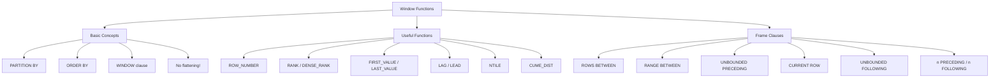

# Simple Explanation of Chapter 6: Window Functions

This chapter is about **window functions** — a powerful way to calculate aggregates **without collapsing rows**. Let me break it down with simple words and diagrams.

---

## Part 1: What Are Window Functions?

### The Big Difference

**Regular Aggregates (GROUP BY):**
- Data is **grouped** and **flattened**
- Multiple rows become **one row**

**Window Functions:**
- Data is **partitioned** but **NOT flattened**
- Every row keeps its identity
- Aggregate values are **repeated** for all rows in the same group

### Visual Comparison

**GROUP BY (flattens data):**
```
Original data:              After GROUP BY:
+----+----------+           +----------+-------+
| pk | category |           | category | count |
+----+----------+           +----------+-------+
| 2  | 11       |           | 10       | 1     |
| 3  | 10       |   ──►     | 11       | 3     |
| 4  | 11       |           | 12       | 1     |
| 5  | 12       |           +----------+-------+
| 6  | 11       |            (5 rows → 3 rows)
+----+----------+
```

**WINDOW FUNCTION (keeps all rows):**
```
Original data:              After Window Function:
+----+----------+           +----------+-------+
| pk | category |           | category | count |
+----+----------+           +----------+-------+
| 2  | 11       |           | 10       | 1     |
| 3  | 10       |   ──►     | 11       | 3     |
| 4  | 11       |           | 11       | 3     |
| 5  | 12       |           | 11       | 3     |
| 6  | 11       |           | 12       | 1     |
+----+----------+           +----------+-------+
                            (5 rows → 5 rows!)
```

**Key insight:** Window functions **duplicate** the aggregate result for every row in the partition.

---

## Part 2: Basic Syntax

### The OVER Clause

```sql
SELECT category, COUNT(*) OVER (PARTITION BY category)
FROM posts
ORDER BY category;
```

**Result:**
```
+----------+-------+
| category | count |
+----------+-------+
| 10       | 1     |
| 11       | 3     |
| 11       | 3     |
| 11       | 3     |
| 12       | 1     |
+----------+-------+
```

### Multiple OVER Clauses

```sql
SELECT category,
       COUNT(*) OVER (PARTITION BY category),
       COUNT(*) OVER ()
FROM posts
ORDER BY category;
```

**Result:**
```
+----------+-------+-------+
| category | count | count |
+----------+-------+-------+
| 10       | 1     | 5     |
| 11       | 3     | 5     |
| 11       | 3     | 5     |
| 11       | 3     | 5     |
| 12       | 1     | 5     |
+----------+-------+-------+
```

- First column: count per category
- Second column: total count (no partition)

### Using DISTINCT to Remove Duplicates

```sql
SELECT DISTINCT category,
       COUNT(*) OVER (PARTITION BY category),
       COUNT(*) OVER ()
FROM posts
ORDER BY category;
```

**Result:**
```
+----------+-------+-------+
| category | count | count |
+----------+-------+-------+
| 10       | 1     | 5     |
| 11       | 3     | 5     |
| 12       | 1     | 5     |
+----------+-------+-------+
```

### The WINDOW Clause (Named Windows)

Instead of repeating `OVER (...)`, give it a name:

```sql
SELECT DISTINCT category,
       COUNT(*) OVER w1,
       COUNT(*) OVER w2
FROM posts
WINDOW w1 AS (PARTITION BY category), w2 AS ()
ORDER BY category;
```

**Benefits:**
- Cleaner code
- Reuse the same window definition
- Very useful with many aggregates

---

## Part 3: Useful Window Functions

### generate_series (Helper Function)

Generates a series of numbers:

```sql
SELECT generate_series(1, 5);
```
```
+-----------------+
| generate_series |
+-----------------+
| 1               |
| 2               |
| 3               |
| 4               |
| 5               |
+-----------------+
```

### ROW_NUMBER()

Assigns a **unique sequential number** to each row within the partition.

```sql
SELECT category,
       ROW_NUMBER() OVER w,
       title
FROM posts
WINDOW w AS (PARTITION BY category ORDER BY title)
ORDER BY category;
```

**Result:**
```
+----------+------------+---------------+
| category | row_number | title         |
+----------+------------+---------------+
| 10       | 1          | my new apple  |
| 11       | 1          | my new orange |
| 11       | 2          | my orange     |
| 11       | 3          | Re:my orange  |
| 12       | 1          | my tomato     |
+----------+------------+---------------+
```

### FIRST_VALUE() and LAST_VALUE()

**FIRST_VALUE:** Returns the first value in the window
**LAST_VALUE:** Returns the last value in the window

```sql
SELECT category,
       ROW_NUMBER() OVER w,
       title,
       FIRST_VALUE(title) OVER w,
       LAST_VALUE(title) OVER w
FROM posts
WINDOW w AS (PARTITION BY category ORDER BY title)
ORDER BY category;
```

**Result:**
```
+----------+------------+---------------+--------------+---------------+
| category | row_number | title         | first_value  | last_value    |
+----------+------------+---------------+--------------+---------------+
| 10       | 1          | my new apple  | my new apple | my new apple  |
| 11       | 1          | my new orange | my new orange| Re:my orange  |
| 11       | 2          | my orange     | my new orange| Re:my orange  |
| 11       | 3          | Re:my orange  | my new orange| Re:my orange  |
| 12       | 1          | my tomato     | my tomato    | my tomato     |
+----------+------------+---------------+--------------+---------------+
```

⚠️ **Warning:** Always use ORDER BY with FIRST_VALUE / LAST_VALUE, or you'll get unpredictable results!

### RANK() vs DENSE_RANK()

**RANK():** Ranks with **gaps** for ties
**DENSE_RANK():** Ranks **without gaps** for ties

**Example data:**
```
scores: 10, 20, 20, 30
```

| Value | RANK | DENSE_RANK |
|-------|------|------------|
| 10 | 1 | 1 |
| 20 | 2 | 2 |
| 20 | 2 | 2 |
| 30 | 4 | 3 |

**Without PARTITION BY:**
```sql
SELECT pk, title, author, RANK() OVER () FROM posts;
```
Everything gets rank 1 (no ordering context).

**With ORDER BY:**
```sql
SELECT pk, title, author, RANK() OVER (ORDER BY author) FROM posts;
```
```
+----+---------------+--------+------+
| 2  | my orange     | 1      | 1    |
| 6  | my new orange | 1      | 1    |
| 3  | my new apple  | 1      | 1    |
| 4  | Re:my orange  | 2      | 4    |  ← gap (rank 2 and 3 skipped)
| 5  | my tomato     | 2      | 4    |
+----+---------------+--------+------+
```

**With PARTITION BY:**
```sql
SELECT pk, title, author, RANK() OVER (PARTITION BY author ORDER BY category)
FROM posts;
```
Ranking resets for each author.

### LAG() and LEAD()

**LAG:** Look at the **previous** row
**LEAD:** Look at the **next** row

**LAG example:**
```sql
SELECT x, LAG(x) OVER w
FROM (SELECT generate_series(1,5) AS x) V
WINDOW w AS (ORDER BY x);
```
```
+---+-----+
| x | lag |
+---+-----+
| 1 |     |  ← no previous row
| 2 | 1   |
| 3 | 2   |
| 4 | 3   |
| 5 | 4   |
+---+-----+
```

**LAG with offset 2:**
```sql
SELECT x, LAG(x, 2) OVER w FROM ...;
```
```
+---+-----+
| 1 |     |
| 2 |     |
| 3 | 1   |
| 4 | 2   |
| 5 | 3   |
+---+-----+
```

**LEAD example:**
```sql
SELECT x, LEAD(x) OVER w FROM ...;
```
```
+---+------+
| 1 | 2    |
| 2 | 3    |
| 3 | 4    |
| 4 | 5    |
| 5 |      |  ← no next row
+---+------+
```

**Visual:**
```
LAG:  ◄── [previous] [current] [next] ──►  LEAD
```

**Use case:** Compare today's sales with yesterday's, or next day's.

### CUME_DIST()

**Cumulative distribution:** Fraction of rows ≤ current row.

```sql
SELECT x, CUME_DIST() OVER w
FROM (SELECT generate_series(1,5) AS x) V
WINDOW w AS (ORDER BY x);
```
```
+---+-----------+
| 1 | 0.2       |  (1/5)
| 2 | 0.4       |  (2/5)
| 3 | 0.6       |  (3/5)
| 4 | 0.8       |  (4/5)
| 5 | 1.0       |  (5/5)
+---+-----------+
```

### NTILE()

Divides rows into **N balanced buckets**.

**NTILE(2):**
```sql
SELECT x, NTILE(2) OVER w FROM generate_series(1,6) ...
```
```
+---+-------+
| 1 | 1     |
| 2 | 1     |
| 3 | 1     |
| 4 | 2     |
| 5 | 2     |
| 6 | 2     |
+---+-------+
```

**NTILE(3):**
```
+---+-------+
| 1 | 1     |
| 2 | 1     |
| 3 | 2     |
| 4 | 2     |
| 5 | 3     |
| 6 | 3     |
+---+-------+
```

**Use case:** Split data into quartiles, deciles, etc.

---

## Part 4: Frame Clauses (Advanced)

### The Default Frame

```sql
WINDOW w AS (
    PARTITION BY category
    RANGE BETWEEN UNBOUNDED PRECEDING AND CURRENT ROW
)
```

**Meaning:** From the beginning of the partition to the current row.

### Two Types of Frames

| Frame Type | Operates On |
|------------|-------------|
| **ROWS BETWEEN** | Individual rows |
| **RANGE BETWEEN** | Groups of rows (by value) |

### Frame Boundaries

| Boundary | Meaning |
|----------|---------|
| `UNBOUNDED PRECEDING` | From the start of partition |
| `n PRECEDING` | n rows/values before current |
| `CURRENT ROW` | The current row |
| `n FOLLOWING` | n rows/values after current |
| `UNBOUNDED FOLLOWING` | To the end of partition |

### Example: Running Sum (Cumulative Sum)

**Goal:**
```
x    sum(x)
1    1
2    3    (1+2)
3    6    (1+2+3)
4    10   (1+2+3+4)
5    15   (1+2+3+4+5)
```

**Query:**
```sql
SELECT x, SUM(x) OVER w
FROM (SELECT generate_series(1,5) AS x) V
WINDOW w AS (ORDER BY x ROWS BETWEEN UNBOUNDED PRECEDING AND CURRENT ROW);
```

### Step-by-Step Visualization

**Step 1:** Both pointers at row 1
```
+---+--------+
| 1 | 1      |  ◄── UNBOUNDED PRECEDING + CURRENT ROW
| 2 |        |
| 3 |        |
| 4 |        |
| 5 |        |
+---+--------+
```

**Step 2:** UNBOUNDED PRECEDING stays, CURRENT ROW moves to row 2
```
+---+--------+
| 1 | 1      |  ◄── UNBOUNDED PRECEDING
| 2 | 3      |  ◄── CURRENT ROW
| 3 |        |
| 4 |        |
| 5 |        |
+---+--------+
```

**Step 3:** CURRENT ROW moves to row 3 (sum = 1+2+3 = 6)
```
+---+--------+
| 1 | 1      |  ◄── UNBOUNDED PRECEDING
| 2 | 3      |
| 3 | 6      |  ◄── CURRENT ROW
| 4 |        |
| 5 |        |
+---+--------+
```

**Step 4:** CURRENT ROW moves to row 4 (sum = 1+2+3+4 = 10)
```
+---+--------+
| 1 | 1      |  ◄── UNBOUNDED PRECEDING
| 2 | 3      |
| 3 | 6      |
| 4 | 10     |  ◄── CURRENT ROW
| 5 |        |
+---+--------+
```

**Step 5:** CURRENT ROW moves to row 5 (sum = 15)
```
+---+--------+
| 1 | 1      |  ◄── UNBOUNDED PRECEDING
| 2 | 3      |
| 3 | 6      |
| 4 | 10     |
| 5 | 15     |  ◄── CURRENT ROW
+---+--------+
```

### Sliding Window (1 PRECEDING and CURRENT ROW)

**Goal:** Sum of current row + previous row

```
x    sum(x)
1    1
2    3    (1+2)
3    5    (2+3)
4    7    (3+4)
5    9    (4+5)
```

**Query:**
```sql
SELECT x, SUM(x) OVER w
FROM (SELECT generate_series(1,5) AS x) V
WINDOW w AS (ORDER BY x RANGE BETWEEN 1 PRECEDING AND CURRENT ROW);
```

### Reverse Sum (UNBOUNDED FOLLOWING)

**Goal:** Sum from current row to the end

```
x    sum(x)
1    15   (1+2+3+4+5)
2    14   (2+3+4+5)
3    12   (3+4+5)
4    9    (4+5)
5    5    (5)
```

**Query:**
```sql
SELECT x, SUM(x) OVER w
FROM (SELECT generate_series(1,5) AS x) V
WINDOW w AS (ORDER BY x ROWS BETWEEN CURRENT ROW AND UNBOUNDED FOLLOWING);
```

### ROWS vs RANGE — The Critical Difference

**Test data with duplicates:**
```
x: 0, 0, 1, 1, 2, 2, 3, 3, 4, 4
```

**ROWS BETWEEN 1 PRECEDING AND CURRENT ROW:**
Processes **each row separately**:
```
+---+------------+-----+
| x | row_number | sum |
+---+------------+-----+
| 0 | 1          | 0   |  (0)
| 0 | 2          | 0   |  (0+0)
| 1 | 3          | 1   |  (0+1)
| 1 | 4          | 2   |  (1+1)
| 2 | 5          | 3   |  (1+2)
| 2 | 6          | 4   |  (2+2)
| 3 | 7          | 5   |  (2+3)
| 3 | 8          | 6   |  (3+3)
| 4 | 9          | 7   |  (3+4)
| 4 | 10         | 8   |  (4+4)
+---+------------+-----+
```

**RANGE BETWEEN 1 PRECEDING AND CURRENT ROW:**
Processes **groups with same value together**:
```
+---+------------+-----+
| x | row_number | sum |
+---+------------+-----+
| 0 | 1          | 0   |  (0+0)
| 0 | 2          | 0   |
| 1 | 3          | 2   |  (0+0+1+1)  ← includes ALL 0s and 1s
| 1 | 4          | 2   |
| 2 | 5          | 6   |  (1+1+2+2)  ← includes ALL 1s and 2s
| 2 | 6          | 6   |
| 3 | 7          | 10  |  (2+2+3+3)
| 3 | 8          | 10  |
| 4 | 9          | 14  |  (3+3+4+4)
| 4 | 10         | 14  |
+---+------------+-----+
```

**Visual Difference:**
```
ROWS:                    RANGE:
┌───┬───┬───┬───┐       ┌───┬───┬───┬───┐
│ 0 │ 0 │ 1 │ 1 │       │ 0 │ 0 │ 1 │ 1 │
└───┴───┴───┴───┘       └───┴───┴───┴───┘
  ▲   ▲                    ▲▲▲▲  ▲▲
  │   │                    └─────┴── Group of 0s
  └───┴── Individual       ▲▲▲▲  ▲▲
         rows              └─────┴── Group of 1s
```

**Rule of thumb:**
- **ROWS** = operate on individual rows
- **RANGE** = operate on groups of rows with the same value

---

## Part 5: Complete Function Reference

### Ranking Functions

| Function | Description |
|----------|-------------|
| `ROW_NUMBER()` | 1, 2, 3, 4, 5 (always unique) |
| `RANK()` | 1, 2, 2, 4, 5 (gaps on ties) |
| `DENSE_RANK()` | 1, 2, 2, 3, 4 (no gaps) |
| `NTILE(n)` | Split into n buckets |
| `CUME_DIST()` | Cumulative distribution (0 to 1) |

### Value Functions

| Function | Description |
|----------|-------------|
| `FIRST_VALUE(col)` | First value in window |
| `LAST_VALUE(col)` | Last value in window |
| `LAG(col, n)` | Value n rows before |
| `LEAD(col, n)` | Value n rows after |

### Aggregate Functions (also usable as window functions)

`SUM()`, `COUNT()`, `AVG()`, `MIN()`, `MAX()`

---

## Part 6: Summary Diagram



---

## Part 7: Key Takeaways

1. **Window functions DON'T flatten data** — every row keeps its identity
2. **PARTITION BY** = group rows (like GROUP BY but no flattening)
3. **ORDER BY** inside window = order rows within partition
4. **WINDOW clause** = name your window for reuse
5. **ROW_NUMBER** = unique sequential number
6. **RANK** = with gaps; **DENSE_RANK** = without gaps
7. **LAG/LEAD** = look at previous/next rows
8. **FIRST_VALUE/LAST_VALUE** = first/last in window (always ORDER BY!)
9. **NTILE(n)** = split into n buckets
10. **CUME_DIST** = cumulative distribution (0 to 1)
11. **ROWS BETWEEN** = operate on individual rows
12. **RANGE BETWEEN** = operate on groups of rows with same value
13. **Frame boundaries:** UNBOUNDED PRECEDING, n PRECEDING, CURRENT ROW, n FOLLOWING, UNBOUNDED FOLLOWING
14. **Default frame:** RANGE BETWEEN UNBOUNDED PRECEDING AND CURRENT ROW


**The Golden Rule:**
> Use **window functions** when you want aggregates **without losing individual rows**.
> Use **GROUP BY** when you want to **collapse rows into groups**.